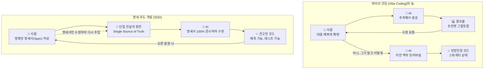

# 마이크로 세션: 033 — SDD(Specification-Driven Development)의 이해

> **세션 ID**: MS-PY101-033  
> **소요 시간**: 20분  
> **난이도**: medium  
> **청크 타입**: narrative  
> **버전**: v2.1 (7섹션 구조)

---

## §1. 개요

> **Day 2 | AM | 마지막 세션**

이 세션은 5W1H를 통해 도출한 요구사항을 어떻게 실제 코드로 변환할 것인지, 그 패러다임의 전환을 다루는 Day 2 오전의 하이라이트 시간이에요. 최근 유행하는 '느낌적인 느낌'의 코딩 방식이 가진 치명적인 함정을 파헤치고, 우리가 왜 귀찮더라도 명세서를 작성해야 하는지 그 당위성을 뼛속 깊이 새기는 세션입니다. 

### 🎯 학습 목표

이 세션이 끝나면 수강생은 다음을 할 수 있어요:

- 바이브 코딩(Vibe Coding)의 5가지 치명적 한계를 다른 사람에게 설명할 수 있습니다.
- SDD(명세 주도 개발)의 4단계 프로세스를 이해하고 코딩의 기준으로 삼을 수 있습니다.
- 완벽한 명세서가 AI 코딩 시대의 유일한 진실의 원천(Single Source of Truth)임을 깨닫고, 오케스트라 지휘자로서의 마인드셋을 갖춥니다.

### 선행 세션 환기

바로 이전 세션인 032에서 우리는 스타버스팅 기법과 5W1H 체크리스트를 통해 머릿속의 막연한 아이디어를 구체적인 요구사항으로 쪼개는 훈련을 했어요. 이제 그 쪼개진 요구사항들을 모아서 AI에게 어떻게 전달해야 가장 완벽한 결과물을 얻을 수 있는지, 그 결정적인 방법론을 배울 차례입니다.

---

## §2. 핵심 개념 (+ 🗣️ 강사 대본 + Mermaid)

### 바이브 코딩의 환상과 SDD의 현실주의

최근 AI 커뮤니티에서 가장 핫한 키워드 중 하나가 바로 "바이브 코딩(Vibe Coding)"이에요. 바이브, 즉 느낌과 기분 가는 대로 AI에게 지시를 던지며 코딩하는 방식을 말합니다. 처음에는 이 방식이 마법처럼 느껴집니다. "대충 예쁜 투두리스트 만들어줘"라는 한마디에 그럴듯한 프로그램이 뚝딱 나오니까요. 하지만 프로그램이 조금만 복잡해지면 이 마법은 곧 악몽으로 변합니다. 

이를 극복하기 위해 등장한 것이 바로 SDD(Specification-Driven Development, 명세 주도 개발)입니다. SDD는 느낌이 아니라 텍스트로 고정된 '명세서'를 코드 생성의 절대적인 기준으로 삼는 방법론이에요. 이 두 방식의 차이를 가장 잘 보여주는 것이 바로 인테리어 리모델링 비유입니다.

🗣️ **강사 대본 (Instructor Script)**:

> 여러분, 이전 세션에서 5W1H로 요구사항을 꼼꼼하게 따져보는 연습을 하셨죠? 그런데 막상 화면에 프롬프트 창을 띄우면 십중팔구 이런 유혹에 빠지게 됩니다. "아, 복잡하게 쓰기 귀찮은데 그냥 '알아서 예쁘게 짜줘'라고 해볼까?"
>
> 요즘 이걸 멋있는 말로 '바이브 코딩(Vibe Coding)'이라고 부릅니다. 기분 가는 대로, 느낌대로 툭툭 던지면서 코딩하는 거예요. "버튼 좀 더 크게 해봐", "아니, 색깔이 촌스럽잖아. 세련되게 바꿔", "여기에 로그인 기능도 하나 붙여줘" 이런 식이죠. 처음 10분은 정말 신세계입니다. 내가 천재 개발자가 된 것 같고, AI가 내 마음을 찰떡같이 알아채는 것 같아요.
>
> 하지만 딱 1시간만 지나보세요. 프로그램은 누더기가 됩니다. 로그인 기능을 붙였더니 갑자기 화면 색깔이 다시 옛날로 돌아가고, 버튼은 엉뚱한 곳에 가 있습니다. 왜 그럴까요?
>
> 여러분이 인테리어 리모델링을 한다고 상상해 봅시다. 동네 구멍가게 사장님이 인테리어 업자에게 "그냥 알아서 밝고 예쁘게 해주세요"라고 합니다. 업자는 나름대로 열심히 시공을 하겠죠. 하지만 결과물을 본 사장님은 "어, 이게 아닌데? 조명이 너무 하얀데요? 다시 해주세요"라고 합니다. 또 고치고, 또 뜯어고치고. 비용과 시간은 무한정 늘어납니다. 이것이 바이브 코딩의 씁쓸한 현실이에요.
>
> 반면 대기업의 인테리어는 어떨까요? 그들은 시공 업체에 수백 페이지짜리 '요구사항 명세서'를 건넵니다. 벽지 색상은 먼셀 코드 N7, 천장 높이는 2.7미터, 조명은 4000K 색온도의 LED, 콘센트 위치는 바닥에서 30센티미터. 밀리미터 단위까지 적혀 있습니다. 시공 업체는 오직 이 문서만 보고 완벽하게 시공을 끝냅니다. "알아서 해줘"라는 말은 어디에도 없어요.
>
> 우리도 마찬가지입니다. AI라는 세계 최고의 초고속 시공 업체를 제대로 부리려면, 우리 스스로가 철저한 명세서를 작성하는 대기업의 기획자가 되어야 합니다. 그리고 그 명세서를 쓰는 방법론이 바로 오늘 우리가 배울 SDD, 즉 명세 주도 개발입니다.

> 💡 **강사 노트**: 바이브 코딩이라는 최신 트렌드 용어를 사용하면 수강생들의 흥미를 크게 끌어올릴 수 있습니다. 인테리어 비유를 할 때는 강사의 목소리 톤을 바꿔서 구멍가게 사장님의 당황한 목소리와 대기업 담당자의 단호한 목소리를 연기해 주시면 더욱 효과적입니다.

### Mermaid 다이어그램: 바이브 코딩 vs SDD



이 다이어그램은 두 접근법의 결정적인 차이를 보여줍니다. 바이브 코딩은 사람과 AI가 파편화된 대화를 주고받으며 늪에 빠지지만, SDD는 중간에 흔들리지 않는 굳건한 바위 같은 '명세서'를 두고 AI가 오직 그 문서만 바라보고 작업하게 만드는 구조예요.

---

## §3. 상세 내용

### Why — 왜 바이브 코딩은 실패하고 SDD가 필요한가?

초보자들이 가장 쉽게 빠지는 함정이 바로 "말로 대충 설명하면 AI가 찰떡같이 알아듣겠지"라는 착각이에요. 하지만 바이브 코딩에는 절대 무시할 수 없는 5가지 치명적인 한계가 도사리고 있습니다.

1. **맥락 증발 (Context Amnesia)**: 대화가 5턴, 10턴 길어지면 AI는 처음에 당신이 지시했던 중요한 규칙들을 까맣게 잊어버립니다. "파이썬 내장 라이브러리만 써"라고 했던 첫 지시를 잊고 갑자기 외부 패키지를 설치하라고 안내하기 시작하죠.
2. **파편화 (Fragmentation)**: 오늘은 로그인 기능을 고치고, 내일은 장바구니 기능을 고칩니다. 각각의 대화창에서 생성된 코드는 서로 규격이 맞지 않는 퍼즐 조각처럼 되어버려서, 나중에 합치려고 하면 프로그램이 완전히 깨져버립니다.
3. **기술 부채 (Technical Debt)**: 작동만 되게끔 땜질식으로 처방받은 코드들이 차곡차곡 쌓입니다. 나중에는 어디서부터 손을 대야 할지 모르는 괴물 같은 코드가 탄생하게 됩니다.
4. **아키텍처 표류 (Architecture Drift)**: 전체적인 집의 설계도 없이, 그때그때 필요에 따라 방을 하나씩 덧대는 꼴입니다. 결국 집의 구조 자체가 붕괴되는 지점에 이릅니다.
5. **테스트 불가 (Untestable)**: 애초에 '무엇을 만들겠다'는 명확한 기준(명세)이 없었기 때문에, 코드가 완성되어도 이것이 성공인지 실패인지 테스트하고 평가할 객관적인 기준점 자체가 존재하지 않습니다.

이런 끔찍한 결말을 막기 위해서는, 대화창의 스크롤 위로 날아가 버리는 채팅이 아니라 언제든 다시 꺼내볼 수 있는 텍스트 문서, 즉 '명세서(Specification)'가 필요합니다.

### What — SDD(명세 주도 개발)란 정확히 무엇인가?

SDD는 인간과 AI의 역할을 명확하게 분리하는 방법론입니다. **인간은 '무엇을 만들 것인가(What)'를 고민하여 명세서를 기획하고, AI는 '어떻게 만들 것인가(How)'를 고민하여 코드를 구현합니다.** 

이 과정에서 작성된 명세서는 개발 용어로 **'유일한 진실의 원천(Single Source of Truth)'**이 됩니다. 만약 코드가 이상하게 작동한다면, 프롬프트 창에서 AI와 말싸움을 할 것이 아니라 조용히 명세서 문서를 열어 내용이 모호하지 않았는지 수정하고, 그 수정된 명세서를 다시 AI에게 던져주어야 합니다. 이것이 SDD의 핵심 철학이에요. 코드를 고치는 것이 아니라 명세서를 고치는 것입니다.

### How — SDD는 어떻게 작동하는가? (4단계 프로세스)

SDD는 아주 체계적인 4개의 단계로 이루어져 있어요. 이 흐름을 타면 아무리 복잡한 프로그램도 흔들림 없이 완성할 수 있습니다.

1. **Spec (명세 작성)**: 만들고자 하는 프로그램의 기능, 데이터 규칙, 제약 사항을 마크다운 문서로 명확하게 작성합니다. 이때 앞서 배운 5W1H와 다음 세션에서 배울 PRD(제품 요구사항 정의서) 포맷이 강력한 무기가 됩니다.
2. **Plan (실행 계획)**: 코드를 바로 짜라고 지시하지 않습니다. AI에게 명세서를 주면서 "이 명세를 구현하기 위한 단계별 작업 계획을 먼저 세워봐"라고 지시합니다. (Chain-of-Thought 기법 적용)
3. **Task (작업 분할)**: AI가 세운 계획을 사람이 검토하고 승인하면, 한 번에 전체 코드를 짜는 것이 아니라 작은 단위의 태스크별로 나누어 코드를 생성하도록 통제합니다.
4. **Code (코드 생성 및 검증)**: 생성된 코드를 실행해 보고, 문제가 발견되면 코드를 직접 수정하는 대신 원래의 Spec(명세서)으로 돌아가 예외 조항을 추가한 뒤 다시 코드를 뽑아냅니다.

마치 오케스트라의 지휘자처럼, 여러분은 직접 악기를 연주(코딩)하지 않습니다. 완벽한 악보(명세서)를 들고 전체적인 조화와 흐름을 통제하며 수십 명의 AI 연주자들을 이끄는 마에스트로가 되는 것입니다.

---


### 📊 참고 표 (Visual Specs)

**SDD vs 전통적 개발 방식 비교**

| 구분 | 전통적 개발 (수동 코딩) | SDD (AI-Native 개발) |
|:---|:---|:---|

## §4. 실습 가이드 (+ 🎙️ 실습 대본)

### 실습 목표

이 실습의 목적은 수강생들이 바이브 코딩의 막막함과 SDD의 명쾌함을 피부로 직접 비교 체감하는 거예요. 동일한 주제(투두리스트)를 가지고 두 가지 방식으로 프롬프팅을 해보며 결과물의 질적 차이를 눈으로 확인합니다.

🎙️ **실습 가이드 대본 (Lab Guide)**:

> 자, 여러분의 화면에 있는 AI(Gemini 또는 Claude) 창을 열어주세요. 지금부터 우리가 얼마나 쉽게 바이브 코딩의 유혹에 빠지는지 직접 실험해 보겠습니다.
>
> **라운드 1: 바이브 코딩입니다.** 프롬프트 창에 딱 한 줄만 쳐보세요. *"파이썬으로 투두리스트 프로그램 대충 이쁘고 쓸만하게 짜줘."* 자, 결과가 나왔죠? 겉보기엔 그럴듯한 코드가 나왔을 겁니다. 하지만 자세히 살펴보세요. 데이터를 파일에 저장하나요? 아니면 프로그램이 꺼지면 데이터도 날아가나요? 화면은 웹사이트인가요, 아니면 까만 콘솔 창인가요? AI마다 다 제각각으로 만들어줬을 거예요. 왜냐하면 우리가 '기준'을 주지 않았기 때문입니다.
>
> **라운드 2: SDD 스타일입니다.** 이번에는 제가 화면에 띄워드린 '투두리스트 명세서' 마크다운 텍스트를 그대로 복사해서 프롬프트 창에 붙여넣고, 이렇게 덧붙이세요. *"이 명세서를 100% 준수하여 파이썬 코드를 작성해 줘. 명세에 없는 기능은 절대 임의로 추가하지 마."*
>
> 결과가 어떻게 다른가요? 놀랍게도 여러분 모두가 짠 듯이 동일한 구조와 제약 조건을 가진 코드를 얻었을 겁니다. 바로 이것이 명세서가 가진 통제력입니다. 대화가 아무리 길어져도, 이 명세서 텍스트만 꽉 쥐고 있으면 언제든 길을 잃지 않고 원래의 목적지로 돌아올 수 있습니다.

### 단계별 지시

| 단계 | 소요 시간 | 강사 지시사항 | 학습자 액션 | 예상 결과 |
|------|----------|--------------|------------|----------|
| 1 | 3분 | "바이브 코딩 스타일로 한 줄 프롬프트를 입력해 보세요." | 1줄짜리 모호한 프롬프트 실행 | 각자 전혀 다른, 예측 불가능한 결과물 생성 |
| 2 | 2분 | 결과물 비교 및 문제점 짚어주기 (맥락 증발의 시작점) | 동료의 화면과 자신의 결과물 비교 | "내 의도와 다르게 만들어졌네"라는 깨달음 |
| 3 | 5분 | 미리 준비된 마크다운 명세서 제공 및 SDD 방식 실행 | 명세서를 통째로 복사하여 프롬프트로 주입 | 명세 조건을 정확히 따르는 일관된 코드 생성 |
| 4 | 5분 | 바이브 코딩의 5대 한계와 SDD 4단계 이론 매핑 설명 | 경청 및 노트 필기 | SDD 방법론의 필요성에 대한 깊은 공감 |

### 트러블슈팅 FAQ

| Q | A |
|---|---|
| "바이브 코딩으로도 제가 원하는 게 한 번에 잘 나왔는데요?" | "운이 좋았던 경우입니다. 하지만 나중에 기능을 5개쯤 더 추가해 달라고 해보세요. 코드가 완전히 꼬이기 시작할 겁니다. 우리는 운에 기대는 코딩이 아니라, 예측 가능한 엔지니어링을 배워야 합니다." |
| "명세서를 마크다운으로 작성해야만 AI가 잘 알아듣나요?" | "마크다운의 `#`이나 `-` 같은 기호가 AI에게는 정보의 구조와 위계를 알려주는 훌륭한 이정표 역할을 합니다. 일반 줄글보다 훨씬 인식률이 높습니다." |
| "명세서 쓰기가 너무 귀찮고 막막해요." | "걱정 마세요. 명세서를 백지에서 혼자 쓰는 것이 아닙니다. 다음 세션에서 AI를 훌륭한 기획 파트너로 삼아, 대화를 통해 명세서를 뽑아내는 마법 같은 기술을 배우게 될 겁니다." |

---


### 🎓 강사 노트 (Instructor Support)

- ⏱️ **타이밍**: 14:15 (20분, narrative)
- 🎯 **핵심 활동**: "말이 되어야 프로그램이 된다"
- ⚠️ **강사 주의사항**: 핵심 철학. 에너지 올려서 전달

## §5. 코드 및 명령어 모음

수강생들이 라운드 2(SDD 실습)에서 복사하여 사용할 마크다운 명세서 원문입니다. 실습 자료 게시판이나 메신저를 통해 미리 배포해 주세요.

```markdown
## 투두리스트 명세서 (Specification)

### 1. 핵심 기능
- **할 일 추가**: 사용자가 텍스트로 제목을 입력하여 새로운 할 일을 등록한다.
- **목록 조회**: 고유 번호, 할 일 제목, 완료 여부(O/X)를 목록 형태로 화면에 출력한다.
- **완료 처리**: 고유 번호를 입력받아 해당 할 일의 상태를 완료(O)로 변경한다.
- **할 일 삭제**: 고유 번호를 입력받아 해당 할 일을 목록에서 완전히 제거한다.

### 2. 기술 및 제약 사항
- 언어: 파이썬 (Python 3.x)
- 라이브러리: 외부 패키지 설치 없이 파이썬 내장 기능만 사용할 것.
- 사용자 인터페이스: 텍스트 기반의 터미널/콘솔 환경.
- 데이터 무결성: 잘못된 번호나 문자를 입력했을 때 프로그램이 종료되지 않고 안내 메시지를 띄울 것.

### 3. 데이터 저장 방식
- 실행 중인 메모리(리스트 자료형)에만 보관하며, 파일이나 DB에 저장하지 않는다.
```

**🤖 SDD 적용 마스터 프롬프트 예시:**
> "너는 10년 차 파이썬 시니어 엔지니어링 리더야. 위에서 제공한 [투두리스트 명세서] 문서를 유일한 진실의 원천(Single Source of Truth)으로 삼아 파이썬 코드를 작성해 줘. 명세에 명시된 제약 사항을 100% 엄격하게 준수하고, 묻지도 따지지도 않고 임의의 기능을 덧붙이지 마."

---

## §6. 요약

### 핵심 학습 포인트

이번 세션의 핵심은 코딩의 주도권을 AI에게 넘기되, '설계의 주도권'은 절대 놓지 말아야 한다는 것입니다. 바이브 코딩은 처음 10분의 쾌락을 주지만 결국 스파게티 코드라는 기술 부채를 남깁니다. 반면 SDD(명세 주도 개발)는 완벽하게 구조화된 텍스트 문서(명세서)를 중심에 두고, 이를 기준으로 AI와 소통하는 전문가의 방식입니다. 여러분은 더 이상 코더가 아니라, 명세서라는 악보를 쥐고 AI 연주자들을 이끄는 오케스트라 지휘자입니다.

### 다음 세션 예고

"명세서가 중요한 건 알겠는데, 초보자인 내가 어떻게 저렇게 꼼꼼한 문서를 다 쓰지?"라는 걱정이 드실 거예요. 바로 다음 세션(034)에서는 AI를 단순한 코딩 도구가 아니라 '수석 기획 컨설턴트'로 활용하여, 대화를 통해 빈틈없는 요구사항 명세서를 자동으로 완성해 내는 역프롬프팅(Reverse Prompting) 실습을 진행하겠습니다.

### 브릿지 노트

> "바이브 코딩의 달콤한 유혹을 떨쳐내고 SDD의 길을 걷기로 결심하셨나요? 훌륭합니다. 하지만 명세서를 작성하는 일이 고독하고 외로운 작문 시간이 될 필요는 없습니다. 우리의 든든한 조수 AI를 '기획 파트너'로 용도 변경해 볼 시간입니다. 다음 세션으로 넘어가 볼까요?"

---

## §7. 참고 자료

### 3-Source 출처

- **Source B (NotebookLM)**: 팩트 패킷의 세션 033 데이터 — "인간은 명세(What)를 기획하고, AI는 구현(How)을 실행한다"는 SDD의 핵심 패러다임 전환과 바이브 코딩의 5대 한계 개념.
- **Source C (Deep Research)**: 대기업 외주 비유와 오케스트라 지휘자 메타포, 그리고 SDD의 4단계 프로세스(Spec -> Plan -> Task -> Code) 모델링 기반 자료.
- **Source A (로컬 참고자료)**: `AI 시대의 서사 v3 - Claude.md` 및 `7 기획.pdf` — 명세서 작성의 실무 가이드라인과 단일 진실의 원천(Single Source of Truth)이라는 아키텍처 원칙.

### 추가 학습 자료

- [AI 시대의 서사 v3 - Claude.md](../참고자료/AI_시대의_서사_v3_Claude.md): SDD 파트 복습용
- [7 기획.pdf](../참고자료/7_기획.pdf): 명세서 작성의 실무 템플릿 참조

### 교안 원문 (v1.0 백업)

> **강사 노트**: 본 세션은 기존 v1.0의 개념을 7섹션 포맷에 맞게 재구성하고 강사의 스토리텔링 대본과 실습 과정을 구체화한 v2.1 업데이트 버전입니다. 특히 Day 2 팩트 패킷에 명시된 '바이브 코딩의 5대 한계'와 '오케스트라 지휘자 비유'를 전면 배치하여 청중의 몰입도를 극대화하도록 설계되었습니다.

---

## ✅ 세션 완료 체크리스트 (강사용)

- [ ] §1~§7 모든 섹션이 빠짐없이 충실하게 작성되었는가?
- [ ] 구어체와 서술형 문장으로 학습자와 대화하듯 부드럽게 전개되었는가?
- [ ] 인테리어 리모델링 및 오케스트라 지휘자 비유가 적절히 사용되었는가?
- [ ] 바이브 코딩의 5가지 한계와 SDD 4단계 프로세스가 명확히 비교 설명되었는가?
- [ ] 3-Source 팩트 패킷의 핵심 내용(세션 033)이 완벽히 녹아들었는가?

---

*작성 일시: 2026-02-25*  
*작성 에이전트: A4B_Session_Writer*  
*교안 구조: 7섹션 (A0 팀 공통 표준)*
