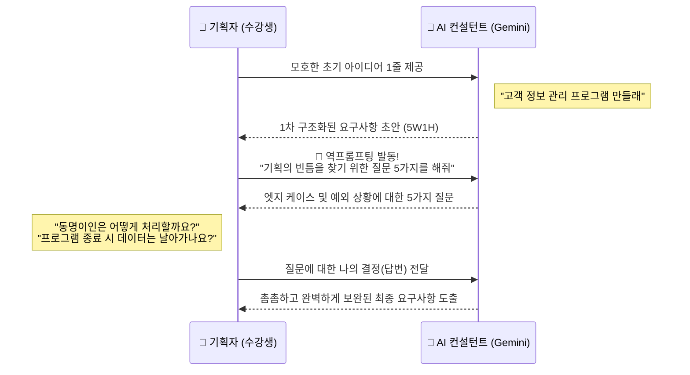

# 마이크로 세션: 034 — AI와 함께하는 요구사항 작성 실습

> **세션 ID**: MS-PY101-034  
> **소요 시간**: 25분  
> **난이도**: medium  
> **청크 타입**: lab  
> **버전**: v2.1 (7섹션 구조)

---

## §1. 개요

> **Day 2 | PM | 세션 034/043**

### 🎯 학습 목표

이 세션이 끝나면, 수강생은 다음을 할 수 있습니다:

- 초기 아이디어를 AI와의 상호작용을 통해 구체적이고 촘촘한 요구사항으로 발전시킬 수 있다.
- AI를 코딩만을 위한 도구가 아닌, 브레인스토밍과 기획을 돕는 "기획 컨설턴트"로 대우하고 활용할 수 있다.
- 역프롬프팅(Reverse Prompting) 기법을 사용해 자신이 미처 생각하지 못한 기획의 빈틈과 엣지 케이스를 찾아낼 수 있다.

### 선행 세션 환기

바로 직전 세션(세션 033)에서 우리는 SDD(명세 주도 개발)의 중요성을 배웠습니다. 개발자가 느낌표나 영감에 의존해 주먹구구식으로 코드를 짜는 "바이브 코딩"이 얼마나 위험한지, 그리고 명세서가 곧 유일한 진실의 원천이 되어야 한다는 것을 깨달았죠. 명세서 → 계획 → 작업 → 코드의 4단계 프로세스까지 이해했습니다. 

그런데 여기서 큰 벽에 부딪히는 분들이 많습니다. "명세서가 중요한 건 알겠는데, 빈 종이 앞에서 완벽한 명세서를 처음부터 어떻게 쓰죠?" 맞습니다. 누구나 막막합니다. 인간은 무에서 유를 창조하는 '작성'보다, 이미 있는 것을 다듬는 '편집'에 훨씬 강하거든요. 그래서 오늘 실습에서는 이 막막함을 AI와 함께 타파해 봅니다. AI를 여러분의 전담 "기획 컨설턴트"로 고용할 시간입니다.

---

## §2. 핵심 개념 (+ 🗣️ 강사 대본 + Mermaid)

### 요구사항 작성 = "창업 컨설팅 받기"

여러분이 카페를 창업한다고 상상해 봅시다. 머릿속에는 그저 "아늑하고 예쁜 카페를 열고 싶다"는 뭉뚱그려진 아이디어만 있습니다. 이 상태로 바로 인테리어 업자를 부르면(바이브 코딩) 어떻게 될까요? 주방 동선은 엉키고, 콘센트는 엉뚱한 곳에 있고, 배수구는 막히는 대참사가 일어날 겁니다. 

그래서 우리는 전문 창업 컨설턴트(AI)를 찾아갑니다. 컨설턴트에게 "카페를 열고 싶어요"라고 한 줄만 던져주면, 컨설턴트는 전문가의 시선으로 수많은 질문을 쏟아냅니다. "타깃 고객은 대학생입니까, 직장인입니까?", "테이크아웃 비중이 높나요?", "비 오는 날이나 배달 주문이 밀릴 때는 어떻게 대처할 건가요?" 여러분은 그 질문에 대답만 하면 됩니다. 대답을 하다 보면 어느새 시장 분석부터 입지 선정, 메뉴 구성, 예외 상황에 대한 대처(엣지 케이스)까지 촘촘하게 짜여진 완벽한 사업 계획서(명세서)가 눈앞에 나타납니다.

이것이 바로 AI를 대하는 올바른 태도입니다. AI에게 "파이썬으로 고객 정보 관리 프로그램 짜줘"라고 툭 던지고 코딩 노예처럼 부리지 마세요. 그 대신, "내가 고객 정보 관리 프로그램을 만들 건데, 완벽한 요구사항을 정의하기 위해 날카로운 질문을 해줘"라고 동료 기획자로서 대우해야 합니다.

🗣️ **강사 대본 (Instructor Script)**:

> 여러분, 빈 종이의 공포를 느껴보신 적 있나요? 과제를 하든 기획서를 쓰든, 깜빡이는 커서만 쳐다보고 있으면 머리도 하얗게 변하죠. 명세서 작성도 마찬가지입니다. 완벽한 기능을 처음부터 텍스트로 다 써내야 한다는 압박감은 전문가에게도 스트레스입니다.
> 
> 하지만 우리에겐 15년 경력의 시니어 기획자가 항상 대기하고 있습니다. 바로 여러분 화면 속에 있는 AI죠. 오늘 실습에서는 코딩을 한 줄도 하지 않습니다. 대신 끊임없이 대화할 겁니다. 여러분의 엉성한 한 줄짜리 아이디어를 AI에게 던지면, AI가 5W1H 관점에서 뼈대를 잡아줄 거예요. 그리고 가장 중요한 것, 바로 '역프롬프팅'을 통해 AI가 여러분에게 뼈 때리는 질문을 던지게 만들 겁니다. "동시에 두 명의 고객이 같은 이름으로 가입하면 어떻게 하죠?" 이런 엣지 케이스를 우리가 혼자 다 생각할 필요가 없습니다. 똑똑한 동료와 티키타카(대화)만 하세요.

### Mermaid 다이어그램: 역프롬프팅 기반 요구사항 구체화 흐름



---

## §3. 상세 내용

### Why — 왜 AI를 기획 컨설턴트로 활용해야 하는가?

코드를 짜는 것보다 '무엇을 짜야 할지' 정의하는 것이 백 배는 더 어렵습니다. 개발 현장에서 발생하는 오류의 70% 이상은 코딩 실수가 아니라 "기획의 빈틈"에서 발생합니다. 특히 초보자일수록 정상적으로 작동하는 '해피 패스(Happy Path)'만 상상할 뿐, 사용자가 실수하거나 데이터가 꼬이는 '엣지 케이스(Edge Case)'를 상상하지 못합니다. 

인간의 뇌는 한 번에 고려할 수 있는 변수의 한계가 있습니다. 하지만 AI는 전 세계의 수많은 프로젝트 실패 사례와 기획서를 학습한 거대한 지식의 덩어리입니다. "내가 놓친 게 뭘까?"라는 단 한 번의 질문만으로, 인간의 맹점을 완벽하게 보완해주는 방패막이가 되어줍니다.

### What — 역프롬프팅(Reverse Prompting)이란 무엇인가?

프롬프팅의 일반적인 방향성은 '인간이 질문하고 AI가 답하는 것'입니다. 반면 역프롬프팅(Reverse Prompting)은 이 주도권을 완전히 뒤집는 기법입니다. AI에게 특정한 페르소나(예: 시니어 IT 기획 컨설턴트)를 부여한 뒤, 완벽한 결과물을 만들기 위해 **"AI가 인간에게 역으로 질문하게 만드는"** 고도의 프롬프트 엔지니어링 전략입니다.

초보자는 빈 종이를 채워야 할 때 무엇을 적어야 할지조차 몰라서 막막해합니다. 역프롬프팅은 이 '질문조차 떠오르지 않는 상태'를 돌파하는 최고의 무기입니다. AI가 5~6개의 객관식이나 서술형 질문을 던져주면, 인간은 그 질문에 대해 '선택'하거나 '대답'하기만 하면 됩니다. 

### How — 요구사항을 구체화하는 3단계 프로세스

AI와 대화하며 요구사항을 탄탄하게 다져가는 과정은 다음과 같이 3단계로 진행됩니다.

1.  **아이디어 던지기 (Zero to One)**: 포맷에 얽매이지 않고 내가 만들고 싶은 프로그램의 핵심 기능을 투박한 언어로 작성합니다.
2.  **구조화 요청하기 (Structuring)**: 투박한 문장을 AI에게 주면서, 5W1H(누가, 언제, 어디서, 무엇을, 어떻게, 왜) 구조로 나누고 기능 요구사항(FR)과 비기능 요구사항(NFR)으로 초안을 잡아달라고 지시합니다.
3.  **역프롬프팅으로 빈틈 메우기 (Refining)**: "이 기획에서 내가 미처 생각하지 못한 엣지 케이스 3가지를 찾고, 날카로운 질문 5가지를 나에게 해줘"라고 요청한 뒤, AI의 질문에 답하며 문서를 업그레이드합니다.

> ✅ **체크포인트**: 여기까지 이해했는지 스스로 점검해 보세요.
> - 역프롬프팅(Reverse Prompting)의 방향성이 일반적인 프롬프트와 어떻게 다른가요? ("내가 질문하는 것이 아니라, AI가 나에게 역으로 질문하게 만드는 것")
> - 엣지 케이스(Edge Case)를 인간이 직접 찾는 것보다 AI에게 묻는 것이 유리한 이유는 무엇인가요? ("초보자는 정상 작동 상황만 상상하기 쉬우며, 인간의 인지적 맹점을 AI의 방대한 데이터로 보완할 수 있기 때문")

---

## §4. 실습 가이드 (+ 🎙️ 실습 대본)

### 실습 목표

이 실습을 통해 수강생은 모호한 아이디어를 AI와의 상호작용(역프롬프팅)을 통해 구체적이고 엣지 케이스가 방어된 요구사항 초안으로 발전시키는 경험을 합니다.

🎙️ **실습 가이드 대본 (Lab Guide)**:

> 자, 이제 여러분의 손으로 직접 '고객 정보 관리 프로그램'을 기획해 보겠습니다. 총 15분 정도 소요되는 3단계 실습입니다. 가장 먼저 할 일은 여러분의 상상력을 조금 발휘하는 겁니다. 멋진 포맷은 필요 없어요. 메모장에 "이런 기능이 있었으면 좋겠다"는 것을 딱 3개만 적어보세요.
> 
> 그런 다음, Agent Manager를 열어서 AI 컨설턴트를 소환할 겁니다. 제가 드리는 마스터 프롬프트를 복사해서 붙여넣어 보세요. 놀라운 속도로 여러분의 엉성한 세 줄이 전문적인 기획서 초안으로 탈바꿈할 겁니다. 하지만 여기서 끝나면 안 됩니다. 오늘 실습의 꽃은 바로 3단계 '역프롬프팅'입니다. AI가 여러분에게 날리는 송곳 같은 질문을 받아내고, 거기에 대답하면서 기획의 빈틈을 메워봅시다!

### 단계별 지시 — AI 컨설턴트와 티키타카하기

| 단계 | 소요 시간 | 강사 지시사항 | 학습자 액션 | 예상 결과 |
|------|----------|--------------|------------|----------|
| 1단계 | 5분 | "아이디어를 메모장에 투박하게 적어보세요" | "고객 이름, 전화번호 등록/조회/수정/삭제" 등 최소 3개 기능 자유 형식으로 작성 | 3~4줄의 간단한 아이디어 텍스트 생성 |
| 2단계 | 10분 | "Agent Manager에 1차 프롬프트를 입력하세요" | 아래 제공된 **[프롬프트 1]** 복사 후 본인 아이디어 추가하여 입력 | 5W1H, FR/NFR, 엣지 케이스가 포함된 1차 구조화 초안 도출 |
| 3단계 | 10분 | "역프롬프팅으로 AI의 질문을 유도하세요" | 1차 초안 응답 아래에 **[프롬프트 2]** 복사하여 연속 대화 진행 | AI가 예외 상황 및 기획의 빈틈에 대한 날카로운 질문 5가지 제시 |
| 4단계 | 5분 | "AI의 질문에 구체적으로 답변해 보세요" | 번호를 매겨 1~5번 질문에 짧게 답변 입력 | 답변 내용이 반영된 훨씬 견고한 최종 요구사항 문서 완성 |

**[1단계] 아이디어 메모 (Zero to One)**

컴퓨터 메모장이나 종이 포스트잇을 꺼내세요. 여러분이 콘솔 기반 파이썬으로 '고객 정보 관리 프로그램'을 만든다고 상상하고, 꼭 들어가야 할 기능을 생각나는 대로 적어보세요. (예: 이름 넣기, 전화번호로 검색하기, VIP 고객 표시하기 등)

**[2단계] AI 컨설턴트 1차 활용 (Structuring)**

Antigravity IDE의 Agent Manager를 엽니다. 아래 **§5. 코드 및 명령어 모음**에 있는 **[명령어/프롬프트 1]**을 복사한 뒤, '현재 아이디어' 부분에 여러분이 방금 1단계에서 쓴 내용을 붙여넣고 전송하세요. 
여러분의 투박한 아이디어가 5W1H (누가, 언제, 어디서, 무엇을, 어떻게, 왜) 구조와 FR(기능 요구사항), NFR(비기능 요구사항)로 깔끔하게 정리되어 출력되는 것을 확인하세요.

**[3단계] 역프롬프팅 발동 (Refining)**

결과물이 제법 멋지지만, 아직 진짜배기가 남았습니다. 1차 답변을 받은 같은 채팅창에서 바로 **[명령어/프롬프트 2]**를 복사해서 전송하세요.
"내 기획의 빈틈을 찾기 위한 날카로운 질문 5가지를 던져달라"는 이 프롬프트가 바로 역프롬프팅의 핵심입니다.

**[4단계] 질문에 대답하며 기획 보완하기**

AI가 "전화번호를 입력할 때 하이픈(-)을 강제할까요?", "동명이인은 어떻게 구분하나요?" 같은 질문을 던졌을 겁니다. 채팅창에 1번부터 5번까지 번호를 매겨 여러분의 결정을 짧게 대답해 주세요. "1번은 하이픈 없이 숫자만, 2번은 중복 등록 허용 안 함" 처럼요. AI가 여러분의 대답을 반영하여 최종적으로 방어력이 극대화된 완벽한 기획서 초안을 다시 만들어 줄 겁니다.

### 트러블슈팅 FAQ

| Q | A |
|---|---|
| AI가 질문만 하라고 했는데 자기가 혼자 답까지 달아서 문서를 닫아버려요. | 프롬프트의 지시가 약해서 발생합니다. 프롬프트 끝에 "반드시 질문만 5개 나열하고, 내가 대답할 때까지 기다리세요."라는 제약을 추가해서 다시 전송해 보세요. |
| 역프롬프팅 질문이 너무 뻔하고 평범해요. ("이름은 길게 쓸까요?") | 여러분이 준 1단계 아이디어가 너무 단순할 수 있습니다. 프롬프트에 "극단적인 예외 상황(사용자가 엔터만 치는 경우 등)에 집중해서 아주 깐깐하고 날카롭게 질문해줘"라고 추가 지시를 내려보세요. |
| FR과 NFR의 차이가 정확히 이해가 안 가요. | FR(기능)은 "무엇을 하는가"(예: 로그인 기능)이고, NFR(비기능)은 "어떻게 하는가/조건"(예: 3초 안에 로딩, 외부 라이브러리 사용 금지)입니다. 우리가 자동차를 살 때 '굴러가는가'는 기능이고, '연비가 얼마인가'는 비기능입니다. |
| AI의 질문 5개 중 3개는 어떻게 답해야 할지 저도 모르겠어요. | 모르면 모른다고 대답하는 것이 최고의 프롬프팅입니다! "3번과 4번 질문은 나도 잘 모르겠어. 초보자가 파이썬으로 만들기 가장 쉽고 보편적인 방식으로 네가 추천해서 적용해 줘"라고 대답해 보세요. 컨설턴트에게 조언을 구하는 셈이죠. |

---


### 🎓 강사 노트 (Instructor Support)

- ⏱️ **타이밍**: 14:35 (25분, lab)
- 🎯 **핵심 활동**: 고객관리 PRD 초안 작성
- ⚠️ **강사 주의사항**: AI와 대화하며 문서화


### 📋 실습 설계 보강 (Lab Packet)

**세션 034 실습 설계 보강**

AI와 함께하는 요구사항 작성 실습
- **3-Stage Example Set**
  - 기본: 5W1H 체크리스트를 AI에게 전달 → 고객관리 요구사항 초안 생성
  - 변형: AI가 생성한 초안에서 빠진 항목 찾아서 추가 지시
  - 실수 해결: "AI가 너무 많은 기능을 넣어요" → "이번에 만들지 않는 것(Out of Scope)" 명시
- **난이도 예측**: 요구사항이라는 개념 자체가 추상적
- **타이밍 가이드**: 5W1H 정리 5분 | AI에게 초안 요청 5분 | 검수 및 수정 10분 | 정리 5분
- **심리적 장벽**: "요구사항을 왜 이렇게 길게 써야 해? 바로 코딩하면 안 돼?"
- **자가 점검**:
  - [ ] 5W1H 항목 중 최소 4개를 포함한 요구사항을 작성했는가?
  - [ ] AI가 생성한 초안을 읽고 1개 이상 수정·보완했는가?
  - [ ] "범위 외(Out of Scope)" 항목을 명시했는가?

## §5. 코드 및 프롬프트 모음

### 명령어/프롬프트 1: AI 컨설턴트 1차 초안 생성

```text
당신은 15년 경력의 시니어 IT 기획 컨설턴트입니다.

나는 콘솔 기반 파이썬 고객 정보 관리 프로그램을 기획 중입니다.
현재 아이디어: 
- 고객 이름, 전화번호 등록/조회/수정/삭제
- [이곳에 여러분이 메모한 내용을 추가하세요]

이 아이디어를 바탕으로:
1. 5W1H 구조로 정리된 요구사항 초안을 마크다운으로 작성해 주세요.
2. 기능 요구사항(FR)과 비기능 요구사항(NFR)을 명확히 구분해 주세요.
3. 내가 미처 생각하지 못했을 법한 프로그램 크래시(다운) 관련 엣지 케이스 3가지를 제안해 주세요.
```

### 명령어/프롬프트 2: 역프롬프팅 (빈틈 찌르기)

```text
방금 작성해주신 요구사항 초안을 잘 읽었습니다.
이제 이 기획의 빈틈을 찾기 위해, 시니어 기획자로서 저에게 날카로운 질문 5가지를 던져주세요.

특히 다음 관점에 집중해 주세요:
- 데이터 유효성 검사 (잘못된 입력 처리)
- 엣지 케이스와 예외 상황
- 프로그램의 종료와 데이터 저장 방식

주의: 문서를 바로 수정하지 말고, 번호를 매겨 질문 5개만 나열한 뒤 저의 답변을 기다려 주세요.
```

### 명령어/프롬프트 3: 질문에 답변하기 (예시 템플릿)

```text
질문에 대한 나의 답변입니다:
1. 전화번호는 하이픈(-) 없이 숫자만 입력받도록 강제해 주세요.
2. 이름이 중복되는 경우, 전화번호 뒷자리로 구분할 수 있게 해주세요.
3. 프로그램이 종료되면 데이터는 모두 날아가도 괜찮습니다. (초보자용 1회성 버전)
4. (나머지 질문에 대한 답변...)

이 답변을 모두 반영하여, 1차 요구사항 초안을 더 촘촘하고 완벽하게 업데이트해 주세요.
```

---

## §6. 요약

### 핵심 학습 포인트

이번 세션에서 우리는 코딩 창을 열지 않고도 AI와 대화하며 기획을 다듬는 놀라운 경험을 했습니다. 핵심은 세 가지입니다. 첫째, 빈 종이의 공포를 극복하기 위해 AI를 단순한 코드 생성기가 아닌 "시니어 기획 컨설턴트"로 대우해야 합니다. 둘째, 내가 모호한 아이디어를 던지면 AI가 5W1H 및 FR/NFR 구조로 체계화해 준다는 사실을 배웠습니다. 셋째, 가장 중요한 무기인 **역프롬프팅(Reverse Prompting)**을 통해, AI가 나에게 예외 상황과 엣지 케이스에 대한 질문을 던지게 함으로써 기획의 빈틈을 완벽하게 방어했습니다.

### 다음 세션 예고

이제 여러분의 채팅창 안에는 역프롬프팅을 거쳐 매우 단단해진 요구사항 초안이 들어있습니다. 그런데 실무에서는 이 초안을 채팅창에 그대로 두지 않고, 개발자 누구나 알아볼 수 있는 공식적인 문서 양식으로 변환합니다. 바로 다음 세션에서 배울 **PRD(Product Requirements Document)**입니다. 여러분이 만든 이 훌륭한 초안을 어떻게 PRD라는 멋진 마스터 명세서로 변신시킬지 기대해 주세요!

### 브릿지 노트

> "여러분, 채팅창에 최종 업데이트된 요구사항을 한 번 읽어보세요. 불과 15분 전, 포스트잇에 적었던 두세 줄짜리 낙서가 이렇게 전문적인 기획서의 뼈대로 진화했습니다. AI가 던진 날카로운 질문들에 답하면서 '아차, 이 부분은 생각 못 했네'라고 무릎을 탁 친 분들 계시죠? 그게 바로 역프롬프팅의 힘입니다. AI는 코딩을 돕기 전에 여러분의 기획력부터 10배로 증폭시켜 줍니다. 자, 뼈대가 생겼으니 다음 세션에서는 이 뼈대에 살을 붙여서, 진짜 실무에서 쓰는 공식 PRD 문서로 만들어 보겠습니다."

---

## §7. 참고 자료

### 3-Source 출처

- **Source A (로컬 참고자료)**: 「7 기획.pdf」 (SRC-A03) — 요구사항 분석의 본질, 역프롬프팅 기법 및 AI 기획 컨설턴트 활용 전략.
- **Source B (NotebookLM)**: SRC-B01 — 「AI 시대의 서사 v3」 기반, 문제 정의 vs 문제 해결의 패러다임 전환 및 브레인스토밍 파트너로서의 AI 활용법.
- **Source C (Deep Research)**: SRC-C02 — 엣지 케이스 도출과 역프롬프팅 실전 사례 분석, 요구사항 명세화 과정에서의 환각 방지 전략.

### 추가 학습 자료

- [Prompt Engineering Guide - Reverse Prompting](https://www.promptingguide.ai/): AI 주도형 질문 기법과 프롬프트 패턴 설계 가이드
- **Antigravity IDE Document**: 에이전트를 컨설턴트 페르소나로 설정하기 위한 컨텍스트 주입 방법론

### 강사 노트

> 💡 **강사 노트**: 초보 수강생들은 "코딩 수업인데 왜 자꾸 기획서를 쓰라고 하지?"라며 지루해할 수 있습니다. 이때 카페 창업 비유(바이브 코딩의 위험성)를 다시 한번 상기시켜 주세요. 또한 역프롬프팅 단계에서 "질문에 어떻게 대답할지 모르겠다"며 당황하는 수강생이 많습니다. '모르면 모른다고 대답하거나 AI에게 가장 쉬운 옵션을 추천해 달라고 하는 것도 훌륭한 실력'임을 강조하여 심리적 부담을 덜어주세요. 

---

## ✅ 세션 완료 체크리스트 (강사용)

- [ ] §1~§7 모든 섹션이 충실하게 작성되었는가?
- [ ] 창업 컨설턴트 비유가 §2에서 충분히 확장 및 설명되었는가?
- [ ] 역프롬프팅(Reverse Prompting)의 개념과 실습 단계가 명확히 제시되었는가?
- [ ] 단계별 실습표와 프롬프트 3종이 §4, §5에 포함되었는가?
- [ ] 트러블슈팅 FAQ가 3개 이상 포함되어 현실적인 문제를 다루고 있는가?
- [ ] 체크포인트 질문이 §3에 배치되어 수강생의 이해를 돕고 있는가?
- [ ] 3-Source 팩트 패킷이 §7에 반영되었는가?
- [ ] 다음 세션(035 PRD의 이해)으로 이어지는 브릿지 노트가 포함되었는가?

---

**🔗 선행 세션**: [세션-033] SDD(명세 주도 개발)의 이해  
**🔗 후행 세션**: [세션-035] PRD(Product Requirements Document)란 무엇인가?

---

*작성 일시: 2026-02-25*  
*작성 에이전트: A4B_Session_Writer*  
*교안 구조: 7섹션 (A0 팀 공통 표준)*