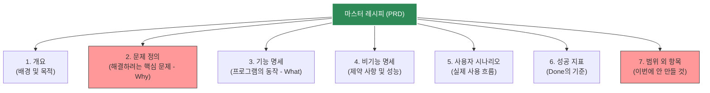

# 마이크로 세션: 035 — PRD(Product Requirements Document)란 무엇인가?

> **세션 ID**: MS-PY101-035  
> **소요 시간**: 20분  
> **난이도**: low  
> **청크 타입**: narrative  
> **버전**: v2.1 (7섹션 구조)

---

## §1. 개요

> **Day 2 | PM | 세션 035/043**

이 세션은 요구사항을 단순히 나열하는 것을 넘어, 체계적인 문서로 발전시키는 방법을 배우는 시간이에요. 앞서 우리는 브레인스토밍을 통해 기능들을 뽑아보았지만, 실무에서는 이 기능 목록만 들고 곧바로 코딩을 시작하지 않습니다. "무엇을 만들 것인가"에 "왜 만드는가"와 "누구를 위한 것인가"를 더해 프로젝트의 흔들리지 않는 나침반을 만드는 과정, 즉 PRD(제품 요구사항 정의서)의 개념과 구조를 익히는 것이 이 세션의 목표입니다.

### 🎯 학습 목표

이 세션이 끝나면 수강생은 다음을 할 수 있어요:

- 단순한 요구사항 목록과 PRD의 본질적인 차이를 "요리 재료와 마스터 레시피" 비유로 설명할 수 있습니다
- 프로젝트가 산으로 가는 현상인 '범위 이탈(Scope Creep)'을 PRD가 어떻게 예방하는지 이해합니다
- 파이썬 콘솔 프로젝트에 최적화된 경량 7섹션 PRD 구조를 파악하고 템플릿의 용도를 숙지합니다

### 선행 세션 환기

바로 이전 세션인 034에서 우리는 AI를 훌륭한 기획 컨설턴트로 삼아 역프롬프팅을 진행했어요. "내가 미처 생각하지 못한 엣지 케이스를 질문해 줘"라고 AI에게 지시해서, 고객 관리 프로그램에 필요한 "이름 저장, 삭제, 검색 기능" 같은 구체적인 요구사항 조각들을 성공적으로 뽑아냈습니다. 이제 이 흩어진 조각들을 하나의 견고한 설계도로 조립할 차례예요.

---

## §2. 핵심 개념 (+ 🗣️ 강사 대본 + Mermaid)

### 요리 재료와 마스터 레시피, 그리고 범위 이탈(Scope Creep)

요구사항 목록이 냉장고 속에 있는 당근, 양파, 고기라면, PRD는 이 재료들을 가지고 정확히 어떤 요리를 만들어낼지 적어둔 "마스터 레시피"예요. 재료만 덩그러니 있으면 요리를 하다가 갑자기 감자도 썰어 넣고, 간장도 붓게 되면서 원래 의도했던 카레가 정체불명의 잡탕 찌개로 변하기 쉽습니다. 소프트웨어 개발에서도 이렇게 중간에 자꾸 기능이 추가되고 방향이 틀어지는 현상을 '범위 이탈(Scope Creep)'이라고 부르는데, PRD는 이 치명적인 병을 막아주는 아주 강력한 백신 역할을 합니다.

🗣️ **강사 대본 (Instructor Script)**:

> 여러분, 지난 시간에 AI와 함께 뽑아낸 요구사항 초안들 기억하시죠? "고객 이름을 저장한다", "목록을 조회한다" 같은 훌륭한 재료들이 준비되었습니다. 그런데 실리콘밸리의 노련한 프로덕트 매니저(PM)들은 이 재료만으로는 절대 개발자에게 코딩을 시작하라고 지시하지 않습니다. 
>
> 비유를 하나 들어볼게요. 여러분이 친구 생일 파티를 위해 특별한 요리를 만들기로 했습니다. 주방에 당근, 양파, 돼지고기가 놓여 있어요. 자, 이게 우리가 방금 전까지 만든 "요구사항 목록"입니다. 이 재료들로 당장 요리를 시작할 수 있을까요? 카레를 만들 건지, 제육볶음을 할 건지, 아니면 볶음밥을 할 건지 방향이 없잖아요. 
>
> PRD는 바로 "오늘 우리는 매운 걸 못 먹는 친구를 위해 달콤한 일본식 카레를 만들 거다. 고기는 깍둑썰기를 하고, 끓이는 시간은 20분으로 한다"라고 명확히 적어둔 마스터 레시피입니다. 이 레시피가 없으면 어떻게 될까요? 요리를 하다가 누군가 "야, 떡볶이 떡도 넣자!", "치즈도 올리면 맛있지 않을까?" 하고 자꾸 아이디어를 던집니다. 결국 생일 파티 식탁에는 아무도 원하지 않았던 괴상한 찌개가 올라가게 되죠.
>
> 우리 업계에서는 이걸 "범위 이탈", 영어로 Scope Creep이라고 부릅니다. 프로젝트가 산으로 가는 현상이죠. PRD는 단순히 기능을 나열한 문서를 넘어 "이 프로그램은 왜 만드는지(Why)", "누가 쓰는지(Who)", "무엇을 만들지 않아야 하는지(Out of Scope)"를 명확히 선언해서, 개발 중간에 배가 산으로 가는 것을 완벽하게 차단해 줍니다. 나아가 이 문서를 AI에게 통째로 던져주면, AI는 기능만 겨우 돌아가는 깡통 코드가 아니라 우리 맥락을 100% 이해한 완성도 높은 프로그램을 짜주게 됩니다.

> 💡 **강사 노트**: 요리 비유를 사용할 때, 수강생들이 일상에서 겪어봤을 법한 "계획 없이 일하다가 일이 커진 경험"을 상기시켜 주면 공감대를 훨씬 크게 형성할 수 있습니다. 

### Mermaid 다이어그램: 경량 PRD 7섹션 구조



이 다이어그램은 우리가 작성할 파이썬 콘솔용 PRD의 7가지 뼈대를 보여줍니다. 특히 붉은색으로 칠해진 "2. 문제 정의"와 "7. 범위 외 항목"은 AI 시대의 개발에서 가장 중요한 방어선입니다. 무엇을 풀 것인지 명확히 하고, 무엇을 풀지 않을 것인지 단호하게 선을 긋는 것이 핵심이에요.

---

## §3. 상세 내용

### Why — 왜 이 세션이 필요한가?

초보자들은 코딩을 배우기 시작하면 마음이 급해져서 일단 키보드부터 두드리려고 합니다. "바이브 코딩(Vibe Coding)"이라는 말처럼 그냥 느낌대로 AI에게 "만들어줘"라고 지시하는 방식은 처음 10분은 재밌을지 몰라요. 하지만 1시간만 지나면 코드는 뒤죽박죽 꼬이고, 오류가 나도 어디서부터 손대야 할지 모르는 스파게티 코드가 되어버립니다. 

우리가 PRD를 배우는 이유는 바로 이 재앙을 막기 위해서예요. AI라는 무한한 생산력을 가진 도구를 통제하려면, 사람의 머릿속에 있는 모호한 생각을 명확한 문서(Specification)로 고정시켜야 합니다. PRD는 수백 번의 말과 회의를 하나의 "단일 진실의 원천(Single Source of Truth)"으로 만들어주는 강력한 도구입니다.

### What — 이 세션에서 다루는 것은 무엇인가?

실리콘밸리의 거대한 기업들이 쓰는 수십 장짜리 복잡한 PRD를 그대로 가져다 쓰지는 않을 거예요. 우리는 이제 막 파이썬 기초를 배우는 과정이므로, 텍스트 기반 콘솔 프로그램에 딱 맞게 다이어트를 한 "경량 7섹션 PRD 템플릿"을 다룹니다. 개요, 문제 정의, 기능 명세, 비기능 명세, 시나리오, 성공 지표, 그리고 범위 외 항목까지 꼭 필요한 알맹이만 남긴 구조예요.

앞서 뽑아낸 요구사항이 기능 위주(What)였다면, 이 7섹션 구조는 전체 맥락(Context)을 강제합니다. 특히 AI에게 이 문서를 건네주면, AI는 단순히 코드를 짜는 기계를 넘어 비즈니스 목적을 달성해 주는 든든한 파트너로 각성하게 됩니다.

### How — 구체적으로 어떻게 진행하는가?

우리가 함께 만들 "고객 정보 관리 프로그램"을 예로 들어 각 섹션을 채우는 법을 살펴볼 거예요. 

단순히 "고객 이름 등록 기능"이라고 쓰는 것과, 개요에 "소규모 카페 사장님이 단골 연락처를 효율적으로 관리하기 위한 프로그램"이라고 적는 것은 완전히 다릅니다. 후자의 경우, AI에게 이 문서를 주면 콘솔 화면에 "어서오세요, 단골 관리 시스템입니다"라는 친절한 인사말까지 알아서 넣어주게 됩니다. 

또한 비기능 명세에 "외부 라이브러리 없이 파이썬 내장 기능만 쓸 것"이라고 제약을 걸고, 범위 외 항목에 "GUI 창이나 데이터베이스 연동은 이번 버전에서 절대 하지 말 것"이라고 못을 박습니다. 이렇게 하면 AI가 갑자기 화려한 윈도우 창을 만들겠다고 코드를 복잡하게 꼬아버리는 사태를 원천 차단할 수 있어요.

---

## §4. 실습 가이드 (+ 🎙️ 실습 대본)

### 실습 목표

수강생들이 빈 PRD 템플릿을 보면서 각 항목에 어떤 내용이 들어가야 하는지 감을 잡는 웜업(Warm-up) 시간입니다. 완벽한 문서를 쓰는 것은 다음 세션들의 몫이고, 지금은 "범위 외 항목(Out of Scope)"을 정의해 보며 범위 이탈을 막는 감각을 익히는 데 집중합니다.

🎙️ **실습 가이드 대본 (Lab Guide)**:

> 자, 화면에 파이썬 콘솔용 PRD 템플릿이 띄워져 있습니다. 다른 항목들은 대충 감이 오실 텐데, 가장 낯선 항목이 7번 '범위 외 항목'일 거예요. "만들 프로그램인데, 안 만들 걸 굳이 왜 적어?" 싶으실 겁니다.
>
> 지금부터 3분 드릴게요. 우리가 기획하는 '카페 사장님용 고객 관리 텍스트 프로그램'에서 절대로 만들면 안 되는 것, 혹은 이번 버전에서는 포기해야 할 화려한 기능들을 3가지씩만 적어보세요. 예를 들면 "마우스로 클릭하는 예쁜 버튼", "카카오톡 자동 연동" 같은 것들이겠죠. 시작해 볼까요?
>
> (3분 후) 네, 다들 잘 적어주셨네요. 방금 여러분이 적으신 그 3가지가 바로 이 프로젝트를 지옥에서 구출해 낼 동아줄입니다. 명확히 "안 한다"고 적어두지 않으면, 여러분 스스로가 코딩하다 말고 "이거 버튼으로 만들면 더 예쁘겠는데?" 하면서 며칠 밤을 새우게 되거든요. AI한테 지시할 때도 마찬가지입니다. 단호하게 선을 그어주는 게 훌륭한 기획자의 덕목입니다.

### 단계별 지시

| 단계 | 소요 시간 | 강사 지시사항 | 학습자 액션 | 예상 결과 |
|------|----------|--------------|------------|----------|
| 1 | 3분 | "우리가 만들 프로그램에서 제외할 화려한 기능 3가지를 상상해서 적어보세요." | 노트나 에디터에 범위 외 항목 3가지 작성 | 마우스 UI, DB 연동, 카톡 알림 등 도출 |
| 2 | 2분 | "몇 분만 의견을 나눠볼까요? 어떤 것들을 포기하셨나요?" | 자원자 발표 및 공유 | Scope Creep의 유혹을 인지함 |
| 3 | 5분 | 강사가 7섹션 구조 전체를 가볍게 훑으며 용도 설명 | 화면 주시 및 템플릿 구조 파악 | PRD의 전체적인 뼈대 이해 |

### 트러블슈팅 FAQ

| Q | A |
|---|---|
| "PRD를 적으려니 너무 막막하고 오래 걸릴 것 같아요." | "우리는 수십 장짜리 실무 문서를 쓰는 게 아니에요. 방금 적으신 것처럼 한 줄씩만 적어도 충분합니다. AI가 개떡같이 말해도 찰떡같이 알아듣게 만드는 최소한의 가이드라인일 뿐이에요." |
| "문제 정의(Why)랑 개요가 어떻게 다른 건가요?" | "개요는 '이런 걸 만들 거다'라는 인사말이라면, 문제 정의는 '도대체 지금 뭐가 그렇게 불편해서 이걸 만드나'를 적는 곳이에요. 수기 장부 찾기가 힘들다, 글씨를 못 알아보겠다 같은 진짜 고통(Pain point)을 적어주세요." |

---


### 🎓 강사 노트 (Instructor Support)

- ⏱️ **타이밍**: 15:15 (20분, narrative)
- 🎯 **핵심 활동**: PRD = 제품 설계도
- ⚠️ **강사 주의사항**: 기능 목록과 PRD 차이 강조

## §5. 코드 및 명령어 모음

이 세션은 본격적인 코드를 작성하기 전, 텍스트 형태의 마크다운 템플릿 구조를 숙지하는 단계입니다. 수강생들이 앞으로 프로젝트 내내 사용할 경량 PRD 템플릿의 형태는 다음과 같습니다.

```markdown
# 프로젝트 PRD: [프로그램 이름]

## 1. 개요
- **목적**: [프로그램을 만드는 이유]
- **대상 사용자**: [이 프로그램을 주로 사용할 사람]

## 2. 문제 정의
- [현재 사용자가 겪고 있는 가장 큰 불편함이나 문제점]

## 3. 기능 명세 (FR)
- FR-01: [기능명] - [구체적인 동작 설명]
- FR-02: [기능명] - [구체적인 동작 설명]

## 4. 비기능 명세 (NFR)
- NFR-01: [기술적 제약 사항, 예: 외부 라이브러리 사용 금지]

## 5. 사용자 시나리오
1. [사용자가 프로그램을 켠다]
2. [사용자가 어떤 입력을 한다]
3. [프로그램이 어떻게 반응한다]

## 6. 성공 지표
- [어느 정도 작동해야 이 프로젝트가 성공했다고 볼 것인가]

## 7. 범위 외 항목
- [이번 버전에서는 절대로 구현하지 않을 기능들 명시]
```

> 🤖 **AI 프롬프트 예시**: (추후 세션에서 이 마크다운 문서 전체를 AI의 Context 영역에 통째로 붙여넣어 활용하게 됩니다.)

---

## §6. 요약

### 핵심 학습 포인트

이번 세션의 핵심은 딱 세 가지입니다. 첫째, 요구사항 목록이 요리 재료라면 PRD는 완성된 마스터 레시피입니다. 둘째, 프로젝트가 산으로 가며 망가지는 '범위 이탈(Scope Creep)' 현상을 막으려면 명확한 문서가 필수적입니다. 셋째, 단순한 기능 목록과 PRD의 결정적 차이는 바로 "왜 만드는지(Why)"와 "누가 쓰는지(Who)"가 포함되어 있다는 점입니다. 

### 다음 세션 예고

이제 PRD의 뼈대가 어떻게 생겼는지 알았으니, 가장 중요한 알맹이를 채워 넣을 차례입니다. 다음 세션에서는 PRD의 꽃이라고 할 수 있는 "기능 명세(FR)"를 작성하는 법을 파헤쳐 봅니다. 고유 ID를 붙이고, 반드시 달성해야 하는 수용 기준(Acceptance Criteria)을 작성하여 AI가 변명할 수 없게 만드는 치밀한 지시 방법을 배우게 될 거예요.

### 브릿지 노트

> "마스터 레시피의 큰 그림을 확인했으니, 이제 레시피의 가장 중요한 조리 과정을 상세히 적어볼 시간입니다. 다음 시간에는 이 7섹션 중에서 3번 항목인 '기능 명세'를 전문가처럼 꼼꼼하게 작성하는 팁을 알아보겠습니다. 기대해 주세요!"

---

## §7. 참고 자료

### 3-Source 출처

- **Source A (로컬 참고자료)**: `7 기획.pdf` (§7.1, §7.3 PRD 구조) — PRD의 7섹션 구조와 범위 이탈(Scope Creep) 방지 전략의 학술적 근거입니다.
- **Source B (NotebookLM)**: `AI 시대의 서사 v3 - Claude.md` — "문제 정의가 문제 해결보다 중요하다"는 본 과정의 핵심 철학을 반영하여 PRD의 당위성을 설명했습니다.
- **Source C (Deep Research)**: Deep Research 보고서 — 실무의 방대한 PRD를 파이썬 콘솔용으로 경량화하고, 이를 AI의 컨텍스트(Context)로 통째로 활용하여 코드 품질을 비약적으로 높이는 실전 전략을 보강했습니다.

### 강사 노트

> 💡 **강사 노트**: 요리 비유와 함께 '범위 이탈(Scope Creep)'의 위험성을 강조하는 것이 포인트입니다. AI 코딩 시대에는 타자 속도가 무한대에 가깝기 때문에, 무언가를 추가로 만드는 것이 너무 쉬워져서 역설적으로 프로젝트가 망가지기 쉽다는 점을 수강생들에게 꼭 환기시켜 주세요. "단호하게 안 만들 것을 선언하는 것이 진짜 실력이다"라는 메시지가 중요합니다.

---

## ✅ 세션 완료 체크리스트 (강사용)

- [ ] 요구사항과 PRD의 차이를 요리 비유로 명확히 설명했는가?
- [ ] '범위 이탈(Scope Creep)'의 개념과 위험성을 전달했는가?
- [ ] 7섹션 PRD 구조 다이어그램을 통해 전체 뼈대를 짚어주었는가?
- [ ] 범위 외 항목(Out of Scope) 작성 실습으로 수강생의 참여를 유도했는가?
- [ ] 3-Source 팩트 패킷의 내용이 모두 충실하게 반영되었는가?

---

*작성 일시: 2026-02-25*  
*작성 에이전트: A4B_Session_Writer*  
*교안 구조: 7섹션 (A0 팀 공통 표준)*