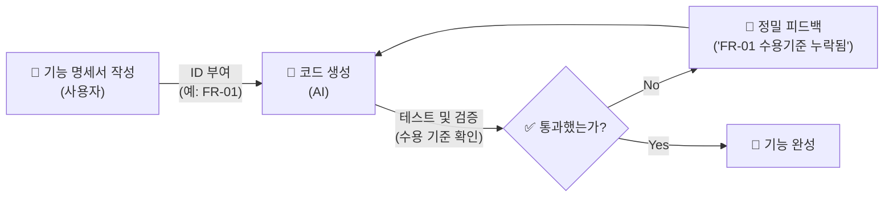
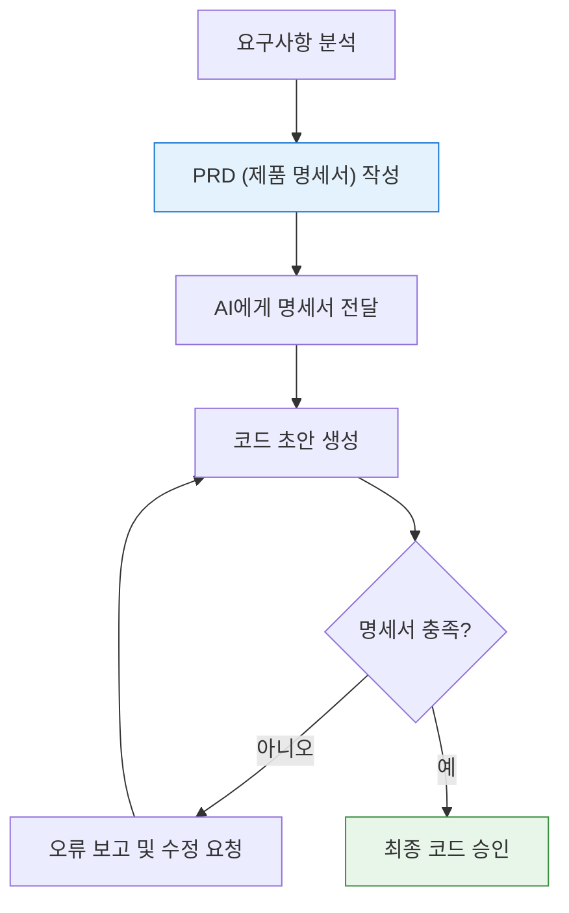

# 마이크로 세션: 036 — PRD의 핵심 구조와 기능 명세(FR) 작성법

> **세션 ID**: MS-PY101-036
> **소요 시간**: 20분
> **난이도**: medium
> **청크 타입**: narrative
> **버전**: v2.1 (7섹션 구조)

---

## §1. 개요

> **Day 2 | PM | 세션 036/043**

이전 세션에서 제품 요구사항 정의서(PRD)가 무엇인지, 왜 필요한지 전체적인 그림을 그려보았어요. 뼈대를 세웠으니 이제 살을 붙일 차례입니다. PRD의 7가지 섹션 중에서도 가장 심장부 역할을 하는 '기능 명세(Functional Requirements, FR)'와 '비기능 명세(Non-Functional Requirements, NFR)'를 체계적으로 작성하는 방법을 배우는 세션이에요. 

### 🎯 학습 목표

이 세션이 끝나면 수강생은 다음을 할 수 있어요:

- 소프트웨어의 모든 기능에 추적 가능한 고유 식별자(ID)를 부여할 수 있습니다
- '수용 기준(Acceptance Criteria)'의 중요성을 이해하고 명확하게 작성할 수 있습니다
- 마크다운 표를 이용해 AI가 완벽하게 이해할 수 있는 기능 명세서를 구성할 수 있습니다

### 선행 세션 환기

바로 앞 세션(035)에서 PRD의 7섹션 구조를 배웠습니다. 요구사항을 도출할 때 썼던 5W1H 질문법 기억나시죠? 그 질문법을 통해 얻은 아이디어들을 이제 개발자와 AI가 오해 없이 읽을 수 있는 공식적인 규칙과 표 형태로 번역하는 작업이 시작됩니다.

---

## §2. 핵심 개념 (+ 🗣️ 강사 대본 + Mermaid)

### 도서관 청구기호와 건물의 배관 번호

소프트웨어 기능에 이름을 붙이는 것은 도서관에서 책에 청구기호를 붙이는 것과 똑같아요. "파란색 표지에 두꺼운 해리포터 소설책"이라고 백 번 설명하는 것보다 "813.6-롤23"이라는 기호 하나면 단 몇 초 만에 정확한 책을 찾을 수 있습니다. 건물을 지을 때도 마찬가지예요. 배관, 전기, 도색 작업에 각각 번호를 매겨 관리해야 중간에 꼬이지 않습니다. 

이처럼 소프트웨어의 모든 기능에 고유한 이름표(FR-01, FR-02 등)를 달아주는 것이 기능 명세의 시작입니다. 이름표가 있으면 나중에 AI가 짠 코드에서 오류가 났을 때 "저기 그 검색하는 기능이 좀 이상한데?"라고 뭉뚱그려 말하지 않고 "FR-02 기능에서 수용 기준이 누락됐어"라고 아주 날카롭고 정밀하게 피드백할 수 있습니다.

🗣️ **강사 대본 (Instructor Script)**:

> 지난 시간에 PRD가 무엇인지 알아봤죠? 요구사항이 그냥 흩어진 재료라면, PRD는 마스터 레시피라고 했습니다. 그런데 레시피에도 절대 빠지면 안 되는 불변의 뼈대가 있어요. 회사마다 양식은 조금씩 다르지만, 어떤 회사든 PRD에서 절대 빼놓지 않는 핵심이 바로 '기능 명세'입니다. 오늘 우리는 그 PRD의 꽃을 피워볼 거예요.
>
> 혹시 큰 도서관에 가보신 적 있나요? 수십만 권의 책 중에서 내가 원하는 책을 찾을 때 사서 선생님께 "파란색 표지에 좀 두꺼운 소설책 찾아주세요"라고 말하면 어떨까요? 엄청 난감해하시겠죠. 하지만 "813.6-김123"이라는 청구기호를 알려드리면 단 10초 만에 책을 찾아주십니다. 
>
> 소프트웨어를 만들 때도 똑같습니다. AI에게 "사용자 추가하는 기능 좀 만들어줘"라고 말하면 너무 모호해요. 이름만 추가하는 건지, 전화번호도 넣는 건지, 중복 검사는 하는 건지 AI는 알 길이 없습니다. 그래서 우리는 모든 기능에 고유한 이름표를 달아줄 거예요. 예를 들어 'FR-001'처럼요.
>
> 이 이름표 체계를 '식별자(ID)'라고 부릅니다. 이 이름표가 왜 그렇게 중요할까요? 나중에 AI가 코드를 짜줬을 때 피드백을 주기 위해서입니다. 이름표가 없으면 "그 검색하는 거 있잖아, 그거 좀 이상한데 고쳐줘"라고 해야 합니다. 그러면 AI가 엉뚱한 곳을 고치다가 멀쩡한 코드까지 망가뜨리는 일이 빈번하게 일어납니다. 반면에 이름표가 있다면 "FR-002 기능에서 수용 기준을 빼먹었어. 다시 수정해"라고 아주 뾰족하게 지적할 수 있죠. 

> 💡 **강사 노트**: 도서관 청구기호 비유는 누구나 직관적으로 '고유 ID'의 필요성을 공감할 수 있는 훌륭한 장치입니다. 비유를 충분히 설명한 뒤, 이것이 결국 AI와의 커뮤니케이션(프롬프팅)을 정밀하게 만들기 위한 빌드업임을 강조해 주세요.

### Mermaid 다이어그램



위 다이어그램은 식별자(ID)가 어떻게 추적성(Traceability)을 만들어내는지 보여줍니다. 명세서에 작성된 ID가 AI의 코드 생성 기준이 되고, 검증 단계에서 기준점이 되며, 오류 발생 시 피드백의 정확한 좌표가 되는 순환 구조를 확인할 수 있습니다.

---


### 🎨 추가 시각화 (Visualization Packet)

**SDD (명세서 기반 개발) 워크플로우**

기분(Vibe) 코딩이 아닌, 명확한 요구사항을 기반으로 한 AI 협업 과정입니다.



## §3. 상세 내용

### Why — 왜 기능 명세를 깐깐하게 써야 하는가?

기능 명세를 깐깐하게 쓰는 가장 큰 이유는 '추적성(Traceability)'을 확보하기 위해서예요. 바이브 코딩(Vibe Coding)처럼 대충 느낌대로 지시하면 코드는 금방 나오지만, 나중에 버그가 터졌을 때 어디서부터 잘못됐는지 추적할 방법이 없습니다. 기능 요구사항(FR)에 번호를 매기고 명확한 기준을 적어두면, 요구사항 문서를 기준으로 코드가 정확히 구현되었는지 하나하나 대조하며 테스트할 수 있어요. 기획의 틈새를 없애는 가장 확실한 방법입니다.

### What — 기능 명세의 3대 요소

기능 요구사항을 작성할 때는 반드시 다음 세 가지 요소를 포함해야 합니다.

1. **고유 식별자 (ID)**: 
   기능 요구사항은 FR(Functional Requirements)로 시작하고, 비기능 요구사항은 NFR(Non-Functional Requirements)로 시작합니다. 뒤에 숫자를 붙여 FR-001, FR-002 식으로 고유 번호를 부여합니다.
2. **명확한 기능 설명**: 
   이 기능이 무엇을 하는지 한 문장으로 간결하게 적습니다. 누가, 무엇을, 어떻게 하는지가 잘 드러나야 합니다.
3. **수용 기준 (Acceptance Criteria)**: 
   이 기능이 '제대로 동작한다'고 판단할 수 있는 구체적인 합격선입니다. 테스트의 기준이 되기 때문에 가장 중요한 항목이에요. 예외 상황(에러)이 발생했을 때 프로그램이 어떻게 대처해야 하는지도 여기에 적습니다.

비기능 요구사항(NFR)은 기능이 '무엇을' 하는지가 아니라 '어떻게' 동작해야 하는지, 즉 성능이나 보안, 기술적 제약 조건을 적는 공간입니다. "외부 패키지를 쓰지 않고 파이썬 내장 라이브러리만 사용한다" 같은 제약 사항이 대표적입니다.

### How — 마크다운 표로 깔끔하게 정리하기

이 요소들을 가장 효과적으로 표현하는 방법은 표(Table) 형태입니다. 줄글로 길게 늘어쓰는 것보다 항목별로 딱딱 끊어서 표로 만들어주면, 사람도 읽기 편하고 AI도 데이터 구조를 훨씬 빠르고 정확하게 파악합니다. 마크다운 문법으로 표를 그리면 텍스트 기반 환경에서도 아주 깔끔한 명세서를 만들 수 있어요. (§5에서 실제 예시를 확인합니다.)

---

## §4. 실습 가이드 (+ 🎙️ 실습 대본)

### 실습 목표

수강생들이 직접 고유 ID, 기능 설명, 수용 기준이라는 3요소를 갖춘 FR 양식을 작성해 봅니다. 일상적인 요구사항을 정밀한 명세서 언어로 번역하는 감각을 익히는 것이 핵심입니다.

🎙️ **실습 가이드 대본 (Lab Guide)**:

> 이제 여러분이 직접 기능 명세를 하나 작성해 볼 텐데요. 우리가 만들 '고객 정보 관리 프로그램'의 첫 번째 기능, 바로 '고객 등록' 기능을 명세서로 써볼 겁니다.
> 
> 연습장이나 메모장을 열어주세요. 표를 그릴 필요는 없고 항목만 순서대로 적어보세요. 
> 첫째, ID를 달아주세요. FR-001이 좋겠네요.
> 둘째, 기능명을 짧게 적고, 그 옆에 기능 설명을 한 문장으로 써보세요.
> 셋째, 가장 중요한 '수용 기준'을 적어보세요. 정상적으로 등록될 때의 기준도 좋지만, 똑같은 전화번호를 가진 사람이 또 등록하려고 할 때 프로그램이 어떻게 행동해야 할지 예외 상황의 기준도 꼭 포함해 보세요.
>
> 3분 드리겠습니다. 시작!

### 단계별 지시

| 단계 | 소요 시간 | 강사 지시사항 | 학습자 액션 | 예상 결과 |
|------|----------|--------------|------------|----------|
| 1 | 1분 | "고객 등록 기능을 FR 양식으로 쪼개서 생각해보세요" | 빈 노트 준비 | 실습 세팅 |
| 2 | 3분 | "ID, 기능설명, 수용기준 세 항목을 직접 작성합니다" | 메모장에 FR-001 작성 | 초안 완성 |
| 3 | 3분 | "옆 분과 서로 작성한 수용기준을 바꿔서 읽어보세요" | 짝과 결과물 비교 | 내가 놓친 엣지케이스 발견 |
| 4 | 3분 | 모범 답안 제시 및 차이점 해설 | 모범 답안과 내 것 비교 | 수용기준의 구체성 체감 |

### 트러블슈팅 FAQ

| Q | A |
|---|---|
| 수용 기준을 어떻게 적어야 할지 막막해합니다 | "내가 테스터라고 상상해 보세요. 개발자가 코드를 짜왔을 때, 이 프로그램이 합격인지 불합격인지 도장을 찍어줄 명확한 채점 기준표를 만든다고 생각하면 쉽습니다"라고 조언해 주세요. |
| 기능 설명과 수용 기준의 내용을 중복해서 적습니다 | 기능 설명은 '목적(What)'이고, 수용 기준은 '결과 검증(Check)'입니다. 설명에는 "이름과 연락처를 저장한다"로 충분하고, 수용 기준에는 "저장 성공 시 '등록 완료' 메시지가 출력된다"처럼 눈에 보이는 결과물을 적게끔 교정해 줍니다. |

---


### 🎓 강사 노트 (Instructor Support)

- ⏱️ **타이밍**: 15:35 (25분, code)
- 🎯 **핵심 활동**: FR-001 등 식별자 부여
- ⚠️ **강사 주의사항**: 템플릿 배포 후 함께 작성

## §5. 코드 및 명령어 모음

실제 PRD 문서에 들어가는 기능 요구사항(FR)과 비기능 요구사항(NFR)의 마크다운 표 예시입니다. 이 표 양식을 그대로 복사해서 나중에 프롬프트 컨텍스트로 제공할 거예요.

```markdown
## 3. 기능 요구사항 (Functional Requirements)

| ID | 기능명 | 설명 | 수용 기준 (Acceptance Criteria) | 우선순위 |
|---|---|---|---|---|
| FR-001 | 신규 고객 등록 | 이름과 전화번호를 입력받아 고객 리스트에 저장한다 | 1. 전화번호 중복 시 "이미 등록된 번호입니다" 경고 메시지 출력<br>2. 정상 저장 시 "고객이 등록되었습니다" 안내 출력 | High |
| FR-002 | 고객 목록 조회 | 저장된 전체 고객의 이름과 전화번호를 출력한다 | 1. 등록된 고객이 0명일 경우 "등록된 고객이 없습니다" 출력<br>2. 리스트는 가입 순서대로 번호를 매겨서 정렬 출력 | High |
| FR-003 | 고객 정보 수정 | 이름으로 검색 후 기존 전화번호를 새로운 번호로 변경한다 | 1. 존재하지 않는 이름 입력 시 안내 메시지 출력<br>2. 동명이인이 있을 경우 리스트를 보여주고 선택하게 함 | Medium |
| FR-004 | 고객 정보 삭제 | 이름으로 검색 후 해당 고객 데이터를 리스트에서 완전히 제거한다 | 1. 삭제 전 "정말 삭제하시겠습니까? (Y/N)" 확인 메시지 출력<br>2. Y 입력 시에만 삭제 처리 | Medium |

## 4. 비기능 요구사항 (Non-Functional Requirements)

| ID | 항목 | 설명 |
|---|---|---|
| NFR-001 | 기술 제약 | 외부 패키지 설치 없이 파이썬 3.10 이상의 내장 라이브러리만 사용한다 |
| NFR-002 | 사용성 (UI) | 그래픽 창 없이 텍스트 기반의 콘솔(터미널) 인터페이스로 동작한다 |
```

---

## §6. 요약

### 핵심 학습 포인트

이번 세션의 핵심은 명확함과 추적성입니다. 첫째, 모든 기능에 도서관 청구기호처럼 고유한 ID(FR-001)를 달아주세요. 둘째, AI에게 코드를 지시하고 평가하는 가장 강력한 기준점이 바로 '수용 기준(Acceptance Criteria)'입니다. 셋째, 이 내용들을 줄글이 아닌 마크다운 표 형태로 깔끔하게 정리해 두면 AI가 훨씬 빠르고 정확하게 여러분의 의도를 파악합니다.

### 다음 세션 예고

이제 각 기능들이 어떻게 구성되는지 엑셀 표처럼 정리하는 법을 알았어요. 그런데 사용자는 표를 보고 프로그램을 쓰지 않죠. 메뉴를 고르고, 글씨를 입력하고, 결과를 확인하며 '흐름'을 탑니다. 다음 세션에서는 이 흐름을 문서화하는 '사용자 시나리오'와 프로그램의 '성능 지표'를 정의하는 방법을 배울 차례입니다.

### 브릿지 노트

> "건축물로 치면 지금 우리는 설계도면의 부품 명세서를 꼼꼼하게 작성한 겁니다. 나사 몇 개, 철근 몇 개 들어가는지 다 적었어요. 그런데 이 부품들을 조립해서 사람들이 실제로 어떻게 복도를 걸어 다니고 문을 열고 들어가는지 동선도 짜야겠죠? 바로 다음 시간에 이 동선을 시나리오로 만들어보겠습니다."

---

## §7. 참고 자료

### 3-Source 출처

- **Source A (로컬 참고자료)**: `7 기획.pdf` (§7.3 PRD 구조) — 기능 요구사항(FR)과 비기능 요구사항(NFR) 식별자 체계 및 마크다운 표 기반의 PRD 작성 템플릿의 원전입니다.
- **Source B (NotebookLM)**: NotebookLM 분석 리포트 — 명세 주도 개발(SDD) 환경에서 AI에게 코드 생성을 지시할 때, 수용 기준(Acceptance Criteria)이 테스트의 기준점이 된다는 핵심 개념을 가져왔습니다.
- **Source C (Deep Research)**: Deep Research 보고서 — 추적성(Traceability) 개념을 바탕으로, 고유 ID 부여가 AI 피드백 루프를 정밀하게 만들어준다는 업계의 실제 적용 사례를 보강했습니다.

### 강사 노트

> 💡 **강사 노트**: 수강생들이 처음 PRD를 작성할 때 가장 어려워하는 부분이 바로 '수용 기준'을 도출하는 것입니다. 이때 "정상 작동할 때뿐만 아니라, 사용자가 엉뚱한 짓을 했을 때(예외 상황) 프로그램이 안 죽고 어떻게 버틸 것인가?"를 고민하게 만드는 것이 핵심입니다. 프롬프트 엔지니어링 강의에서 배웠던 '예외 처리' 항목이 PRD에서는 '수용 기준'으로 연결됨을 짚어주면 아주 좋습니다.

---

## ✅ 세션 완료 체크리스트 (강사용)

- [ ] §1~§7 모든 섹션이 충실하게 작성되었는가?
- [ ] 도서관 청구기호 등 직관적인 비유가 포함되었는가?
- [ ] FR/NFR 식별자 체계와 수용 기준의 중요성이 강조되었는가?
- [ ] 마크다운 표 기반의 실제 예시가 제공되었는가?
- [ ] 3-Source 팩트 패킷 내용이 충실히 반영되었는가?

---

*작성 일시: 2026-02-25*  
*작성 에이전트: A4B_Session_Writer*  
*교안 구조: 7섹션 (A0 팀 공통 표준)*