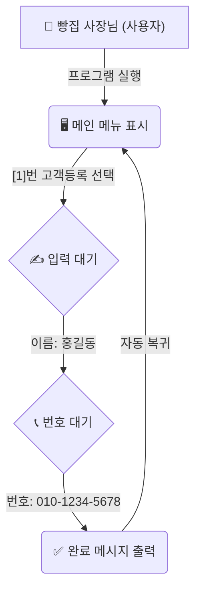

# 마이크로 세션: 037 — 사용자 시나리오와 성공 지표 정의
> **세션 ID**: MS-PY101-037
> **소요 시간**: 20분
> **난이도**: low
> **청크 타입**: narrative
> **버전**: v2.1 (7섹션 구조)

---

## §1. 개요

> **Day 2 | PM | 세션 037/043**

이번 세션은 지난 시간에 정리한 딱딱한 기능 명세서(FR)에 생명력을 불어넣는 시간이에요. 우리가 정리했던 "신규 고객 등록", "목록 조회" 같은 기능들을 실제 사람이 어떻게 순서대로 경험하는지, 그리고 이 프로그램이 최종적으로 어떤 조건을 만족해야 '성공'인지 선을 긋는 방법을 배웁니다. AI에게 이 두 가지만 잘 넘겨줘도, 훨씬 친절하고 맥락에 맞는 훌륭한 프로그램이 탄생합니다.

### 🎯 학습 목표

이 세션이 끝나면 수강생은 다음을 할 수 있어요:

- 기능 나열을 넘어 사용자의 시간 순서에 따른 경험 흐름(시나리오)을 서술할 수 있습니다
- AI가 맥락을 이해하고 자연스러운 UI 흐름을 짤 수 있도록 행동 맥락을 제공할 수 있습니다
- 프로그램이 완성되었다고 판단할 수 있는 측정 가능하고 구체적인 성공 지표를 정의할 수 있습니다

### 선행 세션 환기

지난 세션에서 우리는 PRD의 핵심 구조와 기능 명세(FR)를 식별자(ID)와 함께 작성하는 법을 배웠어요. FR-001(고객 등록), FR-002(고객 조회)처럼 레고 블록 같은 기능 부품들을 만들어둔 상태입니다. 이제 이 부품들을 조립해서 실제 사람이 어떻게 사용하는지 이야기로 풀어낼 차례입니다.

---

## §2. 핵심 개념 (+ 🗣️ 강사 대본 + Mermaid)

### 조립되지 않은 부품과 영화 스토리보드 비유

아무리 좋은 부속품을 늘어놓아도, 그것들이 어떤 순서로 조립되어 쓰이는지 모르면 무용지물이에요. 소매, 단추, 지퍼, 안감 같은 옷의 부속품을 완벽하게 준비했다고 해서 바로 멋진 재킷이 되는 건 아니죠. 사람이 팔을 먼저 넣고 지퍼를 올리는 과정, 즉 '입어보는 과정'이 있어야 진짜 옷이 완성됩니다. 소프트웨어도 마찬가지로, 기능 목록만으로는 이 프로그램이 실제로 어떻게 굴러가는지 감을 잡기 어렵습니다.

🗣️ **강사 대본 (Instructor Script)**:

> 여러분, 지난 시간에 우리가 만든 기능 명세서를 한 번 보세요. 단추, 지퍼, 옷감처럼 아주 잘 정리가 되어 있습니다. 그런데 만약 AI에게 "이 부품들로 옷을 만들어줘"라고만 하면 어떻게 될까요? 운이 좋으면 재킷이 나오겠지만, 지퍼가 등 뒤에 달리거나 단추가 소매 끝에 달린 이상한 옷이 나올 수도 있어요.
>
> 왜 그럴까요? AI는 부품의 이름은 알지만, 사람이 그 옷을 '어떻게 입는지'에 대한 맥락(Context)을 모르기 때문이에요.
>
> 영화감독이 촬영에 들어가기 전에 가장 먼저 하는 일이 뭔지 아시나요? 대본을 쓰기 전에 스토리보드를 그립니다. "주인공이 문을 열고 들어온다 → 테이블 위 편지를 발견한다 → 놀란다 → 전화를 건다" 이렇게 시간 순서대로 주인공의 행동과 카메라의 시선을 그려두는 거예요. 이 스토리보드 하나만 있으면 조명 감독도, 배우도 머릿속에 완벽히 똑같은 장면을 상상할 수 있죠.
>
> 우리가 오늘 배울 '사용자 시나리오'가 바로 이 스토리보드입니다. 프로그램이 켜지고 꺼질 때까지, 사용자가 어떤 순서로 클릭하고 무슨 메시지를 보는지 시간 순서대로 적어 내려가는 거예요. "사용자가 1번을 누른다"를 넘어서, "빵집 사장님 김씨가 오늘 새로 온 단골의 연락처를 저장하려고 1번 메뉴를 누른다"라고 적어주세요. 
>
> 이 시나리오를 AI에게 읽혀주는 순간, 놀라운 마법이 벌어집니다. AI가 "아, 빵집 사장님이 바쁜 와중에 쓰는 거구나?"라고 이해하고, 안내 문구나 메뉴의 흐름을 훨씬 친절하게 알아서 짜줍니다. 기계적인 기능 나열을 넘어서 인간의 행동 맥락을 제공하는 것, 이게 바로 시나리오의 힘입니다.

### Mermaid 다이어그램



이 다이어그램은 사용자가 콘솔 프로그램과 상호작용하는 시간적 흐름을 보여줍니다. 기계적인 기능 목록이 아니라, 사용자가 무엇을 보고 어떻게 행동하는지 한 편의 짧은 연극 대본처럼 흘러가는 구조를 이해하는 것이 중요해요.

---

## §3. 상세 내용

### Why — 왜 기능 명세 외에 시나리오와 지표가 필요한가?

기능 명세(FR)가 "무엇을 할 수 있는가"의 목록이라면, 사용자 시나리오는 "어떤 순서로 하는가"의 대본이에요. 명세서만 던져주고 코드를 짜라고 하면, 개발자나 AI는 기능을 각자 독립된 섬처럼 만들어버리기 십상입니다. 화면 이동이 뚝뚝 끊기거나, 에러 메시지가 불친절하게 튀어나올 수 있죠. 하지만 시나리오가 있으면, 프로그램 전체가 하나의 물 흐르듯 자연스러운 경험으로 이어집니다. 

또한 성공 지표는 프로젝트가 끝없이 늘어나는 '범위 이탈(Scope Creep)'을 막아주는 안전장치예요. 막연하게 "잘 돌아가면 끝"이 아니라, "없는 고객을 검색했을 때 프로그램이 뻗지 않고 안내 문구가 나온다"처럼 구체적인 선을 그어주어야 합니다. 결승선이 명확해야 AI도, 여러분도 "여기까지 하면 이 프로젝트는 성공이다"라고 선언하고 홀가분하게 마무리할 수 있습니다.

### What — 사용자 시나리오와 성공 지표의 정의

사용자 시나리오(User Scenario)는 사용자가 특정한 목적을 달성하기 위해 시스템과 상호작용하는 과정을 시간 순서대로 구체적으로 서술한 이야기입니다. 핵심은 '시간의 흐름'과 '구체적인 인물의 행동'입니다.

성공 지표(Success Metrics)는 이 소프트웨어가 완성되었다고 판단할 수 있는 측정 가능하고 객관적인 기준입니다. "버그가 없다" 같은 모호한 표현 대신, "CRUD(생성, 조회, 수정, 삭제) 4가지 기능이 모두 정상 동작하고, 숫자를 입력해야 할 곳에 문자를 넣어도 프로그램이 다운되지 않는다"처럼 명확하게 작성합니다.

### How — 시나리오가 AI에게 미치는 마법 같은 효과

AI에게 이 시나리오를 단순히 첨부하기만 해도 결과물의 질이 하늘과 땅 차이로 벌어집니다. 예를 들어 단골 고객을 관리하는 카페 사장님의 상황을 시나리오로 써서 AI에게 주면, AI는 콘솔의 출력 메시지를 "데이터가 삽입되었습니다" 같은 기계적 말투가 아니라 "새로운 단골 고객이 성공적으로 등록되었습니다"처럼 따뜻하고 맥락에 맞는 언어로 바꿔서 코드를 생성합니다. 

인간의 행동 맥락을 이해한 AI는 사용자가 실수할 법한 구간(예: 메뉴 번호 대신 이상한 글자를 치는 경우)을 스스로 예측하고, 시나리오의 흐름이 끊기지 않도록 예외 처리 코드를 알아서 보강해 주기도 합니다. 

---

## §4. 실습 가이드 (+ 🎙️ 실습 대본)

### 실습 목표

수강생들은 지난 세션에서 도출한 기능 명세(FR) 중 '고객 등록' 기능을 골라, 실제 빵집 사장님이 프로그램을 사용하는 구체적인 시나리오와 프로젝트 성공 지표를 직접 서술해 봅니다.

🎙️ **실습 가이드 대본 (Lab Guide)**:

> 자, 이제 여러분이 영화감독이 될 차례입니다. 우리가 5일 동안 만들 '고객 정보 관리 프로그램'의 첫 번째 장면을 머릿속으로 그려보세요. 
>
> 주인공은 동네 빵집을 운영하는 김 사장님입니다. 오늘 정말 빵을 많이 사간 고마운 손님이 있어서, 연락처를 받아 단골로 등록하려고 합니다. 자, 화면에는 무엇이 떠 있나요? 사장님이 키보드로 몇 번을 누르나요? 그다음엔 어떤 안내문이 나오죠? 
>
> 기능 명세서 보면서 딱딱하게 쓰지 마시고, 소설 쓰듯이 쭉쭉 적어 내려가 보세요. 5분 드리겠습니다. 다 쓰신 후에는, 우리 프로젝트가 '이 정도면 완성이다!'라고 외칠 수 있는 성공 지표도 딱 세 가지만 적어볼게요. 

### 단계별 지시

| 단계 | 소요 시간 | 강사 지시사항 | 학습자 액션 | 예상 결과 |
|------|----------|--------------|------------|----------|
| 1 | 5분 | "고객 등록 과정을 시간 순서대로 소설처럼 써보세요." | 시나리오 작성 | 인간의 행동 맥락이 담긴 서술형 시나리오 도출 |
| 2 | 3분 | "프로그램이 완성되었다는 기준(성능 지표)을 세 가지 적어보세요." | 성공 지표 작성 | 구체적인 결승선(예: 예외 처리 조건 등) 정의 |
| 3 | 5분 | 2~3명의 수강생 시나리오 발표 및 피드백 | 결과물 공유 | 디테일한 흐름과 화면 UI 상상력 극대화 |
| 4 | 2분 | AI에게 시나리오를 주었을 때의 차이점 설명 | 경청 및 메모 | 시나리오의 중요성(컨텍스트 제공) 공감 |

### 트러블슈팅 FAQ

| Q | A |
|---|---|
| 시나리오를 너무 기능적으로만 적어요 (예: "1번 누름. 홍길동 입력. 저장됨") | "조금 더 생생하게 적어볼까요? 화면에 '이름을 입력하세요:'라고 친절하게 뜨나요, 아니면 그냥 커서만 깜빡이나요? 사장님이 입력하고 났을 때 어떤 기분 좋은 완료 메시지가 뜨면 좋을지 적어보세요." |
| 성공 지표를 "잘 돌아가면 성공"이라고 적었어요 | "잘 돌아간다는 건 사람마다 기준이 다릅니다. '메뉴에 없는 9번을 눌러도 에러가 나면서 꺼지지 않고, 다시 번호를 입력하라고 친절하게 알려준다'처럼 눈으로 확인할 수 있는 구체적인 현상을 적어주세요." |
| 비전공자라 프로그램이 다운된다(Crash)는 개념을 잘 몰라요 | "게임하다가 갑자기 바탕화면으로 튕겨나가는 경험 해보셨죠? 그게 바로 크래시입니다. 우리가 만든 프로그램도 숫자를 넣으라는데 글자를 넣으면 튕길 수 있어요. 안 튕기고 버티는 걸 성공 지표로 삼아보는 겁니다." |

> ✅ **체크포인트**: 시나리오만 읽어도 프로그램이 어떻게 동작할지 눈앞에 생생하게 그려지나요?

---


### 🎓 강사 노트 (Instructor Support)

- ⏱️ **타이밍**: 16:10 (20분, narrative)
- 🎯 **핵심 활동**: 시간 흐름 기반 시나리오 작성
- ⚠️ **강사 주의사항**: User Story 포맷 시연

## §5. 코드 및 명령어 모음 (해당 시)

이 세션에서는 직접 파이썬 코드를 짜지 않지만, 다음 세션에서 AI에게 전달할 '시나리오 작성 템플릿'을 만들어둡니다. 여러분이 작성한 시나리오는 향후 프롬프트의 강력한 컨텍스트(Context)가 됩니다.

> 🤖 **AI 프롬프트 컨텍스트 예시 (사용자 시나리오 블록)**:

```text
[사용자 시나리오: 고객 등록]
1. 김씨가 터미널에서 프로그램을 실행한다.
2. 화면에 메인 메뉴가 명확하게 표시된다. [1. 고객 등록 / 2. 조회 / 3. 수정 / 4. 삭제 / 5. 종료]
3. 김씨가 1번을 입력하고 엔터를 친다.
4. '고객 이름을 입력하세요:'라는 친절한 안내가 뜬다. 김씨가 '홍길동'을 입력한다.
5. '전화번호를 입력하세요:'라는 안내가 뜬다. 김씨가 '010-1234-5678'을 입력한다.
6. '홍길동 고객이 성공적으로 등록되었습니다.'라는 완료 메시지가 뜨고 2초 뒤 메인 메뉴로 돌아온다.

[성공 지표]
1. CRUD 4가지 핵심 기능이 모두 에러 없이 정상 동작한다.
2. 존재하지 않는 고객을 검색하면 "해당 고객이 없습니다"라는 안내 메시지가 출력된다.
3. 메뉴 번호 입력란에 한글이나 기호를 입력해도 프로그램이 종료되지 않고 다시 메뉴를 보여준다.
```

---

## §6. 요약

### 핵심 학습 포인트

세 가지를 꼭 기억해 주세요. 첫째, 사용자 시나리오는 프로그램의 스토리보드입니다. 기능 목록이 "무엇을" 만들지 알려준다면, 시나리오는 "어떤 순서로" 굴러가는지를 알려줍니다. 둘째, 성공 지표는 프로젝트의 명확한 결승선입니다. 끝없이 요구사항이 늘어나는 것을 막아주고 완성을 선언할 수 있게 해줍니다. 셋째, AI에게 이런 인간의 행동 맥락을 풍부하게 제공하면, 단순히 작동만 하는 코드가 아니라 사람을 배려하는 따뜻하고 매끄러운 프로그램 코드를 짜줍니다.

### 다음 세션 예고

이제 PRD를 구성하는 모든 부품이 모였습니다. 개요, 문제 정의, 기능 명세, 그리고 오늘 배운 시나리오와 성공 지표까지요. 다음 세션에서는 이 모든 조각들을 하나로 합쳐서, 우리의 고객 정보 관리 프로그램 PRD 스펙을 완벽하게 마크다운 문서로 완성해 보겠습니다.

### 브릿지 노트

> "영화감독의 스토리보드 훈련, 어떠셨나요? 머릿속에 우리가 만들 프로그램의 모습이 꽤 선명하게 그려지기 시작했을 겁니다. 이제 흩어져 있는 이 멋진 아이디어들을 하나의 공식적인 문서로 깔끔하게 묶어낼 시간이에요. 다음 시간엔 이 모든 걸 조립해서 진짜 PRD를 완성해 봅시다."

---

## §7. 참고 자료

### 3-Source 출처

- **Source A (로컬 참고자료)**: `7 기획.pdf` (§7.4 사용자 시나리오 작성법) — 시나리오 작성법과 성공 지표 정의 방법론의 이론적 기반.
- **Source B (NotebookLM)**: `AI 시대의 서사 v3 - Claude.md` (§문제 정의 vs 문제 해결) — 기계적 나열을 넘어 인간의 행동 맥락(Context)을 전달해야 AI가 훌륭한 UI/UX 흐름을 만든다는 철학 반영.
- **Source C (Deep Research)**: Deep Research 보고서 — 성공 지표와 경계값 테스트(예외 입력 처리)의 실전 적용 사례 및 '범위 이탈(Scope Creep)' 방어 효과 분석.

### 강사 노트

> 💡 **강사 노트**: 본 세션은 수강생들이 단순한 기능의 나열과 실제 사용자의 경험이 얼마나 다른지 체감하게 하는 것이 핵심입니다. 스토리보드나 옷의 부속품 비유를 최대한 구체적으로 활용해 주세요. 비전공자일수록 '프로그램이 다운된다(Crash)'는 개념에 익숙하지 않으므로, 게임이 튕기는 현상 등에 빗대어 예외 처리의 중요성과 이를 성공 지표에 포함하는 이유를 설명하면 좋습니다.

---

## ✅ 세션 완료 체크리스트 (강사용)

- [ ] §1~§7 모든 섹션이 충실하게 서술형으로 작성되었는가?
- [ ] 조립되지 않은 옷의 부속품과 영화 스토리보드 비유가 포함되었는가?
- [ ] 시나리오 작성과 성공 지표 정의 실습이 원활하게 진행되었는가?
- [ ] AI에게 시나리오를 주었을 때 UI 품질이 올라간다는 점이 강조되었는가?
- [ ] 3-Source 팩트 패킷 내용이 정확히 반영되었는가?

---

*작성 일시: 2026-02-25*  
*작성 에이전트: A4B_Session_Writer*  
*교안 구조: 7섹션 (A0 팀 공통 표준)*
