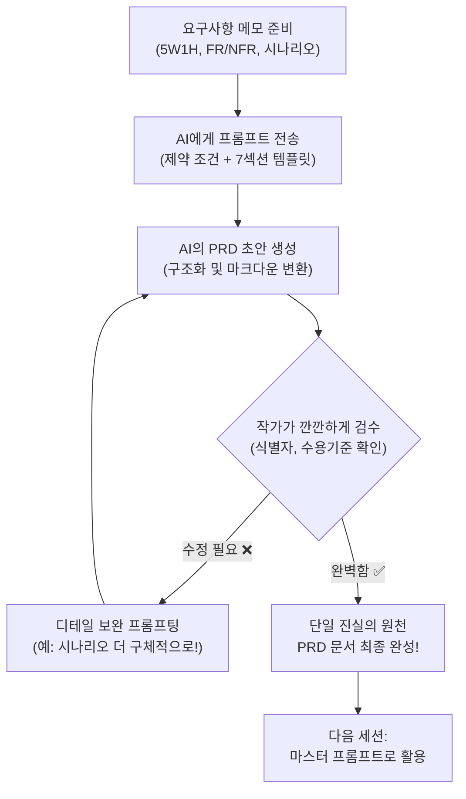

# 마이크로 세션: 038 — 고객 정보 관리 프로그램 PRD 완성하기

> **세션 ID**: MS-PY101-038  
> **소요 시간**: 25분  
> **난이도**: medium  
> **청크 타입**: lab  
> **버전**: v2.1 (7섹션 구조)

---

## §1. 개요

> **Day 2 | PM | 세션 038/043**

### 🎯 학습 목표

이 세션이 끝나면, 수강생은 다음을 할 수 있습니다:

- 앞선 세션에서 배운 5W1H, 기능/비기능 명세(FR/NFR), 사용자 시나리오를 통합하여 하나의 완결된 요구사항 정의서(PRD)를 작성할 수 있다.
- AI 에이전트를 '전문 편집장'으로 활용하여 파편화된 기획 메모를 체계적으로 구조화된 마크다운 문서로 변환할 수 있다.
- 단순한 메모와 명확한 수용 기준(Acceptance Criteria)이 명시된 요구사항의 질적인 차이를 구별할 수 있다.
- 완성된 PRD 문서가 향후 코드 생성을 완벽하게 통제하는 강력한 '마스터 프롬프트'의 핵심 컨텍스트로 작동함을 이해한다.

### 선행 세션 환기

지난 4개의 세션 동안 우리는 튼튼한 집을 짓기 위한 기초 공사를 해왔습니다. 세션 032에서는 5W1H 기법으로 막연한 아이디어를 구체적인 요구사항으로 분석했죠. 세션 035에서는 기획서가 갖춰야 할 PRD 7섹션의 뼈대를 배웠습니다. 이어서 세션 036과 037을 통해 기능 명세(FR)에 꼬리표 같은 고유 식별자를 붙이고, 사용자가 실제로 경험할 시나리오와 성공 지표까지 꼼꼼하게 정의했습니다. 

지금까지는 좋은 집을 짓기 위해 각자의 위치에서 벽돌을 구워내는 시간이었습니다. 이제는 이 벽돌들을 한데 모아 조립하고 시멘트를 발라, 흔들리지 않는 완벽한 '건축 설계도'를 최종 완성할 차례입니다.

---

## §2. 핵심 개념 (+ 🗣️ 강사 대본 + Mermaid)

### AI는 여러분 전속 "수석 편집장"입니다

여러분이 방대한 판타지 소설을 기획하는 작가라고 상상해 보세요. 머릿속에는 엄청나게 매력적인 캐릭터 설정, 이리저리 흩어진 줄거리 메모, 극적인 반전 아이디어가 가득합니다. 하지만 냅킨이나 수첩에 갈겨쓴 이 메모들을 그대로 묶어서 출판사 사장님께 보낼 수는 없죠. 이때 꼭 필요한 파트너가 바로 유능한 '수석 편집장'입니다. 

여러분(작가)이 거친 메모를 툭 던져주면, AI(편집장)는 그것을 출판사 공식 양식에 맞춰 목차를 잡고, 1장과 2장을 매끄럽게 나누고, 앞뒤가 안 맞는 복선을 지적해 줍니다. 그리고 아주 깔끔하게 제본된 '완성 원고 초안'을 돌려주죠. 작가인 여러분은 그 원고를 쭉 읽어보면서 "아, 주인공 성격을 좀 더 까칠하게 바꿔줘", "여기 결말 시나리오는 조금 어색하네"라며 최종 검수만 하면 됩니다. 

AI에게 기획서를 써달라고 부탁할 때, "아무거나 멋진 거 하나 만들어줘"라고 하는 것은 제일 나쁜 방법입니다. 대신 "내가 넘겨주는 5W1H 메모와 기능 목록을 바탕으로, 반드시 7섹션 양식에 정확히 맞춰서 정리해 와"라고 엄격한 제약을 걸어야 합니다. 그래야 AI가 멋대로 소설을 쓰는 일(환각 현상)을 막을 수 있습니다.

🗣️ **강사 대본 (Instructor Script)**:

> 드디어 실전입니다, 여러분! 며칠 동안 우리가 PRD가 뭔지, 기능 명세는 어떻게 쓰는지 하나씩 차근차근 배워왔잖아요? 이제 이 모든 부품을 한 테이블 위에 모아놓고 꽉 조립할 시간이에요. 
>
> 오늘의 목표는 아주 명확합니다. 우리가 계속 고민해온 "카페 고객 정보 관리 프로그램"의 궁극적인 마스터 문서, 완전한 PRD를 처음부터 끝까지 완성하는 겁니다. 이 복잡한 문서를 혼자서 빈 화면만 쳐다보며 끙끙댈 필요가 전혀 없어요. 여러분 옆에는 방금 제가 말씀드린 아주 유능한 '수석 편집장' AI가 이미 대기하고 있습니다. 
>
> 여러분이 할 일은 앞서 끄적여두었던 메모들을 싹 모아서 AI에게 넘겨주고, "이 양식에 맞춰서 깔끔하게 정리해 와"라고 당당하게 지시하는 거예요. 그리고 AI가 뚝딱 가져온 문서를 보면서 수용 기준이 정확한지, 시나리오가 자연스러운지 편집자의 날카로운 눈으로 깐깐하게 검수하는 겁니다. 자, 여러분만의 비서에게 첫 업무 지시를 내릴 준비 되셨나요?

> 💡 **강사 노트**: 소설가와 편집장 비유는 기획(인간)과 구조화(AI)의 역할을 명확히 분리해 줍니다. 수강생들이 직접 복잡한 마크다운 표를 손으로 하나하나 타이핑해야 한다는 막연한 두려움을 덜어주세요. AI를 단순한 검색기가 아니라 내 비서로 적극 활용하는 명세 주도 개발(SDD)의 마인드셋을 심어주는 것이 가장 중요합니다.

### Mermaid 다이어그램: PRD 작성 워크플로
이 비유를 통해 명세 주도 개발(SDD)의 진수를 경험하게 됩니다. 코딩의 패러다임이 '직접 한 땀 한 땀 코드를 짜는 것'에서 '완벽한 기획서를 쓰고 AI에게 코딩을 맡기는 것'으로 넘어가는 순간입니다.




---

## §3. 상세 내용

### Why — 왜 PRD를 이렇게까지 완전한 형태로 만들어야 하는가?

"선생님, 그냥 대충 '고객 관리 프로그램 하나 만들어줘' 하고 바로 코딩 시작하면 안 되나요?"라고 질문하실 수 있어요. 혼자서 1시간 만에 뚝딱 만들고 버릴 일회용 장난감 프로그램이라면 그렇게 해도 괜찮습니다. 하지만 제대로 작동하는 진짜 프로젝트에서는 이 PRD 문서가 반드시 **단일 진실의 원천(Single Source of Truth)**이 되어야 합니다.

팀 프로젝트를 한다고 생각해 볼까요? 기획자, 개발자, 디자이너, 그리고 우리를 도와줄 AI까지 모두가 오직 이 문서 딱 하나만 보고 작업을 진행합니다. 개발을 하다가 "어? 전화번호를 숫자가 아니라 한글로 치면 어떻게 반응해야 하죠?"라는 의문이 생길 수 있습니다. 그때마다 사람에게 물어보는 게 아니라 언제나 이 PRD 문서로 돌아와서 답을 찾습니다. 문서에 명시된 규칙이 곧 법칙이 되는 것이죠. 

특히 우리가 배우고 있는 AI 코딩 시대에는, 이 완성된 PRD 자체가 AI에게 코드를 뽑아내라고 지시하는 가장 강력한 '마스터 프롬프트'로 통째로 들어갑니다. 기획서 문서의 완성도가 떨어지면 AI가 엉뚱한 상상을 해서 이상한 코드를 뱉어냅니다. 문서의 완성도가 곧 코드의 완성도(명세 주도 개발, SDD)로 직결된다는 사실을 잊지 마세요.

### What — 무엇을 융합하는가?

오늘 완성할 PRD 문서는 우리가 땀 흘려 배웠던 4가지 핵심 요소를 모두 융합한 결정체입니다.

1. **5W1H (세션 032)**: 프로그램의 타깃 사용자는 누구이고, 언제 어디서 왜 쓰는지에 대한 전반적인 배경 지식입니다.
단일 진실의 원천이 가지는 또 다른 강점은 '범위 이탈(Scope Creep)'을 막아준다는 것입니다. 개발을 하다 보면 "어, 이 기능도 넣으면 좋겠는데?", "이것도 있으면 편하지 않을까?" 하면서 프로그램이 점점 무거워지고 산으로 가는 경우가 많습니다. PRD는 7번째 섹션인 '범위 외 항목'을 통해 "이번 버전에서는 결제 기능이나 화려한 마우스 클릭 화면은 절대 만들지 않겠다"고 단호하게 선을 긋습니다. 이 선을 지키는 것이 제시간에 프로젝트를 완성하는 유일한 비결입니다.

2. **7섹션 구조 (세션 035)**: 개요부터 맨 마지막 범위 외 항목까지, 문서를 흔들림 없이 관통하는 단단한 뼈대입니다.
3. **FR/NFR 식별자 체계 (세션 036)**: 추적이 가능하도록 고유 번호를 붙이고, 성공과 실패를 가르는 명확한 수용 기준이 담긴 기능 명세입니다.
4. **사용자 시나리오와 성공 지표 (세션 037)**: 실제 프로그램 화면에서 사용자가 어떤 순서로 키보드를 누르고 반응을 얻는지 보여주는 구체적인 대본입니다.

이 4가지 요소가 하나의 마크다운 파일로 예쁘게 뭉쳐지면, AI는 여러분이 머릿속에 그리는 프로그램의 모습을 100% 오해 없이 완벽하게 이해하게 됩니다.

### 나쁜 예 vs 좋은 예 (명세 주도의 차이)

단일 진실의 원천이 될 수 없는 모호한 기획과, 완벽하게 구조화된 기획의 차이를 확인해 보세요.

**❌ 나쁜 예 (바이브 코딩식 메모)**:
> 고객 정보 저장하는 프로그램 만들어줘. 등록, 조회 다 돼야 하고 전화번호 꼭 받아.

**✅ 좋은 예 (SDD식 명세 - 기능 요구사항 표의 일부)**:
| 식별자 | 기능명 | 설명 | 수용 기준 (Acceptance Criteria) |
|---|---|---|---|
| FR-001 | 고객 등록 | 새로운 고객의 이름과 전화번호를 등록한다. | - 이름은 2자 이상 입력되어야 한다.<br>- 전화번호는 010-XXXX-XXXX 형식이어야 한다.<br>- 이미 존재하는 전화번호 입력 시 "중복된 번호입니다"를 출력한다. |

이러한 명확한 수용 기준이 모여 프로그램의 품질을 결정합니다.
### How — 어떻게 작성하는가? (CRUD 실전)

우리가 만들 프로그램은 복잡한 그래픽이 있는 앱이 아닙니다. 마우스 없이 키보드만 까맣게 치는 텍스트 콘솔 기반의 '소규모 카페 고객 정보 관리 프로그램'이에요. 여기에는 데이터 관리의 기본이자 핵심인 **CRUD**가 모두 포함되어야 합니다.

- **C**reate (등록): 처음 온 손님의 이름과 연락처를 새로 등록합니다.
- **R**ead (조회): 등록된 단골손님의 연락처나 쌓인 커피 포인트 내역을 조회합니다.
- **U**pdate (수정): 손님이 전화번호를 바꾸면 예전 번호를 지우고 새 번호로 수정합니다.
- **D**elete (삭제): 단골손님이 이사를 가서 더 이상 안 오면 정보를 깔끔하게 삭제합니다.

우리는 이 CRUD 구조를 기능 명세(FR) 표에 차곡차곡 담아 AI에게 구조화를 요청할 거예요. 그리고 시나리오 섹션을 통해 이 기능들이 텍스트 터미널 창에서 어떤 순서로 표시될지 구체적인 대본처럼 그려낼 것입니다.
이 네 가지 기능이 각각 어떻게 시작되고 끝나는지, 예외 상황에서는 어떤 에러 메시지가 나와야 하는지 꼼꼼하게 정의하는 것이 이번 실습의 관건입니다.

> ✅ **체크포인트**: 여기까지 이해했는지 스스로 가볍게 점검해 보세요.
> - 왜 메모를 코드 생성 창에 바로 넣지 않고 번거롭게 PRD로 먼저 완성해야 할까요? ("문서의 완성도가 곧 코드의 완성도이고, AI가 개발 도중에 길을 잃지 않게 꽉 잡아주는 단일 진실의 원천이기 때문입니다.")

---

**파이썬 콘솔 환경의 본질적 제약 사항**
우리가 개발하는 이 프로그램은 화려한 그래픽 인터페이스(GUI)를 가지지 않습니다. 오직 까만 화면(터미널)에 하얀 글씨만이 출력되는 전통적인 방식입니다. 따라서 기획 과정에서 다음과 같은 사항들이 철저히 고려되어야 합니다:
- 마우스 클릭 시나리오는 불가능합니다. "1번을 누르면 등록, 2번을 누르면 조회" 형태의 메뉴 선택(숫자 혹은 문자) 방식으로 구체화되어야 합니다.
- 오류 메시지 역시 알림창이 뜨는 것이 아니라 다음 줄에 텍스트로 `[ERROR] 유효하지 않은 입력입니다.`처럼 출력되게 설계되어야 합니다.
이런 제약을 먼저 인지하고 PRD를 작성하는 것이, "범위 이탈"을 막고 현실적인 설계도를 만드는 핵심 비결입니다.


### 📊 참고 표 (Visual Specs)

**PRD (제품 요구사항 정의서) 템플릿 요약**

| 항목 | 작성 내용 | 작성 예시 (고객관리 프로그램) |
|:---|:---|:---|

## §4. 실습 가이드 (+ 🎙️ 실습 대본)

### 실습 목표

이 실습을 통해 수강생은 앞서 정리한 파편화된 요구사항을 AI 에이전트에게 통째로 전달하여 7섹션 구조를 갖춘 카페 회원 관리 PRD를 단숨에 생성해냅니다. 그리고 누락된 기능 식별자나 어색한 시나리오를 피드백하여 문서를 최종적으로 완벽하게 다듬습니다.

🎙️ **실습 가이드 대본 (Lab Guide)**:

> 자, 드디어 편집장님을 호출할 시간입니다. 화면 오른쪽에 있는 Antigravity Agent Manager를 활짝 켜주세요.
>
> 여러분이 세션 034부터 037까지 끄적여두었던 요구사항 메모들 있죠? 완벽하고 예쁜 문장이 아니어도 전혀 상관없습니다. 키워드만 뚝뚝 끊어져 있어도 돼요. 그걸 마우스로 싹 긁어서 복사해 주세요. 만약 메모를 저장 안 해서 날아갔다면 당황하지 마시고 제 화면에 띄워둔 기본 재료를 그대로 가져다 쓰셔도 좋습니다.
>
> 이제 AI에게 아주 명확한 '제약 조건'을 걸어서 프롬프트를 쏠 겁니다. 그냥 대충 "나 카페 관리 프로그램 PRD 좀 써줘"라고 하는 게 아니에요. "이 7가지 항목을 반드시 포함하고, 기능 명세는 FR-001 형태로 꼭 마크다운 표를 만들어줘"라고 기계처럼 정확하게 지시할 거예요. 
>
> 엔터를 치고 출력된 결과를 보면서 "오, 그럴듯한데? 끝!" 하고 넘어가면 절대 안 됩니다. 진짜 편집자의 매서운 눈으로 식별자가 빠진 곳은 없는지, CRUD 중 삭제 기능이 은근슬쩍 빠지진 않았는지 집요하게 물고 늘어지며 문서를 보완해 보겠습니다. 자, 시작합시다!

### 단계별 지시 — PRD 실전 작성 워크플로

| 단계 | 소요 시간 | 강사 지시사항 | 학습자 액션 | 예상 결과 |
|------|----------|--------------|------------|----------|
| 1 | 5분 | "지금까지 작성한 요구사항 메모를 모아주세요" | 5W1H, CRUD 핵심 기능 메모 파일 열기 및 복사 대기 | 재료 텍스트 준비 완료 |
| 2 | 5분 | "AI에게 엄격한 제약 조건을 담아 프롬프트를 전송하세요" | §5의 'PRD 생성 프롬프트'를 복사하여 AI 채팅창에 전송 | 7섹션 구조를 갖춘 PRD 마크다운 초안 출력 |
| 3 | 10분 | "편집장의 매서운 눈으로 결과를 꼼꼼히 검수하세요" | FR/NFR 식별자 유무, 수용기준 명확성, 시나리오 흐름 확인 | 문서에서 부족하거나 수정할 부분 파악 |
| 4 | 5분 | "AI에게 구체적인 수정 피드백을 주어 문서를 보완하세요" | "FR-003 수정 기능의 수용 기준을 구체적으로 다시 써줘" 입력 | 완벽하게 다듬어진 최종 PRD 완성 |
| 5 | 5분 | "생성된 문서를 저장하고 자산화하세요" | 결과를 `.md` 파일로 바탕화면에 저장 | "나만의 마스터 프롬프트" 자산 확보 |

**[단계 1] 재료 준비하기**
지금까지 만들어둔 요구사항 초안을 한곳에 모읍니다. 프로그램명(카페 고객 정보 관리 프로그램), 대상(동네 소규모 카페 사장님), 핵심 기능(CRUD), 동작 환경(파이썬 텍스트 터미널 콘솔) 등 핵심 키워드만 있으면 충분합니다.

**[단계 2] AI에게 편집 요청하기**
준비된 재료를 아래 §5 섹션에 있는 "마스터 프롬프트" 틀 안의 `[요구사항 초안]` 자리에 붙여넣고 Agent Manager에게 전송합니다. AI가 눈 깜짝할 사이에 구조화되고 정돈된 멋진 마크다운 문서를 작성해 줄 것입니다.

**[단계 3 & 4] 검수 및 점진적 개선(Refinement)**
생성된 문서를 처음부터 끝까지 소리 내어 쭉 읽어보세요. 
- 기능 명세 표에 `FR-001`, `FR-002` 같은 고유 식별자가 안 빠지고 잘 붙어 있나요?
- 고객 전화번호를 입력할 때 실수로 한글을 쳤을 때의 예외 상황 방어 로직이 '수용 기준'에 명확히 적혀 있나요?
- 카페 사장님이 프로그램을 켜고 손님을 등록한 뒤 끄는 과정이 시나리오에 한 편의 대본처럼 잘 적혀 있나요?

만약 뭔가 부족하고 허술하다면, AI에게 "사용자 시나리오 부분이 너무 딱딱하고 기계 같아. 진짜 카페 사장님이 콘솔 화면을 보는 것처럼 텍스트 대화형으로 친절하게 다시 써줘"라고 구체적인 피드백을 줍니다. 한 번에 끝내지 않고 대화를 통해 결과물을 다듬어 나가는 것, 이것이 바로 프롬프트 엔지니어링의 핵심인 '점진적 개선(Iterative Refinement)'입니다.

> **💡 AI가 출력해야 할 올바른 결과물 예시 (부분 발췌)**:
> ```markdown
> ### 3. 기능 요구사항 (Functional Requirements)
> 
> | 식별자 | 기능명 | 설명 | 수용 기준 (Acceptance Criteria) |
> |---|---|---|---|
> | FR-001 | 고객 등록 | 새로운 단골손님의 이름과 전화번호를 저장합니다. | 1. 메뉴에서 1번을 누르면 이름 입력을 요청한다.<br>2. 이름은 2자 이상이어야 하며, 공백만 입력될 경우 "이름을 다시 입력하세요" 에러 메시지를 출력한다.<br>3. 전화번호는 "010-XXXX-XXXX" 형식을 지켜야 하며, 이미 등록된 번호일 경우 "이미 등록된 고객입니다"를 출력하고 메인 메뉴로 돌아간다. |
> | FR-002 | 고객 조회 | 등록된 고객을 전화번호 뒷자리로 검색하여 확인합니다. | 1. 전화번호 뒷자리 4자리를 입력받아 일치하는 모든 고객 목록(이름, 번호 전체, 누적 포인트)을 출력한다.<br>2. 검색 결과가 없을 경우 "일치하는 고객이 없습니다"를 출력한다. |
> ```
> 이렇게 구체적인 '수용 기준'이 표로 나와야만 제대로 된 문서입니다.

**[단계 5] 마스터 프롬프트 파일 저장하기**
AI와의 완벽한 핑퐁으로 매끄러운 PRD가 완성되었다면, 그것을 절대로 채팅창에 그냥 방치하지 마세요. 전체 텍스트를 복사해서 바탕화면에 `카페회원관리_PRD.md`라는 이름으로 저장합니다. 다음 세션부터 우리는 코드를 짤 때 바로 이 파일을 통째로 AI에게 던져주면서 코딩을 시작할 것입니다.

> ✅ **체크포인트**: 완성된 PRD 문서에 `FR-001`부터 최소 `FR-004`까지 CRUD 기능이 모두 포함되어 있나요? 파일 저장을 완료하셨나요?
### 트러블슈팅 FAQ
| AI가 자꾸 DB(데이터베이스) 연동 기능을 넣으려고 해요. | 우리가 배운 파이썬 기초 수준에서는 파일을 저장하는 기능이나 데이터베이스 연동을 배우지 않았습니다. 콘솔 프로그램이 종료되면 데이터가 날아가는 메모리 기반(리스트나 딕셔너리)으로만 동작하도록 설계되어야 합니다. "데이터베이스나 외부 파일 저장을 절대 사용하지 말고, 파이썬 기본 딕셔너리 변수에만 데이터를 저장하도록 요구사항을 수정해 줘"라고 강하게 지시하세요. |
| 성공 지표 3가지를 어떻게 적어야 할지 모르겠어요. | 성공 지표는 프로그램이 "정말 다 만들어졌네!"라고 판단할 수 있는 테스트 기준입니다. 예를 들어 1) 프로그램 실행 후 종료 버튼을 누를 때까지 크래시(다운)되지 않음, 2) CRUD 4가지 기능이 각각 1회 이상 정상 작동함, 3) 잘못된 타입(문자열 등)을 입력했을 때 에러 메시지가 최소 3개 이상 출력됨. 같은 것들이 훌륭한 성공 지표입니다. |

| Q | A |
|---|---|
| AI가 너무 오버해서 복잡한 웹사이트나 모바일 앱 기능까지 추가해서 PRD를 써줬어요. | 아주 흔한 일입니다. 프롬프트의 [제약 사항]에 "반드시 텍스트 콘솔 기반의 파이썬 기초 문법(조건문, 반복문, 리스트/딕셔너리) 수준에서만 돌아가도록 프로그램 범위를 대폭 축소해"라고 단호하게 피드백을 주세요. |
| 중간에 AI가 글을 쓰다가 뚝 끊겼어요! 고장 난 건가요? | 고장이 아닙니다. LLM 모델 자체의 한 번에 출력할 수 있는 텍스트 길이 제한 때문에 멈춘 거예요. 당황하지 마시고 채팅창에 "이어서 계속 작성해 줘"라고 치면 끊긴 부분부터 다시 자연스럽게 써줍니다. |
| AI가 표를 안 만들고 그냥 줄글로 주저리주저리 기능 명세를 썼어요. | 우리가 요구한 '형식 지정' 제약이 조금 약했던 겁니다. "기능 요구사항은 반드시 FR 식별자, 기능명, 설명, 수용 기준이 가로 열로 포함된 마크다운 표(Table) 형식으로 다시 출력해 줘"라고 아주 강하게 다시 지시하세요. |

| "프롬프트를 전송했는데 에러가 납니다. 'Token limit exceeded'라고 나와요." | 무료 버전의 모델을 사용할 때 발생하는 토큰 한도 초과 오류입니다. 이런 경우 재료로 넣은 요구사항 메모가 너무 길어서 그럴 수 있습니다. 불필요한 서술어를 빼고 핵심 키워드(5W1H) 중심으로 요구사항 초안의 분량을 줄이거나, PRD 7섹션 중 1~3번을 먼저 요청하고, 이어서 4~7번을 요청하는 식으로 분할 정복(Divide & Conquer) 전략을 사용하세요. |
| "결과물을 바탕화면에 어떻게 .md 파일로 저장하나요?" | 메모장을 열고 생성된 결과를 모두 복사하여 붙여넣은 뒤, [파일] -> [다른 이름으로 저장]을 선택합니다. 파일 형식을 '모든 파일'로 변경하고, 파일 이름을 `카페회원관리_PRD.md`라고 적어서 바탕화면에 저장하시면 됩니다. 저장된 파일은 VS Code나 앤티그래비티 편집기에서 열 수 있습니다. |
| "작성된 PRD에 범위를 벗어나는 기능이 포함되었는지 어떻게 확인하나요?" | 7번 섹션인 '범위 외 항목'을 먼저 확인하세요. 만약 이 항목에 명시되어 있지 않은 추가 기능(예: 영수증 프린터 연동, 클라우드 백업 등)이 3번 기능 명세에 들어있다면 지워야 합니다. AI는 종종 '좋은 게 좋은 거지'라며 스스로 기능을 부풀리는 경향이 있으니, 기획자인 여러분이 강력하게 통제해야 합니다. |

---


### 🎓 강사 노트 (Instructor Support)

- ⏱️ **타이밍**: 16:30 (25분, lab)
- 🎯 **핵심 활동**: AI 협업으로 PRD 마무리
- ⚠️ **강사 주의사항**: Day 4에서 이 PRD 재사용 예고


### 📋 실습 설계 보강 (Lab Packet)

**세션 038 실습 설계 보강**

고객 정보 관리 프로그램 PRD 완성하기
- **3-Stage Example Set**
  - 기본: AI에게 PRD 7섹션 구조 + 필수 포함 항목을 프롬프트로 전달 → 완성된 PRD 수령
  - 변형: FR/NFR 식별자 번호가 빠졌거나 수용 기준이 모호한 곳 수정 요청
  - 실수 해결: "PRD가 너무 길어서 중간에 끊겼어요" → "이어서 계속 작성해줘" 프롬프트
- **난이도 예측**: PRD 템플릿 구조를 프롬프트에 정확히 담는 것이 관건
- **타이밍 가이드**: 재료 준비 5분 | AI에게 PRD 생성 요청 10분 | 검수 및 보완 10분
- **심리적 장벽**: "문서 작성이지 코딩이 아닌데 왜 이걸 해야 하지?"
- **자가 점검**:
  - [ ] PRD에 개요, 기능명세(FR), 비기능(NFR), 시나리오, 성공지표가 포함되어 있는가?
  - [ ] FR-001 형식의 식별자가 모든 기능에 부여되어 있는가?
  - [ ] 사용자 시나리오가 시작부터 종료까지 자연스럽게 이어지는가?
  - [ ] AI가 생성한 문서를 최소 1곳 이상 수정했는가?

## §5. 코드 및 명령어 모음

### 프롬프트: 마스터 PRD 생성용 템플릿

이 프롬프트는 흩어진 여러분의 메모 조각들을 완벽한 기획서로 변환해 주는 강력한 마법의 주문입니다. `[요구사항 초안]` 부분에 여러분의 메모를 바꿔 넣고 바로 실행해 보세요.

```text
당신은 실리콘밸리의 최고 등급 수석 프로덕트 매니저입니다. 

아래 제공하는 [요구사항 초안]을 바탕으로, 파이썬 콘솔 환경에서 동작하는 소프트웨어의 정식 PRD 문서를 마크다운으로 작성해 주세요. 제가 제시한 [필수 포함 7섹션] 양식을 한 글자도 빠짐없이 엄격하게 지켜야 합니다.

[요구사항 초안]
- 프로그램명: 카페 고객 정보 관리 프로그램
- 대상: 단골손님을 체계적으로 관리하고 싶은 동네 소규모 카페 사장님
- 핵심 기능: 고객 이름과 전화번호 등록(Create), 조회(Read), 정보 수정(Update), 삭제(Delete) 기능
- 환경: 마우스나 화려한 그래픽이 없는 순수 파이썬 텍스트 콘솔 기반 환경

[필수 포함 7섹션]
1. 개요 및 배경 (이 프로그램을 왜 만드는가?)
2. 대상 사용자 정의
3. 기능 요구사항 (반드시 FR-001 형식의 식별자, 기능명, 설명, 수용 기준이 포함된 마크다운 표로 작성할 것)
4. 비기능 요구사항 (반드시 NFR-001 형식으로 작성할 것)
5. 사용자 시나리오 (사용자가 프로그램을 켜서 메뉴를 고르고 데이터를 저장한 뒤 종료할 때까지의 과정을 실제 터미널 화면 텍스트처럼 구체적인 대본 형식으로 작성할 것)
6. 성공 지표 (프로그램이 완성되었다고 판단할 수 있는 객관적 지표 3가지)
7. 범위 외 항목 (이번 버전에서 절대 만들지 않는 것. 예: DB 연동, GUI 화면, 결제 기능 등)

전문적이고 명확한 어조로 작성해 주시되, 초보 파이썬 개발자가 오직 이 문서만 읽고도 코드를 짤 수 있을 만큼 수용 기준과 시나리오를 최대한 상세하게 적어주세요.

### (참고) 마크다운(Markdown) 표 작성 기초 문법
AI가 만들어준 문서를 직접 수정해야 할 때, 표 형식을 깨뜨리지 않으려면 다음 기본 구조를 알아두어야 합니다.

```markdown
| 식별자 | 기능명 | 설명 | 수용 기준 |
|---|---|---|---|
| FR-001 | 고객 등록 | 설명 내용 | 1. 수용 기준 1<br>2. 수용 기준 2 |
```

- `|` (파이프) 기호로 기둥(열)을 나눕니다.
- 두 번째 줄의 `|---|`는 위는 제목, 아래는 내용임을 구분해 줍니다.
- 하나의 칸 안에서 줄바꿈을 하고 싶다면 엔터 키 대신 `<br>` 태그를 사용해야 표가 깨지지 않고 깔끔하게 출력됩니다.
```

---

## §6. 요약

### 핵심 학습 포인트

이번 세션에서는 그동안 열심히 배웠던 기획의 조각들을 모두 모아 완전한 PRD를 튼튼하게 조립해 보았습니다. 앞으로 이 세 가지만은 꼭 기억해 주세요. 
첫째, 우리가 쓴 요구사항 메모는 거친 원석이고, PRD는 아름답게 세공된 보석입니다. AI라는 수석 편집장을 옆에 두고 활용하면 이 세공 과정을 순식간에, 완벽하게 마칠 수 있습니다. 
둘째, 완성된 PRD는 우리 프로젝트의 **단일 진실의 원천(Single Source of Truth)**이 됩니다. 앞으로 코딩하다가 헷갈리거나 길을 잃으면 무조건 이 문서로 다시 돌아옵니다. 
셋째, AI 시대의 개발(명세 주도 개발, SDD)에서는 기획서의 완성도가 곧 코드의 완성도입니다. 꼼꼼하게 적어둔 FR 식별자와 구체적인 시나리오가 에러 없는 훌륭한 파이썬 코드를 낳습니다.

### 다음 세션 예고

"자, 이제 드디어 동네 카페 사장님을 위한 고객 관리 프로그램의 설계도가 완벽하게 우리 손에 들어왔습니다! 이렇게 잘 짜인 완벽한 설계도를 가지고 도대체 어떻게 실제 코드를 만들어낼까요? 궁금하시죠? 다음 세션부터는 우리가 정성 들여 짠 이 PRD 작성 기술을 활용해서, 여러분만의 톡톡 튀는 아이디어를 진짜 프로그램으로 구체화하는 **'미니 스펙 프로젝트'**에 돌입합니다. 내가 평소에 엑셀로 하려다 포기했던 작업, 내가 진짜 써보고 싶은 작은 콘솔 프로그램을 직접 기획하고 코딩해 볼 거예요."

### 브릿지 노트

> "모두 마크다운으로 예쁘게 깔끔하게 정리된 PRD를 얻으셨나요? 기능 명세 표에 FR-001, FR-002 식별자가 한 줄도 안 빠지고 잘 들어갔는지 다시 한번 스크롤을 올려서 확인해 주세요. 이 문서가 조금이라도 엉성하면, 다음 시간에 코딩할 때 AI가 상상의 나래를 펼쳐서 엉뚱한 코드를 짜게 됩니다. 편집장의 매서운 눈으로 마지막까지 검수를 거두지 마세요. 정말 훌륭합니다. 잠시 숨 좀 돌리고, 다음 세션에서 여러분만의 가슴 뛰는 진짜 프로젝트 주제를 정해보겠습니다!"

---

## §7. 참고 자료

### 3-Source 출처

- **Source A (로컬 참고자료)**: 「7 기획.pdf」(SRC-A03) — PRD 7섹션 구조 체계, 기능 명세 및 비기능 명세 작성법, 미니 스펙 프로젝트 연계 가이드 가이드라인
- **Source B (NotebookLM)**: 「AI 시대의 서사 v3 - Claude.md」(SRC-B01) — 단순한 코딩 도구를 넘어 기획 파트너로서의 AI 활용법, 단일 진실의 원천, 명세 주도 개발(SDD) 패러다임
- **Source C (Deep Research)**: SRC-C02 — 체계적인 PRD 기반 프롬프트 엔지니어링이 자동 코드 생성 품질에 미치는 영향 및 환각(Hallucination) 감소 효과 입증 연구 사례

### 추가 학습 자료

- [Product Requirements Document Template](https://www.atlassian.com/software/confluence/templates/product-requirements-document): 아틀라시안(Atlassian)이 제공하는 글로벌 스탠다드 PRD 템플릿의 상세 구조와 예시
- 명세 주도 개발(SDD) 심화 학습 자료: 프로젝트 내 `.agent/` 경로에 위치한 SDD 워크플로 문서 참조

### 강사 노트

> 💡 **강사 노트**: 실습 과정에서 수강생들이 텍스트 콘솔 기반이라는 중요한 '제약'을 잊어버리고 엄청나게 화려한 웹사이트나 모바일 앱 기능을 기획서에 마구 담는 경우가 아주 잦습니다. 이 세션의 진정한 목적은 화려한 기능이 아니라 파이썬 기초 문법(변수, 조건문, 반복문, 리스트/딕셔너리)만으로 온전히 구현할 수 있는 **기초적인 데이터 CRUD** 논리를 스스로 설계해 보는 것임을 계속해서 상기시켜 주세요. 또한, 생성된 PRD 파일을 그냥 눈으로만 보고 닫지 말고 복사해서 꼭 저장해 두어야 다음 프로젝트 실습에서 마스터 프롬프트로 쓸 수 있으니, 반드시 로컬 PC에 `.md` 확장자나 텍스트 파일로 저장하도록 강하게 안내해 주세요.

---

## ✅ 세션 완료 체크리스트 (강사용)

- [ ] §1~§7 모든 섹션이 빠짐없이 충실하게 작성되었는가?
- [ ] 수석 편집장 비유가 §2에서 충분히 확장되며 직관적으로 설명되었는가?
- [ ] PRD 작성 워크플로를 한눈에 보여주는 Mermaid 다이어그램이 포함되었는가?
- [ ] Why-What-How 구조를 통해 앞선 세션들의 개념(5W1H, 7섹션, 식별자, 시나리오)이 유기적으로 잘 융합되었는가?

> 추가로, 이렇게 작성된 PRD는 다음 시간에 바로 'AI에게 코드를 짜달라고 명령하는 프롬프트' 그 자체가 됩니다. 즉, 기획서 작성은 곧 프로그래밍의 첫 단계입니다. 따라서 학생들에게 단순히 문서 작업을 하는 것이 아니라 가장 수준 높은 형태의 프롬프트 엔지니어링을 하고 있다는 점을 인지시켜 주셔야 합니다.
- [ ] 실습 가이드에 명확한 3단계 워크플로와 바로 복사해 쓸 수 있는 프롬프트 템플릿이 제공되었는가?
- [ ] 트러블슈팅 FAQ가 수강생들이 실제로 겪을 만한 어려움을 시원하게 해결할 수 있게 작성되었는가?
- [ ] 3-Source 팩트 패킷의 내용이 §7에 적절히 반영되어 출처가 표기되었는가?

---

**🔗 선행 세션**: [세션-037] 사용자 시나리오와 성공 지표 정의 (필수)  
**🔗 후행 세션**: [세션-039] 미니 스펙 프로젝트: 주제 선정 및 요구사항

---

*작성 일시: 2026-02-25*  
*작성 에이전트: A4B_Session_Writer*  
*교안 구조: 7섹션 (A0 팀 공통 표준)*