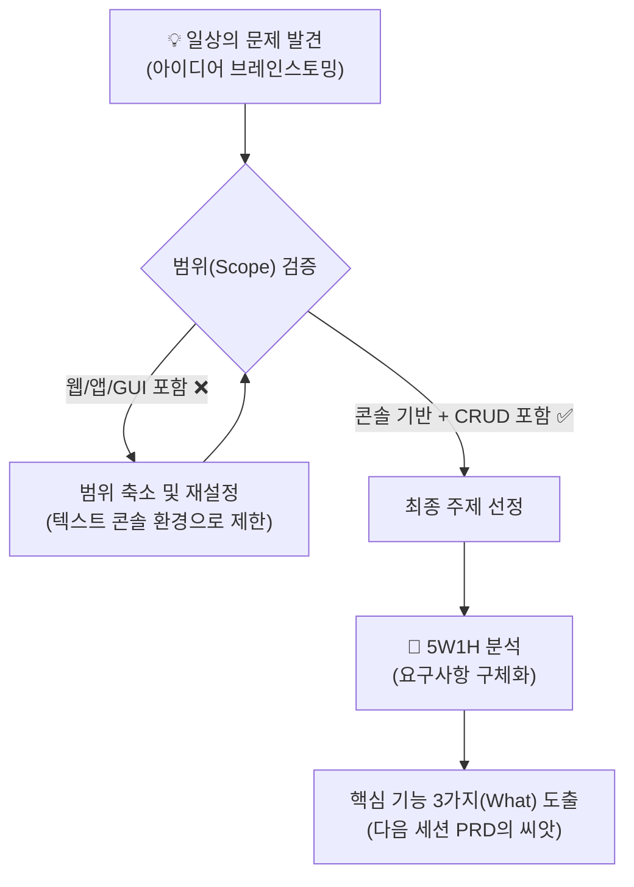

# 마이크로 세션: 039 — 미니 스펙 프로젝트: 주제 선정 및 요구사항

> **세션 ID**: MS-PY101-039  
> **소요 시간**: 25분  
> **난이도**: medium  
> **청크 타입**: lab  
> **버전**: v2.1 (7섹션 구조)

---

## §1. 개요

> **Day 2 | PM | 세션 039**

### 🎯 학습 목표

이 세션이 끝나면, 수강생은 다음을 할 수 있습니다:

- 일상생활의 작은 문제를 해결하는 텍스트 콘솔 기반 파이썬 프로그램의 주제를 선정할 수 있다.
- 지나치게 큰 아이디어의 범위를 조절하여 현실적으로 구현 가능한 규모로 축소할 수 있다.
- 선정된 주제를 5W1H 프레임워크에 맞추어 필수 요구사항(CRUD 기능 포함)으로 도출해 낼 수 있다.

### 선행 세션 환기

지금까지 우리는 제가 미리 준비해 드린 "고객 정보 관리 프로그램"이라는 하나의 고정된 주제로 연습을 진행해 왔어요. 요구사항을 뽑는 방법부터 PRD 작성법, 그리고 사용자의 시나리오를 구성하는 방법까지 모두 그 공통 주제 안에서 훈련했습니다. 마치 운전면허 학원 코스 안에서 안전하게 주차 연습을 한 것과 같죠. 이제 그 훈련은 모두 끝났습니다. 오늘 오후부터 시작하는 '미니 스펙 프로젝트'는 Day 2의 배움을 총망라하는 아주 중요한 종합 실습이에요. 여러분이 직접 세상에 필요한 아이디어를 떠올리고, 기획부터 AI 프롬프트 작성, 코드 생성까지 전 과정을 스스로 완주해 보는 첫 번째 도전입니다. 오늘 이 세션에서는 그 위대한 여정의 첫 단추인 '주제 선정과 요구사항 도출'을 함께 해볼 거예요.

---

## §2. 핵심 개념 (+ 🗣️ 강사 대본 + Mermaid)

### 기성복 입기에서 나만의 맞춤정장 짓기로

이전 세션들에서 우리가 했던 실습은 백화점에서 '기성복'을 골라 입어보며 핏을 맞추는 법을 배우는 과정이었어요. 이미 만들어져 있는 옷(고객 관리 프로그램)을 입어보고 "어깨 품이 좀 좁네", "소매를 늘려야겠네" 하면서 요구사항을 다듬는 연습을 한 셈이죠. 하지만 개발의 진짜 묘미는 남이 만든 옷에 몸을 구겨 넣는 것이 아니라, 내가 원하는 치수와 원단으로 세상에 단 한 벌뿐인 '맞춤정장'을 직접 지어 입는 데 있습니다. 

이제 여러분은 옷감(주제)을 직접 고르고, 줄자로 정확한 치수(요구사항)를 재고, 원하는 핏(시나리오)을 스케치하게 됩니다. 물론 처음부터 화려한 턱시도나 드레스를 만들 필요는 없어요. 오히려 아주 심플하고 깔끔한 흰 셔츠 한 벌을 제대로 완성해 보는 것이 중요합니다. 이 첫 경험이 앞으로 여러분이 더 크고 복잡한 소프트웨어를 만들어 나갈 때 든든한 뼈대가 되어줄 거예요.

🗣️ **강사 대본 (Instructor Script)**:

> 여러분, 지금까지 잘 따라와 주셔서 감사합니다. 이제 진짜 개발자가 되어볼 시간이에요. 방금 전까지 우리는 똑같은 교보재를 가지고 연습했지만, 지금부터는 각자의 자리에서 서로 다른 프로그램을 기획할 겁니다. 
> 
> "나는 개발을 한 번도 안 해봤는데 어떻게 내 프로그램을 만들지?" 하는 걱정이 드실 수 있어요. 괜찮습니다. 코드는 AI가 다 짜줄 거니까요. 여러분이 집중해야 할 것은 단 하나, "내가 일상에서 겪는 어떤 작은 불편함을 해결할 것인가"를 찾아내는 일입니다. 너무 거창한 세상을 구하는 앱을 상상하지 마세요. 내가 점심 메뉴 고르기 귀찮을 때 쓸 랜덤 룰렛, 매일 외워야 할 영어 단어 5개를 시험 보는 단어장처럼 아주 사소하고 개인적인 문제가 가장 좋은 주제입니다. 내 손으로 원단을 고르고 치수를 재서 나만의 첫 맞춤 셔츠를 만들어 봅시다.

### 프로젝트 킥오프 흐름 (Mermaid)



---

## §3. 상세 내용

### Why — 왜 스스로 문제를 정의해야 하는가?

"AI가 코드를 알아서 잘 짜주는데, 굳이 제가 처음부터 기획을 다 해야 하나요?"라는 의문이 생길 수 있습니다. AI 시대에 가장 흔히 하는 착각이 바로 그것이에요. 사실 코드를 짜는 '문제 해결'의 영역은 이제 AI가 사람보다 훨씬 빠르고 정확하게 해냅니다. 하지만 "어떤 프로그램을 만들 것인가"를 결정하는 '문제 정의'는 철저히 인간의 영역으로 남아 있습니다.

문제 정의가 제대로 되지 않은 상태에서 AI에게 코딩을 맡기면, 그럴싸해 보이지만 아무 쓸모가 없는 엉뚱한 결과물이 나옵니다. 우리는 이번 미니 프로젝트를 통해 코딩 문법을 외우는 것이 아니라, 내가 겪는 불편함을 논리적인 요구사항으로 번역하여 AI에게 정확히 전달하는 '문제 정의 능력'을 기르는 데 집중할 거예요.

### What — 미니 스펙 프로젝트의 조건

이번 프로젝트에서 여러분이 만들 프로그램은 반드시 다음 세 가지 핵심 조건을 충족해야만 합니다. 이 조건을 벗어나면 실습 시간 내에 완주하기가 매우 어려워져요.

첫째, 화려한 버튼이나 이미지가 없는 **텍스트 콘솔 기반**이어야 합니다. 웹사이트나 모바일 앱을 상상하셨다면 과감히 버려주세요. 오직 터미널 창에서 키보드로 글자를 입력하고, 텍스트로 결과를 확인하는 아주 투박한 형태의 프로그램입니다. 

둘째, 프로그램 안에 데이터의 **CRUD** 기능이 반드시 들어가야 합니다. 데이터를 생성하고(Create), 읽어오고(Read), 수정하고(Update), 삭제하는(Delete) 이 네 가지 동작은 소프트웨어가 데이터를 다루는 가장 기본적인 논리입니다. 예를 들어 영단어장이라면, 새 단어를 추가하고(C), 목록을 보고(R), 틀린 뜻을 고치고(U), 다 외운 단어를 지우는(D) 기능이 모두 있어야 해요.

셋째, 대략 **100줄 이내의 파이썬 코드**로 구현할 수 있는 아주 작은 규모여야 합니다. 너무 많은 기능을 담으려고 하면 완성조차 하지 못하고 길을 잃게 됩니다.

### How — 욕망을 덜어내고 Scope 조절하기

주제를 고민하다 보면 누구나 욕심이 생깁니다. "이왕 만드는 거 로그인도 넣고, 데이터베이스도 연결하고, 예쁜 화면도 입혀야지!" 하고 말이죠. 이때 가장 필요한 기술이 바로 스코프(Scope) 조절입니다. 기획의 덩치를 잘라내어 현실적인 크기로 줄이는 과정이에요.

만약 '개인 피트니스 트래커'를 만들고 싶다고 해보죠. 처음엔 "사용자별 회원가입을 받고, 운동 영상을 재생해주고, 칼로리를 그래프로 보여줘야지"라고 생각할 수 있습니다. 하지만 우리의 3가지 조건을 떠올려보세요. 텍스트 콘솔 기반이어야 하고 100줄 이내여야 합니다. 그렇다면 과감하게 깎아내야 합니다. 회원가입은 빼고 오직 나 혼자만 쓰는 용도로 만듭니다. 영상 재생이나 그래프 기능도 빼고, 단순히 "오늘 무슨 운동을 몇 세트 했는지 텍스트로 저장하고 보여주는 기능"만 남기는 거예요. 이렇게 핵심적인 가치 하나만 남기는 연습이 바로 스코프 조절입니다.

---

## §4. 실습 가이드 (+ 🎙️ 실습 대본)

### 실습 목표

조별로 모여 일상에서 불편함을 해결할 아이디어를 브레인스토밍하고, 최종 주제를 하나 선정하여 5W1H 프레임워크로 초기 요구사항을 도출해 봅니다.

🎙️ **실습 가이드 대본 (Lab Guide)**:

> 자, 이제 진짜 여러분의 프로젝트를 시작할 시간입니다. 지금부터 25분 동안 팀별로 머리를 맞대고 고민해 볼 거예요. 제가 빈 포스트잇과 마커를 나눠드렸죠? 첫 10분은 철저하게 브레인스토밍 시간입니다. "이런 것도 프로그램으로 만들 수 있을까?" 싶은 사소한 것들도 일단 다 적어보세요. 점심 메뉴 추천기, 오늘의 감사 일기장, 가위바위보 전적 기록기 등 뭐든 좋습니다.
>
> 아이디어가 모이면 그중에서 팀원들이 가장 재미있어하는 주제 딱 하나를 고르세요. 주제를 고르셨다면 15분 동안 5W1H 양식에 맞춰 빈칸을 채워나갈 겁니다. 이 종이 한 장이 여러분이 만들 프로그램의 설계도가 될 거예요. 막막하거나 이 주제가 너무 큰 건 아닐지 걱정되시면 언제든 저를 불러주세요. 제가 돌아다니면서 여러분의 아이디어 크기를 알맞게 다듬어 드리겠습니다.

### 단계별 지시 — 브레인스토밍 및 5W1H 도출

| 단계 | 소요 시간 | 강사 지시사항 | 학습자/팀 액션 | 예상 결과 |
|------|----------|--------------|------------|----------|
| 1 | 5분 | "일상의 불편함을 포스트잇에 적어보세요" | 개인별로 최소 3개 이상의 아이디어 메모 작성 | 다양한 실생활 밀착형 아이디어 풀 형성 |
| 2 | 5분 | "아이디어를 공유하고 하나를 투표로 정하세요" | 조별로 아이디어 취합 후 최종 1개 주제 선정 | 콘솔 기반, CRUD가 가능한 팀 주제 확정 |
| 3 | 10분 | "5W1H 양식의 빈칸을 채워보세요" | 선정된 주제를 바탕으로 Who, When, Where, Why, How 분석 | 프로그램의 목적과 사용 환경 정의 완료 |
| 4 | 5분 | "가장 중요한 What, 핵심 기능 3가지를 뽑아내세요" | 구체적으로 이 프로그램이 제공할 3가지 기능(CRUD 포함) 작성 | 다음 세션 PRD 작성의 기반이 될 뼈대 완성 |

**[단계 1~2] 주제 브레인스토밍 및 선정**

각자 펜을 들고 2분 동안 머릿속에 떠오르는 아이디어를 최소 3개 적어보세요. "영단어를 자꾸 까먹어서 나만의 퀴즈를 만들고 싶다", "매일 커피를 몇 잔 마시는지 기록하고 싶다"처럼 아주 구체적이고 사소할수록 좋습니다. 

팀원들과 아이디어를 나누고 가장 마음이 끌리는 하나를 선택하세요. 고를 때의 기준은 딱 하나, "이 프로그램이 완성되면 우리가 진짜로 쓸 것 같은가?" 입니다. 내가 직접 쓸 프로그램을 만들 때 몰입도가 가장 높아집니다. 단, 앞서 강조했듯 GUI 화면이나 웹 서버가 필요한 주제는 지금 단계에서 과감히 제외해 주세요.

**[단계 3~4] 5W1H 기반 요구사항 도출**

주제가 확정되었다면 이제 뼈대를 세울 차례입니다. 메모장에 5W1H를 적고 하나씩 답을 채워보세요. 

- **Who**: 이 프로그램은 누가 쓰는가? (예: 매일 커피 값을 아끼고 싶은 나)
- **When**: 언제 주로 사용하는가? (예: 커피를 마실 때마다 즉시)
- **Where**: 어떤 환경에서 실행하는가? (예: 내 노트북의 파이썬 터미널 창)
- **Why**: 어떤 문제를 해결하려고 하는가? (예: 매일 커피에 쓰는 돈을 시각화해서 지출을 줄이려고)
- **How**: 데이터는 어떻게 저장할 것인가? (예: 텍스트 파일이나 CSV로 저장)

가장 중요한 것은 **What**입니다. 이 프로그램이 제공해야 할 핵심 기능 3가지를 구체적으로 적어주세요. 이 기능들 안에 반드시 데이터를 추가하고, 읽고, 수정하거나 삭제하는 CRUD 논리가 녹아들어 있어야 합니다. 지금 적는 이 3가지 기능이 다음 시간에 배울 PRD 문서의 필수 요구사항(FR-001, FR-002, FR-003)이 됩니다.

> 💡 **강사 노트**: 수강생들이 처음 주제를 정할 때 '인스타그램'이나 '당근마켓' 같은 거대한 플랫폼을 모방하려는 경향이 있습니다. 이때 강사는 재빨리 개입하여 "터미널 검은 화면에서 글자만으로 당근마켓을 어떻게 구현할 수 있을까요? 중고 물품 리스트를 텍스트로만 띄워주는 기능으로 줄여볼까요?" 하는 식으로 스코프를 확 줄여주어야 합니다.

---


### 🎓 강사 노트 (Instructor Support)

- ⏱️ **타이밍**: 16:55 (25분, lab)
- 🎯 **핵심 활동**: 자유 주제 선택 + 5W1H
- ⚠️ **강사 주의사항**: 주제 고민 시간 충분히 확보


### 📋 실습 설계 보강 (Lab Packet)

**세션 039 실습 설계 보강**

미니 스펙 프로젝트: 주제 선정 및 요구사항
- **3-Stage Example Set**
  - 기본: 자유 주제 선정(가계부, 일기장, 할일 목록 등) → 5W1H 기반 요구사항 정리
  - 변형: AI에게 "나한테 맞는 미니 프로젝트 주제 3가지 추천해줘" 요청
  - 실수 해결: "주제가 너무 거창해요 (웹사이트, 앱)" → 콘솔 기반 단순 프로그램으로 범위 축소
- **난이도 예측**: 자유도가 높아서 오히려 결정 장애 발생
- **타이밍 가이드**: 주제 브레인스토밍 5분 | 주제 확정 3분 | 5W1H 요구사항 12분 | 정리 5분
- **심리적 장벽**: "아무것도 떠오르지 않아요" — 백지 공포
- **자가 점검**:
  - [ ] 주제를 하나 확정했는가?
  - [ ] 콘솔 입출력 기반으로 범위를 제한했는가?
  - [ ] 핵심 기능 3가지 이상을 정의했는가?

## §5. 문서 템플릿 및 가이드 

이번 세션은 기획 단계이므로 파이썬 코드를 직접 작성하지 않습니다. 대신 조별로 노션이나 메모장에 복사해서 사용할 수 있는 5W1H 텍스트 템플릿을 제공합니다.

### 5W1H 요구사항 도출 템플릿

```text
# [프로젝트 가칭: _______________ ]

1. Who (사용자): 
2. When (사용 시점): 
3. Where (사용 환경): 터미널 / 파이썬 콘솔
4. Why (해결하려는 문제): 
5. How (데이터 관리 방식): 

6. What (핵심 기능 3가지 - CRUD 필수 포함):
  - 기능 1 (Create/Read 중심): 
  - 기능 2 (Update 중심): 
  - 기능 3 (Delete 또는 조회 중심): 
```

> 🤖 **AI 프롬프트 예시**: 브레인스토밍이 막힐 때 AI에게 이렇게 물어보세요. "나는 파이썬 초보자야. 터미널 콘솔에서 100줄 이내로 만들 수 있고, CRUD 기능이 들어간 실생활 밀착형 미니 프로그램 아이디어를 5개만 추천해줘."

---

## §6. 요약

### 핵심 학습 포인트

이번 세션에서 여러분은 남이 만들어둔 예제가 아니라, 오직 나만의 오리지널 프로그램을 만들기 위한 첫걸음을 뗐습니다. 미니 스펙 프로젝트가 성공하려면 욕심을 버리고 스코프를 조절하는 것이 가장 중요해요. 화려한 웹이나 앱이 아니라 텍스트 콘솔 환경으로 제한하고, 데이터의 생성과 읽기, 수정, 삭제라는 필수적인 CRUD 논리에 집중했습니다. 그리고 선정된 주제를 5W1H 프레임워크에 넣어 뼈대를 단단하게 세웠어요. 문제 해결은 AI가 하지만, 어떤 문제를 풀 것인지 정의하는 것은 여러분의 몫이라는 점을 꼭 기억해 주세요.

### 다음 세션 예고

여러분 손에 들려있는 그 포스트잇 메모가 바로 다음 세션의 핵심 재료입니다. 다음 시간에는 이 거친 아이디어 스케치를 AI가 완벽하게 이해할 수 있는 전문적인 PRD(제품 요구사항 정의서) 문서로 변환해 볼 거예요. 그리고 그 문서를 바탕으로 AI에게 코드를 뽑아내는 '마스터 프롬프트'를 작성하는 방법까지 배웁니다. 내가 상상한 아이디어가 실제 코드로 변하는 마법 같은 순간이 기다리고 있습니다.

### 브릿지 노트

> "자, 다들 멋진 주제 하나씩 정하셨나요? 옆 조의 아이디어를 살짝 들어보니 벌써부터 완성된 모습이 기대되네요. 지금 적으신 그 짧은 메모가 여러분의 첫 소프트웨어를 탄생시킬 소중한 씨앗입니다. 잠깐 쉬고 오셔서, 이 씨앗을 AI라는 비옥한 토양에 심어볼게요. 다음 시간에 뵙겠습니다!"

---

<details>
<summary>💡 교안 원문 (v1.0 백업)</summary>

```markdown
# 마이크로 세션: 039 — 미니 스펙 프로젝트: 주제 선정 및 요구사항

> **세션 ID**: MS-PY101-039  
> **소요 시간**: 25분  
> **난이도**: medium  
> **청크 타입**: lab

---

## ① 도입 (Hook)

🗣️ **강사 대본 (Instructor Script)**:

지금까지는 제가 드린 주제, "고객 정보 관리 프로그램"으로 연습했습니다. 요구사항 뽑는 법, PRD 쓰는 법, 시나리오 만드는 법까지 모두 이 하나의 주제로 훈련했죠. 이제 훈련은 끝났습니다. 여러분만의 오리지널 프로그램을 만들 시간이에요. 지금부터 시작하는 미니 스펙 프로젝트는 Day 2의 배움을 총망라하는 종합 실습입니다. 여러분이 직접 주제를 정하고, 요구사항을 뽑고, PRD를 쓰고, 프롬프트를 만들어 AI에게 코드를 받아내는 전 과정을 스스로 해볼 겁니다. 오늘 이 세션에서는 그 첫 단추, 주제 선정과 요구사항 도출을 합니다.

---

## ② 비유 풀이 (Analogy)

🗣️ **강사 대본 (Instructor Script)**:

지금까지는 기성복을 입어보며 핏을 맞추는 법을 배웠습니다. 백화점에서 이미 만들어진 옷을 골라 입어보고, "어깨가 좀 넓네", "소매가 짧네" 하면서 자기 몸에 맞는 사이즈를 찾는 연습을 한 거예요. 고객 관리 프로그램이라는 기성복으로 PRD 작성법이라는 핏 맞추기를 연습한 셈이죠.

이제는 다릅니다. 내가 입고 싶은 양복의 원단부터 치수까지 내 마음대로 정해서 세상에 하나뿐인 옷을 짓는 시간입니다. 원단(주제)을 고르고, 치수(요구사항)를 재고, 디자인(시나리오)을 그리는 거예요. 물론 처음부터 드레스 코트를 만들 필요는 없습니다. 깔끔한 셔츠 한 벌이면 충분해요. 중요한 건 내 손으로 처음부터 끝까지 만들어보는 경험입니다.

---

## ③ 개념 설명 (What)

🗣️ **강사 대본 (Instructor Script)**:

미니 스펙 프로젝트의 범위를 명확히 하겠습니다. 여러분이 만들 프로그램은 반드시 세 가지 조건을 충족해야 합니다. 첫째, 텍스트 콘솔 기반이어야 합니다. 화려한 웹사이트나 모바일 앱을 상상하지 마세요. 터미널에서 글자로 입력하고 글자로 출력하는 프로그램입니다. 둘째, 데이터의 CRUD가 포함되어야 합니다. CRUD란 생성(Create), 읽기(Read), 수정(Update), 삭제(Delete)의 약자로, 데이터를 다루는 가장 기본적인 네 가지 동작입니다. 셋째, 100줄 이내의 파이썬 코드로 구현 가능한 규모여야 합니다.

이 세 가지 조건 안에서 주제는 완전히 자유입니다. 개인 단어장 퀴즈 프로그램, 오늘의 식단 기록기, 로또 번호 관리기, 독서 타이머, 점심 메뉴 랜덤 룰렛, 가위바위보 전적 기록기 등 일상생활의 작은 불편함을 해결하는 아이디어면 됩니다. 핵심은 "문제 정의"입니다. AI 시대에는 코드를 외우는 것보다 "어떤 문제를 해결할 것인가"를 명확히 정의하는 능력이 훨씬 중요합니다. 너무 화려한 것을 상상하지 말고, 텍스트 환경에서 데이터를 저장하고 꺼내보는 본질적인 CRUD 논리를 설계하는 것에 집중하세요.

---

## ④ 코드/실제 활용 (How)

🎙️ **실습 가이드 (Lab Guide)**:

실습을 시작합니다. 총 2단계로 진행합니다.

**1단계 (10분) — 주제 브레인스토밍 및 선정**: 포스트잇이나 메모장을 꺼내세요. 2분 동안 머릿속에 떠오르는 아이디어를 최소 3개 적어보세요. "영단어를 잘 까먹어서 나만의 단어장 퀴즈를 만들고 싶다", "매일 뭘 먹었는지 기록하고 싶다", "운동 루틴을 관리하고 싶다" 이런 식으로요. 3개를 적었으면 그중에서 가장 마음이 끌리는 하나를 고르세요. 고를 때 기준은 간단합니다. "이 프로그램이 진짜 있으면 내가 쓸 것 같은가?" 내가 직접 쓸 프로그램을 만들 때 동기부여가 가장 강합니다.

주의할 점이 있습니다. "인스타그램 만들기", "채팅 앱 만들기"처럼 시각적 그래픽(GUI)이나 서버가 필요한 주제는 피해주세요. 우리는 텍스트 콘솔에서 돌아가는 프로그램을 만듭니다. 만약 주제가 너무 크다 싶으면 강사에게 손을 들어주세요. 함께 범위를 좁혀드리겠습니다.

**2단계 (15분) — 5W1H 기반 요구사항 도출**: 주제가 정해졌으면 우리가 세션 032에서 배운 5W1H 체크리스트를 꺼냅니다. 메모장에 다음 항목을 채워보세요. Who(누가 쓰는가), What(핵심 기능 3가지는 무엇인가), When(언제 사용하는가), Where(어떤 환경에서 실행하는가), Why(어떤 문제를 해결하는가), How(데이터를 어떻게 저장하고 꺼내는가). 이 여섯 가지 질문에 답하다 보면 자연스럽게 요구사항의 뼈대가 잡힙니다. 특히 What 항목에서 핵심 기능 3가지를 반드시 적어주세요. 이것이 나중에 FR-001, FR-002, FR-003이 됩니다.

> 💡 **강사 노트**: 미니 스펙 프로젝트의 범위 설정과 CRUD 기반 주제 선정 가이드는 `7 기획.pdf` §7.1, §7.5에 기반합니다 [Source A: SRC-A03]. "문제 정의가 문제 해결보다 중요하다"는 관점은 `AI 시대의 서사 v3` 문서의 핵심 철학을 반영했습니다 [Source B: SRC-A01]. 소규모 프로젝트에서의 요구사항 도출 실전 사례는 Deep Research 보고서에서 보강했습니다 [Source C: SRC-C02].

---

## ⑤ 정리 및 다음 세션 예고 (Closing)

🗣️ **강사 대본 (Instructor Script)**:

작고 귀여운 프로그램이라도 완벽한 기획을 거치면 훌륭한 포트폴리오가 됩니다. 여러분은 방금 세상에 하나뿐인 자신만의 프로그램 주제를 정하고, 5W1H로 요구사항의 뼈대를 잡았습니다. 이 짧은 메모가 여러분의 첫 오리지널 소프트웨어의 씨앗입니다. 주제와 뼈대가 잡혔으니, 다음 세션에서는 이 씨앗에 물을 주고 싹을 틔워볼 겁니다. 방금 만든 요구사항 메모를 PRD 문서로 변신시키고, AI에게 보낼 마스터 프롬프트까지 준비하러 갑시다.
```

</details>

---

## §7. 참고 자료

### 3-Source 출처

- **Source A (로컬 참고자료)**: 「7 기획.pdf」 (SRC-A03) — 요구사항 분석의 본질(§7.1) 및 미니 스펙 프로젝트 가이드(§7.5)
- **Source B (로컬 참고자료)**: 「AI 시대의 서사 v3 - Claude.md」 (SRC-A01) — 문제 정의 역량이 문제 해결(코딩) 역량보다 우위에 있다는 핵심 철학
- **Source C (Deep Research)**: 소규모 프로젝트에서의 요구사항 도출 실전 사례 및 CRUD 기반 기획 방법론 (SRC-C02)

### 추가 학습 자료

- [Product Requirements Document 가이드](https://www.atlassian.com/agile/product-management/requirements): PRD 작성을 위한 아틀라시안의 애자일 가이드
- [5W1H 기획법 기초](https://en.wikipedia.org/wiki/Five_Ws): 문제 정의를 위한 5W1H 프레임워크 위키피디아 문서
- [파이썬 초보자를 위한 토이 프로젝트 아이디어](https://github.com/karan/Projects): 초보자가 참고하기 좋은 콘솔 기반 미니 프로젝트 리스트

### 강사 노트

> 💡 **강사 노트**: 이 세션은 Day 2의 가장 중요한 변곡점입니다. 수강생들은 보통 자신의 실력을 과대평가하거나, 거창한 앱을 상상하다가 지레 포기해버리는 양극단의 모습을 보입니다. 강사는 조별로 순회하면서 아이디어의 '스코프(Scope)를 칼같이 잘라주는 역할'을 해야 합니다. "그 기능은 빼고 텍스트로만 합시다", "회원가입은 빼고 내 이름만 고정으로 넣읍시다"라고 지속적으로 가이드해 주어 100줄 이내의 파이썬 CRUD 프로그램이라는 명확한 경계선 안착을 유도하세요.

---

## ✅ 세션 완료 체크리스트 (강사용)

- [ ] §1~§7 모든 섹션이 충실하게 작성되었는가?
- [ ] 맞춤정장 비유가 §2에서 충분히 확장되었는가?
- [ ] 텍스트 콘솔 기반, CRUD, 100줄 이내라는 3가지 제약 조건이 명확히 전달되었는가?
- [ ] 브레인스토밍 및 5W1H 도출 과정이 단계별로 구체화되었는가?
- [ ] 스코프 조절의 중요성과 예시가 §3에 포함되었는가?
- [ ] 다음 세션(040 PRD 작성) 브릿지 노트가 포함되었는가?
- [ ] §6에 기존 v1.0 교안 원문이 포함되었는가?

---

**🔗 선행 세션**: [세션-032] 5W1H 기반 요구사항 분석 연습  
**🔗 후행 세션**: [세션-040] 미니 스펙 프로젝트: PRD 작성 및 프롬프트 준비

---

*작성 일시: 2026-02-25*  
*작성 에이전트: Sisyphus-Junior*  
*교안 구조: 7섹션 (A0 팀 공통 표준)*