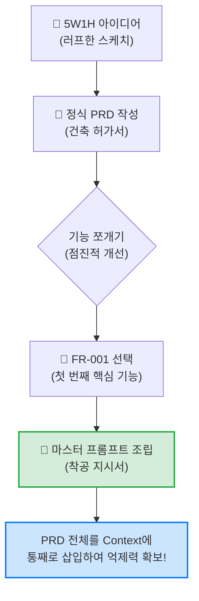
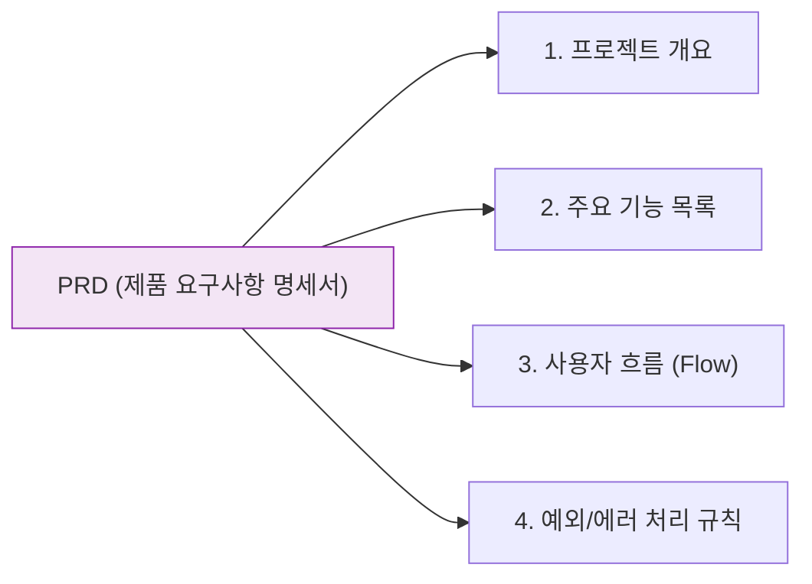

# 마이크로 세션: 040 — 미니 스펙 프로젝트: PRD 작성 및 프롬프트 준비

> **세션 ID**: MS-PY101-040  
> **소요 시간**: 25분  
> **난이도**: medium  
> **청크 타입**: lab  
> **버전**: v2.1 (7섹션 구조)

---

## §1. 개요

> **Day 2 | PM | 세션 040/043**

### 🎯 학습 목표

이 세션이 끝나면, 수강생은 다음을 할 수 있습니다:

- 5W1H 요구사항 메모를 AI와 협력하여 정식 마크다운 PRD(제품 요구사항 정의서)로 변환할 수 있다
- 작성된 PRD 전체를 프롬프트의 Context(맥락) 영역에 삽입하여 AI의 환각을 통제할 수 있다
- 점진적 개선 전략을 적용하여, 전체 기능 중 첫 번째 핵심 기능(FR-001)만 구현하도록 지시하는 마스터 프롬프트를 조립할 수 있다

### 선행 세션 환기

바로 직전 세션에서 여러분은 조별로 머리를 맞대고 아주 훌륭한 아이디어들을 쏟아냈습니다. 개인 단어장부터 식단 기록기까지, 5W1H 프레임워크를 사용해서 요구사항의 튼튼한 뼈대를 잡았죠. 척박한 땅에 건강한 씨앗을 심은 셈입니다. 이제 이 씨앗에 물을 주고 단단한 뿌리를 내리게 할 시간입니다. 오늘 우리가 할 일은 명확합니다. 여러분의 그 아이디어 메모를 실제 실무에서 쓰는 정식 PRD 문서로 업그레이드하고, 그 문서를 무기 삼아 AI에게 보낼 첫 번째 마스터 프롬프트를 완성하는 것입니다. 

---

## §2. 핵심 개념 (+ 🗣️ 강사 대본 + Mermaid)

### 건축 허가서와 착공 지시서

건물을 짓는 과정을 상상해 봅시다. 지난 세션에서 여러분이 끄적였던 5W1H 메모는 "우리 동네에 예쁜 3층짜리 카페를 짓겠다"고 스케치북에 그린 대략적인 도면과 같습니다. 아주 훌륭한 출발점이지만, 이 도면을 들고 당장 굴삭기 기사님에게 달려가서 땅을 파달라고 할 수는 없죠. 

우리가 지금 만들어야 할 것은 시청에 제출해서 승인을 받을 수 있는 정식 **'건축 허가서'**입니다. 층수는 몇 층인지, 연면적은 얼마인지, 비상구는 어디에 있고 안전 기준은 어떻게 충족할 것인지 빠짐없이 적혀 있는 문서 말입니다. 소프트웨어 세계에서 이 건축 허가서가 바로 PRD입니다. 

허가서가 완벽하게 준비되었다면, 이제 현장 소장(AI)에게 첫 번째 **'착공 지시서'**를 내릴 차례입니다. "여기 도면과 허가서가 있습니다. 우선 바닥부터 파주세요. 깊이는 정확히 2미터, 폭은 10미터입니다." 이 착공 지시서가 바로 우리가 조립할 마스터 프롬프트입니다. 건축 허가서(PRD)가 꼼꼼하고 완벽하다면, 착공 지시서(프롬프트) 자체는 단 세 줄이면 충분합니다. 설계의 완벽함이 곧 코드의 완벽함을 보장하기 때문입니다.

🗣️ **강사 대본 (Instructor Script)**:

> 여러분, 앞서 작성한 메모를 보면서 '이 정도면 코딩 시작해도 되지 않나?' 생각하셨을 겁니다. 하지만 AI 시대의 코딩은 조금 다릅니다. AI는 텍스트를 먹고 자라는 괴물입니다. 우리가 모호하게 말하면 엉뚱하게 짜주고, 엄밀하게 말하면 완벽하게 짜줍니다. 
> 
> 오늘 우리는 PRD라는 아주 튼튼한 울타리를 칠 겁니다. 이 울타리가 없으면 AI는 카페를 지어달라는데 갑자기 수영장을 파기 시작할지도 모릅니다. 여러분이 기획서만 빈틈없이 깎아두면, AI에게 내리는 실제 프롬프트는 정말 짧아도 됩니다. "내가 준 문서대로, 첫 번째 기능만 만들어봐." 이것이 끝입니다. 지금부터 그 완벽한 울타리를 치는 작업을 시작하겠습니다.

> 💡 **강사 노트**: 기획서(PRD)와 지시서(프롬프트)의 역할을 건축 비유로 명확히 분리하는 것이 핵심입니다. 코딩을 서두르려는 수강생들에게 '문서 작업의 중요성'을 납득시키는 훅(Hook)으로 작용합니다.

### Mermaid 다이어그램: PRD에서 프롬프트로의 변환 흐름



---


### 🎨 추가 시각화 (Visualization Packet)

**PRD (제품 요구사항 명세서) 구조**

AI에게 명확한 개발 범위를 지시하기 위해 필요한 문서의 핵심 뼈대입니다.



## §3. 상세 내용

### Why — 왜 PRD를 프롬프트에 통째로 넣어야 하는가?

세션 025에서 우리는 프롬프트를 구성하는 4가지 요소, 즉 PTCF(Persona, Task, Context, Format)를 배웠습니다. 여기서 가장 중요한 것이 바로 Context(맥락)입니다. AI에게 "고객 관리 프로그램 짜줘"라고 Task만 던지면, AI는 전 세계 인터넷에 널려 있는 온갖 복잡한 기능들을 긁어모아 거대한 스파게티 코드를 만들어냅니다. 환각(Hallucination)이 시작되는 것이죠.

하지만 Context 영역에 여러분이 작성한 PRD 전체를 통째로 삽입하면 이야기가 달라집니다. AI에게 "네가 참고할 세상은 오직 이 문서 안쪽뿐이야"라고 한계를 그어주는 역할을 합니다. 절대 명세의 범위를 벗어나지 않도록 AI를 강력하게 통제하는 목줄이 되는 것입니다.

### What — 마스터 프롬프트란 무엇인가?

마스터 프롬프트는 첫 번째 코드를 생성해 내는 가장 중요한 지시서입니다. 단순히 "코드 짜줘"가 아니라, 우리가 세션 027에서 배운 코드 생성 5대 필수 항목을 꽉 채운 템플릿입니다. 어떤 기능을 만들 것인지, 입력 데이터의 형태는 무엇인지, 출력은 어떻게 해야 하는지, 제약 조건(예: 외부 라이브러리 금지)은 무엇인지, 에러가 나면 어떻게 처리할 것인지(예외 처리)를 명확하게 담고 있습니다.

여기에 더해, 역할(Persona)을 부여하고 여러분의 PRD를 컨텍스트로 제공하면, 완벽에 가까운 마스터 프롬프트가 탄생합니다.

### How — 어떻게 점진적으로 접근하는가?

여기서 초보자들이 가장 많이 하는 실수가 있습니다. 정성껏 만든 PRD를 주면서 "이거 전부 다 한 번에 코딩해 줘"라고 엔터를 치는 것입니다. 절대 이렇게 하시면 안 됩니다.

세션 028에서 배운 점진적 개선(Iterative Refinement) 전략을 떠올려 보세요. 기능이 4개라면 4개를 한 번에 만드는 것이 아니라, 가장 뼈대가 되는 첫 번째 기능 하나만 떼어내서 먼저 만들어야 합니다. 예를 들어 회원 관리 프로그램이라면, 수정이나 삭제 기능은 나중에 생각하고 'FR-001: 새로운 고객 정보 등록하기' 기능 하나만 집중해서 요청하는 것입니다. 이 첫 번째 뼈대 코드가 무사히 돌아가는 것을 확인한 뒤에야 다음 살을 붙여나가는 것이 AI 코딩의 정석입니다.

> ✅ **체크포인트**: 스스로 점검해 봅시다.
> - 왜 PRD의 기능 전체를 한 번에 코딩해 달라고 요청하면 안 될까요? ("한 번에 너무 많은 것을 요구하면 AI가 엉뚱한 코드를 짜거나 오류를 낼 확률이 급격히 높아지기 때문입니다. 점진적으로 뼈대부터 만들어야 합니다.")

---

## §4. 실습 가이드 (+ 🎙️ 실습 대본)

### 실습 목표

조별로 작성한 5W1H 메모를 AI에게 제공하여 정식 마크다운 PRD를 생성합니다. 그다음, 생성된 PRD를 컨텍스트로 활용하여 첫 번째 뼈대 코드를 요청할 마스터 프롬프트를 메모장에 완성합니다.

🎙️ **실습 가이드 대본 (Lab Guide)**:

> 자, 이제 여러분의 메모를 진짜 실무용 문서로 바꿀 시간입니다. 직접 마크다운 문법을 써가며 타이핑할 필요 없습니다. 여러분 앞에는 지치지 않는 기획 어시스턴트가 있으니까요. 우리가 할 일은 AI에게 명확한 기준을 주고 PRD를 뽑아내는 것입니다. 
> 
> PRD가 완성되고 나면 두 번째 단계로 넘어갑니다. 바로 마스터 프롬프트를 작성하는 건데요. 여기서 주의할 점! 프롬프트를 다 썼다고 절대 바로 엔터를 치지 마세요. 이번 세션에서는 총알을 장전하고 시위를 팽팽하게 당기는 것까지만 할 겁니다. 발사는 다음 세션에서 다 같이 할 테니까, 프롬프트는 텍스트 에디터나 메모장에 소중히 적어두시기 바랍니다.

### 단계별 실습 진행표

| 단계 | 소요 시간 | 강사 지시사항 | 학습자 액션 | 예상 결과 |
|------|----------|--------------|------------|----------|
| 1 | 5분 | "AI에게 메모를 주고 PRD 초안을 요청하세요" | 5W1H 메모를 복사하여 PRD 생성 프롬프트와 함께 입력 | AI가 7섹션 마크다운 PRD 생성 |
| 2 | 5분 | "생성된 PRD를 검토하고 필요시 수정하세요" | 빠진 기능이나 잘못된 내용이 없는지 확인 후 텍스트 파일로 저장 | 팀의 마스터 PRD 문서 확보 |
| 3 | 5분 | "가장 핵심이 되는 FR-001 기능을 선택하세요" | PRD 기능 목록 중 첫 번째 뼈대가 될 기능 논의 및 결정 | 타겟 기능 1개 확정 |
| 4 | 10분 | "메모장에 마스터 프롬프트를 조립하세요" | §5의 템플릿을 활용하여 메모장에 프롬프트 작성 (PRD 삽입) | 장전 완료된 마스터 프롬프트 초안 |

**[단계 1~2] AI를 활용한 PRD 생성 및 검토**

AI에게 여러분의 아이디어를 체계적인 문서로 정리해 달라고 요청합니다. 아래 §5에 있는 'PRD 생성용 프롬프트'를 복사해서 AI 채팅창에 붙여넣고, `[아이디어 메모]` 부분에 여러분이 직전 세션에서 작성한 5W1H 내용을 덮어쓰세요. 

AI가 훌륭한 마크다운 문서를 만들어내면, 찬찬히 읽어보세요. 여러분의 의도와 다르게 들어간 내용이 있나요? 그렇다면 AI에게 "3번 시나리오는 빼고, 이런 내용을 추가해 줘"라고 피드백을 주면 됩니다. 완벽해진 PRD는 복사해서 바탕화면에 `PRD_최종.md` 같은 이름으로 꼭 저장해 두세요.

**[단계 3~4] 마스터 프롬프트 작성 (엔터 금지!)**

PRD가 완성되었습니다. 이제 AI에게 코드를 짜달라고 명령할 지시서를 작성합니다. 아래 §5의 '1차 코드 생성 마스터 프롬프트' 템플릿을 복사해서 빈 메모장에 붙여넣으세요. 

템플릿의 `[여기에 PRD 전체 붙여넣기]` 부분에 방금 저장한 PRD 텍스트를 통째로 복사해서 넣습니다. 그리고 지시(Task) 영역을 꼼꼼히 다듬으세요. "PRD 전체를 다 만들어줘"가 아니라, "PRD의 FR-001 기능만 구현하는 뼈대 코드를 작성해 줘"라고 범위를 좁히는 것이 핵심입니다. 작성이 끝났다면 메모장을 그대로 열어두세요. 발사 준비 완료입니다.

---


### 🎓 강사 노트 (Instructor Support)

- ⏱️ **타이밍**: 17:20 (25분, lab)
- 🎯 **핵심 활동**: 자유 주제 PRD → 프롬프트
- ⚠️ **강사 주의사항**: 진행 속도 편차 주의


### 📋 실습 설계 보강 (Lab Packet)

**세션 040 실습 설계 보강**

미니 스펙 프로젝트: PRD 작성 및 프롬프트 준비
- **3-Stage Example Set**
  - 기본: 039에서 작성한 요구사항 → AI와 협력하여 PRD 완성 → 1단계 프롬프트 초안 작성
  - 변형: PRD 기반으로 코드 생성 5대 항목(기능/입력/출력/제약/예외) 프롬프트 작성
  - 실수 해결: "PRD와 프롬프트의 차이가 뭐예요?" → PRD는 지도, 프롬프트는 내비 목적지 설정
- **난이도 예측**: 문서(PRD)에서 실행(프롬프트)으로의 전환 지점이 혼란
- **타이밍 가이드**: PRD 완성 10분 | 1단계 프롬프트 작성 10분 | 검토 5분
- **심리적 장벽**: "문서가 너무 많아서 지쳤어요"
- **자가 점검**:
  - [ ] 자신만의 PRD 문서가 완성되었는가?
  - [ ] 코드 생성 5대 항목을 포함한 프롬프트 초안이 준비되었는가?
  - [ ] PRD의 FR 항목 중 1단계에서 구현할 범위를 정했는가?

## §5. 코드 및 프롬프트 템플릿 모음

### 프롬프트 1: PRD 생성용 프롬프트

여러분의 아이디어 메모를 정식 PRD로 변환할 때 사용하는 프롬프트입니다.

```text
당신은 파이썬 시니어 개발자 겸 꼼꼼한 프로덕트 매니저(PM)입니다.

아래의 아이디어 메모를 바탕으로 마크다운 형식의 PRD(제품 요구사항 정의서) 문서를 작성해 주세요.

[아이디어 메모]
(여기에 지난 세션에서 작성한 5W1H 메모를 붙여넣기하세요)

[필수 포함 항목]
1. 개요 및 배경
2. 문제 정의 (어떤 문제를 해결하는가)
3. 기능 요구사항 (FR-001, FR-002 형식으로 번호 부여, 구체적인 수용 기준 포함)
4. 비기능 요구사항 (NFR-001 형식, 기술 스택 및 제약 조건)
5. 사용자 시나리오 (프로그램 실행부터 종료까지 시간 순서대로)
6. 성공 지표 3가지
7. 범위 외 항목 (이번 버전에서 개발하지 않을 것)
```

### 프롬프트 2: 1차 코드 생성 마스터 프롬프트 (메모장 작성용)

완성된 PRD를 기반으로 첫 번째 뼈대 코드를 요청하는 마스터 프롬프트입니다. **AI 창에 바로 넣지 말고 꼭 메모장에서 작성하세요.**

```text
역할: 당신은 10년 차 파이썬 시니어 개발자입니다. 아주 견고하고 깔끔한 코드를 작성합니다.

지시: 아래 [컨텍스트]로 제공된 PRD를 100% 준수하여, 핵심 기능인 'FR-001' 부분만 우선 구현하는 뼈대(Skeleton) 코드를 작성해 주세요. 처음부터 모든 기능을 만들지 마세요.

제약 조건:
- 외부 패키지(라이브러리)는 절대 사용하지 마세요. 오직 파이썬 기본 내장 모듈만 사용합니다.
- 복잡한 폴더 구조 없이, 단 하나의 .py 파일로 바로 실행 가능하게 작성하세요.
- 코드의 각 기능 블록 위에 한국어로 상세한 주석을 달아주세요.
- 잘못된 입력값(예: 숫자를 넣어야 하는데 문자를 넣은 경우)이 들어왔을 때 프로그램이 종료되지 않도록 기본적인 예외 처리를 포함하세요.

출력 형식: 설명은 최소화하고, 복사해서 바로 실행할 수 있는 파이썬 코드 블록만 제공해 주세요.

[컨텍스트 - PRD 원문]
'''
(여기에 완성된 PRD 텍스트 전체를 통째로 붙여넣으세요)
'''
```

---

## §6. 요약

### 핵심 학습 포인트

우리는 오늘 코딩을 시작하기 전의 완벽한 준비 상태를 만들었습니다. 5W1H 아이디어 스케치를 체계적인 마크다운 PRD로 변환했고, 이 PRD를 든든한 가드레일 삼아 AI를 통제하는 방법을 배웠습니다. 프롬프트의 Context 영역에 문서 전체를 밀어 넣음으로써 환각을 방지하는 것이 핵심입니다. 또한, 욕심을 버리고 가장 중요한 첫 번째 기능(FR-001)부터 시작하는 점진적 개선의 마인드셋을 장착했습니다.

### 다음 세션 예고

활시위는 끝까지 당겨졌습니다. 여러분의 메모장에는 정교하게 다듬어진 마스터 프롬프트가 발사 명령만을 기다리고 있습니다. 다음 세션에서는 마침내 이 프롬프트를 AI에게 전송하고 코드를 뽑아낼 것입니다. 여러분의 아이디어가 실제 파이썬 코드로 살아 숨 쉬는 역사적인 순간을 맞이하러 가봅시다.

### 브릿지 노트

> "모두 메모장에 마스터 프롬프트를 잘 모셔두었나요? 훌륭합니다. 여러분은 지금 그냥 코더가 아니라 시스템을 설계하는 아키텍트의 자리에 앉아계십니다. 설계가 완벽하면 코딩은 AI가 순식간에 해치울 겁니다. 자, 심호흡 한 번 하시고, 다음 세션에서 여러분의 첫 번째 파이썬 프로그램을 세상에 태어나게 해봅시다. 이동하겠습니다."

---

## §7. 참고 자료

### 3-Source 출처

- **Source A (로컬 참고자료)**: `3 프롬프트 엔지니어링.pdf` (§3.9 코드 생성 프롬프트 특화 기법) — 코드 생성 시 필수 5대 항목 정의 및 Context 영역에 문서를 삽입하여 통제력을 확보하는 기법.
- **Source B (NotebookLM)**: `7 기획.pdf` (§7.3 PRD 구조, §7.5 미니 스펙 프로젝트 가이드) — 초보자 친화적인 7섹션 PRD 구조 설계 및 기능 요구사항(FR) 식별자 작성 표준.
- **Source C (Deep Research)**: SRC-C02 — PRD 기반 마스터 프롬프트 구성 시 한 번에 전체 생성을 피하고 1단계 뼈대 코드부터 요청하는 점진적 개선 전략의 실전 적용 사례.

### 강사 노트

> 💡 **강사 노트**: 수강생들은 보통 PRD가 완성되면 기쁜 마음에 곧바로 전체 코드를 짜달라고 프롬프트를 날리는 경향이 있습니다. 이를 막기 위해 이번 세션 내내 "엔터 치지 마세요, 메모장에 적어두세요"라고 반복해서 제어해 주셔야 합니다. 점진적 개선(Iterative Refinement)을 몸으로 익히게 하는 것이 이 미니 프로젝트의 성패를 가릅니다. FR-001을 고를 때는 가급적 '데이터 입력'이나 '메인 메뉴 표시' 같은 가장 기초적인 입출력 기능으로 유도해 주세요.

---

## ✅ 세션 완료 체크리스트 (강사용)

- [x] §1~§7 모든 섹션이 충실하게 작성되었는가?
- [x] 건축 허가서와 착공 지시서 비유가 §2에서 충분히 확장되었는가?
- [x] PRD 원문을 Context에 통째로 삽입하는 이유가 §3에 명시되었는가?
- [x] 실습 가이드에 단계별 소요 시간과 강사 대본이 포함되었는가?
- [x] PRD 생성 프롬프트와 마스터 프롬프트 템플릿이 §5에 모두 제공되었는가?
- [x] 메모장에 프롬프트를 작성하고 대기하라는 지시가 반복 강조되었는가?
- [x] 다음 세션(041 코드 생성)으로 자연스럽게 이어지는 브릿지가 포함되었는가?

---

**🔗 선행 세션**: [세션-039] 미니 스펙 프로젝트: 주제 선정 및 요구사항  
**🔗 후행 세션**: [세션-041] 미니 스펙 프로젝트: 코드 생성 및 실행 검증

---

*작성 일시: 2026-02-25*  
*작성 에이전트: A4B_Session_Writer*  
*교안 구조: 7섹션 (A0 팀 공통 표준)*