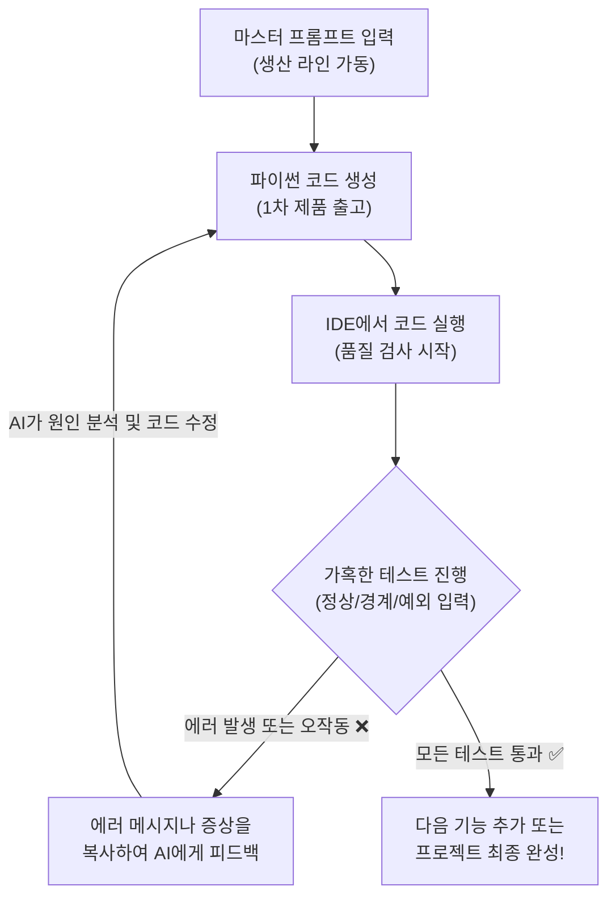

# 마이크로 세션: 041 — 미니 스펙 프로젝트: 코드 생성 및 실행 검증

> **세션 ID**: MS-PY101-041  
> **소요 시간**: 25분  
> **난이도**: medium  
> **청크 타입**: lab  
> **버전**: v2.1 (7섹션 구조)

---

## §1. 개요

> **Day 2 | PM | 세션 041/043**

### 🎯 학습 목표

이 세션이 끝나면, 수강생은 다음을 할 수 있습니다:

- 완성된 마스터 프롬프트를 AI에게 전달하여 온전한 기능이 담긴 파이썬 코드를 생성할 수 있다
- 생성된 코드를 로컬 IDE 환경에 적용하고 직접 실행하여 동작을 확인할 수 있다
- POE 프레임워크를 바탕으로 정상 흐름, 경계값, 예외 상황에 대한 기능 테스트를 독자적으로 수행할 수 있다
- 에러가 발생하거나 의도와 다르게 동작할 때, 그 현상을 AI에게 피드백하여 코드를 점진적으로 개선(Iterative Refinement)할 수 있다

### 선행 세션 환기

바로 직전 세션에서 우리는 조별 아이디어를 모아 텍스트 기반의 고객 정보 관리나 단어장 같은 미니 스펙 프로젝트의 뼈대를 잡았습니다. 그리고 그 아이디어를 단순히 머릿속에만 두지 않고, PRD라는 아주 단단한 문서로 뽑아낸 다음 마스터 프롬프트로 변환하는 작업까지 마쳤죠. 제가 그때 여러분에게 활시위를 최대한 팽팽하게 당겨둔 상태라고 말씀드렸을 거예요. 

오늘은 드디어 그 당겨둔 시위를 놓아 화살을 날려볼 차례입니다. 우리가 정성스럽게 작성한 그 요구사항 명세서가 어떻게 실제 살아 숨 쉬는 프로그램으로 렌더링되는지 직접 두 눈으로 확인하게 될 겁니다. 그리고 그 과정에서 필연적으로 마주하게 되는 빨간색 에러 메시지들을 어떻게 AI와 함께 슬기롭게 헤쳐 나가는지, 그 진짜 개발의 묘미를 경험해 보는 시간입니다.

---

## §2. 핵심 개념 (+ 🗣️ 강사 대본 + Mermaid)

### 비유 풀이: 공장의 생산 라인과 품질 검사(QC)

거대한 자동차 공장을 한 번 떠올려 봅시다. 우리가 지난 시간까지 만든 PRD와 마스터 프롬프트는 이 공장에 집어넣을 아주 정교한 '설계도'와 같습니다. 이 설계도를 공장의 메인 컴퓨터에 입력하고 생산 시작 버튼을 누르면, 기계들이 윙윙 돌아가며 부품을 깎고 조립해서 순식간에 자동차(코드) 한 대를 뚝딱 만들어 냅니다. AI는 지치지도 않고 빛의 속도로 이 자동차를 뽑아주죠.

하지만, 방금 조립 라인에서 갓 빠져나온 그 자동차를 확인도 안 하고 바로 매장에 전시해서 손님에게 팔 수 있을까요? 절대 불가능합니다. 세상의 어떤 공장도 새로 찍어낸 제품을 검수 없이 출고하지 않아요. 반드시 전원을 넣어보고, 와이퍼가 잘 움직이는지, 브레이크를 밟았을 때 차가 제대로 서는지, 일부러 핸들을 거칠게 꺾어보기도 하면서 불량이 없는지 가혹하게 확인하는 품질 검사(QC, Quality Control) 과정을 거칩니다.

여러분이 AI에게서 방금 얻어낸 코드도 완전히 똑같습니다. 겉보기에는 문법도 화려하고 당장이라도 완벽하게 돌아갈 것 같지만, 실제로 전원을 넣어보면(실행해 보면) 예상치 못한 곳에서 덜컹거리거나 아예 시동조차 안 걸리는 경우가 허다합니다. 여기서부터가 여러분이 활약할 진짜 무대입니다. 코드를 직접 실행해 보고(검증), 문제가 발견되면 설계도를 약간 수정하거나 AI에게 불량 보고서를 써서 다시 고쳐오라고 돌려보내는(개선) 과정을 반복해야 합니다. 이 사이클을 두세 바퀴 돌아야 비로소 우리가 안심하고 탈 수 있는 진짜 쓸 만한 프로그램이 완성됩니다.

🗣️ **강사 대본 (Instructor Script)**:

> 자, 드디어 여러분만의 마법 주문을 외울 시간이 왔습니다. 여러분이 고민해서 쓴 그 프롬프트를 AI 채팅창에 던지면, 아마 순식간에 수십, 수백 줄의 파이썬 코드가 폭포수처럼 쏟아져 내릴 거예요. 내 머릿속의 상상이 진짜 현실의 코드로 렌더링되는 아주 짜릿한 순간이죠. 이 순간을 마음껏 즐기시길 바랍니다.
>
> 하지만 제가 미리 찬물을 살짝 끼얹겠습니다. 지금 나온 그 코드가 한 번에 완벽하게, 아무 에러 없이 돌아갈 확률은 얼마나 될까요? 제 경험상 거의 제로에 가깝습니다. 그리고 놀랍게도, 그게 아주 지극히 정상입니다. 여러분이 코드를 실행했는데 화면에 무시무시한 빨간색 에러 텍스트가 뜬다고요? 축하합니다! 여러분은 방금 진짜 개발자가 되셨습니다. 개발이라는 작업의 8할은 코드를 치는 게 아니라 원래 이렇게 에러를 잡는 과정이거든요. 
> 
> 에러가 났다고 절대 당황하거나 여러분의 기획을 탓하지 마세요. 오히려 잘된 일입니다. 그 에러 메시지 자체가 AI와 깊이 있게 대화할 아주 훌륭한 안건이 되니까요. 지금부터 우리는 "생성하고, 검증하고, 다시 개선하는" 끝없는 개선의 쳇바퀴를 함께 굴려보겠습니다.

> 💡 **강사 노트**: 초보자들은 코드가 한 번에 실행되지 않으면 극도의 좌절감을 느끼거나 자신의 프롬프트가 잘못되었다고 자책하는 경향이 있습니다. 에러는 실패가 아니라 개발의 자연스러운 한 단계이며, 오히려 점진적 개선(Iterative Refinement)을 연습할 수 있는 절호의 찬스라는 점을 초반부터 강하게 인지시켜 주어야 합니다. 공장 비유를 통해 이 과정을 당연한 것으로 포장하는 것이 핵심입니다.

### Mermaid 다이어그램: 점진적 개선 사이클



---

## §3. 상세 내용

### Why — 왜 AI가 짠 코드를 그냥 믿으면 안 될까요?

"명세서(PRD)를 그렇게 꼼꼼하게 썼는데, 왜 에러가 날까요?" 많은 분들이 궁금해하시는 부분입니다. AI는 기본적으로 방대한 데이터를 학습하여 다음에 올 단어들을 확률적으로 이어 붙이는 아주 똑똑한 앵무새에 가깝습니다. 우리가 작성한 정교한 명세서를 보고 그럴듯한 논리 구조를 만들어 내지만, 그 코드가 실제로 컴퓨터의 엄격한 문법 규칙 위에서 톱니바퀴처럼 완벽하게 맞물려 돌아갈지는 AI 스스로도 장담하지 못합니다.

때로는 변수 이름을 엉뚱하게 착각하기도 하고, 파이썬의 핵심인 들여쓰기를 살짝 틀리기도 하며, 우리가 요구하지도 않은 이상한 라이브러리를 마음대로 끌어다 쓰기도 합니다. 우리는 이런 현상을 흔히 '환각(Hallucination)'이라고 부르죠. 그렇기 때문에 인간의 깐깐한 검증이 절대적으로 필요합니다. AI가 타이핑의 속도와 뼈대 설계를 담당하는 뛰어난 실무자라면, 여러분은 그 결과물의 방향이 맞는지 품질은 충분한지 통제하고 결정하는 조타수이자 책임자 역할을 해내야 합니다.

### What — POE 프레임워크와 3대 테스트 기법

이 막중한 검증 과정을 아무렇게나 감으로 할 수는 없겠죠. 그래서 우리는 **POE(Predict-Observe-Explain)** 라는 체계적인 사고 프레임워크를 빌려올 겁니다.

첫째 단계는 예측(Predict)입니다. 방금 복사해 온 코드를 무작정 실행하기 전에 머릿속으로 먼저 시뮬레이션을 돌려보는 거예요. "내가 메뉴에서 1번을 누르면, 이름을 입력하라는 문구가 화면에 나타나야 해."라고 미리 정답을 예상해 두는 겁니다.
둘째 단계는 관찰(Observe)입니다. 실제로 코드를 실행하고 1번을 꾹 누른 뒤 화면에 어떤 결과가 뜨는지 두 눈으로 확인합니다.
셋째 단계는 설명(Explain)입니다. 만약 내 예측과 실제 관찰 결과가 다르다면, 즉 에러가 나거나 아예 엉뚱한 화면으로 넘어가 버렸다면 "도대체 왜 이런 결과가 나왔을까?"를 분석하는 단계입니다. 

우리가 관찰(Observe)을 할 때, 프로그램이 얼마나 튼튼한지 확인하기 위해서는 반드시 다음의 세 가지 테스트 유형을 모두 거쳐야 합니다.

1. **정상 흐름 테스트 (Happy Path)**: 사용자가 개발자의 의도대로 아주 착하게, 시나리오의 순서에 맞춰 정확히 입력했을 때 프로그램이 잘 돌아가는지 확인합니다. 이 테스트만 통과했다고 프로그램을 완성했다고 믿으면 나중에 큰코다칩니다.
2. **경계값 테스트 (Boundary Test)**: 시스템이 허용하는 아슬아슬한 한계치를 입력해 보는 방법입니다. 예를 들어 이름을 입력하라고 할 때 100글자가 넘는 장문의 텍스트를 꽉 채워 넣어보거나, 반대로 아무것도 치지 않고 그냥 빈칸인 상태로 엔터 키만 쳐보는 식이죠.
3. **예외 입력 테스트 (Exception Test)**: 사용자가 완전히 엉뚱하고 기괴한 짓을 할 때를 가정합니다. 숫자를 넣으라는 나이 입력 칸에 "스무살"이라고 한글로 문자를 입력하거나, 메뉴 번호가 1번부터 3번까지밖에 없는데 99번을 누르거나 -1을 넣는 상황입니다. 이때 프로그램이 당황해서 픽 하고 죽어버리면(Crash) 불합격입니다. 튕기지 않고 "잘못된 입력입니다. 다시 숫자로 입력해 주세요."라고 우아하게 안내해 주어야 비로소 진짜 튼튼한 프로그램입니다.

### How — 에러를 마주했을 때 개선하는 방법

그렇다면 테스트 중에 끔찍한 에러 메시지를 만나거나 프로그램이 죽어버리면 어떻게 해야 할까요? 아주 기뻐하시면서 터미널에 뜬 그 빨간색 에러 텍스트를 마우스로 쭉 긁어서 복사하시면 됩니다. 그리고 다시 AI 채팅창으로 돌아가서 이렇게 툭 던져주세요. "방금 네가 준 코드를 실행했는데, 이런 에러가 나. 원인이 뭐고 어떻게 고쳐야 해?" 

그러면 AI는 놀라울 정도로 싹싹하게 자신의 실수를 인정하며, "아차, 제가 변수 이름에 오타를 냈네요!" 하고 원인을 상세히 분석한 뒤 수정된 새 코드를 내놓을 겁니다. 만약 에러는 안 났는데 동작이 이상하다면 상황을 말로 설명해 주면 됩니다. "에러는 없는데, 3번 메뉴를 눌러도 아무 반응이 없어." 이런 식으로요.

이 "코드 생성 → 철저한 테스트 → 에러 피드백" 사이클을 돌리는 것이 점진적 개선(Iterative Refinement)의 핵심입니다. 보통 이 사이클을 2~3바퀴 정도 돌리고 나면, 처음에 머릿속으로 상상했던 바로 그 프로그램이 여러분 눈앞에서 아주 짱짱하고 안정적으로 돌아가기 시작할 것입니다.

---

## §4. 실습 가이드 (+ 🎙️ 실습 대본)

### 실습 목표

수강생은 작성된 PRD 기반의 마스터 프롬프트를 사용하여 AI로부터 코드를 생성받고, IDE에서 이를 실행하여 정상 동작 여부를 확인합니다. 에러나 버그가 발생하면 이를 분석하고 AI에게 피드백하여 코드를 수정하는 과정을 직접 수행합니다.

🎙️ **실습 가이드 대본 (Lab Guide)**:

> 자, 이제 각 조별로 정성껏 다듬어둔 마스터 프롬프트를 화면에 띄울 시간입니다. Antigravity 환경에 빈 파이썬 파일을 하나씩 만들어 두셨죠? 
> 
> 지금부터 AI 채팅창에 여러분의 그 완벽한 프롬프트를 복사해서 붙여넣기 하세요. 엔터를 치는 순간 AI가 무서운 속도로 코드를 짜 내려갈 겁니다. 그 코드를 그저 눈으로 구경만 하지 마시고, 오른쪽 위에 있는 복사 버튼을 눌러서 방금 만든 빈 파일에 그대로 붙여넣으세요. 그리고 심호흡을 한 번 한 뒤, 과감하게 재생 버튼을 꾹 눌러보세요.
>
> 결과가 어떤가요? 깔끔한 메뉴가 잘 뜨는 조도 있을 거고, 곧바로 시뻘건 에러 메시지와 마주한 조도 있을 겁니다. 지금부터 딱 20분의 시간을 드리겠습니다. 각 조별로 코드를 이리저리 돌려보시면서, 메뉴 1번부터 끝까지 앞서 배운 세 가지 테스트(정상, 경계, 예외)를 가혹하게 진행해 보세요. 에러가 나면 당황하지 말고 그 메시지를 통째로 복사해서 AI에게 따져 물으세요. 완벽하게 방어되는 프로그램이 나올 때까지 AI와 끊임없이 핑퐁 게임을 해보는 겁니다. 자, 그럼 시작하겠습니다!

### 단계별 실습 지시사항

**1단계 (5분) — 1차 코드 생성과 첫 실행**
준비한 마스터 프롬프트를 AI에게 전송합니다. 코드가 생성되면 전체 코드를 복사하여 여러분의 프로젝트 폴더 내 `main.py` 파일에 붙여넣고 저장합니다. 그리고 터미널에서 코드를 실행하여 프로그램의 첫인상을 확인합니다. 메인 메뉴가 명세서대로 잘 출력되는지 가볍게 눈으로 살펴봅니다.

**2단계 (10분) — 집중 테스트와 점진적 개선 루프**
이제부터 가혹한 테스터가 될 시간입니다. 1번 기능부터 차례대로 정상적인 값을 넣어보고, 엔터키만 쳐서 빈칸을 넘겨보고, 문자를 넣어야 할 곳에 숫자도 넣어봅니다. 무언가 의도와 다르게 꼬이거나 에러가 발생한다면 즉시 실행을 멈춥니다. 터미널에 출력된 에러 메시지를 처음부터 끝까지 복사하여 AI에게 전달하세요. AI가 제시하는 수정된 코드를 받아 다시 `main.py`에 덮어쓰고 테스트를 반복합니다.

**3단계 (5분) — 엣지 케이스 점검 및 최종 리허설**
기본적인 오류를 다 잡았다면, 놓친 부분이 없는지 마지막으로 점검합니다. 메뉴에 없는 번호(예: 99)를 넣었을 때 알아서 메인 메뉴로 돌아오는지 확인하세요. 모든 테스트를 통과했다면, 다음 세션에서 다른 조원들 앞에서 자신 있게 시연할 수 있도록 완벽한 성공 시나리오를 한두 번 매끄럽게 연습해 봅니다.

### 트러블슈팅 FAQ

| 상황 (증상) | 해결 방법 (AI 피드백 가이드) |
|---|---|
| AI가 코드를 주긴 했는데 어디에 붙여넣어야 할지 모르겠어요. | 왼쪽 파일 탐색기에서 새로 만든 `main.py` 파일을 더블클릭해서 엽니다. 기존에 연습했던 코드가 있다면 전부 지우고(Ctrl+A 후 Delete), 새 코드를 붙여넣으세요. |
| 실행하자마자 `IndentationError`라는 이상한 에러가 떠요. | 파이썬은 문법 특성상 띄어쓰기(들여쓰기)가 생명입니다. 복사 붙여넣기 과정에서 여백이 어긋났을 확률이 큽니다. 에러 메시지를 그대로 AI에게 복사해 주면 들여쓰기를 교정해서 다시 줍니다. |
| 프로그램이 안 끝나고 계속 메인 메뉴만 무한히 반복해서 나와요. | `while` 루프가 종료 조건을 만나지 못해 무한 루프에 빠진 상태입니다. 당황하지 말고 터미널 창을 클릭한 뒤 키보드에서 `Ctrl + C`를 누르면 강제로 종료됩니다. 종료 후 AI에게 "종료 번호를 눌러도 무한 반복돼"라고 피드백하세요. |
| AI가 코드를 열심히 짜다가 중간에 툭 끊겼어요. | AI 모델이 한 번에 출력할 수 있는 글자 수 제한에 걸린 것입니다. 화내지 마시고 조용히 "이어서 작성해 줘"라고 말하면 멈춘 부분부터 다시 코드를 예쁘게 이어줍니다. |
| 한글이 깨져서 나오거나 출력이 이상해요. | 한글 인코딩 문제일 수 있습니다. AI에게 "터미널에서 한글이 깨져. UTF-8 인코딩을 적용해서 다시 코드를 짜줘"라고 요청하면 해결 방안을 적용해 줍니다. |

> ✅ **체크포인트**: 에러 메시지를 마주했을 때 창을 닫아버리지 않고, 그 메시지를 복사해서 AI에게 수정을 요청해 보셨나요? 에러 해결을 한 번이라도 경험하셨다면 훌쩍 성장하신 겁니다!

---


### 🎓 강사 노트 (Instructor Support)

- ⏱️ **타이밍**: 17:45 (25분, lab)
- 🎯 **핵심 활동**: PRD 기반 코드 생성 & 테스트
- ⚠️ **강사 주의사항**: 🎉 자기 프로젝트 완성 축하


### 📋 실습 설계 보강 (Lab Packet)

**세션 041 실습 설계 보강**

미니 스펙 프로젝트: 코드 생성 및 실행 검증
- **3-Stage Example Set**
  - 기본: 준비된 프롬프트 → AI 코드 생성 → 저장 → 실행 → 검증
  - 변형: 1차 실행 후 기능 하나 추가 → 점진적 개선 2회전
  - 실수 해결: "코드가 실행은 되는데 원하는 결과가 아니에요" → PRD 대비 동작 불일치 → 프롬프트 수정
- **난이도 예측**: ★★★ 전체 SDD 사이클(기획→프롬프트→코드→검증)의 독립 수행
- **타이밍 가이드**: 코드 생성 5분 | 실행·검증 5분 | 점진적 개선 10분 | 최종 확인 5분
- **심리적 장벽**: "내 프로젝트가 남들보다 못해 보여요"
- **자가 점검**:
  - [ ] 프로그램이 에러 없이 실행되는가?
  - [ ] PRD에 정의한 핵심 기능이 최소 2가지 동작하는가?
  - [ ] 점진적 개선을 1회 이상 수행했는가?
  - [ ] 코드 실행 결과를 PRD의 성공 지표와 비교했는가?

## §5. 코드 및 명령어 모음

### 명령어 1: 작성된 파이썬 코드 직접 실행하기

```bash
python main.py
```

IDE의 재생 버튼(Run)을 눌러도 되지만, 개발자처럼 터미널에 직접 명령어를 쳐서 실행하는 방법입니다. 코드를 수정하고 저장(`Ctrl + S`)한 뒤, 이 명령어를 위쪽 화살표 키(↑)를 이용해 불러와 반복해서 실행하는 것이 훨씬 빠르고 효율적입니다.

### 명령어 2: 무한 루프 등 프로그램 강제 종료 (비상 정지)

```text
Ctrl + C (Mac의 경우 Control + C)
```

프로그램이 제어를 잃고 화면에 똑같은 글씨를 무한히 뿜어내거나 멈춰버렸을 때 사용하는 비상 정지 버튼입니다. 터미널 창 안쪽을 마우스로 한 번 클릭한 뒤 이 단축키를 누르면 실행이 강제로 중단되고 다시 명령어를 입력할 수 있는 상태로 돌아옵니다.

### AI 피드백 프롬프트 예시 1: 에러가 발생했을 때

```text
방금 네가 짜준 코드를 실행했더니 터미널에서 아래와 같은 에러가 발생했어.
에러의 원인을 분석하고, 문제를 해결한 전체 코드를 다시 작성해 줘.

[여기에 에러 메시지 전체 복사 붙여넣기]
```

### AI 피드백 프롬프트 예시 2: 기능은 돌아가는데 의도와 다를 때

```text
코드가 에러 없이 돌아가기는 하는데 한 가지 문제가 있어. 
메뉴에서 3번(고객 정보 수정)을 누르면 아무 반응 없이 그냥 메인 화면으로 돌아가 버려. 
3번을 누르면 수정할 대상을 물어보는 입력창이 정상적으로 떠야 해. 
이 로직을 수정해서 코드를 다시 줘.
```

---

## §6. 요약

### 핵심 학습 포인트

이번 세션에서 우리는 명세 주도 개발(SDD)의 하이라이트라고 할 수 있는 '실행과 검증' 단계를 직접 몸으로 부딪쳐보며 경험했습니다. 우리가 뼈저리게 깨달은 첫 번째 사실은, 아무리 완벽한 프롬프트를 썼다 하더라도 한 번에 무결점의 코드가 나올 수는 없다는 것입니다. 진정한 가치는 에러가 없는 상태가 아니라, 에러를 발견했을 때 POE 프레임워크를 통해 논리적으로 원인을 고민하고, AI에게 정확한 피드백을 주어 코드를 한 단계씩 발전시켜 나가는 그 끈질긴 과정 자체에 있습니다. 이 과정을 훌륭히 수행한 여러분은 이제 단순한 타자기가 아니라, AI의 결과물을 검수하고 제품의 완성도를 끝까지 책임지는 진짜 소프트웨어 설계자로 거듭났습니다.

### 다음 세션 예고

다음 세션은 우리가 그토록 치열하게 싸워온 결과를 세상에 알리는 시간입니다. 하지만 그저 완성된 번지르르한 프로그램을 자랑하는 자리가 아닙니다. 우리가 어떤 기막힌 에러를 만났었고, AI가 얼마나 엉뚱한 환각을 일으켰으며, 그것을 프롬프트로 어떻게 기발하게 해결했는지 그 생생한 '문제 해결 여정'을 나누는 발표 시간을 가져볼 예정입니다.

### 브릿지 노트

> "자, 다들 프로그램이 무사히 돌아가나요? 교실 여기저기서 환호성도 들리고, 때로는 깊은 탄식도 들리네요. 여러분이 지난 20분 동안 겪은 이 모든 우여곡절과 삽질이 사실은 오늘 수업의 가장 핵심적인 알맹이이자 소중한 데이터입니다. 내 프로그램이 어떻게 운 좋게 완벽히 돌아갔는지, 혹은 어떤 끔찍한 버그를 만나서 AI와 어떻게 티격태격하며 화해했는지 혼자만 알고 있기엔 너무 아깝잖아요? 
> 
> 다음 세션에서는 각 조가 경험한 이 생생한 에피소드들을 꺼내놓고, '우리는 AI와 이렇게 대화하며 문제를 풀었다'라는 주제로 아주 즐거운 공유의 장을 열어보겠습니다. 다들 발표 준비되셨죠?"

---

## §7. 참고 자료

### 3-Source 출처

- **Source A (로컬 참고자료)**: 「3 프롤프트 엔지니어링.pdf」(SRC-A02) §3.9 코드 생성 특화 기법, §3.10 점진적 개선(Iterative Refinement), §3.11 환각(Hallucination) 방지 — 에러 피드백 전략 및 검증 방법론
- **Source B (NotebookLM)**: SRC-B01 («gemini-for-google-workspace-prompting-guide-101.pdf») — 반복 개선 전략 패턴, 환각 발생 시 대처 및 프롬프트 수정 가이드
- **Source C (Deep Research)**: SRC-C02 («7 기획.pdf») §7.5 미니 스펙 프로젝트 가이드 — 프로젝트 범위 제한 내에서의 기능 테스트(CRUD) 방법론 및 시나리오 검증 기준

### 추가 학습 자료

- [Python 예외 처리 공식 문서](https://docs.python.org/ko/3/tutorial/errors.html): 파이썬에서 발생하는 다양한 에러(Exception)의 종류와 의미 알아보기
- [소프트웨어 테스팅 기초](https://ko.wikipedia.org/wiki/소프트웨어_테스트): 경계값 분석(Boundary Value Analysis) 및 예외 테스트의 학술적 배경

### 강사 노트

> 💡 **강사 노트**: 이 세션은 Day 2 실습의 클라이맥스입니다. 수강생들이 에러를 만났을 때 강사가 직접 해결해 주려는 유혹을 참아야 합니다. 강사의 역할은 "그 에러 메시지를 AI에게 그대로 전달해 보세요"라고 안내하는 페이스메이커가 되어야 합니다. 수강생 스스로 AI의 수정된 코드를 받아 문제를 해결하는 짜릿한 '아하 모먼트'를 겪게 하는 것이 이 교육의 핵심 목표이기 때문입니다. 시간이 지체되는 조가 있다면 무한 루프나 들여쓰기 오류에 빠져 있는지 집중적으로 모니터링해 주세요.

---

## ✅ 세션 완료 체크리스트 (강사용)

- [ ] §1~§7 모든 섹션이 충실하게 서술형으로 꼼꼼히 작성되었는가?
- [ ] 비유 풀이가 공장의 품질 검사(QC)로 자연스럽게 확장 및 구체화되었는가?
- [ ] POE 프레임워크와 3가지 테스트 유형(정상, 경계, 예외)이 상세히 설명되었는가?
- [ ] 실습 가이드에 복사-붙여넣기 및 에러 피드백 루프가 명확히 안내되었는가?
- [ ] 트러블슈팅 FAQ에 흔히 발생하는 무한루프, 들여쓰기 에러 등이 포함되었는가?
- [ ] 3-Source 팩트 패킷의 내용이 §7 출처 및 본문에 충실히 반영되었는가?
- [ ] 문장 톤이 딱딱한 문어체나 개조식이 아닌 부드러운 구어체와 서술형으로 유지되었는가?

---

**🔗 선행 세션**: [세션-040] 미니 스펙 프로젝트: PRD 작성 및 프롬프트 준비  
**🔗 후행 세션**: [세션-042] 팀별 발표: '나는 이렇게 AI와 대화했다'

---

*작성 일시: 2026-02-25*  
*작성 에이전트: Sisyphus-Junior (OhMyOpenCode)*  
*교안 구조: 7섹션 (A0 팀 공통 표준)*