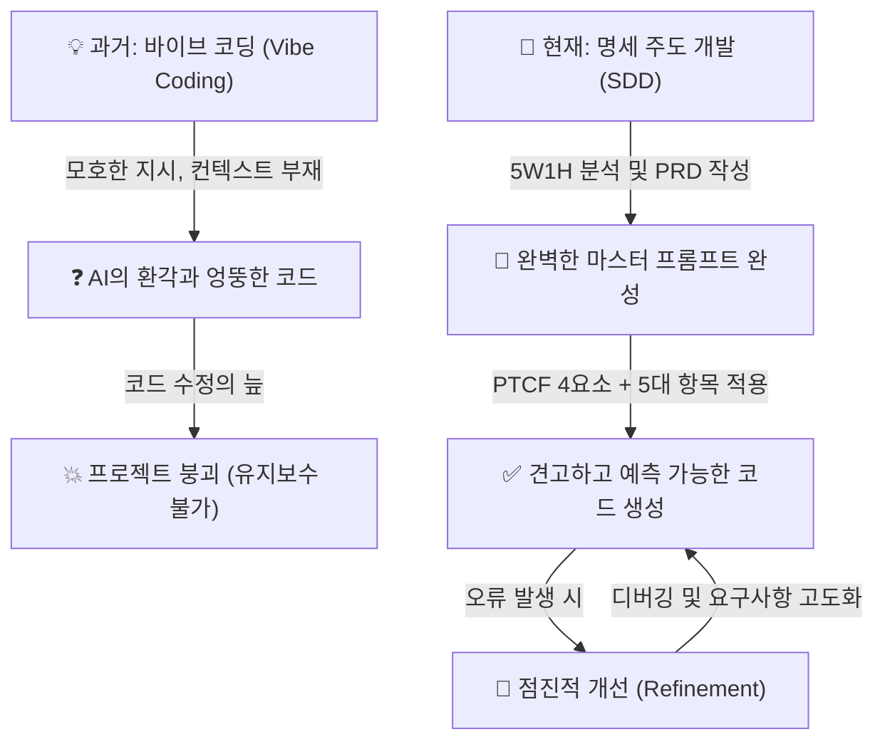

# 마이크로 세션: 043 — Day 2 핵심 요약 및 프롬프트 포트폴리오 정리

> **세션 ID**: MS-PY101-043
> **소요 시간**: 15분
> **난이도**: low
> **청크 타입**: narrative
> **버전**: v2.1 (7섹션 구조)

---

## §1. 개요

> **Day 2 | PM | 세션 043/043**

이 세션은 "AI-native 파이썬 기초" 과정의 2일 차 전체 일정을 갈무리하고 성공 경험을 자산으로 만드는, 하루 중 가장 마지막이자 가장 중요한 매듭을 짓는 시간입니다.
수강생들은 아침부터 프롬프트 엔지니어링의 본질을 파헤치고, 프롬프트 구성 4요소(Persona, Task, Context, Format)와 코드 생성을 위한 5대 필수 항목(기능, 입력, 출력, 제약, 예외)을 학습했습니다.
이후 단순한 바이브 코딩(Vibe Coding)을 넘어 명세 주도 개발(SDD, Specification-Driven Development)이라는 완전히 새로운 패러다임으로 진입했으며,
제품 요구사항 정의서(PRD)를 체계적으로 도출하고 이를 미니 스펙 프로젝트에 적용해 실제 코드가 생성되고 실행되는 기쁨과 디버깅의 좌절을 모두 맛보았습니다.
정말 엄청난 양의 지식과 실습을 소화한 긴 하루였습니다.

이제 이 세션에서는 아무리 맛있는 음식을 먹어도 소화를 안 시키면 탈이 나듯, 오늘 하루 동안 치열하게 학습한 방대한 내용이 내일이면 절반 이상 휘발되는 것을 막기 위해 단단한 지식의 저장고를 구축합니다.
더 나아가, 오류와 환각을 뚫고 마침내 찾아낸 "나만의 완벽한 프롬프트"들을 일회용으로 버리는 것이 아니라 영구적인 지적 자산으로 보존하는 구체적인 실천 습관을 만들어 드리는 것이 핵심 목적입니다.

### 🎯 학습 목표

이 세션이 끝나면 수강생은 다음을 할 수 있습니다:

첫째, 모호한 지시로 점철된 바이브 코딩(Vibe Coding)의 뼈아픈 한계를 명확히 인지하고, 체계적이고 완전한 명세서에 기반한 명세 주도 개발(SDD)로 패러다임이 완전히 전환되었음을 자신의 언어로 설명할 수 있습니다.
둘째, 하루 동안 실습하며 가장 결과가 훌륭했던 마스터 프롬프트와 기획 템플릿 문서를 복사하여, 언제든 꺼내 쓸 수 있는 자신만의 '프롬프트 그리모어(포트폴리오)'를 구축할 수 있습니다.
셋째, 스스로를 코딩 문법에 얽매이는 단순한 코더가 아닌, 무한한 타이핑 속도를 가진 AI를 지휘하는 '설계자'이자 '아키텍트'로서의 정체성을 확립하고, 이어질 Day 3의 파이썬 기초 문법을 학습할 확실한 동기를 얻게 됩니다.

### 선행 세션 환기

바로 앞선 세션들(세션 039~042)에서 우리는 미니 스펙 프로젝트를 통해 조별로 일상생활의 작은 문제를 해결하는 파이썬 콘솔 프로그램을 기획하고 개발했습니다.
기능 요구사항(FR)과 비기능 요구사항(NFR)을 꼼꼼하게 식별자로 나누어 PRD를 작성했고, 이를 통째로 마스터 프롬프트의 컨텍스트(Context) 영역에 주입하여 AI에게 정교한 지시를 내렸습니다.
코드가 한 번에 돌아가지 않아 에러가 발생했을 때는 당황하지 않고, 에러 메시지 자체를 다시 프롬프트로 활용하여 점진적 개선(Iterative Refinement)을 통해 버그를 잡아내는 과정을 동료들과 치열하게 나누었습니다.
이제 그 치열했던 트러블슈팅의 과정 속에서 발견한 보석 같은 프롬프트 공식들을 꺼내어 내일의 든든한 무기로 만들 차례입니다.

---

## §2. 핵심 개념 (+ 🗣️ 강사 대본 + Mermaid)

### 바이브 코딩(Vibe Coding)에서 명세 주도 개발(SDD)로의 전환

우리가 오늘 하루 종일 다룬 핵심 주제는 "느낌으로 지시하지 말자"는 것이었습니다.
아무런 설계도 없이 대충 "이런 거 만들어줘", "알아서 그럴싸하게 짜줘"라고 말하는 바이브 코딩은 처음에는 아주 편해 보입니다. AI가 10초 만에 코드를 내놓으니까요.
하지만 프로그램이 조금만 복잡해지고 요구사항이 하나둘 추가되기 시작하면, 코드는 수정이 불가능해지고 기술 부채가 산더미처럼 쌓이는 치명적인 파국을 맞이하게 됩니다.
우리는 이 함정을 극복하기 위해 명세 주도 개발(SDD, Specification-Driven Development)이라는 새로운 패러다임을 받아들였습니다.
코드를 작성하기 전에 완벽한 명세서(PRD)를 먼저 그리고, 그것을 유일한 진실의 원천(Single Source of Truth)으로 삼아 AI를 지휘하는 방식이야말로 AI 시대의 진정한 개발 방법론이라는 사실을 깊이 이해하는 것이 중요합니다.

🗣️ **강사 대본 (Instructor Script)**:

> 여러분, 정말 길고 밀도 높은 하루였습니다. 다들 너무 고생 많으셨어요. 아침에 처음 모였을 때를 잠깐 돌아볼까요?
> 아마 많은 분들이 "AI 시대니까 그냥 '파이썬으로 고객 관리 프로그램 만들어줘'라고 한마디 툭 던지면 알아서 다 되는 거 아니야?"라는 가벼운 마음으로 자리에 앉으셨을 겁니다.
> 그리고 우리가 오전 실습을 통해 그걸 직접 해보면서 아주 뼈저리게 깨달았죠.
> 그렇게 느낌대로 대충 시키는 이른바 '바이브 코딩'을 하면, 당장 눈앞에 뭔가 나오는 것 같아서 신기하지만, 조금만 고치려고 하거나 예외 상황이 발생하면 프로그램 전체가 엉망진창으로 꼬여버린다는 사실을 말이에요.
>
> 우리는 오늘 그 무서운 함정에서 빠져나오는 아주 확실한 방법을 배웠습니다. 바로 "명세 주도 개발", 즉 SDD라는 아주 멋진 무기입니다.
> 튼튼한 집을 지을 때 대충 "멋진 집 지어주세요"라고 말하는 대신, 완벽한 설계도를 꼼꼼하게 먼저 그리고 그 설계도대로 한 치의 오차도 없이 벽돌을 쌓아 올리는 방식을 배운 겁니다.
>
> 우리가 배운 프롬프트의 4요소인 페르소나, 태스크, 컨텍스트, 포맷을 기억하시나요? 그리고 코드를 생성할 때 반드시 들어가야 하는 5대 필수 항목인 기능, 입력, 출력, 제약, 예외까지.
> 여러분은 오늘 하루 동안, 코딩 화면에서 깜빡이는 커서와 씨름하는 대신, 아주 체계적이고 치밀한 PRD 문서를 작성하는 데 시간을 쏟았습니다.
> 기능 요구사항(FR)과 비기능 요구사항(NFR)을 식별자로 나누고, 수용 기준을 정교하게 다듬으며, "과연 AI가 이걸 오해하지 않고 100% 이해할까?"를 고민하는 과정은 결코 쉽지 않았을 거예요.
>
> 하지만 그 결과가 어땠나요? 여러분이 정성껏 빚어낸 그 마크다운 문서 하나를 AI에게 컨텍스트로 툭 던져주었을 때,
> AI가 단 한 번의 헛소리나 환각 없이 정확하게 여러분이 의도한 프로그램을 짜내는 놀라운 경험을 오늘 직접 하셨습니다.
> 코드를 실행하다 에러가 났을 때도 예전처럼 당황하지 않았죠. "너 FR-01 기능에서 이 예외 처리 빼먹었잖아"라고 아주 전문가답게 지적하며 코드를 점진적으로 단단하게 고쳐나갔습니다.
>
> 이것이 바로 완벽한 패러다임의 전환입니다. 여러분은 더 이상 코딩 문법을 더듬거리는 초보 코더가 아닙니다.
> 빛의 속도로 코드를 쳐내는 AI라는 천재적인 개발자를 곁에 두고, 그에게 한 치의 오차도 없는 정확한 지시를 내리는 위대한 "설계자"이자 "아키텍트"로 오늘 완벽하게 진화하신 겁니다. 스스로에게 박수를 쳐주셔도 좋습니다!

> 💡 **강사 노트**: 바이브 코딩의 얕은 편안함과 그것이 가져오는 파국을 SDD의 견고함과 강하게 대비시켜, 오늘 하루 동안 수강생들이 얼마나 엄청난 도약을 이루었는지 스스로 체감하게 해 주세요.
> "단순한 코더가 아니라 설계자이자 아키텍트로 진화했다"는 강력한 정체성 부여가, 3일 차에 이어질 다소 건조할 수 있는 파이썬 기초 문법 수업을 포기하지 않고 학습하게 만드는 가장 훌륭한 동기부여가 됩니다.

### Mermaid 다이어그램



이 다이어그램은 오늘 우리가 하루 종일 경험한 치열한 인식의 변화를 가장 직관적으로 보여줍니다.
왼쪽 흐름처럼 모호한 지시가 가져오는 파국을 피해, 오른쪽 흐름처럼 명확한 문서와 구조화된 지시를 바탕으로 예측 가능한 결과를 이끌어내고, 오류를 마주했을 때는 당황하지 않고 점진적으로 개선해 나가는 단단한 선순환 구조를 그렸습니다.
이 흐름도는 앞으로 남은 3일 동안 여러분이 코드를 짤 때 항상 마음속에 간직해야 할 나침반입니다.

---

## §3. 상세 내용

### Why — 왜 성공적인 프롬프트를 자산화해야 하는가?

우리 뇌의 메커니즘을 생각해 봅시다. 오늘 하루 종일 최고급 레스토랑에서 엄청나게 맛있고 진귀한 지식의 만찬을 잔뜩 즐겼다고 가정해 보겠습니다.
아무리 비싸고 좋은 음식을 먹었어도 제대로 소화시키지 않으면 탈이 나거나, 다음 날 아침이면 언제 그랬냐는 듯 씻은 듯이 배가 고파지기 마련입니다.
우리의 뇌도 새로운 학습에 대해 똑같이 반응합니다. 오늘 수많은 실습과 치열한 미니 프로젝트를 통해 배운 지식들을 어딘가에 단단히 묶어두지 않으면, 내일 아침 눈을 떴을 때 절반 이상이 하얗게 머릿속에서 날아가 버립니다.

하지만 우리가 오늘 깨달은 것은 단순히 책에 적힌 죽은 지식만이 아닙니다.
실습 과정에서 우리는 "아, 이 단어를 넣고 이런 형식으로 물어보니까 AI가 찰떡같이 알아듣고 내가 딱 원하는 코드를 내놓더라!"는 짜릿한 성공적인 경험을 했습니다.
수차례의 헛발질과 시행착오, 그리고 점진적인 개선 끝에 마침내 얻어낸 그 정교한 문장들과 구조화된 양식들은 말 그대로 여러분의 피와 땀이 섞인 '비법 노트'입니다.
이것을 기록으로 남기지 않고 무심코 채팅창을 꺼버린다면, 한 달 뒤에 회사나 집에서 비슷한 프로그램을 기획하고 만들어야 할 때 똑같은 시행착오와 삽질을 처음부터 다시 반복해야 합니다.
그래서 우리에게는 이 우연한 성공 경험을 영원한 공식으로, 평생의 무기로 만들어 줄 철저한 자산화(Assetization) 과정이 반드시 필요합니다.

### What — 프롬프트 그리모어(Grimoire)란 무엇인가?

프롬프트 그리모어는 판타지 세계의 마법사들이 자신만의 강력한 마법 주문과 재료의 배합 비율을 은밀하게 기록해 두는 비밀 주문서인 '그리모어(Grimoire)'에서 따온 비유입니다.
오늘 하루를 관통하며 여러분은 프롬프트의 4요소(Persona, Task, Context, Format)와 코드 생성의 5대 필수 항목을 하나하나 쪼개어 배우고, 이를 정교하게 조합해 AI라는 거대한 마나를 다루는 강력한 주문을 만들어냈습니다.

어떤 마법사가 하루 종일 실험실에 틀어박혀 온갖 약초를 섞고 주문의 발음을 미세하게 조율하며 고생한 끝에, 마침내 지팡이 끝에서 불꽃이 완벽한 붉은 장미 모양으로 피어오르는 기가 막힌 마법 주문을 찾아냈다고 상상해 보세요.
이때 이 지친 마법사가 잠자리에 들기 전에 가장 먼저, 그리고 반드시 해야 할 일은 무엇일까요?
맞습니다. 자신의 낡고 두꺼운 가죽 노트인 그리모어에 그 주문의 정확한 토씨 하나, 손목을 꺾는 각도, 재료의 정확한 비율 하나까지 또박또박 정성스럽게 적어두는 것입니다.
그렇게 적어두지 않으면 다음 날 아침에 눈을 떴을 때 "어제 내가 뭐라고 주문을 외웠더라? 라틴어였나?" 하며 머리를 쥐어뜯고 똑같은 실험을 반복하게 될 테니까요.
여러분이 오늘 치열하게 작성했던 PRD 템플릿의 양식과, 환각을 잠재웠던 성공적인 초기 지시문(Prompt)이 바로 이 마법 주문이며, 이것들을 소중하게 모아둔 여러분의 개인 노트가 바로 프롬프트 포트폴리오이자 평생의 그리모어가 됩니다.

### How — 어떻게 성공 경험을 정리하고 보존할 것인가?

우리는 거창하고 복잡한 관리 시스템이나 값비싼 툴을 새로 배울 필요가 없습니다. 평소 자신이 가장 자주 사용하고 손에 익은 메모장, 노션(Notion), 옵시디언(Obsidian), 에버노트, 혹은 바탕화면의 단순한 텍스트 파일이어도 충분히 좋습니다.
가장 중요한 핵심은 '언제든지 검색해서 복사하고 붙여넣기 할 수 있는 가벼운 텍스트 상태'로 영구 저장해 두는 것입니다.

단순히 프롬프트 텍스트만 덩그러니 복사해 두는 것은 반쪽짜리 기록입니다.
이 프롬프트가 어떤 구체적인 상황에서 쓰이는지, 어떤 훌륭한 결과를 내는지 짧고 명확한 설명을 덧붙이는 것이 핵심 노하우입니다.
예를 들어 제목을 "콘솔 프로그램 PRD 초안 생성용 무적의 프롬프트"라고 달아두고, 그 아래에 역할(Persona)과 지시(Task)를 아주 뾰족하게 세팅한 프롬프트를 적어둔 뒤, 여러분이 매번 채워 넣어야 할 컨텍스트(Context) 영역은 `[여기에 내용을 입력하세요]`라고 빈칸으로 비워둔 템플릿을 만들어 두는 식입니다.
이렇게 구조가 잘 잡혀 만들어진 뼈대 프롬프트들은 앞으로 여러분이 파이썬이 아닌 다른 어떤 프로그래밍 언어로, 어떤 복잡한 프로그램을 기획하든 흔들리지 않는 든든한 출발점이 되어 줄 것입니다.

---

## §4. 실습 가이드 (+ 🎙️ 실습 대본)

### 실습 목표

수강생들이 오늘 하루 동안 실습과 미니 프로젝트를 치열하게 진행하면서 사용했던 수많은 프롬프트 중 가장 결과가 깔끔하고 의도대로 작동했던 것들을 골라내어, 개인 노트나 에디터에 체계적으로 복사하고 저장하도록 강하게 유도합니다.
이 짧지만 강력한 활동을 통해 '프롬프트는 한 번 쓱 쓰고 버리는 일회용 소모품이 아니라, 지속적으로 다듬고 재사용하며 발전시켜 나가는 영구적인 나의 지적 자산'이라는 핵심 개념을 몸과 손가락에 체득하게 하는 것이 궁극적인 목표입니다.

🎙️ **실습 가이드 대본 (Lab Guide)**:

> 자, 여러분. 다들 짐을 싸기 전에 오늘 컴퓨터를 끄기 위한 마지막, 그리고 아주 중요한 미션이 하나 남았습니다.
> 지금 바로 마우스를 움직여서 여러분이 가장 편하게 쓰는 메모 도구를 하나 열어주세요. 윈도우 기본 메모장도 아주 훌륭하고, 맥의 텍스트 편집기도 좋고, 평소 노션을 쓰시는 분들은 노션에 새 워크스페이스나 페이지를 하나 만드셔도 좋습니다.
>
> 파일 이름은 "나만의_프롬프트_마법서.md" 혹은 "프롬프트_포트폴리오_핵심.txt"라고 아주 거창하고 멋지게 지어볼까요?
>
> 준비되셨나요? 그렇다면 오늘 하루 종일 실습하면서 "오! 이렇게 세팅해서 물어보니까 AI가 기가 막히게 대답을 잘해주고 에러도 안 나네?" 하고 감탄했던 순간을 한 번 떠올려보세요.
> 바로 그 성공의 순간에 여러분이 입력했던 프롬프트를 채팅창 히스토리에서 쭉 긁어와서 여러분의 노트에 고이 복사해 넣으세요.
>
> 단순히 텍스트만 붙여넣지 마시고, 예를 들면 이렇게 친절하게 적어두는 겁니다.
> **제목**: '빠르고 깔끔한 PRD 생성용 마스터 프롬프트 (성공률 99%)'
> **내용**: '당신은 실리콘밸리의 15년 차 수석 프로덕트 매니저입니다. 아래의 요구사항 초안을 바탕으로 FR 식별자가 완벽하게 포함된 PRD를 작성해 주세요. 출력은 마크다운 표 형식으로 깔끔하게 부탁합니다.'
> 그리고 그 밑에 여러분이 조원들과 머리를 맞대고 고민했던 PRD 템플릿 양식 뼈대도 잊지 말고 통째로 복사해서 붙여넣어 두세요.
>
> 이렇게 성공한 마법의 주문들을 차곡차곡 모아두면 어떻게 될까요?
> 다음 주에 당장 회사에 돌아가서 엑셀 자동화 스크립트를 짤 때나, 한 달 뒤에 주말을 이용해 개인 토이 프로젝트를 시작할 때 텅 빈 백지상태의 화면을 보며 막막해할 필요가 전혀 없습니다.
> 정성껏 저장해 둔 여러분의 주문서를 펴서 복사하고 붙여넣기만 하면, 이미 완벽하게 검증된 최고 수준의 기획서와 뼈대 코드가 순식간에 튀어나올 테니까요.
>
> 코딩의 문법이나 프로그래밍 언어의 유행은 2~3년마다 엄청나게 빠르게 변하지만, 이렇게 AI라는 거대한 지능에게 내가 원하는 것을 정확히 지시하고 통제하는 여러분의 역량은 영원히 변하지 않는 평생의 무기가 될 것입니다.
>
> 자, 시간은 넉넉하게 5분 드리겠습니다. 오늘 땀 흘려 만든 여러분의 소중한 자산을 가장 안전한 저장소로 옮겨주세요! 자, 시작하세요!

### 단계별 지시

| 단계 | 소요 시간 | 강사 지시사항 | 학습자 액션 | 예상 결과 |
|------|----------|--------------|------------|----------|
| 1 | 1분 | 개인 노트 앱이나 텍스트 편집기를 열고 파일 이름 짓기 유도 | 메모장, 노션, 에버노트 등 실행 및 파일 제목 작성 | 개인별 지식 자산화 도구 준비 완료 |
| 2 | 3분 | 오늘 가장 완벽하게 작동했던 프롬프트와 PRD 템플릿 복사 및 저장 안내 | LLM 채팅 히스토리 스크롤 및 검색 후 복사, 자신의 노트에 붙여넣고 용도 메모 작성 | 개인별 프롬프트 포트폴리오(그리모어) 초기 버전 완성 |
| 3 | 1분 | 프롬프트 자산의 영구적 가치와 재사용성에 대한 강력한 동기부여 멘트 마무리 | 작성 내용 저장 확인 및 강사의 피드백 경청 | 프롬프트를 일회성이 아닌 자산으로 인식하는 근본적 태도 형성 |

### 트러블슈팅 FAQ

| Q | A |
|---|---|
| "오늘 제가 쓴 프롬프트 중에 딱히 성공적이었다고 할 만한 게 없는 것 같은데요. 다 에러가 났어요." | 실패도 좋은 자산입니다. 하지만 성공 경험이 필요하다면, 강사가 앞선 세션에서 모범 답안으로 띄워두었던 PRD 템플릿이나 4요소/5대 항목이 완벽하게 적용된 스탠다드 프롬프트를 화면에 다시 크게 띄워주세요. 그리고 그것을 사진 찍게 하거나 타이핑해서 적어가도록 안내해 주세요. "이 기본 틀만 챙겨가도 앞으로 코딩 인생의 절반은 먹고 들어갑니다"라고 따뜻하게 격려해 줍니다. |
| "무심코 채팅 히스토리를 닫아버려서 예전 프롬프트가 다 날아갔어요. 어쩌죠?" | 대부분의 현대적인 LLM 인터페이스(Gemini, Claude 등)는 좌측 사이드바나 설정 메뉴에 과거 대화 기록이 고스란히 남아 있음을 친절하게 알려주고, 화면에서 찾는 방법을 직접 시연해 주세요. 만약 로그인 문제 등으로 정말 날아갔다면 강사의 예시 텍스트를 복사하도록 즉각 제공합니다. |

> ✅ **체크포인트**: 모든 수강생이 최소 1개 이상의 마스터 프롬프트 템플릿과 PRD 구조 양식을 자신의 로컬 파일이나 클라우드에 온전히 저장했는지, 화면을 가볍게 순회하며 눈으로 꼭 확인합니다.

---


### 🎓 강사 노트 (Instructor Support)

- ⏱️ **타이밍**: 18:25 (15분, narrative)
- 🎯 **핵심 활동**: 4요소·5항목·SDD 정리
- ⚠️ **강사 주의사항**: 프롬프트 저장 습관화 안내

## §5. 코드 및 명령어 모음

이 세션은 하루의 방대한 학습을 정리하고 문서를 갈무리하는 narrative(서술형) 타입이므로, 터미널에서 직접적으로 실행해야 할 파이썬 코드나 명령어는 존재하지 않습니다.
다만, 수강생들이 노트에 반드시 복사해 두어야 할 '마스터 프롬프트 템플릿'의 완벽한 예시를 대형 화면에 띄워두어, 기록을 놓친 수강생들이 참고할 수 있도록 돕는 것이 좋습니다.

> 🤖 **프롬프트 템플릿 예시 (수강생 노트 복사용)**:
>
> ```text
> [역할 (Persona)]
> 당신은 실리콘밸리에서 15년 동안 근무한 최고 수준의 시니어 파이썬 개발자이자 시스템 아키텍트입니다.
> 
> [지시 (Task)]
> 아래의 [컨텍스트]에 제공된 PRD(제품 요구사항 정의서) 문서를 꼼꼼히 분석하고, 명시된 모든 기능 요구사항(FR)을 100% 충족하며 엣지 케이스까지 방어하는 파이썬 코드를 작성해 주세요.
> 
> [컨텍스트 (Context)]
> - 실행 환경: 화려한 GUI 화면이 없는 단순한 터미널 콘솔창
> - 데이터 저장: 파일이나 외부 DB 연결을 하지 않고, 일단 프로그램 메모리(리스트나 딕셔너리 구조)에만 저장
> 
> PRD 내용 (이 설계도를 절대 벗어나지 마세요):
> '''
> (여기에 여러분이 작성한 7섹션 구조의 완벽한 PRD 내용을 붙여넣으세요)
> '''
> 
> [형식 및 제약 (Format & Constraints)]
> - 제약: 기본 내장 라이브러리 외에 어떤 외부 패키지(pip install)도 사용하지 마세요.
> - 형식: 모든 코드는 사용자가 터미널에서 바로 실행할 수 있도록 단 하나의 파이썬 파일(main.py) 안에 합쳐서 제공해 주세요.
> - 주석: 주요 함수나 클래스 상단에는 이 코드가 PRD의 어떤 요구사항(예: FR-01)을 구현한 것인지 명확한 주석을 반드시 달아주세요.
> - 설명: 코드를 출력한 후, 예외 처리 가이드가 코드에 어떻게 반영되었는지 짧고 명료하게 요약해서 설명해 주세요.
> ```

---

## §6. 요약 및 다음 세션 예고

### 핵심 학습 포인트

Day 2에서 우리가 하루 종일 매달려 배운 모든 것은 결국 단 하나의 문장, "인간과 AI 간의 커뮤니케이션 밀도를 극한으로 높이는 기술"로 완벽하게 요약됩니다.
대충 모호하게 뭉뚱그려 말하면 AI는 여지없이 환각을 일으키며 엉뚱한 길로 빠져버리고 만다는 것을 뼈저리게 확인했습니다.
하지만 반대로 AI에게 전문가의 페르소나를 부여하고, 해야 할 명확한 단일 과업을 제시하며, 빈틈없는 PRD 컨텍스트와 기대하는 출력 포맷을 쥐여주면, AI는 여러분의 의도를 완벽히 꿰뚫어 보는 최고의 천재 개발자로 돌변합니다.
우리는 이 고통스럽고도 즐거운 과정을 통해 느낌으로 지시하는 바이브 코딩의 얄팍함을 버리고, 견고한 PRD 문서를 기반으로 설계도를 먼저 그리는 명세 주도 개발(SDD)의 진정한 위력을 깨달았습니다.
그리고 오늘 여러분이 머리를 쥐어짜며 만들어낸 그 수많은 성공적인 지시문들은 이제 여러분의 프롬프트 그리모어에 영구적인 지적 자산으로 아로새겨졌습니다.

### 다음 세션 예고 (Day 3 브릿지)

지금까지 이틀 동안 우리는 훌륭한 아키텍트가 되어 완벽한 설계도를 그리는 법을 아주 깊게 배웠고, AI라는 지치지 않고 유능한 건설 노동자에게 정확한 지시를 내려 삽을 뜨게 만드는 법을 완벽하게 익혔습니다.
하지만 여러분이 지시해서 만들어진 그 엄청난 결과물이 진짜 설계도대로 튼튼하게 지어졌는지, 혹시라도 시멘트가 덜 발라진 곳은 없는지 최종 검수하려면 어떻게 해야 할까요?
맞습니다. 현장 감독인 우리도 벽돌이 어떻게 쌓여있는지 그 언어의 기초를 읽을 줄 알아야 합니다.
내일 아침 시작되는 Day 3에서는 마침내 프롬프트의 세계를 잠시 떠나 파이썬이라는 언어의 진짜 문법 속으로 깊이 들어갑니다.
어려운 수학을 배우는 것이 아니라 변수가 어떻게 데이터를 그릇에 담고, 반복문이 어떻게 노가다를 대신하며, 함수가 어떻게 로직을 예쁘게 포장하는지 배우게 될 것입니다.

### 브릿지 노트

> "오늘 하루 종일 여러분은 복잡한 파이썬 코드를 한 줄도 억지로 외우지 않았습니다.
> 하지만 여러분은 이미 코딩 학원에서 문법만 몇 달째 달달 외우고 있는 평범한 코더들의 수준을 훌쩍 뛰어넘었습니다.
> 요구사항을 쪼개고 완벽한 지시를 내릴 줄 아는 진짜 설계자가 되었으니까요.
> 하지만 훌륭한 설계자가 도면을 볼 줄 모르고 벽돌의 질감을 전혀 모르면 현장 감독을 제대로 할 수 없겠죠? 코드가 무너져도 왜 무너졌는지 모를 테니까요.
> 내일은 AI가 1초 만에 쏟아내는 그 수많은 파이썬 코드들이 도대체 어떤 원리와 논리로 돌아가는지, 그 내부의 신비로운 톱니바퀴를 들여다보는 시간을 가질 겁니다.
> 오늘 여러분이 소중하게 만든 프롬프트 주문서가 내일 엄청난 빛을 발할 거예요. 문법을 몰라도 든든한 백업이 되어 줄 테니까요.
> 오늘 하루, 정말 고생 많으셨습니다. 맛있는 저녁 드시고 푹 쉬신 다음, 내일 아침 웃는 얼굴로 뵙겠습니다. 감사합니다!"

---

## §7. 참고 자료

### 3-Source 출처

- **Source A (로컬 참고자료)**: `7 기획.pdf` (§7.5 미니 스펙 프로젝트 가이드) — 프로젝트 산출물 관리 관점에서의 프롬프트 자산화 필요성 및 재사용 전략을 차용하여 실습 활동을 구성하였습니다.
- **Source B (NotebookLM)**: `AI 시대의 서사 v3 - Claude.md` — 모호한 바이브 코딩의 5대 한계 극복과 명세 주도 개발(SDD)로의 철학적 패러다임 전환에 대한 핵심 논리 구조를 제공했습니다.
- **Source C (Deep Research)**: Deep Research 보고서 — 단기적인 성공적인 프롬프팅 경험을 개인화된 지식 저장소에 체계적으로 구축하는 실무 활용 사례와, 이것이 가져오는 장기적 학습 효과 모델링을 적극 반영하여 '프롬프트 그리모어(비밀 마법 주문서)' 비유를 교육적으로 고도화했습니다.

### 강사 노트

> 💡 **강사 노트**: 이 세션은 새로운 지식을 주입하고 평가하는 시간이 절대 아닙니다.
> 하루 종일 머리를 써서 기진맥진해 있는 수강생들에게 하루의 성취를 돌아보게 하고, 큰 성취감과 뿌듯함을 안겨주며 격려하는 치어리딩과 갈무리의 시간입니다.
> "여러분은 이제 단순한 코더가 아니라 전체를 조망하는 아키텍트로 진화했다"는 점을 눈을 맞추며 힘주어 말해주어, 수강생들이 강한 자부심을 느끼게 해주세요.
> 프롬프트 포트폴리오를 작성하고 저장하는 5분의 실습 시간 동안, 잔잔하고 성취감을 고조시킬 수 있는 웅장한 배경음악(BGM)을 작게 틀어두는 것도 교육장 분위기를 훈훈하고 감동적으로 마무리하는 아주 좋은 진행 팁입니다.

---

## ✅ 세션 완료 체크리스트 (강사용)

- [ ] §1~§7 모든 섹션이 충실하고 서술적인 구어체로 작성되었는가?
- [ ] 프롬프트 그리모어(마법서) 비유와 아키텍트 진화 스토리텔링이 충분히 확장되어 포함되었는가?
- [ ] Vibe Coding에서 SDD로의 패러다임 전환이 명확하게 대비되어 설명되었는가?
- [ ] 수강생들이 프롬프트를 자산화하는 실습(포트폴리오 저장)이 명확히 안내되었는가?
- [ ] 3-Source 팩트 패킷(Source A, B, C)의 출처 표기가 올바르게 반영되었는가?

---

*작성 일시: 2026-02-25*  
*작성 에이전트: A4B_Session_Writer*  
*교안 구조: 7섹션 (A0 팀 공통 표준)*