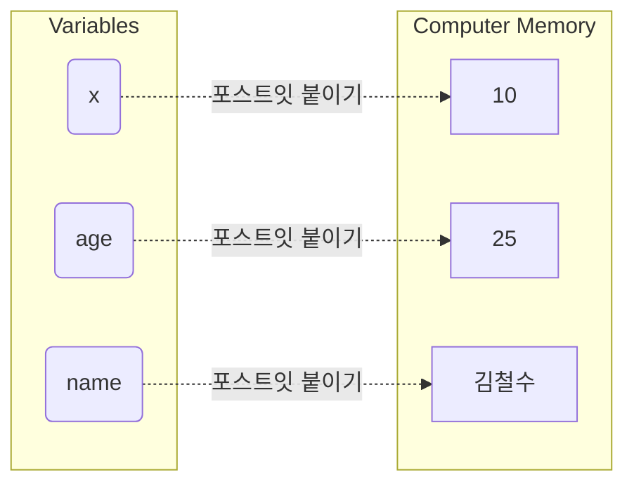

# 마이크로 세션: 044 — 변수의 개념과 이름표 상자 비유
> **세션 ID**: MS-PY101-044
> **소요 시간**: 25분
> **난이도**: low
> **청크 타입**: narrative
> **버전**: v2.1 (7섹션 구조)

---

## §1. 개요

> **Day 3 | AM | 세션 044/080**

이 세션은 파이썬 문법의 세계로 들어가는 가장 첫 번째 관문입니다. 지난 이틀 동안 우리는 AI에게 어떻게 일을 시킬 것인지, 문제를 어떻게 정의하고 프롬프트를 작성할 것인지 배웠습니다. PRD라는 훌륭한 건축 설계도까지 손에 넣었죠. 이제부터는 그 설계도를 들고 실제 코딩이라는 벽돌을 쌓아 올릴 시간입니다. 

AI가 아무리 코드를 잘 짜준다고 해도, 그 코드를 읽고 이해하며 수정할 수 있는 최소한의 문해력은 반드시 필요합니다. 그리고 모든 프로그래밍 언어에서 가장 먼저 등장하는, 코드를 구성하는 가장 작은 단위이자 핵심 부품이 바로 '변수'입니다. 변수가 무엇인지 모르면 코드의 단 한 줄도 해석할 수 없습니다. 반대로 변수의 개념만 확실히 잡아도 코드가 굴러가는 원리의 절반을 이해한 것이나 다름없습니다. 코딩을 처음 접하는 비전공자의 눈높이에 맞춰, 복잡한 메모리 이론 대신 아주 일상적이고 직관적인 비유로 변수의 진짜 정체를 파헤쳐 봅니다.

### 🎯 학습 목표

이 세션이 끝나면 수강생은 다음을 할 수 있습니다:
- 컴퓨터 메모리와 변수의 관계를 일상적인 사물에 빗대어 설명할 수 있습니다.
- 프로그래밍에서 등호 기호가 가진 진짜 의미를 이해하고 코드를 읽을 수 있습니다.
- 스스로 의미 있는 변수 이름을 짓고, 값을 저장하거나 변경하는 코드를 작성할 수 있습니다.

### 선행 세션 환기

Day 2에서 다루었던 'AI 시대의 서사'를 잠깐 떠올려 볼까요? 우리는 요리를 할 때 재료가 필요하다는 이야기를 나누었습니다. 데이터가 바로 그 요리의 재료입니다. 그렇다면 그 수많은 재료들을 주방에 그냥 널브러뜨려 놓을 수는 없겠죠. 용도에 맞게 그릇에 담고, 그 그릇에 무엇이 들어있는지 알아볼 수 있게 라벨을 붙여야 합니다. 오늘 배울 변수가 바로 이 라벨의 역할을 담당합니다.

---


### 🌟 차별화 포인트 (Differentiation Strategy)

> 🌟 **Day 3 서사: 재료의 이해** — 마법의 주문 해독하기 — AI가 1초 만에 뱉어낸 코드가 더 이상 마법이 아님을 깨닫는 날. 변수, 제어문, 함수라는 요리 재료들의 특성을 파헤쳐 안목(리터러시)을 갖춥니다.

## §2. 핵심 개념

### 이름표와 상자: 데이터에 붙이는 포스트잇

가장 직관적으로 변수를 이해하기 위해 이삿짐을 싸는 상황을 상상해 보세요. 거실에 수십 개의 상자가 널려 있습니다. 책을 넣은 상자, 주방 도구를 넣은 상자, 겨울옷을 넣은 상자가 있죠. 이 상자들을 새집으로 가져가서 당장 겨울옷을 찾아야 한다면 어떻게 할까요? 상자를 일일이 다 뜯어보는 사람은 없습니다. 짐을 쌀 때 매직펜으로 큼직하게 '겨울옷', '주방용품'이라고 적어두었을 테니까요. 우리는 그냥 '겨울옷'이라고 적힌 상자만 찾으면 됩니다. 

프로그래밍에서 변수가 하는 일이 정확히 이것과 같습니다. 컴퓨터의 뇌 속에는 '메모리'라는 거대한 물류 창고가 있습니다. 이 창고에는 우리가 다루어야 할 숫자, 텍스트 같은 수많은 데이터가 보관되어 있죠. 컴퓨터는 이 데이터들을 '0x7fff5fbff8a0' 같은 외계어 주소로 관리합니다. 하지만 사람이 이런 주소를 외워서 데이터를 꺼내 쓰는 것은 불가능합니다. 그래서 우리는 사람이 읽고 기억할 수 있는 친숙한 이름표를 만들어서 그 데이터에 착 붙입니다. 이 이름표가 바로 변수입니다.

엄밀히 말해 파이썬에서 변수는 데이터를 담는 단단한 상자라기보다는, 데이터에 붙였다 뗄 수 있는 '포스트잇 이름표'에 가깝습니다. 숫자 10이라는 데이터 덩어리에 '나이'라는 포스트잇을 붙이는 행위, 이것이 파이썬이 데이터를 다루는 핵심 방식입니다.



### 🗣️ 강사 대본 (Instructor Script)

> 여러분, 좋은 아침입니다! 드디어 오늘부터 본격적인 파이썬 코딩 여행이 시작됩니다. 다들 기대 반 걱정 반이실 텐데요, 전혀 긴장하실 필요 없습니다. 우리가 파이썬을 배우는 이유는 개발자처럼 모든 문법을 달달 외워서 코드를 바닥부터 짜기 위해서가 아닙니다. AI가 만들어준 결과물을 읽고, 이해하고, 우리가 원하는 방향으로 살짝 다듬기 위해서입니다.
> 
> 우리가 AI에게 코드를 만들어 달라고 하면, AI가 가장 먼저 내놓는 결과물에 항상 등장하는 단어가 있습니다. 바로 변수입니다. 
> 
> 컴퓨터 안에는 메모리라는 엄청나게 큰 창고가 있습니다. AI 비서에게 "내 나이를 기억해 둬"라고 하면, AI는 메모리 창고 구석에 25라는 숫자를 몰래 숨겨둡니다. 그런데 나중에 "아까 내 나이 몇이라고 했지?"라고 물어보면 어떻게 찾을까요? 창고가 너무 커서 찾을 수가 없습니다. 그래서 25라는 숫자에 'age'라는 예쁜 포스트잇 이름표를 붙여두는 겁니다. 
>
> 파이썬에서 변수를 상자라고 많이들 가르치지만, 여러분은 오늘부터 '포스트잇'이라고 생각하세요. 상자라고 생각하면 나중에 헷갈리는 순간이 오거든요. 메모리 창고에 있는 데이터라는 물건에, 우리가 부르기 쉬운 이름이 적힌 포스트잇을 찰싹 붙이는 겁니다. 아주 간단하죠? 복잡한 컴퓨터 구조를 몰라도, 이 포스트잇만 잘 관리하면 우리는 데이터를 마음대로 꺼내 쓸 수 있습니다.

---

## §3. 상세 내용

### Why: 왜 이름표를 붙여야 할까?

컴퓨터는 숫자 계산을 아주 잘합니다. 하지만 우리가 계산기처럼 한 번 쓰고 버릴 숫자를 다루는 것이 아니라면, 어떤 데이터가 무슨 의미를 가지는지 계속 기억해야 합니다. 만약 코드에 그냥 `8500`이라는 숫자가 덩그러니 있다면 어떨까요? 이 숫자가 커피 가격인지, 버스 요금인지, 아니면 직원의 월급인지 며칠만 지나도 쓴 사람조차 알 길이 없습니다. 

하지만 `coffee_price = 8500`이라고 이름표를 붙여두면, 1년 뒤에 코드를 열어봐도 이것이 커피 가격이라는 사실을 단번에 알 수 있습니다. 즉, 변수는 데이터를 컴퓨터가 기억하게 만드는 수단일 뿐만 아니라, 사람과 사람이 코드로 소통하기 위한 가장 기본적인 언어입니다.

우리가 AI와 대화할 때도 마찬가지입니다. AI에게 "사용자가 입력한 값을 적당히 저장해 줘"라고 말하는 것보다 "사용자의 이메일 주소를 `user_email`이라는 변수에 저장해 줘"라고 구체적으로 지시할 때 훨씬 정확한 코드가 나옵니다. 변수는 AI와 내가 소통하는 공통의 단어장이 되는 셈입니다.

### What: 변수의 구조와 등호(=)의 비밀

파이썬에서 변수를 만드는 문법은 믿을 수 없을 만큼 단순합니다. 등호 기호 하나면 충분합니다. 왼쪽에 만들고 싶은 이름표를 적고, 오른쪽에 그 이름표를 붙일 실제 데이터를 적어주면 됩니다.

```python
name = "김철수"
age = 25
```

여기서 초보자들이 가장 많이 겪는 혼란이 있습니다. 우리가 수학 시간 내내 배웠던 등호의 의미 때문입니다. 수학에서 `x = 10`은 "x와 10은 같다"라는 상태를 나타냅니다. 하지만 파이썬을 포함한 대부분의 프로그래밍 언어에서 등호는 '같다'는 뜻이 절대 아닙니다. 여기서 등호는 **할당(Assignment)**을 의미하는 명령문입니다. 

`age = 25`라는 코드는 오른쪽의 25라는 숫자를 왼쪽의 age라는 변수에 집어넣어라, 혹은 25라는 데이터에 age라는 포스트잇을 붙이라는 강력한 명령입니다. 그렇다면 '같다'라는 뜻은 어떻게 표현할까요? 파이썬에서는 등호를 두 번 연달아 쓴 `==` 기호가 바로 수학에서의 같다는 의미를 가집니다. 이 작은 차이를 명확히 구분하는 것이 코딩의 첫걸음입니다.

### How: 좋은 이름표를 짓는 규칙과 재할당

이름표를 백지 상태의 포스트잇이라고 마음대로 아무 이름이나 적을 수 있는 것은 아닙니다. 파이썬이 정해둔 몇 가지 엄격한 규칙이 있습니다.

1. **사용 가능한 문자**: 영어 알파벳, 숫자, 그리고 밑줄(_)만 사용할 수 있습니다.
2. **숫자 시작 금지**: 이름표의 첫 글자로는 숫자가 올 수 없습니다. `1st_player`는 에러가 나지만 `player_1`은 가능합니다.
3. **대소문자 구분**: `Apple`, `apple`, `APPLE`은 파이썬 입장에서 완전히 다른 세 개의 이름표입니다.
4. **예약어 사용 금지**: `if`, `for`, `while`, `True`처럼 파이썬이 문법적인 용도로 이미 찜해둔 단어들은 이름표로 쓸 수 없습니다.

규칙을 지키는 것보다 더 중요한 것은 '의미 있는 이름'을 짓는 습관입니다. `a = 10`, `b = 20`처럼 성의 없이 이름을 지으면 당장은 타이핑하기 편할지 몰라도 조금만 코드가 길어지면 지옥을 맛보게 됩니다. 데이터를 가장 잘 설명할 수 있는 명확한 단어를 사용하는 것이 훌륭한 개발자의 첫 번째 덕목입니다.

또한 포스트잇의 가장 큰 장점은 떼었다 붙였다 할 수 있다는 점입니다. 이것을 코딩 용어로 **재할당(Reassignment)**이라고 부릅니다. 처음에 `age = 25`라고 붙여두었다가 이듬해가 되어서 `age = 26`이라고 다시 코드를 적으면 어떻게 될까요? 파이썬은 조용히 25에 붙어있던 age 포스트잇을 떼어내서 26이라는 새로운 데이터에 옮겨 붙입니다. 

이때 주의할 점이 있습니다. 이전의 25라는 숫자는 상자 속에서 지워지는 것이 아닙니다. 창고 어딘가에 그대로 남아있지만 이름표가 떨어졌을 뿐입니다. 이름표를 잃어버린 데이터는 파이썬이 알아서 '가비지 컬렉션(Garbage Collection)'이라는 청소부 프로그램을 통해 폐기 처분합니다. 우리는 직접 메모리를 지우거나 관리할 필요 없이, 그저 새 데이터에 이름표를 옮겨 붙이기만 하면 됩니다. 

이 재할당 개념 덕분에 우리는 게임에서 점수가 오르거나 장바구니에 물건이 추가될 때마다 변수 안의 값을 쉽게 업데이트할 수 있습니다. `score = score + 10` 같은 코드가 가능한 이유도 바로 이 재할당 때문입니다. 기존 점수에 10을 더한 새로운 값에 기존 이름표를 떼어서 다시 붙이는 원리입니다.

### 심화: 한 번에 여러 이름표 붙이기

파이썬이 주는 또 하나의 선물이 있습니다. 여러 개의 변수를 한 줄에서 동시에 선언할 수 있다는 점입니다. 

```python
x, y, z = 10, 20, 30
```

이렇게 쉼표를 사용하면 변수 `x`에는 10이, `y`에는 20이, `z`에는 30이 한 번에 들어갑니다. 심지어 변수끼리 값을 서로 바꿀 때도 아주 유용합니다. 만약 `x`와 `y`의 값을 서로 교환하고 싶다면 다른 프로그래밍 언어에서는 임시 상자를 만들어야 하지만, 파이썬에서는 `x, y = y, x`라는 한 줄의 코드만으로 두 포스트잇의 위치를 마법처럼 바꿀 수 있습니다. 이처럼 파이썬은 코드를 간결하고 직관적으로 쓰도록 설계되어 있습니다.

---

## §4. 실습 가이드

이번 실습에서는 IDE를 열고 직접 변수를 만들어볼 것입니다. 눈으로 보는 것과 손으로 치는 것은 하늘과 땅 차이입니다. 직접 여러분의 정보가 담긴 이름표를 만들고 화면에 출력해 보는 과정을 거치겠습니다. 

### 🎙️ 실습 대본 (Lab Guide)

> 자, 모두 Antigravity IDE를 실행해 주세요. 새 파이썬 파일을 하나 만들고 이름을 `variable_practice.py`로 저장하겠습니다.
>
> 이제 빈 화면에 여러분을 소개하는 데이터를 변수에 담아볼 겁니다. 첫 번째 줄에 `my_name`이라는 변수를 만들고 등호를 써서 여러분의 이름을 적어주세요. 이름은 글자니까 반드시 양쪽에 따옴표를 붙이셔야 합니다. 두 번째 줄에는 `my_age`라는 변수에 나이를 적어주세요. 나이는 숫자니까 따옴표 없이 적습니다.
>
> 다 적으셨나요? 그런데 실행 버튼을 눌러도 화면에는 아무것도 안 나올 겁니다. 컴퓨터 내부 창고에 이름표를 붙이기만 했지, 우리 눈앞에 보여달라고 명령하지 않았거든요. 변수 안에 든 데이터를 확인하려면 `print()`라는 기능이 필요합니다. 아래쪽에 `print(my_name)`이라고 적고 다시 실행해 보세요. 하단 터미널 화면에 여러분의 이름이 나타났나요?
>
> 이번에는 일부러 실수를 한 번 해보겠습니다. `print(my_name)` 대신에 오타를 내서 `print(my_nam)`이라고 적고 실행해 보세요. 새빨간 에러 메시지가 뜹니다. `NameError: name 'my_nam' is not defined`라고 적혀 있죠? 이건 파이썬이 씩씩거리면서 "창고를 다 뒤져봐도 my_nam이라는 이름표는 없는데 대체 나한테 뭘 가져오라는 거야!"라고 화를 내는 겁니다. 
> 
> 이름표의 철자는 단 하나라도 틀리면 안 됩니다. 에러를 두려워하지 마세요. 에러 메시지는 컴퓨터가 우리에게 말을 거는 방식입니다. 이 NameError는 앞으로 코딩을 하면서 수천 번은 보게 될 아주 흔한 친구입니다. 당황하지 말고 "아, 내가 어디선가 이름표 글자를 잘못 적었구나" 하고 찾아보시면 됩니다. AI에게 코드를 수정해 달라고 할 때도, 그냥 안 된다고 하지 말고 "이런 에러가 나는데 이름표 오타를 확인해 줘"라고 말하면 AI가 단숨에 고쳐줄 것입니다.
>
> 오류를 고쳤다면 마지막으로 작은 미션을 하나 드리겠습니다. 여러분의 변수를 모두 사용해서 문장을 하나 만들어 출력해 보세요. `print("내 이름은", my_name, "이고, 나이는", my_age, "살입니다.")`라고 적어보세요. 따옴표로 감싼 문장과 쉼표, 그리고 변수 이름표들을 번갈아 쓰시면 됩니다. 
>
> 이처럼 변수 안의 데이터는 언제든지 꺼내서 다른 문장과 조립하고 활용할 수 있습니다. 우리가 만든 이름표가 제대로 작동하는 것을 두 눈으로 확인하셨나요? 아주 훌륭합니다!

---


### 🎓 강사 노트 (Instructor Support)

- ⏱️ **타이밍**: 09:00 (20분, narrative)
- 🎯 **핵심 활동**: 변수 = 이름표 상자
- ⚠️ **강사 주의사항**: 비유에 시간 투자. 개념 이해 우선

## §5. 코드 모음

실습에서 다루었거나 참고하면 좋을 변수 관련 코드 스니펫들을 모아두었습니다. 직접 타이핑하며 결과를 확인해 보는 것을 권장합니다.

```python
# 1. 변수 선언과 값 할당
user_name = "홍길동"       # 텍스트 데이터에 이름표 붙이기 (따옴표 필수)
user_age = 30             # 숫자 데이터에 이름표 붙이기
is_student = True         # 참/거짓 데이터에 이름표 붙이기

# 2. 변수 값 확인 (출력)
print(user_name)          # 결과: 홍길동
print(user_age)           # 결과: 30

# 3. 변수 값 재할당 (포스트잇 옮겨 붙이기)
user_age = 31             # 해가 바뀌어 나이가 한 살 늘어남
print(user_age)           # 결과: 31 (기존의 30은 사라지고 31이 나옴)

# 4. 점수 누적하기 (기존 변수 활용)
score = 100
score = score + 50        # 기존 점수(100)에 50을 더해 다시 score에 붙임
print(score)              # 결과: 150

# 5. 한 번에 여러 변수 선언하기
fruit1, fruit2 = "사과", "바나나"
print(fruit1)             # 사과
print(fruit2)             # 바나나

# 6. 두 변수의 값 서로 바꾸기 (Swap)
fruit1, fruit2 = fruit2, fruit1
print(fruit1)             # 바나나 (사과에서 변경됨)
print(fruit2)             # 사과 (바나나에서 변경됨)

# 7. 올바른 변수명과 잘못된 변수명 예시
# 올바른 예
player_score = 100        # 의미가 명확하고 띄어쓰기 대신 밑줄 사용
player2_name = "이순신"     # 숫자가 중간에 들어가는 것은 괜찮음

# 잘못된 예 (주석을 풀고 실행하면 에러 발생)
# 1st_player = "김유신"    # 숫자로 시작할 수 없음 (SyntaxError)
# user name = "홍길동"     # 띄어쓰기를 사용할 수 없음 (SyntaxError)
# class = "파이썬반"        # 예약어는 사용할 수 없음 (SyntaxError)
```

---

## §6. 요약 및 브릿지

이 세션에서 우리는 코딩의 가장 기초가 되는 변수를 배웠습니다. 변수는 데이터라는 요리 재료에 붙이는 '포스트잇 이름표'입니다. 수학의 등호와 달리 프로그래밍의 등호(=)는 값을 넣으라는 명령문이라는 사실을 알게 되었고, 직접 규칙에 맞게 이름표를 지어보기도 했습니다.

그런데 실습을 하면서 눈치채신 분이 있을지 모르겠습니다. 이름에는 따옴표를 붙였고, 나이에는 따옴표를 붙이지 않았습니다. 따옴표를 빼먹거나 숫자에 잘못 붙이면 컴퓨터가 불만을 표시합니다. 컴퓨터의 눈에는 숫자인지, 텍스트인지에 따라 그 데이터를 다루는 규칙이 완전히 다르기 때문입니다. 데이터에도 사람의 혈액형처럼 타고난 체질과 종류가 있습니다. 다음 세션에서는 파이썬이 데이터를 분류하는 네 가지 핵심 기준인 '데이터 타입'에 대해 알아보겠습니다. 방금 만든 이름표들이 어떤 종류의 상자에 붙어있는지 확인하러 가봅시다.

---

## §7. 참고 자료

- [Source A: 8 코딩.pdf] §8.1 변수와 메모리의 이해, AI 시대의 서사 비유
- [Source B: NotebookLM Day 3] 변수 네이밍 컨벤션과 에러 핸들링
- [Source C: Deep Research Day 3] 파이썬의 가비지 컬렉션 및 동적 타이핑 메커니즘
