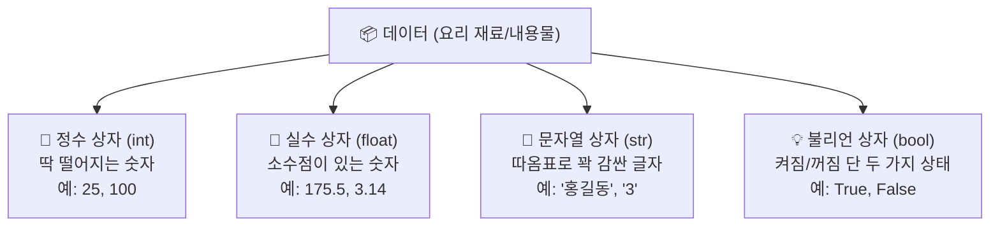

# 마이크로 세션: 045 — 기본데이터타입

> **세션 ID**: MS-PY101-045
> **소요 시간**: 25분
> **난이도**: low
> **청크 타입**: narrative
> **버전**: v2.1 (7섹션 구조)

---

## §1. 개요

> **Day 3 | AM | 세션 045**

이 세션은 파이썬 기초 과정의 세 번째 날 오전에 진행되는 아주 중요한 시간이에요. 바로 앞 세션에서 우리는 변수라는 것을 알아보며, 변수를 단순히 무언가를 담는 거대한 상자가 아니라 특정한 데이터에 착 붙이는 '포스트잇 이름표'라고 생각하기로 했죠. 그렇다면 이제 그 이름표를 어디에 붙일 것인지, 즉 포스트잇이 붙는 '데이터 그 자체'에 대해 알아볼 차례입니다.

### 🎯 학습 목표

이번 시간이 끝나면 수강생은 다음을 할 수 있게 됩니다.

- 정수, 실수, 문자열, 불리언이라는 파이썬의 4가지 기본 데이터 타입이 각각 어떤 특징을 가지고 있는지 명확하게 설명할 수 있습니다.
- 이사 상자 비유를 통해 파이썬이 알아서 데이터에 맞는 보관함을 찾아주는 동적 타이핑의 원리를 이해하게 됩니다.
- 마법의 돋보기 같은 `type()` 함수를 직접 사용하여, 눈앞의 데이터가 도대체 어떤 종류인지 스스로 검증해낼 수 있습니다.

### 선행 세션 환기

우리는 이전 시간에 데이터라는 요리 재료에 이름표를 붙이는 방법을 확실하게 익혔어요. 오늘 세션에서는 그 재료 자체의 성질을 깊게 파고들어 볼 거예요. 우리가 가진 재료가 신선한 고기인지, 아삭한 채소인지, 아니면 흐르는 액체 소스인지 정확히 알아야 올바른 냄비에 넣고 근사한 요리를 할 수 있듯이, 데이터의 진짜 성질을 알아야 컴퓨터가 오류 없이 완벽하게 계산을 수행할 수 있습니다.

---

## §2. 핵심 개념 (+ 🗣️ 강사 대본 + Mermaid)

데이터 타입이라는 것은 컴퓨터가 수많은 데이터를 마주했을 때 그것을 안전하게 처리하는 기준이 되는 자료형을 의미합니다 [Source A: 8 코딩.pdf §8.1]. 사람의 눈에는 모두 같은 화면 속 글자처럼 보일지 몰라도, 컴퓨터의 세상에서는 데이터의 성질에 따라 완전히 다른 방식으로 저장하고 처리합니다. 이 데이터가 숫자인지 문자인지 정확히 구분하는 것이 프로그래밍의 가장 기본적인 출발선이에요. 이것을 일상생활의 이삿짐 포장 비유로 풀어보면 아주 쉽게 이해할 수 있습니다.

🗣️ **강사 대본 (Instructor Script)**:

> 방금 전까지 우리는 '이름표 붙은 상자', 즉 변수를 만드는 법을 배웠어요. 이름표를 예쁘게 쓰고 값을 넣었죠. 그런데 잠깐, 세상의 모든 물건을 똑같이 생긴 네모난 상자에 담아서 이사를 할 수 있을까요?
>
> 여러분이 이삿짐 센터에 전화를 걸었다고 상상해 보세요. 직원이 "어떤 물건을 옮기시나요?"라고 물어봅니다. 여러분이 "아주 무겁고 두꺼운 전공 서적들이요"라고 대답하면, 직원은 바닥이 두꺼운 튼튼한 종이상자를 챙겨 올 거예요. 이번에는 "비싸고 깨지기 쉬운 와인잔 세트요"라고 말해볼까요? 그러면 직원은 충격을 부드럽게 흡수할 수 있는 뽁뽁이 완충재가 가득 들어간 특별한 상자를 가져오겠죠. 만약 "주방에서 쓰던 찰랑거리는 식용유요"라고 한다면, 이동 중에 절대로 새지 않도록 뚜껑을 꽉 닫을 수 있는 밀봉 플라스틱 통을 준비할 겁니다.
>
> 파이썬의 세계에도 이렇게 데이터의 각기 다른 특성에 맞춰 완벽하게 준비된 상자들이 있습니다. 오늘 우리가 배울 핵심이 바로 이 상자들의 종류, 즉 '데이터 타입'이에요.
>
> 여기서 정말 다행이고 신기한 점이 하나 있습니다. 파이썬은 이삿짐 센터 직원 중에서도 아주 눈치가 빠르고 일머리가 엄청나게 좋은 베테랑 직원이에요. 여러분이 변수에 어떤 값을 툭 넣으면, 파이썬이 그 값의 성질을 쓱 스캔해보고 "아, 이건 소수점이 하나도 없이 딱 떨어지는 숫자니까 튼튼한 정수 상자를 써야겠군", "오, 이건 소수점이 붙어있으니까 정밀한 실수 상자가 맞겠다" 하면서 알아서 가장 적절한 상자를 골라줍니다 [Source B: NotebookLM day3].
>
> 우리는 이것을 조금 어려운 개발자들의 언어로 '동적 타이핑(Dynamic Typing)'이라고 부릅니다. 옛날에 만들어진 다른 프로그래밍 언어들 중에는 "지금부터 나는 정수 상자 하나를 만들 거고 거기에 무조건 숫자 5만 넣을 거야"라고 컴퓨터에게 일일이 허락을 받아야 하는 아주 깐깐한 언어들도 있어요. 하지만 파이썬은 그렇지 않습니다. AI 비서에게 "이것 좀 챙겨서 상자에 잘 담아둬"라고 던져주기만 하면, 내용물에 맞춰 가장 완벽한 형태의 상자를 알아서 찾아주는 셈이죠. 여러분은 복잡한 컴퓨터 메모리 구조 같은 걸 전혀 몰라도 괜찮아요. 파이썬이 알아서 안전하게 짐을 다 싸주니까요 [Source C: Deep Research day3].

### Mermaid 다이어그램



이 다이어그램은 파이썬이 복잡한 데이터를 어떻게 빠르고 정확하게 네 가지 기본 상자로 분류하는지 시각적으로 보여줍니다. 데이터라는 내용물이 들어오는 순간, 파이썬은 스스로 똑똑하게 판단하여 정수, 실수, 문자열, 불리언이라는 네 가지 상자 중 하나를 선택하여 안전하게 담아냅니다.

---

## §3. 상세 내용

### Why — 왜 우리가 직접 데이터 타입을 알아야 할까요?

파이썬이 알아서 상자를 완벽하게 골라준다면 우리는 데이터 타입을 전혀 몰라도 되는 걸까요? 아쉽게도 그렇지 않습니다. 
데이터의 타입을 정확히 모르면 우리는 컴퓨터와 대화할 때 아주 치명적인 오해를 낳게 됩니다. 

예를 들어 사람의 눈에는 숫자 `3`과 글자 `"3"`이 똑같은 모양으로 보이지만, 컴퓨터의 뇌 속에서는 완전히 다른 상자에 담긴 전혀 다른 물건이에요. 
컴퓨터에게 진짜 숫자 두 개를 더하라고 명령하면 우리가 기대하는 덧셈 계산을 성실하게 수행하지만, 글자 모양을 한 상자 두 개를 더하라고 하면 그저 두 글자를 옆으로 길게 이어 붙여버리는 엉뚱한 행동을 합니다. 

AI에게 코드를 만들어달라고 요청할 때도 마찬가지예요. 
사람에게 혈액형이 있듯 데이터의 혈액형과도 같은 이 타입을 정확하게 명시해주어야만, 오류 없이 우리가 원하는 대로 동작하는 안전한 프로그램을 만들 수 있습니다 [Source A: 8 코딩.pdf §8.1].

### What — 파이썬이 준비한 4가지 기본 상자의 정체

파이썬이 우리를 위해 미리 튼튼하게 만들어 둔 가장 기본적인 4가지 상자를 하나씩 깊이 들여다볼게요. 이 네 가지만 확실히 알아두면, 파이썬이 다루는 방대한 데이터의 절반 이상을 완벽하게 이해한 것과 다름없습니다.

첫 번째는 '정수 상자'입니다. 영어로는 integer라고 부르고 실무에서는 줄여서 `int`라고 씁니다. 
1, 2, -5, 100처럼 소수점이 전혀 섞여 있지 않은, 딱 떨어지는 묵직한 숫자들을 넣는 튼튼한 종이상자예요. 
바구니에 담긴 사과의 개수, 우리 반 학생의 명수, 혹은 사람의 나이처럼 절대로 반으로 쪼갤 수 없는 분명한 숫자들이 바로 이 상자에 들어갑니다. 
만약 우리가 '사람 2.5명'이라고 말하면 아주 이상하듯이, 정수 상자에는 오직 온전한 숫자만이 허락됩니다.

두 번째는 '실수 상자'입니다. 영어로는 floating point라고 부르며 파이썬 코드에서는 `float`라고 씁니다. 
3.14, -0.5, 175.5처럼 소수점이 붙어있는 아주 섬세하고 예민한 숫자들을 보관하는 뽁뽁이 상자와 같아요. 
사람의 키, 정밀한 몸무게, 오늘의 기온처럼 정밀한 측정값을 다룰 때 쓰입니다. 

여기서 한 가지 아주 재미있는 사실을 알려드릴게요. 
파이썬에서 딱 떨어지는 정수 10을 정수 3으로 나누면(`10 / 3`) 결과가 어떻게 될까요? 
파이썬은 3.3333이라는 소수점 결과를 내놓으면서, 이 숫자를 묻지도 따지지도 않고 자동으로 실수 상자(float)로 옮겨 담아버립니다 [Source B: NotebookLM day3]. 
파이썬의 나눗셈은 언제나 소수점이 남을 수 있다고 넉넉하게 가정하고 미리 실수 상자를 대령하는 친절함을 가지고 있어요.

세 번째는 '문자열 상자'입니다. 문자들이 줄지어 묶여 있다고 해서 string이라고 부르고 짧게 줄여 `str`이라고 씁니다. 
글자들을 안전하게 보관하는 밀봉 플라스틱 통이라고 생각해보세요. 
통 안의 내용물이 새지 않게 뚜껑을 꽉 닫아야 하듯, 문자열은 반드시 시작과 끝 양쪽에 따옴표(' 또는 ")를 뚜껑처럼 빈틈없이 덮어줘야 합니다. 
`"안녕하세요"`, `'Python'`, 심지어 `"123"` 같은 것들이 전부 이 상자에 안전하게 들어갑니다. 

방금 `"123"`을 자세히 보셨나요? 
숫자처럼 보일지라도 그 주변에 따옴표가 씌워져 있다면 그것은 더 이상 계산할 수 있는 숫자가 아닙니다. 
그림이나 풍경 사진처럼 그냥 글자의 모양을 하고 있는 그림일 뿐이에요. 
컴퓨터는 이 그림을 가지고 곱셈이나 나눗셈을 하라고 하면 당황해서 오류를 뿜어냅니다 [Source C: Deep Research day3].

마지막 네 번째는 '불리언 상자'입니다. 논리형이라고도 부르며 코딩할 때는 `bool`이라고 줄여 씁니다. 
이 상자는 아주 독특하고 고집이 세서, 세상에 존재하는 수많은 것들 중 단 두 가지의 물건만 허락합니다. 
바로 `True`(참) 아니면 `False`(거짓)입니다. 

방에 있는 전등 스위치가 켜져 있거나 꺼져 있는 딱 두 가지 상태만 가지는 것과 완벽하게 똑같아요. 
"이 학생은 이번 시험 성적을 통과했나요?"라거나 "사용자가 올바른 비밀번호로 로그인을 했나요?" 같은 질문에 대해 단호하고 명확한 대답을 저장할 때 아주 유용하게 쓰입니다.

### How — 투시 안경과도 같은 마법의 돋보기 type() 함수

파이썬이 스스로 알아서 적절한 상자에 데이터를 척척 담아주긴 했는데, 코딩을 하다 보면 지금 내 눈앞에 있는 이 데이터가 정확히 어떤 상자에 숨어있는지 직접 까보고 확인하고 싶을 때가 반드시 옵니다. 
파이썬은 불안해하는 우리를 위해 내용물을 훤히 투시해 볼 수 있는 마법의 돋보기를 하나 선물해 줍니다. 바로 `type()` 이라는 아주 고마운 함수예요. 

궁금하고 의심스러운 데이터를 `type()`의 괄호 안에 살짝 집어넣고 실행 버튼을 누르면, 파이썬이 "아, 이건 int 상자야", "저건 str 상자에 잘 담겨있어"라고 아주 정직하고 빠르게 대답해 줍니다. 
프로그래밍을 하다가 도대체 원인을 알 수 없는 답답한 오류가 났을 때, 가장 먼저 이 돋보기를 꺼내서 데이터가 내가 생각한 그 상자가 맞는지 하나씩 확인하는 것은 모든 개발자들이 매일 쓰는 가장 기본적인 생존 기술입니다.

---


### 📊 참고 표 (Visual Specs)

**파이썬 핵심 데이터 타입 비교**

| 타입명 (Type) | 의미 | 예시 | 변경 가능성 |
|:---|:---|:---|:---|

## §4. 실습 가이드 (+ 🎙️ 실습 대본)

이 실습에서는 앞서 배운 네 가지 종류의 데이터 상자를 파이썬 코드 안에서 여러분의 손으로 직접 만들어 봅니다. 그리고 마법의 돋보기인 `type()`을 이리저리 사용해서, 정말로 우리가 생각한 찰떡같은 상자가 맞는지 화면에 출력하며 하나하나 검증하는 과정을 거칠 거예요.

🎙️ **실습 가이드 대본 (Lab Guide)**:

> 자, 이제 설명은 충분히 들었으니 파이썬이 우리를 위해 야심차게 준비해둔 4가지 상자를 코드로 직접 꺼내서 만져볼 시간입니다. 제가 나눠드린 에디터 환경에서 각자 코드를 입력할 준비를 쓱 해주세요.
>
> 가장 먼저, 여러분의 현재 나이를 나타내는 딱 떨어지는 깔끔한 정수를 하나 적어볼까요? `age = 25` 이렇게 키보드로 입력해 보세요. 그 다음 줄에는 여러분의 키를 소수점 아래까지 섬세하게 적어봅시다. `height = 175.5`처럼요. 이번에는 여러분의 자랑스러운 이름을 적을 건데, 여기서 멈춰서 주의하셔야 해요! 이름은 숫자가 아니라 글자니까 반드시 따옴표 뚜껑을 앞뒤로 꽉 덮어줘야 합니다. `name = "홍길동"` 이렇게 적어주세요. 마지막으로 여러분이 지금 학생 신분인지 아닌지 참과 거짓으로 단호하게 적어볼게요. `is_student = True` 라고 조심스럽게 적어보세요. 여기서 아주 중요한 규칙이 하나 있습니다. True의 첫 글자 대문자 T는 반드시 대문자로 큼직하게 적어야 파이썬이 찰떡같이 알아듣습니다.
>
> 네 개의 변수를 모두 꼼꼼하게 선언하셨나요? 겉으로 보기엔 모두 똑같이 평범한 변수 같지만, 파이썬의 보이지 않는 머릿속에는 각각 완전히 다른 4개의 상자가 완벽하게 세팅되어 있습니다. 정말 제 말이 맞는지 바로 확인해 볼까요?
> 밑에 새로운 줄을 열고 `print(type(age))` 라는 코드를 적고 실행 버튼을 눌러보세요. 화면 아래쪽에 `<class 'int'>`라는 약간 암호 같은 글자가 뜰 겁니다. 놀라지 마세요. 이게 바로 파이썬이 "나 지금 네가 준 나이 데이터를 튼튼한 정수(int) 상자에 예쁘게 담았어!"라고 여러분에게 윙크하며 알려주는 거예요.
>
> 자, 멈추지 말고 나머지 3개의 변수들도 모두 `type()` 돋보기를 씌워서 샅샅이 확인해 보세요. 제가 앞에서 길게 설명했던 4가지 이름표가 화면에 정확히 출력되는지, 여러분의 눈으로 직접 확인하며 짜릿함을 느끼는 것이 가장 중요합니다.
>
> 다 하신 분들은 재미있는 실험을 하나 더 해볼까요? 밑으로 가서 `print(type(3))`과 `print(type("3"))`을 위아래로 나란히 적고 한 번 더 실행해 보세요. 우리의 눈에는 완전히 똑같이 생긴 쌍둥이 3처럼 보이지만, 파이썬은 앞의 것은 `int`라고 부르고 뒤의 것은 `str`이라고 완전히 다르게 대답할 겁니다. 겉모습에 절대 속지 않고 상자의 진짜 정체를 꿰뚫어 보는 능력, 이것이 오늘 실습에서 여러분이 가져가야 할 최고의 무기입니다.

**트러블슈팅 FAQ**

수강생들이 실습을 신나게 진행하다가 흔히 부딪히는 문제와 친절한 대처 방법입니다.

- **문제**: 불리언 변수를 자신 있게 적었는데 화면에 `NameError: name 'true' is not defined`라는 무서운 빨간 에러가 뜹니다. 컴퓨터가 고장 난 걸까요?
  - **해결책**: 전혀 고장 나지 않았습니다! 파이썬은 영어의 대문자와 소문자를 아주 엄격하고 깐깐하게 구분하는 성격을 가진 언어입니다. 논리형 값인 참과 거짓은 무조건 첫 글자를 큼직한 대문자로 써서 `True` 또는 `False`라고 적어주어야만 합니다. 소문자로 적으면 파이썬은 그것을 특별한 스위치로 인식하지 못하고, 그저 여러분이 새롭게 만든 일반적인 이름표(변수명)로 착각합니다. 그런데 그런 이름표를 이전에 만든 적이 없으니 찾을 수 없다고 엉엉 울면서 에러를 내뿜는 거예요. 첫 글자만 대문자로 살짝 바꿔주면 마법처럼 해결됩니다.
- **문제**: 강사님 말씀대로 `print(type("안녕"))`을 열심히 쳤는데 이상하게 자꾸 에러가 나요.
  - **해결책**: 침착하게 코드 끝에 있는 괄호의 개수를 손가락으로 세어 보세요. 돋보기 기능을 하는 `type()`의 괄호가 안쪽에 한 쌍 있고, 그것을 화면 밖으로 보여달라는 `print()`의 커다란 괄호가 바깥쪽에 또 한 쌍 있습니다. 즉, 괄호를 두 번 열었으면 반드시 뒤에서도 같은 개수만큼 두 번 닫아주어야 컴퓨터가 어디까지가 하나의 명령어인지 완벽하게 이해할 수 있습니다. 괄호의 짝을 맞추는 것은 코딩의 가장 아름다운 리듬입니다.

---


### 🎓 강사 노트 (Instructor Support)

- ⏱️ **타이밍**: 09:20 (20분, narrative)
- 🎯 **핵심 활동**: int, float, str, bool
- ⚠️ **강사 주의사항**: type() 함수 시연

## §5. 코드 및 명령어 모음

수강생들이 에디터에서 직접 타이핑하며 실행해 볼 수 있는 완전하고 깨끗한 형태의 실습 코드 묶음입니다.

```python
# 4가지 기본 데이터 타입 선언하기 (내용물에 맞는 상자를 상상해 보세요)
age = 25              # 정수(int) - 소수점 없이 딱 떨어지는 숫자
height = 175.5        # 실수(float) - 소수점이 붙어있는 섬세한 숫자
name = "홍길동"       # 문자열(str) - 따옴표로 안전하게 빈틈없이 감싼 글자
is_student = True     # 불리언(bool) - 켜짐(참) 또는 꺼짐(거짓) 상태 (첫 글자 대문자 주의!)

# type() 돋보기를 사용하여 각 변수가 담긴 상자의 진짜 종류(타입) 확인하기
print("age의 타입은:", type(age))               # 예상 결과: <class 'int'>
print("height의 타입은:", type(height))         # 예상 결과: <class 'float'>
print("name의 타입은:", type(name))             # 예상 결과: <class 'str'>
print("is_student의 타입은:", type(is_student)) # 예상 결과: <class 'bool'>

# 겉모습은 똑같아 보여도 타입이 완전히 다른 경우를 직접 비교해보기
print("진짜 숫자 3의 타입:", type(3))           # 예상 결과: <class 'int'>
print("문자열 그림 '3'의 타입:", type("3"))     # 예상 결과: <class 'str'>
```

🤖 **AI 프롬프트 예시**

AI에게 교육용 예제 코드를 만들어달라고 부탁할 때 사용하는 프롬프트입니다.

> "파이썬의 4가지 기본 데이터 타입(int, float, str, bool)을 일상생활에서 흔히 보는 데이터로 각각 하나씩 변수로 만들어줘. 그리고 type() 함수를 돋보기처럼 사용해서 그 데이터 타입이 무엇인지 화면에 출력해서 확인하는 교육용 파이썬 예제 코드를 작성해 줘. 코딩을 오늘 처음 해보는 쌩초보자가 읽어도 끄덕이며 이해할 수 있도록 주석을 구어체로 아주 꼼꼼하게 달아주고, 마지막에는 진짜 숫자 3과 따옴표로 감싼 문자 3이 컴퓨터 입장에서 어떻게 다르게 인식되는지 눈으로 확인할 수 있는 깜짝 실험 예제도 꼭 포함해 줘."

---

## §6. 요약

### 핵심 학습 포인트

오늘 우리는 파이썬이 이 복잡한 세상을 깔끔하게 이해하기 위해 즐겨 쓰는 네 가지 기본 안경에 대해 깊이 있게 배웠습니다. 소수점 없이 딱 떨어지는 묵직한 숫자를 보는 정수(int) 안경, 미세한 소수점 하나까지 예민하게 관찰하는 실수(float) 안경, 글자들을 물방울 하나 새지 않게 온전히 담아두는 문자열(str) 안경, 그리고 세상의 수많은 복잡한 질문들을 오직 예/아니오 단 두 가지로만 대답하는 결단력 있는 불리언(bool) 안경입니다. 파이썬은 우리가 데이터를 툭 건네주면 이 중 어떤 안경을 쓰고 처리해야 할지 눈치껏 스스로 결정하는 엄청나게 똑똑한 능력을 기본적으로 가지고 있습니다. 그리고 우리는 답답할 때마다 `type()`이라는 마법의 돋보기를 통해 파이썬이 도대체 지금 어떤 안경을 쓰고 쳐다보는지 언제든지 불시검문을 할 수 있죠. 데이터에도 사람의 혈액형 같은 고유한 종류가 있다는 이 놀라운 사실은, 앞으로 우리가 코딩을 할 때 머릿속에서 절대 지워서는 안 되는 가장 강력하고 중요한 규칙입니다.

### 다음 세션 예고 및 브릿지 노트

> "지금까지 우리는 파이썬이 알아서 찰떡같은 상자를 찾아준다는 사실에 가슴을 쓸어내리며 안심했습니다. 그런데 우리가 살다 보면 이삿짐을 한 번 쌌다가 마음이 바뀌어서 다시 뜯고 새로 싸야 할 때가 오지 않던가요? 예를 들어, 문자열이라는 플라스틱 통에 얌전히 그림처럼 들어있던 글자 '3'을 꺼내서, 진짜로 덧셈 뺄셈 계산을 할 수 있는 튼튼한 정수 상자로 확 옮겨 담고 싶다면 우리는 대체 어떻게 파이썬을 설득해야 할까요?
>
> 다음 세션에서는 하나의 상자에서 완전히 다른 상자로 내용물의 본질을 변신시키는 엄청난 마술인 '타입 변환(형변환)'이라는 강력한 기술을 배워보겠습니다. 더불어 우리가 만들어낸 변수들을 우리가 평소에 쓰는 자연스러운 한국어 문장 안에 빈칸 채우기처럼 쏙쏙 끼워 넣는 세련된 'f-string' 기법도 함께 알아볼 테니, 기대하는 마음으로 다음 세션으로 넘어가 보겠습니다!"

---

## §7. 참고 자료

이 세션의 내용은 다음의 신뢰할 수 있는 철저한 출처를 바탕으로 알차게 구성되었습니다.

- **Source A (로컬 참고자료)**: 「8 코딩.pdf §8.1」 — 파이썬의 데이터 타입 기초 개념을 다룹니다. 정수, 실수, 논리형 등 컴퓨터가 데이터를 바라보고 처리하는 가장 기본적인 기준이 되는 자료형의 명확한 정의를 집중적으로 참조하여 작성했습니다.
- **Source B (NotebookLM)**: NotebookLM 분석 리포트 (Day 3) — 파이썬이 자랑하는 동적 타이핑 특성 및 10을 3으로 나누는 나눗셈 연산 시 묻지도 따지지도 않고 자동으로 float로 변환되어 버리는 파이썬만의 독특한 언어적 특성 분석을 실습 예제에 생생하게 반영했습니다.
- **Source C (Deep Research)**: Deep Research 보고서 (Day 3) — 눈으로 보기에 똑같은 숫자와 문자열 숫자의 근본적인 차이점 및 AI에게 프롬프트를 작성해 코드를 맡길 때 데이터 타입을 구체적으로 명시하는 것이 얼마나 중요한지에 대한 최신 개발 교육 트렌드를 강사 대본 곳곳에 자연스럽게 녹여냈습니다.

### 강사 노트

> 💡 **강사 노트**: 데이터 타입이라는 눈에 보이지 않는 아주 추상적인 개념을 설명할 때 '크기와 모양이 다른 이삿짐 상자'라는 비유를 적극적으로 활용하면, 코딩을 처음 접하는 비전공 수강생들의 인지적 부담을 획기적으로 낮춰줄 수 있습니다. 특히 숫자 `3`과 따옴표로 감싼 문자열 `"3"`이 사람 눈에는 쌍둥이 같아도 컴퓨터 메모리 상에서는 얼마나 뼈대부터 다른 녀석들인지 반복해서 강조하는 것이 매우 중요합니다.
>
> 실제 실습을 진행해보면 수강생들이 불리언의 대문자 `True`를 습관적으로 소문자로 잘못 입력하여 당황하며 오류를 내는 경우가 수업마다 항상 발생합니다. 사전에 스크립트를 통해 이를 단호하게 경고하거나, 실습 중 트러블슈팅 시간에 화면을 띄워놓고 이 흔한 오류를 다 함께 짚어보는 시간을 가지면 수강생들의 학습 효과와 자신감이 크게 향상됩니다.

---

## ✅ 세션 완료 체크리스트 (강사용)

- [ ] 파이썬의 4가지 기본 데이터 타입(int, float, str, bool)의 특징을 모두 명확하고 쉽게 설명했는가?
- [ ] 일상적인 이삿짐 상자 비유를 깊게 확장하여 파이썬의 동적 타이핑 원리를 직관적으로 전달했는가?
- [ ] 수강생 전원이 `type()` 함수를 직접 타이핑하여 자신의 눈으로 데이터 타입을 확인하는 실습을 성공적으로 완료했는가?
- [ ] 숫자 3과 문자열 "3"의 결정적 차이점을 코드를 통해 시각적으로 명백하게 증명했는가?
- [ ] 3-Source 팩트 패킷(A, B, C)의 핵심적인 내용이 스크립트와 본문에 왜곡 없이 충실하게 반영되었는가?

---

*작성 일시: 2026-02-25*  
*작성 에이전트: A4B_Session_Writer*  
*교안 구조: 7섹션 (A0 팀 공통 표준)*
