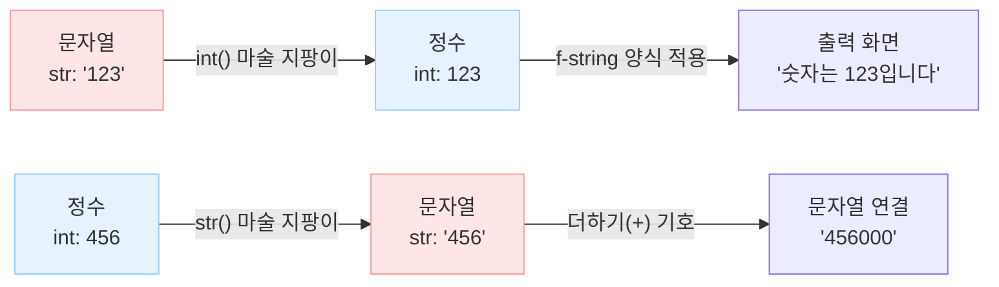
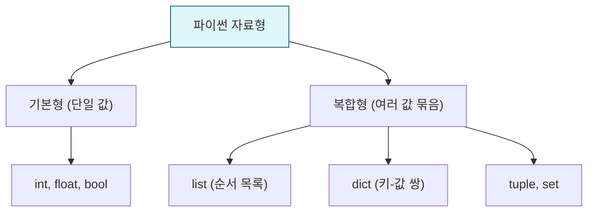

# 마이크로 세션: 046 — 타입변환과fstring

> **세션 ID**: MS-PY101-046  
> **소요 시간**: 25분  
> **난이도**: low  
> **청크 타입**: narrative  
> **버전**: v2.1 (7섹션 구조)

---

## §1. 개요

> **Day 3 | AM | 세션 046/064**

이 세션은 문자열, 정수, 실수 등 서로 다른 데이터 타입 간의 변환(캐스팅)과, 변수들을 문장에 자연스럽게 끼워 넣는 f-string 포매팅을 배우는 시간이에요. 앞서 배운 네 가지 기본 데이터 타입들이 서로 어떻게 소통하고 어우러지는지 익히며, 데이터를 우리가 원하는 형태로 가공하고 출력하는 기초 체력을 다집니다.

### 🎯 학습 목표

이 세션이 끝나면 수강생은 다음을 할 수 있어요:

- 문자열, 정수, 실수 간의 타입 변환 원리를 이해하고 에러 없이 변환할 수 있습니다
- `input()` 함수로 입력받은 데이터가 왜 문자열인지 이해하고 연산에 맞게 가공할 수 있습니다
- f-string을 활용해 다양한 변수가 포함된 문장을 직관적으로 구성할 수 있습니다

### 선행 세션 환기

바로 앞 세션(045)에서 우리는 파이썬의 네 가지 기본 데이터 타입인 정수(int), 실수(float), 문자열(str), 불리언(bool)을 배웠어요. 데이터에도 혈액형이 있어서 종류에 따라 컴퓨터가 처리하는 방식이 다르다는 점을 확인했죠. 이번 세션에서는 이 서로 다른 혈액형의 데이터들이 어떻게 섞이고 변환되는지 살펴볼 거예요.

---

## §2. 핵심 개념 (+ 🗣️ 강사 대본 + Mermaid)

### 마술 지팡이와 통역사 비유

서로 다른 타입의 데이터를 더하거나 합치려고 하면 파이썬은 에러를 냅니다. 글자와 숫자가 완전히 다른 세계에 살고 있기 때문이에요. 이때 필요한 것이 바로 형태를 바꿔주는 '마술 지팡이(타입 변환)'입니다. 그리고 이렇게 가공된 데이터들을 모아서 화면에 예쁘게 안내문으로 보여줄 때 사용하는 빈칸 채우기 양식이 바로 'f-string'이라는 통역사 양식이에요.

🗣️ **강사 대본 (Instructor Script)**:

> 자, 방금 전 우리는 파이썬에 네 가지 종류의 데이터 상자가 있다는 걸 배웠어요. 그런데 여기서 아주 재미있는 문제가 하나 생깁니다.
>
> 문자열 상자에 `"100"`이라는 글자가 들어있다고 해볼게요. 이 글자에 숫자 50을 더하면 150이 될까요? 한번 머릿속으로 `"100" + 50`을 상상해 보세요. 안타깝게도 파이썬은 빨간 글씨로 "TypeError"라며 화를 냅니다. 컴퓨터 입장에서는 글자 '백'과 숫자 50을 더하라는 말도 안 되는 명령이거든요. 문자열 상자와 정수 상자는 서로 대화가 안 통하는 외국인과 같습니다.
>
> 이 문제를 해결하는 방법이 바로 '타입 변환(Type Casting)'입니다. 마치 마술사가 모자에서 비둘기를 꺼내듯, 글자 상자에 있는 것을 숫자 상자로 형태를 뿅! 하고 바꿔주는 거예요. 
> 
> 파이썬에는 세 가지 마술 지팡이가 있습니다. `int()`라는 지팡이를 휘두르면 글자 `"123"`이 계산 가능한 진짜 숫자 123으로 바뀝니다. `float()` 지팡이를 쓰면 정수 5가 실수 5.0으로 변하죠. 반대로 `str()` 지팡이를 쓰면 숫자 456이 문자열 `"456"`으로 변합니다. 서로 대화가 안 통하던 데이터들에게 통역기를 달아주는 셈이에요.

> 💡 **강사 노트**: 초보자들은 따옴표가 있는 `"100"`과 숫자 `100`을 시각적으로 구분하기 어려워합니다. "눈으로 보기엔 똑같은 100이지만, 컴퓨터의 뇌파로는 완전히 다르게 인식된다"는 점을 강조해 주세요.

### Mermaid 다이어그램



이 다이어그램은 데이터가 마술 지팡이를 거쳐 어떻게 형태를 바꾸는지 보여줍니다. 변환된 데이터가 f-string이라는 양식을 만나면 우리가 읽기 편한 문장으로 최종 완성됩니다.

---


### 🎨 추가 시각화 (Visualization Packet)

**파이썬 자료형 (Data Type) 계층 구조**

기본 자료형(단일 값)과 복합 자료구조(여러 값을 묶은 형태)의 분류를 한눈에 보여줍니다.



## §3. 상세 내용

### Why — 왜 타입 변환과 f-string이 필요한가?

프로그램을 만들다 보면 사용자의 입력을 받아야 할 때가 아주 많습니다. 파이썬에서 사용자 입력을 받는 `input()` 함수는 무조건 모든 입력값을 '문자열(str)' 형태로만 가져옵니다. 사용자가 나이를 `20`이라고 입력해도 파이썬은 글자 `"20"`으로 받아들여요. 이걸 그대로 계산에 쓰면 앞서 말한 에러가 나거나, `"20" + "10"`이 `"2010"`이라는 엉뚱한 문자로 이어붙여지는 대참사가 벌어집니다. 따라서 의도에 맞는 연산을 하려면 반드시 올바른 타입으로 변환을 해줘야 해요.

그리고 계산을 마친 결과를 화면에 보여줄 때, 옛날 방식으로는 `"제 나이는 " + str(age) + "살입니다"`처럼 억지로 이어 붙여야 했습니다. 코드가 지저분해지고 띄어쓰기 실수도 잦았죠. 이런 답답함을 해결하기 위해 등장한 구원자가 바로 f-string입니다.

### What — 타입 변환 지팡이들과 f-string의 정체

**1. 타입 변환 마술 지팡이 3총사**
- `int()`: 정수(Integer)로 변환합니다.
- `float()`: 실수(Float)로 변환합니다.
- `str()`: 문자열(String)로 변환합니다.

하지만 주의할 점이 있어요. `int("abc")`처럼 숫자로 바꿀 수 없는 진짜 글자를 변환하려고 하면 에러가 납니다. 또 `int(3.9)`를 하면 4로 반올림되지 않고 소수점 아래를 싹둑 잘라버려 3이 됩니다.

**2. f-string (포맷 문자열)**
문자열을 시작하는 따옴표 앞에 소문자 `f`를 딱 붙이면, 문자열 안에서 중괄호 `{}`를 쓸 수 있게 됩니다. 이 중괄호는 구멍을 뚫어놓은 빈칸이에요. 이 빈칸 안에 변수 이름을 넣으면, 파이썬이 알아서 해당 변수의 값을 문자열로 쓱 바꿔서 끼워 넣어줍니다.

### How — 구체적으로 어떻게 코드를 짜는가?

🗣️ **강사 대본 (Instructor Script)**:

> 자, 그럼 이 지팡이들과 f-string을 어떻게 쓰는지 볼까요?
> 
> "제 이름은 철수이고, 나이는 20살입니다"라는 문장을 만들고 싶어요. 변수 `name`에는 `"철수"`, `age`에는 `20`이 들어있다고 해봅시다. 
> 
> 옛날 방식으로는 이렇게 썼어요. `print("제 이름은 " + name + "이고, 나이는 " + str(age) + "살입니다")`. 더하기 기호 넣고, 따옴표 열고 닫고, 숫자는 문자로 바꾸고... 정말 끔찍하죠? 오타 나기 딱 좋은 구조예요.
> 
> 하지만 f-string을 쓰면 우아해집니다. `print(f"제 이름은 {name}이고, 나이는 {age}살입니다")`. 
> 끝이에요! 마법의 알파벳 `f`를 따옴표 앞에 붙여주면, 문자열 안에 중괄호 `{}`라는 구멍을 뚫을 수 있어요. 그 구멍 안에 변수를 쏙 넣으면 됩니다. 따로 문자열로 변환할 필요도 없이 파이썬이 알아서 채워줍니다. 마치 안내문 양식에서 이름과 나이 칸만 비워두면 AI가 상황에 맞게 글을 완성해 주는 것과 똑같아요.

---

## §4. 실습 가이드 (+ 🎙️ 실습 대본)

### 실습 목표

사용자로부터 출생 연도를 입력받아 타입 변환을 거친 뒤, 올해 기준 나이를 계산하여 f-string으로 출력해 보는 전체 사이클을 경험합니다.

🎙️ **실습 가이드 대본 (Lab Guide)**:

> 여러분, 화면의 실습 환경을 띄워주세요. 지금부터 우리가 직접 나이 계산기를 만들어 볼 거예요. 
> 
> 먼저 `birth_year = input("출생연도를 입력하세요: ")`라고 코드를 적어보세요. 이 상태에서 바로 `2026 - birth_year`를 계산하려고 하면 어떻게 될까요? 네, 아까 말한 대로 에러가 날 거예요. `input`이 가져온 건 글자니까요.
> 
> 그러니까 계산하기 전에 지팡이를 휘둘러야 합니다. `real_year = int(birth_year)` 이렇게요. 이제 `real_year`는 진짜 숫자가 되었습니다. `age = 2026 - real_year`로 나이를 계산해 보세요.
> 
> 마지막으로 방금 배운 f-string을 써서 출력해 봅니다. `print(f"당신의 나이는 {age}세입니다!")`라고 적고 실행해 보세요. 연도를 입력하면 나이가 아주 예쁘게 문장으로 출력될 거예요. 

### 단계별 지시

| 단계 | 소요 시간 | 강사 지시사항 | 학습자 액션 | 예상 결과 |
|------|----------|--------------|------------|----------|
| 1 | 3분 | input() 함수로 변수 입력받기 안내 | `birth = input()` 작성 및 에러 유도 | TypeError 경험 |
| 2 | 3분 | int() 지팡이로 타입 변환 지시 | `int(birth)` 적용 및 뺄셈 연산 | 연산 성공 |
| 3 | 4분 | f-string을 활용한 문장 출력 지시 | `print(f"...")` 작성 및 결과 확인 | 완성된 문장 출력 |
| 4 | 5분 | 소수점 잘림 함정 보여주기 | `int(3.9)` 직접 실행해보기 | 3 출력 확인 (버림) |

### 트러블슈팅 FAQ

| Q | A |
|---|---|
| f-string을 썼는데 중괄호가 그대로 글자로 나와요! | 따옴표 바로 앞에 소문자 `f`를 빼먹지 않았는지 확인해 보세요. `f`가 없으면 파이썬은 중괄호를 그냥 일반 글자로 취급합니다. |
| int()를 썼는데 "ValueError"가 나요 | 입력창에 숫자가 아닌 글자(예: "이천이십년")를 적었기 때문이에요. `int` 지팡이는 진짜 숫자로 이루어진 글자만 바꿀 수 있어요. |
| input() 두 개를 더했는데 20+10이 2010이 돼요 | 문자열끼리 덧셈(+)을 하면 글자를 옆으로 이어 붙입니다. 각각 `int()`로 감싸서 변환한 다음 더해야 제대로 된 산술 덧셈이 됩니다. |

---


### 🎓 강사 노트 (Instructor Support)

- ⏱️ **타이밍**: 09:40 (25분, code)
- 🎯 **핵심 활동**: 형변환 + 문자열 포매팅
- ⚠️ **강사 주의사항**: f-string은 앞으로 매일 쓰임 강조

## §5. 코드 및 명령어 모음

이 세션에서 다루는 핵심 파이썬 코드들입니다. 특히 파이썬 3.8부터 추가된 디버깅용 f-string 문법은 실무에서 아주 유용합니다.

```python
# 1. 타입 변환: 문자열을 정수로
birth_year_str = "1995"
birth_year_int = int(birth_year_str)  # 마술 지팡이 사용
age = 2026 - birth_year_int
print(age)  # 31

# 2. 함정 확인하기
print(int(3.9))    # 3 (반올림이 아니라 소수점 이하 버림)
print(bool("0"))   # True (비어있지 않은 문자열은 모두 참)
# print(int("abc")) # 에러 발생 (숫자로 변환 불가능)

# 3. f-string 기본 활용
name = "AI개발자"
score = 95.5
print(f"안녕하세요, {name}님. 이번 테스트 점수는 {score}점입니다.")

# 4. f-string 고급 기능: 소수점 자릿수 맞추기
pi = 3.141592
print(f"원주율은 대략 {pi:.2f}입니다.")  # 3.14 (둘째 자리까지 표시)

# 5. 실무 디버깅 꿀팁 (파이썬 3.8 이상)
# 변수명과 그 값을 동시에 쉽게 확인하고 싶을 때 '='를 붙입니다.
user_age = 25
print(f"{user_age=}")  # 출력: user_age=25
```

> 🤖 **AI 프롬프트 예시**:  
> "내가 `price`와 `discount_rate` 변수를 가지고 있는데, 이걸 활용해서 '원래 가격은 OOO원이고, 할인을 받아 OOO원이 되었습니다'라는 문장을 f-string으로 출력하는 코드를 짜줘. 가격은 정수로 나오게 해줘."

---

## §6. 요약

### 핵심 학습 포인트

이번 세션의 핵심은 딱 두 가지예요. 첫째, 컴퓨터의 세계에서는 글자와 숫자가 완전히 분리되어 있으므로 연산을 위해서는 `int()`, `float()`, `str()` 같은 마술 지팡이로 타입을 꼭 변환해 줘야 합니다. 둘째, 변수들을 문장에 조립할 때는 더하기 기호로 덕지덕지 이어 붙이는 대신, `f`를 붙이고 중괄호 `{}`로 구멍을 뚫는 f-string을 사용하면 훨씬 깔끔하고 우아한 코드가 됩니다. 

### 다음 세션 예고

지금까지 우리는 데이터를 상자에 담고, 타입을 바꾸고, 예쁘게 출력하는 방법까지 배웠어요. 데이터를 다루는 준비 운동이 모두 끝난 셈입니다. 다음 세션에서는 이 데이터 상자들을 가지고 더하기, 빼기, 나누기, 그리고 '이것이 저것보다 큰가?'를 비교하는 진짜 '연산'을 시작해 보겠습니다.

### 브릿지 노트

> "여러분이 AI에게 코드를 짜달라고 했을 때, f-string 문법이나 int() 변환이 엄청나게 많이 등장할 거예요. 이제 여러분은 그 코드를 보고 '아, 여기서 글자를 숫자로 바꿨구나', '여기에 변수값을 끼워 넣었구나'라고 정확히 읽어낼 수 있습니다. 자, 데이터 준비는 끝났습니다. 이제 이 데이터들로 수학 계산과 논리 비교를 하는 연산자의 세계로 넘어가 볼까요?"

---

## §7. 참고 자료

### 3-Source 출처

- **Source A (로컬 참고자료)**: 「8 코딩.pdf」 — 타입 변환 과정과 데이터 조작의 기본 원리, 에러 발생 패턴(TypeError)과 문자열 합치기 방식의 한계점을 인용했습니다.
- **Source B (NotebookLM)**: Day 3 강의 분석 리포트 — "통역사"와 "마술 지팡이" 비유, f-string의 편의성을 강조하는 교육적 접근 방식을 적용했습니다.
- **Source C (Deep Research)**: Day 3 파이썬 기초 트렌드 리서치 — 파이썬 3.8 이상에서 지원하는 디버깅용 f-string 문법(`f"{변수=}"`)과 같은 실무적 트릭, `bool("0")` 함정 등의 주의사항을 보완했습니다.

### 강사 노트

> 💡 **강사 노트**: 수강생들이 가장 많이 헷갈리는 부분은 `input()`이 숫자를 입력받아도 문자열로 취급한다는 점입니다. 이 점을 `birth_year` 실습을 통해 에러를 직접 내보게 함으로써 체감시키는 것이 중요합니다. f-string은 파이썬을 가장 파이썬답게(Pythonic) 만들어주는 문법이므로, 예전의 낡은 방식(더하기 연결)이 얼마나 불편했는지 살짝 과장해서 보여주면 f-string의 편리함을 훨씬 크게 느끼게 됩니다.

---

## ✅ 세션 완료 체크리스트 (강사용)

- [x] §1~§7 모든 섹션이 충실하게 작성되었는가?
- [x] 타입 변환을 마술 지팡이나 통역사에 비유하여 쉽게 설명했는가?
- [x] input() 입력값이 문자열이라는 핵심 함정을 강조했는가?
- [x] f-string의 중괄호(`{}`) 사용법과 디버깅 팁이 포함되었는가?
- [x] 3-Source 팩트 패킷의 세션 046 내용이 모두 반영되었는가?

---

*작성 일시: 2026-02-25*  
*작성 에이전트: A4B_Session_Writer*  
*교안 구조: 7섹션 (A0 팀 공통 표준)*