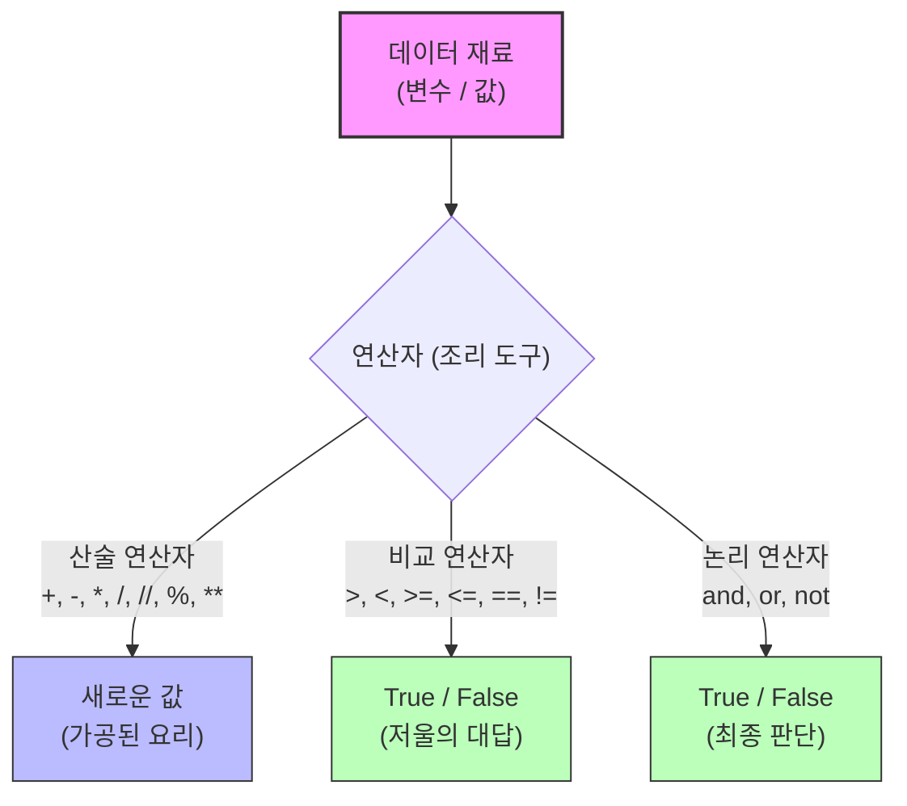

# 마이크로 세션: 047 — 기본연산자와실습

> **세션 ID**: MS-PY101-047  
> **소요 시간**: 25분  
> **난이도**: low  
> **청크 타입**: lab  
> **버전**: v2.1 (7섹션 구조)

---

## §1. 개요

> **Day 3 | AM | 세션 047**

### 🎯 학습 목표

이 세션이 끝나면, 수강생은 다음을 할 수 있습니다:

- 산술 연산자를 활용하여 데이터를 가공하고 계산하는 코드를 작성할 수 있다
- 비교 연산자와 논리 연산자의 결과를 불리언(True/False)으로 예측할 수 있다
- 할당 연산자(`=`)와 비교 연산자(`==`)의 차이를 정확히 구분하고 사용할 수 있다
- 파이썬의 단락 평가(Short-circuit) 특성을 이해하고 에러를 방지할 수 있다

### 선행 세션 환기

지난 세션들에서 우리는 변수라는 이름표를 만들어 데이터에 붙이고, 그 데이터가 어떤 타입(정수, 실수, 문자열 등)인지 확인하는 방법을 배웠습니다. 그리고 `input()`으로 받은 문자열을 `int()`로 형변환하는 과정도 거쳤죠. 자, 냉장고에 재료를 종류별로 잘 분류해서 넣어둔 셈입니다. 그런데 재료를 냉장고에 넣어두기만 하면 요리가 되나요? 아니죠. 도마 위에 올리고, 칼로 썰고, 프라이팬에 볶아야 맛있는 요리가 완성됩니다. 오늘은 프로그래밍에서 이 조리 도구 역할을 하는 '연산자(Operator)'들을 꺼내볼 차례입니다.

---

## §2. 핵심 개념 (+ 🗣️ 강사 대본 + Mermaid)

### 연산자 = 프로그래밍 주방의 "조리 도구"

우리가 작성하는 코드에서 데이터가 '식재료'라면, 연산자는 데이터를 가공하는 '조리 도구'입니다. 파이썬 주방에는 크게 세 가지 종류의 도구가 준비되어 있습니다. 

첫 번째는 **산술 연산자**입니다. 이건 식재료의 형태를 물리적으로 바꾸는 진짜 칼과 프라이팬이에요. 더하기(+), 빼기(-), 곱하기(*)로 재료를 늘리거나 합치고, 나누기(/, //)나 나머지(%)로 재료를 정확하게 분할합니다.

두 번째는 **비교 연산자**입니다. 이건 요리 중에 사용하는 '저울'과 같아요. 재료를 가공하는 것이 아니라, "이게 저것보다 무거워?", "이 두 재료의 양이 똑같아?"라고 질문을 던집니다. 저울은 언제나 `True`(맞아) 아니면 `False`(아니야) 둘 중 하나로만 대답해 줍니다.

세 번째는 **논리 연산자**입니다. 이건 저울 여러 개를 놓고 내리는 '최종 심사'입니다. "소금이 10g 이상이고(and) 설탕이 5g 미만인가?" 같은 복합적인 판단을 할 때 사용합니다.

🗣️ **강사 대본 (Instructor Script)**:

> 여러분, 파이썬이라는 주방에 오신 것을 환영합니다. 지금까지 우리는 재료를 다듬기만 했어요. 이제 본격적으로 불을 켜고 요리를 시작해 볼 겁니다. 여러분이 가장 많이 쓰게 될 도구는 산술 연산자예요. 더하고, 빼고, 곱하는 건 수학 시간과 똑같습니다. 그런데 파이썬에는 재미있는 칼이 두 개 더 있어요. 바로 몫만 뚝 잘라내는 대충 칼(`//`)과 나머지만 체에 걸러주는 도구(`%`)입니다. 이 두 개가 앞으로 아주 유용하게 쓰일 거예요.
>
> 그리고 비교 연산자라는 저울을 쓸 때, 프로그래밍 역사상 가장 많은 초보자를 울린 함정이 하나 있습니다. 수학에서는 '=' 하나가 '같다'는 뜻이죠? 하지만 파이썬에서는 '=' 하나는 무조건 '오른쪽 재료를 왼쪽 상자에 넣어라!'라는 뜻입니다. 진짜로 '양쪽이 똑같니?'라고 저울에 올려놓고 물어보려면 반드시 '=='처럼 두 번 써야 합니다. 이거 하나만 확실히 기억해도 오늘 본전은 뽑으신 겁니다.

### Mermaid 다이어그램: 연산자 분류



---

## §3. 상세 내용

### Why — 왜 연산자를 구분해서 알아야 하는가?

데이터를 변수(이름표)에 연결하는 것만으로는 프로그램이 아무런 동작도 하지 않습니다. 현실 세계의 문제를 해결하려면 계산을 하고, 조건을 비교하고, 그에 따라 결정을 내려야 합니다. "피자 8조각을 3명이서 나누면 몇 조각이 남지?", "사용자의 나이가 18세 이상인가?" 이런 모든 비즈니스 로직의 근간이 바로 연산자입니다.

### What — 연산자의 종류와 단락 평가

**1. 산술 연산자와 나눗셈의 두 얼굴**
파이썬3에서 나눗셈(`/`)은 무조건 소수점까지 정밀하게 계산된 실수(`float`)를 반환합니다. `17 / 5`는 `3.4`가 되죠. 만약 몫만 깔끔한 정수(`int`)로 원한다면 `17 // 5`를 써서 `3`을 얻고, 나머지만 원한다면 `17 % 5`를 써서 `2`를 얻습니다. 특히 나머지 연산(`%`)은 "짝수/홀수 판별(2로 나눈 나머지가 0인지)"이나 "주기적인 반복" 로직에서 약방의 감초처럼 쓰입니다.

**2. 비교 연산자와 가장 큰 함정**
비교 연산자의 결과는 항상 불리언(`bool`) 타입입니다. 크다(`>`), 작다(`<`), 크거나 같다(`>=`), 작거나 같다(`<=`), 다르다(`!=`)는 직관적입니다. 하지만 앞서 강조했듯, 할당 연산자(`=`)와 비교 연산자(`==`)는 하늘과 땅 차이입니다. 
- `score = 85` (명령: 85라는 값을 score에 넣어라)
- `score == 100` (질문: score의 값이 100과 같니? -> `False` 반환)

**3. 논리 연산자와 단락 평가(Short-circuit)**
파이썬은 매우 영리한 언어입니다. `and`(둘 다 참이어야 참)나 `or`(둘 중 하나만 참이어도 참) 연산을 할 때, 굳이 끝까지 계산할 필요가 없으면 앞에서 멈춰버립니다. 이를 **단락 평가**라고 합니다.
예를 들어 `x = 0`일 때, `x and (10 / x)`라는 코드를 실행한다고 해보죠. `x`가 0(Falsy)이기 때문에 `and` 연산은 이미 '거짓'으로 확정되었습니다. 그래서 파이썬은 뒤에 있는 `10 / x`를 아예 쳐다보지도 않고 계산을 종료합니다. 덕분에 0으로 나누면 터지는 무서운 `ZeroDivisionError`를 안전하게 피해갈 수 있습니다.

### How — 연산자 우선순위 실전 활용

수학에 곱셈을 덧셈보다 먼저 하는 규칙이 있듯, 파이썬에도 우선순위가 있습니다.
1순위: 거듭제곱 (`**`)
2순위: 곱셈, 나눗셈, 몫, 나머지 (`*`, `/`, `//`, `%`)
3순위: 덧셈, 뺄셈 (`+`, `-`)
4순위: 비교 연산자 (`>`, `==` 등)
5순위: 논리 연산자 (`not`, `and`, `or`)

이 순서를 억지로 외울 필요는 없습니다. 헷갈린다면 수학에서 하듯 괄호 `()`를 쳐주면 됩니다. 괄호 안의 내용이 언제나 최우선으로 계산되니까요. 가독성을 위해서라도 괄호를 적극적으로 사용하는 것이 좋습니다.

> ✅ **체크포인트**: 여기까지 이해했는지 점검해 보세요.
> - `10 / 2`의 결과값과 그 데이터 타입은 무엇일까요? (`5.0`, `float`)
> - `x = 10`과 `x == 10`의 차이를 누군가에게 설명할 수 있나요?
> - `False and (100 / 0)` 코드가 에러를 발생시키지 않는 이유는 무엇인가요? (단락 평가 때문)

---


### 📊 참고 표 (Visual Specs)

**연산자 우선순위 (Operator Precedence)**

| 순위 | 연산자 종류 | 기호 예시 | 설명 |
|:---|:---|:---|:---|

## §4. 실습 가이드 (+ 🎙️ 실습 대본)

### 실습 목표

이 실습을 통해 수강생은 산술 연산자를 이용한 실생활 계산기 코드를 작성해 보고, 비교 연산자와 단락 평가의 동작을 터미널에서 직접 실행하며 눈으로 확인합니다.

🎙️ **실습 가이드 대본 (Lab Guide)**:

> 자, 이제 눈으로만 보던 도구들을 직접 손에 쥐어볼 시간입니다. 먼저 여러분이 AI에게 지시를 내려볼 거예요. 일상생활에서 흔히 만나는 '피자 나눠먹기' 문제입니다. 
> 
> 에이전트에게 "파이썬으로 피자 조각 나누는 계산기 만들어줘"라고 요청해 보세요. 이때 "몫과 나머지 연산자를 써서 1인당 몇 조각을 먹고 몇 조각이 남는지 보여줘"라고 구체적으로 프롬프트를 주면 훨씬 좋은 코드가 나옵니다. 
>
> 그리고 비교 연산자 실습도 해볼 겁니다. 여러분의 키를 변수에 넣고 롤러코스터 탑승이 가능한지 알아보는 코드를 직접 타이핑해 보세요. `==` 대신 실수로 `=`를 썼을 때 파이썬이 어떤 에러를 뱉어내는지도 직접 확인해 보는 게 중요합니다. 틀려봐야 배울 수 있으니까요!

### 단계별 실습 지시사항

| 단계 | 소요 시간 | 강사 지시사항 | 학습자 액션 | 예상 결과 |
|------|----------|--------------|------------|----------|
| 1 | 3분 | "AI에게 피자 계산기 코드를 요청하세요" | Agent Manager에 계산기 작성 프롬프트 입력 | AI가 `//`와 `%`를 사용한 코드 제시 |
| 2 | 2분 | "코드를 복사해서 실행해 보세요" | `pizza.py` 파일 생성 후 코드 붙여넣기 및 실행 | 1인당 몫과 남은 나머지 조각수 출력 |
| 3 | 3분 | "비교 연산자로 탑승 가능 여부를 테스트하세요" | `can_ride = my_height >= 140` 형태의 코드 작성 및 실행 | `True` 또는 `False` 출력 |
| 4 | 2분 | "일부러 에러를 내봅시다!" | `score = 100` 비교를 `if score = 100:` 으로 잘못 타이핑해보기 | `SyntaxError: invalid syntax` 발생 |
| 5 | 2분 | "단락 평가 마술을 확인해 보세요" | 터미널 REPL(`python`)에서 `0 and (10/0)` 실행 | 에러 없이 `0` 출력 |

### 트러블슈팅 FAQ

| Q | A |
|---|---|
| 나눗셈을 했는데 자꾸 뒤에 `.0`이 붙어서 나와요. | 정상입니다! 파이썬3에서 슬래시 하나(`/`)를 쓴 나눗셈은 무조건 실수(float)를 반환합니다. 소수점 없이 정수 몫만 필요하다면 슬래시 두 개(`//`)를 사용하세요. |
| `if score = 100:` 이라고 썼는데 에러가 나요. | 가장 흔한 실수입니다! `=` 하나는 변수에 값을 넣을 때 쓰고, 양쪽이 같은지 비교할 때는 반드시 `==` 두 개를 써야 합니다. |
| 거듭제곱은 어떻게 하나요? `^` 기호를 쓰면 되나요? | 아니요! 파이썬에서 거듭제곱은 `**`를 사용합니다. `2 ** 3`을 하면 2의 3제곱인 8이 나옵니다. (`^`는 파이썬에서 완전히 다른 비트 연산자로 동작합니다.) |
| `ZeroDivisionError`가 뜹니다! | 어떤 수를 0으로 나누려고 (`10 / 0` 또는 `10 % 0`) 할 때 발생하는 에러입니다. 분모에 들어가는 변수가 0이 아닌지 항상 체크해야 합니다. |
| `10 + 20 * 2`를 했는데 60이 아니라 50이 나와요. | 연산자 우선순위 때문입니다. 곱하기가 더하기보다 먼저 실행되어서 `20 * 2`가 먼저 계산됩니다. 60을 원한다면 괄호를 묶어 `(10 + 20) * 2`로 작성해야 합니다. |

---


### 🎓 강사 노트 (Instructor Support)

- ⏱️ **타이밍**: 10:15 (20분, lab)
- 🎯 **핵심 활동**: 산술/비교 연산자
- ⚠️ **강사 주의사항**: 프롬프트로 코드 생성→예측→검증


### 📋 실습 설계 보강 (Lab Packet)

**세션 047 실습 설계 보강**

기본 연산자와 실습
- **3-Stage Example Set**
  - 기본: AI에게 "산술 연산자와 비교 연산자를 사용하는 파이썬 예제를 만들어줘" → 실행
  - 변형: "할인율 계산기" 프롬프트 — 원가와 할인율을 입력받아 최종 가격 계산
  - 실수 해결: `10 / 3` 결과가 `3.333...`으로 나와 당황 → 정수 나눗셈 `//` 소개
- **난이도 예측**: 연산자 자체는 쉬우나 `//`, `%`, `**` 같은 특수 연산자가 낯설음
- **타이밍 가이드**: 산술 연산 체험 5분 | 비교 연산 체험 5분 | 할인 계산기 5분 | 정리 5분
- **심리적 장벽**: "수학을 못하는데 괜찮을까?"
- **자가 점검**:
  - [ ] `+`, `-`, `*`, `/`, `//`, `%` 각각의 결과를 확인했는가?
  - [ ] `==`, `!=`, `>`, `<`의 결과가 True/False임을 확인했는가?
  - [ ] 프롬프트로 간단한 계산기를 생성하고 실행해봤는가?

## §5. 코드 및 명령어 모음

### 1. 산술 연산자 기본 (피자 계산기)

```python
# 피자 한 판(8조각)을 3명이서 나눌 때
pizza_slices = 8
people = 3

each = pizza_slices // people     # 몫: 1인당 먹는 조각 수
leftover = pizza_slices % people  # 나머지: 남는 조각 수

# f-string을 활용한 결과 출력
print(f"1인당 {each}조각씩 먹고, {leftover}조각이 남습니다.") 
# 출력: 1인당 2조각씩 먹고, 2조각이 남습니다.

# 나눗셈 연산자 비교
print(17 / 5)   # 3.4 (소수점까지 정밀하게, float)
print(17 // 5)  # 3   (몫만 뚝 자름, int)
```

### 2. 비교 연산자와 불리언

```python
my_height = 150
ride_limit = 140

# 질문을 던지는 저울 (결과는 항상 bool)
can_ride = my_height >= ride_limit
print(f"탑승 가능: {can_ride}")  # True

# 할당(=)과 비교(==)의 절대적인 차이
score = 85           # "score 상자에 85를 넣어라!" (할당)
print(score == 100)  # "score 상자 안의 값이 100과 같니?" (비교) -> False
print(score != 100)  # "score 상자 안의 값이 100과 다르니?" (비교) -> True
```

### 3. 논리 연산자와 단락 평가(Short-circuit)

```python
x = 0

# and 연산: 앞이 거짓(0)이면 뒤는 아예 쳐다보지도 않음
# 그래서 10 / x 에서 발생하는 ZeroDivisionError를 피할 수 있음
result = x and (10 / x)
print(result)  # 0

# or 연산: 앞이 참이면 뒤는 계산하지 않고 앞의 값을 반환
y = 10
result2 = y or (10 / 0)
print(result2) # 10 (ZeroDivisionError 발생 안 함)
```

---

## §6. 요약

### 핵심 학습 포인트

이번 세션에서 우리는 데이터 재료를 요리하는 도구들을 장착했습니다. 
1. **산술 연산자는 재료를 가공합니다**: 특히 `//`(몫)과 `%`(나머지)는 로직 구현에 자주 쓰이는 훌륭한 도구입니다. 파이썬의 나눗셈(`/`)은 항상 실수를 반환한다는 점을 기억하세요.
2. **비교와 논리 연산자는 판단을 내립니다**: 저울의 결과는 언제나 `True` 아니면 `False`입니다. 또한 파이썬의 똑똑한 '단락 평가' 덕분에 불필요한 에러를 막을 수 있습니다.
3. **가장 중요한 규칙**: `=`는 변수 상자에 값을 '넣어라'이고, `==`는 양쪽의 값이 '같니?'라고 묻는 것입니다. 이 둘을 혼동하면 수많은 에러와 마주하게 됩니다.

### 다음 세션 예고

지금까지 우리는 변수 상자 하나에 값 하나씩만 담아서 요리했습니다. 그런데 학생 100명의 점수를 처리해야 한다면 어떨까요? 변수 상자 100개를 만들고 연산자 100개를 써야 할까요? 상상만 해도 끔찍합니다. 다음 시간에는 이렇게 넘쳐나는 데이터를 깔끔하게 하나로 묶어주는 마법의 서랍장, '리스트(List)'에 대해 알아보겠습니다.

### 브릿지 노트

> "여러분, 오늘 연산자 실습 어떠셨나요? 생각보다 기호들이 친숙하죠? 이제 우리는 컴퓨터에게 '이것과 저것을 계산해!' 그리고 '이게 저것보다 큰지 비교해!'라고 명령할 수 있게 되었습니다. 
> 
> 그런데 한 가지 문제가 생겼어요. 데이터가 3개, 4개일 때는 변수 이름표를 하나씩 붙이는 게 괜찮았는데, 고객 데이터 1,000만 건을 다뤄야 한다면 어떻게 될까요? 이름표를 1,000만 개 만들 순 없겠죠. 다음 세션에서는 이 수많은 데이터를 번호가 매겨진 거대한 아파트 서랍장에 예쁘게 꽂아 넣는 기술, '리스트'를 배워보겠습니다. 잠깐 쉬고 데이터의 집을 지으러 가보죠!"

---

## §7. 참고 자료

### 3-Source 출처

- **Source A (로컬 참고자료)**: 「8 코딩.pdf」 — 연산자 우선순위, 산술 연산자(`//`, `%` 활용법) 및 비교 연산자 기초
- **Source B (NotebookLM)**: SRC-B03 — Day 3 팩트 패킷 기반, 산술/비교 연산자 비유(조리 도구와 저울), 변수와 할당의 관계
- **Source C (Deep Research)**: SRC-C03 — 파이썬 CPython 런타임의 단락 평가(Short-circuit evaluation) 메커니즘, `=`와 `==`의 파서 해석 차이

### 강사 노트

> 💡 **강사 노트**: 
> 초보자들이 가장 많이 헷갈려하는 두 가지 포인트는 1) `/`와 `//`의 차이, 2) `=`와 `==`의 혼동입니다. 특히 다음 세션 이후로 `if` 조건문을 배우게 되는데, 이때 `if score = 100:` 이라고 쓰는 실수가 속출합니다. 이번 세션에서 저울 비유와 단호한 어조로 `==`의 중요성을 강력하게 인지시켜 주세요.
> 단락 평가(Short-circuit) 부분은 당장 100% 이해하지 못해도 괜찮습니다. "파이썬은 쓸데없는 계산은 안 하는 똑똑한 친구구나" 정도로 넘어가고, 나중에 조건문 실습에서 자연스럽게 다시 체득하도록 유도하는 것이 좋습니다.

---

**🔗 선행 세션**: [세션-046] 타입 변환과 f-string (필수)  
**🔗 후행 세션**: [세션-048] 리스트의 이해와 기본 조작  

---

*작성 일시: 2026-02-25*  
*작성 에이전트: A4B_Session_Writer*  
*교안 구조: 7섹션 (A0 팀 공통 표준)*