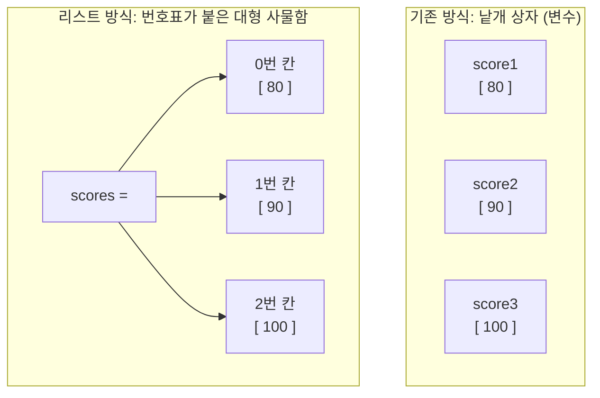

# 마이크로 세션: 048 — 리스트와기본조작
> **세션 ID**: MS-PY101-048
> **소요 시간**: 25분
> **난이도**: low
> **청크 타입**: narrative
> **버전**: v2.1 (7섹션 구조)

---

## §1. 개요

> **Day 3 | AM | 세션 048/064**

이 세션은 변수와 기본 데이터 타입을 배운 수강생들이 처음으로 만나게 되는 '자료구조(Data Structure)' 시간입니다. 낱개의 변수로 데이터를 관리하던 1차원적인 방식에서 벗어나, 수많은 데이터를 효율적으로 묶어서 관리하는 파이썬의 가장 강력하고 기본적인 도구인 '리스트(List)'의 세계로 진입합니다.

### 🎯 학습 목표

이 세션이 끝나면 수강생은 다음을 할 수 있어요:
- 단일 변수와 리스트의 차이를 '상자'와 '번호표가 붙은 대형 사물함' 비유로 설명할 수 있습니다
- 파이썬 리스트를 생성하고, 데이터의 추가(`append`), 삭제(`remove`), 개수 확인(`len`) 등 기본 조작을 수행할 수 있습니다
- 리스트가 순서를 유지하며 중복 데이터를 허용한다는 특징을 이해하고 활용할 수 있습니다

### 선행 세션 환기

직전 세션(047)에서 기본 연산자와 단락 평가를 배웠습니다. 지금까지는 데이터를 하나씩 이름표(변수)를 붙여 다뤘다면, 이제는 수십, 수백 개의 데이터를 한 번에 효율적으로 관리하는 방법을 배울 차례입니다.

---

## §2. 핵심 개념 (+ 🗣️ 강사 대본 + Mermaid)

### 낱개 상자에서 번호표가 붙은 대형 사물함으로

데이터를 변수라는 포스트잇 이름표로 하나씩 관리하는 것은 데이터가 적을 때는 문제가 없어요. 하지만 관리해야 할 데이터가 전교생 100명의 수학 점수라면 어떨까요? `score1`, `score2`부터 `score100`까지 변수를 100개 만드는 것은 엑셀에서 데이터를 한 줄 한 줄 수작업으로 입력하는 것과 같은 끔찍한 일입니다 [Source A].

이럴 때 등장하는 구원투수가 바로 '자료구조'입니다. 그 중에서도 파이썬의 가장 기본이 되는 자료구조인 **'리스트(List)'**는 학교 복도에 있는 **'번호표가 붙은 대형 사물함'**과 똑같습니다. 낱개 상자 100개를 방바닥에 어지럽게 굴려놓는 대신, 커다란 사물함 하나에 0번부터 99번까지 순서대로 번호표를 붙여 물건을 차곡차곡 정리하는 것이죠 [Source B, C].

🗣️ **강사 대본 (Instructor Script)**:

> 여러분, 지금까지 우리는 데이터를 하나씩 다뤘어요. `score = 80` 이런 식으로요. 그런데 만약 전교생 100명의 수학 점수를 저장해야 한다면 어떨까요? `score1, score2, ... score100`까지 변수 이름표를 100개나 만들어야 할까요? 상상만 해도 손가락이 아파옵니다. 엑셀에서 데이터를 한 줄 한 줄 수작업으로 치던 그 노가다의 악몽이 떠오르시나요?
>
> 프로그래밍에서는 이런 문제를 아주 우아하게 해결합니다. 바로 '리스트(List)'라는 것을 통해서요. 
>
> 학교 복도에 있는 사물함을 떠올려 보세요. 상자 100개가 뿔뿔이 흩어져 있는 게 아니라, 커다란 사물함 하나에 칸막이를 치고 0번 칸, 1번 칸, 2번 칸... 이렇게 순서대로 번호표를 붙여서 물건을 차곡차곡 넣는 거예요. 찾을 때는 "사물함 0번 칸 열어봐!" 하면 되는 거죠. 낱개 상자 100개를 방바닥에 굴려놓는 것과, 번호표가 붙은 사물함 하나에 정리하는 것. 어느 쪽이 더 편할지는 말 안 해도 아시겠죠?
>
> AI 통역사에게 "수학 점수 100개 다 기억해"라고 하면 헷갈리지만, "점수 명단 엑셀표(리스트)"를 하나 넘겨주면서 "여기 적혀 있어"라고 하면 완벽하게 일합니다. 리스트는 AI와 소통하는 가장 기본적인 데이터 묶음 방식이에요.

### Mermaid 다이어그램: 낱개 변수 vs 리스트



이 다이어그램은 낱개 변수들을 개별적으로 관리하던 기존 방식에서, 하나의 리스트라는 구조물 안에 순서대로(0번, 1번, 2번...) 데이터를 담아 관리하는 방식으로의 진화를 시각적으로 보여줍니다.

---

## §3. 상세 내용

### Why — 왜 리스트가 필요한가?

프로그래밍의 핵심은 '반복적인 작업을 자동화'하는 것입니다. 데이터가 1만 개, 10만 개로 늘어났을 때 이를 효율적으로 처리하려면, 데이터를 하나의 묶음으로 다룰 수 있어야 합니다. 만약 리스트가 없다면 우리는 데이터의 개수만큼 변수 이름을 새로 지어내야 하고, 그 데이터를 한꺼번에 출력하거나 계산하는 일은 불가능에 가깝습니다. 리스트는 대량의 데이터를 하나의 군집으로 만들어, 일괄적인 명령(정렬, 검색, 수정 등)을 내릴 수 있게 해주는 필수적인 토대입니다.

### What — 리스트란 무엇인가?

파이썬에서 리스트는 대괄호 `[]`를 사용하여 만듭니다. `scores = [80, 90, 100]`처럼 여러 개의 값을 쉼표로 구분해서 한 번에 넣을 수 있죠. 파이썬의 리스트는 매우 유연해서 숫자, 문자열, 심지어 다른 리스트까지도 하나의 사물함에 섞어 넣을 수 있습니다 [Source B].

리스트의 가장 중요한 두 가지 특징이 있습니다:
1. **순서가 있다 (Ordered)**: 내가 넣은 순서대로 번호표가 부여됩니다. 첫 번째 넣은 데이터는 0번 칸에, 두 번째 넣은 데이터는 1번 칸에 들어갑니다.
2. **중복을 허용한다 (Duplicates Allowed)**: 같은 값이 여러 번 들어가도 상관없습니다. 80점 받은 학생이 여러 명일 수 있으니까요. `[80, 80, 90]`처럼 똑같은 값을 여러 개 담을 수 있습니다.

### How — 리스트는 어떻게 조작하는가?

우리는 이 사물함을 다룰 때 주로 추가(Create), 읽기(Read), 수정(Update), 삭제(Delete)라는 4가지 행동을 합니다. 이를 줄여서 **CRUD**라고 부르며, 프로그래밍 세계에서 정말 자주 등장하는 핵심 개념입니다 [Source C].

- **생성**: `[]` 대괄호로 빈 사물함을 만들거나, 처음부터 데이터를 채워 넣습니다.
- **추가 (`.append()`)**: 사물함 맨 끝에 빈 칸을 하나 더 만들고 새로운 데이터를 넣습니다.
- **삭제 (`.remove()`)**: 리스트 안에서 특정 값을 찾아 지웁니다. 단, 중복된 값이 있다면 맨 처음 발견된 것 하나만 지웁니다.
- **개수 확인 (`len()`)**: 사물함에 총 몇 개의 칸(데이터)이 있는지 세어줍니다. 내장 함수를 활용합니다.

> ⚠️ **주의사항**: 초보자들이 흔히 하는 실수 중 하나는 리스트 정렬 시 `.sort()`의 반환값을 변수에 저장하는 것입니다. `new_list = fruits.sort()`라고 작성하면 `new_list`에는 `None`이 들어갑니다. `.sort()`는 원본 사물함 안의 내용물을 스스로 정리할 뿐, 새로운 사물함을 통째로 복사해서 주지는 않는다는 점을 명심해야 합니다 [Source A, B].

---


### 📊 참고 표 (Visual Specs)

**컬렉션 타입 비교 (List vs Dict vs Tuple)**

| 자료구조 | 특징 | 괄호 기호 | 수정 가능성 | 주요 용도 |
|:---|:---|:---|:---|:---|

## §4. 실습 가이드 (+ 🎙️ 실습 대본)

### 실습 목표

AI와 협력하여 과일 바구니(리스트)를 만들고, 과일을 추가, 삭제, 교체, 정렬하는 기본적인 CRUD 작업을 직접 코드로 실행하며 확인합니다. 이 과정에서 `.append()`, `.remove()`, 그리고 리스트의 크기를 구하는 `len()` 함수의 동작을 체감합니다.

🎙️ **실습 가이드 대본 (Lab Guide)**:

> 자, 이제 AI 비서와 함께 파이썬 리스트를 직접 만들어 봅시다. Antigravity 환경에서 AI에게 이렇게 프롬프트를 입력해 보세요: "내가 좋아하는 과일 3개를 파이썬 리스트로 만들어줘."
>
> 코드가 생성되었나요? 대괄호 `[]` 안에 과일 이름들이 쉼표로 나란히 들어있을 거예요. 이 대괄호가 바로 파이썬에게 "이건 여러 개를 담는 사물함이야"라고 알려주는 기호입니다. (소괄호나 중괄호를 쓰면 완전히 다른 뜻이 되니 꼭 대괄호를 써야 해요!)
>
> 이제 사물함을 조작해 볼까요?
> 1. 방금 만든 리스트에 코드를 한 줄 추가해서 `.append("딸기")`라고 적고 실행해 보세요. 맨 뒤에 딸기가 추가되었을 겁니다.
> 2. 이번에는 `.remove("사과")`를 해보세요. 사과가 사라졌죠? 
> 3. 만약 리스트에 없는 과일, 예를 들어 `.remove("수박")`이라고 하면 어떻게 될까요? 직접 쳐보세요. 파이썬이 시뻘건 글씨로 "ValueError"라며 "그런 물건 없는데요?"라고 화를 낼 거예요. 없는 칸을 열라고 하니 당연한 반응입니다.
> 4. 마지막으로 `len(과일_리스트_이름)`을 출력해 보세요. 현재 바구니에 과일이 몇 개 남아있는지 정확하게 세어줍니다.

### 단계별 지시

| 단계 | 소요 시간 | 강사 지시사항 | 학습자 액션 | 예상 결과 |
|------|----------|--------------|------------|----------|
| 1 | 5분 | "AI에게 과일 3개가 든 리스트 생성을 요청하세요" | 프롬프트 입력 및 코드 확인 | `fruits = ["사과", ...]` 리스트 구조 파악 |
| 2 | 5분 | ".append()와 .remove()를 사용해 보세요" | 요소 추가 및 삭제 실행 | 리스트 내용물의 동적 변화 확인 |
| 3 | 3분 | "리스트에 없는 요소를 삭제해 보세요" | `.remove("수박")` 등 실행 | `ValueError` 발생 및 에러 메시지 확인 |
| 4 | 2분 | "len() 함수로 과일의 총 개수를 출력해 보세요" | `print(len(fruits))` 실행 | 리스트의 길이를 숫자로 반환받음 |

### 트러블슈팅 FAQ

| Q | A |
|---|---|
| 대괄호 `[]` 대신 소괄호 `()`를 쓰면 안 되나요? | 네, 안 됩니다! 소괄호를 쓰면 파이썬은 이를 '튜플(Tuple)'이라는 전혀 다른 자료구조로 인식합니다. 튜플은 한 번 만들면 내용물을 수정하거나 추가(`.append()`)할 수 없는 딱딱한 상자예요. 리스트는 무조건 대괄호입니다. |
| `.remove()`를 했는데 에러가 나요 | 두 가지를 확인해 보세요. 1) 철자가 정확히 일치하는지(대소문자, 띄어쓰기 포함), 2) 그 데이터가 현재 리스트 안에 진짜로 존재하는지. 없는 것을 지우라고 하면 에러가 납니다. |
| 리스트 안에 숫자랑 문자를 섞어 넣어도 되나요? | 네! 파이썬 리스트는 아주 관대해서 `[1, "사과", True]`처럼 아무거나 섞어 넣어도 됩니다. 다만 실무에서는 관리를 위해 보통 같은 종류의 데이터끼리 묶어 둡니다. |

---


### 🎓 강사 노트 (Instructor Support)

- ⏱️ **타이밍**: 10:35 (25분, narrative)
- 🎯 **핵심 활동**: 리스트 = "서랍장" 비유
- ⚠️ **강사 주의사항**: CRUD 조작 맛보기

## §5. 코드 및 명령어 모음

```python
# 1. 리스트 생성 (Create): 대괄호로 사물함 만들기
fruits = ["사과", "바나나", "포도"]
print(fruits)  # 출력: ['사과', '바나나', '포도']

# 2. 요소 추가 (Update/Create): 맨 뒤에 칸 늘리기
fruits.append("딸기")
print(fruits)  # 출력: ['사과', '바나나', '포도', '딸기']

# 리스트는 중복을 허용합니다!
fruits.append("사과")
print(fruits)  # 출력: ['사과', '바나나', '포도', '딸기', '사과']

# 3. 요소 삭제 (Delete): 특정 물건 찾아서 빼기
# 중복된 항목이 있을 경우, 가장 먼저 나오는(인덱스가 작은) 항목 하나만 지웁니다.
fruits.remove("사과")
print(fruits)  # 출력: ['바나나', '포도', '딸기', '사과']

# 4. 개수 확인: 사물함에 칸이 몇 개인지 세기
count = len(fruits)
print(f"과일의 총 개수는 {count}개 입니다.")  # 출력: 과일의 총 개수는 4개 입니다.

# 5. 정렬하기와 흔한 실수 주의
fruits.sort()
print("정렬 후:", fruits)  # 출력: 정렬 후: ['딸기', '바나나', '사과', '포도'] (가나다순)

# ⚠️ 주의: sort()를 변수에 담지 마세요!
wrong_list = fruits.sort()
print(wrong_list)  # 출력: None
```

> 🤖 **AI 프롬프트 예시**:
> - "파이썬에서 내가 좋아하는 과일 이름 3개가 들어간 리스트를 만드는 코드를 짜줘."
> - "그 리스트의 맨 끝에 '오렌지'를 추가하고, 리스트에 총 과일이 몇 개인지 개수를 출력하는 코드를 추가해줘."

---

## §6. 요약

### 핵심 학습 포인트

이번 세션의 핵심은 세 가지입니다:
1. **리스트는 번호표가 붙은 사물함이다**: 대괄호 `[]`를 사용하며, 여러 개의 데이터를 하나의 묶음으로 효율적으로 관리할 수 있습니다.
2. **순서와 중복 허용**: 리스트에 넣은 데이터는 입력한 순서가 그대로 유지되며, 똑같은 값이 여러 번 들어가도 괜찮습니다.
3. **리스트의 기본 조작(CRUD)**: 맨 뒤에 추가할 때는 `.append()`, 값을 찾아 지울 때는 `.remove()`, 총 데이터의 개수를 셀 때는 내장 함수인 `len()`을 사용합니다.

### 다음 세션 예고

지금까지 우리는 `append()`로 맨 뒤에 데이터를 넣거나 `remove()`로 과일 이름을 직접 불러서 지웠습니다. 그런데 만약 "사물함의 2번 칸에 있는 물건만 콕 집어서 꺼내줘!"라고 하려면 어떻게 해야 할까요? 파이썬에서 사물함의 번호표를 읽는 아주 독특하고도 중요한 규칙이 있습니다. 바로 **'인덱싱(Indexing)'과 '슬라이싱(Slicing)'**입니다.

### 브릿지 노트

> "리스트가 얼마나 편리한 도구인지 감이 오시나요? 엑셀 표를 파이썬으로 옮겨놓은 것 같죠. 그런데 이 리스트에서 데이터를 꺼낼 때 아주 조심해야 할 '파이썬의 비밀'이 하나 있습니다. 우리가 일상에서 "첫 번째"라고 하면 1번이지만, 파이썬은 이 번호표를 0번부터 붙입니다. 이 '0의 비밀'을 모르면 엉뚱한 데이터를 꺼내게 되는데요. 다음 시간에 이 비밀을 바로 파헤쳐 보겠습니다."

---

## §7. 참고 자료

### 3-Source 출처

- **Source A (로컬 참고자료)**: `8 코딩.pdf` §8.3 — 리스트의 개념 및 파이썬에서의 기본 활용 방법, `sort()` 사용 시 원본이 변경되며 `None`이 반환된다는 흔한 실수 유형 발췌.
- **Source B (NotebookLM)**: Day 3 팩트 패킷 분석 리포트 — 단일 변수 관리의 한계를 해결하는 자료구조로서의 리스트 비유(대형 사물함), 숫자와 문자가 혼용 가능한 파이썬 리스트의 유연성.
- **Source C (Deep Research)**: Day 3 팩트 패킷 리서치 — 데이터 묶음을 다루는 프로그래밍의 기본 동작인 CRUD(Create, Read, Update, Delete) 개념 적용.

### 추가 학습 자료

- [Python 공식 문서: 데이터 구조 (Lists)](https://docs.python.org/ko/3/tutorial/datastructures.html#more-on-lists)
- [Python 내장 함수 공식 문서 (len, 등)](https://docs.python.org/ko/3/library/functions.html)

### 강사 노트

> 💡 **강사 노트**: 
> - `score1, score2 ...` 방식의 노가다를 상기시키며 리스트의 필요성(Why)을 강하게 공감시키는 것이 시작 포인트입니다.
> - `sort()`를 변수에 담아서 `None`이 출력되는 실수는 정말 빈번하게 발생하므로, "사물함 스스로 정리만 할 뿐, 새 사물함을 주진 않는다"는 비유를 실습 중에 꼭 강조해 주세요.
> - 리스트는 중복을 허용한다는 점을 보여주기 위해 `.append("사과")`를 두 번 하는 예시를 보여주는 것도 좋은 접근입니다.

---

## ✅ 세션 완료 체크리스트 (강사용)

- [x] §1~§7 모든 섹션이 충실하게 작성되었는가?
- [x] 리스트와 사물함 비유가 직관적으로 전달되었는가?
- [x] `.append()`, `.remove()`, `len()` 및 CRUD 개념이 포함되었는가?
- [x] 순서 유지와 중복 허용이라는 리스트의 핵심 속성이 설명되었는가?
- [x] 3-Source 팩트 패킷 출처가 명확히 기재되었는가?

---

*작성 일시: 2026-02-25*  
*작성 에이전트: A4B_Session_Writer*  
*교안 구조: 7섹션 (A0 팀 공통 표준)*