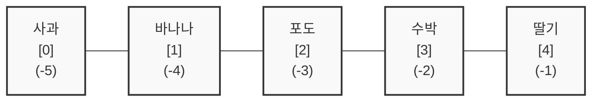

# 마이크로 세션: 049 — 리스트인덱싱

> **세션 ID**: MS-PY101-049  
> **소요 시간**: 25분  
> **난이도**: low  
> **청크 타입**: narrative  
> **버전**: v2.1 (7섹션 구조)

---

## §1. 개요

> **Day 3 | AM | 세션 049/064**

이 세션에서는 바로 앞 세션에서 만든 거대한 사물함(리스트)에서 우리가 원하는 물건을 콕 집어 꺼내는 방법을 배울 거예요. 사물함에 데이터를 아무리 많이 넣어둬도, 필요할 때 정확한 데이터를 꺼내지 못하면 아무 소용이 없겠죠? 이번 시간에는 파이썬이 데이터를 세는 독특한 방식인 '제로 베이스' 규칙을 이해하고, 원하는 만큼 데이터를 잘라내는 방법을 완벽하게 내 것으로 만들어 봅니다.

### 🎯 학습 목표

이 세션이 끝나면 수강생은 다음을 할 수 있어요:

- 파이썬이 숫자를 0부터 세는 '제로 베이스(Zero-base)' 규칙을 이해하고 설명할 수 있습니다
- 인덱싱을 통해 리스트에서 특정 위치의 데이터를 정확히 뽑아낼 수 있습니다
- 슬라이싱(`[시작:끝:스텝]`)을 사용해 원하는 범위의 데이터를 마음대로 잘라낼 수 있습니다
- 음수 인덱스를 써서 데이터의 맨 끝에서부터 역순으로 쉽게 접근할 수 있습니다

### 선행 세션 환기

바로 앞선 세션 048에서 우리는 리스트라는 거대한 사물함을 처음 만들고, `append()`나 `remove()` 같은 도구로 물건을 넣고 빼는 방법을 배웠어요. 이제는 사물함 안에 있는 수백, 수천 개의 물건 중에서 "딱 이것만 꺼내줘!"라고 파이썬에게 정확하게 지시하는 법을 배울 차례입니다.

---

## §2. 핵심 개념 (+ 🗣️ 강사 대본 + Mermaid)

### 0층부터 시작하는 파이썬 아파트 비유

파이썬을 비롯한 대부분의 프로그래밍 언어에는 초보자를 가장 헷갈리게 만드는 독특한 규칙이 하나 있어요. 바로 숫자를 1이 아니라 '0'부터 센다는 거예요. 이것을 전문 용어로 '제로 베이스(Zero-base)'라고 부릅니다. 우리나라 아파트는 보통 1층부터 시작하지만, 파이썬 마을에 있는 아파트는 항상 '0층'부터 시작한다고 상상해 보세요. 첫 번째 집이 0호, 두 번째 집이 1호가 되는 식이죠.

🗣️ **강사 대본 (Instructor Script)**:

> 여러분, 지난 시간에 우리가 거대한 사물함을 하나 샀죠? 과일도 잔뜩 넣어두었고요. 자, 이제 그 사물함에서 물건을 좀 꺼내봅시다. 파이썬에게 "1번째 칸에 있는 사과 꺼내줘!"라고 말해볼까요? 어라, 이상하게 사과가 아니라 두 번째 칸에 있던 바나나가 튀어나옵니다. 왜 그럴까요?
>
> 파이썬에는 초보자를 아주 당황하게 만드는 비밀이 하나 숨어 있거든요. 바로 숫자를 1부터 세지 않고 '0'부터 센다는 겁니다.
>
> 여러분이 파이썬 마을에 아파트를 하나 지었다고 상상해 보세요. 우리나라 아파트는 보통 1층부터 시작하죠? 1층 다음에 2층이 나오고요. 그런데 파이썬 마을의 아파트는 항상 '0층'부터 시작합니다. 그래서 우리가 "첫 번째 층에 가주세요"라고 하면, 파이썬은 0층으로 갑니다. 두 번째 층은 1층이 되고요.
>
> AI 조수에게 "리스트의 첫 번째 데이터를 가져와"라고 하면, AI가 이해하는 첫 번째는 당연히 0번입니다. 이 규칙을 모르면 항상 내가 원하는 데이터보다 한 칸 뒤에 있는 데이터를 꺼내게 되면서 엉뚱한 결과가 나오게 돼요. 처음에는 0부터 세는 게 정말 어색하겠지만, 나중에 코딩을 계속하다 보면 1부터 세는 게 오히려 이상하게 느껴지는 날이 꼭 올 겁니다.

### Mermaid 다이어그램

파이썬의 리스트가 어떻게 번호를 매기는지 시각적으로 살펴볼까요? 양수 인덱스와 음수 인덱스가 동시에 어떻게 붙어있는지 보여주는 다이어그램이에요.



이 그림을 머릿속에 사진 찍듯 기억해 두세요. 왼쪽 끝에서부터 셀 때는 0부터 시작하고, 오른쪽 끝에서부터 셀 때는 -1부터 시작합니다. 이 두 가지 방향만 알면 리스트 안에서 길을 잃을 일이 없어요.

---

## §3. 상세 내용

### Why — 왜 이 세션이 필요한가?

리스트에 수만 개의 고객 데이터나 매출 기록을 쏟아부어 놓았다고 가정해 볼게요. 데이터를 잘 보관하는 것도 중요하지만, "어제 가입한 10명의 회원"이나 "매출 상위 3등까지의 기록"처럼 내가 딱 원하는 부분만 정확하게 발라내는 능력이 실무에서는 훨씬 더 중요합니다. 

특히 AI가 짜준 코드를 읽을 때, `data[0]`이나 `user_list[:5]` 같은 표현은 숨 쉬듯 자연스럽게 등장해요. 여기서 제로 베이스 규칙이나 슬라이싱의 범위를 헷갈리면, 코드가 완전히 멀쩡해 보여도 엉뚱한 데이터를 처리하는 치명적인 논리적 오류(Logical Error)를 잡아낼 수 없습니다.

### What — 이 세션에서 다루는 것은 무엇인가?

이 세션에서는 리스트 안의 데이터를 자유자재로 다루는 세 가지 기술을 배웁니다.

첫 번째는 **인덱싱(Indexing)**이에요. 핀셋으로 원하는 데이터를 하나만 콕 집어내는 기술입니다. `과일[0]`처럼 대괄호 안에 번호를 넣어 사용해요. 
두 번째는 **음수 인덱싱**입니다. 데이터가 100만 개쯤 있을 때 맨 마지막 데이터를 찾으려면 999,999번째 칸을 찾아야 하죠. 너무 힘드니까 파이썬은 뒤에서부터 세는 기능도 만들었어요. 맨 뒤는 항상 `-1`입니다.
세 번째는 **슬라이싱(Slicing)**이에요. 칼로 롤케이크를 자르듯이, 데이터 여러 개를 뭉텅이로 잘라내는 기술입니다. `[시작:끝:스텝]` 형태로 씁니다.

### How — 구체적으로 어떻게 진행하는가?

인덱싱은 아주 직관적이에요. 이름표 뒤에 대괄호를 열고 방 번호를 써주면 끝납니다. 제일 중요한 건 슬라이싱의 규칙을 이해하는 거예요.

슬라이싱에서 절대 잊지 말아야 할 대원칙이 있습니다. 바로 **'끝 번호는 포함하지 않는다'**는 거예요. 수학에서 "이상, 미만"을 배울 때의 그 '미만'과 똑같습니다. 
예를 들어 `fruits[0:2]`라고 코드를 쓰면, 파이썬은 0번과 1번 데이터만 가져오고 2번 데이터 앞에서는 칼로 딱 잘라버립니다. 2번은 포함되지 않아요. 앞서 반복문에서 배웠던 `range()` 함수에서도 끝 번호가 빠졌던 것 기억하시나요? 파이썬은 이 "미만" 규칙을 리스트에서도 아주 일관되게 적용하고 있어요.

여기에 한 걸음 더 나아가면 **스텝(Step)**이라는 기능도 쓸 수 있습니다. `[시작:끝:스텝]` 이렇게 콜론(`:`)을 두 개 찍고 마지막에 보폭을 적어주면 돼요. 스텝을 2로 주면 하나씩 건너뛰며 데이터를 꺼내옵니다.

---

## §4. 실습 가이드 (+ 🎙️ 실습 대본)

### 실습 목표

코드에서 직접 인덱싱과 슬라이싱을 해보면서 "끝 번호는 포함되지 않는다"는 규칙을 눈으로 확인합니다. 또한 리스트의 크기보다 큰 번호를 넣었을 때 발생하는 `IndexError`를 직접 마주하고, 왜 에러가 나는지 에러 메시지를 읽어보는 경험을 합니다.

🎙️ **실습 가이드 대본 (Lab Guide)**:

> 자, AI 조수에게 "월요일부터 일요일까지 요일이 들어있는 리스트를 만들어줘"라고 부탁해 보세요. 그리고 인덱싱과 슬라이싱 코드를 실행해 볼 건데, 여기서 잠깐! 실행 버튼(Run)을 누르기 전에 꼭 눈으로 먼저 결과를 맞혀보세요.
>
> `days[0:5]`를 하면 무슨 요일이 나올까요? 네, "토요일이 포함되나 안 되나"를 유심히 보셔야 합니다. 직접 실행해 보니 어때요? 5번 인덱스인 토요일은 쏙 빠지고 금요일까지만 나오죠? 바로 이게 파이썬의 칼자국이 들어가는 위치입니다. 끝 번호 앞부분에서 가차 없이 잘려요.
>
> 이번에는 한 가지 재미있는 실험을 해볼게요. 우리 리스트에는 요일이 7개밖에 없죠? 대괄호 안에 `days[10]`이라고 적고 실행해 보세요. 화면이 빨갛게 변하면서 에러가 날 겁니다. "IndexError: list index out of range"라고 나오네요. 방이 6개(0~6번)밖에 없는 아파트에 가서 10호 문을 열어달라고 하니 파이썬이 "그런 방은 없는데요?" 하고 화를 내는 겁니다. 이 에러 메시지와 아주 친해지셔야 해요. 정말 자주 보게 되실 거거든요!

### 단계별 지시

| 단계 | 소요 시간 | 강사 지시사항 | 학습자 액션 | 예상 결과 |
|------|----------|--------------|------------|----------|
| 1 | 3분 | 요일 리스트 생성 및 인덱싱 예측 지시 | 눈으로 코드 결과 예측 | 0번이 '월', -1이 '일'임을 파악 |
| 2 | 4분 | 슬라이싱 코드 실행 및 '끝 번호 미만' 확인 | `[0:5]` 실행 후 결과 관찰 | 평일(월~금)만 출력되는 것 확인 |
| 3 | 3분 | 범위 밖 인덱스(`days[10]`) 호출 지시 | 존재하지 않는 인덱스 호출 | `IndexError` 발생 및 메시지 확인 |
| 4 | 5분 | 스텝을 활용한 응용 코드 실험 | `[::2]` 및 `[::-1]` 실행 | 하나 건너뛰기, 역순 뒤집기 체감 |

### 트러블슈팅 FAQ

| Q | A |
|---|---|
| 숫자를 자꾸 1부터 세서 엉뚱한 값이 나와요. | 정상적인 반응이에요! "첫 번째 = 0번"이라고 책상에 포스트잇을 붙여두는 것도 좋은 팁입니다. 의식적으로 1을 빼서 생각하는 연습을 하다 보면 금세 익숙해져요. |
| 슬라이싱할 때는 범위를 넘어가도 에러가 안 나요? | 아주 예리한 질문이에요! 인덱싱으로 딱 하나를 집을 때(`days[10]`)는 에러가 나지만, 슬라이싱(`days[0:100]`)을 할 때는 파이썬이 융통성을 발휘해서 그냥 "있는 데이터까지만" 잘라서 줍니다. |
| 스텝에 음수를 넣으니까 순서가 거꾸로 되네요? | 맞습니다! `[::-1]`은 리스트의 순서를 완전히 뒤집어주는 아주 파이썬다운 훌륭한 코드예요. 실무에서도 자주 쓰인답니다. |

---

## §5. 코드 및 명령어 모음

실습에서 활용한 핵심 코드 모음입니다. 눈으로 훑어보며 각각 어떤 결과가 나올지 다시 한번 떠올려 보세요.

```python
# 요일 리스트 생성
days = ["월", "화", "수", "목", "금", "토", "일"]

# 1. 인덱싱 (하나만 콕 집어내기)
print(days[0])    # 결과: "월" (첫 번째 칸은 0번)
print(days[3])    # 결과: "목" (네 번째 칸은 3번)
print(days[-1])   # 결과: "일" (맨 마지막 칸)
print(days[-2])   # 결과: "토" (뒤에서 두 번째 칸)

# 2. 슬라이싱 (원하는 만큼 뭉텅이로 잘라내기 [시작:끝])
print(days[0:5])  # 결과: ['월', '화', '수', '목', '금'] (5번 토요일은 포함 안 됨!)
print(days[5:])   # 결과: ['토', '일'] (끝 번호를 비워두면 맨 끝까지)
print(days[:3])   # 결과: ['월', '화', '수'] (시작 번호를 비워두면 맨 처음부터)

# 3. 스텝(보폭) 활용하기 [시작:끝:스텝]
print(days[::2])  # 결과: ['월', '수', '금', '일'] (처음부터 끝까지 두 칸씩 건너뛰며)
print(days[::-1]) # 결과: ['일', '토', '금', '목', '수', '화', '월'] (리스트 전체 순서 뒤집기)

# 4. 에러 체험하기 (IndexError)
# print(days[10]) # 주석을 풀고 실행하면 IndexError: list index out of range 발생
```

> 🤖 **AI 프롬프트 예시**:  
> "리스트 슬라이싱을 헷갈리지 않게 연습하고 싶어. 내가 시작 인덱스와 끝 인덱스를 말하면, 네가 어떤 결과가 나올지 퀴즈를 내주는 방식으로 5문제만 연습시켜 줄래?"

---

## §6. 요약

### 핵심 학습 포인트

오늘 배운 세 가지 규칙만 기억하면 어떤 거대한 데이터 앞에서도 당황하지 않을 수 있어요.
1. **파이썬 아파트는 0층부터 시작한다**: 숫자를 셀 때는 무조건 0부터 세는 '제로 베이스'를 기억하세요.
2. **슬라이싱의 끝 번호는 포함되지 않는다**: 자르는 칼날은 끝 번호 '바로 앞'에 들어갑니다.
3. **뒤에서 셀 때는 -1부터 시작한다**: 엄청나게 큰 리스트의 꼬리를 잡을 때는 음수 인덱스를 쓰면 편해요.

### 다음 세션 예고

지금까지 우리가 쓴 번호표 사물함은 데이터를 순서대로 보관하기엔 정말 좋습니다. 하지만 치명적인 단점이 하나 있어요. 만약 100만 명의 회원 정보가 들어있는 리스트가 있다면, "홍길동의 전화번호"가 도대체 몇 번 칸에 있는지 어떻게 알 수 있을까요? 0번 칸이 이름인지, 나이인지, 번호만 보고는 도무지 알 길이 없잖아요.

그래서 파이썬에는 번호표 대신 "이름표"를 붙일 수 있는 아주 멋진 서랍장이 하나 더 준비되어 있습니다. 바로 다음 시간에 만날 '딕셔너리(Dictionary)'입니다.

### 브릿지 노트

> "번호로 방을 찾는 아파트(리스트)에 완벽하게 적응하셨네요! 그렇다면 이제 방 번호가 아니라 '이름표'를 보고 물건을 찾는 고객 카드함, 딕셔너리의 세계로 넘어가 볼까요? 실무에서는 이 두 가지를 섞어 쓰는 게 기본 중의 기본이랍니다."

---

## §7. 참고 자료

### 3-Source 출처

- **Source A (로컬 참고자료)**: 8 코딩.pdf §8.3 — 리스트의 특정 항목에 접근하는 제로 베이스 규칙과 음수 인덱스를 사용한 역순 접근 개념의 원전입니다.
- **Source B (NotebookLM)**: NotebookLM day3 — 프로그래밍의 인덱싱 기초와 첫 번째 데이터를 0으로 취급하는 개념적 구조를 반영했습니다.
- **Source C (Deep Research)**: Deep Research day3 — 슬라이싱 시 끝 인덱스가 포함되지 않는 수학적 원리(이상~미만)와 파이썬의 일관된 범위 지정 규칙 분석을 활용했습니다.

### 강사 노트

> 💡 **강사 노트**: 수강생들이 슬라이싱의 끝 번호 미포함 규칙을 가장 많이 헷갈려합니다. 이때 `days[0:5]`의 길이가 `5-0=5`라서 5개의 아이템을 가져온다고 설명해 주시면 논리적인 직관을 세우는 데 큰 도움이 됩니다. 실습 시 일부러 범위를 초과하는 인덱스를 입력하게 하여 에러에 대한 두려움을 없애주는 것이 매우 중요합니다.

---

## ✅ 세션 완료 체크리스트 (강사용)

- [x] §1~§7 모든 섹션이 충실하게 작성되었는가?
- [x] 0층부터 시작하는 아파트 비유가 매끄럽게 포함되었는가?
- [x] 인덱싱과 슬라이싱의 차이점, 끝 번호 미포함 규칙이 명확히 설명되었는가?
- [x] 코드 실행 전 결과를 예측하게 하는 실습 가이드가 들어있는가?
- [x] 3-Source 팩트 패킷의 내용이 모두 반영되었는가?

---

*작성 일시: 2026-02-25*  
*작성 에이전트: Sisyphus-Junior*  
*교안 구조: 7섹션 (A0 팀 공통 표준)*