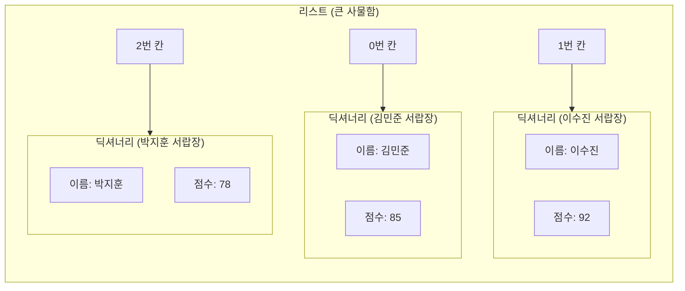

# 마이크로 세션: 051 - 복합자료구조

> **세션 ID**: MS-PY101-051
> **소요 시간**: 25분
> **난이도**: medium
> **청크 타입**: narrative
> **버전**: v2.1 (7섹션 구조)

---

## §1. 개요

> **Day 3 | AM | 세션 051/064**

이 세션은 파이썬 기초 과정의 하이라이트 중 하나입니다. 앞서 배운 리스트와 딕셔너리를 하나로 합쳐서 현실 세계의 복잡한 데이터를 표현하는 방법을 배울 거예요. 리스트가 번호표가 붙은 사물함이고 딕셔너리가 이름표가 붙은 서랍장이라면, 이 둘을 어떻게 결합할 수 있을까요? 바로 이 결합이 우리가 앞으로 만들 '고객 정보 관리 프로그램'의 뼈대가 됩니다. 비전공자 수강생들에게는 2차원적인 데이터 접근이 낯설 수 있으므로, 물리적인 비유를 통해 차근차근 접근하는 것이 매우 중요합니다.

### 🎯 학습 목표

이 세션이 끝나면 수강생은 다음을 할 수 있어요:

*   리스트 안에 딕셔너리가 들어간 복합 자료구조의 형태를 이해하고 설명할 수 있습니다.
*   중첩된 자료구조에서 원하는 특정 데이터를 정확한 순서로 꺼낼 수 있습니다.
*   현실의 다중 고객 데이터를 파이썬 코드로 어떻게 모델링하는지 큰 그림을 그릴 수 있습니다.

### 선행 세션 환기

바로 이전 세션에서 우리는 이름표를 보고 값을 찾는 딕셔너리를 배웠습니다. 그리고 그 전에는 순서대로 줄을 세우는 리스트를 다루었죠. 이제 이 두 가지 도구를 책상 위에 나란히 올려놓고 조립을 시작할 차례입니다.

---

## §2. 핵심 개념 (+ 🗣️ 강사 대본 + Mermaid)

현실의 데이터는 결코 단순하지 않습니다. 전교생 100명의 이름, 수학 점수, 영어 점수를 관리한다고 상상해 보세요. 리스트만 쓰자니 순서만 있어서 누가 몇 점인지 헷갈리고, 딕셔너리만 쓰자니 학생 100명 분의 변수 이름을 일일이 만들어야 합니다. 이 끔찍한 상황을 해결하는 우아한 방법이 바로 중첩(Nesting)입니다.

번호표가 붙은 커다란 사물함(리스트)을 하나 상상해 보세요. 그리고 그 사물함의 0번 칸을 열면, 그 안에 첫 번째 학생의 이름표 서랍장(딕셔너리)이 통째로 들어있는 겁니다. 큰 상자 안에 작은 상자가 들어있는 마트료시카 인형과 똑같은 원리예요.

🗣️ **강사 대본 (Instructor Script)**:

> 여러분, 지금까지 우리는 데이터를 한 줄로 세우는 번호표 사물함과 의미 있는 이름표를 붙이는 서랍장을 각각 따로 배웠습니다. 그런데 현실의 문제는 훨씬 복잡하죠. 배달 앱을 켜면 식당 목록이 쭉 나옵니다. 첫 번째 식당을 누르면 그 식당의 이름, 별점, 리뷰 개수, 대표 메뉴가 나오죠. 두 번째 식당도 마찬가지고요. 이런 데이터는 도대체 어떻게 저장되어 있을까요?
>
> 정답은 아주 간단합니다. 커다란 사물함 하나를 준비하는 거예요. 그리고 그 사물함의 0번 칸에 1번 식당 전용 서랍장을 통째로 집어넣습니다. 1번 칸에는 2번 식당 전용 서랍장을 넣고요.
>
> 상상해 보세요. 우리가 0번 사물함을 철컥 엽니다. 그랬더니 첫 번째 식당의 서랍장이 짠 하고 나타납니다. 그 서랍장에서 별점이라는 칸을 열면 비로소 4.5점이라는 데이터가 나오는 식이죠. 상자 안에 상자가 들어있는 구조, 이것을 프로그래밍에서는 중첩이라고 부릅니다. 이 구조만 이해하면 여러분은 현대 IT 서비스들이 데이터를 주고받는 가장 핵심적인 원리를 깨우치게 되는 겁니다.

### Mermaid 다이어그램



---

## §3. 상세 내용

### Why: 왜 이 구조를 알아야 하는가?

단순히 문법을 하나 더 배우는 것이 아닙니다. 리스트 안의 딕셔너리 구조는 현대 웹 서비스와 데이터베이스에서 데이터를 주고받는 전 세계적인 표준 형태입니다. 흔히 JSON이라고 부르는 데이터 형식이 바로 이 모양을 띠고 있습니다. 우리가 Day 4와 Day 5에서 진행할 고객 정보 관리 프로그램 프로젝트에서도, 고객 한 명의 상세 정보는 딕셔너리로 만들고 전체 고객 목록은 리스트로 묶어서 관리하게 됩니다. AI에게 코드를 짜달라고 할 때도 이 구조를 기본으로 깔고 가면 소통이 훨씬 매끄러워집니다.

### What: 복합 자료구조란 무엇인가?

파이썬 코드로 보면 대괄호 안에 중괄호들이 쉼표로 나열된 모양입니다. `[ { }, { }, { } ]` 이런 형태가 되죠. 제일 겉에는 대괄호가 있고 그 안의 요소들이 중괄호로 이루어져 있습니다. 반대로 딕셔너리 안에 리스트가 들어갈 수도 있어요. 예를 들어 한 학생의 정보 딕셔너리 안에 수강과목이라는 이름표를 붙이고 그 값으로 `["파이썬", "자바", "C언어"]`라는 리스트를 넣는 식입니다. 조립하기 나름이에요.

### How: 데이터를 어떻게 꺼내는가?

이 거대한 구조에서 딱 원하는 데이터만 핀셋으로 집어내듯 꺼내려면 어떻게 해야 할까요? 물리적인 순서 그대로 바깥 상자부터 열고 들어가면 됩니다. 리스트가 바깥에 있고 딕셔너리가 안에 있다면, 먼저 리스트의 번호를 불러서 딕셔너리를 하나 통째로 꺼냅니다. 그런 다음 꺼낸 딕셔너리에서 이름표를 부르는 겁니다.

`students[1]['점수']`라는 코드가 있다고 해보죠. 컴퓨터는 이를 두 단계로 읽습니다. 첫째, `students` 사물함에서 1번 칸(두 번째 학생)을 엽니다. 둘째, 그 칸에서 나온 서랍장 중 점수라는 이름표가 붙은 칸을 엽니다. 순서가 바뀌면 절대 안 됩니다. 바깥 사물함을 열어야 서랍이 나오니까요.

---

## §4. 실습 가이드 (+ 🎙️ 실습 대본)

### 실습 목표

이 강력한 구조를 수강생들이 직접 만져보게 할 차례입니다. 코드를 밑바닥부터 다 치게 하지 말고, AI의 힘을 빌려 뼈대를 만들고 데이터를 조작하는 데 집중합니다.

🎙️ **실습 가이드 대본 (Lab Guide)**:

> 자, 이제 화면을 열고 AI에게 부탁해 보겠습니다. 프롬프트 창에 이렇게 입력해 보세요. "학생 3명의 정보(이름, 점수)를 담은 리스트 안의 딕셔너리 구조를 파이썬 코드로 만들어줘. 변수 이름은 students로 해줘."
>
> 코드가 짠 하고 나타났죠? 대괄호 안에 중괄호 세 개가 들어있는 모습을 눈으로 확인해 보세요. 자, 이제 이 코드 아래에 출력문을 추가해 볼 겁니다.
>
> 우리가 두 번째 학생의 점수만 딱 집어서 보고 싶어요. 어떻게 해야 할까요? 사물함을 먼저 열어야 합니다. 파이썬은 0부터 숫자를 세니까 두 번째 학생이면 `students[1]`이 되겠죠. 이어서 그 안에서 점수 칸을 엽니다. 바로 뒤에 `['점수']`를 붙이는 거예요. 전체 코드는 `print(students[1]['점수'])`가 됩니다. 직접 타이핑하고 실행해 보세요.
>
> 점수가 잘 나오셨나요? 이번엔 여러분 스스로 해볼 차례입니다. 첫 번째 학생의 이름을 출력하려면 코드를 어떻게 수정해야 할까요? 바깥 괄호의 숫자와 안쪽 괄호의 글자를 적절히 바꿔서 실행해 보세요.

### 단계별 지시

| 단계 | 소요 시간 | 강사 지시사항 | 학습자 액션 | 예상 결과 |
|------|----------|--------------|------------|----------|
| 1 | 3분 | AI를 활용해 복합 자료구조 코드 생성 지시 | 프롬프트 입력 및 코드 복사 | `[{}, {}, {}]` 형태의 기본 코드 확보 |
| 2 | 3분 | 두 번째 학생의 점수를 출력하는 코드 작성 시연 | 강사 화면 시청 및 코드 추가 실행 | 터미널에 두 번째 학생 점수 출력 |
| 3 | 4분 | 첫 번째 학생의 이름 출력 미션 부여 | 코드 스스로 수정 및 실행 | 터미널에 첫 번째 학생 이름 출력 |
| 4 | 5분 | 흔한 오류 사례 설명 및 조치 | 에러 메시지 확인 및 질문 | 인덱스와 키의 접근 순서 명확히 이해 |

### 트러블슈팅 FAQ

| Q | A |
|---|---|
| `TypeError: list indices must be integers or slices, not str` 에러가 나요! | 수강생이 `students['점수'][1]`처럼 순서를 반대로 적었을 확률이 99%입니다. 바깥 상자(리스트)를 열기 위해서는 반드시 숫자 번호표를 먼저 써야 함을 다시 한번 짚어주세요. |
| 리스트 안에 딕셔너리를 몇 개까지 넣을 수 있나요? | 컴퓨터 메모리가 허용하는 한 무한대라고 답변해 주시면 됩니다. 실무에서는 수백만 개가 들어가기도 한다는 점을 덧붙여 주시면 흥미를 유발할 수 있습니다. |

---


### 🎓 강사 노트 (Instructor Support)

- ⏱️ **타이밍**: 12:55 (20분, code)
- 🎯 **핵심 활동**: 리스트 안의 딕셔너리
- ⚠️ **강사 주의사항**: ⚠️ 난이도 급상승. 천천히 진행

## §5. 코드 및 명령어 모음

이 세션에서 활용하는 핵심 코드 조각들입니다. 수강생들이 복사해서 쓸 수 있도록 제공합니다.

```python
# 학생 3명의 정보가 담긴 복합 자료구조 (List of Dicts)
students = [
    {"이름": "김민준", "점수": 85},  # 0번 사물함
    {"이름": "이수진", "점수": 92},  # 1번 사물함
    {"이름": "박지훈", "점수": 78}   # 2번 사물함
]

# 데이터 꺼내기: 사물함(리스트) 먼저, 서랍(딕셔너리)은 나중에!
print(students[1]['점수'])  # 92 출력 (이수진의 점수)
print(students[0]['이름'])  # 김민준 출력

# 새로운 학생 데이터 추가하기 (리스트의 append 메서드 활용)
students.append({"이름": "최윤아", "점수": 88})
print(students)
```

> 🤖 **AI 프롬프트 예시**
> "학생 3명의 정보(이름, 점수)를 담은 리스트 안의 딕셔너리 구조를 파이썬 코드로 만들어줘. 변수 이름은 students로 해줘."

---

## §6. 요약

### 핵심 학습 포인트

이번 세션에서 가장 중요한 것은 순서입니다. 데이터를 담을 때는 딕셔너리들을 리스트 안에 차곡차곡 쌓아 올리고, 꺼낼 때는 바깥 상자인 리스트부터 열고 안쪽 상자인 딕셔너리를 엽니다. 이 원칙만 기억하면 아무리 데이터가 복잡하게 얽혀 있어도 원하는 값을 정확하게 찾아낼 수 있습니다. 이 복합 구조가 회원 정보, 상품 목록, 게시글 목록 등을 관리하는 가장 완벽하고 표준적인 방법이라는 점도 꼭 기억해야 합니다.

### 다음 세션 예고

우리는 지금까지 데이터를 저장하고 예쁘게 정리하는 방법들을 모두 배웠습니다. 이름표도 붙여보고, 서랍장에도 넣어봤죠. 하지만 아직 이 데이터들은 죽어있습니다. 스스로 판단을 내리지 못하니까요. 이제 이 데이터들에 생명력을 불어넣을 차례입니다. "점수가 80점 이상이면 합격 도장을 찍어라"처럼 컴퓨터가 스스로 상황을 판단하게 만드는 마법, 제어문을 다음 세션에서 만나보겠습니다.

### 브릿지 노트

> "여러분, 정말 훌륭합니다. 방금 파이썬에서 가장 헷갈리기 쉽다는 2차원 데이터 접근법을 마스터하셨어요. 데이터베이스 설계의 90%를 끝낸 거나 다름없습니다. 데이터가 10만 개로 늘어나도 이 구조에서 벗어나지 않으니까요. 자, 데이터를 정리하는 법을 배웠으니 이제 이 데이터들을 살아서 움직이게 만들어 볼까요?"

---

## §7. 참고 자료

### 3-Source 출처

*   **Source A (로컬 참고자료)**: 「8 코딩.pdf」 §8.3 리스트 안의 딕셔너리 개념과 기본 문법, 데이터 접근 순서에 대한 핵심 논리를 참조했습니다.
*   **Source B (NotebookLM)**: NotebookLM day3 분석 중첩(Nesting) 구조를 마트료시카 인형에 빗대어 설명하는 교육적 비유를 반영했습니다.
*   **Source C (Deep Research)**: Deep Research day3 결과 복합 자료구조가 현대 웹 서비스의 데이터 표준 형식(JSON)과 완벽하게 일치한다는 실무적 맥락을 통합했습니다.

### 강사 노트

> 💡 **강사 노트**: 리스트 안의 딕셔너리는 비전공자가 처음 마주하는 차원의 확장입니다. 단순히 대괄호와 중괄호를 섞어 쓰는 문법으로 가르치면 100% 길을 잃습니다. 반드시 큰 상자 안의 작은 상자라는 물리적인 이미지를 머릿속에 심어주세요. 칠판에 큰 네모를 그리고 그 안에 작은 네모들을 그리는 시각적 설명이 아주 효과적입니다.

---

*작성 일시: 2026-02-25*
*작성 에이전트: Antigravity*
*교안 구조: 7섹션 (v2.1)*