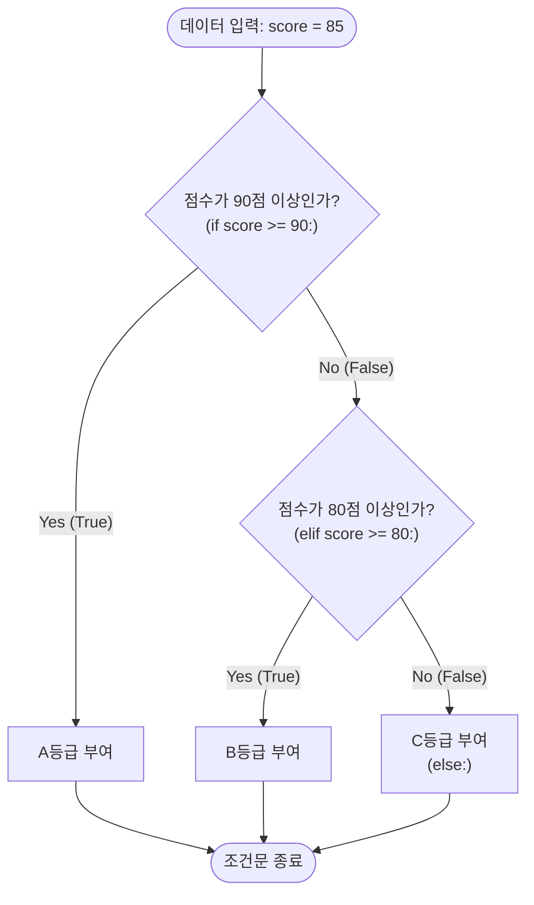

# 마이크로 세션: 052 — 조건문if_elif_else

> **세션 ID**: MS-PY101-052
> **소요 시간**: 25분
> **난이도**: low
> **청크 타입**: narrative
> **버전**: v2.1 (7섹션 구조)

---

## §1. 개요

이 세션은 제어 흐름을 다루는 첫 번째 단계로, 프로그램에 판단력을 부여하는 방법을 배웁니다. 방금 전 세션에서 우리는 복잡한 사물함에서 학생의 수학 점수를 꺼내는 데 성공했어요. 그런데 점수 숫자만 덜렁 화면에 띄워놓으면 이 프로그램이 과연 쓸모가 있을까요? "80점 이상이면 합격입니다, 아니면 불합격입니다"라고 명확한 판단을 내려주고 다음 행동을 지시해야 비로소 진짜 프로그램이라고 부를 수 있습니다. 이제부터 단순한 데이터에 생명력을 불어넣고 갈림길을 만들어주는 제어문, 그중에서도 가장 기본인 조건문을 만나보겠습니다.

### 🎯 학습 목표

이 세션이 끝나면 수강생은 다음을 할 수 있어요:
- 조건문의 핵심인 if, elif, else의 역할을 교통 신호등 비유로 설명할 수 있습니다.
- 파이썬에서 들여쓰기(Indentation)가 왜 중요한지 이해하고 에러를 직접 해결할 수 있습니다.
- 비교 연산자와 중첩 조건을 활용하여 데이터에 따른 분기 로직을 설계할 수 있습니다.

### 선행 세션 환기

우리는 직전 세션에서 리스트 안에 딕셔너리를 넣는 복합 자료구조를 다뤘습니다. 고객 목록에서 특정 고객의 정보를 꺼내는 방법은 알았지만, "이 고객이 VIP인지 아닌지" 판단하는 방법은 아직 배우지 않았어요. 이번 세션에서는 바로 그 판단 기준을 세워주는 문법을 배웁니다.

---

## §2. 핵심 개념 (+ 🗣️ 강사 대본 + Mermaid)

### 프로그램의 교통 신호등, 제어문

상황을 보고 판단을 내려서 프로그램이 가야 할 길을 정해주는 문법을 우리는 '제어문'이라고 부릅니다. 그중에서도 조건문인 `if`문은 현실 세계의 교통 신호등과 완벽하게 똑같은 역할을 해요. 신호등 앞에 차가 서 있다고 상상해 볼까요? 초록불(True)이 들어오면 직진을 하고, 빨간불(False)이 들어오면 그 자리에 멈춰 서야 합니다. 이렇게 조건에 따라 행동 지침이 명확하게 나뉘는 것처럼, 프로그래밍에서도 데이터가 우리가 정한 조건에 맞는지 확인하고 맞을 때만 특정 코드를 실행하게 만드는 것이 조건문입니다 [Source B: NotebookLM day3].

🗣️ **강사 대본 (Instructor Script)**:

> 여러분, 방금 전까지 우리는 상자(변수)에 데이터를 담고, 서랍장(리스트)에 정리하는 방법을 배웠습니다. 하지만 이건 아직 움직이지 않는 정적인 상태예요. 진정한 프로그램이 되려면 스스로 생각하고 판단을 내릴 줄 알아야 합니다.
>
> 파이썬의 조건문은 '교통 신호등'과 같아요. 만약 여러분이 내비게이션을 켜고 가다가 갈림길을 만났다고 해보죠. "만약(if) 왼쪽 길이 막히지 않았다면(True) 왼쪽으로 가고, 그렇지 않으면(else) 오른쪽으로 가라." 이렇게 조건에 맞춰 길을 선택하게 해주는 게 바로 제어문입니다 [Source C: Deep Research day3]. 
> 
> 파이썬은 이런 조건문을 영어 문장 읽듯이 아주 직관적으로 만들어 두었어요. 그래서 문법을 억지로 외울 필요 없이, 내가 컴퓨터에게 내리고 싶은 지시를 자연스럽게 표현하기만 하면 됩니다. 만약 점수가 80점 이상이라면 어떻게 할지, 그 조건이 맞지 않다면 다음으로 어떤 대안을 확인할지 순서대로 적어주기만 하면 파이썬이 알아서 길을 찾아갈 거예요.

### Mermaid 다이어그램: 조건문의 갈림길



이 다이어그램은 조건문이 데이터를 어떻게 걸러내는지 보여줍니다. 위에서부터 순서대로 조건을 확인하며, 한 번이라도 참(True)인 조건을 만나면 해당 행동을 실행한 뒤 전체 조건문을 빠져나옵니다.

---

## §3. 상세 내용

### Why — 왜 조건문이 필요한가?

단순한 계산기 프로그램이 아니라면, 모든 소프트웨어는 사용자의 입력이나 상황에 따라 다르게 반응해야 합니다. 로그인 비밀번호가 맞았을 때와 틀렸을 때 보여주는 화면이 달라야 하고, 장바구니에 담긴 금액에 따라 배송비 무료 여부가 결정되어야 합니다. 프로그램에 '판단력'을 부여하여 한 가지 길이 아닌 여러 갈래의 길을 만들어주는 것이 조건문이 존재하는 이유입니다.

### What — 조건문을 구성하는 세 가지 키워드

조건문은 크게 세 가지 키워드로 뼈대를 잡습니다.
첫째, `if`는 "만약 ~라면"이라는 뜻으로, 가장 먼저 확인하는 첫 번째 조건입니다.
둘째, `elif`는 "그렇지 않고 만약 ~라면"이라는 뜻으로, 첫 번째 조건이 틀렸을 때 이어서 확인하는 대안 조건입니다. 신호등의 색깔을 무한정 늘려주듯이 여러 번 사용할 수 있습니다.
셋째, `else`는 "이도 저도 아니라면"이라는 뜻으로, 앞선 모든 조건이 거짓일 때 최후의 보루로 실행되는 플랜 B입니다 [Source A: 8 코딩.pdf].

### How — 파이썬에서 조건문을 작성하는 엄격한 규칙

파이썬의 조건문 작성은 아주 직관적이지만, 절대로 타협하지 않는 엄격한 규칙이 하나 있습니다. 바로 '들여쓰기(Indentation)'입니다.

`if 점수 >= 80:` 처럼 조건문 끝에 콜론(`:`)을 찍어 "이제 조건 다 말했어!"라고 파이썬에게 알려준 뒤, 그 조건이 맞을 때 실행할 코드는 반드시 다음 줄에서 키보드 Tab 키를 한 번 눌러 안으로 쏙 들어가게 적어주어야 합니다. 다른 프로그래밍 언어들은 괄호를 써서 영역을 묶어주지만, 파이썬은 오직 이 여백과 들여쓰기만으로 코드가 어디에 속해 있는지를 판단합니다. 들여쓰기를 하지 않으면 파이썬은 이 코드가 조건문과 상관없다고 착각하여 즉시 에러를 발생시킵니다.

추가로, 파이썬만의 아주 편리하고 직관적인 문법들도 있습니다. 수학 시간처럼 `0 <= score <= 100`으로 조건을 한 번에 연결하는 '체이닝 비교'가 가능하고, 조건문을 한 줄로 압축해버리는 '삼항 연산자'를 사용하여 코드를 더욱 우아하게 만들 수 있습니다. 때로는 조건 안에 또 다른 조건을 넣는 '중첩 조건'을 사용해 더 복잡하고 세밀한 판단을 내리기도 합니다.

---

## §4. 실습 가이드 (+ 🎙️ 실습 대본)

### 실습 목표

이 실습에서는 AI를 활용하여 직접 조건문 코드를 생성해보고, 값을 변경해가며 프로그램이 갈림길을 제대로 찾아가는지 확인합니다. 또한, 파이썬의 가장 중요한 규칙인 들여쓰기를 고의로 망가뜨려보고 복구하는 과정을 통해 문법적 감각을 체득합니다.

🎙️ **실습 가이드 대본 (Lab Guide)**:

> 자, 이제 여러분만의 교통 신호등을 직접 설치해 볼 시간입니다! 먼저 우리의 똑똑한 조수, AI에게 이렇게 프롬프트를 입력해 보세요. "점수(score) 변수에 85를 넣고, 90점 이상이면 A, 80점 이상이면 B, 70점 이상이면 C, 그 외엔 F를 출력하는 파이썬 코드를 만들어줘."
>
> 뚝딱하고 `if`, `elif`, `else`가 나란히 쓰인 코드가 나왔을 겁니다. 당장 실행 버튼을 누르기 전에 눈으로 먼저 결과를 예측해 보세요. 점수가 85점이니 어떤 학점이 화면에 뜰까요? 눈으로 확인이 끝났다면, 코드 상단의 `score = 85` 부분을 60점, 95점 등으로 요리조리 바꿔가며 여러 번 실행해 보세요. 우리가 세워둔 신호등이 점수에 맞춰 척척 길을 안내하는 게 보이시나요?
>
> 여기까지 잘 따라오셨다면, 이제 파이썬의 엄격함을 몸소 체감해 볼 시간입니다. 일부러 에러를 내볼게요! 코드에서 `print` 문들 앞에 있는 빈칸, 즉 들여쓰기를 백스페이스 키로 싹 다 지워서 왼쪽 끝으로 바짝 붙여보세요. 그리고 다시 실행 버튼을 눌러봅시다. 
> 
> 빨간색으로 `IndentationError`(들여쓰기 에러)가 아주 크게 났죠? 파이썬에서 들여쓰기는 코드를 예쁘게 보이려고 하는 단순한 디자인이 아니라, 프로그램이 굴러가게 만드는 생명줄이라는 점을 이 에러 메시지를 통해 꼭 몸으로 기억해 두세요.

### 단계별 지시

1. **AI 프롬프트 작성**: 점수에 따른 학점 계산 로직을 AI에게 요청하여 코드를 생성받습니다.
2. **변수 조작 검증**: `score` 변수의 값을 여러 가지 분기점에 맞게(예: 95, 82, 75, 50) 변경하며 출력을 확인합니다.
3. **들여쓰기 파괴 및 복구**: 의도적으로 탭(Tab) 공간을 지워 `IndentationError`를 발생시키고, 다시 탭을 눌러 코드를 정상화합니다.
4. **체이닝 비교 변환 (선택 사항)**: `if score >= 80 and score <= 100:`으로 작성된 코드가 있다면, 파이썬의 특장점인 `80 <= score <= 100` 형태로 변경해 봅니다.

### 트러블슈팅 FAQ

- **Q: 코드를 실행했는데 출력이 아무것도 안 나와요.**
  - A: 조건문이 모든 경우의 수를 덮고 있는지 확인해 보세요. `else:` 블록을 작성해 두면, 앞선 조건들을 모두 피격당한 예상 밖의 값들이 들어왔을 때도 프로그램이 안전하게 응답할 수 있습니다.
- **Q: 들여쓰기 에러가 났는데, 스페이스바로 띄운 것과 탭으로 띄운 것이 섞여 있대요.**
  - A: 파이썬은 탭(Tab)과 스페이스바(Space) 4칸을 섞어 쓰는 것을 극도로 싫어합니다. 편집기에서 전체 코드를 드래그한 뒤 `Shift + Tab`으로 들여쓰기를 모두 없애고 다시 `Tab` 키로 정렬해 보세요.

---


### 🎓 강사 노트 (Instructor Support)

- ⏱️ **타이밍**: 13:15 (25분, narrative)
- 🎯 **핵심 활동**: "갈림길" 비유
- ⚠️ **강사 주의사항**: 들여쓰기(indent) 개념 처음 등장

## §5. 코드 및 명령어 모음

실습과 복습에 활용할 수 있는 핵심 조건문 패턴들을 모아두었습니다. 눈으로 읽으며 어떻게 동작할지 해석해 보세요.

**1. 기본 조건문과 들여쓰기**
```python
score = 85

# 조건문 끝에는 반드시 콜론(:)을 찍습니다.
if score >= 90:
    print("A등급입니다.") # 들여쓰기(Indentation) 필수!
elif score >= 80:
    print("B등급입니다.")
else:
    print("C등급입니다.")
```

**2. 파이썬의 직관적인 체이닝 비교**
```python
score = 85

# 다른 언어라면 if score >= 0 and score <= 100: 이라고 써야 하지만
# 파이썬은 수학 기호처럼 직관적으로 연결할 수 있습니다.
if 0 <= score <= 100:
    print("정상적인 점수 데이터입니다.")
else:
    print("점수 입력이 잘못되었습니다.")
```

**3. 삼항 연산자 (한 줄 조건문)**
```python
score = 85

# 합격/불합격처럼 결과가 두 가지뿐일 때는 한 줄로 우아하게 작성할 수 있습니다.
status = "합격" if score >= 80 else "불합격"
print(f"현재 상태는 {status}입니다.")
```

**4. 중첩 조건문 (조건 속의 조건)**
```python
is_member = True
purchase_amount = 50000

if is_member:
    if purchase_amount >= 30000:
        print("무료 배송 및 10% 할인 적용")
    else:
        print("10% 할인 적용 (배송비 별도)")
else:
    print("비회원은 혜택이 없습니다.")
```

---

## §6. 요약 및 브릿지

### 핵심 학습 포인트

이번 세션의 핵심은 세 가지로 요약할 수 있습니다. 첫째, 조건문(`if`, `elif`, `else`)은 프로그램에게 여러 갈림길 중 하나를 선택할 수 있는 판단력을 부여하는 역할을 합니다. 둘째, 파이썬에서 조건에 속한 행동을 지정할 때는 괄호가 아닌 들여쓰기(Indentation)를 사용하며, 이는 절대로 어겨서는 안 되는 엄격한 문법입니다. 셋째, 파이썬은 체이닝 비교나 삼항 연산자처럼 사람이 읽기 쉽고 직관적인 특유의 문법(Pythonic)을 제공하여 복잡한 조건도 명확하게 표현할 수 있게 도와줍니다.

### 다음 세션 예고: 반복문과 제어 흐름

우리는 방금 교통 신호등을 세워서 한 명의 학생 점수를 훌륭하게 판별해 냈습니다. 그런데 만약 전교생 100명의 학점을 한 번에 계산해야 한다면 어떻게 될까요? 방금 짠 코드를 100번 복사해서 붙여넣고 점수 숫자만 100번 고칠 건가요? 절대 안 될 일이죠. 컴퓨터가 인간보다 월등하게 잘하는 일이 딱 하나 있습니다. 바로 지치지 않고 똑같은 일을 무한히 반복하는 것입니다.

### 브릿지 노트

> "조건문으로 길을 나누는 법을 배웠으니, 이제 그 길 위로 수백, 수천 개의 데이터를 한꺼번에 통과시켜 볼 차례입니다. 다음 세션에서는 신호등 코드를 100번 자동으로 돌려주는 마법의 주문, '반복문'에 대해 알아보겠습니다. 데이터를 넣고 돌리기만 하면 프로그램이 알아서 척척 처리해 주는 자동화의 진수를 곧 맛보게 되실 겁니다!"

---

## §7. 참고 자료

### 3-Source 출처

- **Source A (로컬 참고자료)**: 「8 코딩.pdf」 §8.4 — 조건문에 따른 판단 논리, if/elif/else의 기초 문법 구조, 들여쓰기의 문법적 역할 발췌.
- **Source B (NotebookLM)**: NotebookLM 분석 리포트 day3 — 제어문을 '교통 신호등'에 빗대어 설명하는 비유 풀이의 근거 및 학습자 인지 부하 감소를 위한 멘탈 모델 제공.
- **Source C (Deep Research)**: Deep Research 보고서 day3 — 초보자들이 자주 범하는 들여쓰기 에러 실습의 중요성과 직관적인 Pythonic 체이닝 비교 문법 실무 동향 반영.

### 강사 노트

> 💡 **강사 노트**: 이 세션은 비전공자 수강생들이 처음으로 프로그램다운 로직을 접하는 순간입니다. 단순한 문법 암기가 되지 않도록 '판단과 갈림길'이라는 개념적 접근을 유지해 주세요. 팩트 패킷(Day 3)에서 언급되었듯, `0 <= score <= 100` 같은 체이닝 비교와 삼항 연산자를 활용한 파이썬 특유의 간결함(Pythonic)을 강조하면 수강생의 흥미를 높일 수 있습니다. 특히 들여쓰기 에러(`IndentationError`)는 앞으로 가장 많이 마주치게 될 에러 중 하나이므로, 실습 시간에 반드시 고의로 에러를 발생시키고 직접 고쳐보게 하는 과정을 거쳐야 합니다.

---

## ✅ 세션 완료 체크리스트 (강사용)

- [ ] §1~§7 모든 섹션이 충실하게 작성되었는가?
- [ ] 신호등과 갈림길 비유가 서술형으로 자연스럽게 풀어져 있는가?
- [ ] 파이썬의 들여쓰기(Indentation) 규칙이 강조되었는가?
- [ ] 실습 가이드에 의도적 에러 발생과 해결 과정이 포함되었는가?
- [ ] 3-Source 팩트 패킷의 내용이 반영되었는가?
