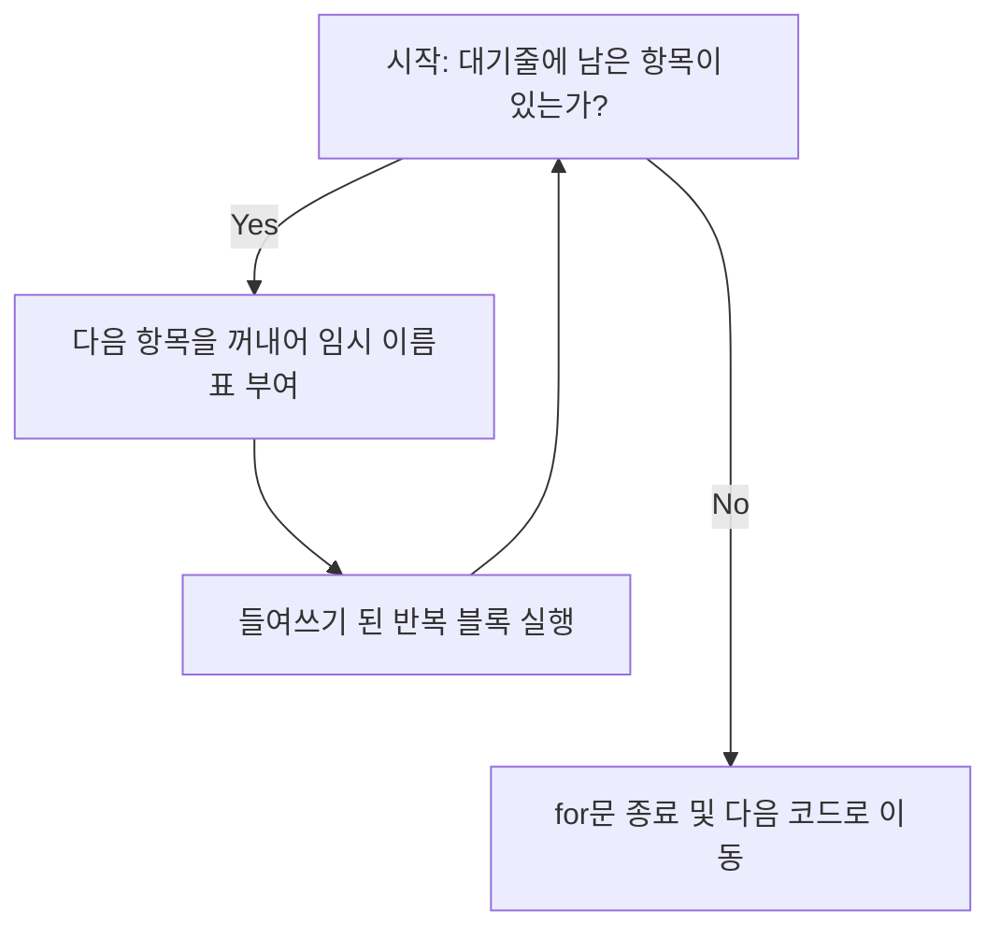

# 마이크로 세션: 053 — 반복문for와range

> **세션 ID**: MS-PY101-053  
> **소요 시간**: 25분  
> **난이도**: low  
> **청크 타입**: narrative  
> **버전**: v2.1 (7섹션 구조)

---

## §1. 개요

> **Day 3 | AM | 세션 053**

이 세션은 프로그래밍의 강력한 무기 중 하나인 '반복 제어'의 첫 단계를 다루는 시간이에요. 리스트나 딕셔너리 같은 자료구조에 담긴 수많은 데이터를 하나씩 꺼내어 처리하는 순회(Iteration)의 원리를 배웁니다. 데이터를 하나하나 수작업으로 처리하던 막노동에서 벗어나, 컴퓨터의 가장 큰 장점인 '지치지 않는 성실함'을 십분 활용하는 방법을 터득하게 될 거예요.

### 🎯 학습 목표

이 세션이 끝나면 수강생은 다음을 할 수 있어요:

- 리스트 안의 데이터를 순회하며 동일한 작업을 반복하는 `for`문을 작성할 수 있습니다
- `range()` 함수를 활용하여 원하는 횟수만큼 코드를 반복 실행할 수 있습니다
- 인덱스가 필요할 때 `enumerate()` 함수를 사용하는 실무적인 패턴을 적용할 수 있습니다
- 중첩된 `for`문을 읽고 그 실행 흐름을 머릿속으로 그릴 수 있습니다

### 선행 세션 환기

이전에 우리는 서랍장(리스트)에 데이터를 차곡차곡 담는 방법과 특정 조건일 때만 코드가 실행되도록 흐름을 가르는 조건문(if)을 배웠습니다. 이번에는 그 서랍장에 담긴 수십, 수백 개의 데이터를 한 번에 처리하는 마법을 배울 차례예요. 서랍장을 여는 것을 넘어서, 서랍장 안의 모든 물건에 빠짐없이 이름표를 붙여주는 자동화 기계를 만들어 볼 겁니다.

---

## §2. 핵심 개념 (+ 🗣️ 강사 대본 + Mermaid)

### 배급소의 번호표 직원과 컨베이어 벨트 비유

코딩에서 반복문은 귀찮은 수작업을 대신해 주는 기계 장치와 같아요. 특히 `for`문은 '배급소의 번호표 직원' 또는 '컨베이어 벨트'에 비유할 수 있습니다 [Source B: NotebookLM day3]. 컨베이어 벨트에 물건들이 일렬로 지나가면, 로봇 팔이 물건을 하나씩 집어서 똑같은 도장을 쾅쾅 찍어주는 모습을 상상해 보세요. 줄을 서 있는 물건이 10개든 10만 개든, 기계는 불평 한마디 없이 똑같은 작업을 끝까지 성실하게 반복합니다. 이것이 바로 순회(Iteration)의 핵심 개념이에요 [Source C: Deep Research day3].

🗣️ **강사 대본 (Instructor Script)**:

> 여러분, 상상해 봅시다. 사물함에 전교생 100명의 점수가 예쁘게 들어있어요. 그런데 오늘 교장 선생님이 기분이 아주 좋으셔서 학생 전원에게 5점씩 보너스 점수를 주라고 지시하셨네요. 자, 여러분이라면 어떻게 하시겠습니까?
> 
> 첫 번째 학생 점수 꺼내서 5점 더하고, 두 번째 학생 점수 꺼내서 5점 더하고... 이걸 100줄 타이핑하실 건가요? 만약 학생이 100명이 아니라 10만 명이라면 어떻게 할까요? 생각만 해도 끔찍하죠. 프로그래머들은 귀찮은 것을 세상에서 제일 싫어하는 사람들입니다. 절대 그런 무식한 방법을 쓰지 않아요 [Source A: 8 코딩.pdf §8.4].
> 
> 수십, 수만 번의 똑같은 작업을 눈 깜짝할 새 처리해 주는 마법, 그게 바로 '반복문'입니다. 파이썬에서 가장 많이 사랑받는 `for`문은 아주 성실한 '배급소 직원'과 똑같아요. 대기줄, 즉 리스트에 사람들이 쫙 서 있습니다. 직원은 명단을 보며 첫 번째 사람을 불러냅니다. 똑같은 구호물자를 나눠주고 다음 사람을 부르죠. 또 나눠주고 다음 사람을 부릅니다. 이 직원은 명단에 있는 마지막 사람이 끝날 때까지 묵묵히 똑같은 일을 반복합니다. 
> 
> AI에게 "고객 명단 엑셀 줄 테니까, 위에서부터 아래까지 똑같이 메일 하나씩 보내줘"라고 명령할 때, AI의 머릿속에서 돌아가는 핵심 원리가 바로 이 구조입니다. 데이터를 모아두는 리스트, 그리고 그걸 하나씩 꺼내서 돌리는 `for`문. 이 둘은 프로그래밍 역사상 가장 강력한 영혼의 콤비예요. AI가 짜주는 코드의 80% 이상은 이 `for`문이 들어간다고 해도 과언이 아닙니다.

### Mermaid 다이어그램



이 다이어그램은 `for` 루프가 실행되는 흐름을 보여줍니다. 대기줄(리스트)에 항목이 남아있는 한 계속해서 물건을 꺼내고 작업을 수행하며, 모든 항목을 다 꺼내고 나면 자연스럽게 반복을 종료하고 다음 단계로 넘어가는 안전하고 확실한 구조를 가지고 있어요.

---

## §3. 상세 내용

### Why — 왜 for문을 써야 하는가?

반복문 없이 프로그래밍을 한다는 것은 계산기 없이 손으로 수학 문제를 푸는 것과 같아요. 우리가 컴퓨터를 사용하는 가장 큰 이유는 방대한 데이터를 빠르고 정확하게 처리하기 위함입니다. `for`문은 코드의 중복을 없애주고, 데이터의 개수가 변하더라도 코드를 수정할 필요가 없게 만들어 줍니다. 예를 들어 데이터가 5개에서 5만 개로 늘어나더라도, `for`문으로 짠 코드는 단 한 줄도 고칠 필요가 없어요. 이것이 바로 자동화의 힘입니다.

### What — 무엇을 배우는가?

이 섹션에서는 `for`문의 네 가지 핵심 형태를 배웁니다. 
첫째, 가장 기본적인 **for-in 구조**로 리스트나 딕셔너리 같은 데이터를 하나씩 꺼내어 처리하는 방법입니다. 
둘째, 데이터는 없지만 단순히 특정 횟수만큼 반복하고 싶을 때 사용하는 **range() 함수**입니다. 
셋째, 데이터뿐만 아니라 그 데이터가 '몇 번째'인지 순서 정보도 함께 필요할 때 쓰는 **enumerate() 함수**입니다. 
마지막으로, 서랍장 안의 서랍장처럼 데이터가 겹겹이 쌓여 있을 때 사용하는 **중첩 for문**의 개념을 다룹니다.

### How — 어떻게 코드를 작성하는가?

**1. 리스트를 순회하는 for-in**

파이썬의 `for`문은 영어 문장과 너무 똑같아서 읽기만 해도 뜻이 통합니다. 
`for 학생 in 학생명단:` 이렇게 쓰죠. 해석해 보면 "학생명단(리스트) 안에(in) 있는 데이터들을 하나씩 꺼내서, '학생'이라는 임시 이름표를 붙여라. 그리고 꺼낼 때마다 아래의 코드를 반복 실행해라!"라는 뜻입니다. 이때 반복해서 실행할 코드는 조건문처럼 반드시 안으로 들여쓰기(Tab)를 해야 한다는 점을 잊지 마세요 [Source A: 8 코딩.pdf].

**2. 횟수를 지정하는 range()**

만약 꺼낼 데이터 명단(리스트)이 따로 없고, 그저 "박수를 딱 100번만 쳐줘!"라고 횟수만 정하고 싶을 땐 어떻게 할까요? 그때 쓰는 짝꿍이 바로 `range()` 함수입니다. `range(100)`이라고 쓰면 파이썬이 알아서 0번부터 99번까지 번호표 100개가 들어있는 가상의 대기줄을 순식간에 만들어 줍니다.

**3. 인덱스와 값을 동시에 꺼내는 enumerate()**

리스트의 데이터만 필요한 게 아니라, 그 데이터가 '몇 번째' 데이터인지 번호표도 필요할 때가 많아요. 이럴 때 복잡하게 숫자를 세는 변수를 따로 만들지 마세요. `enumerate()`라는 마법의 함수를 쓰면 됩니다 [Source B: NotebookLM day3]. 이 함수는 물건을 꺼낼 때 그 물건의 순서표까지 두 개를 한 번에 던져줍니다.

**4. 중첩 for문 (for문 안의 for문)**

컨베이어 벨트 위에 상자가 지나가는데, 그 상자를 열어보니 안에 또 작은 물건들이 여러 개 들어있다고 생각해 보세요. 이때는 상자를 꺼내는 큰 `for`문 안에, 상자 속 내용물을 꺼내는 작은 `for`문을 넣어야 합니다. 시계의 분침이 한 바퀴를 돌아야 시침이 한 칸 움직이는 것과 같은 원리예요.

---

## §4. 실습 가이드 (+ 🎙️ 실습 대본)

### 실습 목표

수강생들은 AI 조수(Antigravity)를 활용하여 과일 리스트를 순회하는 기본적인 `for`문을 작성해 보고, `range()` 함수를 사용할 때 발생하는 '끝 번호 미만'의 규칙을 직접 눈으로 확인합니다. 마지막으로 `enumerate()`를 적용하여 실무에 가까운 코드 패턴을 경험합니다.

🎙️ **실습 가이드 대본 (Lab Guide)**:

> 자, 백문이 불여일견이죠. 우리의 성실한 배급소 직원을 직접 고용해 봅시다. AI 창을 켜고 이렇게 프롬프트를 입력해 보세요.
> 
> "파이썬으로 과일 이름 5개가 들어있는 리스트를 만들고, for문으로 하나씩 꺼내서 '맛있는 ~를 배급합니다!'라고 출력하는 코드 만들어줘."
> 
> 코드가 나왔죠? 실행 버튼을 누르기 전에 꼭 머릿속으로 예측을 먼저 해봅시다. 코드에 `print` 함수가 한 번만 적혀 있는데, 화면에 결과가 한 줄로 나올까요? 아니면 5줄로 나올까요? 예측을 마쳤으면 실행해서 5줄이 쫙 출력되는 쾌감을 느껴보세요. 축하합니다! 여러분은 방금 복사 붙여넣기의 노가다에서 완벽하게 해방되었습니다.
> 
> 이번엔 `range` 실습입니다. "range() 함수를 써서 1부터 10까지 숫자를 출력하는 코드를 만들어줘"라고 요청해 보세요.
> 
> 나온 코드를 아주 자세히 보세요. 분명 우리는 1부터 10까지라고 했는데 `range(1, 11)`이라고 적혀 있을 겁니다. 어라? AI가 실수한 걸까요? 아닙니다! 아까 리스트 슬라이싱에서 배웠던 치명적인 규칙 기억나시나요? "끝 번호는 포함되지 않는다, 즉 미만이다." 파이썬의 이 철저한 규칙성 때문에 10까지 돌리려면 반드시 11을 적어주어야 합니다. 이것은 파이썬의 고집스러운 철학이니 꼭 기억해 두세요.
> 
> 마지막으로, 리스트의 데이터만 필요한 게 아니라 '몇 번째 데이터인지'도 필요할 때가 많아요. AI에게 "과일 리스트를 다시 출력하되, 앞에 '1번 과일: 사과'처럼 번호를 붙여줘. enumerate 함수를 써서 코드를 짜줘"라고 해봅시다. 복잡하게 카운트를 올리지 않아도 파이썬이 알아서 번호를 매겨주는 편리함을 확인해 보세요 [Source B: NotebookLM day3].

### 단계별 지시

| 단계 | 소요 시간 | 강사 지시사항 | 학습자 액션 | 예상 결과 |
|------|----------|--------------|------------|----------|
| 1 | 3분 | 과일 리스트 for문 프롬프트 작성 지시 | AI에게 프롬프트 입력 및 코드 예측 | 5개의 과일 이름이 반복 출력됨 |
| 2 | 3분 | range() 함수 프롬프트 작성 지시 | 1부터 10까지 출력하는 코드 요청 | `range(1, 11)` 코드가 생성됨 |
| 3 | 4분 | '끝 번호 미만' 규칙 리마인드 및 설명 | 실행 결과 확인 및 강사 설명 경청 | 슬라이싱 규칙과 동일함을 체득 |
| 4 | 5분 | enumerate() 활용 프롬프트 지시 | 번호표를 붙여 출력하는 코드 요청 및 실행 | 인덱스와 데이터가 함께 출력됨 |

### 트러블슈팅 FAQ

| Q | A |
|---|---|
| 코드를 실행했는데 IndentationError가 납니다. | `for`문 바로 아래 줄에 들여쓰기(Tab)가 빠져서 그렇습니다. 배급소 직원이 반복해야 할 일이 무엇인지 묶어주지 않아서 파이썬이 헷갈린 거예요. `for`문 아래 코드를 선택하고 탭 키를 한 번 눌러주세요. |
| `range(10)`이라고 썼는데 왜 10은 안 나오고 9까지만 나오나요? | 파이썬은 무조건 0부터 숫자를 세기 시작합니다. 0부터 세기 시작해서 딱 10개를 꺼내면 9에서 끝나게 되죠. 10까지 보고 싶다면 `range(11)`로 고쳐주세요. |
| 중첩 for문이 너무 헷갈려요. | 시계의 초침과 분침을 생각하세요! 안쪽 for문(초침)이 60번을 다 돌아야 바깥쪽 for문(분침)이 겨우 1번 움직입니다. 안쪽 작업이 완전히 끝나야 바깥쪽의 다음 순서로 넘어간다는 것만 기억하면 됩니다. |

---


### 🎓 강사 노트 (Instructor Support)

- ⏱️ **타이밍**: 13:50 (20분, code)
- 🎯 **핵심 활동**: for 루프 + range()
- ⚠️ **강사 주의사항**: "컨베이어 벨트" 비유

## §5. 코드 및 명령어 모음

이 세션에서 다룬 핵심 코드 조각들입니다. 수강생들이 복사해서 테스트해 볼 수 있습니다.

```python
# 1. 리스트를 순회하는 기본 for문
fruits = ["사과", "바나나", "포도", "오렌지", "수박"]

for fruit in fruits:
    print(f"맛있는 {fruit}를 배급합니다!")
    
# 2. range()를 활용한 지정 횟수 반복
print("--- 횟수 반복 ---")
for i in range(3):
    print("박수 짝!")

# 3. 1부터 10까지 출력 (끝 번호는 11로 지정해야 함)
print("--- 1부터 10까지 ---")
for num in range(1, 11):
    print(num)

# 4. enumerate()를 사용해 인덱스와 함께 순회 (실무 패턴)
print("--- 번호표와 함께 순회 ---")
names = ["김철수", "이영희", "박민수"]

# start=1을 주면 0번이 아니라 1번부터 번호를 매깁니다
for idx, name in enumerate(names, start=1):
    print(f"고객 {idx}번: {name}")

# 5. 중첩 for문 (시계 원리)
print("--- 중첩 반복문 ---")
for i in range(2):         # 분침 (2번 반복)
    for j in range(3):     # 초침 (3번 반복)
        print(f"바깥쪽: {i}, 안쪽: {j}")
```

> 🤖 **AI 프롬프트 예시**:  
> - "파이썬으로 과일 이름 5개가 들어있는 리스트를 만들고, for문으로 하나씩 꺼내서 출력하는 코드 만들어줘."
> - "range() 함수를 써서 1부터 10까지 숫자를 출력하는 코드를 만들어줘"
> - "과일 리스트를 다시 출력하되, 앞에 '1번 과일: 사과'처럼 번호를 붙여줘. enumerate 함수를 써서 코드를 짜줘"

---

## §6. 요약

### 핵심 학습 포인트

이번 세션의 핵심 세 가지를 되짚어 보겠습니다. 첫째, `for`문은 리스트 안에 있는 데이터를 처음부터 끝까지 빠짐없이 꺼내어 똑같은 작업을 성실하게 반복해 주는 배급소 직원입니다. 둘째, 특정 횟수만큼 숫자를 반복할 때는 `range()`를 사용하며, 파이썬의 고집스러운 철학에 따라 '끝 번호 미만'까지만 실행된다는 점을 주의해야 합니다. 셋째, 데이터와 함께 그 데이터의 순번이 필요할 때는 카운트 변수 대신 `enumerate()` 함수를 사용하는 것이 훨씬 깔끔하고 전문가다운 코드입니다.

### 다음 세션 예고

훌륭합니다. 여러분은 묵묵히 일하는 배급소 직원에게 일을 시키는 법을 마스터했습니다. 명단이 확실하게 주어져 있거나 횟수가 딱 정해져 있을 때는 이 `for`문이 무적이에요. 그런데 만약, 명단도 없고 횟수도 알 수 없는 상황이라면 어떨까요? "게임 오버가 될 때까지 몬스터를 무한정 생성해라!"라거나, "사용자가 '종료'라고 입력할 때까지 계속 대기해라!" 같은 상황 말입니다. 언제 끝날지 모르는 상황에서는 성실한 배급소 직원도 당황할 수밖에 없겠죠. 다음 세션에서는 조건이 끝날 때까지 멈추지 않는 무한 반복의 비밀, `while`문에 대해 파헤쳐 보겠습니다.

### 브릿지 노트

> "오늘 우리는 파이썬의 가장 강력한 무기 중 하나인 for문을 장착했습니다. 10만 줄의 데이터도 단 2줄의 코드로 요리할 수 있게 되었어요. 하지만 우리의 컨베이어 벨트는 아직 정해진 횟수만큼만 돌아갑니다. 만약 누군가 '정지' 버튼을 누를 때까지 영원히 돌아가는 컨베이어 벨트를 만들고 싶다면 어떻게 해야 할까요? 다음 시간에 그 비밀을 열어보겠습니다. 잠깐 스트레칭하고 오실까요?"

---

## §7. 참고 자료

### 3-Source 출처

- **Source A (로컬 참고자료)**: 「8 코딩.pdf」 §8.4 — 반복문의 필요성과 막노동 회피에 대한 모티베이션, for-in 루프의 기본 문법과 들여쓰기 규칙의 원전.
- **Source B (NotebookLM)**: Day 3 팩트 패킷 및 분석 리포트 — for문을 '배급소의 번호표 직원'으로 비유한 설명 모델, `enumerate()` 함수의 실무적 필요성과 활용 패턴.
- **Source C (Deep Research)**: Day 3 리서치 보고서 — 순회(Iteration)의 핵심 개념 정의 및 반복 처리가 에이전트 주도 개발에서 가지는 중요성.

### 추가 학습 자료

- [Python 공식 문서: for 문](https://docs.python.org/ko/3/tutorial/controlflow.html#for-statements)
- [Python 공식 문서: range() 함수](https://docs.python.org/ko/3/tutorial/controlflow.html#the-range-function)

### 강사 노트

> 💡 **강사 노트**: 반복문을 설명할 때 초보자들이 가장 헷갈려 하는 부분은 '임시 변수(위 코드의 `fruit`, `num` 등)'가 어떻게 만들어지고 값이 어떻게 변하는지입니다. 컨베이어 벨트 비유를 사용할 때, "상자에서 꺼낸 물건에 잠시 포스트잇 이름표를 붙였다가 떼고 다음 물건에 다시 붙인다"고 설명하면 변수의 개념(세션 044)과 자연스럽게 연결되어 이해도가 크게 높아집니다. 또한 `range()`의 끝 번호 미만 규칙은 049 세션의 슬라이싱 규칙과 동일하다는 점을 강조하여 파이썬의 일관된 철학을 체감하게 해주세요.

---

## ✅ 세션 완료 체크리스트 (강사용)

- [ ] §1~§7 모든 섹션이 충실하게 작성되었는가?
- [ ] 컨베이어 벨트와 배급소 비유가 구어체로 잘 확장되었는가?
- [ ] for-in, range(), enumerate(), 중첩 for문의 4가지 개념이 모두 포함되었는가?
- [ ] 실습 가이드에서 AI 프롬프트 활용 및 결과 예측 단계가 명확히 제시되었는가?
- [ ] 3-Source 출처 표기가 명확하게 이루어졌는가?

---

*작성 일시: 2026-02-25*  
*작성 에이전트: A4B_Session_Writer*  
*교안 구조: 7섹션 (A0 팀 공통 표준)*