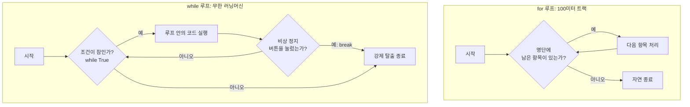

# 마이크로 세션: 054 — 반복문while과제어

> **세션 ID**: MS-PY101-054  
> **소요 시간**: 25분  
> **난이도**: medium  
> **청크 타입**: narrative  
> **버전**: v2.1 (7섹션 구조)

---

## §1. 개요

> **Day 3 | AM | 세션 054/064**

이 세션은 파이썬 기초의 오전 마지막 시간입니다. 앞서 정해진 횟수만큼 반복하는 for문을 배웠다면, 이제는 끝을 알 수 없는 작업을 처리하는 while 반복문을 배웁니다. 프로그램이 멈추지 않고 계속 실행되는 원리와, 필요할 때 안전하게 탈출하는 방법을 다루며 CRUD(생성, 조회, 수정, 삭제) 프로그램 메뉴 시스템의 핵심 뼈대를 구축합니다.

### 🎯 학습 목표

이 세션이 끝나면 수강생은 다음을 할 수 있어요:

- while문의 기본 구조와 무한 루프의 개념을 설명할 수 있습니다.
- break와 continue를 적절히 배치하여 반복문의 흐름을 제어할 수 있습니다.
- 무한 루프를 방지하고 사용자의 입력에 따라 종료되는 메뉴 시스템을 직접 만들 수 있습니다.

### 선행 세션 환기

바로 이전 세션인 053에서 for문과 range 함수를 통해 컨베이어 벨트를 돌려보았습니다. for문이 1번부터 10번까지 정해진 명단을 순서대로 끝까지 읽어내는 작업이었다면, 이번 시간에 배울 while문은 "이 조건이 참인 동안에는 횟수와 상관없이 계속 일해"라고 명령하는 방식입니다.

---

## §2. 핵심 개념 (+ 🗣️ 강사 대본 + Mermaid)

### 끝을 알 수 없는 반복과 러닝머신 비유

for문이 출발선과 결승선이 명확하게 그어진 100미터 달리기 트랙이라면, while문은 누군가 전원을 끄기 전까지 계속해서 돌아가는 러닝머신과 같습니다. 스마트폰 앱이나 게임, 메신저처럼 사용자가 종료 버튼을 누를 때까지 꺼지지 않아야 하는 프로그램에는 모두 while문이 사용됩니다.

🗣️ **강사 대본 (Instructor Script)**:

> 여러분, 지난 시간에 우리는 파이썬의 가장 기본적인 반복문인 for문을 배웠습니다. 명단이 정해져 있을 때 아주 훌륭한 도구죠. 백 명의 학생 이름이 적힌 출석부가 있다면, 첫 번째 학생부터 차례대로 부르고 깔끔하게 종료할 수 있습니다.
> 
> 하지만 현실 세계의 프로그램은 시작과 끝이 항상 이렇게 명확하지 않습니다. 카카오톡 같은 메신저를 생각해 볼까요? 사용자가 열 번만 메시지를 보내면 자동으로 꺼지도록 만들어져 있나요? 전혀 그렇지 않죠. 사용자가 앱을 완전히 닫기 전까지는 새로운 메시지가 올 때마다 알림을 울리고 화면을 업데이트해야 합니다. 
> 
> 바로 이럴 때, 끝을 미리 알 수 없는 상황에서 꺼내 들어야 할 도구가 바로 while 반복문입니다. 만약 여러분이 챗GPT 같은 인공지능 챗봇을 만든다고 상상해 보세요. 사용자가 언제 대화를 멈추고 싶어 할지 우리는 미리 알 수 없습니다. 사용자가 명시적으로 '그만'이라고 입력할 때까지 챗봇은 계속해서 질문을 기다려야 합니다.
> 
> while문을 직관적으로 이해하기 위해 피트니스 센터의 러닝머신을 떠올려 봅시다. 러닝머신은 기본적으로 사용자가 '정지' 버튼을 누르기 전까지 끝없이 돌아갑니다. 이것이 바로 while문의 기본 상태인 '무한 루프(Infinite Loop)'입니다. 벨트는 조건이 참인 이상 영원히 멈추지 않고 굴러갑니다. 
> 
> 그런데 만약 러닝머신에 비상 정지 버튼이 없다면 어떻게 될까요? 체력이 다 떨어졌는데도 기계를 멈출 수 없다면 아주 큰 사고가 나겠죠. 프로그래밍에서도 마찬가지입니다. while문을 사용할 때는 반드시 프로그램이 스스로 쳇바퀴에서 빠져나올 수 있는 비상 정지 버튼, 즉 break라는 탈출구를 만들어 두어야 합니다.

### Mermaid 다이어그램



이 다이어그램은 두 반복문의 근본적인 차이를 보여줍니다. for문은 리스트나 명단이 바닥나면 알아서 자연스럽게 끝나지만, 무한 루프로 설계된 while문은 break를 만나지 못하면 영원히 갇히게 됩니다.

---


### 🎨 추가 시각화 (Visualization Packet)

**if/else 조건문 제어 흐름**

프로그램이 실행되다가 특정 조건에 따라 두 갈래 길로 나뉘는 논리 구조입니다.

```mermaid
flowchart TD
    A["프로그램 실행 중"] --> B{"조건 (예: 나이 >= 20?)"}
    B -->|True (참)| C["성인 요금 적용 로직"]
    B -->|False (거짓)| D["미성년자 요금 적용 로직"]
    C --> E["다음 단계 진행"]
    D --> E
    
    style B fill:#fff3e0,stroke:#f57c00
```

## §3. 상세 내용

### Why — 왜 while문이 필요한가?

모든 일이 정해진 횟수만큼만 일어나는 것은 아닙니다. 사용자의 입력을 끝없이 기다리는 서버 프로그램이나 주식 거래 시스템은 누군가 강제로 전원을 내리기 전까지 계속 살아 숨 쉬어야 합니다. 몇 번 반복할지 코드를 작성하는 시점에 알 수 없는 상황에서는 for문 대신 조건에 따라 반복을 결정하는 while문이 필수적인 엔진 역할을 합니다.

### What — while True, break, continue

세 가지 핵심 부품이 하나로 묶여서 동작합니다.

- **while True**: 파이썬에서 의도적으로 무한 루프를 만드는 가장 흔한 패턴입니다. True는 항상 참이므로 반복문이 영원히 돌게 됩니다.
- **break (비상 정지 버튼)**: 반복문 자체를 완전히 박살 내고 끝내버리는 폭탄입니다. 무한 루프 안에서 if문과 결합하여 사용자의 종료 요청을 만나면 루프를 강제로 탈출합니다.
- **continue (급수대 자원봉사자)**: 마라톤 급수대에서 목이 마르지 않은 러너가 물을 받지 않고 스킵하는 것과 같습니다. continue를 만나면 이번 바퀴의 아래쪽 코드는 무시하고 조용히 다음 바퀴의 시작점(조건 검사)으로 되돌아갑니다. 불필요한 데이터를 필터링할 때 유용합니다.

### How — 구체적인 작동 방식과 메뉴 시스템 적용

일반적으로 무한 루프를 열어두고 사용자 입력을 받습니다. 입력값이 특정 조건과 일치하면 break를 실행해 루프를 깹니다. 만약 잘못된 값이 들어오면 continue를 사용해 아래 로직이 에러를 일으키지 않도록 보호하고 다시 입력을 받도록 만듭니다. 이 패턴이 우리가 일상적으로 사용하는 모든 소프트웨어의 뼈대입니다.

---

## §4. 실습 가이드 (+ 🎙️ 실습 대본)

### 실습 목표

끝없이 돌아가는 카페 주문 시스템(키오스크)을 직접 만들어 봅니다. 사용자가 원하는 메뉴를 선택하게 하고, 잘못된 입력은 continue로 걸러내며, 종료를 선택했을 때 break로 빠져나오는 구조를 체감하는 것이 목표입니다.

🎙️ **실습 가이드 대본 (Lab Guide)**:

> 자, 이제 앞서 배운 while 무한 루프와 break, continue를 조합해서 아주 간단한 카페 키오스크 시스템을 만들어 볼 겁니다. 제가 화면에 띄워둔 코드를 편집기에 똑같이 작성해 보세요.
> 
> (3분 코딩 시간 부여)
> 
> 코드를 다 치셨다면 실행 버튼을 눌러보세요. 프로그램이 안 끝나고 계속해서 '메뉴를 선택하세요'라고 물어보죠? 1번이나 2번을 누르면 주문을 잘 받았다고 하고 다시 메뉴를 묻습니다. 자, 이번엔 9번을 입력해 볼까요? 네, 바로 프로그램이 '주문을 종료합니다'라는 인사와 함께 얌전하게 꺼집니다. 
> 
> 만약 5번 같은 엉뚱한 숫자를 넣으면 어떻게 될까요? '잘못된 번호입니다'라고 알려준 뒤, 프로그램이 죽지 않고 continue를 만나 다시 처음으로 돌아갑니다. 
> 
> 이렇게 while True와 break, continue만 있으면, 프로그램이 오류 없이 여러분의 의도대로 부드럽게 돌아가게 만들 수 있습니다. 지금 여러분 스스로 메뉴를 하나 더 추가해 보시거나, 특정 단어를 입력하면 멈추도록 코드를 직접 변형해 보세요. 망가져도 괜찮습니다. 부수고 고쳐보는 과정에서 진짜 실력이 늘어납니다!

### 단계별 지시

| 단계 | 소요 시간 | 강사 지시사항 | 학습자 액션 | 예상 결과 |
|---|---|---|---|---|
| 1 | 3분 | while 메뉴 시스템 실습 코드 제공 | 편집기에 코드 타이핑 | 화면에 무한 루프 메뉴 출력 |
| 2 | 3분 | 1번, 2번 정상 입력 테스트 지시 | 1 또는 2 입력 | 메뉴 처리 후 다시 입력 대기 |
| 3 | 2분 | 범위 밖 숫자나 한글 오타 유도 | 임의의 글자 입력 | continue로 인해 튕기지 않고 재시작 |
| 4 | 2분 | 9번 입력하여 탈출 확인 | 9 입력 | break 작동하여 프로그램 종료 |
| 5 | 5분 | "자신만의 메뉴 3번 추가해보기" 미션 | 코드 수정 및 메뉴 추가 | 제어문 조합 논리 체득 |

### 트러블슈팅 FAQ

| Q | A |
|---|---|
| 코드를 실행했는데 화면에 글씨만 나오고 안 넘어가요. | input() 함수가 여러분의 타자를 기다리는 중입니다. 터미널 창을 마우스로 한 번 클릭하고 엔터를 쳐보세요. |
| 비상 정지 버튼(break)을 빼먹어서 컴퓨터가 멈추질 않아요! | 당황하지 마세요. 터미널 창을 클릭하고 키보드에서 `Ctrl + C` 키를 동시에 누르면 강제로 멈춥니다. 이것이 개발자들의 진짜 비상 정지 단축키입니다. |
| continue 아래에 있는 print가 왜 출력이 안 되나요? | continue는 그 아래 코드를 전부 무시하고 다시 맨 처음 while문 꼭대기로 되돌아가라는 명령어이기 때문입니다. 아예 도달하지 못하는 코드가 됩니다. |

---


### 🎓 강사 노트 (Instructor Support)

- ⏱️ **타이밍**: 14:10 (25분, code)
- 🎯 **핵심 활동**: while + break/continue
- ⚠️ **강사 주의사항**: 무한 루프 주의! Ctrl+C 미리 안내

## §5. 코드 및 명령어 모음

### 기본 while 루프 흐름 제어

가장 단순한 숫자 카운팅을 통해 흐름 제어 키워드의 작동을 보여주는 코드입니다.

```python
count = 0
while True:
    count += 1
    if count == 2:
        continue  # 2가 되면 출력하지 않고 다음 바퀴로 스킵
    if count > 3:
        break     # 3보다 커지면 거대한 루프 감옥을 탈출
    print(f"루프: {count}")

# 실행 결과:
# 루프: 1
# 루프: 3
```

### 키오스크 메뉴 시스템 실습 코드

무한 루프, 종료 조건(break), 필터링 조건(continue)이 모두 결합된 실전 패턴입니다.

```python
while True:
    print("\n--- 카페 주문 시스템 ---")
    print("1. 아메리카노 (3000원)")
    print("2. 카페라떼 (4000원)")
    print("9. 주문 종료")
    
    choice = input("원하는 메뉴 번호를 입력하세요: ")
    
    # 1단계: 비상 정지 버튼 확인
    if choice == '9':
        print("주문을 종료합니다. 감사합니다!")
        break
        
    # 2단계: 잘못된 입력 필터링
    if choice not in ['1', '2']:
        print("잘못된 번호입니다. 다시 선택해 주세요.")
        continue
        
    # 3단계: 정상 처리
    print(f"{choice}번 음료를 준비합니다...")
```

---

## §6. 요약

### 핵심 학습 포인트

이번 세션의 핵심은 세 가지입니다. 첫째, while 루프는 for문과 달리 종료 시점이 명확하지 않을 때 조건이 참인 동안 끝없이 실행되는 끈질긴 녀석입니다. 둘째, 의도적인 무한 루프를 사용할 때는 반드시 break라는 비상 정지 버튼을 달아두어야 프로그램이 뻗지 않고 안전하게 탈출할 수 있습니다. 셋째, continue는 반복을 완전히 끝내지는 않지만 현재 진행 중인 남은 작업을 쿨하게 스킵하고 다음 턴으로 넘기는 똑똑한 필터 역할을 합니다.

### Day 3 AM 마지막 세션 브릿지 노트

> "여러분, 오늘 오전 내내 파이썬의 가장 중요한 뼈대들을 조립했습니다. 변수라는 이름표를 붙이고, 딕셔너리라는 고객 카드에 데이터를 담고, if 조건문으로 길을 나누고, 마침내 while문으로 끝없이 돌아가는 튼튼한 엔진까지 만들었습니다. 이제 우리는 꽤 복잡한 프로그램도 만들 수 있는 힘을 얻었습니다.
>
> 하지만 아직 우리의 프로그램은 아주 여린 유리 멘탈을 가지고 있어요. 방금 만든 메뉴 시스템에서, 숫자를 입력해야 하는데 사용자가 장난으로 한글 '하나'를 입력하고 int()로 변환하려고 하면 어떻게 될까요? 프로그램은 붉은색 에러를 내뿜으며 비명을 지르고 픽 쓰러져 버립니다. 
> 
> 오전 시간 정말 고생 많으셨습니다. 점심 식사 맛있게 하시고, 오후에는 외부의 엉뚱한 입력이나 네트워크 끊김 같은 충격으로부터 우리 프로그램이 죽지 않도록 튼튼한 안전망을 쳐주는 '예외 처리' 기술을 다뤄보겠습니다. 식사 맛있게 하세요!"

---

## §7. 참고 자료

### 3-Source 출처

- **Source A (로컬 참고자료)**: 8 코딩.pdf §8.4 — 반복문의 제어 흐름 및 와일-브레이크(while-break) 패턴. 무한루프와 break의 필요성을 러닝머신 비유로 설명한 원천 자료를 반영했습니다.
- **Source B (NotebookLM)**: NotebookLM day3 — 인공지능 에이전트의 데이터 수집 과정에서 의미 없는 더미 데이터를 만났을 때 continue 신호를 사용하여 에러 없이 건너뛰는 실무 패턴 분석을 참고했습니다.
- **Source C (Deep Research)**: Deep Research day3 — 심층 탐색 알고리즘에서 불필요한 경로 스킵(continue)과 목표 달성 후 전체 탐색 즉시 종료(break)를 통한 효율성 극대화 리서치를 반영했습니다.

### 강사 노트

> 💡 **강사 노트**: 이 세션은 비전공자들이 '무한 루프'에 대한 막연한 두려움을 깨고 스스로 제어할 수 있다는 자신감을 심어주는 것이 핵심입니다. 러닝머신과 비상 정지 버튼 비유가 매우 직관적이고 효과적입니다. 실습 중에 break를 누락하여 무한 루프에 갇혀 당황하는 수강생이 분명히 나오므로, 터미널 강제 종료 단축키(`Ctrl + C`)를 실습 시작 전에 미리 알려주면 교실의 분위기가 훨씬 부드러워집니다.

---

*작성 일시: 2026-02-25*  
*작성 에이전트: Sisyphus-Junior*  
*교안 구조: 7섹션 (A0 팀 공통 표준)*