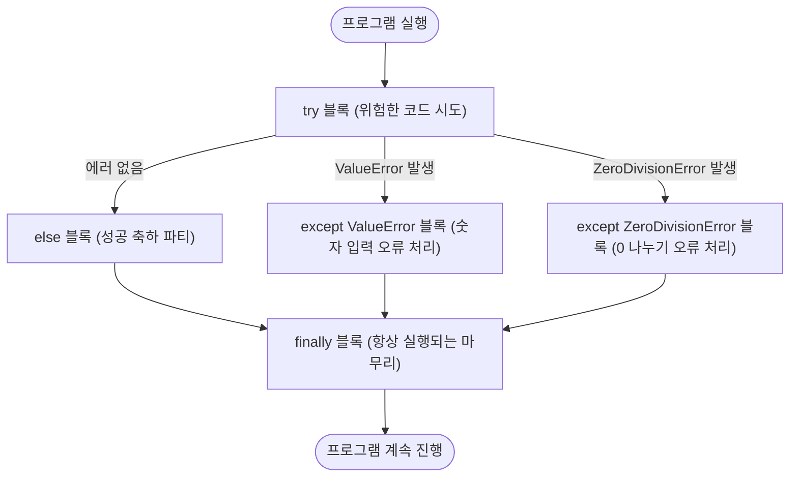

# 마이크로 세션: 055 — 예외 처리와 안전망 구축 (try-except)

> **세션 ID**: MS-PY101-055  
> **소요 시간**: 20분  
> **난이도**: ★★☆  
> **청크 타입**: narrative  
> **선행 세션**: 054(필수)  
> **후행 세션**: 056  
> **버전**: v2.1 (7섹션 구조)

---

## §1. 개요

> **Day 3 | PM | 세션 055/064**

이 세션은 Day 3 오후의 첫 번째 세션입니다. 우리가 이전 세션(054)에서 `while` 반복문과 제어문(`break`, `continue`)을 통해 프로그램의 내부 흐름을 자유롭게 다루는 법을 배웠다면, 이제는 프로그램의 통제 범위를 벗어난 '외부의 충격'으로부터 코드를 보호하는 방법을 배울 차례입니다. 아무리 완벽해 보이는 프로그램이라도 사용자의 예상치 못한 입력이나 네트워크 단절 같은 돌발 상황을 만나면 그대로 멈춰버릴 수 있습니다. 이 세션에서는 프로그램이 강제 종료되지 않고 유연하게 대처할 수 있도록 돕는 예외 처리(try-except)의 개념과 실전 활용법을 익힙니다.

### 🎯 학습 목표

이 세션이 끝나면 수강생은 다음을 할 수 있어요:

- 런타임 에러(Runtime Error)가 프로그램에 미치는 치명적인 영향을 이해합니다
- `try-except-else-finally` 네 가지 블록의 역할과 실행 흐름을 설명할 수 있습니다
- 에러 종류(`ValueError`, `ZeroDivisionError` 등)에 따라 다르게 대응하는 방어적 코드를 작성할 수 있습니다
- 에러 발생 시 프로그램이 다운되는 대신 사용자 친화적인 메시지를 출력하도록 UX를 개선할 수 있습니다

### 선행 세션 환기

바로 전 세션에서 우리는 `while`문을 제어하기 위해 `break`라는 비상 탈출 버튼을 만들었습니다. 내부 논리에 무한 루프라는 덫이 생겼을 때 빠져나오는 법이었죠. 이번엔 시야를 밖으로 돌려볼게요. 사용자가 숫자를 입력해야 하는데 문자를 입력해 버리면 어떡할까요? 이전 세션까지의 지식으로는 프로그램이 그냥 죽어버렸습니다. 이제 그 '죽어버리는' 상황에 안전그물을 쳐볼 시간입니다.

---

## §2. 핵심 개념 (+ 🗣️ 강사 대본 + Mermaid)

### 비유 풀이: 서커스 공연장의 튼튼한 '안전그물'

코드가 정상적으로 실행되는 과정은 서커스 공연의 공중그네와 같습니다. 완벽하게 짜인 로직을 따라 움직일 때는 아름답지만, 어쩌다 손이 미끄러지면(에러 발생) 그대로 바닥으로 추락해 공연 자체가 비극적으로 끝나버리죠. 이것이 바로 우리가 겪는 '프로그램 강제 종료'입니다. 하지만 서커스단은 항상 바닥에 커다란 **안전그물(try-except)**을 설치해 둡니다. 떨어져도 그물이 받아주면, 관객은 잠시 놀라겠지만 공연은 다시 이어질 수 있습니다.

🗣️ **강사 대본 (Instructor Script)**:

> 여러분, 점심 맛있게 드셨나요? 오후 첫 시간, 조금은 비장한 이야기로 시작하겠습니다.
> 
> 우리가 오전까지 참 많은 걸 배웠고, 꽤 그럴듯하게 돌아가는 계산기나 고객 관리 프로그램을 만들어 봤습니다. 그런데 완벽해 보이는 이 프로그램에 치명적인 약점이 하나 있어요. 만약 화면에 "나이를 숫자로 입력하세요"라는 안내문이 떴는데, 사용자가 장난삼아 "안녕"이라고 한글을 치면 어떻게 될까요?
> 
> 네, 바로 시뻘건 에러 메시지가 쏟아지면서 프로그램이 그 즉시 심장마비에 걸린 것처럼 픽 죽어버리고 맙니다. 우리는 이걸 '런타임 에러(Runtime Error)'라고 불러요. 개발자가 아무리 논리적으로 코드를 잘 짰다고 하더라도, 현실의 사용자는 항상 우리의 예상을 뛰어넘는 기상천외한 행동을 하거든요.
> 
> 만약 여러분이 만든 인공지능 주식 자동매매 프로그램이 서버와 통신하다가 아주 잠깐, 0.1초 인터넷이 끊겼다고 해서 에러를 뿜으며 아예 종료되어 버린다면 어떨까요? 엄청난 금전적 손실로 이어질 겁니다. 프로그램이 중간에 죽어버리는 것보다는, "잘못된 입력입니다. 다시 입력해 주세요"라거나 "네트워크가 불안정합니다. 잠시 후 다시 시도합니다"라고 안내해 주는 것이 훨씬 훌륭한 사용자 경험(UX)이에요.
> 
> 그래서 오늘은 외부의 충격이나 잘못된 상황 속에서도 우리 프로그램이 절대로 죽지 않게 꽉 잡아주는 강력한 맷집, 바로 예외 처리 기법을 배워보겠습니다. 서커스 공연장에 설치된 튼튼한 안전그물을 우리 코드에도 쳐볼 시간입니다!

### Mermaid 다이어그램



이 다이어그램은 `try-except` 구문이 어떻게 런타임 에러를 방어하고 프로그램의 흐름을 안전하게 끝까지 이어가는지 보여줍니다. 에러가 나든 안 나든, 결국 우리는 `finally`를 거쳐 멈추지 않고 앞으로 나아가게 됩니다.

---

## §3. 상세 내용

### Why — 왜 이 세션이 필요한가?

초보 개발자들은 '정상적으로 작동하는 경로(Happy Path)'만 고민하며 코드를 짜는 경향이 있습니다. 하지만 실무 환경에서는 데이터베이스 연결 실패, 사용자의 오타, 파일 접근 권한 문제 등 수많은 돌발 상황이 매분 매초 발생합니다. 예외 처리를 배우지 않으면, 장난감 코드는 짤 수 있어도 결코 현업에서 쓸 수 있는 견고한(Robust) 프로그램을 만들 수는 없습니다. 이 세션은 수강생들의 마인드셋을 '정상 작동'에서 '방어적 프로그래밍'으로 넓혀주는 중요한 분기점입니다.

### What — 이 세션에서 다루는 것은 무엇인가?

파이썬에서 안전망을 구축하는 핵심 키워드 4가지의 역할과 상호작용을 다룹니다.
1. `try`: 에러가 발생할지도 모르는, 실패 가능성이 있는 코드를 담는 블록
2. `except`: 특정 에러가 터졌을 때 프로그램이 종료되는 대신 실행할 대안 코드를 담는 블록
3. `else`: 에러가 단 하나도 발생하지 않고 완벽하게 성공했을 때만 실행되는 블록
4. `finally`: 에러 발생 여부나 함수 중간의 `return`과 무관하게 무조건 마지막에 실행되는 정리정돈 블록

### How — 구체적으로 어떻게 진행하는가?

🗣️ **강사 대본 (Instructor Script)**:

> 파이썬에서 안전망을 치는 방법은 네 가지 키워드로 구성됩니다. 트라이(try), 익셉트(except), 엘스(else), 파이널리(finally)입니다.
> 
> 먼저 `try` 블록에는 우리가 원래 실행하고 싶었던 메인 코드, 즉 '에러가 발생할지도 모르는 위험한 코드'를 집어넣습니다. 만약 `try` 안에서 코드가 정상적으로 실행되면 `except` 블록은 완전히 무시됩니다. 
> 
> 하지만 `try` 안에서 무언가 터졌다, 에러가 발생했다면? 파이썬은 즉시 `try` 블록 실행을 멈추고 `except` 블록으로 피신합니다. 여기서 재밌는 건 `except`를 여러 개 겹쳐서 사용할 수 있다는 점이에요. 예를 들어 `ValueError`는 사용자가 숫자를 넣어야 할 곳에 문자를 넣었을 때 잡아내는 그물이고, `ZeroDivisionError`는 숫자를 0으로 나누려고 할 때 발생하는 수학적 모순을 잡아내는 그물입니다. 에러의 종류별로 맞춤형 대피로를 만들어주는 거죠.
> 
> 다음으로 `else` 블록은 `try` 블록에서 단 한 개의 에러도 발생하지 않고 완벽하게 성공했을 때만 실행되는 축하 파티 같은 공간입니다. 
> 
> 마지막으로 `finally` 블록은 에러가 났든 안 났든, 심지어 중간에 반복문을 탈출하는 `break`를 만났더라도 무조건 마지막에 한 번은 꼭 실행되는 정리정돈 블록입니다. 열어두었던 파일을 닫거나 네트워크 연결을 끊는 등 반드시 마무리해야 하는 비상 정지 절차를 `finally` 안에 작성합니다.

---

## §4. 실습 가이드 (+ 🎙️ 실습 대본)

### 실습 목표

단순한 나눗셈 계산기 코드를 작성하고, 의도적으로 에러를 내보며 `try-except` 안전그물이 어떻게 작동하는지 직접 체감합니다. 에러 메시지 없이 부드럽게 대처하는 UX를 확인하는 것이 목표입니다.

🎙️ **실습 가이드 대본 (Lab Guide)**:

> 자, 그럼 이 네 가지 키워드가 실제 코드에서 어떻게 튼튼한 요새를 구축하는지 살펴보겠습니다. 백이라는 숫자를 사용자가 입력한 숫자로 나누는 간단한 계산기 프로그램을 짜볼 거예요.
> 
> 지금 화면에 띄워드린 코드를 편집기에 그대로 타이핑해 보세요. 코드를 다 작성하셨다면, 이제 우리가 해커가 된 것처럼 의도적으로 프로그램이 싫어할 만한 행동을 해볼 겁니다.
> 
> 첫 번째 실행에서는 숫자 `20`을 입력해 보세요. 결과는 `5.0`이 나오고 "계산 종료"가 출력될 겁니다. 에러가 없었으므로 `else` 블록과 `finally` 블록이 모두 실행된 거죠.
> 
> 두 번째로 다시 실행하고, 이번에는 숫자가 아니라 '파이썬'이라고 한글을 입력해 보세요. `try` 블록 안의 `int()` 변환 과정에서 에러가 터지면서, 곧바로 `ValueError` 그물에 탁 걸릴 겁니다. "숫자만 입력해야 합니다!"가 출력되고 `finally`로 넘어가죠? 시뻘건 에러 창이 안 떴어요!
> 
> 세 번째로는 숫자 `0`을 입력해 보세요. 이번에는 100을 0으로 나누려다가 `ZeroDivisionError` 그물에 걸려 "0으로 나눌 수 없습니다!"라는 친절한 메시지를 보여줍니다. 어떤 짓을 해도 프로그램이 비정상적으로 뻗어버리지 않죠? 이것이 바로 방어적 프로그래밍의 힘입니다.

### 단계별 지시

| 단계 | 소요 시간 | 강사 지시사항 | 학습자 액션 | 예상 결과 |
|------|----------|--------------|------------|----------|
| 1 | 3분 | 코드 스니펫 화면 공유 및 타이핑 안내 | 에디터에 `try-except` 코드 작성 | 기본 코드 준비 완료 |
| 2 | 2분 | 정상 동작 케이스 테스트 지시 (숫자 20 입력) | 정상적인 숫자 입력 후 실행 | `else`와 `finally` 동작 확인 |
| 3 | 3분 | `ValueError` 발생 유도 (문자열 입력) | 문자를 입력하여 에러 유발 시도 | 프로그램이 죽지 않고 오류 메시지만 출력 |
| 4 | 2분 | `ZeroDivisionError` 발생 유도 (0 입력) | 숫자 0 입력 후 실행 | 0 나누기 오류 처리 블록 동작 확인 |
| 5 | 5분 | 강사 랩업 및 코드 동작 흐름 해설 분석 | 코드와 실행 결과 비교하며 경청 | `try-except` 전체 흐름 완벽 이해 |

### 트러블슈팅 FAQ

| Q | A |
|---|---|
| "except 블록에서 에러 이름을 모를 때는 어떡하나요?" | "`except Exception as e:` 처럼 작성하면 발생하는 모든 종류의 에러를 퉁쳐서 잡고, 에러 내용도 `e`라는 변수에 담아 출력해 볼 수 있습니다. 다만 처음엔 에러 종류별로 명시하는 게 좋은 습관입니다." |
| "else 블록은 굳이 왜 쓰나요? 그냥 try 아래에 쭉 쓰면 안 되나요?" | "`try` 블록은 최소한으로 유지하는 게 좋습니다. 정말 에러가 터질 위험이 있는 코드만 `try`에 넣고, 안전한 나머지 처리 로직은 `else`로 빼는 게 실무에서 권장하는 클린 코드 작성법이에요." |

---


### 🎓 강사 노트 (Instructor Support)

- ⏱️ **타이밍**: 14:35 (20분, narrative)
- 🎯 **핵심 활동**: "안전벨트" 비유
- ⚠️ **강사 주의사항**: 에러 두려움 해소

## §5. 코드 및 명령어 모음

실습에 사용되는 핵심 파이썬 코드입니다.

```python
# 세션 055: 예외 처리와 안전그물 (try-except-else-finally)

try:
    # 에러 발생 가능성이 있는 위험한 코드 블록
    num = int(input("나눌 숫자를 입력하세요: "))
    result = 100 / num

except ValueError:
    # 문자를 입력해서 int() 변환에 실패했을 때 잡는 그물
    print("❌ 숫자만 입력해야 합니다!")

except ZeroDivisionError:
    # 0으로 나누려고 시도했을 때 잡는 그물
    print("❌ 0으로 나눌 수 없습니다!")

else:
    # 에러가 단 하나도 발생하지 않았을 때만 실행 (성공 시)
    print(f"✅ 계산 성공! 결과는 {result}입니다.")

finally:
    # 에러 발생 여부와 상관없이 무조건 마지막에 실행
    print("🔄 계산기를 종료합니다.")
```

> 🤖 **AI 프롬프트 예시**: (선택 실습용)
> "Gemini야, 내가 위에서 짠 try-except 코드에 `KeyboardInterrupt` (사용자가 Ctrl+C를 눌러서 강제 종료 시도) 예외 처리도 하나 더 추가해 줘. 그리고 각각의 에러가 났을 때 로그 파일에 에러 내역을 기록하는 부분도 주석으로 설명해 줘."

---

## §6. 요약

### 핵심 학습 포인트

이번 세션에서 가장 중요한 것은 프로그램이 에러를 뿜어내는 건 자연스러운 일이며, 그것을 **통제 불가능한 폭발에서 안전한 연소로 바꾸는 과정**이 바로 예외 처리라는 점을 깨닫는 것입니다.
- 런타임 에러는 프로그램을 강제 종료시키며 끔찍한 UX를 초래합니다.
- `try-except` 구문은 이 추락을 막는 서커스의 안전그물입니다.
- 에러의 종류(`ValueError`, `ZeroDivisionError` 등)에 따라 적절한 대안 행동을 겹겹이 설계할 수 있습니다.
- `finally`는 에러와 무관하게 무조건 실행되므로 정리 작업에 아주 유용합니다.

### 다음 세션 예고

오늘 우리는 반복할 수 있는 체력(반복문)도 가졌고, 외부의 공격을 버텨내는 맷집(예외 처리)도 갖추었습니다. 그런데 코드가 점점 길어지다 보니, 계산기 기능을 만들기 위해 매번 십여 줄의 코드를 복사해서 붙여넣어야 하는 번거로움이 생겼어요. 천 줄, 만 줄짜리 프로그램에서 매번 이럴 순 없겠죠? 

그래서 다음 세션(056)에서는 우리가 짠 유용한 코드들을 마치 '레시피 카드'처럼 깔끔하게 포장해서, 필요할 때마다 이름만 불러 꺼내 쓰는 마법 같은 도구 — **'함수(Function)'**에 대해 배워보도록 하겠습니다.

### 브릿지 노트

> "이제 여러분의 프로그램은 어지간한 공격에는 끄떡도 하지 않는 단단한 맷집을 가졌습니다. 방어막을 쳤으니, 이제 코드를 효율적으로 재사용하는 생산성 무기를 장착하러 가볼까요?"

---

## §7. 참고 자료

### 3-Source 출처

- **Source A (로컬 참고자료)**: `8 코딩.pdf`, `9 디버깅, 테스트, 배포.pdf` — 현업 관점에서의 방어적 프로그래밍(Defensive Programming) 원칙과 에러 대응 방식을 가져왔습니다.
- **Source B (NotebookLM)**: Day 3 요약 노트 — 최신 AI 트렌드에서 AI가 복잡한 문서를 읽다가 해독할 수 없는 문자를 만나도 전체 프로세스를 멈추지 않고, 해당 부분만 예외 처리하여 다음으로 넘어가는 강건성(Robustness)의 사례를 반영했습니다.
- **Source C (Deep Research)**: Day 3 리포트 — 대규모 데이터 수집 파이프라인에서 수만 개의 웹페이지 크롤링 중 몇 개가 접속되지 않더라도 전체 크롤링이 중단되지 않도록 방어하는 대피 계획 설계 패턴을 설명에 녹였습니다.

### 추가 학습 자료

- [파이썬 공식 문서: 내장 예외 (Built-in Exceptions)](https://docs.python.org/ko/3/library/exceptions.html) — 파이썬에서 기본 제공하는 수많은 에러의 종류와 계층도
- 에러를 두려워하지 않는 개발자 마인드셋 칼럼 (내부 자료)

### 강사 노트

> 💡 **강사 노트**: 예외 처리를 설명할 때 "프로그램이 죽어버리는 것보다 '잘못된 입력입니다'라고 알려주는 것이 훨씬 좋은 UX입니다"라는 [팩트 패킷의 스크립트 포인트]를 꼭 강조해 주세요. 초보 수강생들은 에러 화면 자체를 무서워하는 경향이 있는데, 에러는 개발자를 괴롭히는 적이 아니라 어디가 아픈지 알려주는 친절한 신호등임을 인식시켜 주는 것이 중요합니다.

---

*작성 일시: 2026-02-25*  
*작성 에이전트: A4B_Session_Writer*  
*교안 구조: 7섹션 (A0 팀 공통 표준)*
