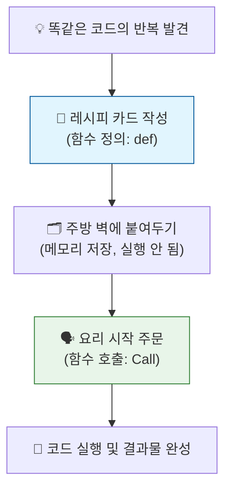

# 마이크로 세션: 056 - 함수의 개념과 정의

> **세션 ID**: MS-PY101-056  
> **소요 시간**: 20분  
> **난이도**: low  
> **청크 타입**: narrative  
> **버전**: v2.1 (7섹션 구조)

---

## §1. 개요

> **Day 3 | PM | 세션 056/064**

이 세션은 파이썬에서 코드를 재사용하는 가장 기본적이고 강력한 도구인 '함수(Function)'의 개념을 다루는 시간이에요. 이전 세션까지 조건문과 반복문을 통해 프로그램의 흐름을 제어하는 법을 배웠다면, 이제는 그렇게 작성한 코드를 예쁜 상자에 담아 이름을 붙이고 필요할 때마다 꺼내 쓰는 방법을 배울 차례입니다.

### 🎯 학습 목표

이 세션이 끝나면 수강생은 다음을 할 수 있어요:
- 코드를 복사하고 붙여넣는 대신 함수를 만들어야 하는 이유를 설명할 수 있습니다
- '나만의 레시피 카드' 비유를 통해 함수의 정의(def)와 호출(call)의 차이를 명확히 구분할 수 있습니다
- 타입 힌트와 독스트링을 활용해 AI와 동료가 읽기 쉬운 파이썬 함수를 작성할 수 있습니다

### 선행 세션 환기

이전 세션 055에서는 프로그램이 멈추지 않도록 지켜주는 안전망인 예외 처리를 배웠어요. 이제 코드를 안전하게 만드는 것을 넘어, 효율적으로 재사용하는 단계로 넘어갑니다. 방금 전 세션에서 작성했던 계산기 코드를 그대로 복사해서 다른 곳에 또 쓴다면 어떻게 될지 상상하면서 이번 세션을 시작해 볼 거예요.

---

## §2. 핵심 개념 (+ 🗣️ 강사 대본 + Mermaid)

### 레시피 카드와 레고 블록 비유

함수를 이해하는 가장 직관적인 비유는 바로 '레시피 카드'입니다. 매번 요리할 때마다 물을 얼마 넣고 재료를 어떻게 썰지 처음부터 고민하는 것은 매우 피곤한 일이죠. 대신 종이 카드에 '김치찌개 레시피'라고 제목을 적어두고, 구체적인 요리 순서를 꼼꼼히 기록해 주방 벽에 붙여둡니다. 이렇게 요리법을 기록해 두는 행위가 '함수 정의(Define)'이고, 나중에 찌개가 먹고 싶을 때 카드를 꺼내 그대로 요리를 시작하는 것이 '함수 호출(Call)'이에요. 코드를 복사해서 붙여넣기 하고 있다면, 함수를 만들 때가 된 것입니다.

🗣️ **강사 대본 (Instructor Script)**:

> 여러분, 프로그래머들이 세상에서 가장 싫어하는 행동이 무엇일까요? 바로 '똑같은 일을 두 번 반복하는 것'입니다. 
> 
> 만약 여러분이 회원가입을 처리하는 코드를 이십 줄 정도 정성스럽게 작성했다고 해봅시다. 그런데 이 기능이 메인 화면에도 필요하고 이벤트 페이지에도 필요해졌어요. 이때 코드를 복사해서 여기저기 붙여넣기 한다면 어떻게 될까요? 처음에는 편하겠죠. 하지만 회원가입 로직에 수정 사항이 하나라도 생기면, 복사해 둔 다섯 군데의 코드를 일일이 찾아다니며 똑같이 고쳐야 합니다. 하나라도 빼먹으면 치명적인 버그가 터지는 거예요. 개발자들 사이에는 "코드를 복사해서 붙여넣고 있다면 무언가 단단히 잘못된 것이다"라는 유명한 격언이 있습니다.
> 
> 이렇게 똑같은 코드를 여러 번 반복해서 써야 할 때, 우리는 이 코드들을 묶어서 '레시피 카드'로 만들어야 합니다. 여러분이 김치찌개를 기가 막히게 끓인다고 가정해 볼게요. 매번 요리할 때마다 뇌를 풀가동해서 '물을 500미리리터 넣고, 김치를 썰고'를 처음부터 생각하는 건 피곤합니다. 대신 종이 카드에 '나만의 김치찌개 레시피'라고 제목을 적고 순서를 꼼꼼히 적어 주방 벽에 붙여두는 거죠. 
> 
> 파이썬에서는 이것을 함수를 '정의(Define)'한다고 부릅니다. 그리고 며칠 뒤 김치찌개가 먹고 싶을 때, 언제든 그 카드만 꺼내서 적힌 대로 따라 하면 됩니다. 심지어 친구에게 "내 레시피대로 끓여봐"라고 카드를 건네줄 수도 있죠. 레시피 카드를 보고 요리를 시작하는 행위, 이것이 바로 함수를 '호출(Call)'하는 것입니다.
> 
> 명심하세요. 레시피 카드를 주방 벽에 예쁘게 붙여두었다고 해서 요리가 저절로 만들어지지는 않습니다. 반드시 여러분이 그 이름을 직접 불러주어야, 즉 '호출'을 해야만 코드가 스르륵 실행됩니다.

### Mermaid 다이어그램



이 다이어그램은 코드를 작성해 두는 것(정의)과 실제로 실행하는 것(호출)의 차이를 보여줍니다. 초보자들이 가장 많이 하는 실수 중 하나가, 함수를 열심히 정의해 놓고 왜 화면에 아무것도 나오지 않는지 당황하는 것이에요. 반드시 호출을 거쳐야 결과를 얻을 수 있다는 점을 시각적으로 강조합니다.

---

## §3. 상세 내용

### Why - 왜 함수가 필요한가?

똑같은 로직을 중복해서 작성하는 것은 프로그램의 유지보수를 극도로 어렵게 만듭니다. 수천 줄의 코드가 모여 있는 거대한 프로그램에서 복사된 코드 조각들을 일일이 찾아 수정하는 것은 사실상 불가능해요. 함수는 이런 중복을 제거하고, "이 코드는 어떤 일을 하는 코드이다"라는 의미 있는 이름을 부여하여 코드의 가독성을 비약적으로 높여줍니다. 최근 인공지능 분야에서 복잡한 프롬프트 엔지니어링 과정을 하나의 거대한 함수로 묶어 재사용하는 것처럼, 함수는 파이썬에서 코드를 조립 가능한 레고 블록으로 만들어주는 가장 기본 단위입니다.

### What - 파이썬 함수의 필수 구성 요소

파이썬에서 함수를 만들 때는 크게 세 가지 현대적인 요소를 고려해야 합니다.
첫째, `def` 키워드입니다. Define의 약자로 새로운 레시피 카드를 쓰기 시작하겠다는 선언이에요.
둘째, 타입 힌트(Type Hint)입니다. 함수가 어떤 재료를 받고 어떤 결과물을 낼지 데이터의 종류를 명시하는 것입니다. 요리 재료로 '고기'라고만 적는 것보다 '돼지고기 300그램'이라고 정확히 적는 것이 낫듯이, 타입 힌트를 쓰면 AI와 동료가 코드를 훨씬 쉽게 이해할 수 있습니다.
셋째, 독스트링(docstring)입니다. 따옴표 세 개를 연달아 쓰고 함수의 목적을 설명하는 친절한 안내서예요. 좋은 코드는 '어떻게' 동작하는지가 아니라 '무엇'을 위해 존재하는지를 독스트링으로 명확히 남깁니다.

### How - 함수를 정의하고 호출하는 과정

함수를 정의할 때는 `def 함수이름():` 형태로 적은 뒤, 아랫줄부터 들여쓰기를 하고 실행할 코드들을 적어 내려갑니다. 정의가 끝났다면 들여쓰기를 빠져나와 함수의 이름을 직접 괄호와 함께 불러줍니다. `함수이름()` 형태로 호출해야만 비로소 함수 내부의 코드 블록이 위에서부터 차례대로 작동하기 시작합니다.

---

## §4. 실습 가이드 (+ 🎙️ 실습 대본)

### 실습 목표

수강생들은 직접 `def` 키워드를 사용해 간단한 인사말 함수를 정의해 봅니다. 타입 힌트와 독스트링을 포함한 최신 파이썬 스타일을 체화하고, 정의와 호출을 분리해서 실행해 보며 동작 원리를 눈으로 확인하는 것이 목표입니다.

🎙️ **실습 가이드 대본 (Lab Guide)**:

> 자, 편집기를 열고 우리만의 첫 번째 레시피 카드를 작성해 보겠습니다. 이름을 넘겨받아서 아주 친절한 인사말을 만들어주는 함수예요. 화면의 코드를 보면서 차근차근 따라 쳐보세요.
> 
> (코딩 시간 2분 부여)
> 
> 다 치셨나요? 첫 줄을 자세히 보세요. `name: str`이라고 적힌 부분이 있죠? 이건 들어올 재료가 문자열이라는 '타입 힌트'입니다. 그리고 괄호 밖 화살표 뒤에 적힌 `-> str`은 완성된 요리 결과물 역시 문자열이라는 뜻이에요. 
> 
> 아랫줄에 따옴표 세 개로 묶인 설명글, 독스트링도 빼놓지 말고 꼭 적어주세요. 나중에 AI가 여러분의 코드를 분석할 때 이 독스트링을 보고 함수의 의도를 파악하게 됩니다.
> 
> 이제 맨 아랫줄에서 `print(greet("AI시대"))`라고 함수를 호출해 보세요. 실행하면 "안녕하세요, AI시대님!"이라는 결과가 예쁘게 출력될 거예요. 이번에는 코드를 지우지 말고, 그 아래에 여러분의 이름을 넣어서 `greet("홍길동")`처럼 함수를 두세 번 더 호출해 보세요. 
> 
> 신기하죠? 우리는 긴 인사말 코드를 복사해서 붙여넣기 하지 않고도, 괄호 안의 이름만 쏙쏙 바꿔가며 계속해서 새로운 결과를 만들어낼 수 있습니다.
> 
> 여기서 아주 중요한 테스트를 하나 해볼게요. 맨 밑의 `print` 줄을 모두 지우고, 그냥 `greet("파이썬")`이라고만 적고 실행해 보세요. 화면에 아무것도 나오지 않죠? 에러가 난 게 아닙니다. 요리는 완벽하게 만들어졌지만 손님상에 내놓으라는 `print` 명령이 없었기 때문이에요. 컴퓨터 내부에서는 묵묵히 제 할 일을 다 했다는 점, 꼭 기억해 두세요.

### 단계별 지시

| 단계 | 소요 시간 | 강사 지시사항 | 학습자 액션 | 예상 결과 |
|---|---|---|---|---|
| 1 | 2분 | "화면의 greet 함수를 타입 힌트 포함해 작성하세요" | 편집기에 함수 정의 작성 | 오타 없이 코드 입력 |
| 2 | 1분 | "맨 밑에서 함수를 호출하고 실행해보세요" | `print(greet("이름"))` 실행 | 인사말 정상 출력 |
| 3 | 2분 | "이름을 바꿔서 여러 번 더 호출해보세요" | 2~3회 반복 호출 | 재사용성의 편리함 체감 |
| 4 | 2분 | "print 없이 greet만 호출해보고 결과 확인하세요" | `greet("이름")` 만 단독 실행 | 화면에 미출력됨을 확인 |
| 5 | 3분 | "독스트링과 타입 힌트의 역할을 리뷰합니다" | 화면 주시, 설명 경청 | 현대 파이썬 스타일 이해 |

### 트러블슈팅 FAQ

| Q | A |
|---|---|
| 함수 안의 코드가 실행되지 않고 무시돼요. | 함수 정의부(`def`)의 들여쓰기가 제대로 되었는지 확인하고, 가장 중요한 점! 함수 밖에서 호출(`greet()`)을 했는지 체크해 주세요. |
| 화살표(`->`)에서 자꾸 에러가 나요. | 타입 힌트를 적는 화살표는 빼기 기호(`-`)와 닫는 꺾쇠(`>`)를 붙여서 씁니다. 중간에 띄어쓰기가 들어가면 안 됩니다. |
| docstring의 따옴표 개수가 헷갈립니다. | 큰따옴표나 작은따옴표를 꼭 세 개 연달아(`"""` 또는 `'''`) 써야 합니다. 문자열 주석을 길게 달기 위한 파이썬의 특별한 규칙이에요. |

---


### 🎓 강사 노트 (Instructor Support)

- ⏱️ **타이밍**: 15:10 (20분, narrative)
- 🎯 **핵심 활동**: 함수 = "레시피 카드" 비유
- ⚠️ **강사 주의사항**: def + return 기본 구조

## §5. 코드 및 명령어 모음

이 세션에서 활용되는 핵심 코드 조각들입니다. 수강생들이 복사해서 활용할 수 있도록 안내해 주세요.

```python
# 가장 기본적인 함수의 정의와 호출 구조
def greet(name: str) -> str:
    """이름을 받아 친절한 인사말을 반환하는 함수입니다."""
    return f"안녕하세요, {name}님!"

# 1. 정상적인 함수 호출 및 출력
print(greet("AI시대"))
print(greet("파이썬"))
print(greet("홍길동"))

# 2. 주의: print 없이 호출만 하면 내부적으로만 동작하고 출력되지 않음
greet("조용한호출") 

# 3. 반환값(return)을 변수에 저장해서 재사용하는 패턴
welcome_msg = greet("수강생")
print(welcome_msg)
```

> 🤖 **AI 프롬프트 예시**:
> "다음 코드를 분석해서, 중복되는 부분을 하나의 함수로 깔끔하게 리팩토링해줘. 타입 힌트와 독스트링을 반드시 포함해서 작성해줄래?"

---

## §6. 요약

### 핵심 학습 포인트

이번 세션의 가장 중요한 메시지는 "코드를 복사해서 붙여넣지 말자"입니다. 이를 위해 우리는 다음과 같은 핵심 개념을 배웠습니다.
첫째, 데프(`def`) 키워드를 통해 나만의 레시피 카드를 작성(정의)합니다.
둘째, 정의된 코드는 이름을 부르기 전까지 가만히 기다리며, 반드시 이름을 불러야(호출) 코드가 실행됩니다.
셋째, 타입 힌트와 따옴표 세 개짜리 독스트링을 작성해 두면 AI와 동료 개발자가 여러분의 코드를 훨씬 쉽고 안전하게 읽어낼 수 있습니다. 이 작은 레고 블록들을 조립하는 것이 프로그래밍의 본질입니다.

### 다음 세션 예고

이제 복잡한 프로그램도 작은 함수들로 쪼개어 깔끔하게 만들 수 있는 첫걸음을 내디뎠습니다. 그런데 오늘 우리가 만든 레시피 카드는 외부에서 재료를 받아오고, 완성된 요리를 밖으로 내보내는 신기한 구조를 가지고 있었죠. 방금 괄호 안에 넣은 '이름'이라는 재료, 그리고 `return`이라는 마법의 키워드는 정확히 어떤 역할을 하는 것일까요? 함수가 외부 세계와 소통하는 방법이 바로 이 두 가지에 달려 있습니다. 다음 세션에서는 레시피 카드에 재료를 전달하는 '매개변수'와, 완성된 요리를 돌려받는 '반환값'의 원리를 더 깊이 파헤쳐 보겠습니다.

### 브릿지 노트

> "오늘 우리는 파이썬의 강력한 도구인 함수를 장착했습니다. 코드를 재사용하는 마법을 배웠죠. 하지만 완벽한 요리사가 되려면 손님에게 주문을 받고 요리를 내어주는 과정이 아주 매끄러워야 합니다. 방금 우리가 무심코 썼던 `name`과 `return`이 바로 그 소통의 창구입니다. 잠깐 숨을 고르고, 이 창구들이 어떻게 작동하는지 다음 시간에 자세히 들여다보겠습니다."

---

## §7. 참고 자료

### 3-Source 출처

- **Source A (로컬 참고자료)**: [8 코딩.pdf] - 코드를 재사용 가능한 모듈로 쪼개는 것의 중요성, 함수의 정의 및 호출 원리 반영
- **Source B (NotebookLM)**: NotebookLM 분석 리포트 - AI 시대의 프롬프트 엔지니어링 과정을 하나의 거대한 함수로 비유하는 최신 트렌드 적용
- **Source C (Deep Research)**: Deep Research 보고서 - 복잡한 검색 로직과 에이전트 워크플로우를 작은 단위 함수들의 결합으로 설명하는 아키텍처 이론 반영

### 추가 학습 자료

- 파이썬 공식 문서 (함수 정의): `https://docs.python.org/ko/3/tutorial/controlflow.html#defining-functions`
- PEP 484 (타입 힌트 표준): `https://peps.python.org/pep-0484/`

### 강사 노트

> 💡 **강사 노트**: 함수의 '정의'와 '호출'을 혼동하는 수강생이 항상 발생합니다. 레시피 카드를 벽에 붙이는 행위(정의)와 요리를 시작하는 행위(호출)를 명확하게 분리해서 설명하는 것이 핵심입니다. 특히 `print()`가 없으면 결과가 화면에 보이지 않는다는 점을 직접 시연해서 보여주면 이해도가 크게 올라갑니다.

---

## ✅ 세션 완료 체크리스트 (강사용)

- [x] §1~§7 모든 섹션이 충실하게 작성되었는가?
- [x] 레시피 카드 비유와 스토리텔링이 포함되었는가?
- [x] 함수의 정의와 호출의 차이를 명확히 설명했는가?
- [x] 실습에서 타입 힌트와 독스트링 작성을 유도했는가?
- [x] 3-Source 팩트 패킷의 가이드가 모두 반영되었는가?

---

*작성 일시: 2026-02-25*  
*작성 에이전트: Antigravity*  
*교안 구조: 7섹션 (v2.1)*