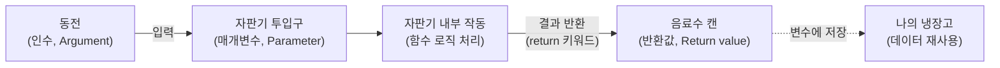
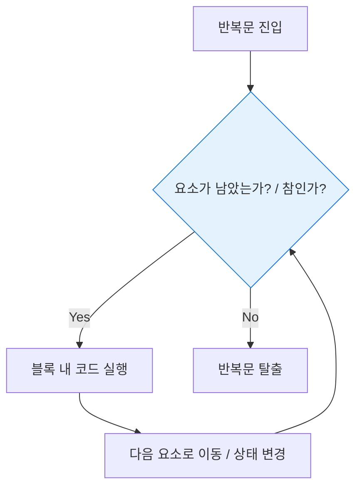

# 마이크로 세션: 057 — 함수의 매개변수와 반환값

> **세션 ID**: MS-PY101-057  
> **소요 시간**: 25분  
> **난이도**: ★★☆  
> **청크 타입**: narrative  
> **버전**: v2.1 (7섹션 구조)

---

## §1. 개요

> **Day 3 | PM | 세션 057/064**

이 세션은 이전 시간에 배운 함수의 기본 개념을 한 단계 확장하여, 함수가 외부 세계와 소통하는 두 가지 필수 통로인 매개변수(Parameter)와 반환값(Return)을 다룹니다. 아무리 훌륭한 로직을 가진 함수라도 외부에서 데이터를 받아오거나 작업 결과를 내보내지 못하면 쓸모가 없어요. 여기서 매개변수와 반환값의 역할을 확실히 이해해야, 앞으로 함수를 레고 블록처럼 연결해 거대한 프로그램을 조립할 수 있습니다.

### 🎯 학습 목표

이 세션이 끝나면 수강생은 다음을 할 수 있어요:

- 매개변수(Parameter)와 인수(Argument)의 개념을 구분하고, 기본값(Default)을 설정할 수 있습니다
- `print()`와 `return`의 결정적 차이를 이해하고 설명할 수 있습니다
- 반환값을 변수에 안전하게 저장하여 다른 로직에서 재사용할 수 있습니다

### 선행 세션 환기

이전 세션(056)에서 우리는 함수를 "나만의 레시피 카드" 또는 "레고 블록"으로 정의했어요. 반복되는 코드를 `def` 키워드로 묶어 이름을 붙이는 법을 배웠죠. 이번 세션에서는 그 레시피 카드에 재료를 적어 넣는 빈칸과, 완성된 요리를 내보내는 출구를 추가할 거예요.

---

## §2. 핵심 개념 (+ 🗣️ 강사 대본 + Mermaid)

### 자판기와 붕어빵 기계 비유

함수가 외부 세계와 단절된 채로 자기 혼자만 웅얼거린다면 쓸모없는 코드가 됩니다. 함수를 붕어빵 기계나 자판기로 상상해 보세요. 자판기가 작동하려면 사용자가 동전을 넣어야 하고, 그 대가로 툭 떨어뜨려 주는 시원한 음료수를 받을 수 있어야 해요. 여기서 사용자가 밀어 넣는 동전이 바로 매개변수(Parameter)이고, 자판기가 내어주는 음료수가 바로 반환값(Return)입니다.

🗣️ **강사 대본 (Instructor Script)**:

> 지난 시간에 우리는 `def` 키워드를 사용해 나만의 레시피 카드를 만드는 법을 배웠습니다. 코드를 깔끔한 상자에 담아두고 필요할 때마다 이름을 부르기만 하면 되니 아주 편리해졌죠.
>
> 그런데 여기서 현실적인 문제가 하나 생깁니다. 아무리 훌륭한 붕어빵 기계가 있다고 하더라도, 팥을 넣으면 팥붕어빵이 나오고 슈크림을 넣으면 슈크림붕어빵이 나와야 진짜 유용한 기계일 거예요. 또, 기계가 붕어빵을 만들어주기만 하고 밖으로 꺼내주지 않는다면 우리는 영영 붕어빵을 먹을 수 없겠죠.
>
> 함수도 마찬가지입니다. 외부에서 함수 안으로 재료를 밀어 넣는 통로, 그리고 함수가 작업을 끝내고 결과물을 다시 외부로 뱉어내는 통로가 반드시 필요해요. 함수를 하나의 '자판기'라고 상상해 보겠습니다. 자판기가 정상적으로 작동하려면 반드시 우리가 동전을 넣어야 하죠. 이 동전이 바로 매개변수, 즉 파라미터(Parameter)입니다. 그리고 자판기가 윙윙 소리를 내며 작동한 뒤 툭 떨어뜨려 주는 시원한 콜라 한 캔, 그것이 바로 반환값, 리턴(Return)값이에요.
>
> 여기서 초보자분들이 가장 많이 헷갈리시는 부분이 바로 화면에 무언가를 띄워주는 `print`와 결과값을 내보내는 `return`의 차이입니다. 여러분, `print`는 식당 쇼윈도에 진열된 플라스틱 음식 모형과 같아요. 우리 눈에 보이고 "와, 맛있겠다"라고 출력은 해주지만, 진짜 음식이 아니기 때문에 집으로 가져가서 다른 요리에 또 쓸 수는 없어요. 반면 `return`은 셰프가 요리를 정성스럽게 포장해서 여러분 손에 직접 쥐여주는 것입니다. 포장된 요리는 집으로 가져가서 데워 먹을 수도 있고 친구에게 나누어줄 수도 있죠. 프로그램이 데이터를 계속 재사용하려면 반드시 플라스틱 모형이 아닌 진짜 포장된 요리, 즉 리턴을 써야 합니다!

> 💡 **강사 노트**: print와 return의 차이를 "쇼윈도 모형"과 "포장된 요리"로 비유하는 것은 수강생들의 직관적인 이해를 돕는 매우 강력한 장치입니다. 이 비유를 강조하며 실무에서 return이 얼마나 중요한지 환기해 주세요.

### Mermaid 다이어그램



이 다이어그램은 함수가 외부 세계와 소통하는 전체 흐름을 보여줍니다. 밖에서 밀어 넣은 데이터(인수)가 매개변수라는 투입구를 지나 함수 내부에서 가공된 후, `return`을 통해 결과물로 빠져나옵니다. 중요한 점은 반환된 값을 우리가 변수에 저장함으로써, 다른 곳에서 그 데이터를 재사용할 수 있다는 점이에요.

---


### 🎨 추가 시각화 (Visualization Packet)

**for/while 반복문 제어 흐름**

데이터의 끝에 도달하거나 조건을 만족할 때까지 동일한 코드를 빙글빙글 반복 실행합니다.



## §3. 상세 내용

### Why — 왜 매개변수와 반환값이 필요한가?

함수는 코드를 재사용하기 위해 만듭니다. 하지만 매개변수가 없다면 함수는 언제나 똑같은 결과만 만들어낼 수밖에 없어요. 반환값이 없다면 그 결과를 프로그램 내 다른 로직과 연결할 수 없습니다. 매개변수와 반환값은 닫혀 있는 함수라는 상자에 데이터가 들고 날 수 있도록 통로를 뚫어주는 역할을 합니다.

예를 들어, LLM의 작동 방식도 텍스트를 `print`만 하는 것이 아니라 `return`하여 다음 프롬프트의 재료로 넘겨주는 방식이에요. AI 에이전트가 찾아낸 웹 페이지 링크를 반환해야만 다음 단계의 에이전트가 그 링크를 요약 작업에 쓸 수 있는 것과 같은 이치입니다.

### What — 매개변수와 반환값의 주요 개념

1. **매개변수(Parameter)와 인수(Argument)**
   - **매개변수**: 함수를 정의할 때 괄호 안에 적어두는 '빈 바구니'의 이름이에요. "이 함수는 '가격'이라는 바구니를 준비해 놓고 기다리겠다"라고 선언하는 거죠.
   - **인수**: 우리가 함수를 실제로 호출할 때 그 빈 바구니에 집어넣는 실제 데이터(예: 10000원)를 말합니다.

2. **기본값(Default Value)**
   - 파이썬에서는 매개변수 바구니에 미리 기본값을 채워둘 수 있어요. 
   - 사용자가 값을 넘겨주지 않아도, 알아서 기본값을 적용해 계산을 해주는 아주 친절한 기능입니다.

3. **반환값(Return Value)**
   - `return` 키워드를 만나면, 파이썬은 즉시 함수의 실행을 종료하고 `return` 뒤에 적힌 값을 함수를 호출했던 자리로 휙 던져줍니다.
   - 던져진 이 값은 변수에 담아서 다른 연산에 무한히 다시 꺼내 쓸 수 있습니다.

### How — 구체적으로 어떻게 코딩하는가?

쇼핑몰에서 사용할 법한 가격 할인 계산기 함수를 통해 매개변수와 반환값의 앙상블을 직접 눈으로 확인해 봅니다. 가격과 할인율이라는 두 개의 바구니를 준비했고, 할인율에는 10%라는 기본값을 미리 세팅했어요.

```python
def calculate_discount(price: float, rate: float = 0.1) -> float:
    # return 키워드를 사용해 계산 결과를 외부로 던져줍니다
    return price * (1 - rate)
    
# 함수를 호출하면서 만 원(10000)을 인수로 전달
# rate는 따로 넘겨주지 않았으니 기본값 0.1이 적용됨
final_price = calculate_discount(10000)

print(f"할인가: {final_price}") # 변수에 저장해두었기에 언제든 재사용 가능
```

---

## §4. 실습 가이드 (+ 🎙️ 실습 대본)

### 실습 목표

수강생들이 직접 편집기에 가격 할인 계산기 함수를 작성하고, 기본값을 활용해 함수를 호출해 봅니다. 또한, 반환값을 변수에 저장하여 출력하는 흐름을 손으로 익히는 것이 이 실습의 핵심이에요.

🎙️ **실습 가이드 대본 (Lab Guide)**:

> 여러분도 각자의 편집기에 이 코드를 적어보세요. 함수를 정의하는 첫 줄을 보면, 파라미터로 `price`와 `rate`가 선언되어 있어요. 특히 `rate: float = 0.1`이라고 쓰여 있는데, 이것이 바로 기본값입니다.
>
> 이제 함수 밖으로 나와 아랫줄을 볼까요? `calculate_discount(10000)` 함수를 호출하면서 만 원이라는 데이터 딱 하나만 넘겼습니다. 바구니는 두 개인데 데이터를 하나만 보냈어요. 에러가 날까요? 나지 않습니다! 파이썬이 알아서 두 번째 바구니에 0.1이라는 기본값을 채워 넣고 계산을 마친 뒤 구천 원이라는 값을 돌려주기 때문이죠.
>
> 이렇게 리턴되어 돌아온 구천 원은 `final_price`라는 변수에 안전하게 포장되어 저장됩니다. 이렇게 변수에 저장해 두었기 때문에 우리는 이 값을 당장 화면에 출력해 볼 수도 있고, 나중에 부가세를 더하는 다른 함수에 또 집어넣을 수도 있는 거예요.
>
> 직접 코드를 수정해 보세요. 만약 여러분이 20% 할인을 적용하고 싶다면 함수를 호출할 때 괄호 안에 `(10000, 0.2)`라고 적어보시기 바랍니다. 기본값이 무시되고 여러분이 입력한 20%가 적용되어 8000원이 리턴되는 것을 확인할 수 있을 겁니다!

### 단계별 지시

| 단계 | 소요 시간 | 강사 지시사항 | 학습자 액션 | 예상 결과 |
|------|----------|--------------|------------|----------|
| 1 | 2분 | 편집기에 `calculate_discount` 함수 코드 작성 안내 | 코드 타이핑 | 기본 함수 작성 완료 |
| 2 | 3분 | 인수 하나만 넣어 실행하고 결과 확인 | 함수 실행 | 9000.0 출력 확인 |
| 3 | 3분 | 인수 두 개를 모두 넣어 20% 할인 실행 지시 | `(10000, 0.2)`로 수정 후 실행 | 8000.0 출력 확인 |
| 4 | 2분 | `return`을 `print`로 바꾸면 어떻게 되는지 눈으로 확인하기 유도 | `return` 대신 `print` 작성 시도 | 반환값이 `None`이 되는 것 확인 (충격 효과) |

### 트러블슈팅 FAQ

| Q | A |
|---|---|
| 기본값을 여러 개 넣을 수도 있나요? | 네! 여러 개 넣을 수 있습니다. 단, 기본값이 있는 매개변수는 반드시 기본값이 없는 매개변수보다 뒤에 와야 합니다. |
| 함수에서 `return`을 안 쓰면 어떻게 되나요? | 파이썬은 숨겨진 빈 상자인 `None`을 자동으로 반환합니다. 식당에서 빈 포장지를 건네주는 것과 같아요. |

> ✅ **체크포인트**: 함수에서 `print`와 `return`의 차이를 완벽히 이해하고, 결괏값을 변수에 담을 수 있나요?

---


### 🎓 강사 노트 (Instructor Support)

- ⏱️ **타이밍**: 15:30 (25분, code)
- 🎯 **핵심 활동**: 입력→처리→출력 흐름
- ⚠️ **강사 주의사항**: 매개변수 vs 인수 용어 정리

## §5. 코드 및 명령어 모음

### 가격 할인 계산기

이 코드는 실무에서도 흔히 접할 수 있는 매개변수 기본값과 반환값의 전형적인 예시입니다.

```python
# 가격 할인 계산기 함수
def calculate_discount(price: float, rate: float = 0.1) -> float:
    """가격과 할인율을 받아 할인가를 반환합니다. 기본 할인율은 10%입니다."""
    return price * (1 - rate)
    
# 1. 인수를 1개만 전달 (기본값 적용)
final_price_1 = calculate_discount(10000)
print(f"기본 할인가: {final_price_1}")  # 9000.0

# 2. 인수를 2개 모두 전달 (기본값 무시)
final_price_2 = calculate_discount(10000, 0.2)
print(f"특별 할인가: {final_price_2}")  # 8000.0
```

> 🤖 **AI 프롬프트 예시**:
> "Gemini, 내가 만든 `calculate_discount` 함수에서 할인율이 0보다 작거나 1보다 클 때 에러 메시지를 반환하도록 코드를 수정해줘."

---

## §6. 요약

### 핵심 학습 포인트

이번 세션에서 배운 가장 중요한 세 가지예요.
1. **자판기의 동전, 매개변수**: 외부에서 함수 안으로 데이터를 밀어 넣는 통로이며, 인수를 받아 바구니처럼 담아둡니다.
2. **친절한 기본값(Default)**: 매개변수에 미리 기본값을 설정해 두면, 사용자가 값을 생략해도 알아서 동작하는 유연한 함수를 만들 수 있습니다.
3. **포장된 요리, 반환값(Return)**: `print`는 화면에 보여주기만 할 뿐 재사용할 수 없어요. 실제 로직에서 데이터를 계속 활용하려면 반드시 `return`으로 값을 밖으로 내보내 변수에 저장해야 합니다.

### 다음 세션 예고

오늘 우리는 함수를 진짜 쓸모 있게 만들어주는 두 개의 통로를 배웠습니다. 이렇게 함수를 자유자재로 다루게 된 여러분은 이제 나만의 레시피 카드를 수백 개라도 만들어낼 수 있는 강력한 무기를 얻었어요. 그런데 프로그래밍을 하다 보면 문자의 길이를 세거나 숫자들의 합을 구하는 등 정말 뻔하고 자주 쓰이는 기능들이 있어요. 이걸 매번 직접 만들어야 할까요? 다음 세션에서는 파이썬이 우리를 위해 미리 꽉꽉 채워둔 '만능 공구함', 바로 **내장 함수(Built-in Functions)**들에 대해 탐험해 보겠습니다.

### 브릿지 노트

> "프린트는 쇼윈도의 음식 모형, 리턴은 포장된 진짜 요리! 이 비유를 절대 잊지 마세요. 자, 이제 우리가 굳이 함수를 만들지 않아도 파이썬이 알아서 포장까지 완벽하게 해주는 기막힌 공구함들을 구경하러 가볼까요?"

---

## §7. 참고 자료

### 3-Source 출처

- **Source A (로컬 참고자료)**: 「8 코딩.pdf」, 「AI 시대의 서사 v3 - Claude.md」 — 함수에서 return과 print의 차이를 비유적으로 설명하는 로직과, 반환값의 재사용성을 설명하는 핵심 메타포 참조.
- **Source B (NotebookLM)**: NotebookLM Day 3 분석 리포트 — LLM의 작동 방식 역시 print가 아닌 return을 통해 텍스트를 파이프라인으로 연결하는 구조라는 점을 반영하여 AI 연계 설명 제공.
- **Source C (Deep Research)**: Deep Research Day 3 보고서 — 실무에서 AI 에이전트들이 1단계 결과를 2단계로 넘겨주기 위해 어떻게 매개변수와 반환값을 활용하는지 파이프라인 관점에서의 설명 추가.

### 강사 노트

> 💡 **강사 노트**: 본 세션은 수강생들이 함수를 처음 배울 때 가장 많이 겪는 혼란(print vs return)을 해소하는 데 집중합니다. 함수 호출 결과를 변수에 담지 않고 허공에 날려버리거나, return을 빼먹고 print만 적어놓고 왜 다음 줄에서 에러가 나는지 모르는 경우가 태반입니다. "자판기"와 "식당 쇼윈도 모형" 비유를 반복적으로 사용하여, 데이터를 '재사용'하려면 반드시 반환값을 변수에 담아야 함을 각인시켜 주세요.

---

## ✅ 세션 완료 체크리스트 (강사용)

- [ ] §1~§7 모든 섹션이 충실하게 작성되었는가?
- [ ] 매개변수, 인수, 기본값, 반환값의 차이가 명확히 설명되었는가?
- [ ] print와 return의 차이를 설명하는 비유(쇼윈도 모형 vs 포장된 요리)가 포함되었는가?
- [ ] 자판기 비유를 표현하는 Mermaid 다이어그램이 포함되었는가?
- [ ] 3-Source 팩트 패킷의 내용이 반영되었는가?

---

*작성 일시: 2026-02-25*  
*작성 에이전트: A4B_Session_Writer*  
*교안 구조: 7섹션 (A0 팀 공통 표준)*