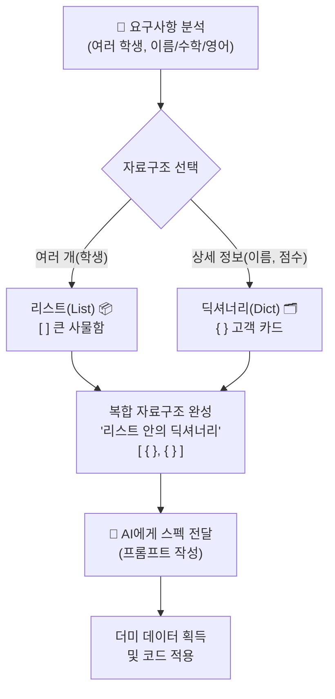

# 마이크로 세션: 060 — [종합 실습 1] 학생 성적 관리 데이터 모델링

> **세션 ID**: MS-PY101-060  
> **소요 시간**: 20분  
> **난이도**: ★★☆ (Medium)  
> **청크 타입**: lab  
> **버전**: v2.1 (7섹션 구조)

---

## §1. 개요

> **Day 3 | PM | 세션 060/064**

### 🎯 학습 목표

이 세션이 끝나면, 수강생은 다음을 할 수 있습니다:

- 실제 요구사항을 파악하고 '리스트'와 '딕셔너리'를 결합한 복합 자료구조(List of Dicts)로 데이터를 모델링할 수 있다
- AI 에이전트에게 명확한 데이터 구조 스펙을 제공하여 초기 더미(Dummy) 데이터를 생성할 수 있다
- 생성된 데이터 구조를 파이썬 스크립트에 적용하고 터미널에서 올바르게 출력되는지 검증할 수 있다

### 선행 세션 환기

여러분, Day 3를 거쳐오면서 우리는 참 많은 도구를 배웠어요. 상자(변수), 사물함(리스트), 서랍장(딕셔너리) 같은 데이터를 담는 그릇부터, 신호등(조건문), 쳇바퀴(반복문), 레고 블록(함수) 같은 흐름 제어 도구까지 말이죠. 지금까지는 이 부품들을 하나하나 떼어서 연습했다면, 이제 드디어 이 모든 것을 하나로 조립해서 진짜 돌아가는 '학생 성적 관리 시스템'을 만들어 볼 차례예요. 오늘은 그 첫걸음인 '기초 공사'에 들어갑니다.

---

## §2. 핵심 개념 (+ 🗣️ 강사 대본 + Mermaid)

### 기초 공사: 데이터 모델링의 중요성

집을 지을 때 가장 먼저 하는 일이 뭘까요? 예쁜 지붕을 올리거나 벽지를 바르나요? 아니죠. 땅을 단단하게 파고 튼튼한 기초 뼈대를 세우는 일부터 시작합니다. 프로그래밍에서 이 기초 공사를 우리는 **'데이터 모델링'**이라고 부릅니다. 

어떤 모양의 상자와 사물함을 준비해야 성적 데이터를 안전하게 담을 수 있을지 결정하는 단계입니다. 이 그릇을 처음에 잘못 설계하면, 나중에 데이터를 꺼내 쓰거나 수정할 때 프로그램 전체가 우르르 무너져 내리게 됩니다.

🗣️ **강사 대본 (Instructor Script)**:

> 여러분, 드디어 Day 3의 마지막 고지이자 하이라이트인 종합 실습입니다! 박수 한번 칠까요? (짝짝짝) 
>
> 바이브 코딩으로 AI에게 "성적 프로그램 대충 짜줘!"라고 부탁하면 어떨까요? AI가 알아서 짜주긴 하겠죠. 하지만 십중팔구 자기 멋대로 이상한 데이터 구조를 잡아올 겁니다. 우리는 SDD, 즉 명세 주도 개발(Specification-Driven Development) 철학을 배운 AI-native 개발자입니다. 
>
> "데이터 구조는 무조건 내가 정한 대로 해!"라고 AI를 통제하는 것이 오늘 우리의 첫 번째 임무입니다. AI에게 코드 작성의 주도권을 넘겨주더라도, 시스템의 '뼈대'만큼은 인간 개발자인 여러분이 직접 설계하고 지시해야 합니다. 그래야 코드가 내 예상대로 정확하게 움직이거든요.

### Mermaid 다이어그램: 데이터 구조 설계 흐름



---

## §3. 상세 내용

### Why — 왜 '리스트 안의 딕셔너리'인가?

요구사항을 분석해 볼까요? "여러 학생의 이름, 수학 점수, 영어 점수를 저장해야 한다." 

이 한 문장에서 우리는 두 가지 결정적인 힌트를 뽑아내야 합니다. 
첫째, '여러 학생'을 한 번에 담아야 하니까 아주 큰 번호표 사물함인 **리스트(List)**가 필요합니다.
둘째, 한 학생당 '이름', '수학', '영어'라는 구체적인 상세 정보가 3개나 있죠? 이건 각각에 의미 있는 이름표를 붙여둘 수 있는 **딕셔너리(Dictionary)** 고객 카드를 써야 합니다.

세션 051에서 배웠던 바로 그 실무 패턴, **'리스트 안의 딕셔너리 (List of Dicts)'** 구조가 바로 이럴 때 쓰는 정답입니다. 이 구조 하나만 제대로 설계해두면 웹 서비스, 데이터베이스, 심지어 엑셀 파일과 데이터를 주고받을 때도 막힘이 없어요.

### What — AI를 활용한 기초 공사 명세 (SDD)

우리가 괄호 하나, 쉼표 하나까지 직접 키보드로 치고 있을 필요가 있을까요? 쉼표 하나를 빼먹어서 빨간 에러 메시지와 싸우는 건 옛날 방식이에요. 

우리는 AI에게 명확한 '스펙'을 던져주기만 하면 됩니다. 
* "리스트 안에 딕셔너리가 들어가는 구조로 만들어줘."
* "딕셔너리 키는 '이름', '수학', '영어'로 해줘."
* "학생 3명 분의 가짜 데이터(더미 데이터)를 채워줘."

이렇게 명확하게 구조를 지시하는 프롬프트를 쓰면, AI가 한 치의 오차도 없이 튼튼한 파이썬 뼈대 코드를 짜줄 겁니다. 오타 걱정 없이 바로 로직 구현으로 넘어갈 수 있는 것이죠.

### How — 코드에 적용하고 검증하기

AI가 만들어준 데이터를 그냥 눈으로 보고 넘어가면 안 됩니다. 반드시 우리의 파이썬 스크립트 파일 최상단에 붙여넣어 변수로 선언하고, `print()` 함수를 통해 화면에 제대로 출력되는지 눈으로 확인해야 해요. 기초 공사가 잘 되었는지 콘크리트를 두드려보는 과정입니다.

> ✅ **체크포인트**: 스스로 점검해 보세요.
> - 여러 학생의 데이터를 묶을 때 딕셔너리가 아닌 리스트를 최상위 구조로 쓰는 이유는 무엇인가요?
> - AI에게 코드를 맡길 때 명확한 스펙(명세)을 주지 않으면 어떤 일이 발생할까요?

---

## §4. 실습 가이드 (+ 🎙️ 실습 대본)

### 실습 목표

AI 에이전트의 도움을 받아 명세에 맞는 `students` 리스트 구조를 생성하고, 새로운 파이썬 파일에 저장한 뒤 실행하여 결과를 확인합니다.

🎙️ **실습 가이드 대본 (Lab Guide)**:

> 자, 직접 기초 공사를 시작해 봅시다. 화면의 Antigravity IDE를 열어주세요. 
> 
> 코딩을 시작할 때 빈 화면을 보면 누구나 막막하죠? 그럴 땐 무조건 '데이터 상자'부터 만든다고 생각하세요. 데이터가 어떻게 생겼는지 눈앞에 펼쳐놓으면 코딩은 절반 이상 끝난 겁니다. 
>
> 지금부터 우리는 AI 비서에게 명확한 지시를 내리는 프롬프트 엔지니어가 될 거예요. 대충 짜달라고 하지 마시고, 괄호의 형태와 키(Key) 이름까지 콕 집어서 명령해 보세요!

### 단계별 실습 지시사항

| 단계 | 소요 시간 | 강사 지시사항 | 학습자 액션 | 예상 결과 |
|------|----------|--------------|------------|----------|
| 1 | 2분 | "새로운 파이썬 파일을 만드세요" | 탐색기에서 새 파일 `grade_manager.py` 생성 | 빈 스크립트 파일 생성 |
| 2 | 3분 | "AI에게 데이터 구조 스펙을 지시하세요" | Agent 창에 명세 프롬프트 입력 | AI가 파이썬 코드 블록을 생성 |
| 3 | 2분 | "코드를 복사해서 파일에 붙여넣으세요" | 생성된 코드를 복사하여 `grade_manager.py`에 붙여넣기 | 코드 에디터에 데이터 변수 표시 |
| 4 | 2분 | "print문으로 데이터를 출력해보세요" | 파일 맨 아래에 `print(students)` 작성 후 실행 | 하단 터미널에 리스트와 딕셔너리 데이터 출력 |

**[단계 1] 새로운 프로젝트 파일 생성하기**

Antigravity IDE의 왼쪽 폴더 탐색기에서 마우스 우클릭을 하고 '새 파일'을 선택합니다. 파일 이름은 `grade_manager.py`라고 지어주세요. 이제 이 파일이 오늘 우리가 짓게 될 성적 관리 시스템의 본거지가 될 거예요.

**[단계 2] AI에게 구조 스펙 전달하기**

우측 Agent Manager 채팅창에 다음 프롬프트를 정확히 입력하세요. 핵심은 "구조를 명확히 지정한다"는 것입니다.

```text
학생 성적 관리를 위한 초기 파이썬 데이터를 만들어줘. 
조건은 다음과 같아:
1. 변수명은 students 로 해줘.
2. 최상위는 리스트(List)이고, 그 안에 딕셔너리(Dict)가 들어가는 구조야.
3. 딕셔너리 키는 'name', 'math', 'english' 로 통일해줘.
4. 더미 데이터(가짜 데이터)로 학생 3명 분을 미리 채워줘.
파이썬 코드만 출력해.
```

**[단계 3] 코드 붙여넣기 및 확인**

AI가 대괄호(`[]`) 안에 중괄호(`{}`)가 들어있는 예쁜 형태의 코드를 만들어주었나요? 그렇다면 그 코드를 복사해서 조금 전 만든 `grade_manager.py` 파일 맨 위에 붙여넣으세요. 혹시 AI가 리스트 없이 딕셔너리만 여러 개 만들었다면, 프롬프트를 다시 수정해서 요구해야 합니다!

**[단계 4] 출력 검증하기**

파일의 맨 아랫줄에 다음 한 줄을 추가합니다.

```python
print(students)
```

그리고 터미널 창을 열어 `python grade_manager.py` 명령어를 치거나 IDE의 실행 버튼(▶)을 눌러보세요. 
하단 콘솔에 대괄호와 작은따옴표들이 섞인 여러분의 멋진 데이터가 잘 출력된다면 기초 공사 대성공입니다!

---


### 🎓 강사 노트 (Instructor Support)

- ⏱️ **타이밍**: 16:55 (20분, lab)
- 🎯 **핵심 활동**: 학생 성적 관리 자료구조 설계
- ⚠️ **강사 주의사항**: 스펙 분석→구조 결정


### 📋 실습 설계 보강 (Lab Packet)

**세션 060 실습 설계 보강**

[종합 실습 1] 학생 성적 관리 데이터 모델링
- **3-Stage Example Set**
  - 기본: AI에게 "students 리스트+딕셔너리 구조, 학생 3명 더미 데이터" 요청 → print 확인
  - 변형: "과목을 3개로 늘려줘" 또는 "학년 정보도 추가해줘"
  - 실수 해결: 딕셔너리 키 이름 오타(`'일름'` vs `'이름'`) → KeyError 발생 → AI에게 디버깅
- **난이도 예측**: 복합 자료구조(`[{}, {}]`) 개념이 비전공자에게 추상적
- **타이밍 가이드**: 스펙 분석 3분 | 프롬프트 작성·생성 5분 | 데이터 확인 5분 | 변형 실험 5분 | 정리 2분
- **심리적 장벽**: "대괄호 안에 중괄호가 들어간다고? 너무 복잡해요"
- **자가 점검**:
  - [ ] `students` 변수를 `print()`로 출력해서 데이터 구조를 확인했는가?
  - [ ] `students[0]['이름']`으로 첫 번째 학생 이름에 접근할 수 있는가?
  - [ ] 왜 리스트+딕셔너리 구조가 필요한지 설명할 수 있는가?

## §5. 코드 및 명령어 모음

### 완성된 `grade_manager.py` 초기 뼈대 코드 (예시)

```python
# 학생 성적 관리 초기 데이터 (List of Dicts)
students = [
    {'name': '김철수', 'math': 90, 'english': 80},
    {'name': '이영희', 'math': 95, 'english': 100},
    {'name': '박민수', 'math': 70, 'english': 65}
]

# 데이터 모델링 검증용 출력
print("초기 데이터 구조:")
print(students)
```

### 터미널 실행 명령어

```bash
# 작성한 파이썬 스크립트 실행
python grade_manager.py
```

> 🤖 **AI 프롬프트 예시 (오류 수정용)**: 
> 코드를 실행했는데 에러가 난다면, 전체 코드를 복사해서 AI에게 이렇게 물어보세요: 
> "이 코드를 실행하니까 괄호 관련 SyntaxError가 나. 어디서 쉼표나 괄호가 빠졌는지 찾아서 고쳐줘."

---

## §6. 요약

### 핵심 학습 포인트

이번 실습에서는 복잡한 프로그램 개발의 가장 첫 단추인 **데이터 모델링**을 직접 해보았습니다. 
여러 명의 학생은 **리스트(List)**로 묶고, 각 학생의 구체적인 점수 정보는 **딕셔너리(Dict)**에 담는 '리스트 안의 딕셔너리' 구조가 현대 파이썬 개발에서 얼마나 중요한지 배웠습니다. 또한, AI에게 단순히 코딩을 맡기는 것이 아니라, **명확한 스펙(SDD)**을 제시하여 우리가 원하는 형태의 데이터를 통제하며 얻어내는 프롬프트 엔지니어링의 기본기도 함께 다졌습니다.

### 다음 세션 예고

수고하셨습니다! 데이터라는 훌륭한 식재료가 완벽한 그릇에 담겨 도마 위에 올라왔습니다. 

그런데 수학 점수와 영어 점수를 이대로 가만히 두면 아무 의미가 없겠죠? 다음 세션(061)에서는 Day 3에서 배웠던 `for`문과 함수를 찰지게 조합해서, 이 재료들을 지지고 볶을 겁니다. 각 학생별 평균을 구하고 "합격"인지 "불합격"인지 등급표를 붙여주는 본격적인 비즈니스 로직(레시피)을 만들어 보겠습니다.

---

## §7. 참고 자료

### 3-Source 출처

- **Source A (로컬 참고자료)**: 「8 코딩.pdf」 §8.8 — 변수, 자료구조(리스트, 딕셔너리)의 기초 및 복합 자료구조 설계 개념
- **Source B (NotebookLM)**: SRC-B01 day3 — 학생 성적 관리 프로그램 데이터 설계 및 AI 프롬프트 스펙 지시 방법론
- **Source C (Deep Research)**: SRC-C01 day3 — 명세 주도 개발(SDD) 철학에 기반한 AI 에이전트 코드 생성 및 제어 방법론

### 강사 노트

> 💡 **강사 노트**: 
> 이 세션은 코딩 자체보다 "어떻게 구조를 잡을 것인가?"를 고민하게 만드는 것이 핵심입니다. 학생들 중 일부는 AI가 중괄호를 누락하거나 키 이름을 다르게 생성하는 경우를 겪을 수 있습니다. 이때 당황하지 말고 "AI는 항상 완벽하지 않습니다. 그래서 우리가 스펙을 통제해야 하는 겁니다"라고 강조하며 수정하는 경험을 유도해 주세요. `print` 출력 시 글자가 옆으로 길게 나오는 것은 정상이므로 걱정하지 않도록 안내합니다.

---

**🔗 선행 세션**: [세션-044~059] Day 3 변수부터 제어문/함수까지  
**🔗 후행 세션**: [세션-061] [종합 실습 2] 제어문과 함수로 로직 구현  

---

*작성 일시: 2026-02-25*  
*작성 에이전트: A4B_Session_Writer*  
*교안 구조: 7섹션 (A0 팀 공통 표준)*
