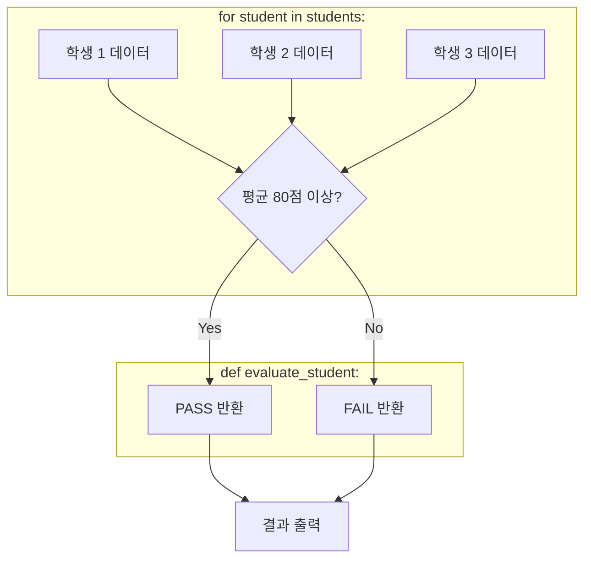

# 마이크로 세션: 061 — [종합 실습 2] 제어문과 함수로 로직 구현

> **세션 ID**: MS-PY101-061  
> **소요 시간**: 25분  
> **난이도**: ★★★ (High)  
> **청크 타입**: lab  
> **Day/시간대**: Day 3 | PM | 세션 061/064  
> **버전**: v2.1 (7섹션 구조)  

---

## §1. 개요

> **Day 3 | PM | 세션 061/064**

### 🎯 학습 목표

이 세션이 끝나면, 수강생은 다음을 할 수 있습니다:

- 복잡한 비즈니스 로직을 함수(기계)와 제어문(컨베이어 벨트)으로 분리하여 모듈화할 수 있다.
- AI 에이전트에게 명확한 단계별 프롬프트를 제공하여 원하는 함수와 반복문 코드를 생성할 수 있다.
- 생성된 파이썬 코드를 올바른 순서로 조립하고 실행하여 학생 데이터의 PASS/FAIL 결과를 판별할 수 있다.

### 선행 세션 환기

이전 세션(060)에서 우리는 흩어진 데이터들을 모아 `students`라는 이름의 리스트 안에 딕셔너리로 묶는 '데이터 모델링'을 성공적으로 마쳤습니다. 기초 공사인 데이터 설계가 튼튼하게 끝났으니, 이제 요구사항 정의서의 두 번째 미션을 해결할 차례입니다. "각 학생의 수학과 영어 점수 평균을 구하고, 그 평균이 80점 이상이면 'PASS', 아니면 'FAIL'을 판별해서 출력하라." 

단순한 데이터에 생명력을 불어넣는 비즈니스 로직의 세계로 들어가 보겠습니다.

---

## §2. 핵심 개념 (+ 🗣️ 강사 대본 + Mermaid)

### 로직 모듈화 = "공장의 컨베이어 벨트"

복잡한 명령을 파이썬 코드로 바꿀 때, 한 줄의 코드로 모든 것을 처리하려고 하면 머리에 쥐가 나고 체하게 됩니다. 이럴 때는 **'공장의 컨베이어 벨트'**를 상상해야 합니다. 똑똑한 공장장은 직원 한 명에게 조립부터 도색, 포장까지 혼자 다 하라고 시키지 않아요. 대신 전용 기계를 세우고, 부품을 벨트에 올려 기계에 하나씩 통과시킵니다.

이것이 프로그래밍의 핵심인 **'모듈화(Modularity)'**입니다. 조립 기계와 도색 기계는 '함수(`def`)'가 되고, 빙글빙글 도는 컨베이어 벨트는 '반복문(`for`)'이 되며, 벨트에 올라가는 부품은 우리가 만든 '학생 데이터(딕셔너리)'가 되는 구조입니다.

🗣️ **강사 대본 (Instructor Script)**:

> 여러분, 기초 공사인 데이터 모델링이 완벽하게 끝났습니다. 이제 진짜 코딩의 꽃, 로직을 짤 시간입니다. 미션은 각 학생의 점수 평균을 내고 80점을 기준으로 PASS와 FAIL을 나누는 거예요.
>
> 이 복잡한 명령을 어떻게 한 번에 해결할까요? 정답은 '한 번에 하지 않는다'입니다. 공장의 공장장이 되었다고 생각해보세요. 먼저 평균을 구하고 PASS를 판별해 주는 '평균 계산 판독기'라는 전용 기계를 하나 만듭니다. 그 다음에는 100명의 학생 데이터를 for문이라는 컨베이어 벨트에 올립니다. 벨트가 돌아가면서 학생 데이터가 기계에 하나씩 쏙쏙 들어가고, 결과물이 깔끔하게 튀어나오는 거죠. 
> 
> AI에게 지시를 내릴 때도 마찬가지예요. 기계를 만들어 달라는 지시와, 벨트를 돌려 달라는 지시를 명확하게 두 단계로 나눠서 프롬프트를 작성하면 아주 똑똑한 코드를 얻을 수 있습니다.

### Mermaid 다이어그램



---

## §3. 상세 내용

### Why — 왜 로직을 쪼개서 지시해야 하는가?

AI에게 한 번에 "학생 리스트에서 평균 구해서 패스 여부 출력하는 코드 다 짜줘"라고 뭉뚱그려 말해도 코드를 주기는 합니다. 하지만 이렇게 만들어진 코드는 재사용하기가 너무 어렵습니다. 나중에 특정 학생 한 명의 데이터만 따로 판별하고 싶을 때, 통째로 얽혀 있는 코드에서는 그 기능만 빼낼 수가 없거든요. 기계(함수)를 따로 만들어 두면 언제 어디서든 그 기계만 떼어서 다시 쓸 수 있습니다.

### What — 모듈화의 두 가지 요소

1. **판독 기계 (함수)**: 학생 1명의 서랍장(딕셔너리)을 집어넣으면, 안에서 수학과 영어 점수를 꺼내 평균을 계산하고, `if`문으로 80점 이상인지 확인한 뒤 'PASS'나 'FAIL'이라는 결과물을 뱉어내는(`return`) 부품입니다.
2. **컨베이어 벨트 (for문)**: 우리가 앞서 만든 100명짜리 사물함(`students` 리스트)을 처음부터 끝까지 빙글빙글 순회하는 장치입니다. 벨트가 한 칸 움직일 때마다 학생 1명이 튀어나와서 아까 만든 판독 기계에 들어가게 됩니다.

### How — 올바른 조립 순서

파이썬은 코드를 위에서 아래로 순서대로 읽습니다. 따라서 컨베이어 벨트를 돌리기 전에, 반드시 기계 조립(`def`)이 먼저 되어 있어야 해요. 만약 함수를 맨 밑에 적고 위에서 먼저 실행하려고 하면 파이썬은 "그런 기계는 본 적 없는데요?"라며 에러를 냅니다.

> ✅ **체크포인트**: 스스로 점검해 보세요.
> - 함수와 for 반복문을 각각 공장에 비유한다면 무엇이라고 할 수 있나요? (함수=특정 작업을 하는 전용 기계, for문=부품을 운반하는 컨베이어 벨트)
> - 파이썬에서 코드를 작성할 때, 함수를 호출하기 전에 반드시 먼저 해야 하는 일은 무엇인가요? (함수를 먼저 정의(`def`)해 두어야 함)

---

## §4. 실습 가이드 (+ 🎙️ 실습 대본)

### 실습 목표

수강생은 AI 프롬프트를 이용해 1) 학생을 평가하는 전용 함수를 만들고, 2) 학생 리스트를 순회하며 함수에 통과시키는 반복문 코드를 생성하여 실행해 봅니다.

🎙️ **실습 가이드 대본 (Lab Guide)**:

> 자, 여러분이 직접 공장장이 되어 AI를 지휘해 봅시다. 데이터(리스트)를 반복문(for)으로 돌리면서, 개별 처리(함수)와 판단(if)을 수행한다! 이것이 파이썬뿐만 아니라 지구상의 모든 프로그래밍 언어를 관통하는 절대적인 패턴입니다. 이 패턴을 AI에게 명확히 지시해 볼까요?
> 
> 오른쪽 프롬프트 창을 열어주세요. 방금 만든 `students` 리스트 코드가 들어있는 파이썬 파일을 그대로 열어둔 채로 진행합니다. 첫 번째로 '평균 계산 판독기' 기계부터 주문하겠습니다!

### 단계별 실습 지시

| 단계 | 소요 시간 | 강사 지시사항 | 학습자 액션 | 예상 결과 |
|------|----------|--------------|------------|----------|
| 1 | 5분 | "첫 번째 기계(함수)를 AI에게 주문하세요" | 아래 프롬프트 1을 AI에게 입력 | `evaluate_student` 함수 코드 생성됨 |
| 2 | 3분 | "만들어진 함수를 파일 상단에 조립하세요" | 코드를 복사하여 `students` 리스트 아래에 붙여넣기 | 에러 없이 함수가 코드 상단에 안착됨 |
| 3 | 5분 | "컨베이어 벨트(for문)를 만들어 돌리세요" | 아래 프롬프트 2를 AI에게 입력 | `for student in students:` 코드 생성됨 |
| 4 | 2분 | "파일 맨 아래에 붙여넣고 실행해 보세요" | 코드를 파일 하단에 복사하고 실행 버튼 클릭 | 3명 학생의 이름, 평균, PASS/FAIL 출력 |

**[단계 1~2] 기계(함수) 조립하기**

AI 프롬프트 창에 다음과 같이 입력하세요. 한 번에 다 해달라고 하지 않고, 기계만 먼저 정확하게 주문하는 것이 핵심입니다.

> **🤖 프롬프트 1**: 학생 1명의 딕셔너리 데이터(이름, 수학, 영어)를 매개변수로 받아서 평균을 계산하고, 평균이 80점 이상이면 'PASS', 아니면 'FAIL'을 문자열로 반환(return)하는 파이썬 함수 `evaluate_student`를 짜줘.

AI가 `def evaluate_student(student):`로 시작하는 코드를 만들어 줄 겁니다. 이 코드를 복사해서, 이전에 만든 `students` 리스트 바로 아래 줄에 붙여넣어 주세요. (이때 들여쓰기가 깨지지 않도록 주의하세요!)

**[단계 3~4] 컨베이어 벨트 작동시키기**

이제 벨트를 돌려서 학생 데이터를 방금 만든 기계에 하나씩 넣을 차례입니다.

> **🤖 프롬프트 2**: 방금 만든 코드 아래에, `students` 리스트를 for문으로 순회하면서 각 학생을 `evaluate_student` 함수에 집어넣고, 그 결과(이름, 평균 점수, PASS/FAIL)를 f-string으로 보기 좋게 출력하는 코드를 짜줘.

AI가 `for student in students:`로 시작하는 코드를 주었을 겁니다. 이 코드를 파일 맨 아랫줄에 붙여넣고, 드디어 파이썬 파일을 실행해 봅니다!

### 트러블슈팅 FAQ

| 현상 | 원인 및 해결 방법 |
|------|-------------------|
| `NameError: name 'evaluate_student' is not defined` | 파이썬이 기계를 찾지 못한 겁니다. 함수(`def`)를 for문보다 아래에 적어두었기 때문이에요. 함수 블록을 for문보다 위쪽으로 옮겨주세요. |
| `TypeError: string indices must be integers` | 함수 안에 리스트 전체를 통째로 집어넣으려고 한 건 아닌지 확인해 보세요. `evaluate_student(students)`가 아니라 `evaluate_student(student)`처럼 한 명씩 들어가야 합니다! |
| 결과가 출력되지 않아요 | 함수 안에서 결과를 내보낼 때 `print`를 쓰고 정작 밖에서는 값을 받지 못했거나, `return`을 빼먹었을 수 있습니다. 함수 마지막 줄이 `return`인지 확인하세요. |

---


### 🎓 강사 노트 (Instructor Support)

- ⏱️ **타이밍**: 17:15 (25분, lab)
- 🎯 **핵심 활동**: 제어문+함수로 로직 작성
- ⚠️ **강사 주의사항**: AI와 협업 코딩


### 📋 실습 설계 보강 (Lab Packet)

**세션 061 실습 설계 보강**

[종합 실습 2] 제어문과 함수로 로직 구현
- **3-Stage Example Set**
  - 기본: AI에게 "students 데이터에서 각 학생의 평균을 구하는 함수" 요청 → 실행
  - 변형: "60점 미만이면 '재시험' 표시해줘" 조건문 추가
  - 실수 해결: "함수를 정의했는데 호출을 안 해서 아무것도 안 나와요" → 함수 호출부 추가
- **난이도 예측**: ★★★ for문 + 함수 + 조건문의 동시 활용이 최대 난관
- **타이밍 가이드**: 평균 함수 생성 7분 | 조건문 추가 7분 | 통합 테스트 5분 | 트러블슈팅 6분
- **심리적 장벽**: "for, if, def를 다 합쳐야 한다고?" — 인지 과부하
- **자가 점검**:
  - [ ] 각 학생의 평균 점수가 정확히 계산·출력되는가?
  - [ ] 조건에 따라 합격/불합격 판별이 이뤄지는가?
  - [ ] 함수를 정의(def)하고 호출하는 구조를 이해했는가?

## §5. 코드 및 명령어 모음

### 완성된 파이썬 스크립트 예시 (참고용)

학습자들이 최종적으로 완성하게 될 파이썬 코드의 구조입니다. AI가 생성해 주는 코드는 약간 다를 수 있지만, 핵심 논리는 동일합니다.

```python
# 1. 이전 세션에서 만든 데이터베이스
students = [
    {"name": "김철수", "math": 85, "eng": 92},
    {"name": "이영희", "math": 95, "eng": 98},
    {"name": "박민수", "math": 70, "eng": 65}
]

# 2. 전용 기계 (평가 함수)
def evaluate_student(student):
    # 평균 계산
    avg = (student["math"] + student["eng"]) / 2
    # PASS/FAIL 판별
    if avg >= 80:
        result = "PASS"
    else:
        result = "FAIL"
    
    return avg, result

# 3. 컨베이어 벨트 (for 순회)
for student in students:
    # 기계에 부품을 넣어 결과를 뽑아냄
    avg_score, pass_fail = evaluate_student(student)
    
    # f-string으로 결과 출력
    print(f"[{student['name']}] 평균: {avg_score:.1f}점 -> {pass_fail}")
```

---

## §6. 요약

### 핵심 학습 포인트

여러분, 정말 대단하십니다! 이번 세션을 통해 복잡해 보이는 비즈니스 로직도 쪼개고 보면 결국 "순서대로 반복하기(for)"와 "조건에 따라 판별하기(if)"일 뿐이라는 사실을 깨달으셨을 겁니다. 이 두 가지를 함수라는 기계로 묶어내고 벨트를 돌리기만 하면 아무리 방대한 시스템도 거뜬히 만들 수 있습니다. 특히, 파이썬 코드는 항상 위에서 아래로 흐르기 때문에 기계(함수 선언)를 먼저 배치하고, 그 다음에 벨트(함수 호출)를 작동시켜야 한다는 점을 절대 잊지 마세요.

### 다음 세션 예고

자, 개별 학생에 대한 성적 평가는 완벽하게 끝났습니다. 그런데 갑자기 교장 선생님이 시찰을 나와서 묻습니다. "음, 훌륭하군. 그런데 우리 반 전체 수학 평균은 몇 점인가? 최고점은 누구지?" 아뿔싸! 학생 낱명의 데이터는 아는데 반 전체의 집계 데이터가 없습니다. 

다음 세션에서는 우리가 아까 배웠던 강력한 다이소 공구함(내장 함수)과 압축팩(리스트 컴프리헨션)을 총동원해서, 이 프로그램에 '통계 분석기'를 부착해 보겠습니다.

### 브릿지 노트

> "하단 터미널 콘솔에 3명 학생의 이름, 평균 점수, 그리고 PASS/FAIL 여부가 예쁘게 출력되나요? 만약 에러 없이 한 번에 성공했다면, 여러분은 이제 AI와 대화하며 로직을 짜는 패턴을 완벽히 익히신 겁니다. 이제 교장 선생님의 추가 지시를 처리하러 바로 다음 세션으로 넘어가 볼까요?"

---

## §7. 참고 자료

### 3-Source 출처

- **Source A (로컬 참고자료)**: 「8 코딩.pdf」 §8.6, §8.8 — 함수와 반복문의 결합 패턴, 로직 복잡도 관리
- **Source B (NotebookLM)**: Day 3 노트 — "공장의 컨베이어 벨트" 비유를 활용한 모듈화 및 반복문 설명 모델
- **Source C (Deep Research)**: Day 3 리포트 — 모듈성(Modularity)의 기초 개념, 로직을 기계 단위로 쪼개는 프로그래밍 핵심 원리

### 강사 노트

> 💡 **강사 노트**: 실습 중에 수강생들이 함수 선언부(`def`)의 위치를 for문 아래로 두어 `NameError`를 발생시키는 경우가 매우 흔합니다. 파이썬의 인터프리터 특성(위에서 아래로 순차 번역)을 이 기회에 다시 한번 강조해주시면 좋습니다. 또한, AI가 `print`와 `return`을 혼용해서 코드를 짤 수 있으므로 코드를 리뷰할 때 `return`으로 값을 뱉어내는 것이 왜 중요한지(재사용성 측면) 설명해주시면 훌륭한 심화 학습이 됩니다.

---

## ✅ 세션 완료 체크리스트 (강사용)

- [ ] §1~§7 모든 섹션이 충실하게 작성되었는가?
- [ ] 컨베이어 벨트 비유가 모듈화(함수+반복문) 개념과 잘 연결되어 설명되었는가?
- [ ] 실습 가이드가 단계별 표 형태로 명확하게 제공되었는가?
- [ ] AI 프롬프트 예시 2가지가 모두 포함되었는가?
- [ ] 예상되는 에러(NameError, TypeError)에 대한 트러블슈팅 FAQ가 포함되었는가?
- [ ] Mermaid 다이어그램이 로직의 흐름을 시각적으로 잘 보여주는가?
- [ ] 구어체 대본(🗣️, 🎙️)이 자연스럽고 친근한 톤으로 작성되었는가?

---

**🔗 선행 세션**: [세션-060] [종합 실습 1] 학생 성적 관리 데이터 모델링 (필수)  
**🔗 후행 세션**: [세션-062] [종합 실습 3] 통계 분석기 추가  

---

*작성 일시: 2026-02-25*  
*작성 에이전트: Sisyphus-Junior*  
*교안 구조: 7섹션 (A0 팀 공통 표준)*