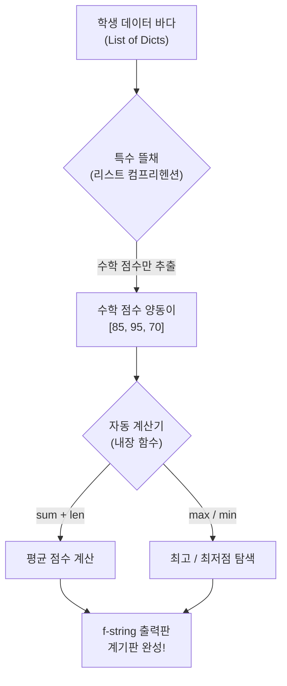
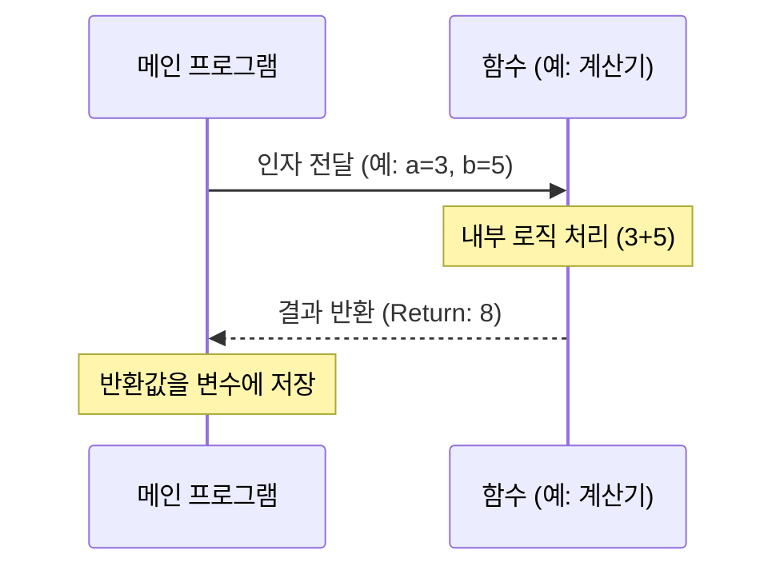

# 세션-062: 종합실습 — 통계분석

> **세션 ID**: MS-PY101-062  
> **소요 시간**: 25분  
> **난이도**: ★★★  
> **청크 타입**: lab  
> **Day / 시간대**: Day 3 / PM
> **버전**: v2.1 (7섹션 구조)

---

## §1. 개요

> **Day 3 | PM | 여덟 번째 세션 (062/064)**

### 🎯 학습 목표

이 세션이 끝나면, 수강생은 다음을 할 수 있습니다:

- 앞서 구성한 데이터 모델에서 리스트 컴프리헨션을 활용하여 특정 데이터만 추출할 수 있다.
- 파이썬 내장 함수(`sum`, `len`, `max`, `min`)를 결합하여 평균, 최고, 최저점 등의 통계를 산출할 수 있다.
- `f-string`을 사용하여 통계 분석 결과를 사용자 친화적인 포맷으로 깔끔하게 출력할 수 있다.

### 선행 세션 환기

여러분, 우리가 세션 060과 061을 거치며 정말 멋진 자동차를 한 대 완성했습니다. 060에서는 복잡한 학생 성적 데이터를 '리스트 안의 딕셔너리'라는 단단한 뼈대로 구조화했죠. 그리고 직전 061 세션에서는 그 뼈대 사이를 매끄럽게 흐르는 제어문과 함수라는 강력한 엔진을 장착했습니다. 하지만 완성된 자동차가 단순히 굴러가기만 한다고 끝이 아닙니다. 이 차가 지금 시속 몇 킬로미터로 달리는지, 연비는 어떤지 정확하게 파악할 수 있는 '계기판'이 필요하죠. 오늘 종합 실습의 마지막 단계에서는, 우리가 만든 성적표 데이터에 통계라는 정교한 계기판을 직접 달아보겠습니다.

---

## §2. 핵심 개념 (+ 🗣️ 강사 대본 + Mermaid)

### 통계용 뜰채와 자동 계산기 도구

통계 분석이라고 하면 복잡한 수학 공식부터 떠올리며 지레 겁을 먹는 분들이 많습니다. 하지만 파이썬이 제공하는 도구들을 사용하면 그 과정은 아주 직관적입니다. 오늘 우리가 사용할 핵심 도구를 **'특수 뜰채'**와 **'자동 계산기'**라고 상상해 보세요.

데이터의 바다에는 수많은 물고기(학생들의 다양한 점수 데이터)가 섞여서 헤엄치고 있습니다. 전통적인 방식이라면 반복문이라는 낚싯대를 드리우고 한 마리씩 잡아 올려야겠죠. 하지만 파이썬은 **'리스트 컴프리헨션(List Comprehension)'**이라는 아주 넓고 촘촘한 특수 뜰채를 제공합니다. 이 뜰채를 한 번 휙 휘두르면, 수백 명의 데이터 속에서도 '수학 점수'라는 특정 물고기만 순식간에 걸러져서 새로운 양동이에 담깁니다.

이렇게 걸러낸 양동이를 파이썬의 **'내장 함수'**라는 자동 계산기에 넣기만 하면 끝입니다. 양동이의 무게를 달아주는 `sum`(저울), 물고기 수를 세어주는 `len`(계수기), 가장 큰 물고기를 찾아주는 `max`(돋보기)를 조립하면 훌륭한 통계 엔진이 완성됩니다.

🗣️ **강사 대본 (Instructor Script)**:

> 여러분, 앞서 만든 학생들의 딕셔너리 리스트에 아무리 방대한 점수 데이터가 쌓여 있어도, 그걸 단순히 화면에 텍스트로만 띄워둔다면 그건 그저 숫자의 나열에 불과합니다. 데이터 속에서 의미 있는 패턴을 찾아내고 평균이나 최고점을 뽑아내는 작업이 있어야만 코딩의 진짜 매력을 느낄 수 있어요.
>
> 통계라고 해서 전혀 겁먹을 필요가 없습니다. 파이썬이 자랑하는 '리스트 컴프리헨션'이라는 아주 우아한 특수 뜰채가 있거든요. 뜰채로 수학 점수만 싹 건져 올린 다음, 파이썬이 기본으로 제공하는 내장 함수 sum, len, max라는 세 가지 도구만 적용해 보세요. 아무리 복잡한 데이터라도 순식간에 의미 있는 통계 수치로 변신하는 마법을 직접 경험하시게 될 겁니다. 이 단순한 조립의 미학이 바로 가장 복잡해 보이는 데이터 분석 프로젝트의 진짜 출발점입니다!

### Mermaid 다이어그램



---


### 🎨 추가 시각화 (Visualization Packet)

**함수(Function) 호출과 데이터 흐름**

외부에서 데이터(인자)를 던져주면, 함수 안에서 가공하여 결과(반환값)를 돌려주는 구조입니다.



## §3. 상세 내용

### Why — 왜 리스트 컴프리헨션을 쓰는가?

기존의 `for` 반복문을 사용해서 리스트를 만들어도 충분히 통계는 낼 수 있습니다. 하지만 코드가 길어지고 가독성이 떨어지죠. 빈 리스트를 만들고, 반복문을 돌리고, 그 안에서 `append`로 하나씩 추가하는 3~4줄의 과정을 단 한 줄로 깔끔하게 압축하는 것이 바로 리스트 컴프리헨션입니다. 이는 가장 파이썬다운(Pythonic) 코딩 스타일의 핵심이며, 나중에 AI가 작성해 준 코드를 읽고 빠르게 이해하기 위해서라도 반드시 눈에 익혀두어야 하는 필수 문법입니다.

### What — 파이썬의 강력한 내장 함수

별도의 라이브러리 설치나 복잡한 임포트(`import`) 과정 없이 파이썬에서 즉시 꺼내 쓸 수 있는 도구들이 내장 함수입니다. 
- **`sum(list)`**: 리스트 안의 모든 숫자를 남김없이 더해줍니다.
- **`len(list)`**: 리스트 안에 데이터가 몇 개 들어있는지 정확히 세어줍니다.
- **`max(list)` / `min(list)`**: 리스트 내에서 가장 큰 값과 작은 값을 순식간에 찾아냅니다.

이 도구들을 단순히 결합하는 것만으로도 평균(`sum` / `len`)을 구할 수 있습니다. 거창한 외부 데이터 분석 라이브러리를 사용하기 전에, 이 기본 도구들의 조합만으로도 기초 통계는 모두 매끄럽게 처리할 수 있습니다.

### How — 출력의 예술, f-string 포매팅

통계 수치를 구했다면, 사용자가 읽기 편한 형태로 예쁘게 출력해야 합니다. 통계 결과는 보통 소수점 아래로 무한히 늘어지는 경우가 많은데, `f-string` 내부에서 `{변수명:.1f}`처럼 지정하면 소수점 첫째 자리까지만 깔끔하게 잘라내어 표시할 수 있습니다. 계산부터 출력까지, 군더더기 없는 파이프라인을 완성하는 마지막 단계입니다.

---

## §4. 실습 가이드 (+ 🎙️ 실습 대본)

### 실습 목표

학습자는 이전 세션에서 작성한 성적표 데이터에서 리스트 컴프리헨션으로 수학 점수를 추출하고, 내장 함수를 조합하여 평균과 최고점을 출력합니다. 나아가 스스로 영어 점수에 대한 통계를 추가하는 확장 미션을 수행합니다.

🎙️ **실습 가이드 대본 (Lab Guide)**:

> 자, 이제 여러분이 직접 키보드를 잡고 이 통계 엔진을 코드에 이식해 볼 차례입니다. 실습 시간은 총 15분을 드리겠습니다. 
> 
> 먼저 처음 5분 동안은 제가 화면에 띄워드린 수학 점수 통계 코드를 여러분의 편집기에 이어서 타이핑해 보세요. 이전 세션의 학생 데이터 변수 바로 아래 줄에 이어서 작성하시면 됩니다. 특히 f-string 출력문 안에서 소수점 자릿수를 제한하는 콜론(`:`)과 점(`.`)의 위치에서 오타가 나지 않도록 주의해서 살펴봐 주세요.
> 
> 정상적으로 수학 평균과 최고점이 깔끔하게 출력되셨나요? 좋습니다! 남은 10분 동안은 스스로에게 새로운 미션을 부여해 볼 시간입니다. 방금 작성한 코드를 응용해서 '영어 점수' 리스트를 새롭게 뽑아내 보세요. 그리고 영어 점수의 평균과 함께, 이번에는 가장 낮은 점수를 구하는 `min` 함수까지 활용해서 통계 결과를 화면에 출력해 보시기 바랍니다. 변수 이름도 `eng_scores`처럼 용도에 맞게 직관적으로 지어주시면 더 좋겠죠? 
> 
> 코딩을 하다가 막히는 부분이 있거나 에러가 발생한다면, 언제든지 화면 옆에 띄워둔 AI 어시스턴트에게 물어보거나 편하게 손을 들어 저를 불러주세요!

### 단계별 실습 지시

| 단계 | 소요 시간 | 강사 지시사항 | 학습자 액션 | 예상 결과 |
|------|----------|--------------|------------|----------|
| 1 | 3분 | "이전 코드에 수학 통계 로직 추가" | 리스트 컴프리헨션 및 통계 산출 코드 타이핑 | `math_scores` 리스트 생성, 통계 변수 할당 |
| 2 | 2분 | "f-string으로 소수점 포매팅 출력" | 출력문 작성 후 스크립트 실행 | "수학 평균: 83.3점", "최고 수학 점수: 95점" 출력 |
| 3 | 5분 | "[미션] 영어 점수 통계 독자 구현" | 코드를 응용하여 영어 점수 리스트 추출 로직 작성 | `eng_scores` 리스트 생성 및 평균 로직 작성 |
| 4 | 5분 | "최저점(min) 적용 및 최종 출력 확인" | `min` 함수 적용 후 파이썬 실행 및 디버깅 | 영어 평균 및 최저 점수 텍스트 출력 성공 |

### AI 프롬프트 예시 (학습자용)

> 🤖 **실습 중 막힐 때 AI에게 물어볼 수 있는 프롬프트**:
> - "리스트 컴프리헨션에서 `SyntaxError`가 발생했어. 내 코드는 `math_scores = [s.math for s in students]`야. 뭐가 잘못된 걸까?"
> - "f-string에서 소수점 두 자리까지 출력하려면 코드를 어떻게 수정해야 해?"
> - "파이썬에서 리스트의 최소값을 구하는 내장 함수 사용법을 아주 간단한 예제로 보여줘."

---


### 🎓 강사 노트 (Instructor Support)

- ⏱️ **타이밍**: 17:40 (25분, lab)
- 🎯 **핵심 활동**: 내장함수+컴프리헨션 활용
- ⚠️ **강사 주의사항**: 난이도 높음. 완성 못해도 OK


### 📋 실습 설계 보강 (Lab Packet)

**세션 062 실습 설계 보강**

[종합 실습 3] 통계 분석기 추가
- **3-Stage Example Set**
  - 기본: AI에게 "전체 학생 중 최고점, 최저점, 평균을 구해줘" → `len`, `max`, `sum` 활용 확인
  - 변형: 리스트 컴프리헨션으로 특정 조건(80점 이상) 학생만 필터링
  - 실수 해결: `sum(scores) / len(scores)`에서 빈 리스트일 때 ZeroDivisionError → 방어 로직
- **난이도 예측**: ★★★ 내장 함수 조합 + 리스트 컴프리헨션이 동시에 등장
- **타이밍 가이드**: 통계 함수 생성 7분 | 컴프리헨션 체험 7분 | 에러 방어 5분 | 정리 6분
- **심리적 장벽**: "코드가 점점 길어지는데 어디가 뭔지 모르겠어요"
- **자가 점검**:
  - [ ] 전체 평균, 최고점, 최저점이 정확히 출력되는가?
  - [ ] AI가 리스트 컴프리헨션을 사용했다면 일반 for문으로 풀어서 이해했는가?
  - [ ] 학생이 0명일 때 프로그램이 크래시하지 않는가?

## §5. 코드 및 명령어 모음

### 코드 1: 리스트 컴프리헨션과 통계 계산 (수학)

```python
# 기존에 작성했던 학생 데이터 (선행 세션 내용)
students = [
    {"name": "김철수", "math": 85, "eng": 92},
    {"name": "이영희", "math": 95, "eng": 98},
    {"name": "박민수", "math": 70, "eng": 65}
]

# 수학 점수만 모아서 평균 계산 (리스트 컴프리헨션 + 내장함수)
math_scores = [s["math"] for s in students]
math_avg = sum(math_scores) / len(math_scores)

# 포매팅을 적용한 깔끔한 출력
print(f"수학 평균: {math_avg:.1f}점")
print(f"최고 수학 점수: {max(math_scores)}점")
```

### 코드 2: 영어 점수 통계 산출 (도전 미션 정답 예시)

```python
# 영어 점수만 추출
eng_scores = [s["eng"] for s in students]

# 통계 산출 (평균, 최저)
eng_avg = sum(eng_scores) / len(eng_scores)
eng_min = min(eng_scores)

print(f"영어 평균: {eng_avg:.1f}점")
print(f"최저 영어 점수: {eng_min}점")
```

---

## §6. 요약

### 핵심 학습 포인트

여러분은 오늘 파이썬에서 가장 사랑받는 우아한 문법인 리스트 컴프리헨션을 마스터했습니다. 복잡한 딕셔너리 리스트에서 원하는 값만 뜰채로 쏙 건져내는 기술이죠. 그리고 이렇게 건져낸 데이터 양동이를 `sum`, `len`, `max`, `min`이라는 내장 함수와 결합하여, 단 두 줄 만에 훌륭한 통계 분석 계기판을 완성했습니다. 데이터 설계, 제어 로직 구현, 그리고 통계 분석까지 모든 퍼즐이 드디어 완벽하게 맞춰졌습니다.

### 다음 세션 예고

스스로 데이터를 다루는 멋진 프로그램을 완성하신 것을 진심으로 축하합니다! 그런데 여기서 한 가지 흥미로운 질문이 생깁니다. 우리가 직접 한 줄 한 줄 고민해서 짠 코드는 이렇게 소중하고 믿음직스럽지만, 인공지능이 순식간에 뱉어낸 코드는 과연 100% 믿을 수 있을까요? 다음 세션(063)에서는 우리가 개발자의 역할을 넘어, AI가 작성한 코드를 냉철하게 평가하고 검증하는 '품질 검사관'으로 변신해 봅니다. 아주 흥미진진한 코드 리뷰 게임이 기다리고 있으니 방금 짠 코드를 잘 저장해 두시고 다음 세션으로 넘어가겠습니다.

---

## §7. 참고 자료

### 3-Source 출처
- **Source A (로컬 참고자료)**: 8 코딩.pdf §3.2 — 리스트 컴프리헨션과 내장 함수의 결합을 통한 파이써닉한 코딩 스타일 안내
- **Source B (NotebookLM)**: Day 3 노트 — 방대한 문서에서 핵심을 추출하는 AI 요약 원리와 리스트 컴프리헨션의 데이터 추출 메커니즘 비교
- **Source C (Deep Research)**: Day 3 리포트 — 대규모 데이터 분석 프로젝트에서 내장 함수를 활용한 기초 통계의 중요성과 실무 적용 사례

### 강사 노트
> 💡 **강사 노트**:
> 통계 분석 파트에서는 수학적 복잡함보다는 '도구의 조립'이라는 측면을 강조해야 합니다. 수강생들이 리스트 컴프리헨션의 문법(`[표현식 for 변수 in 반복객체]`)을 처음 접할 때 순서가 어색하다고 느낄 수 있습니다. 이때 "결과물(표현식)을 먼저 상상하고, 재료(반복객체)를 뒤에서 가져온다"는 식으로 설명해주시면 이해가 빠릅니다. 또한, 영어 점수 실습 시 기존 변수명을 그대로 재사용하다 값을 덮어쓰는 실수가 종종 나오니 유의해서 순회 지도를 진행해 주세요.
