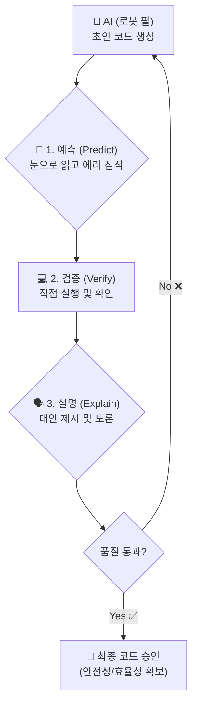

# 마이크로 세션: 063 — 생성 코드 리뷰 게임

> **세션 ID**: MS-PY101-063  
> **소요 시간**: 20분  
> **난이도**: medium  
> **청크 타입**: lab  
> **Day/시간대**: Day 3 PM  
> **버전**: v2.1 (7섹션 구조)

---

## §1. 개요

> **Day 3 | PM | 세션 063/064**

### 🎯 학습 목표

이 세션이 끝나면, 수강생은 다음을 할 수 있습니다:

- AI가 생성한 초안 코드를 비판적으로 분석하여 논리적 허점을 찾아낼 수 있다.
- 예측, 검증, 설명으로 이어지는 3단계 코드 리뷰 사이클을 실제 코드에 적용할 수 있다.
- 하드코딩과 예외 처리 누락 등 흔히 발생하는 에러를 파악하고 파이써닉한 코드로 개선할 수 있다.

### 선행 세션 환기

방금 전 세션(062)까지 우리는 내장 함수와 리스트 컴프리헨션을 결합해 통계 분석기를 직접 만들었습니다. 코드가 의도한 대로 완벽하게 작동할 때의 짜릿함을 모두 맛보셨죠? 하지만 현실 실무에서는 처음부터 끝까지 코드를 짜는 일보다, AI가 순식간에 만들어준 수십 줄의 초안을 마주하는 일이 훨씬 더 많습니다. 이제는 방향을 약간 틀어봅시다. 코드를 직접 짜는 사람이 아니라 남이 짠 코드를 평가하는 "품질 검사관"으로 역할을 바꿔볼 차례입니다.

---

## §2. 핵심 개념 (+ 🗣️ 강사 대본 + Mermaid)

### 자동차 생산 공장과 품질 검사관

AI는 지치지도 않고 엄청난 속도로 부품을 조립해 내는 초고속 로봇 팔과 같습니다. 하루에도 수백 줄의 코드를 뚝딱뚝딱 만들어냅니다. 하지만 이 로봇 팔은 속도에만 집중한 나머지 나사가 하나 빠졌거나 브레이크 패드가 거꾸로 끼워져 있는 걸 눈치채지 못할 때가 있습니다. 만약 이 자동차를 그대로 시장에 내놓는다면 운전자는 큰 사고를 겪게 됩니다. 프로그램에서도 마찬가지로, 검증되지 않은 AI 코드는 결국 서비스의 치명적인 버그로 이어집니다.

여기서 여러분은 단순히 로봇 팔 옆에서 구경만 하는 사람이 아닙니다. 최종 출고 직전에 자동차를 매의 눈으로 살피는 최고참 '품질 검사관'입니다. 품질 검사관은 로봇이 만든 제품의 불량을 찾아내고 개선을 지시하는 권한과 책임을 가집니다. 코드를 처음부터 끝까지 다 짤 필요는 없더라도, 남이 짠 코드의 흐름을 읽고 병목 현상과 에러 가능성을 짚어내는 눈이 필수적입니다.

🗣️ **강사 대본 (Instructor Script)**:

> 여러분, 요즘은 AI에게 몇 마디만 건네면 순식간에 코드를 쏟아내는 시대입니다. 정말 편리하죠. 그런데 아주 중요한 질문을 하나 던져보겠습니다. 과연 AI가 짜준 코드는 언제나 완벽할까요? 정답은 '절대 그렇지 않다'입니다. AI가 코드를 짜준다고 해서 우리의 역할이 끝나는 것이 아닙니다. 오히려 이때부터가 진짜 실력이 필요한 순간이에요. 
> 
> AI는 때때로 우리가 의도하지 않은 방향으로 논리를 전개하기도 하고, 치명적인 오류를 숨겨둔 채 그럴듯한 정답인 척 코드를 내밉니다. 게다가 성능이 떨어지는 비효율적인 방식, 즉 나쁜 습관이 밴 코드를 줄 때도 굉장히 많습니다. 우리가 무작정 그 코드를 복사해서 붙여넣기하는 수동적인 사용자가 되어서는 안 되는 이유입니다. 논리의 허점을 찾아내고 더 나은 방향을 제시하는 능력을 갖춰야 비로소 AI를 진정한 조수로 부릴 수 있습니다.

### Mermaid 다이어그램



---

## §3. 상세 내용

### Why — 왜 직접 리뷰해야 하는가?

Deep Research 리포트에 따르면, 인공지능이 생성한 초안 코드의 상당수가 엣지 케이스를 처리하지 못하거나 비효율적인 로직을 포함하고 있습니다. 숫자를 임의로 고정해버리는 하드코딩(Hard-coding), 데이터가 아예 없을 때 프로그램이 뻗어버리는 예외 처리 누락이 대표적입니다. 남이 짠 코드의 흐름을 짚어내는 역량은 개발자의 핵심 자산이며, AI 시대에는 그 중요성이 더욱 커집니다.

### What — 마법의 3단계 사이클

품질 검사관으로서 코드를 리뷰할 때는 세 가지 단계의 마법의 사이클을 거칩니다.

1. **예측 (Predict)**: 절대 코드를 먼저 실행해보지 않습니다. 눈과 머리만으로 코드를 한 줄씩 읽어 내려가면서, AI가 무슨 의도로 작성했는지 파악합니다. 어디서 에러가 날지, 어떤 비효율이 있는지 미리 짐작합니다. 이 훈련은 코드 독해력을 비약적으로 상승시킵니다.
2. **검증 (Verify)**: 눈으로 찾아낸 의심스러운 부분을 실제로 컴퓨터에서 돌려보며 내 예측이 맞았는지 확인합니다. 에러 메시지가 뜬다면 꼼꼼히 읽어보고 AI가 놓친 허점을 정확히 찌릅니다.
3. **설명 (Explain)**: 버그를 찾고 고치는 것으로 끝나면 절반의 완성입니다. 왜 이 코드가 잘못되었는지, 내가 수정한 코드는 왜 더 좋은 품질을 가지는지 논리적으로 설명해야 합니다.

### How — 세 가지 평가 잣대

토론을 이끄는 기준은 다음 세 가지입니다.
- **로직의 정확성**: 코드가 원래 의도한 목적을 달성하는가?
- **효율성**: 불필요한 반복을 줄였는가? 내장 함수나 리스트 컴프리헨션 같은 파이써닉한 도구를 잘 활용했는가?
- **안전성**: 예상치 못한 데이터(빈 리스트, 잘못된 타입)가 들어왔을 때 프로그램이 죽지 않고 버티는가?

---

## §4. 실습 가이드 (+ 🎙️ 실습 대본)

### 실습 목표

조별로 제시된 AI 초안 코드의 문제점을 찾고, 3단계 리뷰 사이클을 통해 안전하고 파이써닉하게 개선하는 "생성 코드 리뷰 게임"을 진행합니다.

🎙️ **실습 가이드 대본 (Lab Guide)**:

> 자, 우리 팀장님들! 실제 현장에 투입될 시간입니다. 제가 AI에게 부탁해서 받아온 코드를 화면에 띄워드릴게요. 언뜻 보면 학생들의 평균 점수를 구하는 아주 평범하고 정상적인 코드처럼 보입니다. 하지만 이 안에는 AI의 게으른 습관과, 상황이 바뀌었을 때 대처하지 못하는 치명적인 약점들이 숨어있습니다. 여러분의 임무는 이 코드에서 논리적 구멍과 개선점을 최대한 많이 찾아내는 것입니다.
>
> 지금부터 15분 동안 조별로 게임을 시작합니다. 룰은 아주 간단하면서도 치열해요. 처음 2분은 키보드에서 손을 떼고 눈으로만 화면을 뚫어지게 쳐다보세요. 그다음 3분 동안은 각자 찾아낸 에러의 원인이나 개선점을 노트에 적어봅니다. 개인 예측이 끝났다면, 2분 동안 팀원들과 토론하며 대안을 찾습니다. "누가 더 치명적인 버그를 찾았나", "어떻게 고치는 것이 파이썬다울까" 치열하게 의견을 나누세요. 토론이 무르익으면 그때 키보드를 잡고 코드를 직접 고쳐보며 가설을 검증합니다. 마지막 5분은 제가 각 팀의 발견 사항을 들어보고 가장 우수한 품질 검사관 팀을 선정하겠습니다. 학생 데이터가 3명이 아니라 100명으로 늘어나면 어떨지, 데이터가 아예 텅 비어있다면 어떻게 프로그램이 뻗어버릴지 상상력을 마음껏 발휘해 보세요!

### 단계별 지시 — 코드 리뷰 게임 진행 룰

| 단계 | 소요 시간 | 강사 지시사항 | 학습자 액션 | 목표 및 예상 결과 |
|------|----------|--------------|------------|----------|
| 1. 예측 | 2분 | "절대 키보드에 손대지 마세요. 눈으로만 코드를 읽으며 에러를 짐작하세요." | 코드를 읽으며 문제점 탐색 | 하드코딩된 `3`의 문제점 발견 |
| 2. 작성 | 3분 | "여러분이 찾은 문제점과 해결책을 각자의 노트에 적어보세요." | 가설 및 개선점 노트 필기 | 예외 상황(빈 리스트) 상상 |
| 3. 토론 | 2분 | "팀원들과 가설을 공유하세요. 가장 파이써닉한 대안이 무엇일지 논의합니다." | 팀별 아이디어 공유 및 토론 | 다양한 접근법 도출 |
| 4. 검증 | 3분 | "이제 키보드를 잡고 코드를 직접 고쳐서 실행해 보세요. 에러가 잡히나요?" | 코드 수정 및 실행 | `len(students)` 적용, 예외 처리 확인 |
| 5. 해설 | 5분 | "각 팀의 발견 사항을 발표해 볼까요? 정답 해설을 진행하겠습니다." | 조별 발표 및 강사 해설 경청 | 최종 개선 코드 비교 및 이해 |

### 💡 게임 힌트 및 AI 프롬프트 예시

막히는 팀이 있다면 AI에게 힌트를 얻도록 유도하세요.
> 🤖 **AI 힌트 프롬프트**: "이 파이썬 코드에서 학생 수가 3명이 아니라 100명으로 늘어나면 문제가 생겨. 어떻게 고치는 게 좋을지 힌트만 줘."
> 🤖 **AI 분석 프롬프트**: "이 코드에 예외 처리가 빠져있어. students 리스트가 비어있을 때 발생하는 ZeroDivisionError를 막으려면 어떻게 해야 할까?"

---


### 🎓 강사 노트 (Instructor Support)

- ⏱️ **타이밍**: 18:05 (20분, lab)
- 🎯 **핵심 활동**: 코드에서 개념 찾기 게임
- ⚠️ **강사 주의사항**: 재미 위주로 진행


### 📋 실습 설계 보강 (Lab Packet)

**세션 063 실습 설계 보강**

생성 코드 리뷰 게임
- **3-Stage Example Set**
  - 기본: 완성된 코드에서 변수·리스트·딕셔너리·조건문·반복문·함수 각각의 위치를 마킹
  - 변형: 동료의 코드에서 동일한 구성요소를 찾아 "나는 여기서 for문을 발견했다" 발표
  - 실수 해결: "for와 while의 차이를 모르겠어요" → AI에게 두 코드의 차이 설명 요청
- **난이도 예측**: 코드 "읽기" 능력이 아직 부족 — 생성은 했지만 이해는 미완
- **타이밍 가이드**: 개인 코드 분석 5분 | 짝 코드 교환·분석 8분 | 발표 5분 | 정리 2분
- **심리적 장벽**: "남의 코드를 보면 더 어려워 보여요"
- **자가 점검**:
  - [ ] 코드에서 변수 선언, 리스트, 딕셔너리, for문, if문, def 함수를 각각 1개 이상 찾았는가?
  - [ ] 동료의 코드에서도 같은 구성요소를 식별했는가?
  - [ ] AI에게 "이 코드의 구조를 초보자 눈높이로 설명해줘"라고 질문했는가?

## §5. 코드 및 명령어 모음

### 리뷰 대상 코드 (AI 생성 초안)

```python
# 학생들의 수학 점수 평균을 구하는 AI 초안 코드
students = [
    {"name": "김철수", "math": 85},
    {"name": "이영희", "math": 92},
    {"name": "박민수", "math": 78}
]

total = 0
for s in students:
    total = total + s["math"]

avg = total / 3  # 논리적 구멍이 숨어있는 부분
print(f"평균 점수: {avg}")
```

### 개선 1단계: 하드코딩 제거

가장 먼저 찾아야 할 치명적인 버그는 분모가 `3`으로 고정되어 있다는 점입니다. 학생 수가 바뀌면 결과가 완전히 틀려집니다. 고정된 숫자 대신 리스트의 길이를 반환하는 `len()` 함수를 써야 합니다.

```python
total = 0
for s in students:
    total += s["math"]  # += 연산자 활용으로 더 간결하게

# 하드코딩 제거: 학생 수만큼 동적으로 나누기
avg = total / len(students) 
print(f"평균 점수: {avg}")
```

### 개선 2단계: 안전성 확보 (예외 처리)

만약 `students` 리스트가 텅 비어있다면 `len(students)`는 0이 됩니다. 파이썬에서 0으로 나누면 프로그램이 즉시 뻗어버리는 `ZeroDivisionError`가 발생합니다. 이를 막기 위해 안전망을 쳐야 합니다.

```python
# 방어적 코딩 (Defensive Programming)
if len(students) > 0:
    total = 0
    for s in students:
        total += s["math"]
    avg = total / len(students)
    print(f"평균 점수: {avg}")
else:
    print("학생 데이터가 없어 평균을 계산할 수 없습니다.")
```

### 개선 3단계: 파이써닉한 코드로 최종 진화

로직을 반복문으로 일일이 푸는 대신, 앞선 세션에서 배운 **리스트 컴프리헨션**과 **내장 함수**를 조립하면 단 두 줄로 깔끔하고 효율적인 코드를 짤 수 있습니다. 이것이 진짜 개발자의 시선입니다.

```python
# 리스트 컴프리헨션과 내장 함수 sum() 결합
if students:  # 리스트가 비어있지 않으면 True로 평가됨 (파이써닉한 조건문)
    math_scores = [s["math"] for s in students]
    avg = sum(math_scores) / len(math_scores)
    print(f"평균 점수: {avg}")
else:
    print("학생 데이터가 없습니다.")
```

---

## §6. 요약

### 핵심 학습 포인트

코드 리뷰 게임, 다들 어떠셨나요? 생각보다 AI가 짠 코드에 허술한 구석이 많다는 걸 눈으로 확인하셨을 겁니다. 숫자를 고정해버리는 하드코딩의 위험성부터 데이터가 비어있을 때 발생하는 예외 상황까지, 여러분은 코드를 단순히 짜는 사람을 넘어 튼튼하게 보수하는 안목을 갖추었습니다. 
기억하세요. 첫째, 여러분은 최종 출고를 결정하는 **품질 검사관**입니다. 둘째, 항상 **예측, 검증, 설명**의 3단계 사이클을 거치세요. 셋째, 코드를 평가할 때는 **정확성, 효율성, 안전성**이라는 세 가지 잣대를 들이대야 합니다. 남의 코드를 리뷰하고 개선하는 경험은 개발자 성장을 위한 가장 강력한 무기가 됩니다.

### 다음 세션 예고

자, 이렇게 해서 오늘 하루 동안 숨 가쁘게 달려온 실습과 게임이 모두 끝났습니다. 조건문과 반복문으로 로직을 만들고, 리스트 컴프리헨션으로 통계를 내고, 마지막으로 AI의 코드까지 완벽하게 검수해 냈습니다. 뇌가 새로운 지식들로 꽉 차서 뻐근하실 텐데요. 바로 다음 세션 064에서는 오늘 배운 모든 내용을 깔끔하게 서랍 속에 정리해 드리는 'Day 3 총정리' 시간을 갖겠습니다.

### 브릿지 노트

> "흩어진 퍼즐 조각들이 하나의 아름다운 그림으로 맞춰지는 마법 같은 시간이 될 테니, 기지개 한 번 크게 켜시고 편안한 마음으로 다음 세션에서 뵙겠습니다!"

---

## §7. 참고 자료

### 3-Source 출처

- **Source A (로컬 참고자료)**: 「8 코딩.pdf」 §4.1 — 개발자의 핵심 역량으로서의 코드 리뷰, 가독성과 효율성을 위한 코드 리팩토링 가이드.
- **Source B (NotebookLM)**: Day 3 요약 — 복잡한 문맥 속 논리적 오류 탐색, 에러 상황 예측 훈련 방법.
- **Source C (Deep Research)**: Day 3 리포트 — AI 생성 코드의 빈번한 결함(하드코딩, 엣지 케이스 및 예외 처리 누락) 분석.

### 강사 노트

> 💡 **강사 노트**: 수강생들이 처음부터 키보드에 손을 대지 못하도록 강력하게 통제하는 것이 1단계 예측 훈련의 핵심입니다. 하드코딩된 `3`을 찾는 것은 쉽게 해내지만, 빈 리스트가 들어올 때의 `ZeroDivisionError`를 상상하는 팀은 드물 수 있습니다. 토론 단계에서 이 부분을 슬쩍 힌트로 던져주어 팀원들끼리 해결책을 찾도록 유도해 주세요. 마지막 해설에서는 "왜 리스트 컴프리헨션을 쓰는 것이 더 파이써닉한지" 성능과 가독성 측면에서 설명해 주시면 좋습니다.

---

## ✅ 세션 완료 체크리스트 (강사용)

- [x] §1~§7 모든 섹션이 충실하게 작성되었는가?
- [x] 자동차 생산 공장과 품질 검사관 비유가 충분히 설명되었는가?
- [x] 15분 게임의 5단계 진행 룰이 시간 배분과 함께 명시되었는가?
- [x] AI 생성 초안 코드와 개선된 단계별 코드가 명확히 구분되어 있는가?
- [x] 하드코딩, 예외 처리 누락, 리스트 컴프리헨션 활용 등 3가지 포인트가 모두 다뤄졌는가?
- [x] 3-Source 팩트 패킷이 §7에 반영되었는가?
- [x] 다음 세션(064 Day 3 총정리) 브릿지 노트가 포함되었는가?

---

**🔗 선행 세션**: [세션-062] [종합 실습 3] 통계 분석기 추가 (필수)  
**🔗 후행 세션**: [세션-064] Day 3 총정리

---

*작성 일시: 2026-02-25*  
*작성 에이전트: Sisyphus-Junior*  
*교안 구조: 7섹션 (A0 팀 공통 표준)*