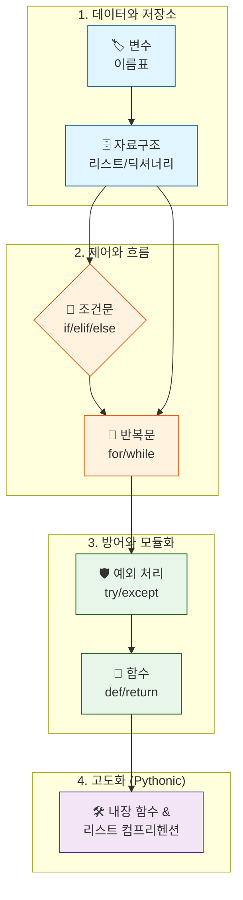

# 마이크로 세션: 064 — Day3_총정리

> **세션 ID**: MS-PY101-064  
> **소요 시간**: 15분  
> **난이도**: ★☆☆  
> **청크 타입**: narrative  
> **선행 세션**: 063(필수)  
> **후행 세션**: 065  
> **버전**: v2.1 (7섹션 구조)

---

## §1. 개요

> **Day 3 | PM | 세션 064/064**

이 세션은 밀도 높았던 Day 3의 모든 여정을 마무리하는 총정리 시간이에요. 하루 종일 파이썬의 가장 핵심적인 기초 문법들을 쉴 새 없이 달려오며 배웠습니다. 단순한 변수에서 시작해 복잡한 자료구조, 프로그램의 흐름을 제어하는 제어문, 에러를 방어하는 예외 처리, 코드를 재사용하는 함수, 그리고 이 모든 것을 압축한 리스트 컴프리헨션까지 방대한 내용을 다뤘죠.

이제 흩어져 있는 수많은 개념의 파편들을 하나의 거대한 그림으로 엮어낼 시간입니다. 파편화된 지식을 하나의 맥락으로 연결해야만 비로소 '나만의 무기'가 되고, 내일 배우게 될 구조적 프로그래밍과 객체 지향의 세계를 담아낼 튼튼한 그릇이 완성되기 때문입니다.

### 🎯 학습 목표

이 세션이 끝나면 수강생은 다음을 할 수 있어요:

- Day 3에서 배운 6가지 핵심 파이썬 부품(변수, 자료구조, 제어문, 함수 등)의 역할과 유기적 관계를 설명할 수 있습니다.
- "파이써닉(Pythonic)한 코드"가 무엇인지, 왜 가독성이 중요한지 이해합니다.
- 복합적인 코드를 읽고 데이터가 어떻게 흐르는지 머릿속으로 시뮬레이션(멘탈 트레이닝)할 수 있습니다.

### 선행 세션 환기

이 세션은 세션 063의 "생성 코드 리뷰 게임" 직후에 진행됩니다. AI가 짜준 코드를 검증하며 키웠던 분석 능력을 바탕으로, 우리가 하루 동안 배운 정상적인 코드 패턴들이 어떻게 조립되어야 가장 훌륭한 결과물을 낼 수 있는지 다시 한번 상기시킵니다.

---

## §2. 핵심 개념 (+ 🗣️ 강사 대본 + Mermaid)

### 파이썬 문법의 6가지 핵심 부품 비유

오늘 배운 모든 파이썬 문법은 결국 6가지 핵심 부품으로 압축됩니다. 이 부품들은 마치 목공소의 도구들처럼 각자의 명확한 역할을 가지고 있으며, 이것들을 어떻게 조립하느냐에 따라 무한한 형태의 프로그램이 탄생하게 됩니다.

1. **변수**: 데이터를 담고 이름을 붙이는 작은 '이름표(포스트잇)'.
2. **리스트**: 순서대로 데이터를 보관하는 긴 '서랍장'.
3. **딕셔너리**: 이름표를 붙여 빠르게 물건을 찾는 '고객 카드'.
4. **조건문**: 상황에 따라 다른 길을 안내해 주는 '신호등'.
5. **반복문**: 지루한 작업을 수백 번 대신해 주는 성실한 '컨베이어 벨트'.
6. **함수**: 이 모든 작업의 순서와 방식을 깔끔하게 적어놓은 '레시피 카드'.

여기에 프로그램이 멈추지 않게 돕는 **예외 처리(안전망)**와, 코드의 길이를 획기적으로 줄여주는 **내장 함수 및 리스트 컴프리헨션(만능 도구상자와 압축기)**이 더해져 파이썬의 기초가 완성됩니다.

🗣️ **강사 대본 (Instructor Script)**:

> 여러분, 정말 길고 밀도 높았던 데이 쓰리의 마지막 세션에 오신 것을 환영합니다. 오늘 하루 동안 우리는 파이썬의 핵심이자, 사실상 모든 프로그래밍 언어의 척추 역할을 하는 중요한 개념들을 숨 가쁘게 달려오며 배웠습니다. 
>
> 아침에는 이름표를 붙이는 '변수'를 시작으로, 리스트와 딕셔너리라는 서랍장에 데이터를 차곡차곡 정리하는 법을 배웠죠. 오후에는 프로그램의 방향을 결정하는 조건문이라는 신호등과, 반복적인 노동을 컴퓨터에게 위임하는 반복문이라는 컨베이어 벨트를 돌렸습니다. 프로그램이 죽지 않게 예외 처리라는 안전그물도 쳤고요. 마지막으로, 자주 사용하는 코드를 묶어내는 모듈화의 꽃, 함수라는 나만의 레시피 작성법까지 모두 경험했습니다. 게다가 내장 함수와 리스트 컴프리헨션이라는 마법 같은 압축 도구도 손에 넣으셨죠!
>
> 여러분의 머릿속에는 지금 수많은 개념의 파편들이 마치 쏟아진 퍼즐 조각처럼 흩어져 있을지도 모릅니다. 하지만 걱정하지 마세요. 이 마지막 십오 분은 그 조각들을 하나의 아름답고 거대한 그림으로 완성하는 시간입니다.
> 
> 우리가 AI에게 코드를 맡길 때도, 결국 AI는 이 6가지 부품을 거대한 규모로 조립해서 결과물을 뱉어냅니다. 여러분이 이 부품들의 작동 원리와 흐름을 명확히 이해하고 있다면, AI가 짠 복잡한 코드도 단숨에 그 의도를 파악하고 마음대로 수정할 수 있는 진정한 '지휘자'가 되실 수 있습니다.

### Mermaid 다이어그램



이 다이어그램은 Day 3에서 배운 내용들이 단순한 데이터에서 시작해 제어, 방어, 모듈화를 거쳐 최종적으로 파이써닉한 코드로 고도화되는 흐름을 보여줍니다.

---

## §3. 상세 내용

### Why — 왜 이 세션이 필요한가?

초보자들은 보통 하루에 너무 많은 문법을 배우면, 각 문법의 사용법(Syntax)은 알지만 그것들을 '언제', '어떻게' 결합해야 하는지(Context)를 놓치기 쉽습니다. 변수 따로, 리스트 따로, 조건문 따로 기억하는 것은 의미가 없습니다. 실제 실무 프로그램이나 AI가 생성하는 코드는 이 모든 요소가 하나의 유기체처럼 얽혀서 동작하기 때문입니다. 하루를 마무리하며 이 파편들을 결합하는 조감도를 머릿속에 심어주어야만 지식이 휘발되지 않고 장기 기억으로 자리 잡습니다.

### What — 이 세션에서 다루는 것은 무엇인가?

이 세션은 새로운 문법을 가르치지 않습니다. 대신 파이썬의 핵심 철학인 '간결함(Pythonic)'과 '가독성'을 중심에 두고, 오늘 배운 6가지 부품들이 단일 코드 블록 안에서 어떻게 상호작용하는지 확인합니다.
1. **데이터 계층**: 변수, 리스트, 딕셔너리로 데이터를 구조화하는 방법 환기.
2. **로직 계층**: 조건문, 반복문, 예외 처리로 데이터에 생명을 불어넣는 흐름 환기.
3. **추상화 계층**: 함수와 리스트 컴프리헨션을 이용해 코드를 깔끔하게 압축하고 모듈화하는 철학 환기.

### How — 구체적으로 어떻게 진행하는가?

🗣️ **강사 대본 (Instructor Script)**:

> 이 모든 과정을 관통하는 단 하나의 철학이 있다면 그것은 바로 '간결함'입니다. 파이썬의 창시자인 귀도 반 로섬과 수많은 개발자들이 가장 집착하는 가치가 바로 "누구나 쉽게 읽고 이해할 수 있는 가독성"입니다. 
>
> 코드를 복잡하고 화려하게, 암호처럼 꼬아서 짜는 것은 결코 실력 있는 개발자의 모습이 아닙니다. 오늘 우리가 오후에 배웠던 리스트 컴프리헨션이나 내장 함수들처럼, 누가 보더라도 그 의도를 한 번에 파악할 수 있도록 코드를 다듬는 것. 이른바 '파이써닉(Pythonic)'하게 코드를 작성하는 것이야말로 우리가 지향해야 할 진정한 목표입니다.
>
> 앞으로 여러분이 현업에 돌아가 AI에게 코드를 맡길 때도 마찬가지입니다. 프롬프트를 명확하게 작성해서 가장 '가독성 높은' 코드를 뽑아내고, 그 코드가 올바르게 돌아가는지 방금 복습한 6가지 부품의 원리를 통해 검증해 내면 되는 것입니다. 오늘 배운 이 단단한 뼈대와 로직을 머릿속에 장착하셨다면, 여러분은 단순히 작동만 하는 코드를 넘어, 다른 사람(그리고 AI)과 소통하고 협업할 수 있는 우아한 코드를 다룰 준비가 끝나신 겁니다.

---

## §4. 실습 가이드 (+ 🎙️ 실습 대본)

### 실습 목표

하루의 마지막 세션이므로 수강생들이 직접 키보드를 치는 무거운 실습은 지양합니다. 대신 '멘탈 트레이닝(코드 읽기)'을 통해, 오늘 배운 모든 요소가 결합된 10줄 남짓의 코드를 눈으로 따라가며 머릿속에서 실행 결과를 도출하는 것을 목표로 합니다.

🎙️ **실습 가이드 대본 (Lab Guide)**:

> 백문이 불여일견이죠. 오늘 하루 종일 흩어져 있던 변수, 리스트, 딕셔너리, 조건문, 반복문, 함수라는 핵심 부품들이 단 열 줄 남짓한 코드 안에서 어떻게 하나로 융합되어 돌아가는지, 오늘의 마지막 실습 코드를 통해 확인해 보겠습니다.
>
> 이번 시간은 총정리 시간이므로 복잡하게 키보드로 코드를 따라 치실 필요는 없습니다. 대신 화면에 띄워진 이 코드를 머릿속으로 조용히 실행해 보는 '멘탈 트레이닝' 시간을 딱 3분만 가져보겠습니다. 눈을 크게 뜨고 코드의 흐름을 따라가 보세요.
>
> 1. 가장 위쪽에 있는 `students`라는 리스트 안의 딕셔너리가 어떻게 반복문의 변수인 `s`로 하나씩 들어가는지 그려보세요.
> 2. 그 `s` 안에 있는 점수 데이터가 `get_grade`라는 함수의 재료로 쏙 들어가고,
> 3. 함수 안에서 조건문을 만나 'A'나 'B'라는 결과물로 어떻게 변신해서 돌아오는지 추적해 보시기 바랍니다.
>
> 자, 머릿속에서 출력 결과로 "김철수 콜론 B", "이영희 콜론 A"라는 텍스트가 명확하게 떠오르신다면, 여러분은 오늘 하루의 학습 목표를 무려 100% 완벽하게 달성하신 겁니다!

### 단계별 지시

| 단계 | 소요 시간 | 강사 지시사항 | 학습자 액션 | 예상 결과 |
|------|----------|--------------|------------|----------|
| 1 | 1분 | 화면에 총정리 코드 제시 및 멘탈 트레이닝 안내 | 화면 주시 | 실습 의도 파악 |
| 2 | 3분 | 침묵 속 코드 리딩 시간 부여 | 코드 흐름 추적 | 변수부터 함수까지 유기적 연결 이해 |
| 3 | 2분 | 강사가 직접 코드를 한 줄씩 읽으며 흐름 해설 | 해설 청취 및 고개 끄덕임 | 본인의 해석과 일치하는지 검증 |
| 4 | 2분 | Day 3 성취에 대한 칭찬 및 박수 | 성취감 만끽 | 긍정적 라포 형성 및 피로도 회복 |

---


### 🎓 강사 노트 (Instructor Support)

- ⏱️ **타이밍**: 18:25 (15분, narrative)
- 🎯 **핵심 활동**: 6개 핵심 개념 요약
- ⚠️ **강사 주의사항**: 내일 Day 4 관통 프로젝트 예고

## §5. 코드 및 명령어 모음

### Day 3 핵심 총정리 멘탈 트레이닝 코드

이 코드는 Day 3에서 다룬 자료구조(List, Dict), 제어문(if, for), 함수(def)가 모두 포함된 종합선물세트입니다.

```python
# Day 3 핵심 총정리: 6가지 부품의 완벽한 조화
students = [
    {"name": "김철수", "score": 85},
    {"name": "이영희", "score": 95}
]

def get_grade(score: int) -> str:
    """점수를 입력받아 등급을 반환하는 함수"""
    if score >= 90: 
        return "A"
    else: 
        return "B"

# 반복문을 통한 로직 순회 및 출력
for s in students:
    grade = get_grade(s["score"])
    print(f"{s['name']}: {grade}")
```

> **예상 출력 결과**:
> ```text
> 김철수: B
> 이영희: A
> ```

---

## §6. 요약

### 핵심 학습 포인트

이번 세션의 핵심은 하나입니다. "파이썬의 문법은 개별적으로 존재하는 것이 아니라, 데이터를 담고 흐름을 통제하며 재사용성을 높이는 거대한 톱니바퀴로 연결되어 있다."
이름표(변수)를 붙이고, 서랍(리스트)과 고객 카드(딕셔너리)에 데이터를 정리하고, 신호등(조건문)과 컨베이어 벨트(반복문)로 흐름을 만들고, 이 모든 과정을 안전그물(예외처리) 위에서 나만의 레시피(함수)로 묶어내는 것. 이것이 파이썬의 전부입니다.

### 다음 세션 예고 (Closing)

🗣️ **강사 대본 (Instructor Script)**:

> 수고하셨습니다. 여러분이 머릿속에서 성공적으로 코드를 실행하셨듯, 우리는 오늘 파이썬의 가장 중요하고 단단한 기초 체력을 모두 다졌습니다. 이 기초 체력이 튼튼하다면, 앞으로 마주할 그 어떤 복잡한 인공지능 코드도 결코 두렵지 않으실 겁니다.
>
> 이제 오늘 밤 푹 쉬시고, 내일 아침 시작될 데이 포(Day 4)에서는 이 작은 도구들이 모여서 어떻게 거대한 '구조'로 진화하는지 그 놀라운 여정을 시작할 겁니다. 지금까지 위에서 아래로 물 흐르듯 코드를 짜던 절차적 프로그래밍의 한계를 넘어, 코드를 마치 레고 블록처럼 조립하는 구조적 프로그래밍과 객체 지향의 세계로 한 걸음 더 깊이 들어갈 예정입니다. 
> 
> 오늘 하루, 정말 긴 시간 동안 열정적으로 수업에 참여해 주셔서 진심으로 감사드립니다. 여러분 자신에게 큰 박수 한번 쳐주시기 바랍니다! 내일 더 크고 흥미로운 코딩의 세계에서 뵙겠습니다. 감사합니다.

### 브릿지 노트

이 세션은 Day 3의 종료를 알리는 세션이므로, 수강생들이 느끼는 높은 인지적 피로도를 성취감으로 승화시키는 것이 가장 중요합니다. 수강생들의 노고를 진심으로 치하하며 긍정적인 에너지로 과정을 마무리합니다.

---

## §7. 참고 자료

### 3-Source 출처

- **Source A (로컬 참고자료)**: 「8 코딩.pdf」 §5.1 — 파이썬 기본 문법의 유기적 결합 사례 및 좋은 코드(가독성 높은 코드)의 조건 발췌.
- **Source B (NotebookLM)**: NotebookLM Day 3 요약 리포트 — 파편화된 지식을 하나의 맥락으로 연결하는 것의 중요성과 학습자 인지 부하 감소를 위한 비유적 설명(목공소 도구, 서랍장, 신호등 등) 차용.
- **Source C (Deep Research)**: Deep Research Day 3 리서치 — 데이터 모델링부터 모듈화까지 이어지는 파이썬 기초의 표준 학습 흐름 데이터 및 '파이써닉' 철학 적용 사례 참고.

### 강사 노트

> 💡 **강사 노트**: 본 세션은 새로운 지식을 주입하는 것이 아니라, 수강생이 스스로 "아, 하루 종일 배운 게 이렇게 하나로 연결되는구나!"라는 '아하 모먼트(Aha-moment)'를 경험하게 만드는 데 목적이 있습니다. 목소리의 톤을 조금 더 편안하고 격려하는 톤으로 바꾸시고, 실습 가이드에서 코드를 해설할 때 화면을 짚어가며 시각적인 흐름을 유도해 주시면 훨씬 효과적입니다.

---

## ✅ 세션 완료 체크리스트 (강사용)

- [ ] §1~§7 모든 섹션이 충실하게 작성되었는가?
- [ ] 6가지 핵심 부품 비유가 강사 대본에 자연스럽게 녹아들었는가?
- [ ] 멘탈 트레이닝 실습 가이드가 적절히 제공되었는가?
- [ ] Day 4(객체 지향/구조적 프로그래밍)에 대한 자연스러운 브릿지가 예고되었는가?
- [ ] Mermaid 다이어그램이 파이썬 학습 흐름을 시각적으로 잘 나타내는가?

---

*작성 일시: 2026-02-25*  
*작성 에이전트: Sisyphus-Junior*  
*교안 구조: 7섹션 (A0 팀 공통 표준)*