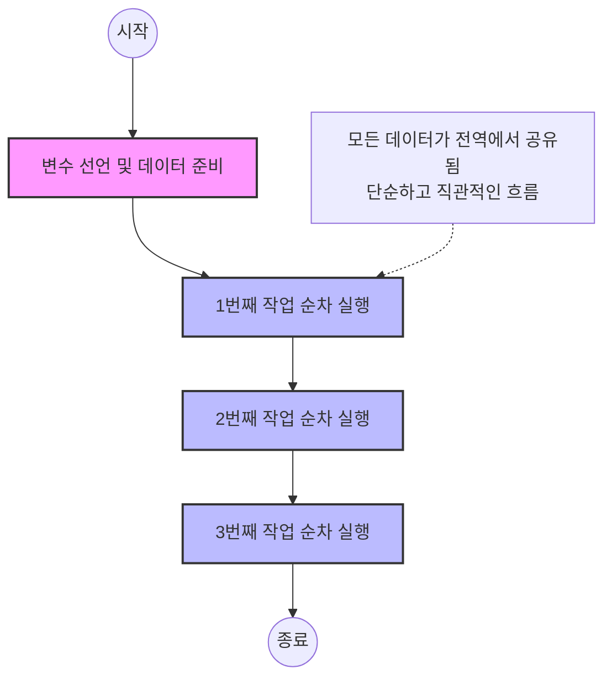

# 마이크로 세션: 065 — 절차적 프로그래밍의 개념과 특징

> **세션 ID**: MS-PY101-065  
> **소요 시간**: 20분  
> **난이도**: low  
> **청크 타입**: narrative  
> **Day/시간대**: Day 4 AM  
> **버전**: v2.1 (7섹션 구조)

---

## §1. 개요

> **Day 4 | AM | 세션 065/085**

이 세션은 4일차 아침의 첫 번째 시간으로, 지난 3일간 배운 파이썬의 기초 문법들을 어떻게 조합하여 '완성된 프로그램'을 만들 것인가에 대한 첫 번째 해답인 **'절차적 프로그래밍(Procedural Programming)'**을 다룹니다. 오늘과 내일에 걸쳐 절차적 프로그래밍에서 구조적 프로그래밍, 그리고 객체지향 프로그래밍으로 진화하는 긴 여정의 첫 출발점입니다.

### 🎯 학습 목표

이 세션이 끝나면 수강생은 다음을 할 수 있어요:

- 절차적 프로그래밍의 개념을 '일렬 도미노'에 비유하여 설명할 수 있습니다.
- 코드가 위에서 아래로 순차적으로 실행되는 절차적 방식의 장점(직관성)을 이해합니다.
- 코드가 커질 때 절차적 방식이 필연적으로 겪게 되는 3대 문제점(전역 상태 오염, 코드 중복, 단위 테스트 불가)을 인지합니다.

### 선행 세션 환기

Day 3에서 우리는 변수, 리스트, 조건문, 반복문, 함수 등의 '재료'를 다루는 법을 배웠습니다. 이번 세션에서는 함수를 본격적으로 활용하기 전에, 이러한 재료들을 기능 분리 없이 한 줄로 나열했을 때 어떤 일이 벌어지는지 절차적 관점에서 살펴봅니다.

---


### 🌟 차별화 포인트 (Differentiation Strategy)

> 🌟 **Day 4 서사: 질서의 발견** — 혼돈 속에서 통제력 되찾기 — 프로그램이 조금만 커져도 전역 변수와 중복 코드로 인해 무너지는 '도미노의 악몽'을 직접 겪고, 코드를 논리적 상자(함수)에 나누어 담으며 통제력을 회복합니다.

## §2. 핵심 개념 (+ 🗣️ 강사 대본 + Mermaid)

### 비유 — 일렬로 늘어선 도미노

절차적 프로그래밍은 기능의 분리 없이 코드가 위에서 아래로 순차적으로 실행되는 프로그래밍 패러다임입니다. 이를 가장 쉽게 이해할 수 있는 비유가 바로 **'일렬로 세워놓은 도미노'**입니다. 첫 번째 도미노를 밀면 두 번째, 세 번째가 차례로 쓰러지듯, 코드 역시 작성된 순서에 따라 정직하게 한 줄씩 실행됩니다. 

이 방식은 직관적이고 빠르게 코드를 짤 수 있다는 장점이 있지만, 도미노가 1,000개, 10,000개로 늘어났을 때 중간에 하나를 빼거나 순서를 바꾸려다 전체가 무너질 수 있다는 치명적인 단점을 가집니다.

🗣️ **강사 대본 (Instructor Script)**:

> 여러분, 좋은 아침입니다! 벌써 4일차네요. 지난 3일 동안 우리는 파이썬이라는 요리 세계에서 재료를 손질하는 법을 배웠습니다. 변수라는 이름표, 리스트라는 서랍장, 조건문이라는 갈림길, 그리고 반복문이라는 컨베이어 벨트까지 말이죠. 그런데 이 재료들을 가지고 실제로 '완성된 요리'를 만들려면, 대체 어떤 순서로 조합해야 할까요?
> 
> 프로그래밍의 역사에서 가장 오래되고, 또 가장 직관적인 요리법이 하나 있습니다. 바로 오늘 우리가 배울 **'절차적 프로그래밍'**이에요. 
>
> 절차적 프로그래밍을 가장 쉽게 이해하는 방법은 책상 위에 '일렬로 세워놓은 도미노'를 떠올리는 겁니다. 첫 번째 도미노를 톡 밀면, 두 번째가 넘어지고, 이어서 세 번째, 네 번째가 차르르 쓰러지죠? 절차적 프로그래밍도 정확히 이렇게 동작합니다. 코드가 위에서 아래로, 우리가 작성한 순서 그대로 한 줄씩 아주 '정직하게' 실행되는 거예요. 컴퓨터가 '어떻게(How)' 작업을 수행해야 하는지 절차에 집중하는 방식이죠.
>
> 이 방식의 가장 큰 장점은 직관성입니다. 코드를 위에서 아래로 쭉 읽으면 프로그램이 무슨 일을 하는지 바로 알 수 있어요. 마치 레시피를 1번부터 순서대로 따라 하면 요리가 완성되는 것처럼요. 
>
> 그런데 여러분, 한 가지 질문을 던져볼게요. 도미노가 10개일 때는 관리가 쉽습니다. 하나 넘어뜨리면 끝이니까요. 그런데 도미노가 1,000개, 10,000개로 늘어나면 어떨까요? 중간에 있는 도미노 하나를 빼고 싶거나, 순서를 바꾸고 싶다면요? 잘못 건드렸다가 전체가 와르르 무너질 수도 있겠죠? 
>
> 이게 바로 절차적 프로그래밍이 본질적으로 품고 있는 문제점입니다. 처음엔 쉽고 직관적이지만, 프로그램의 기능이 많아지면 코드 수정할 때마다 10군데, 100군데를 다 고쳐야 하는 악몽이 시작되는 거죠.

### Mermaid 다이어그램



이 다이어그램은 절차적 프로그래밍의 순차적 흐름을 보여줍니다. 데이터와 로직이 분리되지 않고 하나의 큰 흐름 속에서 처리되는 구조적 특징을 시각적으로 나타냅니다.

---

## §3. 상세 내용

### Why — 왜 이 세션이 필요한가?

최근 AI에게 코드를 짜달라고 요청하면, 가장 먼저 뱉어내는 코드가 보통 절차적 프로그래밍 방식의 코드입니다. 빠르고 직관적으로 결과를 낼 수 있기 때문이죠. 초보자들이 코딩을 처음 배울 때도 가장 자연스럽게 작성하는 방식입니다. 하지만 이 방식의 한계를 명확히 알지 못하면, 프로그램이 조금만 복잡해져도 유지보수가 불가능한 '스파게티 코드'의 늪에 빠지게 됩니다. 따라서 앞으로 배울 '구조적 프로그래밍'과 '객체지향 프로그래밍'의 필요성을 뼈저리게 공감하기 위해서는 절차적 방식의 장단점을 직접 체험하는 시간이 필수적입니다.

### What — 절차적 프로그래밍의 3대 문제점

절차적 프로그래밍은 코드가 커지면서 필연적으로 세 가지 거대한 문제에 직면하게 됩니다.

1. **전역 상태 오염**: 모든 코드가 같은 변수를 공유하므로, 어디서 데이터가 변경되었는지 추적하기 어렵습니다.
2. **코드 중복**: 동일한 기능(예: 출력 양식)이 여러 번 쓰일 때, 복사/붙여넣기를 남발하게 되어 하나를 수정하면 수십 곳을 따라 고쳐야 합니다.
3. **단위 테스트 불가**: 기능 단위(함수)로 나뉘어 있지 않아서 특정 로직만 떼어내어 검증하는 것이 불가능합니다.

### How — 구체적으로 어떻게 진행하는가?

🗣️ **강사 대본 (Instructor Script)**:

> 초기 프로그래머들은 모두 이 방식으로 코드를 작성했습니다. 그리고 놀랍게도, 우리가 AI에게 "프로그램을 만들어줘"라고 대충 지시하면, AI도 처음에는 이런 도미노 방식의 코드를 던져줍니다. 직관적이고 빠르게 만들 수 있으니까요.
>
> 하지만 프로그램의 기능이 3개, 5개, 10개로 늘어나면 코드가 수백 줄로 팽창합니다. 특정 부분을 고치려고 마우스 휠을 끝도 없이 올렸다 내렸다 하는 자신을 발견하게 되죠. 에러가 어디서 났는지 찾으려고 코드를 처음부터 끝까지 읽어봐야 했던 적, 다들 한 번쯤 있으실 겁니다. 그때의 막막함이 바로 절차적 코드의 한계에서 오는 겁니다. 
>
> 지금은 "그래서 어쩌라고? AI가 짜주면 그냥 쓰면 안 되나?"라는 생각이 드실 수도 있어요. 괜찮습니다. 오늘 오전 중으로 여러분은 이 한계를 직접 코드로 체험하시게 될 겁니다. 그리고 오후에는 이 답답한 한계를 돌파해서 코드를 깔끔하게 정리하는 마법 같은 방법을 배우게 될 테니까요.

---

## §4. 실습 가이드 (+ 🎙️ 실습 대본)

### 실습 목표

이 세션은 narrative 기반이므로 복잡한 타이핑 실습보다는, 절차적 코드의 구조적 문제를 눈으로 직접 확인하고 문제점을 인식하는 데 초점을 맞춥니다. 간단한 코드를 눈으로 따라가며 중복의 고통을 간접 체험합니다.

🎙️ **실습 대본 (Lab Guide)**:

> 화면의 코드를 함께 볼까요? 아주 소박한 고객 관리 프로그램의 일부입니다.
> 
> 고객이 2명 추가될 때, 이름과 전화번호 변수를 따로 선언하고 `print()`로 출력하고 있습니다. 만약 고객이 100명이면 어떻게 될까요? 변수가 200개가 되고 출력 코드가 100줄이 되겠죠.
>
> 여기서 더 큰 문제가 있습니다. 기획자가 갑자기 찾아와서 이렇게 말하는 겁니다. "출력 형식을 `고객 추가:`에서 `[등록완료]`로 바꿔주세요."
>
> 여러분, 어떻게 해야 할까요? 네, 100줄을 일일이 찾아서 전부 고쳐야 합니다. 만약 99개만 고치고 1개를 빼먹으면? 그게 바로 버그가 됩니다. 이게 바로 도미노 1,000개를 관리하는 악몽의 시작이에요. 짝꿍과 함께 화면의 코드를 보면서, 이 코드가 100줄로 늘어났을 때 얼마나 끔찍할지 잠깐 상상해 보세요.

### 단계별 지시

| 단계 | 소요 시간 | 강사 지시사항 | 학습자 액션 | 예상 결과 |
|------|----------|--------------|------------|----------|
| 1 | 3분 | 절차적 코드 예시 화면에 띄우기 | 화면의 코드 구조 관찰 | 코드 중복의 심각성 인지 |
| 2 | 2분 | 출력 양식 변경 시나리오 제시 | 짝꿍과 어떻게 수정할지 논의 | 수동 수정의 한계 공감 |
| 3 | 2분 | "절차적 프로그래밍의 3대 문제점" 질문 | 한 문장으로 대답 시도 | 개념 내재화 |

### 트러블슈팅 FAQ

| Q | A |
|---|---|
| AI가 짜주는 코드는 완벽한 것 아닌가요? | AI도 명확한 지시(구조화해달라는 요청)가 없으면 가장 원시적이고 쉬운 절차적 방식을 택합니다. 그래서 우리가 패러다임을 알아야 AI를 제대로 조종할 수 있습니다. |
| 처음부터 함수로 짜면 되지, 왜 이걸 배우나요? | 나쁜 코드가 왜 나쁜지 알아야 좋은 코드를 짤 수 있습니다. 절차적 코드의 고통을 알아야 구조적 프로그래밍의 가치를 온전히 이해할 수 있습니다. |

---


### 🎓 강사 노트 (Instructor Support)

- ⏱️ **타이밍**: 09:00 (20분, narrative)
- 🎯 **핵심 활동**: "일렬 도미노" 비유
- ⚠️ **강사 주의사항**: 3대 문제 (전역 변수, 중복, 테스트 불가)

## §5. 코드 및 명령어 모음

### 절차적 방식의 단면 (나쁜 예시)

이 코드는 절차적 프로그래밍의 문제점(전역 변수 오염, 코드 중복)을 극명하게 보여주기 위한 안티 패턴(Anti-pattern) 예시입니다.

```python
# 절차적 방식의 고객 관리 코드 단면
name1: str = "홍길동"
phone1: str = "010-1234-5678"
print(f"고객 추가: {name1}, {phone1}")

# 고객이 한 명 더 늘어날 때마다 변수와 로직이 중복됨
name2: str = "김철수"
phone2: str = "010-9876-5432"
print(f"고객 추가: {name2}, {phone2}")

# 🚨 문제점: 고객이 100명이면 변수가 200개, print가 100번 중복됨
```

> 🤖 **AI 프롬프트 예시**:
> "다음 파이썬 코드는 고객 정보를 출력하는 절차적 코드야. 이 코드의 문제점을 전역 상태 오염과 코드 중복 관점에서 설명해줘."

---

## §6. 요약

### 핵심 학습 포인트

이번 세션의 핵심은 절차적 프로그래밍의 **직관성과 그 이면에 숨겨진 함정**을 이해하는 것입니다.

- **도미노 비유**: 코드가 위에서 아래로 정직하게 한 줄씩 실행되는 가장 원초적인 패러다임입니다.
- **장점**: 직관적이고 작은 프로그램을 만들 때는 매우 빠르고 편리합니다.
- **한계 (3대 문제점)**: 프로그램이 커질수록 첫째 전역 상태가 오염되고, 둘째 코드가 걷잡을 수 없이 중복되며, 셋째 쪼개서 테스트할 수 없게 됩니다.

### 다음 세션 예고

지금 당장은 "이 엉망진창인 코드를 어떻게 수습하지?"라는 걱정이 드실 수 있습니다. 다음 세션에서는 과거의 천재 프로그래머들이 이 스파게티처럼 얽힌 도미노들을 어떻게 정리했는지, 그 위대한 탈출기인 '구조적 프로그래밍'으로의 진화 여정을 살펴보겠습니다.

### 브릿지 노트

> "자, 절차적 프로그래밍의 민낯을 보셨습니다. 위에서 아래로 무작정 코드를 나열하는 게 처음엔 쉽지만 나중엔 얼마나 큰 재앙을 부르는지 감이 오시죠? 그렇다면, 이 도미노들을 묶어서 튼튼한 레고 블록으로 만드는 방법은 없을까요? 다음 세션에서 그 해답을 만나보겠습니다."

---

## §7. 참고 자료

### 3-Source 출처

- **Source A (로컬 참고자료)**: `8 코딩.pdf` (§8.9 절차적 프로그래밍 패턴) — 절차적 프로그래밍의 순차적 흐름과 전역 변수 공유의 한계에 대한 원전.
- **Source B (NotebookLM)**: NotebookLM 분석 리포트 §1 — "컴퓨터가 어떻게(How) 작업을 수행해야 하는지 절차에 집중하는 패러다임"이라는 개념적 정의를 제공했습니다.
- **Source C (Deep Research)**: Deep Research 리포트 §1.1, 1.2 — 전역 상태 오염, 코드 중복, 단위 테스트 불가라는 절차적 프로그래밍의 3대 문제점을 도출하는 배경 리서치를 제공했습니다.

### 추가 학습 자료

- [Python 공식 문서: 파이썬 자습서](https://docs.python.org/ko/3/tutorial/index.html)
- 파이썬 절차적 프로그래밍 기본 구조

### 강사 노트

> 💡 **강사 노트**: 본 세션은 Day 4의 도입부로서, 수강생들에게 '문제의식'을 심어주는 것이 가장 중요합니다. 수강생들이 "AI가 짜준 코드라고 해서 무조건 좋은 코드가 아닐 수 있다"는 의심을 갖게 만들고, 구조적 리팩토링의 필요성을 간절하게 느끼도록 '도미노 비유'와 '유지보수의 악몽' 시나리오를 실감 나게 연기해 주세요.

---

## ✅ 세션 완료 체크리스트 (강사용)

- [x] §1~§7 모든 섹션이 충실하게 작성되었는가?
- [x] 도미노 비유와 스토리텔링이 포함되었는가?
- [x] 절차적 프로그래밍의 3대 문제점이 명확히 전달되었는가?
- [x] 3-Source 팩트 패킷이 반영되었는가?

---

*작성 일시: 2026-02-25*  
*작성 에이전트: Antigravity*  
*교안 구조: 7섹션 (A0 팀 공통 표준)*
