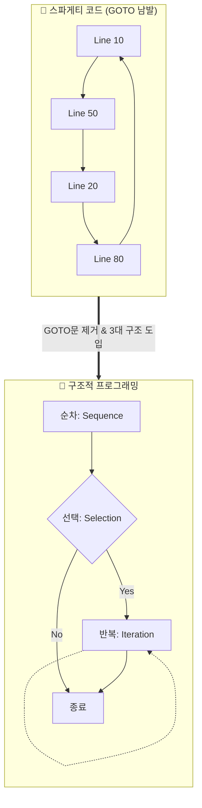

# 마이크로 세션: 066 — AI 시대의 서사 복습: 구조적 프로그래밍으로의 여정

> **세션 ID**: MS-PY101-066  
> **소요 시간**: 20분  
> **난이도**: ★★☆ (medium)  
> **청크 타입**: narrative  
> **버전**: v2.1 (7섹션 구조)

---

## §1. 개요

> **Day 4 | AM | 세션 066/085**

이 세션은 방금 전 세션에서 배운 '절차적 프로그래밍'의 한계를 극복하기 위해 역사적으로 어떤 패러다임 전환이 일어났는지 되짚어보는 시간입니다. Day 1 오리엔테이션에서 다루었던 'AI 시대의 서사' 2부에 해당하며, 프로그래머들이 '스파게티 코드'와 벌였던 치열한 사투의 역사를 통해 **구조적 프로그래밍**과 **함수**의 진정한 가치를 깨닫게 됩니다.

### 🎯 학습 목표

이 세션이 끝나면 수강생은 다음을 할 수 있어요:

- 절차적 프로그래밍의 한계인 '스파게티 코드' 문제와 전역 변수의 위험성을 설명할 수 있습니다.
- 구조적 프로그래밍의 3가지 핵심 요소(순차, 선택, 반복)를 이해할 수 있습니다.
- 코드를 제어하고 관리하기 위해 '함수(Function)'를 도입해야 하는 필연적인 이유를 설명할 수 있습니다.

### 선행 세션 환기

직전 세션(세션-065)에서 우리는 코드가 위에서 아래로 일렬 도미노처럼 실행되는 '절차적 프로그래밍'을 배웠습니다. 도미노 10개는 멋지게 쓰러지지만 수천 개가 되면 관리가 불가능하듯, 기능이 많아질수록 코드를 유지보수하기 힘들어지는 한계를 몸소 느꼈습니다. 이제 그 해결책을 찾으러 갈 차례입니다.

---

## §2. 핵심 개념 (+ 🗣️ 강사 대본 + Mermaid)

### 🍝 엉킨 이어폰 줄과 스파게티 코드

1960~70년대 초기 프로그래밍에서는 흐름을 제어하기 위해 `GOTO`라는 명령어를 남발했습니다. 코드가 위에서 아래로 흐르다 갑자기 다른 곳으로 점프하는 일이 반복되면서, 실행 흐름이 엉킨 이어폰 줄처럼 복잡해졌습니다. 이를 '스파게티 코드'라고 부릅니다. 이 문제를 해결하기 위해 에츠허르 데이크스트라(Edsger Dijkstra)는 "GOTO문은 해롭다"고 선언하며, 모든 프로그램을 **순차(Sequence), 선택(Selection), 반복(Iteration)** 단 3가지 구조만으로 통제하자는 '구조적 프로그래밍'을 제안했습니다.

🗣️ **강사 대본 (Instructor Script)**:

> 방금 전 세션에서 절차적 프로그래밍이 '일렬 도미노' 같다고 배웠죠? 그런데 옛날 프로그래머들의 세계는 더 끔찍했습니다. 코드가 복잡해지면 `GOTO`라는 명령어로 "여기 실행하다가 저기 47번 줄로 펄쩍 뛰어!"라고 지시했거든요.
> 
> 상상해 보세요. 코드가 위로 점프하고, 아래로 떨어지고, 옆으로 빠지고… 이건 마치 주머니 속에서 1년 동안 방치한 이어폰 줄이랑 똑같아요. 이탈리아 요리 이름을 빌려 이걸 '스파게티 코드(Spaghetti Code)'라고 부릅니다. 면발 하나를 포크로 찌르면 옆에 있는 면발이 줄줄이 딸려오듯이, 코드 한 줄 고쳤는데 전혀 상관없는 기능이 고장 나버리는 대참사가 벌어지는 거죠.
> 
> 그래서 천재 과학자들이 모여서 규칙을 정합니다. "GOTO문, 절대 쓰지 마! 앞으로 모든 프로그램은 딱 3가지로만 통제한다. 순차, 선택, 반복!" 이 3가지가 바로 엉킨 이어폰 줄을 풀어서 예쁘게 감아두는 마법의 도구입니다.

### Mermaid 다이어그램



이 다이어그램은 흐름을 알 수 없는 무질서한 스파게티 코드에서, '순차, 선택, 반복'이라는 명확한 구조를 가진 블록 형태로 패러다임이 진화하는 과정을 보여줍니다.

---

## §3. 상세 내용

### Why — 왜 이 세션이 필요한가?

AI 시대에 왜 굳이 50년 전의 '스파게티 코드' 역사를 배울까요? 놀랍게도 **AI가 초안으로 짜주는 코드가 종종 이 스파게티 형태를 띠기 때문입니다.** AI는 요구사항을 만족하는 가장 빠르고 직관적인 코드(보통 절차적 코드)를 뱉어내는 경향이 있습니다. 여러분이 AI의 코드를 무비판적으로 복사해서 붙여넣기만 한다면, 금세 통제 불능의 스파게티 괴물을 마주하게 됩니다. AI를 똑똑한 주니어 개발자로 부리려면, 여러분이 직접 구조를 잡아주는 '시니어' 역할을 해야 한다는 점을 깨닫는 것이 중요합니다.

### What — 이 세션에서 다루는 것은 무엇인가?

이 세션에서는 전역 변수(Global Variable)가 일으키는 치명적인 사고를 통해 **'함수(Function)'의 존재 이유**를 다룹니다. Day 3에서 `def` 키워드의 문법을 배웠지만, 여기서는 함수가 단순한 문법적 도구를 넘어 "변수와 데이터를 안전하게 가두는 격리 공간(서랍장)"이라는 구조적 의미를 학습합니다.

### How — 구체적으로 어떻게 진행하는가?

전역 변수의 위험성을 간단한 가상 시나리오로 체감합니다.

🗣️ **강사 대본 (Instructor Script)**:

> 스파게티 코드 못지않게 무서운 녀석이 바로 '전역 변수'입니다. 동네 광장에 놓인 확성기처럼 누구나 접근해서 값을 바꿀 수 있는 변수죠.
> 
> 자, 여러분이 쇼핑몰을 만들었어요. 프로그램 맨 위에 `discount_rate = 0.1` (10% 할인)이라고 전역 변수를 적어뒀습니다. A라는 기능은 이 값을 읽어서 정상적으로 10% 할인을 해줘요. 그런데 저 멀리 500번째 줄에 있는 B라는 이벤트 기능이, 자기도 모르게 이 전역 변수 값을 `0.5` (50% 할인)로 덮어써 버린 겁니다.
> 
> B가 실행된 직후에 물건을 사는 모든 사람들은 갑자기 50% 폭탄 세일 가격으로 결제를 하게 됩니다. 회사는 엄청난 손해를 보겠죠? 도대체 누가 할인율을 50%로 바꿨는지 찾으려면 수만 줄의 코드를 다 뒤져야 합니다. 
> 
> 이 끔찍한 사고를 막으려면 어떻게 해야 할까요? 바로 **'함수'**라는 단단한 금고를 만들어서, 그 안에 데이터를 가둬버리는 겁니다!

---

## §4. 실습 가이드 (+ 🎙️ 실습 대본)

### 실습 목표

이 세션의 실습은 '코드 없는 사고 실험(Thought Experiment)'입니다. 전역 변수가 공유될 때 일어날 수 있는 아찔한 상황을 상상해 보며, 왜 코드를 함수 단위로 잘게 쪼개어 관리해야 하는지 논리적 당위성을 체득합니다.

🎙️ **실습 가이드 대본 (Lab Guide)**:

> 방금 제가 말씀드린 '50% 할인 폭탄' 사태, 남 일 같지 않으시죠? 자, 이번엔 여러분이 은행 앱을 만든다고 상상해 봅시다. 
> 
> 내 계좌 잔고를 나타내는 `balance`라는 변수가 전역 변수로 사방에 널려 있습니다. 송금 기능, 결제 기능, 이자 계산 기능이 모두 이 하나의 `balance` 변수를 동시에 맘대로 뜯어고친다면 어떤 일이 벌어질까요? 
> 
> 옆에 앉은 분과 딱 2분만 이야기해 보세요. "전역 변수를 썼을 때 우리 은행 앱에 일어날 수 있는 최악의 버그는 무엇일까?" 시작하세요!
> 
> (2분 후) 네, 좋습니다. "결제하다 오류 났는데 돈만 빠져나가고 안 돌아옵니다" 같은 무시무시한 버그들이 속출하네요. 이렇게 데이터가 통제 없이 굴러다니는 걸 막기 위해, 우리는 다음 시간부터 '함수'를 사용해 데이터를 안전하게 주고받는 법을 집중적으로 훈련할 겁니다.

### 단계별 지시

| 단계 | 소요 시간 | 강사 지시사항 | 학습자 액션 | 예상 결과 |
|------|----------|--------------|------------|----------|
| 1 | 3분 | 전역 변수의 위험성(할인율 버그) 설명 | 경청, 상황 인지 | 데이터 은닉의 필요성 공감 |
| 2 | 2분 | 은행 앱 사고 실험 짝 토론 지시 | 옆 사람과 가상 버그 토론 | 전역 변수의 부작용 다각도 이해 |
| 3 | 2분 | 함수의 역할(금고/서랍장) 비유 설명 | 필기, 질문 | '함수 = 논리적 격리벽' 개념 형성 |

### 트러블슈팅 FAQ

| Q | A |
|---|---|
| "전역 변수가 그렇게 나쁘면 아예 없애버리면 되지 않나요?" | "아주 좋은 질문입니다! 실제로 현대 프로그래밍에서는 전역 변수 사용을 극도로 제한합니다. 대신 함수끼리 매개변수(입력)와 리턴값(출력)으로만 데이터를 주고받도록 통제하죠." |
| "함수를 쓰면 코드가 오히려 더 길어지고 복잡해지는 것 같아요." | "처음엔 서랍장(함수)을 조립하느라 귀찮게 느껴지지만, 물건(코드)이 1,000개가 넘어가면 서랍장 없이는 절대 물건을 찾을 수 없게 됩니다. 장기적인 유지보수를 위한 투자라고 생각해주세요!" |

---


### 🎓 강사 노트 (Instructor Support)

- ⏱️ **타이밍**: 09:20 (20분, narrative)
- 🎯 **핵심 활동**: 스파게티 코드 → 함수 도입
- ⚠️ **강사 주의사항**: 패러다임 진화 스토리

## §5. 코드 및 명령어 모음

이 세션은 본격적인 코드 작성 전, 구조적 패러다임을 이해하는 시간입니다. 하지만 수강생들의 시각적 이해를 돕기 위해 아래의 '나쁜 코드' 예시를 화면에 가볍게 띄워주시면 좋습니다.

**[안티 패턴: 전역 변수 오염의 단면]**

```python
# 절차적 방식의 파편화된 코드 (Bad)
discount_rate = 0.1  # 누구나 접근할 수 있는 전역 변수

def normal_checkout():
    print(f"결제 시 {discount_rate * 100}% 할인 적용")

def special_event():
    global discount_rate
    discount_rate = 0.5  # 다른 곳에서 실수로 값을 덮어씀

special_event()
normal_checkout()  # 의도치 않게 모든 결제가 50% 할인됨! (대참사)
```

> 🤖 **AI 프롬프트 예시**: "위 파이썬 코드에서 전역 변수 `discount_rate`로 인해 발생할 수 있는 부작용을 설명하고, 이를 함수 매개변수와 반환값을 활용한 구조적 코드로 리팩토링해줘."

---

## §6. 요약

### 핵심 학습 포인트

세 가지를 꼭 기억하세요. 첫째, 코드가 무작위로 점프하는 GOTO문 중심의 '스파게티 코드'는 유지보수의 재앙입니다. 둘째, 이를 극복하기 위해 등장한 것이 **순차, 선택, 반복** 단 3가지 흐름만 사용하는 '구조적 프로그래밍'입니다. 셋째, 데이터를 전역 변수로 방치하지 않고 **'함수'**라는 독립된 서랍장에 가두어 관리해야만 안전한 프로그램을 만들 수 있습니다. 

### 다음 세션 예고

이제 절차적 프로그래밍의 한계와 함수형 구조의 필요성을 머리로 이해했습니다. 다음 세션(세션 067)에서는 Day 2~3에서 우리가 직접 작성했던 "고객 정보 관리 프로그램 PRD(요구사항 정의서)"를 다시 꺼내들 겁니다. 이 명세서를 바탕으로 본격적인 CRUD(생성/조회/수정/삭제) 앱을 어떻게 '절차적'으로 망쳐보고, 다시 '구조적'으로 살려낼지 밑그림을 그려보겠습니다.

### 브릿지 노트

> "스파게티 코드와 전역 변수의 무서움, 확실히 느끼셨나요? 우리가 직접 이 고통을 한 번 겪어봐야 나중에 AI가 짠 나쁜 코드를 호통치며 고칠 수 있습니다. 자, 그럼 다음 세션에서 우리의 메인 프로젝트인 '고객 관리 프로그램' 설계도를 다시 펼쳐보겠습니다!"

---

## §7. 참고 자료

### 3-Source 출처

- **Source A (로컬 참고자료)**: 「AI 시대의 서사 v3 - Claude.md」 — 스파게티 코드의 역사, GOTO문 지양 및 구조적 프로그래밍으로의 패러다임 전환 서사 발췌.
- **Source B (NotebookLM)**: NotebookLM 분석 리포트 — 함수를 "코드를 담아 용도별로 분류하는 잘 정리된 서랍장"으로 정의한 비유 및 절차적 한계 극복 개념 반영.
- **Source C (Deep Research)**: Deep Research 보고서 — 1966년 Böhm-Jacopini 정리(순차/선택/반복의 3대 구조) 등 구조적 프로그래밍의 역사적·학술적 배경 참조.

### 강사 노트

> 💡 **강사 노트**: 이 세션은 Day 1의 오리엔테이션과 Day 4의 심화 실습을 잇는 중요한 철학적 징검다리입니다. "AI가 알아서 짜주는데 왜 굳이 구조를 배워야 하나요?"라는 의문을 해소하는 데 집중하세요. AI가 짜준 코드를 통제하는 '시니어 개발자'의 마인드셋을 심어주는 것이 가장 큰 목표입니다. 전역 변수 폭탄 세일 비유를 할 때 목소리 톤을 높여 극적인 긴장감을 주면 몰입도가 크게 올라갑니다.

---

## ✅ 세션 완료 체크리스트 (강사용)

- [ ] §1~§7 모든 섹션이 충실하게 작성되었는가?
- [ ] 🗣️ 강사 대본이 한국어 구어체로 자연스럽게 작성되었는가?
- [ ] GOTO문 스파게티와 구조적 패러다임을 비교하는 Mermaid 다이어그램이 포함되었는가?
- [ ] 전역 변수의 위험성과 함수의 필연적 도입 이유가 논리적으로 연결되었는가?
- [ ] 3-Source 팩트 패킷의 핵심 내용(순차/선택/반복, 서랍장 비유)이 충실히 반영되었는가?

---

*작성 일시: 2026-02-25*  
*작성 에이전트: A4B_Session_Writer*  
*교안 구조: 7섹션 (A0 팀 공통 표준)*
