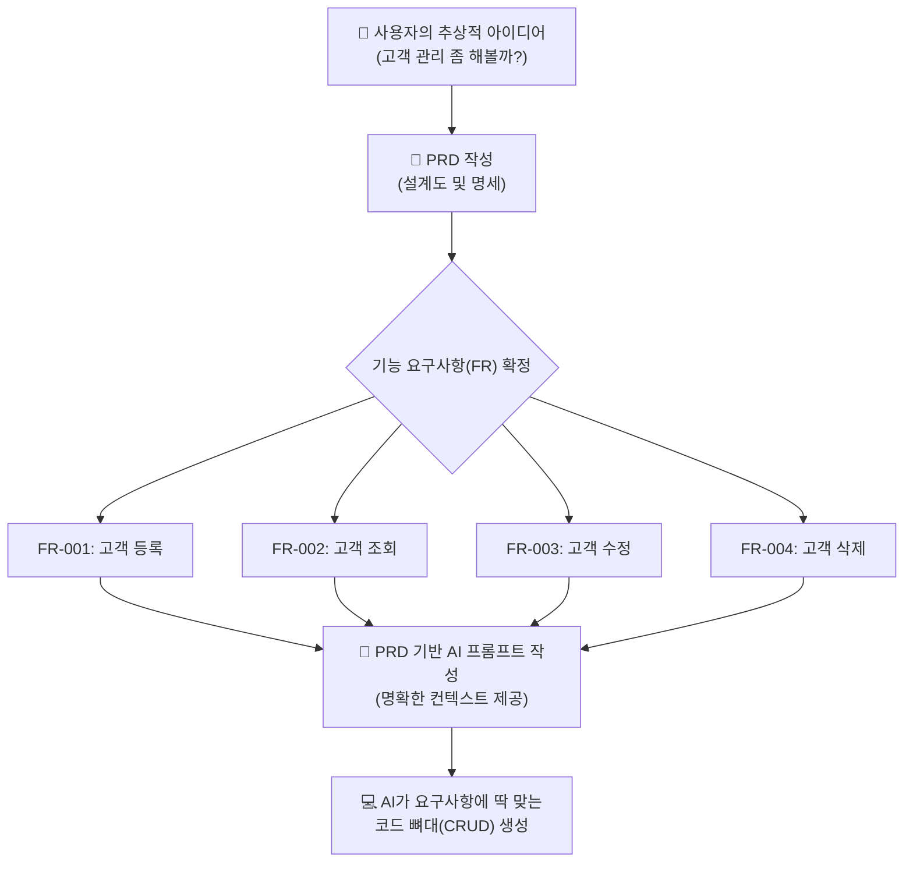

# 마이크로 세션: 067 — 고객 정보 관리 프로그램 PRD 복습 및 설계

> **세션 ID**: MS-PY101-067  
> **소요 시간**: 20분  
> **난이도**: low  
> **청크 타입**: lab  
> **버전**: v2.1 (7섹션 구조)

---

## §1. 개요

> **Day 4 | AM | 세션 067/075**

### 🎯 학습 목표

이 세션이 끝나면, 수강생은 다음을 할 수 있습니다:

- Day 2에서 작성한 PRD를 바탕으로 고객 관리 프로그램의 필수 기능 목록(FR-001~FR-004)을 표로 확정할 수 있다.
- 요구사항 명세서(PRD)가 코딩 단계에서 어떻게 AI 프롬프트의 지시사항(Context)으로 작용하는지 설명할 수 있다.
- AI 에이전트에게 명확한 제약 조건을 담은 프롬프트를 전달하여, 초기 CRUD 콘솔 프로그램의 뼈대 코드를 성공적으로 생성받을 수 있다.

### 선행 세션 환기

바로 직전 세션(세션-066)에서 우리는 GOTO문으로 얽힌 스파게티 코드를 깔끔하게 풀어내는 '구조적 프로그래밍'의 역사적 여정을 배웠습니다. 자, 구조적인 사고방식을 장착했으니 이제 진짜 파이썬 코딩을 시작할 때가 되었습니다! 그런데 잠깐! 무턱대고 AI에게 "프로그램 하나 뚝딱 만들어줘"라고 입력하면 어떻게 될까요? AI가 여러분의 머릿속을 독심술로 읽어낼 수는 없으니, 분명 엉뚱하고 복잡한 프로그램이 튀어나올 겁니다. 집을 지을 때도 도면과 설계도를 먼저 확인하듯이, 우리에게도 코딩의 나침반이 될 설계도가 필요합니다. 다행히 우리는 Day 2에서 이미 훌륭한 설계도를 만들어 두었죠. 바로 PRD(Product Requirements Document, 제품 요구사항 정의서)입니다. 오늘 우리는 이 PRD를 다시 펼쳐 들고 AI에게 명확하게 일을 시키는 첫 단추를 채울 것입니다.

---

## §2. 핵심 개념 (+ 🗣️ 강사 대본 + Mermaid)

### 건축 설계도와 AI 벽돌공

PRD를 건축 설계도에 비유해봅시다. 여러분이 AI라는 마법의 벽돌공을 고용했다고 상상해보세요. 이 벽돌공은 일처리 속도가 엄청납니다. 1초에 벽돌 1,000개를 거뜬히 쌓아 올리죠. 하지만 이 벽돌공에게는 치명적인 약점이 있습니다. 스스로 '어떤 집'을 지을지 기획하지 못한다는 겁니다. "벽돌 좀 쌓아줘"라고만 지시하면, 화장실 위에 거실이 올라가거나, 현관문도 없이 사방이 벽으로 둘러싸인 기괴한 건물을 지어버릴지도 모릅니다.

그래서 설계도가 필요합니다. "1층은 거실과 주방, 2층은 침실 2개, 현관문은 남향"이라고 명확하게 적힌 도면을 주어야만, 이 마법의 벽돌공이 제대로 된 집을 지을 수 있습니다. 우리의 PRD가 바로 이 설계도 역할을 합니다. Day 2에서 5W1H 방법론과 FR(Functional Requirement, 기능 요구사항) 체계까지 배웠으니, 오늘은 그때 만들었던 설계도를 AI에게 전달할 '프롬프트'로 변환할 차례입니다 [Source C: Deep Research §2].

🗣️ **강사 대본 (Instructor Script)**:

> 여러분, 실무 개발자들 사이에서는 이런 말이 있습니다. "기획에 1시간을 더 쓰면, 코딩에서 10시간을 아낀다." 기획 없이 대충 코딩부터 시작했다가 중간에 방향이 틀어져서, 짠 코드를 다 지우고 처음부터 다시 시작하는 고통! 경험해보신 분들은 아마 뼈저리게 아실 겁니다. AI 시대에는 이 말이 더 무섭게 다가옵니다. AI는 코드를 엄청나게 빨리 쏟아내기 때문에, 초반에 방향을 잘못 잡으면 순식간에 쓰레기 코드가 산더미처럼 쌓이게 되거든요. 
>
> 우리가 Day 2에서 PRD를 그토록 공들여 작성했던 이유가 바로 이것입니다. 코드를 한 줄도 짜지 않고도 무엇을 만들지 100% 명확히 하는 것! 자, 설계도를 쥐고 우리의 마법 벽돌공인 AI에게 단호하고 정확한 첫 지시를 내리러 가봅시다. 준비되셨나요?

### Mermaid 다이어그램



---

## §3. 상세 내용

### 1. 기능 요구사항 FR-001 ~ FR-004 확정

우리가 앞으로 만들어갈 프로그램의 공식 명칭은 **'고객 정보 관리 프로그램'**입니다. 이 프로그램은 화려한 웹페이지가 아니라 여러분이 늘 보던 검은색 화면, 즉 콘솔(터미널) 환경에서 동작합니다. 관리할 핵심 데이터 항목은 세 가지입니다: 이름(name), 전화번호(phone), 이메일(email). 

본격적인 파이썬 개발에 앞서, Day 2의 PRD를 바탕으로 기능 요구사항을 깔끔하게 표로 확정하겠습니다 [Source A: 7 기획.pdf §7.3].

| FR ID | 기능명 | 설명 |
|-------|--------|------|
| FR-001 | 고객 등록 | 이름, 전화번호, 이메일을 입력받아 프로그램(메모리)에 저장 |
| FR-002 | 고객 조회 | 등록되어 저장된 전체 고객 목록을 화면에 보기 좋게 출력 |
| FR-003 | 고객 수정 | 특정 고객의 이름을 검색하여 전화번호나 이메일 정보를 변경 |
| FR-004 | 고객 삭제 | 특정 고객의 이름을 검색하여 시스템에서 해당 정보를 삭제 |

### 2. SDD(명세 주도 개발)의 중요성

AI에게 단순히 "고객 관리 프로그램 하나 짜줘"라고 프롬프트를 작성하면 벌어지는 참사를 상상해봅시다. 어떤 AI는 오버해서 화려한 윈도우 창(GUI)을 만들어주고, 어떤 AI는 데이터베이스 서버 연결 코드까지 잔뜩 끼워 넣습니다. 우리가 지금 배우고자 하는 파이썬 기초 수준을 아득히 넘어가 버려, 여러분은 생성된 코드를 읽지도 못하는 상황에 빠지게 됩니다.

하지만 위의 표를 활용하여 "FR-001부터 FR-004까지, 정확히 이 4가지 기능을 콘솔 프로그램으로 구현해줘. 데이터 항목은 이름, 전화번호, 이메일이야"라고 명확한 제한선을 그어주면 어떨까요? AI는 군말 없이 우리가 딱 원하는 수준의 뼈대 코드만 깔끔하게 만들어줍니다 [Source C: Deep Research §6.1]. 

이처럼 명세서(PRD)가 프롬프트의 기준이자 맥락(Context)이 되는 개발 방식이 바로 **SDD(Specification-Driven Development, 명세 주도 개발)**의 본질입니다. 내가 원하는 바를 통제하는 힘, 그것이 바로 PRD의 위력입니다.

> ✅ **체크포인트**: 우리 고객 관리 프로그램의 4가지 필수 기능(FR)은 무엇인가요?
> - 정답: 등록(Create), 조회(Read), 수정(Update), 삭제(Delete)!

---

## §4. 실습 가이드 (+ 🎙️ 실습 대본)

### 실습 목표

이 실습을 통해 수강생은 확정된 PRD 기능 명세서를 바탕으로 AI 프롬프트를 직접 작성하고, AI가 제공하는 초기 CRUD 뼈대 코드를 파일로 생성하는 경험을 합니다.

🎙️ **실습 가이드 대본 (Lab Guide)**:

> 자, 이제 우리가 확정한 이 4가지 막강한 기능 리스트를 들고 AI에게 일을 시키러 갈 시간입니다. 모두 모니터 화면의 Antigravity나 Claude Code 채팅창을 띄워주세요. 방금 우리가 짚어본 표, FR-001부터 004까지의 내용을 그대로 AI에게 전달할 겁니다. 
>
> 여기서 가장 중요한 팁! AI가 오버해서 복잡한 데이터베이스나 화려한 화면을 만들지 않도록 '콘솔 환경', '데이터베이스 없이', '딱 이 4가지만'이라는 제약 조건을 반드시 걸어야 합니다. 제가 화면에 프롬프트 예시를 띄워드릴 테니, 각자의 AI 비서에게 그대로 입력해 보세요. 우리 비서가 어떤 파이썬 코드를 뚝딱 만들어내는지 한번 볼까요?

### 단계별 지시 — PRD 기반 AI 프롬프트 작성 실습

| 단계 | 소요 시간 | 강사 지시사항 | 학습자 액션 | 예상 결과 |
|------|----------|--------------|------------|----------|
| 1 | 3분 | "PRD 4가지 핵심 기능 재확인" | 교안의 FR 표 내용을 눈으로 재확인 | 구현할 C/R/U/D 4가지 기능 인지 |
| 2 | 4분 | "AI에게 뼈대 코드 요청 프롬프트 입력" | 실습용 프롬프트를 AI 채팅창에 복사/붙여넣기 | AI가 프롬프트 분석 및 파이썬 코드 생성 |
| 3 | 5분 | "AI 생성 코드 가볍게 리뷰하기" | AI가 출력한 코드의 `input()`, `append` 등 확인 | 프로그램의 전체 구조(루프) 파악 |
| 4 | 3분 | "로컬에 파이썬 파일 생성 저장" | AI에게 코드를 파일로 저장해달라고 지시 | `customer_manager.py` 파일 생성 완료 |

**[단계 1] PRD 내용 숙지**

앞서 배운 4가지 기능(등록, 조회, 수정, 삭제)과 3가지 데이터 항목(이름, 전화번호, 이메일)을 다시 한번 확인합니다. 이 항목들이 어떻게 프로그램의 뼈대가 될지 머릿속으로 그려봅니다.

**[단계 2] AI에게 뼈대 코드 요청**

여러분들의 AI 에이전트에게 다음 프롬프트를 복사하여 입력하세요.

```text
너는 파이썬 백엔드 개발자야. 내가 제공하는 PRD 기능 요구사항(FR)에 맞춰서 
파이썬 콘솔용 '고객 정보 관리 프로그램'의 뼈대 코드를 작성해줘.

[요구사항]
- 환경: 터미널(콘솔) 환경의 순수 파이썬 코드
- 데이터 항목: 이름(name), 전화번호(phone), 이메일(email)
- 저장 방식: 메모리(리스트나 딕셔너리 사용, DB나 파일 저장 기능은 아직 절대 넣지 마)

[기능 목록]
- FR-001: 고객 등록 (사용자로부터 정보 입력받아 저장)
- FR-002: 고객 조회 (저장된 전체 목록 출력)
- FR-003: 고객 수정 (이름으로 검색해 정보 변경)
- FR-004: 고객 삭제 (이름으로 검색해 정보 삭제)

복잡한 함수 구조나 클래스 대신, 가장 이해하기 쉬운 단순한 형태의 while 루프와 if문으로 먼저 뼈대를 짜줘.
```

**[단계 3] AI 생성 코드 리뷰**

AI가 답변을 줄 것입니다. 지금 이 코드를 완벽히 이해하지 못해도 전혀 문제없습니다! 스크롤을 내리면서 다음의 파이썬 키워드들이 등장하는지만 확인해 보세요.
- `input()` : 사용자에게 메뉴나 정보를 묻는 부분입니다.
- `append()` : 리스트 바구니에 고객 정보를 새로 집어넣는(등록) 부분입니다.
- `for` : 바구니에 든 고객들을 하나씩 꺼내서 보여주는(조회) 부분입니다.

**[단계 4] 로컬 파일로 저장**

코드가 잘 나왔다면, AI에게 이 코드를 실제 파일로 만들어달라고 추가로 요청합니다.

```text
위에서 작성해준 코드를 현재 폴더에 'customer_manager.py' 파일로 저장해줘.
```

VS Code 탐색기나 작업 폴더에 `customer_manager.py` 파일이 무사히 생성되었다면, 이번 실습은 대성공입니다! 이제 우리는 벽돌을 쌓을 준비를 마쳤습니다.

---


### 🎓 강사 노트 (Instructor Support)

- ⏱️ **타이밍**: 09:40 (20분, narrative)
- 🎯 **핵심 활동**: Day 2 PRD 꺼내서 복습
- ⚠️ **강사 주의사항**: "이제 이 설계도로 진짜 프로그램을 만듭니다"

## §5. 코드 및 명령어 모음

### 프롬프트: PRD 기반 핵심 제약조건 명시

```text
파이썬 콘솔 기반 고객 관리 프로그램 코드를 짜줘.
기능은 1. 등록, 2. 조회, 3. 수정, 4. 삭제 4가지야.
데이터는 이름, 전화번호, 이메일만 관리해. 
DB 없이 그냥 메모리에 변수로 저장하는 가장 단순한 절차적 형태로 작성해줘.
```
이 프롬프트는 실습 가이드의 프롬프트를 조금 더 간략화한 버전입니다. 핵심은 제약 조건(DB 없이, 4가지 기능만)을 명시하여 AI의 과잉 코딩을 방어하는 것입니다.

### 관련 파이썬 기본 문법 (미리보기)

우리가 앞으로 채워나갈 코드의 핵심 문법 요소들입니다. 이 구조들을 눈에 익혀두세요.

```python
# 빈 리스트 준비 (고객 데이터 전체를 담을 큰 바구니)
customers = []

# 단일 고객 데이터 딕셔너리 (한 명의 정보 꾸러미)
customer = {
    "name": "홍길동",
    "phone": "010-1234-5678",
    "email": "hong@example.com"
}

# 리스트에 딕셔너리 추가 (FR-001 등록 기능의 핵심 동작)
customers.append(customer)
```

---

## §6. 요약

### 핵심 학습 포인트

오늘 우리는 본격적인 코드 작성에 앞서 PRD(제품 요구사항 정의서)를 명확히 세팅하는 것이 왜 중요한지 직접 체험했습니다. 설계도 없이 벽돌을 쌓으면 괴상한 집이 나오듯, 기능 명세 없이 AI에게 코딩을 맡기면 원치 않는 결과물이 나옵니다. 우리는 FR-001(등록)부터 FR-004(삭제)까지 4가지 핵심 기능을 확정했고, 이를 프롬프트로 변환하여 AI에게 전달하여 초기 뼈대 코드까지 성공적으로 얻어냈습니다. 이렇게 명세서 기반으로 개발을 진행하는 방식을 명세 주도 개발(SDD)이라고 부르며, 이것이 AI 개발 시대의 핵심 역량입니다.

### 다음 세션 예고

오늘 AI가 짜준 코드를 슬쩍 보셨나요? 아마 while문 하나 안에 길게 이어진 절차적인 코드일 것입니다. 다음 세션(068)에서는 방금 우리가 다룬 등록, 조회, 수정, 삭제라는 4가지 기능, 소프트웨어 개발의 알파와 오메가인 이른바 'CRUD'의 본질적인 개념을 깊이 이해하고 파헤쳐 볼 것입니다.

### 브릿지 노트

> "설계도를 들고 AI 벽돌공에게 첫 번째 주문을 성공적으로 내렸습니다! 여러분의 프로젝트 폴더에 `customer_manager.py` 파일이 생겼나요? 이 작은 파이썬 파일은 앞으로 여러분이 구조적 프로그래밍을 배우고, 함수를 분리하고, 리팩토링을 거치면서 훨씬 멋지고 견고한 프로그램으로 진화할 겁니다. 설계도가 완벽하게 준비되었으니, 다음 시간부터는 모든 시스템의 근간이 되는 'CRUD'의 마법에 대해 자세히 알아보겠습니다!"

---

## §7. 참고 자료

### 3-Source 출처

- **Source A (로컬 참고자료)**: 「7 기획.pdf」 §7.3 — PRD 구조 및 기능 요구사항(FR) 작성법
- **Source B (NotebookLM)**: Day 4 팩트 패킷 — 사용자 요구사항을 시스템 기능으로 매핑하는 논리 및 CRUD 개념 연계
- **Source C (Deep Research)**: Day 4 팩트 패킷 §2, 6.1 — 고객 데이터를 메모리에 저장하는 아키텍처 고민의 시작점

### 강사 노트

> 💡 **강사 노트**: 이 세션은 Day 2의 기획 내용과 Day 4의 실제 구현을 연결하는 아주 중요한 브릿지 세션입니다. 수강생들이 PRD를 귀찮은 문서 작업이 아니라, 'AI를 내 마음대로 통제하는 가장 강력한 주문서'로 인식하도록 톤앤매너를 끌어올려 강조해 주세요. 
> 특히 §4 실습에서 수강생마다 사용하는 AI 모델(Claude vs Gemini)에 따라 나오는 결과물 코드가 조금씩 다를 수 있습니다. 당황하지 마시고, "AI마다 집을 짓는 스타일이 달라서 그렇습니다. 중요한 건 우리가 지시한 4가지 기능(등록/조회/수정/삭제)이 다 들어있느냐입니다"라고 유연하게 안내해 주시면 됩니다.

---

## ✅ 세션 완료 체크리스트 (강사용)

- [ ] §1~§7 모든 섹션이 빠짐없이 작성되었는가?
- [ ] 🗣️ 강사 대본과 🎙️ 실습 대본이 구어체로 자연스럽게 작성되었는가?
- [ ] §2에 PRD와 AI 프롬프트의 관계를 보여주는 Mermaid 다이어그램이 포함되었는가?
- [ ] §4 실습 가이드에 PRD를 활용한 상세한 프롬프트 실습 단계가 포함되었는가?
- [ ] Day 4의 팩트 패킷 내용(CRUD 연계 등)이 잘 반영되었는가?

---

**🔗 선행 세션**: [세션-066] AI 시대의 서사 복습: 구조적 프로그래밍으로의 여정  
**🔗 후행 세션**: [세션-068] CRUD 개념 이해 및 1차 프롬프트 작성 실습  

---

*작성 일시: 2026-02-25*  
*작성 에이전트: Sisyphus-Junior*  
*교안 구조: 7섹션 (v2.1)*