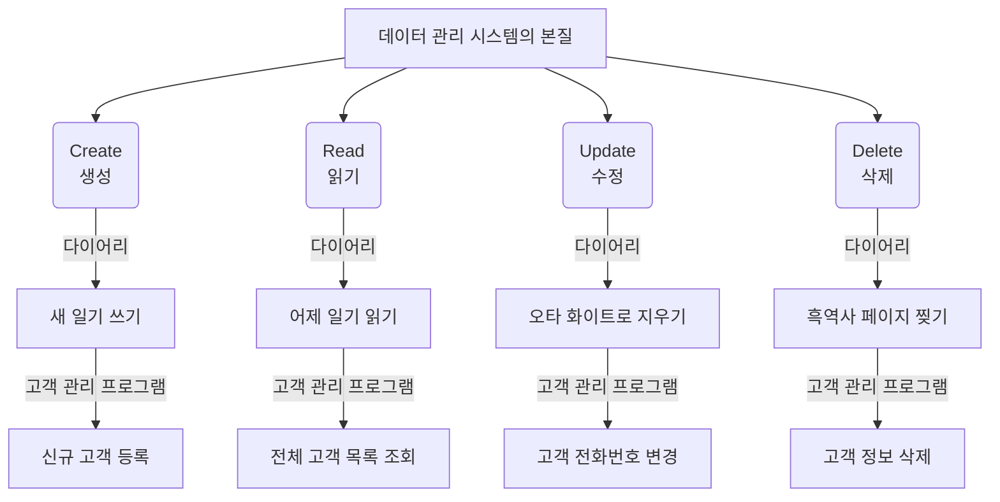

# 마이크로 세션: 068 — CRUD 개념 이해 및 1차 프롬프트 작성 실습

> **세션 ID**: MS-PY101-068  
> **소요 시간**: 25분  
> **난이도**: medium  
> **청크 타입**: lab  
> **버전**: v2.1 (7섹션 구조)

---

## §1. 개요

> **Day 4 | AM | 세션 068/075**

### 🎯 학습 목표

이 세션이 끝나면, 수강생은 다음을 할 수 있습니다:

- 세상 모든 데이터 기반 애플리케이션의 핵심인 CRUD의 4가지 개념을 설명할 수 있다.
- 절차적 방식의 콘솔 프로그램이 갖추어야 할 기본 뼈대(무한 루프, 메뉴 분기)를 이해할 수 있다.
- 직전 세션에서 설계한 PRD를 바탕으로, AI에게 정확한 제약 조건을 담은 1차 프롬프트를 작성하여 코드를 생성할 수 있다.

### 선행 세션 환기

우리는 방금 전 세션(067)에서 '고객 정보 관리 프로그램'을 위한 PRD(요구사항 정의서)를 함께 작성했습니다. 어떤 데이터를 받을지, 어떤 기능이 들어가야 할지 문서로 잘 정리해 두었죠. 이제 이 기획서를 바탕으로 실제 코드를 만들어낼 차례입니다. 하지만 무작정 "고객 관리 프로그램 만들어줘!"라고 하면 AI는 너무 복잡하거나 우리가 원하지 않는 방식(예: 클래스나 데이터베이스를 사용한 방식)으로 코드를 짜버릴 수 있습니다. 오늘 우리가 배울 'CRUD'라는 마법의 단어와 명확한 제약 조건을 사용하면, AI를 완벽하게 통제할 수 있습니다.

---

## §2. 핵심 개념 (+ 🗣️ 강사 대본 + Mermaid)

### 세상 모든 앱의 공통점: CRUD

인스타그램으로 사진을 올리는 것, 배달의민족에서 리뷰를 쓰는 것, 넷플릭스에서 내 찜 목록을 관리하는 것. 이 모든 행동에 숨어 있는 공통점이 무엇일까요? 이 거대한 서비스들도 까보면 결국 딱 4가지 기능의 반복일 뿐입니다. 데이터를 만들고(Create), 읽고(Read), 고치고(Update), 지우는(Delete) 것. 이것의 앞글자만 따서 **CRUD**(크루드)라고 부릅니다. 

### 다이어리(일기장) 비유

CRUD를 가장 직관적으로 이해하기 위해 여러분의 다이어리를 떠올려보세요. 
- **C**reate (생성): 빈 페이지에 새 일기를 쓰는 것
- **R**ead (읽기): 어제 쓴 일기를 다시 펼쳐서 읽어보는 것
- **U**pdate (수정): 오타가 있어서 화이트로 지우고 내용을 고치는 것
- **D**elete (삭제): 너무 부끄러운 흑역사가 담긴 페이지를 찢어버리는 것

이게 전부입니다! 세상에서 가장 복잡한 소프트웨어도 이 네 가지 동작을 복잡하게 조합하고 포장해 놓은 것에 불과합니다. 

🗣️ **강사 대본 (Instructor Script)**:

> 여러분, 웹 서비스든 모바일 앱이든 그 본질은 결국 CRUD입니다. 고객 데이터를 새로 만들고(Create), 화면에 보여주고(Read), 이사 가면 주소를 고치고(Update), 탈퇴하면 지우는(Delete) 거죠. 우리가 오늘 만들 고객 관리 프로그램도 이 CRUD의 정석을 따릅니다.
> 
> 재미있는 건, AI에게 일을 시킬 때도 이 네 가지 액션 단어를 명확하게 써주어야 모호함 없이 코드가 생성된다는 겁니다. "데이터를 알아서 잘 관리해 줘"라고 말하는 것보다, "데이터를 대상으로 C, R, U, D 기능을 각각 구현해 줘"라고 말하는 것이 훨씬 정확한 프롬프팅이 됩니다. 명확한 지시는 명확한 결과를 낳습니다. 자, 이제 이 개념을 우리 프로그램에 어떻게 녹여낼지 구조를 살펴볼까요?

### Mermaid 다이어그램



---

## §3. 상세 내용

### CRUD의 정확한 정의와 매핑

CRUD는 시스템의 기본 데이터 처리 기능을 뜻하는 IT 업계의 표준 용어입니다. 실무 데이터베이스 세계에서는 이것이 `INSERT`, `SELECT`, `UPDATE`, `DELETE`라는 SQL 명령어와 1:1로 대응됩니다. 하지만 우리는 아직 데이터베이스를 배우지 않았죠? 대신 파이썬의 기본 자료구조인 **리스트(List)**와 **딕셔너리(Dictionary)**를 사용하여 이 데이터를 메모리 상에서 관리할 것입니다.

### 절차적 CRUD 프로그램의 뼈대: 메뉴 루프

모든 CRUD 콘솔 프로그램에는 반드시 '메뉴'가 필요합니다. 사용자가 프로그램에 들어왔을 때, "나는 지금 등록(C)을 할 거야" 또는 "나는 지금 조회(R)를 할 거야"라고 선택할 수 있는 입구가 있어야 합니다. 

우리가 AI에게 만들어달라고 할 프로그램의 뼈대는 다음과 같습니다:
1. `while True:` 무한 루프를 돌면서 꺼지지 않는 프로그램을 만듭니다.
2. `input()` 함수로 화면에 메뉴 번호(1. 등록, 2. 조회...)를 띄우고 입력을 받습니다.
3. `if / elif` 조건문으로 입력받은 번호에 따라 CRUD 각 기능을 분기시켜 실행합니다.

이것이 바로 Day 4 오전의 핵심 테마인 **절차적(Procedural) 프로그래밍** 방식의 전형적인 구조입니다. 코드가 기능(함수)으로 예쁘게 나뉘어 있지 않고, 위에서 아래로 순차적으로 쭉 흘러가는 형태입니다.

> ✅ **체크포인트**: 시스템의 기본 데이터 처리 기능 4가지(C, R, U, D)는 각각 무엇의 약자인가요?

---

## §4. 실습 가이드 (+ 🎙️ 실습 대본)

### 실습 목표

수강생은 Day 2에서 배운 '5대 필수 항목 프롬프트' 규칙과 이전 세션의 'PRD'를 결합하여, 절차적 방식의 고객 관리 프로그램을 만들어내는 1차 프롬프트를 작성하고 AI에게 전송합니다.

🎙️ **실습 가이드 대본 (Lab Guide)**:

> 자, 이제 여러분이 직접 AI에게 지시를 내릴 시간입니다. 우리가 방금 배운 CRUD 개념을 팍팍 넣어서 프롬프트를 써볼 거예요. 
> 
> 주의할 점이 하나 있습니다. 지금 우리는 '절차적 프로그래밍'의 한계를 직접 겪어보기 위해, 일부러 조금 촌스러운(?) 방식의 코드를 원하고 있어요. 만약 제약 조건을 헐렁하게 주면 AI는 너무 똑똑해서, 처음부터 최신 객체지향 방식으로 클래스와 함수를 잔뜩 써서 완벽한 코드를 짜버릴 겁니다. 그러면 우리가 학습할 게 없어지겠죠? 그래서 이번 프롬프트에는 반드시 "함수 쓰지 마!", "절차적으로 짜줘!"라는 제약 조건을 엄격하게 걸어주어야 합니다.

### 단계별 지시사항

| 단계 | 소요 시간 | 강사 지시사항 | 학습자 액션 | 예상 결과 |
|------|----------|--------------|------------|----------|
| 1 | 5분 | "Day 2 구조를 참고하여 프롬프트 초안을 작성하세요" | 에디터에 기능, 입력, 출력, 제약, 예외 5대 항목 작성 | 프롬프트 초안 완성 |
| 2 | 2분 | "가장 중요한 3대 키워드가 있는지 확인하세요" | '절차적', '전역 리스트', 'while True' 단어 점검 | 조건 누락 방지 |
| 3 | 5분 | "Agent Manager에 전송하고 코드를 받아보세요" | AI에게 프롬프트 전송 후 결과물 대기 | 절차적 CRUD 코드 생성 |
| 4 | 3분 | "코드를 새 파일로 저장하세요 (실행 금지!)" | `customer_manager_v1.py` 파일 생성 및 코드 복사 | 파일 저장 완료 |

**[단계 1] 프롬프트 초안 작성**

새 메모장이나 빈 텍스트 파일을 열고, 아래 구조를 참고하여 프롬프트를 작성하세요. 지난 세션에서 만든 PRD의 내용이 [기능]과 [입력]에 들어갑니다.

**[단계 2] ⚠️ 핵심 제약조건(키워드) 확인**

작성한 프롬프트에 다음 세 가지 키워드가 정확히 들어갔는지 눈으로 다시 한번 확인하세요.
- **절차적 방식** (또는 함수/클래스 사용 금지)
- **전역 리스트**에 딕셔너리를 저장
- **while True** 메뉴 루프 사용

이 단어들이 빠지면 AI가 우리가 원하지 않는 너무 고급화된 구조적 코드를 만들어버립니다.

**[단계 3] 프롬프트 전송 및 생성 대기**

작성한 프롬프트를 복사하여 AI Agent 창에 붙여넣고 전송합니다. AI가 열심히 코드를 작성하는 동안, 코드가 여러분이 지시한 제약 조건(`while`, `if`, 함수 없음)을 잘 지키고 있는지 실시간으로 관찰해 보세요.

**[단계 4] 코드 저장 (실행은 잠시 대기!)**

AI가 생성한 파이썬 코드를 모두 복사합니다. Antigravity IDE의 탐색기 창에서 우클릭하여 새 파일을 만들고 이름을 `customer_manager_v1.py`로 지정합니다. 복사한 코드를 붙여넣고 저장(`Ctrl + S` 또는 `Cmd + S`)하세요. 

🗣️ **강사 대본 (Instructor Script)**:

> 다들 코드를 잘 받아오셨나요? 코드가 꽤 길죠? 아마 한 덩어리로 된 코드가 50줄에서 100줄 가까이 나왔을 겁니다. 
> 
> 손이 근질근질하시겠지만, 덜컥 재생(Run) 버튼부터 누르지 마세요. 우리는 POE(예측 → 검증 → 설명) 학습 사이클을 기억하고 있습니다. 자동차의 시동을 걸기 전에 엔진룸을 열어 구조부터 살펴봐야 합니다. 

---


### 🎓 강사 노트 (Instructor Support)

- ⏱️ **타이밍**: 10:10 (25분, lab)
- 🎯 **핵심 활동**: CRUD 프롬프트 → 절차적 코드 생성
- ⚠️ **강사 주의사항**: v1 코드 생성의 핵심 세션


### 📋 실습 설계 보강 (Lab Packet)

**세션 068 실습 설계 보강**

CRUD 개념 이해 및 1차 프롬프트 작성 실습
- **3-Stage Example Set**
  - 기본: CRUD 4요소를 포함한 콘솔 프로그램 프롬프트 작성 → AI에게 전달
  - 변형: "메뉴 선택 방식으로 만들어줘" 추가 제약 포함
  - 실수 해결: "프롬프트가 너무 길어서 AI가 일부만 구현했어요" → 핵심 기능부터 점진적 요청
- **난이도 예측**: CRUD 자체는 이해하기 쉬우나 4개를 한 프로그램에 담는 프롬프트 작성이 난관
- **타이밍 가이드**: CRUD 개념 복습 3분 | 프롬프트 작성 10분 | AI 코드 생성·확인 7분 | 정리 5분
- **심리적 장벽**: "4가지 기능을 한 번에 만들어야 한다고?"
- **자가 점검**:
  - [ ] C(등록), R(조회), U(수정), D(삭제) 4가지를 모두 요구하는 프롬프트를 작성했는가?
  - [ ] 메뉴 선택 방식(1~4번)이 프롬프트에 포함되었는가?
  - [ ] 생성된 코드에 while 무한루프 메뉴가 있는가?

## §5. 코드 및 명령어 모음

### 1차 프롬프트 템플릿 (참고용)

학습자가 직접 작성하는 것이 원칙이나, 막힌 수강생을 위해 제공하는 모범 답안 프롬프트입니다.

```text
고객 정보를 관리하는 콘솔 프로그램을 Python으로 작성해줘.

[기능] 고객 등록(C), 전체 조회(R), 정보 수정(U), 고객 삭제(D)
[입력] 이름, 전화번호, 이메일
[출력] 메뉴 선택 → 해당 기능 실행 결과 출력
[제약] 
- 오직 "절차적 방식"으로만 작성할 것. 함수(def)나 클래스(class) 사용 절대 금지.
- 고객 데이터는 1개의 전역 리스트(list)에 딕셔너리(dict) 형태로 저장할 것.
- 프로그램 뼈대는 while True 무한 루프와 if/elif를 사용한 메뉴 선택 방식을 쓸 것.
[예외] 
- "종료" 메뉴를 선택할 때만 무한 루프를 빠져나오게(break) 할 것.
```

### AI가 생성할 예상 코드 뼈대 (개념적 구조)

AI는 위 프롬프트를 받고 대략 아래와 같은 형태의 거대한 코드를 만들어냅니다. (함수가 없고 하나의 큰 루프 안에 모든 로직이 들어간 상태)

```python
# 전역 리스트 (데이터 저장소)
customers = []

# 메인 무한 루프
while True:
    print("\n=== 고객 관리 시스템 ===")
    print("1. 등록 (C)")
    print("2. 조회 (R)")
    print("3. 수정 (U)")
    print("4. 삭제 (D)")
    print("5. 종료")
    
    menu = input("메뉴를 선택하세요: ")
    
    if menu == '1':
        # Create 로직 (input으로 이름, 번호 등 받고 append)
        pass
    elif menu == '2':
        # Read 로직 (for문으로 customers 리스트 출력)
        pass
    # ... (U, D 생략) ...
    elif menu == '5':
        print("프로그램을 종료합니다.")
        break
```

---

## §6. 요약

### 핵심 학습 포인트

이번 세션에서 우리는 세상 모든 소프트웨어의 뼈대가 되는 CRUD(생성, 읽기, 수정, 삭제)의 개념을 배웠습니다. 다이어리에 비유했던 이 네 가지 동작은 개발자와 AI가 소통할 때 가장 강력하고 명확한 지시어가 됩니다. 또한, 우리는 일부러 함수를 배제하고 절차적으로 흘러가는 코드를 짜달라고 AI에게 강력한 제약을 걸어 성공적으로 코드를 생성해 냈습니다.

### 다음 세션 예고

다음 세션에서는 여러분이 방금 저장한 `customer_manager_v1.py` 파일을 열어볼 것입니다. 코드를 실행하기 전에, 먼저 파이썬 내부에서 우리의 고객 데이터(이름, 전화번호, 이메일)가 도대체 어떤 모형으로 묶여서 전역 리스트에 들어가는지, 그 '데이터 저장 구조'의 실체를 현미경으로 들여다보겠습니다. 

### 브릿지 노트

> "여러분, 코드는 무사히 파일로 저장해 두셨죠? 방금 만든 코드는 아직 거친 원석과 같습니다. 다음 시간에는 이 코드의 맨 윗부분을 차지하고 있는 리스트와 딕셔너리가 어떻게 고객 정보를 안전하게 보관하는지 그 비밀을 파헤쳐 보겠습니다. 잠시 쉬었다가 데이터 구조의 세계로 들어가 봅시다!"

---

## §7. 참고 자료

### 3-Source 출처

- **Source A (로컬 참고자료)**: 「7 기획.pdf」, 「8 코딩.pdf」 — PRD 구조를 코드로 맵핑 및 절차적 프로그래밍 패턴
- **Source B (NotebookLM)**: SRC-B03 — CRUD의 4가지 핵심 개념과 절차적 콘솔 프로그램 설계
- **Source C (Deep Research)**: SRC-C02 — AI에게 명확하게 CRUD 기능 구현을 지시하는 프롬프트 엔지니어링 방법론

### 강사 노트

> 💡 **강사 노트**: 수강생들이 작성한 프롬프트로 인해 생성된 코드는 제각각 다를 수밖에 없습니다. 변수 이름이 `customer_list`일 수도 있고 `customers`일 수도 있죠. 이 점을 수강생들에게 명확히 인지시켜 주세요. "AI가 짜준 코드는 여러분의 프롬프트 뉘앙스에 따라 조금씩 다를 겁니다. 완전히 정상이에요. 중요한 건 그 안에 C, R, U, D 4가지 조건 분기가 들어있느냐입니다"라고 안심시켜 주시는 것이 좋습니다. 또한 함수(`def`)가 생성된 분이 있다면 제약조건 누락이 원인이니 프롬프트를 수정해 다시 돌리도록 유도하세요.

---

## ✅ 세션 완료 체크리스트 (강사용)

- [ ] §1~§7 모든 섹션이 충실하게 작성되었는가?
- [ ] 다이어리 비유를 통한 CRUD 1:1 매핑이 명확히 전달되었는가?
- [ ] 프롬프트 작성 시 '절차적', '전역 변수' 제약의 중요성이 강조되었는가?
- [ ] 단계별 실습 가이드가 구체적으로 제시되었는가?
- [ ] 다음 세션(데이터 구조 분석)을 위한 브릿지 노트가 포함되었는가?

---

**🔗 선행 세션**: [세션-067] 고객 정보 관리 프로그램 PRD 복습 및 설계  
**🔗 후행 세션**: [세션-069] 데이터 저장 구조(전역 리스트, 딕셔너리) 이해

---

*작성 일시: 2026-02-25*  
*작성 에이전트: Sisyphus-Junior*  
*교안 구조: 7섹션 (A0 팀 공통 표준)*