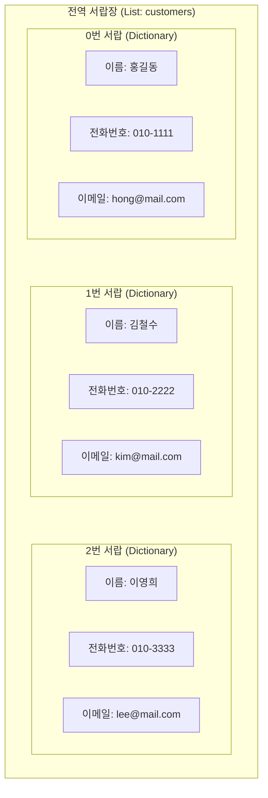
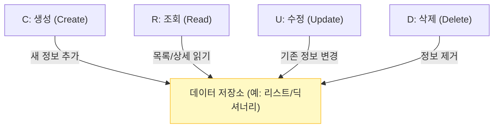

# 마이크로 세션: 069 — 데이터 저장 구조(전역 리스트, 딕셔너리) 이해

> **세션 ID**: MS-PY101-069
> **소요 시간**: 20분
> **난이도**: medium
> **청크 타입**: narrative
> **버전**: v2.1 (7섹션 구조)

---

## §1. 개요

> **Day 4 | AM | 세션 069/075**

이 세션은 5일간의 "AI-native 파이썬 기초" 과정 중 4일차 오전에 진행되는 핵심 이론 세션입니다. 우리가 만들 고객 관리 프로그램이 어떻게 데이터를 기억하고 저장하는지, 그 밑바탕이 되는 데이터 저장 구조를 다룹니다. AI가 코드를 알아서 짜준다고 해도, 데이터가 저장되는 '모양'을 우리가 정확히 통제하지 않으면 파편화된 스파게티 데이터 구조가 만들어질 수 있습니다. 이 세션에서는 리스트와 딕셔너리의 결합 구조를 통해 데이터를 안전하게 관리하는 법을 배웁니다.

### 🎯 학습 목표

이 세션이 끝나면 수강생은 다음을 할 수 있어요:
- AI가 생성한 코드에서 전역 리스트와 딕셔너리가 결합된 데이터 저장 구조를 식별하고 설명할 수 있습니다.
- 파편화된 데이터와 구조화된 데이터의 차이점을 분석하고, 왜 구조화가 필요한지 이해할 수 있습니다.
- "딕셔너리를 담은 리스트(List of Dictionaries)" 패턴이 왜 가장 흔하게 쓰이는 데이터 구조인지 설명할 수 있습니다.

### 선행 세션 환기

직전 세션(세션 068)에서 우리는 모든 시스템의 뼈대인 CRUD 기능의 개념을 배우고, 첫 번째 프롬프트를 작성했습니다. "고객 정보를 관리하는 프로그램을 절차적으로 작성해줘"라고 지시했죠. 이제 AI가 코드를 뱉어낼 텐데, 그 코드를 무작정 실행하기 전에 "이 프로그램은 고객의 이름과 전화번호를 대체 어디에, 어떤 모양으로 보관하는가?"라는 아주 본질적인 질문부터 해결하고 넘어갈 거예요.

---

## §2. 핵심 개념 (+ 🗣️ 강사 대본 + Mermaid)

### 서랍장과 라벨이 붙은 칸막이함 (리스트와 딕셔너리의 결합)

우리가 다룰 핵심 개념은 '전역 리스트 안에 딕셔너리가 들어간 구조(List of Dictionaries)'입니다. 이것을 이해하기 위해 Day 3에서 배웠던 비유를 다시 꺼내보겠습니다. **리스트(List)**가 거대한 '서랍장'이라면, **딕셔너리(Dictionary)**는 각 서랍 안에 들어가는 '라벨이 붙은 칸막이함'입니다. 서랍장(리스트)은 0번, 1번 순서대로 고객을 줄 세워 보관하고, 칸막이함(딕셔너리)은 한 고객의 이름, 전화번호, 이메일을 각각의 라벨을 붙여 깔끔하게 묶어둡니다.

🗣️ **강사 대본 (Instructor Script)**:

> AI가 코드를 짜주긴 했는데, 실행 버튼을 누르기 전에 한 가지 짚고 넘어갈 게 있습니다. 여러분이 화면에 고객의 이름, 전화번호, 이메일을 입력하면, 그 데이터는 도대체 어디로 가는 걸까요? 그냥 공중에 둥둥 떠다니지는 않겠죠? 컴퓨터 메모리 어딘가에 차곡차곡 쌓여야만 우리가 나중에 다시 꺼내볼 수 있습니다.
>
> Day 3에서 배웠던 비유를 다시 떠올려볼까요? 리스트(List)는 '서랍장'입니다. 위에서부터 0번 서랍, 1번 서랍, 2번 서랍이 차례대로 있죠. 그리고 딕셔너리(Dictionary)는 각 서랍 안에 들어가는 '라벨이 붙은 칸막이함'이에요.
>
> 엑셀을 자주 쓰셨던 분이라면 이렇게 생각하시면 아주 쉽습니다. 엑셀 시트의 한 행(Row), 즉 홍길동이라는 사람의 데이터 한 줄이 바로 딕셔너리입니다. "이름" 칸에는 "홍길동", "전화번호" 칸에는 "010-1234-5678"이 들어가는 식이죠. 그리고 이 엑셀 시트 전체, 즉 1번 줄부터 끝 줄까지 모아둔 장부가 바로 리스트입니다.
>
> 그래서 우리의 고객 데이터는 "딕셔너리를 담은 리스트(List of Dictionaries)"라는 구조로 관리됩니다. 파이썬뿐만 아니라 현대 프로그래밍에서 가장 흔하게 쓰이는 데이터 저장 패턴이에요. 여기서 중요한 점이 하나 있습니다. AI에게 '데이터를 이런 형태로 저장해줘'라고 명확히 지정하지 않으면, AI는 자기 마음대로 이상한 형태, 예를 들어 문자열 하나에 콤마를 찍어 이어붙이는 식으로 저장해버릴 수 있어요. 자료구조의 모양을 우리가 지정하고 통제하는 것, 이것이 AI를 다루는 첫 단추입니다.

### Mermaid 다이어그램



이 다이어그램은 리스트와 딕셔너리가 어떻게 결합되어 하나의 데이터베이스 역할을 하는지 시각적으로 보여줍니다. 바깥쪽의 큰 박스가 리스트(`customers = []`)이며, 그 안의 작은 박스들이 개별 고객의 정보를 담고 있는 딕셔너리들입니다. 하나의 딕셔너리가 한 명의 고객 정보를 온전히 책임집니다.

---


### 🎨 추가 시각화 (Visualization Packet)

**데이터 CRUD 흐름도**

시스템 내에서 데이터를 조작하는 4가지 가장 기초적이고 핵심적인 액션입니다.



## §3. 상세 내용

### Why — 왜 이 세션이 필요한가?

프로그래밍 초보자들이 가장 많이 겪는 혼란 중 하나는 "데이터가 프로그램 안에서 어떤 모양으로 존재하는가"를 머릿속으로 그리지 못하는 것입니다. AI가 작성해 준 코드도 마찬가지입니다. 코드가 길어지고 복잡해지면, 내가 지금 다루고 있는 데이터가 단순한 문자열인지, 리스트인지, 아니면 딕셔너리인지 헷갈리게 됩니다. 데이터를 딕셔너리들의 리스트로 '구조화'해서 보관하는 이유를 명확히 깨닫지 못하면, 이후에 Update(수정)나 Delete(삭제) 기능을 구현할 때 특정 데이터를 어떻게 찾아야 할지 몰라 방황하게 됩니다.

### What — 이 세션에서 다루는 것은 무엇인가?

이 세션에서는 크게 두 가지 핵심 개념을 다룹니다.
첫째, **파편화된 데이터와 구조화된 데이터의 비교**입니다. 이름끼리, 전화번호끼리 별도의 리스트로 분리해서 관리할 때 발생하는 유지보수의 위험성(인덱스 불일치)을 살펴보고, 하나의 딕셔너리로 속성을 묶어 관리하는 것의 압도적인 안전성을 배웁니다.
둘째, **전역 변수로서의 리스트**입니다. 코드 최상단에 선언된 `customers = []`가 프로그램 전체에서 공유되는 '전역(global) 서랍장' 역할을 한다는 것을 이해합니다. 하지만 동시에 이 전역 변수가 프로그램이 종료되면 초기화되어 사라지는 메모리상의 존재라는 치명적인 한계점도 함께 짚고 넘어갑니다.

### How — 구체적으로 어떻게 진행하는가?

먼저 파편화된 데이터의 끔찍한 결말을 예시로 들어 경각심을 줍니다. 이름 리스트와 전화번호 리스트를 따로 관리하다가 중간에 데이터가 하나 꼬이면, 홍길동의 전화번호가 김철수의 번호로 둔갑하는 대참사가 일어난다는 점을 강조합니다. 이후, 딕셔너리를 활용해 데이터를 한 묶음으로 묶는 '구조화'의 우월성을 명확히 비교 설명합니다. 마지막으로, AI가 작성한 코드 최상단에 빈 리스트가 선언되어 있는지 직접 눈으로 확인하고 그 의미를 묻는 질문으로 수강생들의 참여를 유도합니다.

---


### 📊 참고 표 (Visual Specs)

**CRUD 오퍼레이션 핵심 요약**

| CRUD 명칭 | 의미 | 파이썬 리스트/딕셔너리 연산 | 고객 관리 프로그램의 기능 |
|:---|:---|:---|:---|

## §4. 실습 가이드 (+ 🎙️ 실습 대본)

### 실습 목표

수강생들이 AI가 작성해 준 코드 속에서 전역 변수 리스트와 딕셔너리의 결합 구조를 직접 눈으로 확인하고, 이것이 프로그램의 유일한 '저장소' 역할을 한다는 것을 깨닫도록 돕는 것이 이 실습의 목표입니다.

🎙️ **실습 가이드 대본 (Lab Guide)**:

> 자, 이제 여러분의 에디터에 열려있는 AI가 짜준 코드를 한번 살펴봅시다. 마우스를 스크롤해서 맨 위쪽을 볼까요? 아마 `customers = []` 처럼 대괄호로 된 빈 리스트가 하나 선언되어 있을 거예요. 다들 찾으셨나요?
>
> 이 녀석이 바로 우리의 '전역 서랍장'입니다. 전역, 즉 글로벌하다는 뜻은 이 프로그램 안의 어떤 기능에서든, 언제든지 이 서랍을 열어볼 수 있다는 뜻이에요. 이 텅 빈 서랍장에 우리는 앞으로 고객을 하나씩 딕셔너리 형태로 포장해서 넣을 겁니다.
>
> 그런데, 여기서 한 가지 재미있는 예측을 해볼까요? 우리가 이따가 프로그램을 실행해서 고객 데이터를 3명쯤 등록합니다. 그리고 껐다가 다시 실행하면 그 고객 데이터는 어떻게 될까요? 그대로 남아있을까요?
>
> 네, 맞습니다. 깨끗하게 사라집니다. 텅 빈 초기 상태로 돌아가죠. 왜냐고요? 이 `customers`라는 변수는 여러분 컴퓨터의 '메모리(RAM)'에 살고 있거든요. 프로그램이 켜져 있는 동안에만 전기를 먹고 임시로 기억하는 공간입니다. 전원을 끄면 날아가는 휘발성 메모리죠. 
> 
> "어? 그럼 영영 저장하려면 어떻게 해야 하나요? 매번 새로 입력할 수는 없잖아요." — 아주 예리하고 좋은 질문입니다! 그 문제는 내일(Day 5) 파일 저장(FileStorage)을 배울 때 아주 멋지게 해결할 테니, 지금은 일단 이 메모리 서랍장에 데이터를 넣고 빼는 원리에만 집중해 봅시다!

### 단계별 지시

| 단계 | 소요 시간 | 강사 지시사항 | 학습자 액션 | 예상 결과 |
|------|----------|--------------|------------|----------|
| 1 | 2분 | "코드 최상단에서 전역 리스트 선언부를 찾아보세요" | 코드 위쪽 탐색, `customers = []` 발견 | 전역 변수의 위치 파악 |
| 2 | 3분 | "데이터 파편화의 위험성을 화면의 코드로 비교 설명합니다" | 화면의 나쁜/좋은 코드 주시 | 데이터 구조화의 필요성 공감 |
| 3 | 3분 | "프로그램을 재실행했을 때 데이터가 날아가는 이유를 질문합니다" | 메모리와 하드디스크의 차이 연상 | 휘발성 저장소 개념 완벽 이해 |
| 4 | 2분 | "고객 1명의 데이터는 어떤 자료구조에 담기나요? 확인 질문" | "딕셔너리요!" 명확히 답변 | 핵심 개념 내재화 |

### 트러블슈팅 FAQ

| Q | A |
|---|---|
| AI가 리스트가 아니라 딕셔너리 안에 딕셔너리를 넣는 형태로 코드를 짰어요 | AI가 종종 `고객ID`를 키로 하는 전역 딕셔너리(`customers = {}`)를 만들기도 합니다. 이것도 아주 훌륭한 패턴이에요! 리스트 대신 거대한 딕셔너리를 서랍장 전체로 썼을 뿐입니다. 이 경우 데이터 검색 속도는 훨씬 빠르다는 장점을 가볍게 언급해 주시면 완벽합니다. |
| 전역 변수는 안 좋은 거 아닌가요? 다른 데서 배우기로는 쓰지 말라고 하던데요. | 네, 정확하고 예리한 지적입니다. 전역 변수는 누구나 접근할 수 있어서 나중에 '오염'의 위험이 큽니다. 그 한계를 깨닫고 함수 단위로, 객체 단위로 격리해 나가는 것이 오늘 오후와 내일의 핵심 주제가 될 겁니다. 지금은 가장 기초적인 단계를 밟고 있다고 생각해주세요. |

---


### 🎓 강사 노트 (Instructor Support)

- ⏱️ **타이밍**: 10:35 (20분, code)
- 🎯 **핵심 활동**: 전역 리스트 + 딕셔너리 분석
- ⚠️ **강사 주의사항**: AI 코드 읽기 연습

## §5. 코드 및 명령어 모음

이 섹션에서는 수강생들에게 직접 화면에 띄워주고 비교할 수 있는 나쁜 예시(파편화)와 좋은 예시(구조화) 코드를 제공합니다. 구조화의 장점을 눈으로 직접 확인하게 합니다.

```python
# ❌ 파편화된 데이터 (Bad) — 연결 고리가 없다!
names = ["홍길동", "김철수"]
phones = ["010-1111", "010-2222"]
emails = ["hong@mail.com", "kim@mail.com"]

# 문제점: names[0]과 phones[1]을 실수로 매칭하면 대참사가 발생합니다.
# 인덱스 번호가 같다는 '보이지 않는 약속'에만 의존하는 매우 위험한 구조입니다.
# 만약 누군가 중간에 이름 하나를 지웠는데 전화번호는 안 지웠다면? 전체 데이터가 엇갈립니다.


# ✅ 구조화된 데이터 (Good) — 한 묶음이 한 고객!
customers = [
    {"id": 1, "name": "홍길동", "phone": "010-1111", "email": "hong@mail.com"},
    {"id": 2, "name": "김철수", "phone": "010-2222", "email": "kim@mail.com"}
]

# 장점: customers[0]을 꺼내면 홍길동의 이름, 번호, 이메일이 담긴 딕셔너리가 통째로 딸려 나옵니다.
# 정보가 섞일 염려가 전혀 없고, 직관적이며 나중에 '등급'이나 '주소'를 추가 확장하기도 쉽습니다.
```

---

## §6. 요약

### 핵심 학습 포인트

이번 세션의 핵심은 세 가지입니다. 
첫째, 우리의 고객 데이터는 '딕셔너리를 담은 전역 리스트'라는 패턴으로 메모리에 저장됩니다. 
둘째, 딕셔너리는 사람의 속성을 깔끔하게 묶어주고(칸막이함), 리스트는 여러 고객을 순서대로 관리해 줍니다(서랍장). 
셋째, 데이터를 여러 리스트로 분리해서 흩어놓는 파편화 방식은 치명적인 버그를 낳기 쉬우므로, 반드시 하나의 딕셔너리로 구조화하여 통째로 묶어서 관리해야 안전합니다.

### 다음 세션 예고

데이터가 들어갈 서랍장과 칸막이함이 어떻게 생겼는지 완벽하게 이해했습니다. 그렇다면 다음 세션에서는 본격적으로 이 서랍장에 고객 데이터를 키보드로 밀어 넣고(Create), 서랍장을 열어서 누가 있는지 화면에 출력해보는(Read) 기능을 절차적으로 구현해 보겠습니다. 이제 진짜로 코드가 작동하는 모습을 직접 확인해 볼 시간입니다.

### 브릿지 노트

> "자, 이제 데이터가 어디에, 어떤 모양으로 저장되는지 머릿속에 확실히 그려지셨죠? 전역 리스트라는 텅 빈 서랍장이 준비되었으니, 이제 진짜로 고객을 서랍에 예쁘게 담아보고(Create), 다시 꺼내보는(Read) 코드를 돌려보며 우리 프로그램에 숨결을 불어넣어 보겠습니다. 다음 세션으로 넘어갈까요?"

---

## §7. 참고 자료

### 3-Source 출처

- **Source A (로컬 참고자료)**: [8 코딩.pdf] §8.9 절차적 프로그래밍 패턴 — 전역 변수(전역 리스트)를 사용하여 데이터를 저장하고 공유하는 기초적인 데이터 구조의 원리를 제공합니다.
- **Source B (NotebookLM)**: NotebookLM 분석 리포트 §6 — 데이터 파편화의 문제점을 짚고, 리스트와 딕셔너리의 결합 구조를 엑셀 행/열에 비유하여 설명한 교육학적 접근법을 차용했습니다.
- **Source C (Deep Research)**: Deep Research 리포트 §2.1 — 메모리 기반 CRUD 구현 시 가장 많이 쓰이는 'List of Dictionaries' 패턴의 당위성과 전역 상태 오염 위험성에 대한 기술적 분석을 바탕으로 내용을 구성했습니다.

### 강사 노트

> 💡 **강사 노트**: 파이썬 문법 시간이 아니므로, 리스트나 딕셔너리의 내부 동작 원리(Hash 등)를 깊게 설명할 필요는 전혀 없습니다. "엑셀의 한 줄 = 딕셔너리, 장부 전체 = 리스트"라는 직관적인 멘탈 모델을 수강생들에게 심어주는 것이 가장 중요합니다. 또한 전역 리스트를 선언했을 때 이것이 메모리에만 존재하여 컴퓨터를 껐다 켜면 사라진다는 점을 명확히 짚어주어야, 추후 File I/O 및 데이터베이스 세션으로 넘어갈 때 수강생들이 자연스럽게 '왜 파일로 저장해야 하는가?'에 대한 문제의식을 가질 수 있습니다.

---

## ✅ 세션 완료 체크리스트 (강사용)

- [x] §1~§7 모든 섹션이 충실하게 작성되었는가?
- [x] 서랍장과 칸막이함, 엑셀 시트 비유가 잘 포함되었는가?
- [x] 전역 리스트+딕셔너리 구조가 Mermaid 다이어그램으로 명확하게 시각화되었는가?
- [x] 구어체 강사/실습 대본이 자연스럽고 친절하게 삽입되었는가?
- [x] 파편화 vs 구조화 코드 예시가 직관적으로 포함되었는가?

---

*작성 일시: 2026-02-25*  
*작성 에이전트: Sisyphus-Junior*  
*교안 구조: 7섹션 (A0 팀 공통 표준)*