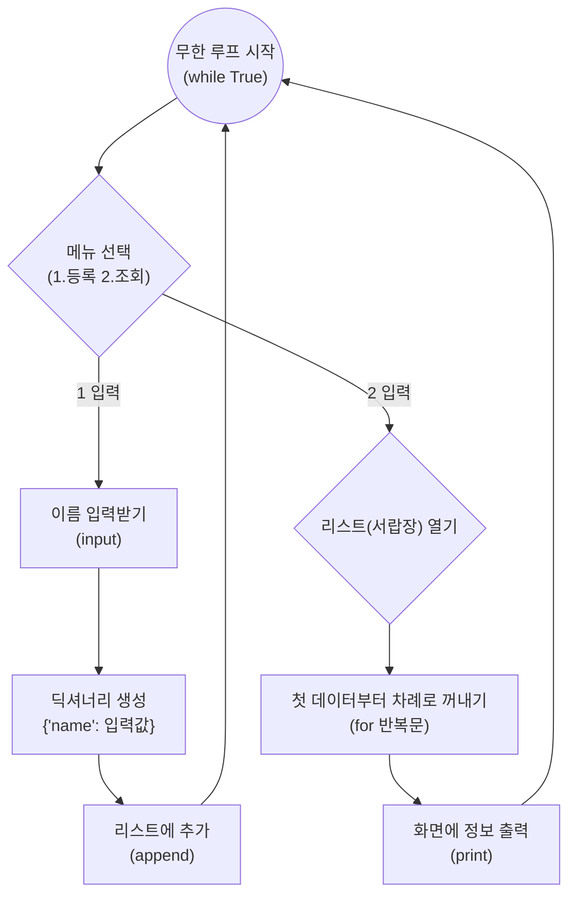

# 마이크로 세션: 070 — 절차적 Create, Read 기능 구현 및 테스트

> **세션 ID**: MS-PY101-070  
> **소요 시간**: 25분  
> **난이도**: medium  
> **청크 타입**: lab  
> **버전**: v2.1 (7섹션 구조)

---

## §1. 개요

> **Day 4 | AM | 세션 070/075**

### 🎯 학습 목표

이 세션이 끝나면, 수강생은 다음을 할 수 있습니다:

- AI가 생성한 절차적 코드 중 C(생성·등록)와 R(읽기·조회) 기능의 동작 원리를 이해할 수 있다.
- 무한 루프(`while True`)와 조건문(`if/elif`)을 결합한 절차적 프로그램의 기본 흐름을 설명할 수 있다.
- 직접 코드를 실행하고 본인 및 짝꿍의 데이터를 등록/조회하여 정상 작동을 검증할 수 있다.

### 선행 세션 환기

바로 직전 세션(세션-069)에서 우리는 파편화된 데이터를 묶어서 관리하는 구조, 즉 리스트 안에 딕셔너리를 담아 관리하는 방법을 배웠어요. 이름과 전화번호가 각각 따로 놀면 나중에 데이터가 뒤섞일 수 있기 때문에, 하나의 꾸러미(딕셔너리)로 묶어서 보관해야 한다고 했죠. 오늘은 그 튼튼한 서랍장을 활용해서, 실제로 사용자의 입력을 받아 데이터를 생성(Create)하고, 서랍장에 잘 들어갔는지 열어보는(Read) 기능을 직접 구현하고 테스트해 볼 차례입니다.

---

## §2. 핵심 개념 (+ 🗣️ 강사 대본 + Mermaid)

### 안내데스크 접수처와 투명 서랍장

우리가 오늘 구현할 C(Create)와 R(Read) 코드는 마치 아주 친절한 안내데스크와 같습니다. 여러분이 행사장에 도착하면 접수처 직원이 빈 노트를 펼치고 이름을 물어보죠. 여러분이 이름을 말하는 순간, 직원은 그 이름을 한 글자씩 정성스럽게 적어 넣습니다. 

프로그래밍에서는 직원이 이름을 물어보는 행위를 `input()` 함수로 표현하고, 노트에 적어 넣는 행위를 리스트의 끝에 데이터를 추가하는 `append()` 동작으로 구현합니다. 누군가의 정보를 받아 투명한 서랍장에 차곡차곡 쌓아두는 것, 이것이 바로 **생성(Create)** 기능의 핵심입니다.

직원이 지금까지 방문한 사람들의 명단을 확인하고 싶어졌다고 해볼까요? 투명 서랍장을 열고 첫 칸부터 마지막 칸까지 하나씩 살펴보며 적힌 이름을 읽습니다. 이것이 바로 리스트에 담긴 데이터를 `for` 반복문으로 처음부터 끝까지 꺼내어 화면에 출력하는 **조회(Read)** 기능입니다.

🗣️ **강사 대본 (Instructor Script)**:

> 여러분 안녕하세요. 지난 시간까지 우리는 데이터베이스나 거창한 저장소를 사용하기 전에, 리스트와 딕셔너리로 데이터를 깔끔하게 담는 법을 배웠습니다. 오늘부터는 그 골격 위에 본격적으로 살을 붙이는 작업을 시작할 겁니다. 
>
> 프로그램이 가장 기본적으로 갖춰야 할 능력이 뭘까요? 바로 새로운 정보를 기억하고, 그것을 다시 꺼내어 보여주는 겁니다. 여러분이 매일 사용하는 웹사이트 회원가입과 마이페이지 확인 기능도 결국 이 기본적인 등록과 조회의 확장판에 불과해요. 오늘은 AI가 작성해 준 절차적 형태의 코드를 여러분 손으로 직접 실행해 보면서, 코드가 살아 숨 쉬며 우리가 입력한 데이터를 기억하는 짜릿한 순간을 경험해 볼 겁니다.
>
> 방금 설명해 드린 안내데스크 비유를 꼭 기억해 주세요. 입력을 받아서 빈 노트의 맨 밑줄에 추가하는 것, 그리고 노트를 처음부터 끝까지 차례대로 읽어 내려가는 것. 이 두 가지가 오늘 배울 Create와 Read의 모든 것입니다.

### Mermaid 다이어그램



---

## §3. 상세 내용

### Why — 왜 C와 R부터 시작하는가?

"선생님, 수정이랑 삭제는 왜 한 번에 안 만드나요?"라고 생각하실 수 있어요. 좋은 질문입니다. CRUD(Create, Read, Update, Delete) 중에서 C와 R은 데이터 관리의 뼈대입니다. 데이터가 생성되어 존재하지 않으면 수정할 수도, 삭제할 수도 없기 때문이에요. 

이 기본적인 두 기능만 확실하게 만들어도, 프로그램은 단순히 계산만 하고 끝나는 1회용 계산기에서 벗어나 "상태를 기억하는" 진정한 애플리케이션으로 진화합니다.

### What — 절차적 구현의 특징

오늘 우리가 살펴볼 코드는 전형적인 **절차적 프로그래밍** 방식입니다. 우리 프로그램은 꺼지지 않고 계속해서 손님을 받아야 하므로, 끝나지 않는 무한 반복문(`while True`) 안에서 동작합니다. 사용자의 선택에 따라 `if`와 `elif`로 길을 나누고, 각각의 길 안에서 필요한 일들을 위에서 아래로 물 흐르듯 순서대로 처리합니다.

이 방식은 동작을 이해하기 쉽고 직관적이라서 초보자가 프로그램의 흐름을 파악하는 데는 큰 도움이 됩니다. 하지만 모든 기능이 하나의 커다란 루프 안에 욱여넣어지는 형태이기 때문에, 코드가 길어지면 금방 알아보기 힘들어지는 한계를 가지고 있어요. 우리는 일단 이 '작동하는(하지만 구조적으로는 아쉬운) 코드'를 직접 느끼고 경험해 볼 겁니다.

### How — 어떻게 코드로 구현되는가?

**Create (생성)**: 사용자가 1번 메뉴를 선택하면, 프로그램은 `input()`으로 이름을 묻습니다. 그리고 미리 준비해 둔 비어있는 리스트(`customers`)에 딕셔너리 형태로 데이터를 감싸서 `append()` 합니다. 딕셔너리를 쓰는 이유는 나중에 나이나 전화번호 같은 추가 정보를 담기 좋게 미리 공간의 모양을 예쁘게 잡아두기 위함입니다.

**Read (조회)**: 사용자가 2번 메뉴를 선택하면, 프로그램은 `for c in customers:` 와 같은 반복문을 사용해 리스트의 모든 항목을 순서대로 꺼냅니다. 그리고 딕셔너리의 키(`'name'`)를 이용해 값을 화면에 출력합니다.

> ✅ **체크포인트**: 여기까지 이해했는지 스스로 점검해 보세요.
> - 사용자로부터 입력받은 새로운 고객 정보를 리스트의 가장 마지막 칸에 밀어 넣기 위해 사용하는 파이썬의 리스트 전용 기능은 무엇일까요? ("append() 함수")
> - 데이터를 리스트에 넣을 때 단순한 문자열이 아니라 `{"name": "홍길동"}` 같은 딕셔너리 형태로 넣는 이유는 무엇일까요? ("향후 전화번호나 나이 등 연관된 속성을 쉽게 확장하기 위해")

---

## §4. 실습 가이드 (+ 🎙️ 실습 대본)

### 실습 목표

이 실습을 통해 수강생은 AI가 작성한 절차적 CRUD 코드를 IDE에서 실행하고, 1번(등록)과 2번(조회) 기능을 번갈아 수행하며 데이터가 메모리에 적재되고 출력되는 과정을 검증합니다.

🎙️ **실습 가이드 대본 (Lab Guide)**:

> 자, 이제 여러분의 통합 개발 환경(IDE)에서 직접 코드를 실행해 볼 시간입니다. 눈으로만 보는 것과 내 손으로 타이핑해서 내 이름이 화면에 나오는 걸 보는 건 완전히 다르거든요.
>
> 우선 AI 비서에게 절차적 구조의 등록/조회 코드를 만들어 달라고 부탁해 보겠습니다. 프롬프트를 복사해서 붙여넣고, 만들어진 코드를 실행해 보세요. 화면에 '1.등록 2.조회'라는 메뉴 텍스트가 깜빡거리면 성공입니다.
> 
> 먼저 숫자 1을 입력하고 엔터를 친 다음, 여러분의 이름을 입력해 보세요. 등록이 완료되었다는 메시지가 나오죠? 이번에는 여러분 옆에 앉은 짝꿍의 이름도 똑같은 방법으로 등록해 보세요. 자, 두 명의 정보가 보이지 않는 투명 서랍장에 안전하게 저장되었습니다. 이제 그 서랍장을 열어볼 차례입니다. 숫자 2를 입력하고 조회를 실행해 보세요. 방금 여러분이 등록했던 두 개의 이름이 예쁘게 출력되나요?

### 단계별 실습 지시사항

| 단계 | 소요 시간 | 액션 및 지시사항 | 예상 결과 및 검증 포인트 |
|------|----------|----------------|--------------------|
| 1 | 5분 | **AI에게 코드 생성 요청하기**: Agent Manager에 아래 프롬프트 예시를 입력하여 코드를 생성받고 `main.py`에 복사합니다. | 무한 루프와 `if/elif` 구조로 이루어진 파이썬 코드 생성 확인 |
| 2 | 3분 | **코드 실행 및 무한 루프 진입**: IDE에서 코드를 실행합니다. | 터미널에 `1.등록 2.조회:` 메뉴가 출력되며 사용자 입력을 대기함 |
| 3 | 5분 | **Create(등록) 검증**: '1'을 입력한 뒤 본인 이름 입력, 다시 '1'을 입력하고 짝꿍 이름 입력 | "등록 완료" 메시지 출력. `append()` 기능이 정상적으로 메모리에 데이터를 적재함 |
| 4 | 5분 | **Read(조회) 검증**: '2'를 입력하여 등록된 데이터 확인 | `for` 반복문이 리스트를 순회하며 본인과 짝꿍의 이름을 차례대로 출력함 |

**[단계 1] AI에게 코드 생성 요청 프롬프트**

```text
고객 정보를 관리하는 파이썬 프로그램을 작성해 줘.
다음 조건을 반드시 지켜줘:
1. 전역 리스트 하나를 만들어 데이터를 저장할 것
2. while True를 사용한 무한 루프 안에 메뉴를 만들 것
3. 메뉴는 "1.등록 2.조회" 두 가지만 있을 것
4. 등록 시 이름만 입력받고 딕셔너리 형태로 리스트에 추가할 것
5. 조회 시 리스트의 모든 고객 이름을 출력할 것
6. 함수를 사용하지 말고 절차적으로(if/elif) 작성할 것
```

**[단계 2~4] 직접 테스트하며 검증하기**

코드를 실행한 후, 터미널(콘솔) 창을 클릭하고 직접 숫자를 입력해야 합니다. 만약 코드를 실행했는데 에러가 나거나 바로 종료된다면, 무한 루프의 들여쓰기가 잘못되었을 확률이 매우 높습니다. 

### 트러블슈팅 FAQ

| Q | A |
|---|---|
| 등록을 하고 조회를 했는데 아무것도 안 나와요. | `append()`를 할 때 리스트 이름에 오타가 없는지 확인하세요. 등록 기능 쪽 코드와 조회 기능 쪽 코드가 같은 `customers` 리스트를 바라보고 있어야 합니다. |
| 조회를 하려니까 `KeyError: 'name'` 이라는 에러가 나요. | 등록할 때 딕셔너리의 키워드를 `"Name"` 대문자로 썼거나 오타를 냈는데, 조회할 때 소문자 `"name"`으로 찾으려고 해서 그렇습니다. 키워드의 대소문자를 맞춰주세요. |
| 코드가 멈추지 않고 계속 돌아가요. 끄고 싶어요! | 무한 루프 안에서 빠져나오는 기능을 아직 만들지 않았기 때문입니다. 터미널 창을 클릭하고 `Ctrl + C`를 누르면 강제로 프로그램을 멈출 수 있습니다. |

> ✅ **체크포인트**: 2번(조회) 메뉴를 선택했을 때 여러분이 입력한 두 사람의 이름이 모두 정상적으로 화면에 나타났나요? 성공하셨다면 손을 들어 주세요!

---


### 🎓 강사 노트 (Instructor Support)

- ⏱️ **타이밍**: 11:05 (25분, lab)
- 🎯 **핵심 활동**: C, R 기능 실행 & 테스트
- ⚠️ **강사 주의사항**: 등록 → 조회 순서 강조


### 📋 실습 설계 보강 (Lab Packet)

**세션 070 실습 설계 보강**

절차적 Create, Read 기능 구현 및 테스트
- **3-Stage Example Set**
  - 기본: AI 생성 코드에서 C/R 기능 실행 → 데이터 등록 → 등록 확인(전체 조회)
  - 변형: 등록 시 "정말 등록하시겠습니까?(y/n)" 확인 절차 추가
  - 실수 해결: "등록했는데 조회하면 안 나와요" → append() 호출 위치 또는 변수 스코프 확인
- **난이도 예측**: 코드 실행 흐름(메뉴 → 기능 → 결과)을 머릿속으로 따라가기 어려움
- **타이밍 가이드**: C기능 테스트 7분 | R기능 테스트 5분 | 정상/경계 테스트 8분 | 정리 5분
- **심리적 장벽**: "코드가 100줄이 넘어가니 어디가 뭔지 모르겠어요"
- **자가 점검**:
  - [ ] 고객을 2명 등록한 후 전체 조회 시 2명이 출력되는가?
  - [ ] 빈 상태에서 조회하면 "등록된 데이터가 없습니다" 메시지가 나오는가?
  - [ ] input()과 append()의 관계를 AI에게 설명 요청했는가?

## §5. 코드 및 명령어 모음

### 절차적 고객 관리 프로그램 (C, R 구현)

우리가 실습에서 검증한 핵심 코드의 형태는 다음과 같습니다. (함수 없이 커다란 하나의 흐름으로 작성된 전형적인 절차적 구조입니다.)

```python
# 절차적으로 구현한 고객 관리 프로그램의 기본 형태
customers = []

while True:
    menu = input("1.등록 2.조회: ")
    
    if menu == '1':
        name = input("이름: ")
        # 입력받은 이름을 딕셔너리 형태로 감싸서 리스트 끝에 추가합니다.
        customers.append({"name": name})
        print("등록 완료")
        
    elif menu == '2':
        # 리스트에 있는 모든 고객 정보를 처음부터 끝까지 반복하며 출력합니다.
        for c in customers:
            print(f"고객이름: {c['name']}")
```

### AI 프롬프트 예시 모음

- 🤖 **코드 기본 생성**: "절차적 방식으로 while 무한 루프 안에서 1.등록, 2.조회 메뉴를 가지는 고객 관리 코드를 짜줘."
- 🤖 **오류 발생 시**: "(에러 메시지 복사) 조회 메뉴를 눌렀더니 이런 에러가 나. 원인이 뭐야? 들여쓰기 문제야?"

---

## §6. 요약

### 핵심 학습 포인트

수고하셨습니다. 여러분은 방금 프로그램의 가장 핵심적인 두 가지 기능인 등록(Create)과 조회(Read)를 절차적인 코드로 완벽하게 구현하고 검증해 냈습니다. 
입력받은 데이터를 딕셔너리에 담아 리스트의 끝에 밀어 넣고(`append`), 나중에 필요할 때 반복문(`for`)으로 다시 꺼내어 확인하는 이 단순한 과정이 모든 소프트웨어의 근간이 됩니다. C와 R이 잘 작동하는 걸 보니 벌써 프로그램의 절반은 완성된 셈이에요. 

### 다음 세션 예고

오늘은 1번(등록)과 2번(조회)만 만들었습니다. 그런데 이름을 잘못 등록했다면 어떻게 해야 할까요? 이미 등록한 고객이 탈퇴를 원한다면요? 다음 세션에서는 이 거대한 무한 루프 안에 수정(Update)과 삭제(Delete) 기능을 마저 욱여넣어 볼 겁니다. 절차적 방식의 한계가 서서히 모습을 드러내기 시작할 테니 기대해 주세요.

### 브릿지 노트

> "모두 이름이 잘 출력되시나요? 축하합니다! 드디어 우리 프로그램이 일회용 기억상실증에서 벗어나 데이터를 기억하기 시작했어요. 자, 이제 C와 R을 정복했으니 남은 건 U와 D입니다. 이 큰 반복문 안에 코드를 계속 추가하다 보면 어떤 일이 벌어질까요? 다음 세션에서 그 짜릿하고도 고통스러운 팽창 과정을 함께 겪어보겠습니다."

---

## §7. 참고 자료

### 3-Source 출처

- **Source A (로컬 참고자료)**: 「8 코딩.pdf」 (§8.9 절차적 프로그래밍 패턴) — 절차적 방식의 기본 골격 및 리스트/딕셔너리 활용
- **Source B (NotebookLM)**: SRC-B03 — while 루프 안에서 if문을 통한 Create와 Read 절차적 구현 원리
- **Source C (Deep Research)**: SRC-C01 — 절차적 코드가 작동은 하지만 로직이 한 덩어리에 뭉쳐 있는 '작동하는 나쁜 코드'의 전형임을 설명 (§1.4)

### 강사 노트

> 💡 **강사 노트**: 실습 중에 학생들이 가장 많이 겪는 에러는 들여쓰기(IndentationError)와 딕셔너리 키 매칭 오류(KeyError)입니다. AI가 짠 코드를 복사해서 붙여넣을 때 들여쓰기가 틀어지는 경우가 잦으므로, 강사가 돌아다니며 탭(Tab) 키 사용법을 짚어주면 좋습니다. 절차적 코드의 한계를 직접 체감하게 하는 것이 이번 데이의 목표이므로, "코드가 깔끔하지 않다"는 점을 지속적으로 암시해 주세요.

---

## ✅ 세션 완료 체크리스트 (강사용)

- [ ] §1~§7 모든 섹션이 충실하게 작성되었는가?
- [ ] 안내데스크 접수처 비유가 명확하게 전달되었는가?
- [ ] §2에 Mermaid 다이어그램이 포함되었는가?
- [ ] C(등록)와 R(조회)의 테스트 방법이 구체적으로 제시되었는가?
- [ ] 체크포인트 질문이 §3, §4에 배치되었는가?
- [ ] 3-Source 팩트 패킷의 내용이 §7 출처에 반영되었는가?
- [ ] 다음 세션(071 수정/삭제 추가)을 위한 브릿지 노트가 포함되었는가?

---

**🔗 선행 세션**: [세션-069] 데이터 저장 구조(전역 리스트, 딕셔너리) 이해 (필수)  
**🔗 후행 세션**: [세션-071] 절차적 Update, Delete 기능 구현 및 통합 테스트

---

*작성 일시: 2026-02-25*  
*작성 에이전트: Sisyphus-Junior*  
*교안 구조: 7섹션 (A0 팀 공통 표준)*