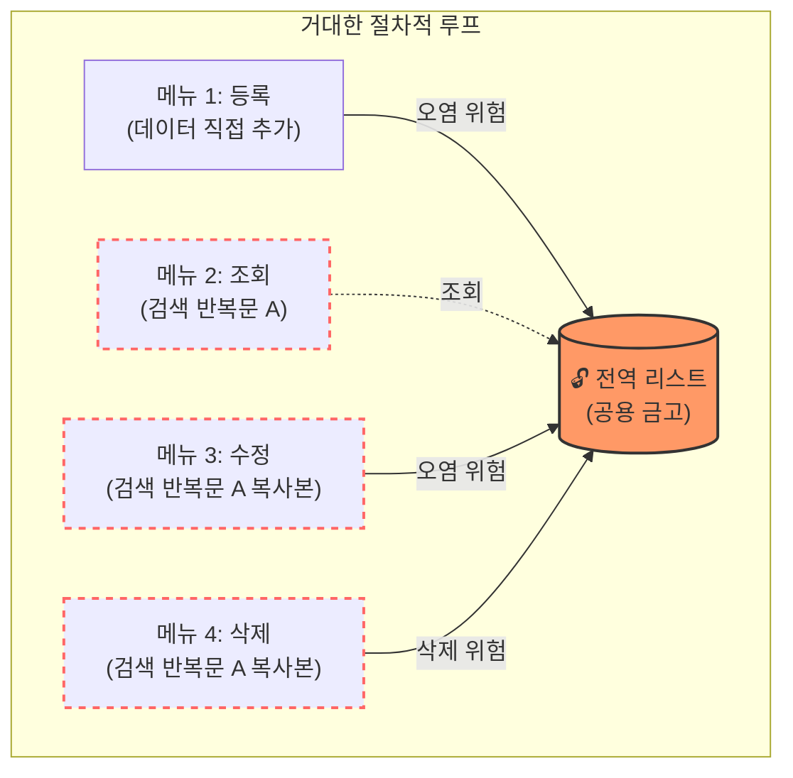

# 마이크로 세션: 072 — 코드 리뷰: 전역 변수와 코드 중복의 한계점 발견

> **세션 ID**: MS-PY101-072  
> **소요 시간**: 20분  
> **난이도**: medium  
> **청크 타입**: narrative  
> **버전**: v2.1 (7섹션 구조)

---

## §1. 개요

> **Day 4 | AM | 세션 072/075**

이 세션은 완성된 절차적 CRUD 코드를 비판적인 시각에서 리뷰해보는 시간이에요. 코드가 정상적으로 작동한다고 해서 무조건 좋은 코드인 것은 아닙니다. 전역 변수의 위험성과 코드 중복 문제(DRY 원칙 위배)를 직접 눈으로 확인하며, 절차적 프로그래밍에서 구조적 프로그래밍으로 나아가는 패러다임 전환의 필요성을 스스로 깨닫게 되는 아주 중요한 전환점입니다.

### 🎯 학습 목표

이 세션이 끝나면 수강생은 다음을 할 수 있어요:

- 절차적 코드의 3대 결함인 '전역 상태 오염', '코드 중복', '단위 테스트 불가'를 설명할 수 있습니다
- 프로그래밍의 핵심 철학인 DRY(Don't Repeat Yourself) 원칙의 의미를 이해하고, 내 코드에서 위반 사례를 찾아낼 수 있습니다
- 전역 변수 남용이 데이터 무결성에 미치는 위험을 '공용 금고' 비유를 통해 설명할 수 있습니다

### 선행 세션 환기

이전 세션(071)에서 우리는 100줄이 넘어가는 절차적 방식의 고객 관리 프로그램(CRUD)을 완성했습니다. 겉보기엔 완벽하게 동작하지만, 그 코드를 작성하면서 조회 로직을 복사해서 수정과 삭제에 똑같이 붙여넣기 했던 기억이 있을 거예요. 이제 그 방식이 왜 위험한지, 겉으로는 잘 달리는 자동차의 보닛을 열어 내부의 스파게티 코드를 직접 마주할 차례입니다.

---

## §2. 핵심 개념 (+ 🗣️ 강사 대본 + Mermaid)

### 공용 금고와 복붙 안내문 비유

우리가 작성한 코드의 문제점을 두 가지 비유로 설명합니다. 첫째, 전역 변수는 길거리에 덩그러니 놓인 '공용 금고'입니다. 언제 어디서든 누구나 열고 닫을 수 있어서 프로그램의 어느 곳에서든 데이터가 훼손될 수 있는 '전역 상태의 오염 위험'을 안고 있습니다. 

둘째, 무분별하게 복사해 붙여넣은 검색 반복문은 1층부터 10층까지 화장실 문 앞에 똑같이 붙어있는 '복붙 안내문'입니다. 비밀번호가 하나라도 바뀌면 모든 층을 돌아다니며 땀을 뻘뻘 흘리며 수정해야 하고, 한 층이라도 빼먹으면 큰 사고가 터집니다. 이것이 바로 '코드 중복'이며 프로그래머가 가장 피해야 할 상태입니다.

🗣️ **강사 대본 (Instructor Script)**:

> 여러분, 지난 시간까지 우리는 네 가지 핵심 기능이 모두 들어간 고객 관리 프로그램을 훌륭하게 완성했습니다. 입력하면 들어가고, 지우면 사라지는 완벽하게 작동하는 프로그램입니다. 그런데 여러분, 현업에서 활동하는 숙련된 개발자에게 이 코드를 보여준다면 아마 당장 뜯어고치자고 말할 겁니다. 도대체 무엇이 문제일까요?
>
> 겉으로는 아무런 문제 없이 잘 달리는 자동차처럼 보이지만, 사실 그 자동차의 보닛을 열어보면 엔진과 각종 부품들이 테이프로 얼기설기 붙어있는 것과 같은 상태입니다. 코드가 작동한다고 해서 그것이 곧 좋은 코드라는 의미는 아닙니다. 오늘은 우리가 직접 짠 코드를 스스로 비판적인 시각에서 뜯어보는 시간을 갖겠습니다.
>
> 우리 코드의 문제점을 쉽게 이해하기 위해 두 가지 상황을 상상해 볼까요? 첫 번째는 길거리에 덩그러니 놓인 공용 금고입니다. 우리 코드의 가장 꼭대기에 선언된 고객 리스트가 바로 이 금고와 같습니다. 비밀번호도 없고 뚜껑이 활짝 열려 있어서 누구나 지나가다가 데이터를 넣을 수도, 마음대로 빼갈 수도 있습니다. 만약 프로그램의 엉뚱한 곳에서 실수로 이 금고를 엎어버린다면 모든 데이터가 한순간에 날아갈 겁니다. 우리는 이를 '전역 변수의 오염'이라고 부릅니다.
>
> 두 번째 상황은 건물 1층부터 10층까지 화장실 문 앞에 똑같이 붙어있는 복붙 안내문입니다. 만약 화장실 비밀번호가 바뀌어서 안내문을 수정해야 한다면 어떻게 될까요? 경비원은 1층부터 10층까지 땀을 뻘뻘 흘리며 열 번이나 새로 고쳐 적어야 합니다. 단 한 군데라도 빼먹으면 사고가 나겠죠. 우리 코드에서 검색을 위해 반복적으로 작성했던 조건문 로직이 바로 이 복붙 안내문과 같습니다. 이름으로 찾던 걸 전화번호로 찾게 바꾸려면, 우리는 조회, 수정, 삭제 메뉴에서 모두 고쳐야만 합니다. 똑같은 코드가 여러 곳에 흩어져 있는 이 상황은 프로그래머들이 가장 경계하는 최악의 패턴입니다.

### Mermaid 다이어그램



이 다이어그램은 얽혀있는 절차적 코드의 불안한 구조를 보여줍니다. 검색 로직(반복문 A)이 여러 메뉴에 걸쳐 무분별하게 복제되어 있고, 모든 기능이 하나의 전역 리스트를 무방비로 조작하고 있어 작은 실수 하나가 전체 데이터를 훼손할 수 있는 위험한 상태입니다.

---

## §3. 상세 내용

### Why — 왜 작동하는 코드를 비판해야 하는가?

기능이 정상적으로 돌아가는 것에만 만족하면 프로그램이 조금만 복잡해져도 유지보수의 늪에 빠지게 됩니다. "출력 형식을 바꾼다면 코드를 몇 군데나 수정해야 하는가?"라는 단순한 질문 하나만으로도 절차적 코드의 한계가 명확히 드러납니다. 내가 짠 코드의 문제점을 발견하고 스스로 진단하는 눈을 가지는 것이야말로 진정한 시니어 개발자로 성장하는 가장 중요한 첫걸음입니다.

### What — 절차적 코드의 3대 문제점과 DRY 원칙

우리가 작성한 모놀리식(Monolithic) 절차적 코드는 크게 세 가지 치명적인 결함이 있습니다:

1. **전역 상태 오염 위험**: 모든 기능이 하나의 거대한 리스트를 공유하고 있습니다. 프로그램 덩치가 커지면 어디서 데이터가 꼬였는지 추적하는 것이 모래사장에서 바늘 찾기만큼 어려워집니다.
2. **코드 중복의 심각성**: 조회, 수정, 삭제 기능에 모두 고객의 이름을 검색하는 똑같은 `for`문이 흩어져 있습니다. 개발의 세계에는 "똑같은 것을 두 번 반복하지 말라"는 뜻의 **DRY (Don't Repeat Yourself)**라는 황금 원칙이 있는데, 우리의 코드는 이를 정면으로 위반하고 있어요.
3. **단위 테스트 불가**: 등록 기능 하나만 떼어내서 테스트하고 싶어도, 우리는 무조건 무한 루프를 띄우고 메뉴 1번을 선택하는 번거로운 과정을 거쳐야만 합니다. 각 부품이 엉켜있어 독립적인 점검이 불가능한 구조입니다.

### How — 문제 해결을 위한 진단

문제점들을 머리로만 이해할 것이 아니라, 코드를 보며 직접 그 심각성을 체감해야 합니다. 만약 "등록을 완료할 때 방금 등록한 사람의 이름도 같이 보여주세요"라는 간단한 요구사항이 추가된다면, 우리는 출력하는 코드를 또다시 복사해서 등록 기능 안에 붙여넣어야 합니다. 기능들이 꼬리를 물고 하나의 거대한 실타래처럼 엉켜 있어서, 한 곳을 잡아당기면 프로그램 전체가 흔들거리는 불안한 스파게티 코드가 된 것입니다. 이 진단이 내려졌다면, 처방은 명확합니다. 면발을 가위로 싹둑 잘라 용도별로 그릇에 나누어 담는 작업(구조적 리팩토링)이 절실하게 필요해집니다.

---

## §4. 실습 가이드 (+ 🎙️ 실습 대본)

### 실습 목표

코드 에디터에서 자신의 절차적 코드를 열고, DRY 원칙을 위반한 중복된 검색 로직(`for` 반복문)이 몇 군데에 있는지 직접 세어보는 시각적 확인 작업을 진행합니다. 또한 출력 양식을 아주 약간만 수정해 보며 스파게티 코드의 유지보수성 악몽을 짧게 체감하는 것이 목표입니다.

🎙️ **실습 가이드 대본 (Lab Guide)**:

> 이 문제점들을 코드로 직접 확인해 보겠습니다. 화면에 여러분이 작성한 파이썬 파일을 띄워주세요. 그리고 `for c in customers:` 라는 반복문이 시작되는 부분을 한 번 찾아보세요.
>
> 찾으셨나요? 자, 수정 기능을 담당하는 메뉴 3번 안에도 똑같은 `for`문이 길게 자리 잡고 있고, 바로 그 밑의 삭제 기능을 담당하는 메뉴 4번 안에도 글자 하나 다르지 않은 `for`문이 떡하니 버티고 있죠? 심지어 고객 정보를 화면에 보여주는 `print()` 함수조차 각 메뉴 안에 단단하게 갇혀있습니다.
>
> 우리 잠깐 고통을 체험해 볼까요? 지금은 출력 양식이 `이름: 홍길동`으로 되어 있는데, 이걸 `[고객명] 홍길동`으로 바꿔주세요. 어때요? 조회 메뉴에서도 고치고, 수정하고, 삭제할 때도 확인차 보여주느라 고치고... 세 군데나 수정해야 하죠. 만약 깜빡하고 한 곳을 빼먹은 채로 저장한다면 에러가 나거나 화면이 이상해질 겁니다. 이게 바로 유지보수의 늪입니다. 이 코드, 이대로 둬서는 절대 안 됩니다!

### 단계별 지시

| 단계 | 소요 시간 | 강사 지시사항 | 학습자 액션 | 예상 결과 |
|------|----------|--------------|------------|----------|
| 1 | 3분 | "코드에서 `for c in customers:` 반복문 개수를 세어보세요" | 에디터에서 코드 스크롤하며 확인 | 최소 3군데의 중복 코드 발견 |
| 2 | 5분 | "출력 양식을 `[고객명]` 형식으로 변경해보세요" | 모든 메뉴의 print 문을 찾아가며 텍스트 수정 | 수정의 번거로움과 실수 발생 가능성 체감 |
| 3 | 2분 | 변경 후 프로그램 실행하여 테스트 | 코드 실행 및 1~4번 메뉴 순회 확인 | 누락된 곳 발견 및 DRY 원칙 위배의 고통 체감 |

### 트러블슈팅 FAQ

| Q | A |
|---|---|
| 수강생이 중복 코드가 뭐가 나쁜지 공감하지 못해요 | "만약 코드가 100줄이 아니라 만 줄이고, 이 검색 로직이 50군데 복사되어 있다면 어떻게 될까요? 하루 종일 `Ctrl+F`만 누르다 퇴근하게 될 겁니다."라고 덧붙여 설명해주세요. |
| "함수로 묶으면 되지 않나요?" 라고 묻는 수강생이 있어요 | 아주 훌륭한 통찰입니다! "정확히 맞췄습니다. 그게 바로 우리가 다음 시간에 할 '구조적 프로그래밍'의 핵심입니다!"라고 칭찬하며 기대감을 높여주세요. |

> ✅ **체크포인트**: "개발의 세계에서 똑같은 코드를 두 번 이상 반복해서 작성하지 말라는 의미를 담고 있는 유명한 원칙의 영문 약자는 무엇일까요?" — 정답은 **DRY** 원칙입니다!

---


### 🎓 강사 노트 (Instructor Support)

- ⏱️ **타이밍**: 12:55 (20분, narrative)
- 🎯 **핵심 활동**: 전역 변수·중복 문제 체감
- ⚠️ **강사 주의사항**: "직접 느끼셨죠?" 공감 유도

## §5. 코드 및 명령어 모음

이 세션에서는 코드를 새로 작성하지 않고, 이전에 만든 절차적 코드의 결함을 리뷰하는 데 집중합니다. 수강생들이 주목해야 할 전형적인 안티 패턴(Anti-pattern)은 다음과 같습니다.

```python
# 절차적 코드의 전형적인 결함 패턴 (안티 패턴)
customers = [] # 🚨 결함 1: 공용 금고의 오염 위험 (전역 변수)

while True:
    menu = input("1.등록 2.조회 3.수정 4.삭제: ")
    
    if menu == '1':
        name = input("이름: ")
        customers.append({"name": name})
        print("등록 완료")
        
    elif menu == '2':
        # 🚨 결함 2: DRY 원칙 위반 (중복된 검색 로직 시작)
        for c in customers:
            print(f"고객이름: {c['name']}")
            
    elif menu == '3':
        target = input("수정할 이름: ")
        # 🚨 결함 2: 메뉴 2와 완전히 똑같은 검색 로직이 복사되어 있음
        for c in customers:
            if c['name'] == target:
                new_name = input("새 이름: ")
                c['name'] = new_name
                print("수정 완료")
                
    elif menu == '4':
        target = input("삭제할 이름: ")
        # 🚨 결함 2: 또다시 등장하는 똑같은 검색 로직
        for c in customers:
            if c['name'] == target:
                customers.remove(c)
                print("삭제 완료")
```

---

## §6. 요약

### 핵심 학습 포인트

이번 세션에서는 잘 작동하는 코드 뒤에 숨겨진 치명적인 결함을 직접 진단했습니다.
1. 전역 변수로 인한 데이터의 불안정성(공용 금고)
2. 똑같은 로직이 복사되어 늘어나는 코드 중복(DRY 원칙 위배)
3. 개별적인 테스트가 불가능한 단단한 결합

이 문제점들을 꼼꼼히 진단했으니, 이제 우리 손으로 직접 이 코드를 수술대에 올릴 차례입니다.

### 다음 세션 예고

다음 세션에서는 이 엉킨 코드들을 어떻게 우아하고 깔끔하게 풀어낼 수 있는지, AI의 힘을 빌려 구조를 개편하는 '구조적 리팩토링 프롬프트 작성'에 돌입하겠습니다.

### 브릿지 노트

> "문제점을 정확히 알았으니, 이제 병을 고칠 시간입니다. 다음 시간에는 AI에게 '기능별로 함수를 나눠서 구조적으로 바꿔줘!'라고 멋진 처방전을 써보겠습니다. 기대하셔도 좋습니다."

---

## §7. 참고 자료

### 3-Source 출처

- **Source A (로컬 참고자료)**: 8 코딩.pdf (§8.12 코드 리뷰) — 전역 변수의 위험성과 절차적 코드를 비판적으로 분석하는 리뷰 과정의 근거를 제공합니다.
- **Source B (NotebookLM)**: NotebookLM 분석 리포트 (§4) — 절차적 코드의 구조적 결함(코드 중복, 유지보수 어려움)과 DRY 원칙에 대한 핵심 논리를 참조했습니다.
- **Source C (Deep Research)**: Deep Research 보고서 (§1.2) — 절차적 프로그래밍의 3대 문제점(전역 상태 오염, 중복, 테스트 불가)과 스파게티 코드의 실체 확인 사례를 반영했습니다.

### 강사 노트

> 💡 **강사 노트**: 수강생들이 스스로 짠 코드를 비판하는 과정이기 때문에 자칫 "내가 잘못 짰구나"라며 의기소침해질 수 있습니다. "처음엔 누구나 이렇게 짭니다. 이 과정을 겪어야만 왜 함수가 필요한지 뼈저리게 느낄 수 있습니다"라고 반드시 격려해 주며 동기를 부여해 주세요.

---

## ✅ 세션 완료 체크리스트 (강사용)

- [x] §1~§7 모든 섹션이 충실하게 작성되었는가?
- [x] 절차적 코드의 3대 문제점이 명확하게 설명되었는가?
- [x] '공용 금고'와 '복붙 안내문' 비유가 대본에 포함되었는가?
- [x] DRY 원칙의 의미를 수강생이 이해했는가?
- [x] 시각적 점검(for문 개수 세기)을 통해 문제의 심각성을 체감시켰는가?
- [x] 3-Source 팩트 패킷의 근거가 모두 반영되었는가?

---

*작성 일시: 2026-02-25*  
*작성 에이전트: A4B_Session_Writer*  
*교안 구조: 7섹션 (A0 팀 공통 표준)*
