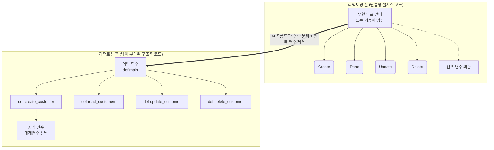

# 마이크로 세션: 073 — 절차적 코드의 구조적 리팩토링 프롬프트 작성

> **세션 ID**: MS-PY101-073  
> **소요 시간**: 20분  
> **난이도**: ★★☆  
> **청크 타입**: lab  
> **버전**: v2.1 (7섹션 구조)

---

## §1. 개요

> **Day 4 | AM | 세션 073/075**

### 🎯 학습 목표

이 세션이 끝나면, 수강생은 다음을 할 수 있습니다:

- 절차적 코드를 기능별 함수로 분리하는 구조적 리팩토링 프롬프트를 작성할 수 있다
- 전역 변수를 제거하고 메인 함수 내부로 이동시키는 지시를 내릴 수 있다
- 리팩토링 전후의 코드를 분리하여 저장하고, 겉보기 동작이 100% 동일하게 유지되는지 테스트할 수 있다

### 선행 세션 환기

바로 직전 세션(세션-072)에서 우리는 기능 추가에만 급급해 작성했던 절차적 코드가 얼마나 유지보수하기 어려운지 직접 눈으로 확인했습니다. 똑같은 검색 로직이 조회, 수정, 삭제 기능에 무려 세 번이나 복사되어 있었고, 출력 양식을 조금 바꾸려다가 실수로 다른 곳을 누락해 에러의 늪에 빠지기도 했죠. 또 전역 상태가 여기저기 흩어져 있어 단위 테스트조차 불가능했습니다. 이제 이 스파게티처럼 엉킨 코드를 아주 예쁘고 깔끔하게 다시 정리해 볼 시간입니다.

---

## §2. 핵심 개념 (+ 🗣️ 강사 대본 + Mermaid)

### 비유 — 원룸을 투룸으로 리모델링하기

리팩토링의 개념을 이해하기 위해 여러분이 처음 자취를 시작했던 집을 한 번 상상해 봅시다. 처음에는 아무런 칸막이가 없는 거대한 원룸에서 살기 시작했습니다. 침대 바로 옆에 가스레인지가 있고, 그 옆에 세탁기가 있고, 또 그 옆에 변기가 덩그러니 놓여 있습니다. 살 수는 있지만 요리할 때 이불에 냄새가 잔뜩 배고, 손님이라도 오면 아주 난감해지는 구조입니다. 우리가 앞서 작성한 무한 루프 방식의 코드가 바로 이 칸막이 없는 원룸과 완벽하게 똑같습니다. 

이제 우리는 이 원룸을 리모델링할 것입니다. 거실, 침실, 주방, 화장실에 각각 튼튼한 벽을 세우고 예쁜 문을 달아줍니다. 집의 바깥에서 보는 겉모습이나 주소는 전혀 변하지 않았지만, 집 안의 구조는 목적에 맞게 완벽하게 분리되었습니다. 요리를 할 때는 주방 문만 열면 되고, 잠을 잘 때는 침실 문만 닫으면 됩니다. 코드에서 이렇게 벽을 세우고 공간을 분리해 주는 역할이 바로 **함수(function)**입니다. 등록, 조회, 수정, 삭제라는 독립된 방을 만들어 주는 것이죠. 

🗣️ **강사 대본 (Instructor Script)**:

> 여러분, 지난 시간에 우리가 짠 코드가 작동은 하지만 구조적으로 얼마나 엉성한지 깊이 공감하셨을 겁니다. 프로그래밍 세계에서는 이렇게 프로그램의 겉모습이나 동작은 전혀 바꾸지 않은 채, 내부의 코드 구조만 더 좋게 개선하는 작업을 가리켜 '리팩토링(Refactoring)'이라고 부릅니다. 아주 매력적이고 멋진 단어죠? 예전에는 시니어 개발자들이 며칠 밤을 새워가며 엉킨 코드를 하나하나 손으로 풀어냈지만, 지금 우리는 AI라는 강력한 조수를 데리고 있습니다. 오늘은 AI에게 우리의 절차적 코드를 기능별로 깔끔하게 분리해 달라고 지시하는 구조적 리팩토링 프롬프트를 직접 작성해 보겠습니다. 겉은 그대로, 속은 새롭게 바꾸는 마법을 시작해 볼까요?

### Mermaid 다이어그램



---

## §3. 상세 내용

### Why — 리팩토링 프롬프트에 무엇을 담아야 하는가?

성공적인 리팩토링을 위해 AI에게 전달해야 할 핵심 지시사항은 크게 두 가지입니다. 

첫째, 각 메뉴의 기능을 독립된 함수로 분리해 달라고 명확히 요청해야 합니다. 무한 루프 안에 길게 엉켜있던 로직들을 밖으로 꺼내서 Create, Read, Update, Delete 각각을 전담하는 `def` 블록들로 만들어 달라고 하는 것이죠. 이렇게 하면 중복되던 검색 로직도 별도의 함수 하나로 예쁘게 빼내어 재사용할 수 있습니다. 

둘째, 코드 맨 위에 덩그러니 놓여있던 전역 변수 리스트를 제거해 달라고 요구해야 합니다. 공용 금고를 없애고 메인 함수라는 안전한 방 안에 숨겨진 개인 금고로 만들어 달라는 뜻입니다. 최근 딥 리서치 문헌에 따르면, 전역 상태를 지역 변수로 변경하고 함수 간 매개변수로 넘겨주는 것만으로도 코드의 안정성이 비약적으로 상승합니다.

### How — 단호하고 구체적인 지시

우리가 AI에게 입력할 프롬프트는 "이 코드를 리팩토링해줘"라는 단순한 문장이 되어서는 안 됩니다. "현재 전역 변수로 선언된 리스트를 메인 함수 내부의 지역 변수로 변경하고, CRUD 각각의 기능을 독립된 4개의 함수로 분리해 줘. 그리고 프로그램의 겉보기 동작은 기존과 100% 똑같이 유지해 줘"라고 아주 구체적이고 단호하게 지시해야 합니다. 이렇게 목적이 뚜렷한 프롬프트를 던질 때 AI는 여러분이 원하던 가장 완벽한 형태의 구조적 개선 코드를 선물합니다.

> ✅ **체크포인트**: 여기까지 이해하셨는지 점검해 보세요.
> - 프로그램의 외부 동작은 전혀 바꾸지 않은 채, 내부 구조만을 개선하는 작업을 무엇이라고 부르나요? ("리팩토링")
> - 우리가 AI에게 내릴 2가지 핵심 지시사항 키워드는 무엇인가요? ("함수 분리"와 "전역 변수 제거")

---

## §4. 실습 가이드 (+ 🎙️ 실습 대본)

### 실습 목표

이 실습을 통해 수강생은 구체적인 리팩토링 프롬프트를 작성하여 AI에게 전달하고, 응답받은 코드를 기존 코드와 구별하여 저장한 뒤 겉보기 동작이 100% 동일하게 유지되는지 직접 테스트합니다.

🎙️ **실습 가이드 대본 (Lab Guide)**:

> 자, 이제 여러분의 AI 챗봇 창을 열어주세요. 방금 전 세션에서 한숨을 쉬며 바라보았던 그 길고 엉켜있던 코드를 전체 복사해서 붙여넣습니다. 그리고 그 바로 밑에 여러분만의 리팩토링 프롬프트를 작성해 보세요. 방금 배운 대로 '함수 분리'와 '전역 변수 제거'라는 키워드가 반드시, 꼭 들어가야 합니다. 
>
> AI가 답변을 주면, 그 코드를 복사해서 파이썬 편집기에 `v2.py`라는 완전히 새로운 이름으로 저장합니다. 저장한 코드를 실행해 보세요. 신기하게도 화면에 나오는 1번 등록, 2번 조회 메뉴나 콘솔 창의 동작 방식은 이전과 완전히 똑같을 것입니다. 하지만 이제 코드를 위에서부터 천천히 스크롤 해보십시오. 이전에는 볼 수 없었던 `def`라는 단어들이 여러 개 보일 것입니다. 원룸이었던 코드에 멋진 방들이 여러 개 생겨난 것을 눈으로 직접 확인해 보세요!

### 단계별 지시사항

| 단계 | 소요 시간 | 강사 지시사항 | 학습자 액션 | 예상 결과 |
|---|---|---|---|---|
| 1 | 5분 | "기존 코드와 함께 리팩토링 프롬프트를 입력하세요" | 기존 코드 전체 복사 후, 함수 분리와 전역 변수 제거를 지시하는 프롬프트 작성 및 실행 | 의도가 정확히 반영된 함수 분리형 코드를 응답으로 받음 |
| 2 | 5분 | "응답받은 코드를 `v2.py`로 저장하세요" | 편집기에서 새 파이썬 파일 생성 및 응답받은 코드 붙여넣기 | 안전하게 이전 코드와 구별하여 파일 저장 완료 |
| 3 | 5분 | "코드를 실행하고 통합 테스트를 진행하세요" | 코드를 실행하고 1~4번 메뉴를 차례대로 누르며 데이터 입출력 테스트 | 겉보기 동작이 100% 동일하게 정상 작동함 |
| 4 | 5분 | "새로 작성된 코드에서 `def` 키워드의 개수를 세어보세요" | 코드를 위아래로 스크롤하며 함수가 몇 개로 쪼개졌는지 시각적으로 파악 | 독립된 로직들이 각각의 함수로 잘 나뉜 구조를 확인 |

### 트러블슈팅 FAQ

| Q | A |
|---|---|
| 코드를 실행했는데 전역 변수를 찾을 수 없다며 `NameError`가 나요. | AI가 전역 변수를 함수 내로 옮기면서, 다른 함수로 매개변수(`customers`)를 넘겨주는 것을 깜빡했을 수 있습니다. AI에게 에러 메시지를 주며 "데이터 리스트를 매개변수로 제대로 전달하도록 수정해줘"라고 단호하게 요청하세요. |
| AI가 메뉴 동작 방식(겉보기 동작)까지 자기 마음대로 세련되게 바꿨어요. | 리팩토링의 제1원칙을 AI가 어긴 겁니다. "기능이나 사용자 인터페이스는 절대 바꾸지 말고, 내부 구조만 함수로 분리해줘"라고 다시 한번 강조해서 프롬프트를 수정해 보세요. |
| 함수가 너무 잘게 쪼개져서 스크롤하기가 오히려 힘듭니다. | AI가 과도하게 친절했던 탓입니다. "CRUD의 4가지 핵심 기능 단위로만 큼직하게 함수를 분리해줘"라고 분리 기준을 명확히 다시 제시해 주면 훨씬 보기 좋은 구조로 다시 짜줍니다. |

---


### 🎓 강사 노트 (Instructor Support)

- ⏱️ **타이밍**: 13:15 (20분, lab)
- 🎯 **핵심 활동**: 함수 분리 요청 프롬프트
- ⚠️ **강사 주의사항**: v1→v2 변환의 핵심


### 📋 실습 설계 보강 (Lab Packet)

**세션 073 실습 설계 보강**

절차적 코드의 구조적 리팩토링 프롬프트 작성
- **3-Stage Example Set**
  - 기본: v1 코드를 AI에게 전달 → "기능별 함수 분리 + 전역변수 제거" 리팩토링 요청
  - 변형: "main() 함수를 만들어서 진입점을 하나로 통일해줘" 추가 조건
  - 실수 해결: "리팩토링 후 코드가 안 돌아요" → 함수 간 매개변수 전달 누락
- **난이도 예측**: "왜 잘 돌아가는 코드를 굳이 바꿔야 하지?"라는 의문
- **타이밍 가이드**: 리팩토링 프롬프트 작성 5분 | AI 코드 생성 5분 | 동작 확인 5분 | 비교 분석 5분
- **심리적 장벽**: "구조"라는 개념이 눈에 보이지 않아 추상적
- **자가 점검**:
  - [ ] 리팩토링 전 코드(v1)와 후 코드(v2)를 각각 별도 파일로 저장했는가?
  - [ ] v2에서 전역 변수가 제거되고 함수 매개변수로 대체되었는가?
  - [ ] v2가 v1과 동일하게 동작하는지 테스트했는가?

## §5. 코드 및 명령어 모음

### AI 프롬프트 예시: 구조적 리팩토링 지시

```text
아래 첨부된 절차적 파이썬 코드를 구조적 프로그래밍 패러다임에 맞게 리팩토링해줘.
반드시 다음 두 가지 조건을 지켜야 해:
1. 전역 변수로 선언된 고객 데이터 리스트를 제거하고, 메인 함수(main)의 지역 변수로 만든 뒤 매개변수로 전달할 것.
2. 기능별(등록, 조회, 수정, 삭제)로 독립된 함수(def)를 생성하여 쪼개어 분리할 것.
단, 프로그램의 겉보기 동작과 콘솔 출력 양식은 기존과 100% 똑같이 유지해야 해.
```

### 리팩토링 전후 구조 비교 (개념적)

```python
# [리팩토링 전] 엉켜있는 원룸 구조 (절차적)
customers = [] # 전역 변수로 방치됨

while True:
    menu = input("메뉴 선택: ")
    if menu == "1":
        # 수십 줄의 등록 로직이 루프 내부에 섞임
        pass
    elif menu == "2":
        # 수십 줄의 조회 로직이 루프 내부에 섞임
        pass

# ----------------------------------------

# [리팩토링 후] 방이 나뉜 깔끔한 구조 (구조적)
def create_customer(customers_list):
    # 등록만을 전담하는 독립된 함수 방
    pass
    
def read_customers(customers_list):
    # 조회만을 전담하는 독립된 함수 방
    pass

def main():
    customers = [] # 안전하게 지역 변수화
    while True:
        menu = input("메뉴 선택: ")
        if menu == "1":
            create_customer(customers)
        elif menu == "2":
            read_customers(customers)
            
if __name__ == "__main__":
    main()
```

---

## §6. 요약

### 핵심 학습 포인트

이번 세션에서 여러분은 오늘 겉보기엔 똑같이 작동하는 프로그램이지만, 내부 코드는 완전히 다르게 진화한 구조를 눈으로 직접 확인하셨습니다. 프롬프트를 작성할 때 "함수 분리"와 "전역 변수 제거"를 명확히 지시하고, "겉보기 동작은 변경하지 말라"고 단호하게 요구하는 것이 핵심이었습니다. 기능을 추가하는 데 급급했던 초보자의 시야에서 벗어나, 코드의 유지보수성과 아름다움을 고민하는 진정한 개발자의 시야를 갖게 되신 것을 축하드립니다.

### 다음 세션 예고

이렇게 방이 멋지게 나뉜 구조가 있어야만 우리는 다음 단계인 파일 저장이나 데이터베이스 연동으로 넘어갈 수 있습니다. 다음 세션에서는 이 함수라는 방들 사이에서 데이터가 어떻게 문을 통과해 들어오고(매개변수) 안전하게 나가는지(리턴), 그 구조적 데이터 흐름을 자세히 파헤쳐 보겠습니다.

### 브릿지 노트

> "모두 `v2.py` 파일 안에 `def`로 예쁘게 분리된 방들을 확인하셨나요? 겉모습은 100% 똑같지만, 이제 우리는 언제든지 특정 기능만 똑 떼어내서 편안하게 고칠 수 있는 강력한 구조를 얻었습니다. 그런데 벽을 세우고 방을 나눴으니, 이제 방과 방 사이를 오가는 데이터들에 대한 명확한 규칙이 필요해집니다. 다음 세션에서는 함수 사이의 출입문 역할을 하는 '매개변수(Parameter)'와 '리턴(Return)'에 대해 알아보겠습니다."

---

## §7. 참고 자료

### 3-Source 출처

- **Source A (로컬 참고자료)**: [A] 8 코딩.pdf §8.10 리팩토링 — 함수 분리와 구조 개편의 기본 개념 이해
- **Source B (NotebookLM)**: SRC-B05 — AI 시대의 서사; 절차적 코드에서 구조적 코드로의 전환과 리팩토링 패러다임
- **Source C (Deep Research)**: SRC-C02 — 리팩토링을 위한 프롬프트 엔지니어링 전략 및 전역 변수 제거 효과 (§2.2, 5.1)

### 강사 노트

> 💡 **강사 노트**: 실습 과정에서 수강생들이 리팩토링의 목적을 "새로운 기능 추가"로 오해하지 않도록 주의시켜 주세요. "겉보기 동작은 절대 변하면 안 된다"는 점이 리팩토링의 가장 중요한 본질입니다. 또한, AI가 너무 잘게 쪼개진 수십 개의 함수를 생성해 버리면 초보자가 흐름을 읽기 오히려 힘들어질 수 있으니, "CRUD 단위로 분리하라"는 프롬프트의 가이드라인을 강조해 주시면 좋습니다.

---

## ✅ 세션 완료 체크리스트 (강사용)

- [x] §1~§7 모든 섹션이 충실하게 작성되었는가?
- [x] 원룸/투룸 리모델링 비유가 §2에서 충분히 확장되었는가?
- [x] 리팩토링 프롬프트 작성의 두 가지 핵심 지시사항이 §3에 명시되었는가?
- [x] 단계별 실습 지시표에 소요 시간과 목표가 명시되었는가?
- [x] 트러블슈팅 FAQ가 최소 3개 이상 포함되었는가?
- [x] 3-Source 팩트 패킷의 내용이 §7에 반영되었는가?
- [x] 다음 세션(074)을 예고하는 브릿지 노트가 포함되었는가?

---

**🔗 선행 세션**: [세션-072] 코드 리뷰: 전역 변수와 코드 중복의 한계점 발견 (필수)  
**🔗 후행 세션**: [세션-074] 구조적 데이터 흐름(매개변수와 리턴)의 이해

---

*작성 일시: 2026-02-25*  
*작성 에이전트: A4B_Session_Writer*  
*교안 구조: 7섹션 (A0 팀 공통 표준)*