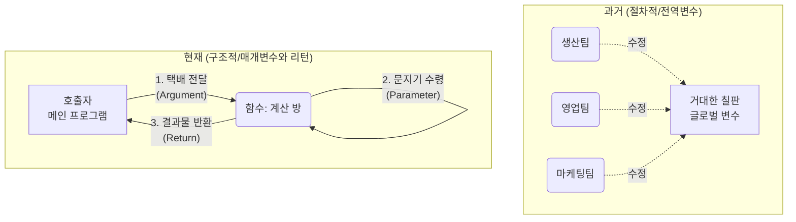
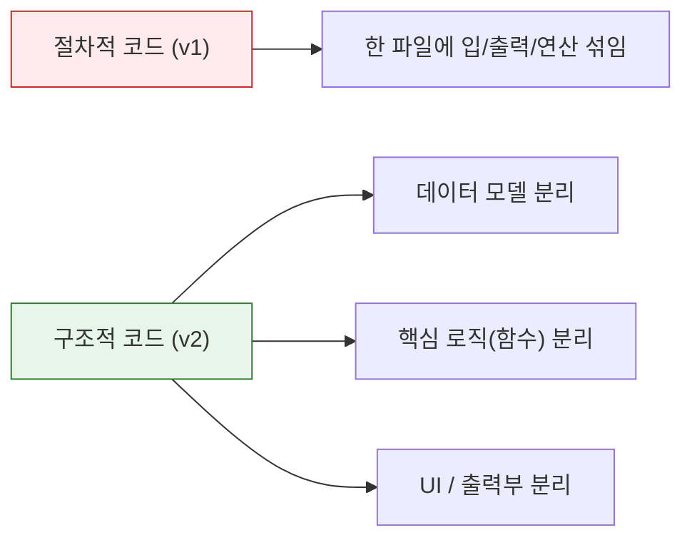

# 마이크로 세션: 074 — 구조적 데이터 흐름(매개변수와 리턴)의 이해

> **세션 ID**: MS-PY101-074
> **소요 시간**: 20분
> **난이도**: ★★★
> **청크 타입**: narrative
> **버전**: v2.1 (7섹션 구조)
> **Day**: Day 4 AM

---

## §1. 개요

> **Day 4 | AM | 세션 074/085**

이 세션은 어지럽게 뒤엉켜 있던 절차적 스파게티 코드에서 벗어나, 기능별로 잘 정리된 '구조적 프로그래밍'의 원리를 깨닫는 중요한 전환점이에요. 거대한 하나의 루프로 묶여 있던 코드를 잘게 쪼개어 함수라는 방을 만들었다면, 이제는 그 방들이 서로 어떻게 대화하고 데이터를 주고받는지(매개변수와 리턴)를 배울 차례입니다. 코드를 기능별로 분리하는 것만큼이나, 데이터의 입출구와 흐름을 통제하는 것이 AI-native 시대의 견고한 프로그램을 만드는 핵심이에요.

### 🎯 학습 목표

이 세션이 끝나면 수강생은 다음을 할 수 있어요:

- 전역 변수 공유 방식이 지닌 치명적인 문제점(사이드 이펙트)을 설명할 수 있습니다
- 매개변수와 리턴을 활용해 함수 간 데이터를 안전하게 주고받는 원리를 이해합니다
- AI가 생성한 함수 코드에서 입력(Parameter)과 출력(Return)의 흐름을 정확히 읽어낼 수 있습니다

### 선행 세션 환기

바로 앞 세션(073)에서 우리는 AI에게 기존 절차적 CRUD 코드를 구조적으로 쪼개달라고 지시하는 리팩토링 프롬프트를 작성했습니다. 그런데 쪼개진 코드들을 가만히 들여다보니 이상한 점이 하나 있었죠? 예전에는 없었던 괄호 안의 변수들과 `return`이라는 낯선 단어들이 등장했습니다. 왜 AI는 굳이 이런 복잡해 보이는 방식을 택했을까요? 지금부터 그 비밀을 하나씩 풀어봅니다.

---

## §2. 핵심 개념 (+ 🗣️ 강사 대본 + Mermaid)

### 비유: 거대한 칠판과 철통 보안의 방

구조적 데이터 흐름을 가장 쉽게 이해하는 방법은 "거대한 공장과 그 안의 작업실들"을 상상해 보는 거예요. 옛날 방식(절차적 프로그래밍)은 공장 한가운데에 누구나 낙서할 수 있는 거대한 칠판을 둔 것과 같아요. 반면 구조적 방식은 각 부서가 벽으로 단단히 분리된 방을 가지고, 입구의 문지기를 통해서만 택배 상자를 주고받는 방식입니다. 

🗣️ **강사 대본 (Instructor Script)**:

> 여러분, 지난 세션에서 우리는 끝없이 이어지던 길고 긴 코드를 여러 개의 작은 조각으로 나누어 '함수'라는 이름표를 붙이는 작업을 함께 해보았습니다. 방대한 코드를 기능별로 쪼개어 정리하니 겉보기에는 무척 깔끔해졌죠? 
>
> 하지만 코드를 나누기만 한다고 해서 모든 문제가 해결되는 것은 결코 아니에요. 오히려 코드를 방으로 쪼개어 놓았기 때문에, 각 방에 있는 코드들이 서로 대화하는 방법, 즉 데이터를 주고받는 방식이라는 새로운 고민거리가 생겨나게 됩니다.
>
> 옛날 방식, 우리가 이전에 작성했던 전역 변수에 의존하는 코드는 마치 거대한 공장 한가운데에 누구나 접근할 수 있는 거대한 칠판 하나를 덜렁 놓아둔 것과 같습니다. 생산팀이 칠판에 숫자를 적어놓고 가면, 영업팀이 와서 그 숫자를 쓱 지우고 새로운 숫자를 적기도 하죠. 처음에는 이 방식이 빠르고 편해 보일 수 있습니다. 하지만 직원이 수백 명으로 늘어나면 어떻게 될까요? 누군가 칠판의 숫자를 잘못 건드리는 순간 모든 부서의 업무가 마비되고, 대체 누가 언제 숫자를 바꾸었는지 도무지 찾아낼 길이 없어집니다. 프로그래밍의 세계에서는 이것을 예기치 않은 부작용, 즉 '사이드 이펙트(Side Effect)'라고 부릅니다.
>
> 이런 끔찍한 대참사를 막기 위해 우리는 새로운 규칙을 도입하게 됩니다. 이제 각 부서는 벽으로 단단히 둘러싸인 완벽하게 독립된 방을 가집니다. 그리고 각 방의 입구에는 아주 깐깐한 문지기가 서 있어요. 다른 방에 있는 누군가에게 작업을 부탁하고 싶다면, 예전처럼 거실의 칠판에 낙서를 하는 것이 아니라, 정확하게 포장된 '택배 박스'에 데이터를 담아서 그 방의 문지기에게 직접 건네주어야만 합니다. 
> 
> 이때 우리가 문지기에게 건네는 택배 박스가 바로 오늘 우리가 배울 **매개변수(Parameter)**입니다. 문지기는 박스를 받아 방 안으로 전달하고, 방 안의 작업자는 전달받은 재료만으로 열심히 작업을 수행해요. 작업이 끝나고 완성품이 만들어지면, 작업자는 그 결과물을 다시 작은 상자에 담아 방 밖으로 휙 던져주게 됩니다. 이렇게 방 안에서 밖으로 결과물을 내보내는 행위, 그것이 바로 **리턴(Return)**입니다. 

### Mermaid 다이어그램



이 다이어그램은 데이터가 마구잡이로 공유되던 과거의 방식에서, 오직 정해진 통로(매개변수와 리턴)를 통해서만 데이터가 이동하는 현대적 방식으로의 진화를 보여줍니다. 

---


### 🎨 추가 시각화 (Visualization Packet)

**절차적 vs 구조적 프로그래밍 비교**

한 파일에 모든 로직이 뭉쳐진 절차적 형태에서, 역할별로 분리된 구조적 형태로 진화한 모습을 대비합니다.



## §3. 상세 내용

### Why — 왜 이 세션이 필요한가?

AI가 작성하는 최신 코드들은 예외 없이 명시적인 매개변수와 리턴을 적극적으로 사용하고 있습니다. 과거처럼 전역 변수를 선언하고 여러 함수가 그 변수를 공유해서 마구잡이로 수정하게 내버려두면, 프로그램이 조금만 복잡해져도 걷잡을 수 없는 버그의 늪에 빠지기 때문입니다. 데이터가 어디서 들어와서 어디로 나가는지 투명하게 추적할 수 있어야만, 오류가 발생했을 때 즉각적으로 대처할 수 있어요.

### What — 파라미터와 아규먼트의 차이

문지기와 택배 상자의 비유를 실제 파이썬 코드로 연결해 보겠습니다. 
- **파라미터(매개변수)**: 파이썬에서 함수를 정의할 때 괄호 안에 적어주는 변수의 이름입니다. 방 안에서 대기하고 있는 문지기가 "저는 이런 종류의 데이터를 받을 준비가 되어 있습니다"라고 선언하는 것과 같아요.
- **아규먼트(인자)**: 실제로 그 함수를 호출하면서 괄호 안에 구체적인 값을 넣어주는 것을 말합니다. 즉, 문지기에게 건네는 택배 박스의 내용물입니다.
- **리턴(Return)**: 함수 작업이 끝난 후 데이터를 밖으로 내보내는 행위입니다. 함수는 `return`을 만나는 순간, 뒤에 적힌 값을 함수를 호출했던 원래의 장소로 툭 던져주고 그 즉시 종료됩니다.

### How — 어떻게 적용되는가?

데이터가 함수라는 방으로 들어갈 때는 반드시 파라미터를 통과하게 만들고, 함수 밖으로 나올 때는 반드시 리턴을 통해 나오도록 강제합니다. 만약 `return`을 명시하지 않으면 파이썬은 조용히 아무것도 없다는 뜻의 `None`을 반환하고 끝을 맺습니다. 이 원칙만 지키면 어떤 환경에 가져다 놓아도 독립적으로 완벽하게 작동하는, 훌륭하게 모듈화된 부품(함수)을 만들 수 있어요.

---

## §4. 실습 가이드 (+ 🎙️ 실습 대본)

### 실습 목표

이 세션의 실습은 타이핑이 아니라 두 가지 방식의 코드를 눈으로 비교하고 분석하는 "틀린 그림 찾기" 활동이에요. 수강생들이 전역 변수 의존형 함수가 왜 나쁜지, 매개변수와 리턴을 사용하는 것이 왜 독립적이고 안전한지 코드를 통해 직관적으로 체감하는 것이 목표입니다.

🎙️ **실습 가이드 대본 (Lab Guide)**:

> 자, 제 화면을 잘 살펴봐 주시기 바랍니다. 방금 우리가 이야기했던 비유가 실제 코드에서는 어떻게 다르게 나타나는지 두 개의 예시를 띄웠습니다. 위에 있는 코드는 '전역 변수'에 의존하는 나쁜 방식이고, 아래에 있는 코드는 '명시적 데이터 흐름'을 지키는 좋은 방식이에요.
> 
> 먼저 위의 코드를 보세요. 함수 이름 옆 괄호 안이 텅 비어 있습니다. 문지기가 택배를 받을 준비를 전혀 하지 않고 있다는 뜻이죠. 대신 함수 내부에서 `global`이라는 위험천만한 키워드를 사용해서 바깥세상의 칠판에 적힌 `price`와 `rate`를 마음대로 끌어다 씁니다. 심지어 계산이 끝난 후에는 결과물을 돌려주지(`return`) 않고, 그 자리에서 바로 모니터에 출력(`print`)해버리네요. 
> 
> 반면 아래의 명시적 데이터 흐름 코드를 봐주세요. 괄호 안에 `price`와 `rate`라는 파라미터가 명확하게 자리 잡고 있습니다. 문지기가 "가격과 할인율을 보내주시면 처리해 드립니다"라고 당당하게 외치고 있죠. 오로지 전달받은 값만 가지고 곱셈을 수행한 뒤, 그 결과물을 `return`으로 밖에 던져줍니다. 여러분, 이 두 번째 함수는 바깥세상이 어떻게 변하든 전혀 영향을 받지 않습니다. 언제 어디서나 재사용 가능한 완벽한 부품이 된 거예요!

### 단계별 지시

| 단계 | 소요 시간 | 강사 지시사항 | 학습자 액션 | 예상 결과 |
|------|----------|--------------|------------|----------|
| 1 | 2분 | 두 가지 코드 예제 화면에 띄우기 | 화면 주시, 코드 형태 비교 | `global`과 `return`의 차이 인식 |
| 2 | 3분 | 전역 변수 코드의 종속성 문제 설명 | 강사 설명 경청 | 사이드 이펙트의 위험성 공감 |
| 3 | 5분 | 매개변수와 리턴 코드의 독립성 강조 | "왜 이 방식이 안전한지" 고개 끄덕임 | 모듈화된 부품의 가치 이해 |
| 4 | 5분 | `print`와 `return`의 치명적 차이점 토론 | 짝과 1분 토의 및 발표 | 화면 출력 vs 값 전달의 차이 완벽 이해 |

### 트러블슈팅 FAQ

| Q | A |
|---|---|
| 파라미터와 아규먼트 용어가 너무 헷갈려요. | "파라미터는 빈 박스(이름표)이고, 아규먼트는 그 안에 담기는 실제 물건(값)입니다"라고 직관적으로 다시 짚어주세요. |
| `return`을 안 쓰고 그냥 함수 안에서 `print`하면 안 되나요? 화면에는 잘 나오던데요. | 수강생들이 가장 많이 헷갈려 하는 부분입니다. "`print`는 모니터에 잠시 그림자를 비춰주는 것에 불과하고, `return`은 실제 물건을 호출자 손에 쥐어주는 것입니다. 손에 물건을 쥐어야 다음 계산에 써먹을 수 있겠죠?"라고 강조하세요. |

---


### 🎓 강사 노트 (Instructor Support)

- ⏱️ **타이밍**: 13:35 (20분, code)
- 🎯 **핵심 활동**: 매개변수와 리턴 분석
- ⚠️ **강사 주의사항**: 데이터 흐름 화살표 그려주기

## §5. 코드 및 명령어 모음

강의 화면에 나란히 띄워 비교할 핵심 예제 코드입니다.

```python
# ❌ 전역 변수 의존 (Bad) - 칠판에 낙서하기
price = 10000
rate = 0.2

def calculate_discount_bad():
    global price, rate  # 바깥세상의 변수에 몰래 접근
    result = price * rate
    print(f"할인액은 {result}원입니다.")  # 돌려주지 않고 화면에만 찍고 끝남

# ⭕ 명시적 데이터 흐름 (Good) - 문지기와 택배 상자
def calculate_discount_good(price, rate): # 문지기가 택배 받을 준비 완료
    result = price * rate
    return result  # 계산된 결과값을 호출한 곳으로 정확히 배달!

# 좋은 함수의 사용 예시
my_discount = calculate_discount_good(10000, 0.2)
print(f"제가 받은 할인액은 {my_discount}원입니다.")
```

> 🤖 **AI 프롬프트 예시**: (이 세션은 개념의 이해에 집중하므로 별도의 프롬프트 실행은 생략합니다. 이전 세션에서 생성된 리팩토링 코드를 분석하는 데 집중하세요.)

---

## §6. 요약

### 핵심 학습 포인트

이번 세션의 핵심은 '데이터의 안전한 고속도로 설계하기'입니다.
첫째, 칠판에 마구잡이로 낙서하던 전역 변수 방식(사이드 이펙트)의 위험성을 깨달았습니다. 둘째, 함수라는 독립된 방에 데이터를 넣을 때는 반드시 '매개변수'라는 문지기를 통과해야 함을 알게 되었습니다. 셋째, 함수 안에서 처리된 결과는 모니터에 뿌리고 끝나는(`print`) 것이 아니라, 반드시 호출자에게 돌려주어야(`return`) 한다는 사실을 배웠어요.

### 다음 세션 예고

> "매개변수와 리턴의 위대한 마법을 이해하셨나요? 이것은 단순히 코드를 예쁘게 꾸미는 일이 아니라, 프로그램 전체의 혈관을 튼튼하게 다시 연결하는 중대한 작업입니다. 택배 주고받는 법을 제대로 배웠으니, 이제 다음 세션에서는 어제 우리가 짰던 '전역변수로 가득 찬 작동하는 나쁜 코드(v1)'와 방금 AI가 쪼개준 '구조적 코드(v2)'를 나란히 띄워놓고 본격적인 '틀린 그림 찾기'를 해봅시다. 과연 무엇이 어떻게 달라졌을까요?"

---

## §7. 참고 자료

### 3-Source 출처

- **Source A (로컬 참고자료)**: 「8 코딩.pdf」 §8.10 리팩토링 및 데이터 흐름 — 매개변수와 리턴을 통한 독립적 함수 구성 원리를 설명합니다.
- **Source B (NotebookLM)**: NotebookLM 분석 리포트 §5 — 전역 변수의 암묵적 변경(Side-effect) 방지와 명시적 데이터 흐름의 장점을 분석합니다.
- **Source C (Deep Research)**: Deep Research 보고서 §1.1, 1.3 — 절차적 프로그래밍의 한계와 구조적 프로그래밍 패러다임으로의 진화, 단순 `print()`와 `return`의 결정적 차이를 강조합니다.

### 강사 노트

> 💡 **강사 노트**: 본 세션은 Day 4 팩트 패킷의 내용을 충실히 반영하여 기획되었습니다. 수강생들이 `global` 키워드를 왜 쓰면 안 되는지 이론적으로만 아는 것을 넘어, 공장의 칠판 비유를 통해 "누가 언제 건드렸는지 모르는 공포"로 다가가도록 생생하게 전달하는 것이 핵심입니다. 코딩 문법보다 '설계의 이유'에 집중해주세요.

---

## ✅ 세션 완료 체크리스트 (강사용)

- [x] §1~§7 모든 섹션이 충실하게 작성되었는가?
- [x] 문지기와 택배 상자 등 직관적인 비유가 포함되었는가?
- [x] 매개변수와 리턴, `print`와 `return`의 차이가 명확히 설명되었는가?
- [x] 전역 변수의 위험성(사이드 이펙트)이 강조되었는가?
- [x] 3-Source 팩트 패킷이 반영되었는가?

---

*작성 일시: 2026-02-25*  
*작성 에이전트: A4B_Session_Writer*  
*교안 구조: 7섹션 (A0 팀 공통 표준)*