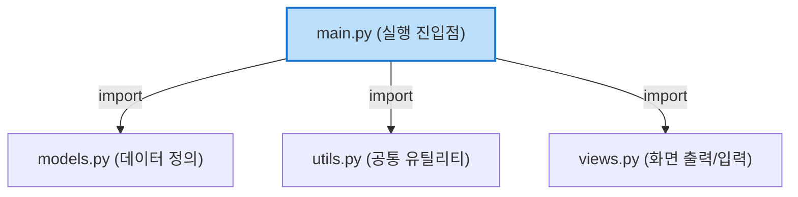

# 마이크로 세션: 075 — 절차적 vs 구조적 코드 나란히 비교 분석

> **세션 ID**: MS-PY101-075
> **소요 시간**: 20분
> **난이도**: ★★☆
> **청크 타입**: narrative
> **Day/시간대**: Day 4 AM (075/075)
> **버전**: v2.1 (7섹션 구조)

---

## §1. 개요

이 세션은 Day 4 오전 과정의 대미를 장식하는 마지막 시간입니다. 지금까지 우리는 거대한 메인 루프에 모든 코드를 때려 넣었던 절차적 방식(v1)에서 벗어나, 기능별로 코드를 잘라내어 함수로 분리하고 매개변수와 리턴으로 데이터를 주고받는 구조적 방식(v2)으로 힘겹게 넘어왔습니다.

이제는 우리가 만든 결과물을 감상할 시간입니다. 마치 성형 수술의 비포 앤 애프터(Before & After) 사진을 나란히 놓고 분석하는 것처럼, 두 가지 방식의 코드를 화면에 동시에 띄워놓고 어떻게 달라졌는지 눈으로 직접 확인할 것입니다. 이 세션을 거치면 수강생들은 "아, 이래서 그 고생을 하면서 코드를 함수로 쪼갰구나!"라는 깨달음을 얻게 되며, 오후에 이어질 테스트와 코드 리뷰, 그리고 미니 프로젝트를 향한 강력한 동기를 부여받습니다.

### 🎯 학습 목표

이 세션이 끝나면 수강생은 다음을 할 수 있어요:
- 절차적 코드(v1)와 구조적 코드(v2)의 구조적 차이를 2가지 이상 시각적으로 설명할 수 있습니다.
- 복잡한 로직을 함수로 분리하여 메인 루프를 간결하게 만드는 '추상화'의 이점을 이해합니다.
- 코드를 구조화했을 때 얻을 수 있는 재사용성과 유지보수성의 장점을 실제 사례를 통해 설명할 수 있습니다.

### 선행 세션 환기

방금 전 세션(074)에서 우리는 데이터가 마치 택배 상자처럼 함수의 문지기를 통해 들어가고(매개변수) 나오는(리턴) 원리를 완벽하게 숙지했습니다. 이제 그 강력한 무기를 장착한 상태로, 전체 숲을 조망해 볼 것입니다.

---

## §2. 핵심 개념 (+ 🗣️ 강사 대본 + Mermaid)

### 사장님과 팀장님의 일하는 방식

프로그래밍 패러다임의 차이를 이해하는 가장 직관적인 비유는 바로 '일하는 방식'입니다. 절차적 코드는 모든 일을 혼자 다 하는 워커홀릭 사장님에, 구조적 코드는 전문가에게 업무를 위임하는 유능한 팀장님에 비유할 수 있습니다. 

🗣️ **강사 대본 (Instructor Script)**:

> 여러분, 방금 전까지 우리는 매개변수와 리턴이라는 아주 중요한 개념을 배웠습니다. 함수라는 상자에 데이터를 안전하게 넣고 빼는 방법을 알게 된 거죠. 이제 그 지식을 가지고, 우리가 처음 만들었던 길고 복잡한 버전 1(v1) 코드와 새롭게 다듬어낸 구조적인 버전 2(v2) 코드를 나란히 펼쳐놓고 비교해 볼 시간입니다.
> 
> 왼쪽에 있는 v1 코드를 볼까요? 이 코드는 현실 세계로 치면 마치 회사의 모든 일을 혼자서 다 처리하려고 드는 워커홀릭 사장님과 같습니다. 이 사장님은 출근하자마자 직접 바닥 청소를 하고, 전화를 직접 당겨 받고, 고객에게 보낼 견적서를 혼자 엑셀로 타이핑하고, 심지어 택배 상자까지 직접 포장합니다. 모든 과정이 사장님의 머릿속에서 한 줄 한 줄 순서대로 이어져 있죠. 처음에는 내 맘대로 되니까 편하고 일이 빨리 진행되는 것 같지만, 회사가 조금만 성장해도 사장님은 과로로 쓰러지고 말 것입니다. 코드가 조금만 길어져도 개발자의 머릿속 용량을 초과해 버리는 절차적 프로그래밍의 한계가 바로 이것입니다.
> 
> 반면, 오른쪽에 있는 v2 코드를 보세요. 이건 아주 유능하고 스마트한 팀장님의 모습과 완벽하게 일치합니다. 이 팀장님은 출근하면 본인이 직접 걸레를 들거나 엑셀을 켜지 않습니다. 대신 각 분야의 전문가들을 불러 모읍니다. "청소팀장님, 바닥 청소 부탁합니다." "영업팀장님, 고객 견적서 처리해 주세요." "물류팀장님, 어제 들어온 주문 포장 바랍니다." 
> 
> 팀장님의 하루 일과는 이렇게 각 담당자에게 정확한 지시를 내리는 것으로 끝납니다. 우리가 새롭게 작성한 구조적 코드의 메인 루프가 바로 이 팀장님의 역할을 수행하고 있습니다. 세부적인 복잡한 작업은 모두 각자의 이름표를 단 함수라는 전문가들에게 위임하고, 메인 루프는 그저 적절한 순서대로 전문가들을 호출하기만 하는 것입니다. 이렇게 하면 회사가 아무리 커져도, 프로그램이 아무리 거대해져도 전체적인 흐름을 한눈에 우아하게 파악할 수 있게 됩니다.

### Mermaid 다이어그램

```mermaid
graph TD
    subgraph 절차적 코드 v1 "워커홀릭 사장님 (절차적 v1)"
        A1[while True:] --> B1[메뉴 입력 받기]
        B1 --> C1{if 메뉴 == 1}
        C1 -->|Yes| D1[고객 이름 입력]
        D1 --> E1[고객 전화번호 입력]
        E1 --> F1[리스트에 추가]
        F1 --> G1[등록 완료 출력]
        C1 -->|No| H1{elif 메뉴 == 2}
        H1 -->|Yes| I1[for문으로 고객 검색...]
        I1 --> J1[복잡한 로직 계속...]
    end

    subgraph 구조적 코드 v2 "스마트한 팀장님 (구조적 v2)"
        A2[while True:] --> B2[메뉴 = show_menu<br/>전문가 호출]
        B2 --> C2{if 메뉴 == 1}
        C2 -->|Yes| D2[register_user<br/>전문가 호출]
        C2 -->|No| E2{elif 메뉴 == 2}
        E2 -->|Yes| F2[process_payment<br/>전문가 호출]
        D2 -.-> Z1((위임))
        F2 -.-> Z2((위임))
    end
```

---


### 🎨 추가 시각화 (Visualization Packet)

**파이썬 모듈화 컴포넌트 구조**

하나의 큰 파일을 쪼개고 `import`를 통해 진입점(`main.py`)에서 레고 블록처럼 조립하는 구조입니다.



## §3. 상세 내용

### 추상화의 마법과 메인 루프의 혁신

이러한 유능한 팀장님의 방식을 컴퓨터 공학에서는 '추상화(Abstraction)'라는 아주 멋진 단어로 부릅니다. 복잡하고 지저분한 내부의 구현 세부 사항은 함수의 이름 뒤로 싹 감춰버리고, 오직 '무엇을 할 것인가'라는 핵심 의도만을 남겨두는 기법입니다.

수백 줄에 달하던 거대한 `while True` 루프가 단 몇 줄의 함수 호출문으로 드라마틱하게 압축되는 것을 볼 수 있습니다. 메인 루프 안에는 이제 `show_menu()`, `add_customer()`, `calculate_total()`과 같은 사람의 언어에 가까운 직관적인 단어들만이 깔끔하게 자리 잡고 있습니다. 누군가 이 코드를 처음 보더라도 프로그램이 어떤 순서로 동작하는지 단 10초면 파악할 수 있게 된 것입니다.

### 두 가지 결정적인 강점: 재사용성과 유지보수성

구조적 변화가 가져오는 장점은 단순히 코드가 짧아져서 예뻐 보인다는 것에 그치지 않습니다. 

1. **엄청난 재사용성**: 영수증을 출력하는 `print_receipt()`라는 함수를 잘 만들어두면, 결제 메뉴뿐만 아니라 환불 메뉴나 과거 결제 내역 조회 메뉴 등 프로그램의 어디에서든 그저 이름을 부르는 것만으로 완벽하게 똑같은 영수증을 출력할 수 있습니다. 코드를 복사해서 붙여넣을 필요가 없습니다.
2. **기적에 가까운 유지보수성**: 만약 부가세 계산 로직이 법률 개정으로 인해 바뀌었다고 가정해 봅시다. 옛날 v1 방식이었다면 수천 줄의 코드 사이를 헤매며 부가세 계산 공식을 일일이 찾아 고쳐야 했겠지만, 이제는 `calculate_tax()`라는 함수의 내부만 살짝 수정해주면 프로그램 전체에 일제히 새로운 계산법이 적용됩니다. 이것이 바로 우리가 굳이 시간을 들여 코드를 함수로 쪼개고 구조화한 진짜 이유입니다.

---


### 📊 참고 표 (Visual Specs)

**절차적 vs 구조적 프로그래밍 비교 (v1 vs v2)**

| 구분 | 절차적 코드 (Procedural) | 구조적 코드 (Structural) |
|:---|:---|:---|

## §4. 실습 가이드 (+ 🎙️ 실습 대본)

### 실습 목표

이 세션의 실습은 직접 코드를 작성하는 것이 아니라, 에디터(VS Code, Antigravity 등)의 화면 분할 기능을 활용하여 두 코드를 나란히 띄워놓고 분석하는 시각적 훈련입니다. 하향식 접근법(Top-down approach)으로 코드를 읽는 방법을 익힙니다.

🎙️ **실습 가이드 대본 (Lab Guide)**:

> 자, 여러분. 이제 화면에 우리가 처음 만들었던 `v1_procedural.py` 파일과 방금 완성한 `v2_structural.py` 파일을 동시에 열어주세요. 화면을 좌우로 분할해서 띄워보겠습니다. 왼쪽에는 v1, 오른쪽에는 v2입니다.
> 
> 먼저 왼쪽의 v1을 보겠습니다. 스크롤을 천천히 내려보세요. 메인 루프 역할을 하는 `while True` 문 아래로 무려 150줄의 코드가 아무런 장벽 없이 줄줄이 이어져 있습니다. if 문과 for 문이 복잡하게 얽히고설켜 있죠. 만약 78번째 줄에서 에러가 났을 때, 여러분은 단번에 그게 고객 등록 중인지, 결제 중인지 알 수 있나요? 코드를 읽는 내내 숨이 막히는 기분이 들지 않으신가요?
> 
> 이번에는 시선을 오른쪽으로 돌려 v2 코드를 보겠습니다. 메인 루프 제일 아래쪽으로 가보세요. 어떻게 변했나요? 놀랍게도 단 10줄 남짓으로 모든 메인 흐름이 끝납니다. 사용자가 1번을 선택하면 `register_user()`를 호출하고, 2번을 선택하면 `process_payment()`를 호출하죠.
>
> 그 안에서 정확히 어떤 복잡한 데이터베이스 작업이 일어나는지 메인 루프는 전혀 알 필요가 없습니다. 그저 문지기에게 매개변수라는 택배를 넘겨주고, 결과가 리턴되어 돌아오기를 느긋하게 기다리기만 하면 됩니다. 이렇게 큰 숲의 윤곽을 먼저 그려놓고 필요할 때만 개별 나무를 들여다보는 하향식 접근법이야말로, 향후 여러분이 AI에게 코딩을 지시할 때 반드시 유지해야 하는 설계자의 시야입니다.

### 단계별 지시

| 단계 | 소요 시간 | 강사 지시사항 | 학습자 액션 | 예상 결과 |
|------|----------|--------------|------------|----------|
| 1 | 3분 | "IDE에서 화면을 좌우로 분할해주세요" | 탭 드래그로 화면 분할 | 좌 v1, 우 v2 세팅 완료 |
| 2 | 5분 | "v1 코드에서 고객 검색 기능을 찾아보세요" | 스크롤을 내리며 검색 | 3군데 중복된 코드 발견 |
| 3 | 5분 | "v2 코드에서 고객 검색 함수를 찾아보세요" | `find_customer` 함수 확인 | 1개의 함수로 통합됨 확인 |
| 4 | 2분 | "v2의 메인 루프 라인 수를 세어보세요" | 메인 루프 분석 | 압도적으로 짧아진 길이 체감 |

### 트러블슈팅 FAQ

| Q | A |
|---|---|
| 화면 분할을 어떻게 하는지 모르겠어요. | "에디터 탭을 클릭한 상태로 화면 오른쪽 끝으로 드래그하면 화면이 반으로 쪼개집니다. 또는 보기(View) 메뉴에서 레이아웃을 선택하세요." |
| 함수로 나누니까 오히려 파일 위아래를 왔다갔다 해야 해서 헷갈려요. | "아주 좋은 질문입니다! 처음엔 왔다갔다 하는 게 불편할 수 있어요. 하지만 에디터의 '정의로 이동(Go to Definition)' 기능(Ctrl+Click 또는 Cmd+Click)을 쓰면 순식간에 점프할 수 있습니다. 전체 구조가 눈에 들어오기 시작하면 훨씬 편해질 거예요." |

---


### 🎓 강사 노트 (Instructor Support)

- ⏱️ **타이밍**: 14:05 (20분, narrative)
- 🎯 **핵심 활동**: v1 vs v2 코드 비교
- ⚠️ **강사 주의사항**: 좌우 분할 화면 활용

## §5. 코드 및 명령어 모음

### 절차적 방식 (v1)의 메인 루프

왼쪽 화면에서 보게 될 답답한 코드의 단면입니다. (읽기만 해도 숨이 막히는 구조)

```python
# v1: 워커홀릭 사장님의 방식
customers = []

while True:
    print("1. 고객 등록")
    print("2. 고객 조회")
    print("3. 종료")
    menu = input("메뉴 선택: ")

    if menu == '1':
        name = input("이름: ")
        phone = input("전화번호: ")
        # 여기서 곧바로 데이터를 리스트에 넣음
        customers.append({"name": name, "phone": phone})
        print(f"{name}님이 등록되었습니다.")
        
    elif menu == '2':
        search_name = input("조회할 이름: ")
        # 여기서 곧바로 검색 로직이 돌아감
        found = False
        for c in customers:
            if c['name'] == search_name:
                print(f"전화번호: {c['phone']}")
                found = True
        if not found:
            print("고객이 없습니다.")
            
    elif menu == '3':
        break
```

### 구조적 방식 (v2)의 메인 루프

오른쪽 화면에서 보게 될 스마트한 팀장님의 방식입니다. (우아하고 간결한 구조)

```python
# v2: 스마트한 팀장님의 방식

# ... (위쪽에 정의된 전문가 함수들: register_user, search_user 등) ...

def main():
    customers = []
    
    while True:
        menu = show_menu()
        
        if menu == '1':
            # 위임 1: 고객 등록 전문가 호출
            customers = register_user(customers)
        elif menu == '2':
            # 위임 2: 고객 조회 전문가 호출
            search_user(customers)
        elif menu == '3':
            print("프로그램을 종료합니다.")
            break

# 메인 루프 실행
if __name__ == "__main__":
    main()
```

---

## §6. 요약

### 핵심 학습 포인트

이번 세션의 핵심은 "백문이 불여일견"입니다. 
1. **사장님 vs 팀장님**: 모든 것을 짊어진 거대한 메인 루프(절차적)에서 벗어나, 전문가(함수)에게 위임하는 팀장님(구조적)의 방식으로 코드가 진화했습니다.
2. **추상화(Abstraction)**: 복잡한 내부 로직은 이름표 뒤로 숨기고, 메인 흐름에서는 '무엇을 할지'만 명확하게 보여줍니다.
3. **재사용과 유지보수**: 중복된 코드가 사라졌기 때문에, 수정 사항이 발생해도 단 한 곳의 함수만 고치면 프로그램 전체에 안전하게 반영됩니다.

### 다음 세션 예고

우리는 오늘 아주 거칠고 복잡했던 절차적 코드 덩어리가 유능한 팀장님의 지휘 아래 일사불란하게 움직이는 구조적인 예술 작품으로 변모하는 과정을 목격했습니다. 메인 루프는 가벼워졌고, 각 기능은 함수라는 단단한 캡슐 안에 안전하게 보호받고 있습니다. 

하지만 세상에 완벽한 이론은 없죠?
오후 시간에 이어질 Day 4 PM 세션에서는 이 완벽해 보이는 구조에 '새로운 요구사항'이라는 강력한 충격을 가해 보겠습니다. 검색 기능 추가 요청, 등급 필드 추가 등 현실의 무자비한 요구사항 앞에서 우리의 구조적 코드가 어떻게 우아하게 대처하는지 확인하고, 프로그램이 부서지지 않도록 튼튼하게 테스트하는 방법까지 배울 것입니다.

### 브릿지 노트

> "자, 화면의 두 코드를 나란히 보니 구조적 방식이 훨씬 깔끔하고 좋다는 건 알겠습니다. 그런데 진짜 그럴까요? 점심을 먹고 오후에 돌아오면, 고객사에서 갑자기 전화가 올 겁니다. '사장님, 저희 고객 등급 기능도 추가해주시고 검색 조건도 바꿔주세요!'라고요. 다음 시간에는 이 구조적 코드가 과연 그 무자비한 요구사항을 얼마나 쉽게 버텨내는지 직접 실험해 보겠습니다. 든든하게 점심 드시고 오세요!"

---

## §7. 참고 자료

### 3-Source 출처

- **Source A (로컬 참고자료)**: [A] 8 코딩.pdf §8.11 코드 비교 — 절차적 프로그래밍 패러다임과 구조적 프로그래밍 패러다임의 차이를 직접적인 코드 비교를 통해 설명하는 원전입니다.
- **Source B (NotebookLM)**: NotebookLM 분석 리포트 §6 — '코드가 위에서 아래로 그냥 쏟아지는 방식'의 한계와 '함수라는 서랍장'을 활용하는 방식의 장점을 비유적으로 분석한 내용을 강사 대본에 차용했습니다.
- **Source C (Deep Research)**: Deep Research 보고서 §5.1 — 에이전트 주도 개발 시 메인 루프를 간결하게 유지하고 기능을 분리해야 AI가 코드의 사이드 이펙트를 예측하기 쉽다는 분석 결과를 설계 원칙에 반영했습니다.

### 추가 학습 자료

- [파이썬 공식 문서: 함수 정의하기](https://docs.python.org/ko/3/tutorial/controlflow.html#defining-functions)
- [리팩토링 (마틴 파울러) - 함수 추출하기 개념](https://refactoring.com/catalog/extractFunction.html)

### 강사 노트

> 💡 **강사 노트**: 이 세션은 철저하게 '시각적 충격'을 주는 데 목적이 있습니다. 수강생들이 직접 타이핑하는 것을 멈추고, 화면을 반으로 쪼개서 구조의 차이를 눈으로 '감상'하게 만들어야 합니다. 사장님과 팀장님 비유를 최대한 과장 섞인 톤으로 연기해 주시면, 왜 우리가 함수를 사용해야 하는지 비전공자들도 완벽하게 공감할 수 있습니다. 오전 세션의 마지막이므로, 성취감을 고취시키고 오후 세션에 대한 기대감을 심어주며 긍정적인 분위기로 마무리해 주세요.

---

## ✅ 세션 완료 체크리스트 (강사용)

- [ ] §1~§7 모든 섹션이 충실하게 작성되었는가?
- [ ] 사장님과 팀장님의 비유가 강사 대본에 잘 녹아들었는가?
- [ ] 메인 루프의 비포/애프터 비교가 시각적으로 잘 제시되었는가?
- [ ] 오후 세션(요구사항 추가 및 테스트)으로 넘어가는 자연스러운 브릿지가 포함되었는가?
- [ ] 3-Source 팩트 패킷이 반영되었는가?

---

*작성 일시: 2026-02-25*  
*작성 에이전트: Sisyphus-Junior*  
*교안 구조: 7섹션 (v2.1)*