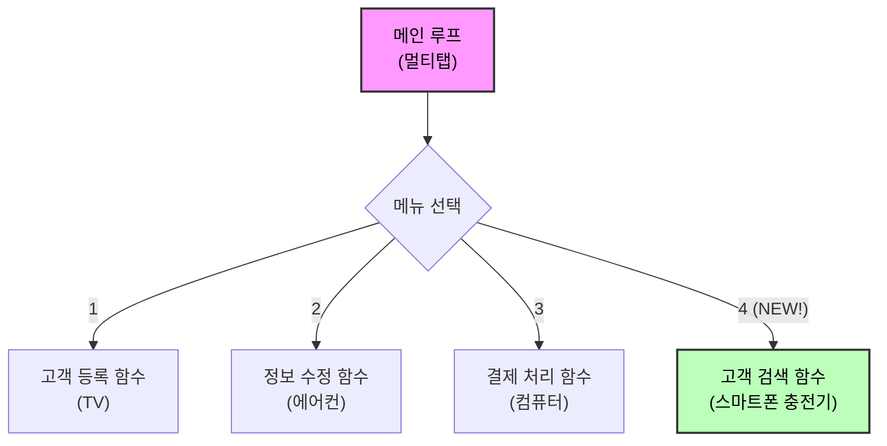

# 마이크로 세션: 076 — 요구사항 추가를 통한 구조적 확장성 체험

> **세션 ID**: MS-PY101-076  
> **소요 시간**: 25분  
> **난이도**: ★★☆  
> **청크 타입**: lab  
> **버전**: v2.1 (7섹션 구조)

---

## §1. 개요

> **Day 4 | PM | 세션 076/085**

### 🎯 학습 목표

이 세션이 끝나면, 수강생은 다음을 할 수 있습니다:

- 구조적으로 분리된 v2 코드에 '검색 기능'을 추가하는 프롬프트를 실행할 수 있다
- 새로운 기능을 추가할 때 기존 코드에 미치는 영향을 최소화하는 확장성의 원리를 이해할 수 있다
- 추가된 검색 기능을 메인 루프에 연결하고 기존 기능들의 무결성을 검증할 수 있다

### 선행 세션 환기

바로 직전 세션(세션-075)에서 우리는 거대하게 하나로 엉켜 있던 절차적 코드를 기능별로 분리한 '구조적 코드'로 리팩토링했습니다. 이제 코드는 용도별로 잘 나누어진 깔끔한 서랍장처럼 정리되었죠. 그런데 만약 고객이 "이름으로 고객 정보를 딱 검색하는 기능 하나만 추가해 주세요!"라고 요구한다면 어떨까요? 과거에 우리가 짰던 절차적 코드였다면, 수백 줄의 코드를 처음부터 끝까지 다시 읽으며 어느 중간 즈음에 이 로직을 끼워 넣어야 할지 며칠 밤을 새워 고민해야 했을 것입니다. 하지만 우리는 이제 다릅니다. 오늘 우리는 이 튼튼한 구조가 새로운 요구사항을 얼마나 부드럽게 수용하는지 두 손으로 직접 체험해 볼 것입니다.

---

## §2. 핵심 개념 (+ 🗣️ 강사 대본 + Mermaid)

### 비유 — 멀티탭에 새로운 스마트폰 충전기 꽂기

집에서 매일 사용하는 멀티탭을 떠올려 보세요. 현재 텔레비전, 에어컨, 컴퓨터가 각각의 구멍에 꽂혀 평화롭게 작동하고 있습니다. 이때 새로 산 스마트폰 충전기를 연결하고 싶다면 어떻게 하시나요? 텔레비전의 전선을 자르고 복잡하게 구리선을 꼬아서 충전기를 연결하는 사람은 아무도 없을 것입니다. 그저 멀티탭의 남는 빈 구멍에 충전기 플러그를 톡 하고 꽂아 넣기만 하면 끝납니다. 새로운 기기를 추가했다고 해서 멀티탭에 꽂혀 있던 텔레비전 화면이 꺼지거나 에어컨이 갑자기 멈추는 일은 절대 발생하지 않습니다.

우리가 작성한 v2 코드도 이 멀티탭과 완벽하게 똑같은 원리로 작동합니다. 기존에 만들어둔 고객 등록, 정보 수정, 결제 기능은 이미 꽂혀 있는 텔레비전이나 에어컨과 같습니다. 이번에 새롭게 추가할 '검색 기능'은 새로운 스마트폰 충전기입니다. 우리는 이 충전기를 작동시키기 위해 기존 가전제품들을 분해할 필요가 전혀 없습니다. `search_customer()`라는 새로운 함수 블록을 하나 만들고, 메인 루프라는 멀티탭의 4번 구멍에 살짝 꽂아주기만 하면 됩니다. 이처럼 기존 코드를 망가뜨리지 않고 기능을 무한히 붙여나갈 수 있는 성질을 프로그래밍 세계에서는 '확장성'이라고 부릅니다.

🗣️ **강사 대본 (Instructor Script)**:

> 여러분, 우리가 만든 프로그램이 현장에 배포되었다고 상상해 봅시다. 고객들은 프로그램에 무척 만족하며 잘 사용하고 있습니다. 그런데 일주일이 지나자 강력한 요청이 하나 들어옵니다. 매번 전체 고객 목록을 눈으로 훑어보는 게 너무 힘드니, 이름을 입력하면 그 사람 정보만 쏙 뽑아서 보여주는 검색 기능을 추가해 달라는 내용이죠.
>
> 과거의 절차적 코드였다면 어땠을까요? 어디에 코드를 끼워 넣어야 결제 시스템이 망가지지 않을지 밤새 고민해야 했을 겁니다. 잘못 끼워 넣었다간 엉뚱한 사람의 결제가 취소되는 대참사가 발생할 수도 있으니까요. 하지만 우리는 이제 구조적인 v2 코드를 가지고 있습니다. 이 견고한 구조가 어떻게 새로운 기능을 부드럽게 품어내는지, 오늘은 AI와 함께 직접 검색 기능을 추가해 보며 마법 같은 확장성을 체험해 보겠습니다. 텔레비전 전원 끄지 않고 멀티탭에 충전기를 꽂는 기분을 느껴보실 거예요.

### Mermaid 다이어그램



---

## §3. 상세 내용

### Why — 기능 추가가 왜 이렇게 쉬워졌는가?

이전의 절차적 코드에서는 모든 변수와 로직이 하나의 거대한 흐름 속에 엉켜 있었습니다. 새로운 변수나 로직을 하나 추가하면, 아래쪽에 있는 다른 코드가 어떤 영향을 받을지 예측할 수 없었죠. 하지만 구조적 코드는 각 기능이 독립된 함수라는 "격리된 방" 안에 들어 있습니다. 검색 기능을 새로 만들어도 그 방 안에서만 작동하므로, 옆방에 있는 결제 기능이나 등록 기능에는 아무런 영향을 주지 않습니다. 이것이 우리가 힘들게 코드를 함수 단위로 쪼갠 진짜 이유입니다.

### What — 격리된 기능 생성과 메인 루프 연결

구조적 코드에서 새로운 기능을 추가하는 작업은 정확히 두 단계로 이루어집니다.

1. **독립된 함수 생성**: `search_customer()`라는 함수를 새로 만들어서 그 안에 검색 로직만 구현합니다. 기존 함수들은 절대 건드리지 않습니다.
2. **메인 루프 연결**: 메인 루프의 메뉴 선택 부분에 `elif choice == '4': search_customer()`라는 단 한 줄의 연결고리만 추가합니다.

이러한 접근 방식 덕분에 AI에게 지시를 내릴 때도 "전체 코드를 다시 다 짜줘"라고 뭉뚱그려 말할 필요가 없습니다. "기존 코드는 그대로 두고, 새로 검색 함수만 만들어서 메뉴에 연결해 줘"라고 정밀하고 부분적인 프롬프트를 내릴 수 있게 됩니다. 범위가 좁혀지면 AI의 코딩 실수는 극적으로 줄어듭니다.

### How — 무결성 검증의 중요성

기능을 추가한 후에는 반드시 검증을 거쳐야 합니다. 새 기능인 검색이 잘 작동하는지 확인하는 것은 기본 중의 기본이고, 진짜 핵심은 **기존 기능(등록, 결제)이 여전히 잘 작동하는지 확인**하는 것입니다. 멀티탭에 충전기를 꽂았더니 TV가 꺼지면 안 되는 것과 같은 이치입니다. 프로 개발자들은 이것을 '회귀 테스트(Regression Test)'라고 부릅니다.

> ✅ **체크포인트**: 여기까지 이해했는지 스스로 점검해 보세요.
> - 새로운 기능을 추가할 때 기존 코드가 망가지지 않는 핵심 이유는 무엇인가요? ("기능이 독립된 함수로 격리되어 있기 때문")
> - AI에게 새로운 기능 추가를 요청할 때 가장 중요한 프롬프트 작성 규칙은 무엇인가요? ("기존 구조와 함수들은 절대 건드리지 말고, 새 함수만 추가하라고 명확히 지시하기")

### 비교표 — 요구사항 추가 시의 패러다임 차이

| 항목 | 절차적 프로그래밍 (v1.0) | 구조적 프로그래밍 (v2.0) |
|------|--------------------------|--------------------------|
| 코드 파악 범위 | 처음부터 끝까지 수백 줄을 다 읽어야 함 | 메인 루프와 새로 추가할 함수 부분만 알면 됨 |
| 부작용(Side-effect) 위험 | 매우 높음 (변수 오염, 로직 꼬임 빈번함) | 매우 낮음 (격리된 스코프 보장) |
| AI 프롬프트 방식 | "코드를 처음부터 다시 다 짜줘" | "기존 코드 유지하고 새 함수만 덧붙여 줘" |
| 개발자의 심리 상태 | 수정을 주저하게 되는 두려움과 스트레스 | 언제든 부수고 다시 지을 수 있는 실험의 자유 |

---

## §4. 실습 가이드 (+ 🎙️ 실습 대본)

### 실습 목표

이 실습을 통해 수강생은 AI 어시스턴트를 활용하여 구조화된 v2 코드에 새로운 검색 기능을 직접 장착하고, 기존 코드가 망가지지 않았는지 꼼꼼하게 검증하는 과정을 경험합니다.

🎙️ **실습 가이드 대본 (Lab Guide)**:

> 자, 이제 여러분의 화면을 켜주세요. 우리의 자랑스러운 구조적 v2 코드에 새로운 검색 기능을 장착해 보겠습니다. 그런데 주의할 점이 있어요. AI에게 무작정 "검색 기능 넣어줘"라고 뭉뚱그려 말하면, AI가 신나서 전체 코드를 제멋대로 뜯어고칠 수도 있습니다. 우리는 방금 배운 대로 "기존 구조는 절대 건드리지 마!"라고 단호하게 지시할 겁니다.
>
> 그리고 코드를 붙여넣은 뒤에는, 4번 검색 기능을 켜보기 전에 무조건 1번 등록 기능부터 테스트해 보세요. 스마트폰 충전기를 꽂았을 때 TV가 안 꺼졌는지 확인하는 겁니다! 자, 단계별 가이드에 따라 천천히 진행해 봅시다.

### 단계별 지시

| 단계 | 소요 시간 | 강사 지시사항 | 학습자 액션 | 예상 결과 |
|------|-----------|---------------|-------------|-----------|
| **1** | 5분 | "정밀한 프롬프트를 입력하세요" | AI에게 검색 기능 추가 프롬프트 작성 및 실행 | `search_customer()` 함수가 추가된 코드 응답 |
| **2** | 5분 | "복사 전 기존 코드를 리뷰하세요" | 기존 함수(`register_user` 등)가 변경되지 않았는지 확인 | 메인 루프와 새 함수만 변경됨을 확인 |
| **3** | 5분 | "기존 기능 무결성부터 테스트하세요" | 코드 실행 후 1번(등록), 2번(수정) 기능 실행 | 기존 기능들이 예전처럼 정상 작동함 |
| **4** | 10분 | "새 기능의 디테일을 테스트하세요" | 4번(검색) 실행 후, 목록에 없는 이름 입력해 보기 | "결과 없음" 출력되며 프로그램이 멈추지 않음 |

**[단계 1] 정밀한 프롬프트 작성**

AI 어시스턴트 채팅창에 다음 프롬프트를 입력하세요:
```text
현재 v2 코드에 이름으로 고객을 찾는 `search_customer()` 함수를 추가해 줘. 
그리고 메인 메뉴의 4번 항목으로 이 함수를 연결해 줘. 
가장 중요한 규칙은 기존의 다른 함수들이나 데이터 구조는 절대 수정하지 않는 거야.
검색 결과가 없을 때의 예외 처리도 포함해 줘.
```

**[단계 2] 변경 범위 확인 및 코드 리뷰**

AI가 짜준 코드를 무작정 복사하지 마세요! 눈으로 스크롤을 내리면서 기존에 있던 `register_user()`나 `process_payment()` 함수의 내용이 조금이라도 바뀌었는지 두 눈으로 똑똑히 확인합니다. 만약 바뀌었다면 AI에게 "내가 기존 함수는 건드리지 말라고 했잖아. 다시 수정해서 줘"라고 호통을 치셔야 합니다.

**[단계 3] 기존 기능 무결성 테스트 (회귀 테스트)**

코드를 붙여넣고 실행합니다. 여러분의 손은 4번(검색)을 누르고 싶어 근질근질하겠지만 꾹 참고 1번을 눌러 고객을 한 명 등록해 보세요. 기존 기능이 완벽하게 작동하는지 확인하는 이 과정이 프로 개발자의 가장 중요한 기본기입니다.

**[단계 4] 검색 기능 디테일 테스트**

이제 4번을 눌러 방금 등록한 고객의 이름을 검색해 보세요. 그리고 이번에는 아예 목록에 없는 이상한 이름을 검색해 봅니다. 프로그램이 붉은 에러를 뿜으며 죽어버리나요, 아니면 "결과가 없습니다"라고 부드럽게 대처하나요? 에러가 안 나고 부드럽게 넘어갔다면 완벽하게 성공한 것입니다.

### 트러블슈팅 FAQ

| Q | A |
|---|---|
| AI가 기존 함수 이름이나 구조까지 다 바꿔버렸어요. | AI의 흔한 실수입니다. 프롬프트에 "기존 코드 유지 필수"를 훨씬 더 강하게 강조해서 다시 요청하세요. |
| 4번을 눌렀는데 아무 일도 일어나지 않아요. | 메인 루프의 `elif choice == '4':` 부분에 `search_customer()` 함수 호출이 제대로 들여쓰기 되어 연결되었는지 확인해 보세요. |
| 검색은 되는데 대소문자를 엄격하게 구분해서 불편해요. | 아주 좋은 발견입니다! AI에게 "검색할 때 대소문자 구분 없이 찾아지도록 `search_customer` 코드를 수정해 줘"라고 요청해 보세요. 이게 바로 구조적 확장의 묘미입니다. |

---


### 🎓 강사 노트 (Instructor Support)

- ⏱️ **타이밍**: 14:25 (25분, lab)
- 🎯 **핵심 활동**: '검색 기능' 추가 실습
- ⚠️ **강사 주의사항**: 구조적 코드의 유연성 체감


### 📋 실습 설계 보강 (Lab Packet)

**세션 076 실습 설계 보강**

요구사항 추가를 통한 구조적 확장성 체험
- **3-Stage Example Set**
  - 기본: v2 코드에 "이름으로 검색하는 기능" 추가 프롬프트 → 기존 코드 영향 최소 확인
  - 변형: "전화번호로도 검색할 수 있게 해줘" 2차 확장
  - 실수 해결: "검색 기능을 추가했는데 기존 CRUD가 망가졌어요" → 함수 분리의 이점 재확인
- **난이도 예측**: "확장성"이라는 추상 개념을 체감하는 것이 핵심
- **타이밍 가이드**: 검색 기능 프롬프트 5분 | 코드 생성·통합 10분 | 기존 기능 영향 검증 5분 | 정리 5분
- **심리적 장벽**: "또 기능을 추가해야 해? 지금도 복잡한데"
- **자가 점검**:
  - [ ] 새로운 검색 함수가 독립적으로 추가되었는가?
  - [ ] 기존 CRUD 4가지 기능이 여전히 정상 동작하는가?
  - [ ] 함수 분리가 확장성에 도움이 되는 이유를 설명할 수 있는가?

## §5. 코드 및 명령어 모음

### 프롬프트 1: 검색 기능 추가 요청

```text
현재 v2 코드에 이름으로 고객을 찾는 `search_customer()` 함수를 추가해 줘.
메인 메뉴의 4번 항목으로 이 함수를 연결하고, 다른 기존 함수는 절대 수정하지 마.
만약 검색 결과가 없을 때는 친절한 안내 메시지를 띄워 줘.
```

### 코드 스니펫 1: 추가된 검색 함수 예시

```python
def search_customer():
    name = input("검색할 고객 이름: ")
    found = False
    for customer in customers:
        if customer['name'] == name:
            print(f"고객 정보: 이름 {customer['name']}, 전화번호 {customer['phone']}")
            found = True
            break
    
    if not found:
        print("해당 이름의 고객을 찾을 수 없습니다.")
```

이 함수는 철저하게 독립된 블록으로, 기존 코드의 변수나 흐름을 전혀 오염시키지 않습니다.

### 코드 스니펫 2: 메인 루프 연결부 (멀티탭에 꽂기)

```python
# 메인 루프 (멀티탭 역할)
while True:
    print("\n--- 고객 관리 메뉴 ---")
    print("1. 등록  2. 수정  3. 결제  4. 검색  5. 종료")
    choice = input("선택: ")
    
    if choice == '1':
        register_user()
    elif choice == '2':
        update_user()
    elif choice == '3':
        process_payment()
    elif choice == '4':
        search_customer()  # <- 바로 여기에 새로운 플러그를 꽂았습니다!
    elif choice == '5':
        print("프로그램을 종료합니다.")
        break
    else:
        print("잘못된 입력입니다. 다시 선택해주세요.")
```

---

## §6. 요약

### 핵심 학습 포인트

이번 세션에서 우리는 구조적 프로그래밍의 진짜 가치인 '확장성'을 체험했습니다. 첫째, 잘 구조화된 코드는 빈 멀티탭과 같아서 기존 기능을 전혀 건드리지 않고도 새로운 기능을 쉽게 꽂아 넣을 수 있습니다. 둘째, AI에게 코드를 요청할 때는 전체를 다시 짜달라고 하는 대신 "기존 구조는 유지하고 새 함수만 추가해 줘"라고 정밀하게 지시해야 안전한 결과물을 얻을 수 있습니다. 셋째, 새로운 기능을 추가한 후에는 새 기능뿐만 아니라 기존 기능이 망가지지 않았는지 확인하는 무결성 테스트(회귀 테스트)가 필수적입니다.

### 다음 세션 예고

우리가 방금 수행한 테스트는 사실 아주 가볍고 점잖은 수준이었습니다. 진짜 프로 개발자들은 코드가 정말 튼튼한지 확인하기 위해 상상 이상의 가혹한 조건으로 코드를 마구 괴롭힙니다. 다음 세션에서는 이 멋진 프로그램이 극한의 상황에서도 잘 버티는지, '테스트 시나리오'라는 이름의 혹독한 시승 코스로 여러분을 안내하겠습니다.

### 브릿지 노트

> "성공적으로 검색 기능을 추가하셨나요? 아마 여러분은 다른 기능을 망가뜨릴까 봐 덜덜 떨며 코드를 고치던 과거와 달리, 아주 홀가분하고 가벼운 마음으로 새로운 기능을 이식하셨을 겁니다. 구조가 탄탄하게 잡혀 있다는 것은 이처럼 개발자에게 무한한 실험의 자유를 선사합니다. 자, 차에 멋진 내비게이션을 새로 달았으니, 이제 진짜 험난한 오프로드를 달려봐야겠죠? 다음 세션으로 가봅시다!"

---

## §7. 참고 자료

### 3-Source 출처

- **Source A (로컬 참고자료)**: 「8 코딩.pdf」 §8.10 — 요구사항 추가 및 리팩토링 원리, 기존 코드에 미치는 영향 분석
- **Source C (Deep Research)**: SRC-C01 §5.1 — 함수 단위 격리를 통한 구조적 유지보수성 및 확장성 메커니즘

### 추가 학습 자료

- [소프트웨어 공학: 회귀 테스트(Regression Testing)의 이해](https://ko.wikipedia.org/wiki/%ED%9A%8C%EA%B7%80_%ED%85%8C%EC%8A%A4%ED%8A%B8)
- [Python Clean Code Guide](https://github.com/zedr/clean-code-python): 독립적인 함수 작성과 확장성 있는 구조에 대한 가이드

### 강사 노트

> 💡 **강사 노트**: 수강생들이 새로운 기능을 추가할 때 가장 많이 하는 실수는 '4번(검색) 기능만 테스트하고 넘어가는 것'입니다. 이 세션의 진정한 목적은 검색 기능의 완성이 아니라 '기존 1~3번 기능들이 검색 기능 추가 후에도 멀쩡히 동작하는지'를 확인하는 것입니다. 이 회귀 테스트(Regression Test)의 개념을 실습 중 은연중에 계속 심어주세요. 이것이 바로 이어지는 세션 077, 078의 본격적인 테스트 시나리오 실습을 위한 가장 훌륭한 빌드업이 됩니다.

---

## ✅ 세션 완료 체크리스트 (강사용)

- [x] §1~§7 모든 섹션이 충실하게 작성되었는가?
- [x] 멀티탭과 스마트폰 충전기 비유가 명확하게 설명되었는가?
- [x] 단계별 가이드에 무결성 테스트(회귀 테스트) 단계가 명시되었는가?
- [x] 검색 기능 추가 프롬프트와 메인 루프 연결 코드 스니펫이 제공되었는가?
- [x] 3-Source 출처가 올바르게 매핑되었는가?
- [x] 다음 세션(077 테스트 시나리오)을 위한 브릿지 노트가 포함되었는가?

---

**🔗 선행 세션**: [세션-075] 절차적 vs 구조적 코드 나란히 비교 분석 (필수)  
**🔗 후행 세션**: [세션-077] 테스트는 시승이다: 테스트 시나리오 3분류 이해

---

*작성 일시: 2026-02-25*  
*작성 에이전트: Sisyphus-Junior*  
*교안 구조: 7섹션 (A0 팀 공통 표준)*