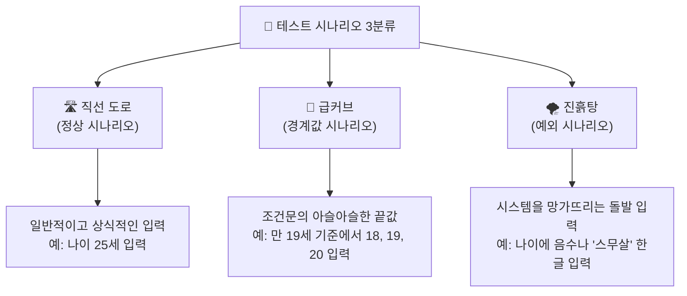

# 마이크로 세션: 077 - 테스트는 시승이다: 테스트 시나리오 3분류 이해

> **세션 ID**: MS-PY101-077  
> **소요 시간**: 20분  
> **난이도**: ★☆☆  
> **청크 타입**: narrative  
> **버전**: v2.1 (7섹션 구조)

---

## §1. 개요

> **Day 4 | PM | 세션 077/085**

이 세션은 우리가 애써 만든 프로그램이 세상에 나가기 전 반드시 거쳐야 할 검증 단계를 다루고 있습니다. 지난 세션까지 우리는 스파게티처럼 엉켜있던 절차적 코드를 구조적으로 분리하고 깔끔하게 확장하는 법을 배웠어요. 이제 프로그램은 제법 그럴싸한 모습을 갖췄습니다. 하지만 조립이 끝났다고 바로 고객에게 돈을 받고 팔 수는 없습니다. 핸들이 제대로 돌아가는지 브레이크가 듣는지 철저한 시승 테스트가 필요하죠.

### 🎯 학습 목표

이 세션이 끝나면 수강생은 다음을 할 수 있어요:

- 테스트 시나리오의 3분류(정상, 경계값, 예외)를 자동차 시승에 빗대어 정확히 설명할 수 있습니다
- AI가 생성한 '해피 패스' 위주의 코드에서 숨겨진 허점을 발견하고 의심하는 시야를 가집니다
- 직접 만든 고객 관리 프로그램에 어떤 값을 입력해볼지 구체적인 테스트 계획을 설계할 수 있습니다

### 선행 세션 환기

바로 앞선 세션에서 우리는 기능 추가라는 구조적 확장의 위력을 맛보았습니다. 코드가 잘 작동하는 것처럼 보이지만 진짜 튼튼한 코드인지 확인하려면 가혹한 환경에 던져봐야 합니다. 오늘이 바로 그 가혹한 환경을 설계하는 시간입니다.

---

## §2. 핵심 개념 (+ 🗣️ 강사 대본 + Mermaid)

### 자동차 시승의 3가지 코스와 소프트웨어 테스트

소프트웨어를 테스트하는 방법은 자동차 회사가 신차를 개발하고 주행 테스트를 하는 과정과 놀라울 정도로 닮았습니다. 맑은 날씨에 포장도로를 정속 주행하는 코스가 있고 아슬아슬하게 핸들을 꺾는 급커브 코스도 있습니다. 심지어 바퀴가 푹푹 빠지는 진흙탕에 차를 던져놓고 버티는지 보는 코스도 있죠. 우리 프로그램 역시 이와 똑같은 3가지 테스트 코스를 반드시 통과해야 합니다.

🗣️ **강사 대본 (Instructor Script)**:

> 여러분 반가워요. 지난 세션에서 멋지게 구조를 잡은 고객 관리 프로그램 코드를 기억하시죠? 코드가 예뻐졌고 기능도 잘 돌아갑니다. 이제 이 프로그램을 진짜 고객들에게 배포한다고 상상해 봅시다. 어딘가 모르게 불안하지 않으신가요?
> 
> 당연히 불안할 겁니다. 사용자가 우리가 생각한 대로 얌전하게 프로그램을 써주지 않거든요. 차를 조립하자마자 매장에 전시하지 않는 것과 똑같습니다. 무조건 테스트 트랙을 돌아봐야 하죠. 이때 테스트 트랙은 크게 세 종류로 나뉩니다.
> 
> 첫 번째는 길고 곧게 뻗은 매끄러운 '직선 도로'입니다. 날씨 좋은 날 시속 80킬로미터로 부드럽게 달려보는 코스예요. 프로그램으로 치면 아주 정상적인 값을 넣었을 때 예상대로 잘 돌아가는지 확인하는 겁니다.
> 
> 두 번째는 타이어에서 비명이 날 정도로 핸들을 확 꺾는 '급커브' 코스입니다. 속도를 줄이지 않고 코너를 돌 때 차가 뒤집히지 않고 얼마나 잘 버티는지 보는 곳이죠. 시스템이 허용하는 가장 끝단의 아슬아슬한 숫자를 넣어보는 테스트에 해당합니다.
> 
> 세 번째가 가장 중요해요. 바로 바퀴가 푹푹 빠지는 '진흙탕' 코스입니다. 일반적인 도로가 아니라 늪지대나 자갈밭에 던져놓고 엔진이 꺼지지 않고 탈출할 수 있는지 극한의 생존 능력을 시험합니다. 사용자가 상상을 초월하는 이상한 값을 마구 입력할 때 프로그램이 시뻘건 에러를 뿜으며 죽어버리지 않는지 확인하는 과정입니다. 
>
> 훌륭한 개발자는 AI가 짜준 코드를 맹신하지 않습니다. 이 세 가지 코스를 모두 준비해 두고 프로그램을 가혹하게 굴려보는 사람이 진짜 개발자예요.

### Mermaid 다이어그램



이 다이어그램은 코드를 짤 때 머릿속에 항상 띄워두어야 할 3개의 나침반과 같아요. 코드를 눈으로만 읽지 말고 이 3가지 코스 위에서 차가 달리는 상상을 해보는 습관이 아주 중요합니다.

---

## §3. 상세 내용

### Why: 왜 우리가 직접 진흙탕을 파야 할까요?

챗GPT나 클로드 같은 똑똑한 AI가 코드를 순식간에 짜주는 시대입니다. "고객 나이를 받아서 성인인지 알려주는 코드 짜줘"라고 부탁하면 정말 그럴싸한 코드가 1초 만에 나옵니다. 그런데 이런 AI 생성 코드에는 치명적인 약점이 하나 있어요. 

AI는 대부분 사용자가 말을 잘 듣는 '해피 패스(Happy Path)' 위주의 긍정적인 상황만 가정하고 코드를 작성합니다. 즉 직선 도로만 달릴 수 있는 코드를 만들어냅니다. 비가 오거나 늪에 빠지는 상황을 굳이 먼저 대비하지 않아요. 숫자를 넣으라는 곳에 이모티콘을 넣거나 데이터베이스 선이 갑자기 뽑히는 상황은 오롯이 개발자가 상상하고 대비해야 합니다. AI 시대에 진흙탕을 파는 일은 철저히 사람의 몫입니다.

### What: 3가지 코스의 공학적 번역

전문적인 소프트웨어 공학 용어로는 이 3가지 코스를 정상(Normal), 경계값(Boundary), 예외(Exception)라고 명확히 분류합니다.

1. **정상 시나리오 (Normal)**: 모든 것이 이상적으로 흘러가는 상황입니다. 할인율 10%를 입력하거나 나이를 25살로 입력하는 등 평범하고 상식적인 입력값을 테스트합니다. 해피 패스라고도 부릅니다.
2. **경계값 시나리오 (Boundary)**: 버그가 가장 많이 숨어있는 곳입니다. 시스템의 한계점을 노립니다. 나이 제한이 만 19세 이상이라면 정확히 18, 19, 20이라는 숫자를 집요하게 파고듭니다. 코드에 등호(`>=`)를 하나 빼먹어서 19살이 미성년자로 분류되는 참사를 여기서 잡아냅니다.
3. **예외 시나리오 (Exception)**: 상식을 파괴하는 돌발 상황입니다. 나이 입력창에 음수인 -5를 넣거나 "비밀입니다"라고 문자열을 입력해봅니다. 이때 프로그램이 시뻘건 에러 메시지를 뿜으며 멈춘다면 진흙탕에서 엔진이 꺼진 겁니다. 부드럽게 "숫자로만 입력해주세요"라고 안내하며 다시 입력을 기다리게 하는 것이 올바른 예외 처리입니다.

### How: 방탄조끼를 입히는 사고방식

단순히 테스트를 많이 하는 것이 능사가 아니에요. 가장 중요한 것은 "어디를 찔러야 아파할까"를 고민하는 논리적 얄미움입니다. 사용자는 개발자의 의도대로 바르게 행동하지 않습니다. 프로그램의 가장 취약한 고리를 찾아내 공격하는 방탄조끼 사고방식을 장착해야 완벽한 프로그램을 완성할 수 있습니다.

---

## §4. 실습 가이드 (+ 🎙️ 실습 대본)

### 실습 목표

이 세션의 실습은 직접 코드를 고치는 대신 상상력을 동원하는 브레인스토밍 시간입니다. 앞서 배운 3가지 시나리오 기준을 활용해 우리가 만든 고객 관리 앱을 망가뜨릴 수 있는 기상천외한 아이디어를 뽑아보는 것이 목표예요.

🎙️ **실습 가이드 대본 (Lab Guide)**:

> 자, 머릿속에서 예의 바른 사용자는 잠시 지워버리세요. 아주 짓궂고 얄미운 사용자가 되어보는 겁니다. 옆에 앉은 분과 함께 지금부터 3분 동안 아이디어 회의를 시작할 거예요. 
>
> 주제는 이겁니다. 우리 프로그램에 '고객의 전화번호'를 입력하는 기능이 있죠. 이 전화번호 창에 어떤 기상천외한 값을 집어넣으면 프로그램이 당황해서 쓰러질까요? 정상적인 번호 말고 경계선에 걸친 애매한 값이나 규칙을 완전히 무시하는 값을 최대한 많이 상상해 보세요.
>
> 가장 악랄하게 프로그램을 망가뜨릴 아이디어를 내주신 팀에게는 제가 특별히 박수를 쳐드리겠습니다. 자 시작하세요!
>
> (3분 후) 시간이 다 됐습니다. 누가 제일 재밌는 아이디어를 생각하셨나요? 네, 전화번호에 피자집 이모티콘을 넣는다고요? 정말 훌륭합니다! 010 대신 999로 시작하는 번호를 생각하신 분도 있네요. 이런 창의력이 바로 테스트 시나리오를 만드는 핵심 재료입니다.

### 단계별 지시

| 단계 | 소요 시간 | 강사 지시사항 | 학습자 액션 | 예상 결과 |
|------|----------|--------------|------------|----------|
| 1 | 3분 | 전화번호 기능을 망가뜨릴 방법 브레인스토밍 지시 | 짝과 엉뚱한 입력값 상상 및 공유 | 다양한 엣지 케이스 아이디어 도출 |
| 2 | 2분 | 전체 발표 및 아이디어 공유 유도 | 자원자 발표 (예: 기호 입력, 엔터키 연타 등) | 예외 시나리오의 얄미움 체감 |
| 3 | 3분 | 수집된 아이디어를 정상, 경계값, 예외로 분류 판서 | 강사의 설명을 들으며 3분류 복습 | 3분류 개념의 완벽한 내재화 |
| 4 | 2분 | AI가 엣지 케이스를 자주 놓친다는 사실 강조 | 고개를 끄덕이며 공감 | 테스트 설계자 역할 인식 |

### 트러블슈팅 FAQ

| Q | A |
|---|---|
| 수강생들이 정상적인 값만 떠올리고 예외 상상을 어려워해요 | 강사가 먼저 자극적인 예시를 던져주세요. "만약 사용자가 키보드 위에 고양이를 올려놓아서 '야옹야옹'이 입력되면 어떡하죠?" 처럼요. |
| "이런 것까지 꼼꼼하게 테스트해야 하나요?" | "실제 서비스에서는 이보다 훨씬 심한 일도 일어납니다. 해커들은 바로 이런 빈틈을 뚫고 들어오거든요"라고 보안의 중요성을 일깨워주세요. |
| 경계값과 예외의 차이를 아직 헷갈려 하는 분이 있어요 | 경계값은 '형식은 맞지만 조건의 아슬아슬한 끝에 있는 숫자'이고 예외는 '아예 형식조차 완전히 틀린 입력'이라고 깔끔하게 요약해주세요. |

> ✅ **체크포인트**: 이제 누군가 내 코드를 칭찬해도 속으로 "이 코드가 진흙탕에서도 버틸까?"라고 의심할 수 있게 되었나요?

---


### 🎓 강사 노트 (Instructor Support)

- ⏱️ **타이밍**: 15:05 (20분, narrative)
- 🎯 **핵심 활동**: "시승" 비유 (정상/경계/예외)
- ⚠️ **강사 주의사항**: 테스트 = 품질 보증

## §5. 코드 및 명령어 모음

이 세션은 마인드셋을 다루는 narrative 타입입니다. 코딩 자체보다는 테스트 데이터를 어떻게 설계하고 분류할지 생각하는 방법이 훨씬 중요해요. 아래 코드는 우리가 브레인스토밍한 시나리오를 파이썬 리스트로 깔끔하게 정리해본 예시입니다. 본격적인 테스트 코드는 다음 세션에서 짭니다.

```python
# 전화번호 입력 기능에 대한 3분류 테스트 시나리오 계획표
test_scenarios = {
    "정상_시나리오": [
        "010-1234-5678",  # 완벽한 표준 규격
        "011-987-6543"    # 옛날 번호 형식
    ],
    "경계값_시나리오": [
        "01012345678",    # 하이픈(-)이 없는 애매한 경우
        "010-123-45678"   # 자릿수가 1자리 많거나 적은 경우
    ],
    "예외_시나리오": [
        "전화없음",         # 숫자 대신 문자열 입력
        "010-1234-🍕",    # 이모티콘 및 특수기호 입력
        "",               # 아무것도 입력하지 않고 빈칸 엔터
        "   "             # 공백만 마구 입력
    ]
}
```

> 🤖 **AI 프롬프트 예시**:
> 여러분이 기획한 기능을 AI에게 테스트해달라고 부탁할 때는 이렇게 구체적으로 요청해 보세요.
> "내가 만든 고객 관리 프로그램의 전화번호 입력 기능에 대해 정상 입력, 조건의 한계를 찌르는 경계값, 완전히 잘못된 예외 상황 이 3가지 분류로 테스트 케이스 표를 작성해줘."

---

## §6. 요약

### 핵심 학습 포인트

이번 세션의 핵심은 코드를 완성했다고 개발이 끝나는 것이 아니라는 사실이에요. 우리가 만든 프로그램은 반드시 직선 도로(정상), 급커브(경계값), 진흙탕(예외)이라는 세 가지 시승 코스를 거쳐야만 합니다. 특히 AI는 똑똑하지만 태생적으로 '해피 패스'를 너무 사랑합니다. 비가 오거나 늪에 빠지는 최악의 상황을 상상하고 테스트하는 악당 역할은 철저히 개발자의 몫입니다. 의심하는 자만이 버그를 잡습니다.

### 다음 세션 예고

"시승 코스를 모두 이해하셨으니 이제 진짜 트랙 위로 차를 올려볼 시간입니다!"
다음 세션에서는 방금 상상했던 얄미운 테스트 케이스들을 무기로 실제 고객 관리 프로그램 코드에 무자비한 공격을 퍼부어 볼 거예요. 본격적인 버그 사냥이 시작됩니다.

### 브릿지 노트

> "머릿속으로 상상만 했는데도 벌써 우리 프로그램이 여기저기서 에러를 뿜으며 펑펑 터질 것 같지 않나요? 겁먹을 필요 없습니다. 여기서 미리 터뜨려봐야 나중에 진짜 고객 앞에서 터지지 않으니까요. 노트북 화면 열고 사냥을 시작해봅시다!"

---

## §7. 참고 자료

### 3-Source 출처

- **Source A (로컬 참고자료)**: 9 디버깅,테스트,배포.pdf §9.3.1 - 테스트 시나리오의 명확한 3분류(정상, 경계값, 예외) 공학적 정의를 본문의 구조적 기틀로 차용했습니다.
- **Source B (NotebookLM)**: NotebookLM 분석 리포트 §7 - AI가 생성한 코드는 해피 패스 위주이므로 개발자가 예외 상황 방어에 집중해야 한다는 분석을 강사 대본에 핵심 철학으로 반영했습니다.
- **Source C (Deep Research)**: Deep Research 보고서 §3.1, 3.2 - 자동차 시승 비유(정상 주행, 급커브, 타이어 펑크)와 사용자 관점의 Test-Think-Fix 훈련 방법론을 실습 가이드에 적용했습니다.

### 추가 학습 자료

- 외부 아티클 권장 읽기: AI 주도 개발에서의 테스트 시나리오 전략
- Python 내장 기능: `try-except` 예외 처리 기본 가이드

### 강사 노트

> 💡 **강사 노트**: 수강생들이 테스트를 지루한 숙제가 아니라 '숨은 버그를 찾는 짜릿한 게임'으로 느끼도록 분위기를 띄우는 것이 관건입니다. "이 코드를 인정사정없이 부숴보세요!"라고 도발적으로 주문하면 수강생들의 참여도가 눈에 띄게 올라갑니다. AI가 유독 예외 상황 방어에 취약하다는 점을 강조하여 개발자의 대체 불가능한 역할을 각인시켜 주세요.

---

## ✅ 세션 완료 체크리스트 (강사용)

- [x] §1~§7 모든 섹션이 충실하게 작성되었는가?
- [x] 자동차 시승 비유를 통해 3분류가 명확히 설명되었는가?
- [x] AI 시대 테스트의 중요성이 강사 대본에 자연스럽게 녹아있는가?
- [x] Mermaid 다이어그램이 가독성 좋게 포함되었는가?
- [x] 3-Source 팩트 패킷 내용이 정확히 반영되었는가?

---

*작성 일시: 2026-02-25*  
*작성 에이전트: A4B_Session_Writer*  
*교안 구조: 7섹션 (A0 팀 공통 표준)*
