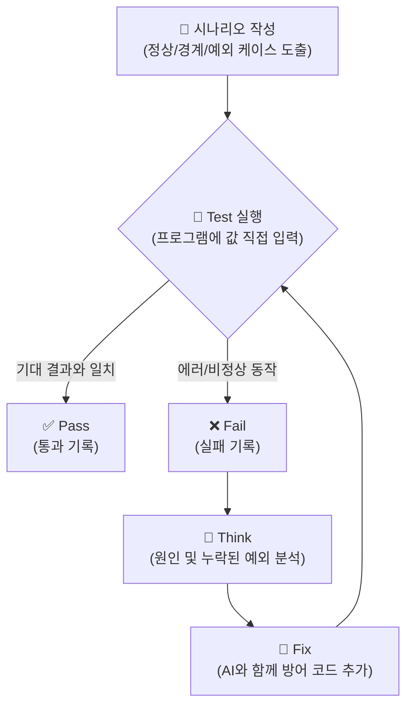

# 마이크로 세션: 078 — 고객 관리 프로그램 테스트 시나리오 작성 실습

> **세션 ID**: MS-PY101-078  
> **소요 시간**: 25분  
> **난이도**: ★★☆  
> **청크 타입**: lab  
> **버전**: v2.1 (7섹션 구조)

---

## §1. 개요

> **Day 4 | PM | 세션 078/085**

### 🎯 학습 목표

이 세션이 끝나면, 수강생은 다음을 할 수 있습니다:

- 고객 관리 프로그램의 특정 기능에 대해 정상/경계값/예외 케이스를 모두 포함한 테스트 시나리오 표를 작성할 수 있다
- 체계화된 6가지 필수 항목을 포함하는 테스트 케이스 양식을 활용해 자신의 코드를 검증할 수 있다
- 직접 작성한 시나리오를 바탕으로 **Test-Think-Fix** 사이클을 돌려 방어 로직을 보완할 수 있다

### 선행 세션 환기

바로 직전 세션(세션-077)에서 우리는 "테스트는 자동차 시승과 같다"는 중요한 비유를 배웠습니다. 평범하게 달려보고(정상), 아슬아슬하게 브레이크도 밟아보고(경계값), 연료통도 비워봐야(예외) 진짜 튼튼한 코드인지 알 수 있다고 했었죠. 코드를 완성하고 "실행(Run)" 버튼을 눌러서 한두 번 값을 예쁘게 입력해 본 것만으로 모든 문제가 해결되었다고 믿는다면, 그것은 마치 브레이크를 테스트해보지 않고 시속 100km로 달리는 스포츠카에 올라타는 것과 같습니다. 이제 여러분이 직접 만든 고객 관리 프로그램의 허점을 찌르는 치밀한 테스트 시나리오를 작성해 볼 시간입니다.

---

## §2. 핵심 개념 (+ 🗣️ 강사 대본 + Mermaid)

### 비유 — 깐깐한 식약처 검사관의 체크리스트

테스트 시나리오를 이해하기 위해, 여러분이 새롭게 문을 연 대형 식품 공장의 공장장이라고 상상해 보겠습니다. 최신식 자동화 기계를 들여놓았고, 레시피도 완벽하게 세팅했습니다. 그런데 어느 날, 아주 깐깐하기로 소문난 식약처 검사관이 불시에 방문을 합니다. 이 검사관은 여러분이 만든 맛있는 만두를 하나 집어 먹어보고 "음, 맛있군요! 통과!"라고 말할까요? 절대 그렇지 않습니다. 검사관의 손에는 수십 페이지에 달하는 어마어마한 두께의 체크리스트가 들려 있습니다.

검사관은 3단계로 기계를 끈질기게 괴롭힙니다:
1. **정상 케이스 (Happy Path)**: "정해진 온도 100도에서 5분간 쪘을 때 만두가 잘 익는가?"
2. **경계값 (Boundary)**: "온도가 99도일 때와 101도일 때는 어떤 차이가 발생하는가? 타이머가 4분 59초에서 5분으로 넘어가는 찰나에 오류가 나지 않는가?"
3. **예외 케이스 (Exception/Edge Case)**: "만약 만두피 대신 돌멩이를 기계에 넣으면 시스템이 멈추고 경고음을 울리는가?"

소프트웨어 테스트 시나리오도 정확히 이 식약처 검사관의 체크리스트와 같습니다. 우리는 프로그램을 만든 창조자의 마음을 잠시 내려놓고, 시스템의 허점을 어떻게든 찾아내어 부수려는 '악의적인 검사관'의 마인드셋으로 전환해야 합니다.

🗣️ **강사 대본 (Instructor Script)**:

> 여러분, 지난 시간에 우리가 무엇을 했는지 기억나시나요? 고객의 정보를 등록하고, 조회하고, 수정하는 멋진 고객 관리 프로그램을 만들었죠. 코드가 아주 깔끔하게 정리되었고 잘 동작하는 것처럼 보입니다.
>
> 하지만 여러분, 실제 세상의 사용자들은 절대 우리가 원하는 대로 예쁘게 데이터를 입력해주지 않습니다. 나이를 입력하라고 하면 "스무살"이라고 한글로 치고, 전화번호를 입력하라고 하면 숫자만 11자리를 연달아 치거나 심지어 아무것도 안 적고 그냥 엔터를 쳐버립니다. 이럴 때 우리 프로그램이 빨간 에러 메시지를 뿜으며 죽어버린다면 어떨까요?
>
> 배포 이후에 발생하는 오류를 고치는 비용은 개발 단계에서 잡는 것보다 100배 이상 듭니다. 오늘은 내가 만든 코드, 혹은 AI가 만들어준 코드를 100% 신뢰할 수 있도록, 아주 치밀하고 체계적으로 검증하는 방법을 배울 것입니다. 바로 '테스트 시나리오'를 작성하는 실습이죠.

### Mermaid 다이어그램: Test-Think-Fix 사이클



---

## §3. 상세 내용

### 완벽한 테스트를 위한 6가지 필수 항목

머릿속으로만 '이런 것도 넣어봐야지'라고 생각하는 것은 진정한 의미의 테스트가 아닙니다. 반드시 문서화된 표 형태로 정리해야 하며, 현업의 QA(Quality Assurance) 엔지니어들이 사용하는 표준 양식에는 다음 6가지 핵심 항목이 포함됩니다.

1. **테스트 ID (Test ID)**: "TC-001"처럼 고유한 번호를 부여해서 나중에 어떤 테스트가 실패했는지 쉽게 추적할 수 있게 합니다.
2. **테스트 목적 (Objective)**: 이 테스트가 무엇을 검증하려고 하는지 명확히 적습니다. (예: "휴대폰 번호 형식 유효성 검증")
3. **전제 조건 (Pre-condition)**: 테스트를 수행하기 전에 시스템이 어떤 상태여야 하는지 정의합니다. (예: "프로그램이 실행 중이고, '1. 고객 등록' 메뉴에 진입한 상태")
4. **입력값 (Input Data)**: 정상적인 값뿐만 아니라, 시스템을 당황하게 만들 경계값이나 예외 상황 데이터를 구체적으로 명시합니다. (예: `010-ABCD-5678`, 혹은 빈 문자열 `""`)
5. **기대 결과 (Expected Result)**: 해당 입력값을 넣었을 때 프로그램이 어떻게 반응해야 '정상'인지 미리 정의합니다. (예: "올바른 형식이 아닙니다"라는 에러 메시지 출력 후 재입력 요구)
6. **실제 결과 (Actual Result)**: 실제로 프로그램을 실행해보고 기대 결과와 일치하는지(Pass), 아니면 프로그램이 튕겼는지(Fail)를 기록합니다.

우리는 이 항목들을 바탕으로 **Test-Think-Fix 사이클**을 돌려야 합니다. 특히 고객 관리 프로그램에서는 '전화번호'와 '이메일' 같은 사용자 입력값이 가장 큰 지뢰밭입니다. 사용자가 입력할 수 있는 극단적인 상황을 상상해 보세요. 빈칸 엔터, 특수문자 입력 등 예상을 뛰어넘는 상상력이 필요합니다.

> ✅ **체크포인트**: 
> "테스트 시나리오를 작성할 때, 정상적인 상황 외에 시스템의 취약점을 찾기 위해 극단적인 값이나 예상치 못한 입력값을 넣어보는 테스트를 무엇이라고 부를까요?"
> — **경계값(Boundary) 및 예외(Exception) 케이스 테스트**입니다!

---


### 📊 참고 표 (Visual Specs)

**테스트의 3가지 핵심 유형 (정상/경계/예외)**

| 테스트 유형 | 목적 | 고객 관리 프로그램 예시 시나리오 |
|:---|:---|:---|

## §4. 실습 가이드 (+ 🎙️ 실습 대본)

### 실습 목표

이 실습을 통해 수강생은 직접 "전화번호 입력 기능"에 대한 테스트 시나리오 표를 작성하고, 자신의 파이썬 프로그램에 극단적인 입력값을 넣어보며 버그를 발견(Test)하고, 원인을 분석(Think)한 뒤, AI와 함께 코드를 수정(Fix)하는 QA 과정을 체험합니다.

🎙️ **실습 대본 (Lab Guide)**:

> 자, 이제 여러분이 직접 식약처 검사관이 될 시간입니다. 우리가 만든 '고객 등록' 기능 중에서도 **전화번호 입력 부분**을 집중적으로 테스트해 볼 거예요.
>
> 엑셀이나 메모장, 혹은 그냥 화면 구석에 6가지 항목이 들어간 표를 하나 그려주세요. 첫 번째 줄은 제가 도와드릴게요. 사용자가 "010-1234-5678"이라고 예쁘게 입력하는 'Happy Path'입니다. 
> 
> 그 다음부터는 여러분의 상상력을 발휘해서 이 프로그램이 가장 싫어할 만한 값들을 마구마구 적어보세요. 글자 수가 모자라거나, 한글이 섞여 있거나, 아무것도 안 치고 엔터만 치는 경우 등등요.
>
> 표를 다 작성하셨다면, 터미널에서 파이썬 프로그램을 실행해서 그 값들을 진짜로 넣어보세요. 프로그램이 "앗, 문자열은 처리할 수 없습니다!" 하면서 Traceback 에러를 뿜으며 뻗는다면 속상해하지 마세요. 빙고! 여러분은 방금 배포 전에 크리티컬 버그를 하나 잡아낸 위대한 엔지니어가 된 겁니다.

### 단계별 실습 지시사항

| 단계 | 소요 시간 | 수행 내용 | 핵심 포인트 |
|------|----------|-----------|------------|
| **Step 1** | 5분 | **정상 케이스 작성** | 사용자가 `010-1234-5678`과 같이 하이픈을 포함하여 정확히 입력하는 'Happy Path'를 정의합니다. 기대 결과에는 "성공적으로 저장되고 완료 메시지 출력"이라고 적습니다. |
| **Step 2** | 10분 | **경계값 및 예외 케이스 3개 이상 도출** | 숫자 대신 문자열이 섞인 경우(`010-ABCD-5678`), 하이픈이 없는 경우(`01012345678`), 아예 아무것도 입력하지 않고 엔터를 친 빈 값(Null) 처리 등을 고민하여 표에 추가합니다. |
| **Step 3** | 10분 | **프로그램 실행 및 Test-Think-Fix 적용** | 여러분의 파이썬 고객 관리 프로그램을 실행하고 시나리오의 입력값을 직접 넣습니다. 프로그램이 에러(Traceback)를 내며 종료되면 실제 결과에 'Fail'로 기록하고, 방어 로직(Fix)을 고민하세요. |

**📝 실습용 테스트 시나리오 양식 (작성 예시)**

| Test ID | 테스트 목적 | 전제 조건 | 입력값 | 기대 결과 | 실제 결과 |
|---------|-----------|-----------|-------|----------|----------|
| TC-001 | 정상 전화번호 입력 | '등록' 메뉴 진입 | `010-1234-5678` | "등록되었습니다" 출력 | Pass |
| TC-002 | 전화번호 길이 미달 (경계) | '등록' 메뉴 진입 | `010-123-456` | "13자리를 맞춰주세요" 출력 | **Fail (그냥 등록되어버림)** |
| TC-003 | 하이픈 누락 (예외) | '등록' 메뉴 진입 | `01012345678` | "형식 오류" 경고 및 재입력 | **Fail (강제종료 발생)** |
| TC-004 | 빈 값 입력 (예외) | '등록' 메뉴 진입 | `(엔터키만 입력)` | "필수 입력값입니다" 출력 | ? |

---


### 🎓 강사 노트 (Instructor Support)

- ⏱️ **타이밍**: 15:25 (25분, lab)
- 🎯 **핵심 활동**: 고객관리 테스트 케이스 작성
- ⚠️ **강사 주의사항**: 3분류 각 2개 이상


### 📋 실습 설계 보강 (Lab Packet)

**세션 078 실습 설계 보강**

고객 관리 프로그램 테스트 시나리오 작성 실습
- **3-Stage Example Set**
  - 기본: 정상(Happy Path) / 경계값(Edge Case) / 예외(Exception) 3분류 표 작성
  - 변형: AI에게 "이 프로그램의 테스트 시나리오 10개를 만들어줘" 요청 → 빠진 것 보완
  - 실수 해결: "정상 케이스만 생각하고 예외 케이스를 못 만들겠어요" → "빈 입력, 숫자 대신 문자, 특수문자" 가이드
- **난이도 예측**: "테스트"라는 개념 자체가 처음 — 코드를 만든 사람이 의도적으로 깨뜨려야 한다는 역발상
- **타이밍 가이드**: 3분류 설명 복습 3분 | 정상 시나리오 5분 | 경계값·예외 시나리오 10분 | AI 검증 7분
- **심리적 장벽**: "내가 만든 걸 내가 왜 깨뜨려야 해?"
- **자가 점검**:
  - [ ] 정상/경계값/예외 각각 최소 2개씩 총 6개 이상의 시나리오를 작성했는가?
  - [ ] 빈 문자열 입력, 한글/영문 혼용 등의 경계 케이스를 포함했는가?
  - [ ] 테스트 시나리오 표에 "예상 결과"와 "실제 결과" 컬럼이 있는가?

## §5. 코드 및 명령어 모음

### AI 프롬프트 1: 결함 수정(Fix) 요청 가이드

테스트 중 Fail이 발생했다면, AI에게 구체적인 테스트 결과를 알려주고 수정을 요청하는 프롬프트를 작성해 봅니다.

```text
내가 만든 고객 관리 프로그램에서 전화번호 입력 테스트를 진행했어.
입력값으로 아무것도 치지 않고 엔터(빈 문자열)를 치거나, 
하이픈 없이 '01012345678'을 입력하니까 프로그램이 에러를 내면서 튕겨버려.

현재 내 전화번호 입력받는 코드는 이거야:
[여기에 본인 코드 붙여넣기]

빈 문자열이 들어오거나 형식이 틀렸을 때 프로그램이 종료되지 않고,
"올바른 형식(010-XXXX-XXXX)으로 다시 입력해주세요"라고 경고하면서 
입력 루프를 반복하도록 방어 코드를 추가해줘.
```

### 참고 코드: 강력한 예외 처리가 들어간 입력 루프 (Fix 예시)

```python
def input_phone_number():
    while True:
        phone = input("전화번호 (010-XXXX-XXXX): ")
        
        # 1. 예외 케이스: 빈 값 검증
        if not phone.strip():
            print("[오류] 전화번호는 필수 입력값입니다. 다시 입력해주세요.")
            continue
            
        # 2. 경계/예외 케이스: 길이 및 하이픈 형식 검증
        if len(phone) != 13 or phone[3] != '-' or phone[8] != '-':
            print("[오류] 올바른 형식이 아닙니다. (예: 010-1234-5678)")
            continue
            
        return phone
```

이처럼 예외 처리가 들어간 코드로 튼튼하게 고친 뒤, TC-003과 TC-004를 다시 실행(Test)하여 **Fail을 Pass로 바꾸는 것**이 오늘 실습의 최종 목표입니다.

---

## §6. 요약

### 핵심 학습 포인트

이번 세션에서 여러분이 작성한 시나리오대로 테스트를 해보니 어떠셨나요? 생각보다 허점이 참 많았죠? 내가 짠 코드인데도 빈 문자열 하나에 프로그램이 와르르 무너지는 것을 보며 놀라셨을 겁니다.

하지만 부끄러워할 필요는 전혀 없습니다. 오히려 실제 사용자에게 배포하기 전에 우리 스스로 이 결함을 발견했다는 것이 엄청난 다행이니까요. 테스트 시나리오는 오류를 비난하기 위한 것이 아니라, 시스템의 붕괴를 막아주는 든든한 **방패**입니다. 정상, 경계값, 예외 케이스를 집요하게 파고드는 테스트 마인드셋은 훌륭한 시니어 개발자가 되기 위한 필수 덕목입니다.

### 다음 세션 예고

결함을 찾아냈으니, 이제 이 결함을 바탕으로 서로의 코드를 평가하고 리뷰하는 시간을 가질 겁니다. 다음 세션에서는 "품질 검사관"이 되어 코드의 가독성, 유지보수성, 에러 처리, 성능, 보안이라는 5대 체크포인트를 바탕으로 코드를 체계적으로 비판하고 리뷰하는 방법을 배워보겠습니다.

### 브릿지 노트

> "여러분의 코드에 얼마나 많은 구멍이 있었는지 확인하셨나요? 무너지는 코드를 보며 좌절하지 마세요. 이 무너짐을 견뎌내고 방어 코드를 덧대어가는 Test-Think-Fix 과정이 바로 프로그래밍의 진짜 묘미입니다. 다음 시간에는 내가 짠 코드를 넘어, 동료가 짠 코드, 혹은 AI가 짠 코드를 평가하는 5가지 엄격한 잣대, '코드 리뷰 5대 체크포인트'를 알아보겠습니다."

---

## §7. 참고 자료

### 3-Source 출처

- **Source A (로컬 참고자료)**: 「9 디버깅,테스트,배포.pdf」 (§9.3.1) — 테스트 시나리오 작성과 예외/경계값 검증 기법.
- **Source B (NotebookLM)**: SRC-B01 — 정상/경계값/예외 3분류 이해 기반 테스트 시나리오 도출 로직.
- **Source C (Deep Research)**: SRC-C01 (§3.2, 3.3) — 개발 중 결함 도출의 심층 분석, Test-Think-Fix 사이클 및 방어적 프로그래밍 접근법.

### 추가 학습 자료

- [소프트웨어 테스팅 기초 (ISTQB)](https://www.istqb.org/): 글로벌 소프트웨어 테스팅 자격 검증 위원회의 경계값 분석 및 동등 분할 기법 개념.
- [Python 내장 unittest 모듈 문서](https://docs.python.org/ko/3/library/unittest.html): 향후 자동화 테스트를 위해 알아두면 좋은 공식 파이썬 단위 테스트 라이브러리.

### 강사 노트

> 💡 **강사 노트**: 실습 과정에서 수강생들이 "프로그램이 에러를 내는 것"에 대해 두려움이나 실패감을 느끼지 않도록 격려하는 것이 매우 중요합니다. '일부러 망가뜨려 보는 시간'이라는 점을 거듭 강조해 주세요. 특히 11자리 숫자를 하이픈 없이 붙여 쓰는 경우(`01012345678`)는 사용자의 아주 흔한 실수이므로, 이를 방어하는 로직이 필수적임을 알려주면 좋습니다.

---

## ✅ 세션 완료 체크리스트 (강사용)

- [x] §1~§7 모든 섹션이 충실하게 작성되었는가?
- [x] '식약처 검사관' 비유가 §2에 명확히 제시되었는가?
- [x] Test-Think-Fix 사이클이 Mermaid 다이어그램으로 포함되었는가?
- [x] 테스트를 위한 6가지 필수 항목(ID, 목적, 전제, 입력, 기대, 실제)이 설명되었는가?
- [x] 실습 가이드에 명확한 작성 예시(표)가 제공되었는가?
- [x] 구어체 톤(🗣️ 강사 대본, 🎙️ 실습 가이드 대본)이 자연스럽게 적용되었는가?
- [x] 결함을 수정하기 위한 구체적 AI 프롬프트 예시가 주어졌는가?

---

**🔗 선행 세션**: [세션-077] 테스트는 시승이다: 테스트 시나리오 3분류 이해  
**🔗 후행 세션**: [세션-079] 품질 검사관: 코드 리뷰 5대 체크포인트  

---

*작성 일시: 2026-02-25*  
*작성 에이전트: A4B_Session_Writer*  
*교안 구조: 7섹션 (A0 팀 공통 표준)*