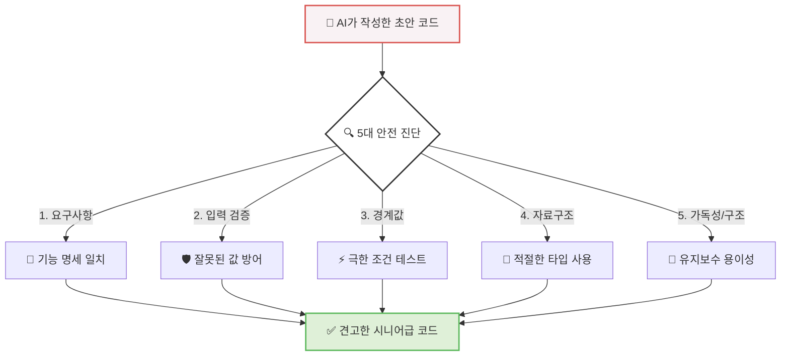

# 마이크로 세션: 079 — 품질 검사관: 코드 리뷰 5대 체크포인트

> **세션 ID**: MS-PY101-079  
> **소요 시간**: 20분  
> **난이도**: ★★☆  
> **청크 타입**: narrative  
> **버전**: v2.1 (7섹션 구조)  
> **위치**: Day 4 | PM | 세션 079/085

---

## §1. 개요

> **"테스트가 끝났다면, 이제 속살을 들여다볼 차례입니다."**

이 세션은 방금 전 세션에서 작성한 테스트 시나리오를 바탕으로, 우리 프로그램의 내부 구조를 꼼꼼하게 점검하는 '코드 리뷰'의 기준을 배우는 시간이에요. 겉보기에는 멀쩡하게 작동하던 고객 관리 프로그램이 이상한 전화번호 하나, 빈칸 하나에 속수무책으로 무너지는 것을 방금 경험하셨죠? 소프트웨어가 겉으로 드러내는 증상(Error)을 발견하는 것이 '테스트'라면, 이제는 그 증상의 원인을 찾아내고 앞으로 비슷한 병에 걸리지 않도록 체질을 개선하는 과정이 필요합니다.

### 🎯 학습 목표

이 세션이 끝나면 수강생은 다음을 할 수 있어요:

- 코드 품질을 검증하기 위한 5대 체크포인트(요구사항, 입력 검증, 경계값, 자료구조, 가독성/구조)를 설명할 수 있습니다.
- AI가 무비판적으로 생성한 초안 코드의 취약점을 5대 기준에 따라 찾아낼 수 있습니다.
- 시니어 개발자의 시각에서 안전하고 견고한 코드를 판별하는 눈을 기를 수 있습니다.

### 선행 세션 환기

이전 세션(078)에서 우리는 고객 관리 프로그램에 대해 정상, 경계값, 예외 상황이라는 3가지 테스트 시나리오를 작성해 보았습니다. 테스트를 통해 프로그램이 어떻게 무너지는지 확인했다면, 이제는 코드 레벨에서 그 무너짐을 방어할 수 있도록 '품질 검사관'의 안경을 쓰고 코드를 살펴볼 차례예요.

---

## §2. 핵심 개념 (+ 🗣️ 강사 대본 + Mermaid)

### 비유: 건축물의 5단계 안전 진단

코드 리뷰를 하는 과정은 마치 갓 지어진 새 아파트를 점검하는 '건축물 안전 진단'과 똑같아요. 인부들(또는 AI)이 설계도대로 아파트를 뚝딱뚝딱 지어놨다고 해서 바로 사람들을 입주시켜도 될까요? 당연히 안 되죠. 노련한 안전 진단 전문가는 아파트 단지에 들어서자마자 자신만의 철저한 5단계 체크리스트를 꺼내 듭니다. 우리의 파이썬 코드에도 이 5단계 진단 기준을 그대로 적용해야 합니다.

🗣️ **강사 대본 (Instructor Script)**:

> 여러분, 방금 전 테스트 시나리오 실습에서 뼈저리게 느끼셨을 거예요. 사용자는 우리가 원하는 대로만 예쁘게 입력해주지 않습니다. AI가 1초 만에 코드를 뱉어내는 요즘 시대에는, 이 코드가 정말로 현장에 배포되어도 안전한지 검증하는 '품질 검사관'의 역할이 그 어느 때보다 중요해졌습니다. 
>
> 훌륭한 시니어 개발자들은 코드를 작성하는 시간보다 동료의 코드를 읽고 리뷰하는 데 더 많은 시간을 쏟는다고 해요. AI가 짠 코드도 마찬가지입니다. 무비판적으로 수용하면 안 돼요. 
>
> 새 아파트가 지어졌다고 생각해 봅시다. 가장 먼저 확인하는 것은 **'요구사항'**이에요. "원래 30평형 쓰리룸을 짓기로 했는데, 거실과 방 3개가 제대로 나왔는가?"를 봅니다. 아무리 튼튼해도 투룸이면 탈락이죠. 
> 
> 두 번째는 **'입력 검증(배관/전기)'**입니다. "수돗물을 틀었을 때 흙탕물이 섞여 들어오지는 않는가? 220V가 아닌 이상한 전압이 들어올 때 차단기가 잘 떨어지는가?" 외부의 위험 요소를 걸러낼 장치를 살피는 겁니다.
>
> 세 번째는 **'경계값(극한 상황)'** 테스트예요. "태풍이 불거나 지진 강도 6.0이 발생해도 버틸 수 있는가?" 평상시가 아니라 극한 조건에서 무너지지 않는지 확인하는 것이죠. 
> 
> 네 번째는 **'자료구조(건축 자재)'**입니다. "기둥을 세울 때 철근 콘크리트를 썼는가, 아니면 겉보기에만 그럴싸한 스티로폼을 썼는가?" 상황에 맞는 적절한 재료를 썼는지 검증해야 합니다.
>
> 마지막 다섯 번째는 **'가독성과 구조(미관 및 동선)'**입니다. "집 구조가 너무 복잡해서 화장실을 가려면 안방을 지나야만 하는가? 누군가 수리하러 왔을 때 배관을 쉽게 찾도록 도면과 라벨링이 잘 되어 있는가?"를 봅니다. 이 5단계 진단을 통과해야만 '배포해도 좋은 코드'라는 승인을 받을 수 있습니다!

### Mermaid 다이어그램



이 다이어그램은 허술한 AI 초안 코드가 어떻게 5가지 거름망을 거쳐 튼튼하고 안전한 코드로 탈바꿈하는지를 시각적으로 보여줍니다. 

---

## §3. 상세 내용

### Why — 왜 이 세션이 필요한가?

AI 에이전트에게 "고객 정보를 업데이트하는 함수를 짜줘"라고 하면 아주 빠르고 그럴듯한 코드를 만들어 줍니다. 하지만 AI는 종종 '정상적인 상황'만 가정하고 코드를 짜는 경향이 있어요. 예외 처리나 경계값 확인을 누락하는 경우가 굉장히 많습니다. 개발자가 이 코드를 검증 없이 그대로 서비스에 붙이면, 치명적인 보안 사고나 시스템 다운으로 이어질 수 있습니다. 따라서 AI의 작업물을 평가할 수 있는 명확한 기준, 즉 5대 체크포인트가 머릿속에 완전히 자리 잡혀 있어야 해요.

### What — 5대 체크포인트란 무엇인가?

1. **요구사항 (Requirements)**: 코드가 우리가 원래 지시한 기능을 정확히 수행하고 있는지 확인합니다. 고객의 나이를 계산하라고 했는데 생년을 저장만 하고 있지는 않은지 확인하는 가장 기본적인 단계예요.
2. **입력 검증 (Input Validation)**: 아까 테스트 시나리오에서 찾았던 구멍들을 코드가 잘 막아내고 있는지 봅니다. `if not name:`처럼 값이 비어있는지 검사하거나, 정규식을 사용해 전화번호 형식이 맞는지 검사하는 방어 로직이 필수적입니다.
3. **경계값 (Boundary Conditions)**: 리스트의 인덱스를 벗어나지는 않는지(`IndexError`), 나이에 음수가 들어가거나 200살이 들어가는 것을 막아주었는지 확인합니다. 조건의 끝값(>=, <=)이 올바른지 점검해야 해요.
4. **자료구조 (Data Structures)**: 파이썬의 핵심인 리스트, 딕셔너리, 세트 등을 상황에 맞게 잘 썼는지 확인합니다. 고객을 주민번호로 빠르게 검색해야 하는데 리스트를 반복문으로 돌리고 있다면, 이를 딕셔너리의 키(Key) 검색으로 바꾸도록 지적해야 합니다.
5. **가독성 및 구조 (Readability & Architecture)**: 변수 이름이 `a`, `b`처럼 대충 지어지지 않았는지, 하나의 함수가 3~4가지 일을 동시에 하고 있지는 않은지 살핍니다. 누군가 나중에 이 코드를 읽었을 때 한눈에 이해할 수 있어야 해요.

### How — 어떻게 적용하는가?

이 5가지 기준만 확실히 기억해두면, 아무리 복잡한 코드를 만나더라도 당황하지 않고 문제점을 콕콕 짚어낼 수 있어요. 마치 채점 기준표를 들고 시험지를 채점하듯 코드를 하나하나 뜯어보는 습관을 들이는 것이 핵심입니다.

---


### 📊 참고 표 (Visual Specs)

**코드 리뷰 5대 체크포인트**

| 체크포인트 | 설명 | AI 프롬프트 적용 예시 |
|:---|:---|:---|

## §4. 실습 가이드 (+ 🎙️ 실습 대본)

### 실습 목표

동일한 기능을 수행하지만 품질이 완전히 다른 두 개의 코드를 비교해 봅니다. AI가 작성한 초안 코드의 문제점을 5대 체크포인트에 비추어 스스로 찾아내고, 시니어 개발자가 리팩토링한 코드가 어떻게 그 문제점들을 방어하고 있는지 눈으로 확인합니다.

🎙️ **실습 가이드 대본 (Lab Guide)**:

> 자, 화면의 코드를 함께 보실까요? 화면 왼쪽은 제가 방금 전 AI에게 "고객 나이 업데이트 함수 만들어줘"라고 했을 때 1초 만에 뱉어낸 코드입니다. 코드가 단 두 줄이네요! 언뜻 보면 심플하고 잘 작동할 것 같죠? 요구사항(나이 업데이트)은 만족했습니다. 
>
> 하지만 우리의 5대 체크포인트를 들이대 볼까요? '입력 검증'이 전혀 없어요. 만약 사용자가 실수로 나이 칸에 문자열 `"스무살"`을 넣으면 어떻게 될까요? 그냥 업데이트되어 버리고 나중에 계산할 때 에러가 터지겠죠. 
> 
> '경계값' 처리도 없습니다. 실수로 `-5`살이나 `1000`살이 들어와도 그냥 데이터베이스에 들어가 버립니다. 
>
> 이제 화면 오른쪽의 시니어 개발자가 수정한 견고한 코드를 보세요. 코드가 좀 길어졌죠? 하지만 어떤 이상한 값이 들어와도 절대 프로그램이 죽지 않도록 `if`문으로 단단한 성벽을 둘러쳤습니다. 숫자가 맞는지, 나이 범위가 정상인지 꼼꼼하게 따져보고 나서야 업데이트를 허락합니다. 이것이 바로 코드 리뷰와 리팩토링의 힘입니다!

### 단계별 지시

| 단계 | 소요 시간 | 강사 지시사항 | 학습자 액션 | 예상 결과 |
|------|----------|--------------|------------|----------|
| 1 | 5분 | AI 초안 코드 화면에 제시 | 5대 체크포인트 기준으로 약점 찾기 | 입력 검증과 경계값 부재 발견 |
| 2 | 5분 | 학습자 의견 청취 | "문자가 들어가면 안 돼요", "마이너스 나이는 없어요" 발표 | 예외 상황에 대한 경각심 고취 |
| 3 | 5분 | 시니어 개발자의 수정 코드 제시 | 방어 코드가 어떻게 적용되었는지 대조하며 확인 | 구조적 방어 로직의 필요성 체감 |
| 4 | 5분 | 질의응답 및 정리 | 본인이 작성했던 코드의 취약점 되돌아보기 | 코드 품질에 대한 시각 변화 |

### 트러블슈팅 FAQ

| Q | A |
|---|---|
| 방어 코드를 너무 많이 넣으면 코드가 지저분해지지 않나요? | 네, 좋은 질문이에요. 그래서 보통 입력 검증만 전담하는 함수나 모듈을 따로 빼서 구조화합니다. 메인 로직과 검증 로직을 분리하는 것이죠. |
| AI에게 처음부터 예외처리 다 해달라고 하면 안 되나요? | 물론 가능합니다! 하지만 AI가 완벽하게 처리했는지 '검증'하는 눈이 없으면, 엉뚱한 예외 처리를 해놔도 모르게 됩니다. 우리가 검사관이 되어야 하는 이유죠. |

---


### 🎓 강사 노트 (Instructor Support)

- ⏱️ **타이밍**: 15:50 (20분, narrative)
- 🎯 **핵심 활동**: "품질 검사관" 비유
- ⚠️ **강사 주의사항**: 체크리스트 배포

## §5. 코드 및 명령어 모음

강의 화면에 나란히 띄워놓고 비교할 코드 스니펫입니다. 

**🔴 AI가 작성한 초안 (검증 없음)**
```python
def update_age(customer, new_age):
    customer['age'] = new_age
    print("업데이트 완료")
```

**🟢 리뷰가 반영된 견고한 코드 (시니어급)**
```python
def update_age(customer, new_age):
    # 1. 입력 검증 (Input Validation): 숫자 타입이 맞는지 확인
    if not isinstance(new_age, int):
        print("오류: 나이는 숫자여야 합니다.")
        return False
    
    # 2. 경계값 검증 (Boundary Conditions): 상식적인 나이 범위인지 확인
    if new_age < 0 or new_age > 150:
        print("오류: 유효하지 않은 나이 범위입니다.")
        return False
        
    # 모든 검증을 통과했을 때만 데이터 업데이트
    customer['age'] = new_age
    print("정상적으로 업데이트되었습니다.")
    return True
```

---

## §6. 요약

### 핵심 학습 포인트

여러분은 이제 좋은 코드와 위험한 코드를 구분할 수 있는 매의 눈을 가지게 되었습니다. 코드를 평가하는 5대 체크포인트는 다음과 같습니다.
1. 기능이 지시대로 구현되었는가? (요구사항)
2. 엉뚱한 입력이 들어와도 튕겨내는가? (입력 검증)
3. 극단적인 값이 들어와도 안전한가? (경계값)
4. 데이터를 효율적으로 관리하는가? (자료구조)
5. 남이 읽기 쉽고 구조가 깔끔한가? (가독성/구조)

이 기준들을 통해 내 코드, 그리고 AI가 만들어준 코드의 약점을 발견해내는 것이 소프트웨어 품질 관리의 첫걸음입니다. 

### 다음 세션 예고

진단 기준을 알았으니, 이제 진단서를 예쁘게 써서 정비공(AI)에게 전달해야겠죠? 다음 세션(080)에서는 발견된 문제점을 AI에게 정확하게 지시하여 코드를 수정받는 '리뷰 코멘트 작성 및 프롬프트 엔지니어링 실습'을 진행하겠습니다.

### 브릿지 노트

> "코드의 약점을 찾는 법을 알게 되셨나요? 그런데 속으로 '아, 저거 언제 다 말로 설명해서 고치라고 하지?' 생각하셨을 거예요. 걱정 마세요. AI에게 '이 부분은 입력 검증이 빠졌으니 보완해'라고 정확히 명령하는 방법, 다음 시간에 바로 알려드립니다!"

> ✅ **체크포인트**: "코드 리뷰 5대 체크포인트 중, 사용자로부터 나이를 입력받을 때 0보다 작거나 150보다 큰 값이 들어오는 것을 막았는지 확인하는 항목은 무엇일까요?" 
> ➡️ 정답은 **경계값(Boundary)** 확인입니다!

---

## §7. 참고 자료

### 3-Source 출처

- **Source A (로컬 참고자료)**: 「8 코딩.pdf」 §8.12 (코드 리뷰), 「9 디버깅,테스트,배포.pdf」 §9.3.2 — 코드 리뷰의 중요성과 결함을 찾아내는 실무적 기준들을 발췌하여 5대 체크포인트로 재구성했습니다.
- **Source B (NotebookLM)**: NotebookLM 분석 리포트 §8 — 생성된 코드를 무비판적으로 수용하지 않고 체계적 기준으로 평가하는 방법론을 본 세션의 핵심 철학으로 반영했습니다.
- **Source C (Deep Research)**: Deep Research 보고서 §4.1 — 가독성, 유지보수성, 에러 처리(입력 검증) 등 품질 검사관으로서의 시니어 개발자 페르소나 설정에 활용했습니다.

### 강사 노트

> 💡 **강사 노트**: 본 세션은 수강생들이 스스로 짠 코드나 AI가 짜준 코드를 '불신'하게 만드는 것이 목표입니다. 완벽한 코드는 없으며 항상 방어적으로 코딩해야 한다는 점을 5대 체크포인트를 통해 설득력 있게 전달해 주세요. 건축물 안전 진단 비유를 사용할 때 과장된 억양을 섞어주시면 집중도를 높이는 데 아주 좋습니다.

---

## ✅ 세션 완료 체크리스트 (강사용)

- [x] §1~§7 모든 섹션이 충실하게 작성되었는가?
- [x] 구어체 기반의 친근하고 명확한 문체가 유지되었는가?
- [x] 5대 체크포인트 개념이 건축물 진단 비유와 함께 잘 설명되었는가?
- [x] 시니어급 코드와 AI 초안 코드를 대조하는 실습 가이드가 포함되었는가?
- [x] Mermaid 다이어그램이 정상적으로 렌더링되며 흐름을 잘 보여주는가?

---

*작성 일시: 2026-02-25*  
*작성 에이전트: A4B_Session_Writer*  
*교안 구조: 7섹션 (A0 팀 공통 표준)*