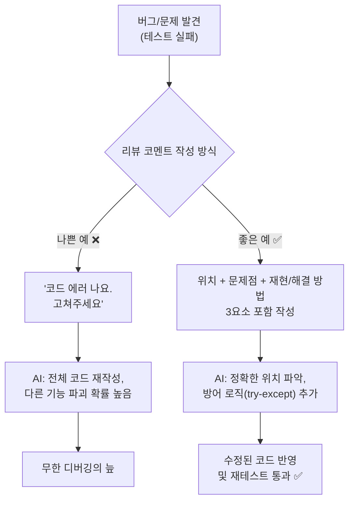
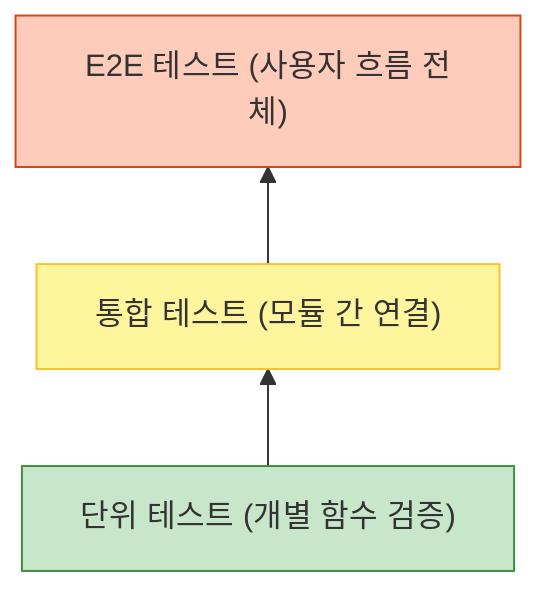

# 마이크로 세션: 080 — 완벽한 리뷰 코멘트 작성 및 AI 피드백 실습

> **세션 ID**: MS-PY101-080  
> **소요 시간**: 25분  
> **난이도**: medium  
> **청크 타입**: lab  
> **버전**: v2.1 (7섹션 구조)

---

## §1. 개요

> **Day 4 | PM | 세션 080/085**

### 🎯 학습 목표

이 세션이 끝나면, 수강생은 다음을 할 수 있습니다:

- 리뷰 코멘트 3요소(위치, 문제점, 재현/해결 방법)를 포함한 프롬프트를 작성하여 AI에게 코드 수정을 지시할 수 있다
- AI에게 구체적인 페르소나와 맥락을 부여하여 의도한 방향대로 예외 처리가 반영된 코드를 획득할 수 있다
- 수정된 코드를 기존 프로젝트에 반영하고, 테스트 시나리오를 다시 실행하여 방어 로직의 성공을 검증할 수 있다

### 선행 세션 환기

바로 직전 세션(세션-079)에서 우리는 품질 검사관이 되어 5대 체크포인트를 활용해 AI가 짠 코드의 치명적인 허점들을 짚어내는 방법을 배웠습니다. 입력 검증도 없고, 경계값도 처리하지 않은 날것의 코드였죠. 자, 문제를 발견했다면 이제 해결해야 합니다. 과거의 개발자라면 여기서 밤을 새우며 직접 `if` 문을 추가하고, 예외 처리 코드를 한 땀 한 땀 타이핑했을 것입니다. 하지만 우리는 'AI-native' 개발자입니다. 문제를 발견하는 것은 우리의 몫이지만, 코드를 수정하고 타이핑하는 것은 우리의 든든한 조수, AI의 몫입니다. 하지만 AI에게 대충 "야, 코드 에러 나. 고쳐줘"라고 말하면 AI는 엉뚱한 곳을 고치거나 오히려 새로운 버그를 만들어냅니다. 오늘 우리는 AI가 단번에 핵심을 파악하고 코드를 완벽하게 고칠 수 있도록, 명확하고 구체적인 '리뷰 코멘트'를 작성하는 프롬프트 엔지니어링 실습을 진행하겠습니다.

---

## §2. 핵심 개념 (+ 🗣️ 강사 대본 + Mermaid)

### 명탐정의 사건 보고서 = 완벽한 리뷰 코멘트

완벽한 리뷰 코멘트를 작성하는 것은 셜록 홈즈 같은 '명탐정의 사건 보고서'를 쓰는 것과 같습니다. 여러분이 경찰서장이고 탐정에게 사건 조사를 맡겼다고 가정해 보세요. 탐정이 돌아와서 "서장님, 범죄가 일어났습니다. 누군가 죽었어요. 아무튼 해결해 주세요."라고 보고한다면 어떨까요? 당연히 황당하고, 수사 방향을 잡을 수 없을 것입니다. 

훌륭한 탐정은 이렇게 보고합니다. "서장님, 어젯밤 11시 30분, 베이커 거리 221B번지 건물 2층 창문에서(위치), 독살로 추정되는 사건이 발생했습니다(문제점). 현장에 남아있는 찻잔의 가루를 분석하면 범인의 지문을 찾을 수 있을 것입니다(해결 방법)."

AI에게 버그를 고치라고 명령할 때도 이 명탐정의 보고서와 정확히 똑같은 방식이 필요합니다. "안 돼요", "에러 나요"라는 식으로 뭉뚱그려 질문하면, AI는 코드를 보고 구조를 이해할 수는 있지만 여러분이 도대체 어느 부분에서 어떤 데이터를 넣다가 실패했는지는 알 수 없습니다. 육하원칙처럼 명확한 정보를 주어야만 AI는 엉뚱한 코드를 건드리지 않고, 문제가 발생한 정확한 위치를 찾아 수술을 시작할 수 있습니다.

🗣️ **강사 대본 (Instructor Script)**:

> 여러분, "이 코드 이상해요, 고쳐주세요"라고 하면 사람도 AI도 못 알아듣습니다. 우리가 AI에게 두 가지 페르소나를 부여할 텐데요. 하나는 여러분의 코드를 평가하는 깐깐한 '시니어 개발자'의 역할, 또 하나는 여러분의 리뷰 코멘트를 받고 직접 코드를 수정하는 '주니어 개발자(수행자)'의 역할입니다. 명확한 보고서만 있다면, 이 똑똑한 조수는 여러분이 상상한 것보다 훨씬 더 꼼꼼하게 에러 처리를 추가해 줄 것입니다.
> 
> "여기에 문자가 들어오면 에러가 나니까, try-except로 방어 코드를 넣어주세요"라고 구체적으로 이유와 대안을 제시해야 합니다. 그래야 AI가 조회 기능이나 삭제 기능을 건드려서 멀쩡한 코드를 망가뜨리는 대참사를 막을 수 있어요. 자, 이제 탐정 보고서를 써 볼까요?

> 💡 **강사 노트**: 주니어 개발자들이 AI를 활용할 때 가장 많이 실패하는 이유가 불명확한 프롬프팅입니다. 구체적인 위치 지정의 중요성을 강조해 주시고, 3요소(위치, 문제점, 기대 결과)가 프롬프트에 모두 들어갔는지 실습 과정에서 개별적으로 체크해 주시면 좋습니다.

### Mermaid 다이어그램



---


### 🎨 추가 시각화 (Visualization Packet)

**테스트 피라미드 (Test Pyramid)**

빠르고 가벼운 단위 테스트를 가장 많이, 느린 E2E 테스트를 가장 적게 배치하는 안정적인 품질 관리 전략입니다.



## §3. 상세 내용

### Why — 왜 리뷰 코멘트를 제대로 써야 하는가?

AI가 코드를 생성하고 분석하는 능력은 탁월하지만, AI는 "우리의 의도"를 독심술로 알아내지 못합니다. [C] 자료의 심층 분석을 보면, 주니어 개발자들이 AI 기반 코딩에서 시간을 낭비하는 가장 큰 원인이 바로 프롬프트의 모호성입니다. 코드를 통째로 복사해서 "에러 해결해 줘"라고 던지면, AI는 가장 그럴듯한 해결책을 제시하기 위해 코드의 구조를 임의로 바꿔버리거나, 우리가 의도하지 않은 다른 기능의 로직까지 손대버리는 경우가 많습니다. 리뷰 코멘트를 꼼꼼하게 작성하는 것은 내 코드의 무결성을 방어하고, AI의 수정 범위를 엄격하게 통제하기 위한 필수적인 안전장치입니다.

### What — 리뷰 코멘트의 3요소

[A] 자료에 소개된 실무 PR(Pull Request) 리뷰 가이드라인에 따르면, 완벽한 리뷰 코멘트는 다음 3가지 요소를 반드시 포함해야 합니다.

1. **위치 (Where)**
   - 전체 코드 중 문제가 발생한 정확한 곳을 지목합니다.
   - 예: "`register_customer()` 함수 내부의 전화번호 입력 부분에서"

2. **문제점 (What/Why)**
   - 어떤 조작을 했을 때 어떤 현상이 벌어지는지 구체적으로 기술합니다.
   - 이전 세션에서 작성했던 '실제 결과(Fail 현상)'를 활용합니다.
   - 예: "입력 검증이 없어서 문자를 입력하거나 빈 문자열을 입력하고 엔터를 치면 프로그램이 `ValueError`를 내며 종료됩니다."

3. **재현 방법 및 기대 결과/제안 (How)**
   - 방어를 위해 어떤 조치를 취해야 하는지, 수정 후 어떻게 동작하기를 원하는지 명확히 제시합니다.
   - 예: "`try-except` 블록을 추가해서, 잘못된 값이 들어오면 '정확한 형식으로 입력하세요'라는 에러 메시지를 출력하고 다시 입력받도록 수정해 줘."

### How — 프롬프트 조립하기

이 3요소를 결합하면 AI에게 전달할 완벽한 프롬프트가 완성됩니다. 

> "너는 10년 차 시니어 파이썬 개발자야. 현재 `register_customer()` 함수(위치)에 입력 검증 로직이 누락되어 있어 나이 입력란에 문자를 입력하면 에러가 발생하며 프로그램이 꺼져(문제점). 나이가 숫자가 아니거나 전화번호가 비어있으면, 에러 메시지를 출력하고 무한 루프를 돌아 다시 입력받도록 `try-except`와 `while`문을 사용해 예외 처리를 추가해서 해당 함수만 수정해 줘(기대 결과)."

이 마법의 문장 하나면 AI는 지시받은 타겟 함수만 정확히 수정하여 완벽한 방어 코드를 반환합니다.

> ✅ **체크포인트**: AI에게 코드를 수정해 달라고 요청할 때 엉뚱한 결과를 막기 위해 반드시 포함해야 하는 리뷰 코멘트의 3요소는 무엇일까요?
> — 정답: 위치, 문제점, 재현/해결 방법(또는 기대 결과)

---

## §4. 실습 가이드 (+ 🎙️ 실습 대본)

### 실습 목표

수강생은 직접 작성한 고객 관리 코드의 취약점을 보완하기 위해 3요소가 포함된 리뷰 프롬프트를 작성하고, AI를 통해 예외 처리가 반영된 코드를 성공적으로 얻어내어 시스템에 반영합니다.

🎙️ **실습 가이드 대본 (Lab Guide)**:

> 자, 메모장이나 빈 문서를 하나 열어주세요. 방금 전 079 세션에서 여러분이 직접 찾아냈던 그 끔찍한 버그들 기억나시죠? 나이 칸에 '스무살' 쳤더니 뻗어버리던 그 코드요. 이제 그 버그를 잡기 위해 AI에게 명령서를 작성할 겁니다.
> 
> "코드 고쳐" 한 마디로 끝내지 마시고, 방금 배운 3요소! 위치, 문제점, 해결 방법을 하나하나 채워서 프롬프트를 만들어보세요. 다 쓰신 분은 AI 채팅창에 복사해서 붙여넣고 결과를 확인해 봅니다. AI가 주는 코드에서 try-except나 while 문이 예쁘게 추가되었는지 눈으로 먼저 확인하시고, 내 코드에 반영한 뒤에 얄미운 값들을 다시 입력해서 프로그램이 잘 버티는지 시승해 봅시다!

### 단계별 지시사항

| 단계 | 소요 시간 | 강사 지시사항 | 학습자 액션 | 예상 결과 |
|------|----------|--------------|------------|----------|
| 1 | 5분 | "3요소가 포함된 리뷰 프롬프트를 작성하세요" | 메모장에 대상 코드와 함께 3요소(위치, 문제점, 기대 결과)를 담은 텍스트 작성 | 명확한 구조의 프롬프트 초안 완성 |
| 2 | 5분 | "작성한 프롬프트를 AI에게 전송하세요" | Agent Manager (또는 ChatGPT/Claude)에 프롬프트 전송 | 방어 로직(try-except 등)이 추가된 코드 응답 |
| 3 | 5분 | "수정된 코드를 확인하고 파이썬 파일에 반영하세요" | AI의 코드에서 예외 처리 부분 확인 후, 내 에디터의 해당 함수만 교체 | 기존 코드가 방어력 높은 코드로 갱신됨 |
| 4 | 5분 | "빈칸과 문자를 다시 입력해서 재테스트 하세요" | 프로그램 실행 후 의도적으로 오타, 빈칸, 문자열 입력 | 프로그램이 죽지 않고 경고 메시지 출력 후 재입력 요구 |

**[단계 1] 리뷰 프롬프트 작성하기**
- 대상 코드 전체를 복사해서 붙여넣을 준비를 합니다.
- 텍스트 최상단에 AI의 페르소나를 지정합니다. (예: "너는 꼼꼼한 코드 리뷰어이자 파이썬 시니어 개발자야.")
- 문제가 발생한 함수명, 에러 현상, 해결 요구사항을 명확히 적습니다.

**[단계 2] AI에게 전송 및 코드 리뷰 확인**
- 작성한 프롬프트와 코드를 AI에게 전달합니다.
- AI가 답변으로 제시한 코드에 `try-except`, `if not string.strip()`, `while True` 등의 예외 처리 로직이 제대로 추가되었는지 스크롤을 내리며 눈으로 확인합니다.
- 만약 AI가 전체 코드를 통째로 다시 짰거나, 요구하지 않은 기능까지 변경했다면 프롬프트를 수정하여 다시 요청합니다 ("해당 함수만 수정해 줘"라고 추가).

**[단계 3 & 4] 수정 코드 반영 및 재테스트**
- AI가 짜준 코드를 복사하여 파이썬 에디터에 붙여넣습니다. 전체 코드를 덮어쓰지 말고 수정한 함수 부분만 교체하는 것이 좋습니다.
- 이전 세션에서 실패했던 테스트 시나리오(빈칸 입력하기, 문자로 나이 입력하기)를 다시 실행합니다. 프로그램이 죽지 않고 "다시 입력하세요"를 잘 띄우는지 확인합니다.

### 트러블슈팅 FAQ

| Q | A |
|---|---|
| AI가 제가 짠 코드를 다 지우고 아예 새로운 방식으로 짜줬어요 | 프롬프트가 포괄적일 때 발생합니다. "기존 코드의 구조는 100% 유지하고, `register_customer` 함수 안에만 예외 처리를 추가해"라고 제한 조건을 걸어주세요. |
| AI 코드를 복사해서 붙여넣었는데 들여쓰기 에러(IndentationError)가 나요 | 파이썬은 들여쓰기가 생명입니다. 기존 코드와 AI 코드를 붙여넣는 과정에서 띄어쓰기 4칸의 간격이 어긋났을 수 있습니다. 해당 줄의 탭을 지우고 다시 맞추세요. |
| 예외 처리가 들어가긴 했는데 무한 루프를 돌면서 계속 에러를 뿜어요 | `while` 루프 안에서 입력을 다시 받는 `input()` 함수 위치가 잘못되었거나, 성공 시 빠져나가는 `break` 문이 누락된 경우입니다. AI에게 "무한 루프에 빠지니까 루프 탈출 조건을 확인해 줘"라고 다시 피드백하세요. |

---


### 🎓 강사 노트 (Instructor Support)

- ⏱️ **타이밍**: 16:20 (25분, lab)
- 🎯 **핵심 활동**: 3요소 리뷰 코멘트 실습
- ⚠️ **강사 주의사항**: 위치·문제·재현 방법


### 📋 실습 설계 보강 (Lab Packet)

**세션 080 실습 설계 보강**

완벽한 리뷰 코멘트 작성 및 AI 피드백 실습
- **3-Stage Example Set**
  - 기본: 리뷰 코멘트 3요소(위치/문제점/재현방법) 작성 → AI에게 코드 수정 요청
  - 변형: AI에게 "코드 리뷰 5대 체크포인트로 이 코드를 평가해줘" 자동 리뷰 요청
  - 실수 해결: "AI에게 수정 요청했는데 엉뚱한 곳을 고쳐요" → 라인 번호/함수명으로 정확히 지정
- **난이도 예측**: ★★★ 코드의 "문제"를 발견하는 안목이 아직 부족
- **타이밍 가이드**: 리뷰 코멘트 작성법 복습 3분 | 코멘트 작성 7분 | AI에게 수정 지시 8분 | 결과 검증 7분
- **심리적 장벽**: "코드를 읽어도 문제가 보이지 않아요"
- **자가 점검**:
  - [ ] 리뷰 코멘트에 위치(함수명/라인), 문제점, 재현 방법이 포함되어 있는가?
  - [ ] AI가 수정한 코드에 예외 처리(try/except)가 추가되었는가?
  - [ ] 수정된 코드를 다시 테스트하여 개선을 확인했는가?

## §5. 코드 및 명령어 모음

### 프롬프트 예시 1: 나이 입력 (숫자 변환 에러) 방어

```text
너는 10년 차 시니어 파이썬 개발자야. 
[위치] 현재 `create_customer()` 함수 내부의 나이(`age`)를 입력받는 부분에
[문제점] 입력 검증 로직이 없어서, 사용자가 "스무살" 처럼 문자열을 입력하면 `int()` 변환 시 `ValueError`가 발생하며 프로그램이 종료돼.
[기대 결과] 나이를 입력받을 때 `try-except`와 `while` 문을 사용해서, 숫자가 아니면 "숫자로만 입력해주세요"라는 경고 메시지를 출력하고 무한 루프를 돌아 다시 입력받도록 수정해 줘. 다른 함수의 코드는 절대 건드리지 마.
```

### 프롬프트 예시 2: 전화번호 빈 문자열 입력 방어

```text
[위치] `update_customer()` 함수에서 전화번호(`phone`)를 입력받는 곳에
[문제점] 사용자가 아무것도 입력하지 않고 엔터를 쳐도 빈 문자열("")이 그대로 저장되는 문제가 있어.
[기대 결과] 입력받은 문자열이 비어있거나 공백만 있는 경우, "전화번호는 필수 입력값입니다"라고 안내하고 다시 입력받게 만들어줘. `strip()` 메서드를 활용해서 방어 로직을 짜줘.
```

### 예상되는 AI 수정 코드 스니펫 (참고용)

```python
# 수정 전
age = int(input("나이를 입력하세요: "))

# 수정 후
while True:
    try:
        age_input = input("나이를 입력하세요: ")
        age = int(age_input)
        break # 정상 숫자가 입력되면 루프 탈출
    except ValueError:
        print("[오류] 나이는 숫자로만 입력해주세요. 다시 입력 바랍니다.")
```

---

## §6. 요약

### 핵심 학습 포인트

여러분은 오늘 직접 작성한 명확한 리뷰 코멘트 덕분에, 아주 짧은 시간 안에 훌륭한 방어 코드를 완성했습니다. 기억해야 할 핵심은 한 가지, **리뷰 코멘트의 3요소(위치, 문제점, 기대 결과)**입니다. 

직접 짠 코드가 아님에도 불구하고 이제 프로그램이 빈칸이나 오타에 강하게 버티는 모습을 보니 마음이 든든하실 겁니다. 이렇게 우리는 절차적으로 시작해서, 구조적으로 리모델링하고, 테스트로 구멍을 찾고, 코드 리뷰로 방어벽까지 세웠습니다. 완벽한 프롬프트는 그 어떤 복잡한 프로그래밍 언어 문법보다 더 강력하고 정밀한 힘을 발휘합니다. 피드백이야말로 이 시대의 가장 훌륭한 프로그래밍 언어입니다.

### 다음 세션 예고

오늘 하루, 정말 긴 여정을 거쳤습니다. 위에서 아래로 무식하게 흘러가던 코드를 함수 단위로 잘게 쪼갰고, 튼튼한지 시승도 해보았으며, 검사관이 되어 꼼꼼히 리뷰도 마쳤습니다. 다음 세션에서는 오늘 하루 동안 배운 절차에서 구조로의 여정, 그리고 테스트와 리뷰의 의미를 종합적으로 되돌아보는 회고의 시간을 갖겠습니다.

### 브릿지 노트

> "수정된 코드 돌려보셨나요? 아까는 뻗어버렸던 프로그램이 이제는 오타를 내도 '다시 입력하세요'라며 친절하게 버텨주고 있죠? 이게 바로 방어적 프로그래밍의 힘이자, 제대로 된 프롬프팅의 결과입니다. 고생 많으셨습니다. 이제 오늘 하루 배운 내용들을 머릿속에 차곡차곡 정리해 보는 종합 세션으로 넘어가겠습니다!"

---

## §7. 참고 자료

### 3-Source 출처

- **Source A (로컬 참고자료)**: [A] 9 디버깅, 테스트, 배포.pdf §9.3.2 PR — 실무 PR 리뷰 가이드라인, 리뷰 코멘트 작성 규칙
- **Source C (Deep Research)**: [C] Deep Research §4.2, 4.3 — 주니어 개발자의 AI 활용 시 실패 패턴(모호한 프롬프트), 문제+이유+제안 3요소 프롬프팅 전략

### 추가 학습 자료

- [Google Engineering Practices - How to do a code review](https://google.github.io/eng-practices/review/reviewer/): 구글의 실제 코드 리뷰 가이드라인
- [Antigravity IDE Prompting Guide](https://antigravity.google): AI 페어 프로그래머에게 명확한 맥락을 전달하는 프롬프트 작성 베스트 프랙티스

### 강사 노트

> 💡 **강사 노트**: 수강생들이 처음 AI에게 코드를 수정해 달라고 할 때 겪는 가장 큰 시행착오는 "원하는 부분만 고쳐달라"는 통제를 하지 못해 AI가 전체 코드 구조를 임의로 엎어버리는 상황입니다. 실습 순회 시 수강생의 프롬프트 마지막에 "해당 함수만 수정해 줘", "기존 구조는 건드리지 마"와 같은 제한 조건이 잘 들어갔는지 반드시 점검해 주세요.

---

## ✅ 세션 완료 체크리스트 (강사용)

- [ ] §1~§7 모든 섹션이 충실하게 작성되었는가?
- [ ] 명탐정의 사건 보고서 비유가 §2에 명확히 포함되었는가?
- [ ] 리뷰 코멘트의 3요소(위치, 문제점, 재현/기대 결과)가 충분히 설명되었는가?
- [ ] 실습 가이드(§4)에 단계별 소요 시간과 트러블슈팅 FAQ가 배치되었는가?
- [ ] 코드/프롬프트 예시(§5)에 try-except와 while을 활용한 방어 코드가 명시되었는가?
- [ ] 다음 종합 세션(081)으로 이어지는 브릿지 노트가 포함되었는가?

---

**🔗 선행 세션**: [세션-079] 품질 검사관: 코드 리뷰 5대 체크포인트 (필수)  
**🔗 후행 세션**: [세션-081] Day 4 종합: 절차에서 구조로, 그리고 테스트까지

---

*작성 일시: 2026-02-25*  
*작성 에이전트: A4B_Session_Writer*  
*교안 구조: 7섹션 (A0 팀 공통 표준)*
