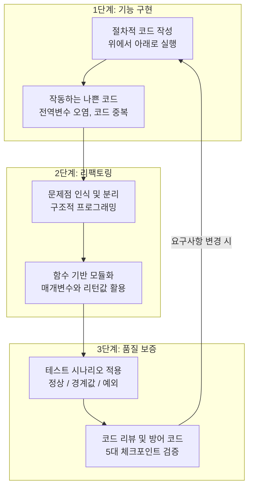

# 마이크로 세션: 081 — Day 4 종합: 절차에서 구조로, 그리고 테스트까지

> **세션 ID**: MS-PY101-081  
> **소요 시간**: 20분  
> **난이도**: low  
> **청크 타입**: narrative  
> **버전**: v2.1 (7섹션 구조)

---

## §1. 개요

> **Day 4 | PM | 세션 081/085**

이 세션은 Day 4의 모든 학습 여정을 종합하고 갈무리하는 아주 중요한 시간입니다. 아침부터 시작된 "고객 관리 프로그램" 개발의 전 과정을 되돌아보며, 절차적 코드에서 출발해 구조적 코드로 리팩토링하고, 마지막으로 테스트와 코드 리뷰를 통해 품질을 검증하는 '소프트웨어 라이프사이클'의 전체 그림을 수강생들의 머릿속에 확실하게 새겨주는 역할을 합니다.

### 🎯 학습 목표

이 세션이 끝나면 수강생은 다음을 할 수 있어요:
- Day 4에서 학습한 소프트웨어 개발 3단계(기능 구현 → 리팩토링 → 테스트/리뷰)를 자신의 언어로 요약할 수 있습니다.
- "작동하는 나쁜 코드"의 위험성을 깨닫고, 함수 기반 모듈화의 필요성을 설명할 수 있습니다.
- 시니어 개발자의 깐깐한 시선을 갖추고, 코드를 단순히 작성하는 것을 넘어 품질을 검증하는 마인드셋을 가질 수 있습니다.

### 선행 세션 환기

수강생들은 세션 080에서 AI를 활용해 시니어 개발자의 관점으로 코드 리뷰를 수행하고 수정 코멘트를 작성하는 실습을 마쳤습니다. 이제 파편화되어 있던 오늘 하루의 모든 경험(절차적 작성, 리팩토링, 예외 처리, 테스트)을 하나의 거대한 서사로 엮어낼 차례입니다.

---

## §2. 핵심 개념 (+ 🗣️ 강사 대본 + Mermaid)

### 비유 — 텐트 치기, 벽돌집 짓기, 그리고 입주 전 하자 보수

소프트웨어 개발의 전체 라이프사이클을 가장 직관적으로 이해할 수 있는 비유는 바로 '건축'입니다. 

1. **절차적 코드 작성 (텐트 치기)**: 일단 굴러가게 만드는 단계입니다. 비바람만 피하면 되듯 텐트는 빠르게 칠 수 있지만, 외부 충격에 매우 취약합니다.
2. **구조적 리팩토링 (벽돌집 짓기)**: 함수라는 튼튼한 벽돌로 공간(역할)을 나눕니다. 거실이 고장 나도 주방은 무사한 것처럼, 유지보수와 확장이 쉬워집니다.
3. **테스트 및 코드 리뷰 (입주 전 하자 보수)**: 창문이 태풍을 견디는지(경계값 테스트), 수도관이 막히지 않는지(예외 테스트) 점검하고 방어 코드를 추가하는 단계입니다.

🗣️ **강사 대본 (Instructor Script)**:

> 여러분, 정말 고생 많으셨습니다. Day 4의 험난하고도 아름다운 여정이 마무리되는 순간이에요. 오늘 하루 동안 여러분은 파이썬이라는 도구를 활용해 엄청난 성장을 이루어냈습니다. 아침에 처음 자리에 앉으셨을 때를 떠올려 볼까요?
>
> 우리는 그저 위에서 아래로 순서대로 실행되기만 하는, 아주 투박하고 불안정한 '절차적' 코드로 고객 관리 프로그램을 만들었습니다. 하지만 지금 여러분의 모니터에 띄워져 있는 코드는 어떤가요? 각각의 기능이 C, R, U, D 함수로 깔끔하게 모듈화되어 있고, 어떤 이상한 데이터가 들어와도 절대 죽지 않는 무적의 예외 처리 로직이 든든하게 감싸고 있습니다.
>
> 오늘 우리가 거쳐온 3단계를 건축에 비유해 볼게요. 첫 번째 단계는 **'텐트 치기'**였습니다. 우리가 처음 만들었던 `while` 문 하나에 모든 로직이 다 때려 박힌 절차적 코드가 바로 이 텐트였죠. 두 번째 단계는 **'벽돌집 짓기'**였습니다. 텐트에서는 평생 살 수 없으니, 기능을 독립된 함수로 분리하여 튼튼하게 구조를 올렸습니다. 마지막 세 번째 단계는 **'입주 전 하자 보수'**였습니다. 이상한 값을 입력해 보며 테스트를 하고, 시니어 개발자의 시선으로 리뷰 코멘트를 달아 예외 처리를 완벽하게 마쳤습니다.
>
> 오늘은 단순히 코딩 스킬을 배운 날이 아니에요. 현업 개발자들이 매일같이 반복하는 '소프트웨어 라이프사이클' 전체를 아주 압축적으로 경험한 위대한 하루였습니다.

### Mermaid 다이어그램: Day 4 학습 흐름 총정리



이 다이어그램은 한 번 하고 끝나는 것이 아니라, 새로운 기능을 추가할 때마다 구현, 리팩토링, 테스트라는 수레바퀴를 계속해서 굴려야 한다는 것을 보여줍니다.

---

## §3. 상세 내용

### Why — 왜 전체 흐름을 되돌아봐야 하는가?

초보자들은 코드가 에러 없이 한 번 실행되면 "다 만들었다!"라고 착각하기 쉽습니다. 하지만 실무에서는 코드를 작성하는 시간보다 유지보수하고 테스트하는 시간이 훨씬 더 깁니다. 오늘 하루 동안 겪었던 '수정의 고통(절차적)'과 '해방감(구조적)', 그리고 '부수는 쾌감(테스트)'을 하나로 연결해 주어야만, 수강생들이 앞으로 AI가 짜준 코드를 맹신하지 않고 비판적으로 검증할 수 있는 아키텍트로 성장할 수 있습니다.

### What — 무엇을 강조해야 하는가?

1. **기능 구현 (Implementation)**: 처음엔 요구사항에 맞춰 일단 돌아가게 만드는 것이 목표입니다. 정상 케이스(Happy Path)를 통과하는 것이 최우선 과제입니다.
2. **리팩토링 (Refactoring)**: 동작을 확인한 후, PEP 8 컨벤션을 지키며 내부 구조를 아름답게 가꾸는 과정입니다. 외부 동작은 변하지 않아야 합니다.
3. **품질 보증 (QA) 및 코드 리뷰**: 완성된 코드를 의심하고 집요하게 공격하여 시스템의 허점을 메우는 방어적 프로그래밍 단계입니다.

### How — 구체적으로 어떻게 진행하는가?

🗣️ **강사 대본 (Instructor Script)**:

> 자, 화면을 보실 필요도 없습니다. 편하게 눈을 감고 여러분이 오늘 작성한 코드의 변화를 머릿속으로 그려보세요. 아침에는 몇 줄 안 되는 허술한 코드였죠? 하지만 지금은 기능별로 함수가 예쁘게 나뉘어 있고, 사용자가 나이 입력 칸에 '스무살'이라고 문자를 입력하는 기상천외한 짓을 해도 `try-except`가 든든하게 막아주며 "숫자로 입력해주세요"라고 친절하게 안내합니다.
>
> 특히 코드 작성만큼이나 '테스트와 리뷰'가 중요하다는 사실을 온몸으로 깨달으셨을 거예요. 초보자는 어떻게든 코드가 에러 없이 한 번 돌아가게 만드는 것에 집착합니다. 하지만 시니어 개발자는 다릅니다. **"이 코드가 과연 언제 무너질 것인가?"**를 치열하게 고민합니다.
>
> 오늘 우리는 시니어 개발자의 깐깐함과 AI의 압도적인 생산성을 결합하는 방법을 완벽하게 마스터했습니다. 코드 작성의 고통은 AI에게 넘기고, 우리는 아키텍처를 고민하고 품질을 검증하는 진정한 의미의 'AI-native 개발자'로 거듭난 것입니다.

---

## §4. 실습 가이드 (+ 🎙️ 실습 대본) — 해당 시

### 실습 목표

수강생들이 오늘 배운 핵심 개념을 자신의 언어로 소화하고, 다음 세션부터 진행될 '미니 프로젝트'를 위한 심리적 준비를 마칩니다.

🎙️ **실습 가이드 대본 (Lab Guide)**:

> 이제 제가 앞에서 이끌어드리는 시간은 모두 끝났습니다! 기능 구현부터 리팩토링, 그리고 테스트와 리뷰까지... 모든 무기를 여러분의 손에 쥐여 드렸어요. 
> 
> 지금부터 3분 드릴 텐데요. 오늘 배운 개발의 3단계 수레바퀴를 떠올리며, 오늘 하루 가장 인상 깊었던 깨달음 한 줄을 노트에 적어보세요. 그리고 옆 사람과 공유해 보겠습니다. 
>
> (3분 후) 네, 좋습니다. "GOTO문 같은 엉킨 코드를 함수로 예쁘게 서랍장에 정리하는 기분이었다", "AI가 짠 코드도 완벽하지 않아서 내가 검사관이 되어야 한다는 걸 배웠다" 같은 훌륭한 회고들이 나왔습니다.

### 단계별 지시

| 단계 | 소요 시간 | 강사 지시사항 | 학습자 액션 | 예상 결과 |
|------|----------|--------------|------------|----------|
| 1 | 2분 | 오늘 배운 3단계 요약 브리핑 | 경청 및 내용 상기 | 라이프사이클 전체 흐름 이해 |
| 2 | 3분 | 가장 인상 깊은 깨달음 한 줄 작성 지시 | 노트에 1줄 회고 작성 | 배운 내용의 내재화 |
| 3 | 5분 | 짝꿍과 회고 내용 공유 및 발표 | 상호 공유 및 질의응답 | 성취감 고취 및 자신감 획득 |

---


### 🎓 강사 노트 (Instructor Support)

- ⏱️ **타이밍**: 16:45 (20분, narrative)
- 🎯 **핵심 활동**: 절차→구조→테스트 흐름
- ⚠️ **강사 주의사항**: 전체 여정 되짚기

## §5. 코드 및 명령어 모음 — 해당 시

> 💡 **강사 노트**: 본 세션은 narrative 기반의 총정리이므로 새로운 코드를 작성하지 않습니다. 화면에는 오늘 아침의 '절차적 코드'와 방금 완성한 '구조적 코드'를 나란히 띄워두고 시각적인 극적 대비를 보여주는 것이 좋습니다.

```python
# [Day 4 아침: 텐트 시절의 코드]
while True:
    menu = input("1.등록 2.조회: ")
    if menu == '1':
        name = input("이름: ")
        customers.append({"name": name}) # 데이터 파편화 위험, 예외 처리 전무
        
# -------------------------------------------------------------------

# [Day 4 오후: 벽돌집과 방어벽이 완성된 코드]
def create_customer(customers, name, phone):
    try:
        # 깐깐한 입력 검증 및 명시적 매개변수 활용
        if not name.strip():
            raise ValueError("이름은 비어있을 수 없습니다.")
        customers.append({"name": name, "phone": phone})
        return True
    except Exception as e:
        print(f"등록 실패: {e}")
        return False
```

---

## §6. 요약

### 핵심 학습 포인트

- **기능 구현 (텐트 치기)**: 코드가 절차적으로 엉켜있어도 일단 동작하게 만드는 1차 목표 달성.
- **리팩토링 (벽돌집 짓기)**: 전역 변수 오염과 코드 중복을 해결하기 위해 함수 단위로 모듈화하고 매개변수/리턴으로 명확한 데이터 흐름 구축.
- **품질 보증 (입주 전 하자 보수)**: 정상/경계값/예외 테스트 시나리오를 적용하고, 5대 체크포인트 기반의 코드 리뷰를 거쳐 튼튼한 방어 코드를 추가.

### 교안 원문

<details>
<summary>기존 세션 v1.0 원문 내용</summary>

# 세션 081 — Day 4 종합: 절차에서 구조로, 그리고 테스트까지

| 항목 | 내용 |
|------|------|
| **세션 ID** | MS-PY101-081 |
| **소요 시간** | 20분 |
| **난이도** | ★☆☆ |
| **청크 타입** | narrative |
| **선행 세션** | 세션-080 (필수) |
| **학습 목표** | Day 4에서 학습한 '절차적 코드 작성 → 구조적 리팩토링 → 테스트 및 코드 리뷰'의 전체 사이클을 3단계로 요약하여 설명할 수 있다 |
| **출처** | [A] 전체 8장, 9장 요약 · [C] Deep Research §1, 3, 4 |

---

## ① 도입 — "우리가 걸어온 험난하고도 아름다운 길을 돌아봅시다"

🗣️ 강사 대본 (Instructor Script):

여러분, 정말 고생 많으셨습니다. Day 4의 모든 여정이 마무리되는 순간입니다. 오늘 하루 동안 여러분은 파이썬이라는 도구를 활용해 엄청난 성장을 이루어냈습니다. 아침에 처음 자리에 앉으셨을 때를 떠올려 볼까요? 우리는 그저 위에서 아래로 순서대로 실행되기만 하는, 아주 투박하고 불안정한 '절차적' 코드로 고객 관리 프로그램을 만들었습니다. 하지만 지금 여러분의 모니터에 띄워져 있는 코드는 어떤가요? 각각의 기능이 함수로 깔끔하게 모듈화되어 있고, 어떤 이상한 데이터가 들어와도 절대 죽지 않는 무적의 예외 처리 로직이 감싸고 있습니다. 오늘은 단순히 코딩 스킬을 배운 날이 아닙니다. [A] 자료의 8장과 9장에서 강조하는, 현업 개발자들이 매일같이 반복하는 '소프트웨어 라이프사이클' 전체를 아주 압축적으로 경험한 하루였습니다. 

---

## ② 비유 — 텐트 치기, 벽돌집 짓기, 그리고 입주 전 하자 보수

🗣️ 강사 대본 (Instructor Script):

오늘 우리가 거쳐온 3단계를 건축에 비유해 보겠습니다. 

첫 번째 단계는 '절차적 코드 작성', 즉 '텐트 치기'였습니다. 캠핑을 가서 비바람만 피할 목적이라면 텐트가 최고입니다. 금방 칠 수 있고, 목적도 확실하죠. 우리가 처음 만들었던 `while` 문 하나에 모든 로직이 다 때려 박힌 코드가 바로 이 텐트였습니다. 당장 작동은 했지만, 누군가 옆구리를 발로 차면 텐트 전체가 무너지는 아주 불안정한 상태였죠. 작동하는 나쁜 코드의 전형이었습니다.

두 번째 단계는 '구조적 리팩토링', 즉 '벽돌집 짓기'였습니다. 텐트에서는 평생 살 수 없으니, 방과 거실과 주방의 역할을 나누어 콘크리트와 벽돌로 튼튼한 집을 올렸습니다. 거실의 TV가 고장 났다고 해서 주방의 가스레인지를 뜯어고칠 필요가 없는 것처럼, 우리는 등록, 조회, 수정, 삭제라는 기능을 각각 독립된 함수로 분리했습니다. 이것이 바로 함수 기반의 모듈화가 주는 엄청난 해방감이었습니다.

세 번째 단계는 '테스트 및 코드 리뷰', 즉 '입주 전 하자 보수'였습니다. 벽돌집을 다 지었다고 바로 들어가서 살면 큰일 납니다. 태풍이 와도 창문이 깨지지 않는지 경계값 테스트를 해보고, 수돗물 대신 흙탕물이 나오지 않는지 입력 검증을 했습니다. 그리고 명탐정의 보고서처럼 시니어 개발자의 시선으로 리뷰 코멘트를 작성하여, 하자가 발견된 곳을 완벽하게 보수(예외 처리)했습니다.

이렇게 텐트에서 시작해 튼튼한 벽돌집을 완성하고, 꼼꼼한 안전 점검까지 마치는 것이 바로 오늘 하루 우리가 걸어온 위대한 여정입니다. [C] 자료의 분석처럼, 이제 여러분은 더 이상 '코드를 타이핑하는 사람'이 아니라 '시스템을 설계하고 검증하는 아키텍트'의 시야를 갖추게 되었습니다.

---

## ③ 개념 — 소프트웨어 개발의 3단계 라이프사이클

🗣️ 강사 대본 (Instructor Script):

이 세 가지 비유를 실제 개발 용어로 다시 한번 정리해 보겠습니다. 

1단계는 '기능 구현(Implementation)'입니다. 일단 요구사항에 맞춰서 돌아가게 만드는 것이 최우선입니다. 코드가 좀 지저분해도, AI가 짜준 코드를 그대로 가져다 붙여도 괜찮습니다. 오류 없이 정상 케이스(Happy Path)를 통과하는 것이 첫 번째 목표입니다.

2단계는 '리팩토링(Refactoring)'입니다. 코드가 동작한다는 것을 확인했다면, 이제 코드를 읽기 쉽고 고치기 쉬운 구조로 개선해야 합니다. PEP 8 컨벤션을 지키고, 변수 이름을 명확하게 바꾸고, 중복되는 코드를 함수로 묶어내는 과정입니다. 기능은 그대로 유지하면서 내부 구조만 아름답게 가꾸는 것이 핵심입니다.

3단계는 '품질 보증(QA, Quality Assurance) 및 코드 리뷰'입니다. 완성된 코드를 의심의 눈초리로 바라보고 집요하게 공격합니다. 테스트 시나리오를 작성하여 빈값이나 이상한 문자를 넣어보고, 5대 체크포인트에 맞춰 약점을 찾아냅니다. 그리고 AI에게 리뷰 코멘트 3요소(위치, 문제점, 재현 방법)를 명확히 전달하여 방어 코드를 추가합니다.

이 사이클은 한 번 하고 끝나는 것이 아닙니다. 새로운 기능을 추가할 때마다 구현, 리팩토링, 테스트라는 수레바퀴를 계속해서 굴리는 것이죠. 이것이 바로 좋은 소프트웨어가 탄생하는 비밀입니다.

---

## ④ 🗣️ 강사 대본 — "나쁜 코드에서 훌륭한 프로그램으로"

🗣️ 강사 대본 (Instructor Script):

화면을 보실 필요도 없습니다. 여러분이 오늘 작성한 코드의 변화를 머릿속으로 그려보세요. 아침에는 몇 줄 안 되는 허술한 코드였지만, 지금은 어떤가요? 기능별로 함수가 예쁘게 나뉘어 있고, 사용자가 어떤 기상천외한 값을 입력하더라도 `try-except`와 `if` 문이 든든하게 막아주며 "올바른 값을 다시 입력해주세요"라고 친절하게 안내합니다. 

특히 코드 작성만큼이나 테스트와 리뷰가 중요하다는 사실을 깨달으셨을 것입니다. 초보자는 어떻게든 코드가 에러 없이 한 번 돌아가게 만드는 것에 집착하지만, 시니어 개발자는 '이 코드가 과연 언제 무너질 것인가'를 고민합니다. 오늘 우리는 시니어 개발자의 깐깐함과 AI의 빠른 생산성을 결합하는 방법을 완벽하게 마스터했습니다. 코드 작성의 고통은 AI에게 넘기고, 우리는 아키텍처를 고민하고 품질을 검증하는 진정한 의미의 'AI-native 개발자'로 거듭난 것입니다.

---

## ⑤ 정리 — "이제 여러분의 시간입니다"

🗣️ 강사 대본 (Instructor Script):

자, 이제 제가 앞에서 이끌어주는 시간은 모두 끝났습니다. 기능 구현부터 리팩토링, 그리고 테스트와 리뷰까지 모든 무기를 여러분의 손에 쥐여 드렸습니다. 다음 날부터는 여러분 스스로 사장님이자 시니어 개발자가 되어, 백지상태에서 새로운 프로젝트를 기획하고 AI와 함께 처음부터 끝까지 완성해 보는 실습을 진행할 것입니다. 오늘 배운 3단계 수레바퀴를 절대 잊지 마시기 바랍니다. 고생하셨습니다!

> **체크포인트**: "Day 4에서 학습한 개발의 3단계는 기능이 동작하게 만드는 '기능 구현', 코드를 구조적으로 개선하는 '이것', 그리고 시스템의 허점을 찾는 '테스트 및 코드 리뷰'입니다. 이 빈칸에 들어갈 말은 무엇일까요?" — 리팩토링(Refactoring)입니다!

</details>

### 다음 세션 예고

다음 세션(082)부터는 오늘 배운 모든 과정을 스스로 체화해보는 "나만의 미니 프로젝트"가 시작됩니다. 스스로 사장님이 되어 도서 관리, 영화 예매 등 자유로운 주제로 기획부터 완성까지 직접 달려볼 예정입니다. 그리고 내일, Day 5에서는 함수라는 벽돌집을 넘어, 진정한 객체지향(OOP)과 의존성 주입(DI)이라는 거대한 빌딩을 짓는 방법으로 진화할 것입니다.

---

## §7. 참고 자료

### 3-Source 출처

- **Source A (로컬 참고자료)**: [A] 전체 8장, 9장 요약 — 소프트웨어 개발 라이프사이클의 기초 개념.
- **Source B (NotebookLM)**: NotebookLM (§8) — 코드 리뷰와 구조적 리팩토링의 멘탈 모델 분석.
- **Source C (Deep Research)**: Deep Research (§1, 3, 4) — AI-native 개발 시대의 테스트 주도 및 리뷰 주도 개발 트렌드 반영.

### 추가 학습 자료

- [AI 시대의 서사 v3](../참고자료/AI_시대의_서사_v3_Claude.md): 프로그래밍 패러다임의 진화 복습
- PEP 8 스타일 가이드 요약본

### 강사 노트

> 💡 **강사 노트**: Day 4의 피로도가 가장 높은 시점입니다. 이론을 길게 설명하기보다는, 오늘 아침 수강생 본인이 직접 작성했던 '엉망진창 코드'를 회상하게 만들어 실질적인 성취감을 극대화해주세요. 다음 세션부터 시작될 미니 프로젝트에 대한 기대감을 심어주는 것이 중요합니다.

---

## ✅ 세션 완료 체크리스트 (강사용)

- [ ] §1~§7 모든 섹션이 충실하게 작성되었는가?
- [ ] 개발의 3단계(기능 구현, 리팩토링, 품질 보증)가 직관적인 비유(건축)와 함께 설명되었는가?
- [ ] 절차적 코드와 구조적 코드의 시각적 대조가 이루어졌는가?
- [ ] Day 5(객체지향)로 넘어가는 자연스러운 브릿지가 포함되었는가?
- [ ] 원문(v1.0)의 핵심 내용이 빠짐없이 교안 내에 보존 및 재배치되었는가?

---

*작성 일시: 2026-02-25*  
*작성 에이전트: Sisyphus-Junior*  
*교안 구조: 7섹션 (A0 팀 공통 표준)*