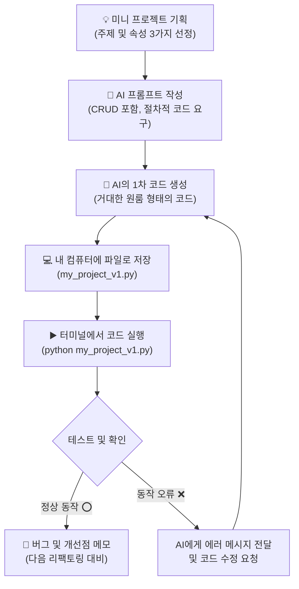

# 마이크로 세션: 082 — 나만의 미니 프로젝트: 기획 및 절차적 코드 생성

> **세션 ID**: MS-PY101-082  
> **소요 시간**: 20분  
> **난이도**: medium  
> **청크 타입**: lab  
> **버전**: v2.1 (7섹션 구조)

---

## §1. 개요

> **Day 4 | PM | 세션 082/085**

### 🎯 학습 목표

이 세션이 끝나면, 수강생은 다음을 할 수 있습니다:

- 자유 주제를 선정하여 관리할 데이터 속성을 명확히 기획할 수 있다.
- 기획한 내용을 바탕으로 CRUD 기능이 모두 포함된 1차 절차적 코드 생성을 AI에게 지시할 수 있다.
- 생성된 파이썬 코드를 로컬 환경에서 실행하고, 의도대로 프로그램이 동작하는지 테스트할 수 있다.

### 선행 세션 환기

지금까지 우리는 이미 짜인 코드를 읽고, 누군가 만들어둔 에러를 수정하고, 작은 부품들을 조립하는 훈련을 반복해 왔습니다. 마치 요리 교실에서 강사가 정량으로 썰어둔 재료를 레시피대로 볶아보는 과정과 같았죠. 하지만 이제는 다릅니다. 여러분의 책상 앞에는 어떤 코드의 흔적도 없는 완벽하게 새하얀 캔버스가 놓여 있습니다. 오늘부터는 여러분의 머릿속에 있는 아이디어, 혹은 업무 중 정말로 필요했던 그 프로그램을 세상에 단 하나뿐인 나만의 코드로 끄집어내는 경이로운 경험을 시작합니다. 완벽할 필요는 전혀 없습니다. 든든한 짝꿍인 AI 비서가 바로 옆에 있으니, 이제 두려움을 떨치고 창조자로서의 첫걸음을 떼어 볼 차례입니다.

---

## §2. 핵심 개념 (+ 🗣️ 강사 대본 + Mermaid)

### 비유: 나만의 도미노 세트 만들기

프로그램을 기획하고 처음으로 뼈대를 세우는 과정은, 텅 빈 체육관 바닥에 나만의 도미노 세트를 설계하고 세우는 것과 같습니다. 지금까지 실습한 코드들은 이미 누군가 정교하게 세워둔 도미노 사이에서 이가 빠진 부분을 채우거나 툭 쳐서 잘 쓰러지는지 구경하는 수준이었죠. 하지만 이제 여러분은 그 텅 빈 체육관 한가운데에 홀로 서 있습니다. 어떤 모양으로 그릴지, 무슨 색깔의 도미노 블록을 쓸지는 온전히 여러분의 결정에 달려 있습니다.

과거에는 수천 개의 블록을 밤새워가며 하나하나 핀셋으로 세워야 했습니다. 손이 조금만 떨려도 와르르 무너지는 고통스러운 과정이었죠. 하지만 AI 네이티브 시대에는 다릅니다. 여러분은 더 이상 단순 노동자가 아니라 조감도를 그리는 총괄 건축가입니다. "책 제목, 저자, 출판 연도라는 세 가지 색상의 블록으로 네 갈래 길을 만들어줘"라고 청사진만 명확히 제시하면, AI가 단 몇 초 만에 오차 없이 블록을 쫙 깔아줍니다. 처음 세워진 세트가 완벽하지 않더라도, 그 투박한 첫 번째 구조물을 만들어내는 짜릿함이 바로 이번 프로젝트의 핵심입니다.

🗣️ **강사 대본 (Instructor Script)**:

> 여러분, 이제 진짜 여러분만의 프로그램을 만들 시간입니다. 평소에 엑셀로 불편하게 관리하던 동호회 회원 명부도 좋고, 나만의 맛집 리스트 관리 프로그램도 좋습니다. 여러분의 상상력이 명확한 지시어가 되고, 그 지시어가 거대한 도미노 세트로 번역되는 짜릿한 마법을 확인해 보세요.
> 
> 처음부터 완벽하고 세련된 코드를 요구하지 마세요. 오늘 우리가 AI에게 부탁할 코드는, 모든 기능이 하나의 거대한 덩어리로 뭉쳐있는 '절차적 코드'입니다. 마치 화장실, 주방, 침실이 벽 하나 없이 통으로 뚫려있는 거대한 원룸과 같죠. 일단 기능이 돌아가는 그 원룸을 먼저 만들어보는 것이 가장 중요합니다.

### Mermaid 다이어그램



---

## §3. 상세 내용

### Why — 왜 백지에서 시작해보아야 하는가?

강사가 제공한 예제 코드는 항상 안전하게 잘 다듬어져 있습니다. 하지만 실무에서는 아무도 뼈대를 먼저 만들어주지 않습니다. 머릿속의 막연한 아이디어를 구체적인 글로 적어내고, 그것을 AI가 이해할 수 있는 명령어로 바꾸는 연습을 하지 않으면 평생 남의 코드만 고치는 수준에 머물게 됩니다. 스스로 기획하고 처음부터 끝까지 만들어보는 경험이야말로 진정한 소프트웨어 개발의 시작입니다.

### What — 미니 프로젝트의 핵심, CRUD

우리가 만들 미니 프로젝트의 핵심은 결국 데이터를 만들고(Create), 읽고(Read), 수정하고(Update), 삭제하는(Delete) 네 가지 동작, 즉 CRUD입니다. 도서 관리, 재고 관리, 주소록 관리, 심지어 유튜브의 댓글 시스템조차도 본질적으로는 이 CRUD의 무한한 반복에 불과합니다. 

이 프로젝트를 기획할 때 가장 먼저 할 일은, 내가 관리할 데이터의 '속성'을 명확히 정의하는 것입니다. 책이라면 '제목, 저자, 가격'이 될 것이고, 재고라면 '상품명, 수량, 입고일'이 되겠죠. 이 세 가지 속성만 명확히 정해주면 AI는 뼈대를 쉽게 잡아냅니다.

### How — 투박한 1차 절차적 프로토타입의 탄생

AI에게 첫 코드를 요구할 때, 복잡한 아키텍처나 함수 분리를 요구하지 마세요. 오직 위에서 아래로 물 흐르듯 순차적으로 실행되는 절차적 형태의 코드를 요구해야 합니다. 

[C] Deep Research 문서의 6.1 항목에서도 강조하듯, 복잡한 문제를 해결할 때는 요구사항을 단순화하여 1차 프로토타입을 눈으로 먼저 확인하는 것이 핵심입니다. AI가 뱉어낸 1차 코드를 보면 커다란 무한 반복문(while) 안에 수많은 조건문(if)들이 꽉 들어찬 투박한 모습일 것입니다. 이 완벽하게 돌아가는 투박한 코드야말로, 여러분이 앞으로 리팩토링을 통해 쌓아 올릴 튼튼한 주춧돌입니다.

> ✅ **체크포인트**: 데이터의 생성, 읽기, 수정, 삭제를 아울러서 개발자들이 흔히 부르는 4글자 약어는 무엇인가요? (정답: CRUD)

---

## §4. 실습 가이드 (+ 🎙️ 실습 대본)

### 실습 목표

수강생은 자유 주제를 선정해 데이터의 속성을 기획하고, AI 비서에게 명확한 프롬프트를 전달하여 CRUD가 모두 포함된 1차 절차적 파이썬 코드를 생성 및 실행해봅니다.

🎙️ **실습 가이드 대본 (Lab Guide)**:

> 자, 이제 여러분의 아이디어를 직접 코드로 탄생시킬 시간입니다. 주제는 무엇이든 좋습니다. 사내 도서 관리 프로그램, 카페 재고 관리 프로그램, 나만의 맛집 리스트 다 좋습니다. 
> 
> 오른쪽 AI Agent 창을 열어주세요. 검색 엔진은 필요 없습니다. 메모장에 기획안을 간단히 적고, AI에게 말을 걸어보겠습니다. 오늘 우리가 뽑아낼 코드는 예쁘고 세련된 코드가 아닙니다. 모든 기능이 한 덩어리에 들어있는 '원룸' 형태의 절차적 코드라는 점을 명심하세요. 천천히 단계별 지시를 따라와 주시기 바랍니다.

### 단계별 지시

| 단계 | 소요 시간 | 강사 지시사항 | 학습자 액션 | 예상 결과 |
|------|----------|--------------|------------|----------|
| 1 | 5분 | "만들고 싶은 프로그램의 주제와 속성 3가지를 적어보세요" | 주제 선정 및 데이터 속성(예: 책 제목, 저자, 반납일) 3가지 메모 | 명확한 1차 기획안 도출 |
| 2 | 5분 | "AI에게 CRUD가 포함된 절차적 코드를 요구하세요" | Agent Manager에 프롬프트 입력 (하단 예시 참고) | AI가 1차 절차적 파이썬 코드 생성 |
| 3 | 5분 | "코드를 파일로 저장하고 직접 실행해 보세요" | `my_project_v1.py` 파일 생성 → 코드 복붙 → 터미널 실행 | 1~4번 메뉴가 포함된 프로그램 정상 실행 |
| 4 | 5분 | "직접 메뉴를 눌러보며 버그나 개선점을 메모하세요" | 프로그램 조작 및 버그 메모 (예: "없는 데이터를 지우려니 에러가 남") | 2차 수정을 위한 개선점 리스트 확보 |

**[단계 1] 주제 및 속성 기획**

빈 메모장에 다음과 같이 3줄로 기획안을 적어봅니다.
- 프로그램 이름: 사내 도서 관리 시스템
- 주요 기능: 도서 정보의 CRUD (추가, 조회, 수정, 삭제)
- 데이터 속성: 책 제목, 대출자 이름, 반납 예정일

**[단계 2] AI 프롬프트 작성 및 전송**

Antigravity IDE 우측의 Agent 창에 아래의 프롬프트 양식을 참고하여 입력합니다.

```text
파이썬으로 사내 도서 관리 프로그램을 만들어줘. 
데이터는 '책 제목', '대출자 이름', '반납 예정일' 3가지를 딕셔너리로 관리해줘. 
이 데이터들을 리스트에 저장하고, 추가/조회/수정/삭제(CRUD) 기능이 모두 들어있는 
하나의 파일짜리 절차적 코드(while 루프 1개 안에 모든 if문이 들어간 형태)로 작성해줘. 
함수를 쓰지 말고 투박하게 만들어줘.
```

**[단계 3] 코드 저장 및 터미널 실행**

AI가 생성해준 코드를 복사합니다. IDE 왼쪽 파일 탐색기에서 `my_project_v1.py`라는 새 파일을 만들고 코드를 붙여넣습니다. 
터미널 창을 열고 아래 명령어로 실행해 봅니다.
`python my_project_v1.py`

**[단계 4] 버그 및 개선점 메모**

화면에 뜬 1번 메뉴를 눌러 데이터를 추가해보고, 2번을 눌러 조회해 보세요. 프로그램이 내 의도대로 완벽하게 작동하는지, 혹시 예상치 못한 에러가 발생하거나 메뉴 화면이 예쁘지 않은지 관찰하여 메모합니다. "삭제 메뉴에서 없는 책을 입력하니까 프로그램이 꺼져버리네? 이 부분을 다음 시간에 고쳐야겠다"와 같이 기록해둡니다.

### 트러블슈팅 FAQ

| Q | A |
|---|---|
| AI가 함수를 사용해서 너무 세련되게 짜줬어요. 어떻게 하죠? | AI가 똑똑해서 미리 코드를 구조화(함수)한 것입니다. "함수(def)를 전부 없애고 하나의 거대한 while 루프 안에 절차적으로 몰아넣어줘"라고 다시 요청해 보세요. 지금은 일부러 나쁜 코드를 만들어보는 단계입니다. |
| 코드를 붙여넣었는데 한글이 깨져서 나옵니다. | 터미널 인코딩 문제일 수 있습니다. AI에게 "한글이 깨지는데 코드 상단에 어떤 설정을 추가해야 해?"라고 물어보세요. 보통 `# -*- coding: utf-8 -*-`을 추가하면 해결됩니다. |
| 프로그램이 갑자기 멈췄습니다. (무한루프) | 터미널 창을 클릭하고 `Ctrl + C` 키를 누르면 강제로 프로그램을 종료할 수 있습니다. 무한 루프에 빠진 경우 AI에게 에러 상황을 말하고 코드를 수정받으세요. |

> ✅ **체크포인트**: 터미널에서 여러분의 미니 프로젝트가 돌아가고 있나요? 데이터를 하나라도 등록해본 분들은 손을 들어주세요!

---


### 🎓 강사 노트 (Instructor Support)

- ⏱️ **타이밍**: 17:05 (20분, lab)
- 🎯 **핵심 활동**: 자유 주제 v1 코드 생성
- ⚠️ **강사 주의사항**: 주제 재활용 가능


### 📋 실습 설계 보강 (Lab Packet)

**세션 082 실습 설계 보강**

나만의 미니 프로젝트: 기획+절차적 코드 생성
- **3-Stage Example Set**
  - 기본: 자유 주제 선정(도서관, 레시피북 등) → CRUD 기능 포함 프롬프트 → 1차 절차적 코드 생성
  - 변형: Day 2 미니 스펙 프로젝트 주제를 이어서 확장
  - 실수 해결: "주제를 정했는데 CRUD로 안 맞아요" → 모든 데이터 관리 프로그램은 CRUD 구조
- **난이도 예측**: 자유 주제+CRUD 결합이 처음이라 막막함
- **타이밍 가이드**: 주제·기획 5분 | 프롬프트 작성 5분 | 코드 생성·실행 7분 | 정리 3분
- **심리적 장벽**: "시간이 20분밖에 없는데 이게 가능해?"
- **자가 점검**:
  - [ ] CRUD 4가지 기능이 포함된 v1 코드가 실행되는가?
  - [ ] 코드를 `my_project_v1.py`로 저장했는가?
  - [ ] 최소 1회 등록→조회 사이클을 테스트했는가?

## §5. 코드 및 명령어 모음

### 파이썬 실행 명령어

```bash
# 내가 만든 1차 프로젝트 실행
python my_project_v1.py
```

### AI 프롬프트 예시 (1차 절차적 코드 템플릿)

```text
파이썬으로 [프로그램 주제] 관리 프로그램을 만들어줘. 
데이터는 [속성1], [속성2], [속성3] 3가지를 딕셔너리로 관리하고 리스트에 담아줘.
추가, 조회, 수정, 삭제(CRUD) 메뉴가 루프를 돌면서 실행되는 하나의 거대한 
절차적 코드(while-if 구조)로 작성해줘. 절대로 함수(def)를 쓰지 마.
```

---

## §6. 요약

### 핵심 학습 포인트

스스로 첫 코드를 뽑아낸 것을 진심으로 축하합니다! 오늘 우리는 텅 빈 체육관에 나만의 도미노를 설계했습니다. 관리할 데이터의 속성을 기획하고, AI에게 CRUD 기능을 명확하게 요구하여 작동하는 파이썬 코드를 얻어냈습니다. 하지만 생성된 코드를 자세히 들여다보면, 모든 기능이 하나의 거대한 무한 반복문 안에 길게 늘어져 있습니다. 마치 화장실, 주방, 침실이 벽 하나 없이 통으로 뚫려있는 거대한 원룸과 같습니다. 지금 당장 혼자 쓰기엔 작동에 무리가 없지만, 여기서 기능이 조금만 더 늘어나면 코드는 금세 통제할 수 없는 난장판이 될 것입니다. 

### 다음 세션 예고

다음 세션(083)에서는 여러분이 방금 만든 이 거대한 원룸 코드를 깔끔한 투룸, 쓰리룸으로 쪼개는 본격적인 인테리어 공사, 즉 '구조적 리팩토링'에 돌입하겠습니다.

### 브릿지 노트

> "여러분의 화면에서 깜빡이는 그 프로그램이 바로 여러분이 기획하고 AI의 손을 빌려 탄생시킨 첫 번째 자식입니다. 어떠신가요? 돌아가긴 하는데, 코드가 좀 징그럽게 길지 않나요? 다음 시간에는 AI에게 명령을 내려서, 이 투박하고 긴 코드를 깔끔하고 세련된 함수 구조로 싹 뜯어고쳐 보겠습니다. 기대하셔도 좋습니다!"

---

## §7. 참고 자료

### 3-Source 출처

- **Source A (로컬 참고자료)**: [A] 8 코딩.pdf (§8.13) — 미니 프로젝트 플로우, 절차적 코드 생성 원리.
- **Source B (NotebookLM)**: -
- **Source C (Deep Research)**: [C] Deep Research (§6.1, 6.2) — 요구사항 단순화 및 1차 프로토타입 생성, 절차적에서 구조적으로 넘어가는 실습 가이드.

### 강사 노트

> 💡 **강사 노트**: 수강생들이 처음부터 완벽한 프로그램을 기획하려다 시간을 지체할 수 있습니다. "속성 3개만 잡으면 충분하다"며 진도를 끌어올려 주세요. 또한 최근 AI 모델(Claude, Gemini 등)은 워낙 똑똑해서 '절차적으로 짜줘'라고 해도 알아서 함수(def)로 예쁘게 나눠서 짜주는 경우가 많습니다. 이때 당황하지 마시고, 실습 가이드의 FAQ에 있듯 "함수 쓰지 말고 무식하게 하나의 루프에 다 넣어줘"라고 재지시하도록 안내하는 것이 이 세션의 킬링 포인트입니다. 이 '나쁜 코드'를 경험해야 다음 세션의 '리팩토링' 효과가 극대화됩니다.

---

## ✅ 세션 완료 체크리스트 (강사용)

- [ ] §1~§7 모든 섹션이 충실하게 작성되었는가?
- [ ] 도미노 비유와 원룸 비유가 §2에 명확하게 배치되었는가?
- [ ] lab 타입에 맞춰 §4 실습 가이드가 단계별로 상세히 제공되었는가?
- [ ] 함수를 쓰지 않는 '절차적 형태'의 코드를 강조하는 팁이 포함되었는가?
- [ ] 체크포인트 질문과 트러블슈팅 FAQ가 적절히 배치되었는가?
- [ ] 3-Source 팩트 패킷의 내용이 반영되었는가?
- [ ] 다음 세션(083 구조적 리팩토링) 브릿지 노트가 포함되었는가?

---

**🔗 선행 세션**: [세션-081] Day 4 종합: 절차에서 구조로, 그리고 테스트까지 (필수)  
**🔗 후행 세션**: [세션-083] 미니 프로젝트: 구조적 리팩토링 및 퀄리티 체크

---

*작성 일시: 2026-02-25*  
*작성 에이전트: A4B_Session_Writer*  
*교안 구조: 7섹션 (A0 팀 공통 표준)*