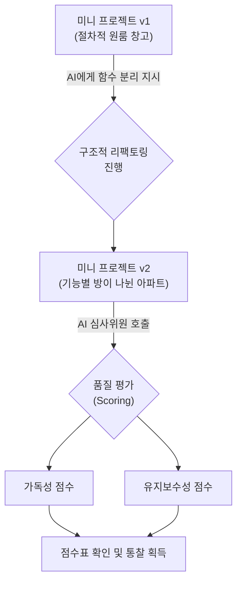

# 세션 083 — 미니 프로젝트: 구조적 리팩토링 및 퀄리티 체크

> **세션 ID**: MS-PY101-083  
> **소요 시간**: 20분  
> **난이도**: ★★★  
> **청크 타입**: lab  
> **버전**: v2.1 (7섹션 구조)

---

## §1. 개요

> **Day 4 | PM | 세션 083/085**

### 🎯 학습 목표
- 자신의 미니 프로젝트 코드를 기능 단위의 함수로 분리하는 구조적 리팩토링을 수행할 수 있다.
- AI에게 절차적 코드(v1)와 구조적 코드(v2)의 품질 평가(가독성, 유지보수성 등)를 요구하여 개선 효과를 정량적으로 확인할 수 있다.
- 전역 변수를 파라미터와 리턴값으로 대체하여 데이터 흐름을 명시적으로 만들 수 있다.

### 선행 세션 환기
바로 직전 세션(082)에서 우리는 백지상태에서 출발해 나만의 아이디어가 담긴 첫 번째 파이썬 프로그램(v1)을 성공적으로 탄생시켰습니다. 터미널 창에서 여러분이 지시한 대로 데이터가 입력되고 출력되는 모습을 보며 묘한 성취감을 느끼셨을 거예요. 하지만 개발자의 세계에서 코드가 '일단 돌아간다'는 것은 완성의 의미가 아니라, 이제 막 진짜 작업이 시작되었다는 출발 신호와 같습니다. 기능이 작동하는 것은 확인했으니, 이제 내부 구조를 튼튼하게 다질 시간입니다.

---

## §2. 핵심 개념 (+ 🗣️ 강사 대본 + Mermaid)

### 비유: 원룸 창고 인테리어와 오디션 심사위원
코드를 다듬는 과정을 우리는 흔히 '리팩토링(Refactoring)'이라고 부릅니다. 리팩토링을 이해하기 위해 거대한 벽도, 방문도 없는 넓은 원룸 창고를 떠올려보세요. 이곳에 냉장고, 침대, 책상, 세탁기를 마구잡이로 구겨 넣어두었습니다. 물론 이 창고에서도 잠을 자고 요리를 할 수는 있습니다. 하지만 양말 하나를 찾으려면 창고 전체를 뒤집어엎어야 하고, 새로운 가구를 들여놓으려면 어디에 둬야 할지 막막해집니다. 구조적 리팩토링은 바로 이 원룸 창고에 가벽을 세우고, 주방, 침실, 세탁실이라는 명확한 공간 표시를 달아주는 작업입니다. 겉보기엔 똑같은 집(기능)이지만, 구조가 완벽하게 분리되는 것이죠.

그런데 우리가 가벽을 잘 세웠는지, 인테리어가 정말 효율적으로 개선되었는지는 어떻게 알 수 있을까요? 이럴 때 우리는 AI를 아주 깐깐한 '오디션 심사위원'으로 활용할 수 있습니다. 경연 프로그램에서 심사위원들이 춤과 노래를 기술 점수, 예술 점수로 나누어 평가하듯, 우리는 AI에게 두 코드를 던져주고 명확한 잣대로 채점표를 요구할 수 있습니다.

🗣️ **강사 대본 (Instructor Script)**:
> 1차로 만든 코드가 마음에 안 드시죠? 뭔가 엉성하고, 코드가 길어지니까 읽기도 불편하고요. 지극히 정상입니다! 첫 번째 코드는 무조건 절차적으로 길게 늘어설 수밖에 없어요. 지금부터 우리는 모든 기능이 한곳에 엉켜있는 복잡한 코드를 깔끔하게 정돈하는 인테리어 공사에 돌입할 것입니다.
> 
> "어느 코드가 더 좋아?"라고 AI에게 단순히 묻지 마세요. "가독성과 유지보수성이라는 두 가지 명확한 기준으로 100점 만점에 각각 몇 점인지 채점표를 그려줘"라고 구체적으로 지시해야 합니다. AI는 깐깐한 심사위원으로 빙의하여, 원룸 형태의 첫 번째 코드에는 낙제점을, 기능별로 방이 나뉜 두 번째 코드에는 극찬을 쏟아낼 것입니다. 이 채점표를 확인하는 순간, 여러분은 왜 수많은 개발자가 밤을 새워가며 코드를 리팩토링하는지 깨닫게 되실 거예요.

### Mermaid 다이어그램



---

## §3. 상세 내용

### Why — 왜 리팩토링을 해야 하는가?
기존 코드에서는 무한 반복문 안에서 메뉴 1번을 누르면 추가하는 로직이, 2번을 누르면 조회하는 로직이 길게 이어져 있었습니다. 작동은 하지만, 나중에 '등급'이나 'VIP 여부' 같은 새로운 정보를 추가하려면 거대한 반복문 안을 헤집고 다녀야 합니다. 작은 수정이 예상치 못한 오류를 불러오는 '스파게티 코드'의 늪에 빠지게 되는 것이죠. 리팩토링은 이런 위험을 줄이고 코드를 레고 블록처럼 조립하기 쉽게 만들어줍니다.

### What — 리팩토링의 핵심은 '함수 추출'
절차적 코드를 구조적 코드로 리팩토링하는 가장 중요한 기술은 '함수 추출(Function Extraction)'입니다. 길쭉한 로직 덩어리들을 뭉텅 잘라내어 `add_data()`, `read_data()`, `update_data()`, `delete_data()`라는 이름을 가진 독립적인 함수 상자로 포장하는 과정입니다. 

이렇게 함수로 묶어두면 두 가지 마법이 일어납니다:
1. 메인 프로그램에서는 함수의 이름표만 불러오면 되기 때문에, 코드가 마치 책의 목차를 읽는 것처럼 한눈에 들어옵니다.
2. 전역 변수가 아닌 매개변수(입력)와 리턴값(출력)을 통해 데이터가 안전하게 흐르게 됩니다.

### How — AI를 활용한 정량적 평가
과거에는 개발자가 직접 코드를 오려내고 변수의 유효 범위(Scope)를 맞추느라 머리를 쥐어뜯었습니다. 하지만 이제 우리는 AI에게 단 한 줄의 프롬프트만 주면 됩니다. "이 코드를 기능별로 쪼개서 함수 기반으로 리팩토링해줘."

리팩토링 후에는 반드시 AI에게 두 코드를 비교해달라고 요청해야 합니다. 단순히 "잘했어"라는 칭찬을 듣기 위함이 아닙니다. **가독성(누가 봐도 이해하기 쉬운가?)**과 **유지보수성(나중에 기능을 추가하기 쉬운가?)**이라는 구체적인 지표로 v1과 v2를 비교 분석하게 만드세요. 수치화된 채점표를 눈으로 확인하면, 논리적인 프로그래머로서의 시야가 확 트일 것입니다.

> ✅ **체크포인트**: 
> - 외부 동작이나 기능은 바꾸지 않고 코드 내부 구조만 개선하는 작업을 무엇이라고 하나요? ("리팩토링")
> - 구조적 프로그래밍에서 긴 코드를 의미 있는 단위로 묶어주는 상자의 이름은 무엇인가요? ("함수")

---

## §4. 실습 가이드 (+ 🎙️ 실습 대본)

### 실습 목표
수강생은 AI의 도움을 받아 절차적으로 작성된 미니 프로젝트 v1 코드를 함수 기반의 v2 코드로 리팩토링하고, 두 코드 간의 품질 평가 점수표를 직접 도출합니다.

🎙️ **실습 가이드 대본 (Lab Guide)**:
> 자, 이제 여러분의 거대한 원룸 창고를 깔끔한 아파트로 개조해 보겠습니다. 앞서 만든 `my_project_v1.py` 코드를 화면에 띄워주세요. 이 코드를 AI에게 넘겨서 함수 기반으로 업그레이드하고, 마지막엔 오디션 심사위원의 냉혹한 평가까지 받아봅시다. 프롬프트는 제가 드리는 예시를 참고하되, 여러분 프로젝트 이름에 맞춰서 조금씩 수정하시면 됩니다.

### 단계별 지시 (리팩토링과 채점표 받기)

| 단계 | 소요 시간 | 강사 지시사항 | 학습자 액션 | 예상 결과 |
|------|----------|--------------|------------|----------|
| 1 | 5분 | "AI에게 v1 코드를 주고 리팩토링을 지시하세요" | AI 채팅창에 기존 코드 복사/붙여넣기 및 프롬프트 입력 | 함수로 분리된 새로운 코드 생성 |
| 2 | 5분 | "v2를 실행해 기능이 똑같은지 테스트하세요" | `my_project_v2.py`로 저장 후 실행, 데이터 등록/조회 테스트 | 겉모습과 기능은 v1과 100% 동일하게 작동 |
| 3 | 5분 | "AI에게 깐깐한 채점표를 요구하세요" | 점수 비교 프롬프트 입력 | v1 vs v2의 가독성, 유지보수성 점수표 출력 |
| 4 | 5분 | "채점표를 보고 개선된 이유를 정리해보세요" | AI의 피드백(스코프 분리, 중복 제거 등) 읽기 | 점수가 오른 본질적인 이유 이해 |

**[단계 1] 구조적 리팩토링 지시**
AI에게 기존 코드를 전달하며 기능별로 함수를 분리해달라고 요청합니다. 다음 프롬프트를 활용해 보세요:
```text
내가 만든 미니 프로젝트 v1 코드를 전달할게. 
(코드 복사/붙여넣기)
이 코드를 add_item(), read_item(), update_item(), delete_item() 등 
각각의 독립된 함수를 사용하는 구조로 리팩토링해줘. 
특히 전역 변수 사용을 줄이고 매개변수와 반환값을 활용하는 형태로 바꿔줘.
```

**[단계 2] v2 저장 및 무결성 테스트**
AI가 작성해준 코드를 복사하여 `my_project_v2.py`라는 새로운 파일로 저장합니다.
터미널에서 실행해보고 기존 v1과 기능이 완벽하게 똑같이 작동하는지 확인하세요. 리팩토링의 핵심은 "사용자가 보기엔 아무 변화가 없어야 한다"는 점입니다.

**[단계 3] 오디션 심사위원 호출 (채점표 요청)**
이제 AI에게 냉정한 평가를 부탁할 차례입니다:
```text
방금 네가 리팩토링해준 v2 코드와 내가 처음에 준 v1 코드를 비교해줘. 
'가독성'과 '유지보수성'이라는 두 가지 기준으로 각각 100점 만점에 
몇 점을 줄 수 있는지 표 형식의 채점표를 그려줘. 
그리고 왜 점수가 그렇게 차이 나는지 개발자의 관점에서 설명해줘.
```

**[단계 4] 피드백 분석**
AI가 제시한 표를 확인하세요. 분명 v1 코드는 40~50점대를, v2 코드는 80~90점대를 받았을 것입니다. 밑에 적힌 이유('변수의 스코프가 분리되었다', '함수 이름만으로 의도를 알 수 있다' 등)를 꼼꼼히 읽어보세요.

> ✅ **체크포인트**: 점수표에서 확인한 v2 코드의 가장 큰 장점 한 가지를 옆 사람(또는 강사)에게 설명해 볼까요?

---


### 🎓 강사 노트 (Instructor Support)

- ⏱️ **타이밍**: 17:25 (20분, lab)
- 🎯 **핵심 활동**: v1→v2 리팩토링
- ⚠️ **강사 주의사항**: 함수 분리 연습


### 📋 실습 설계 보강 (Lab Packet)

**세션 083 실습 설계 보강**

미니 프로젝트: 구조적 리팩토링+퀄리티 체크
- **3-Stage Example Set**
  - 기본: v1 → AI에게 "함수 기반 리팩토링" 요청 → v2 저장 → 동작 확인
  - 변형: AI에게 "v1과 v2를 가독성/유지보수성 기준으로 100점 만점 채점표 작성" 요청
  - 실수 해결: "v2가 동작하지 않아요" → 함수 호출부(main 루프) 누락 확인
- **난이도 예측**: ★★★ 리팩토링 + 품질 비교의 이중 과제
- **타이밍 가이드**: 리팩토링 지시 5분 | v2 테스트 5분 | AI 채점표 요청 5분 | 분석 5분
- **심리적 장벽**: "리팩토링이라는 게 감이 안 와요"
- **자가 점검**:
  - [ ] v2 코드에서 각 기능이 독립 함수로 분리되었는가?
  - [ ] v1과 v2의 AI 채점표 점수를 비교했는가?
  - [ ] v2가 v1과 동일한 기능을 수행하는지 테스트했는가?

## §5. 코드 및 명령어 모음

### 코드 비교: 리팩토링 전(v1) vs 후(v2)

**절차적 원룸 창고 (my_project_v1.py 발췌)**
```python
# 모든 로직이 거대한 while 루프 안에 뭉쳐 있음
while True:
    print("1. 추가  2. 조회")
    choice = input("선택: ")
    
    if choice == '1':
        name = input("이름: ")
        # 추가 로직이 길게 이어짐...
        data_list.append({"name": name})
        print("추가 완료")
    elif choice == '2':
        # 조회 로직이 길게 이어짐...
        for d in data_list:
            print(f"이름: {d['name']}")
```

**구조적 아파트 (my_project_v2.py 발췌)**
```python
# 기능이 함수라는 방으로 예쁘게 나뉨
def add_item(data_list):
    name = input("이름: ")
    data_list.append({"name": name})
    print("추가 완료")

def read_item(data_list):
    for d in data_list:
        print(f"이름: {d['name']}")

# 메인 루프는 마치 책의 목차처럼 간결해짐
while True:
    print("1. 추가  2. 조회")
    choice = input("선택: ")
    
    if choice == '1':
        add_item(data_list)
    elif choice == '2':
        read_item(data_list)
```

### 필수 프롬프트 예시
- 리팩토링 요청: `"이 코드를 독립된 함수 단위로 쪼개서 구조적으로 리팩토링해줘."`
- 정량적 평가 요청: `"v1과 v2를 가독성, 유지보수성 기준으로 100점 만점으로 평가해 채점표를 그려줘."`

---

## §6. 요약

### 핵심 학습 포인트
이번 세션에서 우리는 기능이 전부 뭉쳐있던 원룸 창고 코드를 함수 단위의 쾌적한 아파트로 리팩토링했습니다. 이 과정을 통해 코드가 목차처럼 읽히는 놀라운 경험을 하셨을 겁니다. 더불어 AI를 오디션 심사위원으로 활용해, 우리의 코드가 구조적으로 얼마나 개선되었는지 정량적인 채점표를 받아보았습니다. 구조가 예뻐졌다는 것은 단순히 보기 좋은 것을 넘어, 앞으로 새로운 기능을 추가하거나 버그를 잡을 때 훨씬 안전하고 효율적으로 작업할 수 있음을 의미합니다.

### 다음 세션 예고
자동차의 내부 배선을 아무리 깔끔하게 정리했다고 해서, 그 자동차가 절대 사고 나지 않는 것은 아닙니다. 구조가 예뻐졌다고 프로그램이 고장 나지 않는 건 아니라는 뜻이죠. 다음 세션에서는 우리가 만든 이 예쁜 프로그램에 상상할 수 있는 가장 엉뚱한 값들을 마구잡이로 넣어보는 '극한의 테스트 시나리오'를 진행하겠습니다.

### 브릿지 노트
> "채점표 보시니까 기분이 어떠신가요? 90점 넘게 받으신 분들 많으시죠? 함수로 예쁘게 코드를 포장해 놓으니 정말 그럴싸한 소프트웨어의 골격이 갖춰졌습니다. 하지만 방심하긴 이릅니다! 이제 우리가 만든 이 튼튼해 보이는 프로그램에 망치를 들고 두드려볼 차례입니다. 다음 시간엔 엣지 케이스(Edge case)를 찾아내어 우리 프로그램을 집요하게 괴롭혀 보겠습니다."

---

## §7. 참고 자료

### 3-Source 출처
- **Source A (로컬 참고자료)**: [A] 8 코딩.pdf (§8.10 리팩토링, §8.13 미니 프로젝트)
- **Source B (NotebookLM)**: Day 4 팩트 패킷 — AI를 활용한 리팩토링 접근법 및 결과물 비교 검증
- **Source C (Deep Research)**: Day 4 팩트 패킷 (§6.1) — 프로젝트 리팩토링 및 함수 간 매개변수 연결 검증

### 강사 노트
> 💡 **강사 노트**: 수강생들이 리팩토링의 의미를 "동작이 달라지는 것"으로 오해하지 않도록 주의시켜 주세요. 외부에서 보기엔 v1과 v2의 동작이 완전히 똑같아야 함을 거듭 강조하는 것이 좋습니다. 또한 AI가 채점표를 줄 때 무조건 v2에 100점을 주지 않고 현실적인 감점 사유(예: "아직 예외 처리가 부족함")를 언급한다면, 그것이 다음 세션(084 극한의 테스트)을 위한 완벽한 복선이 됨을 학생들에게 짚어주시면 학습 흐름이 매우 매끄러워집니다.

---

## ✅ 세션 완료 체크리스트 (강사용)

- [ ] §1~§7 모든 섹션이 충실하게 작성되었는가?
- [ ] 원룸 창고와 심사위원 비유가 §2에서 잘 확장되었는가?
- [ ] 프롬프트 지시 및 채점표 분석 과정이 §4 실습 가이드에 상세히 포함되었는가?
- [ ] 리팩토링 전후를 비교하는 코드 스니펫이 §5에 포함되었는가?
- [ ] 체크포인트 질문이 적재적소에 배치되었는가?
- [ ] 3-Source 팩트 패킷 내용이 §7에 올바르게 반영되었는가?
- [ ] 다음 세션(084 극한의 테스트)으로 넘어가는 브릿지 노트가 자연스러운가?

---

**🔗 선행 세션**: [세션-082] 미니 프로젝트: 기획 및 절차적 코드 생성 (필수)  
**🔗 후행 세션**: [세션-084] 미니 프로젝트: 극한의 테스트 시나리오 도출

---

*작성 일시: 2026-02-25*  
*작성 에이전트: Antigravity*  
*교안 구조: 7섹션 (A0 팀 공통 표준)*