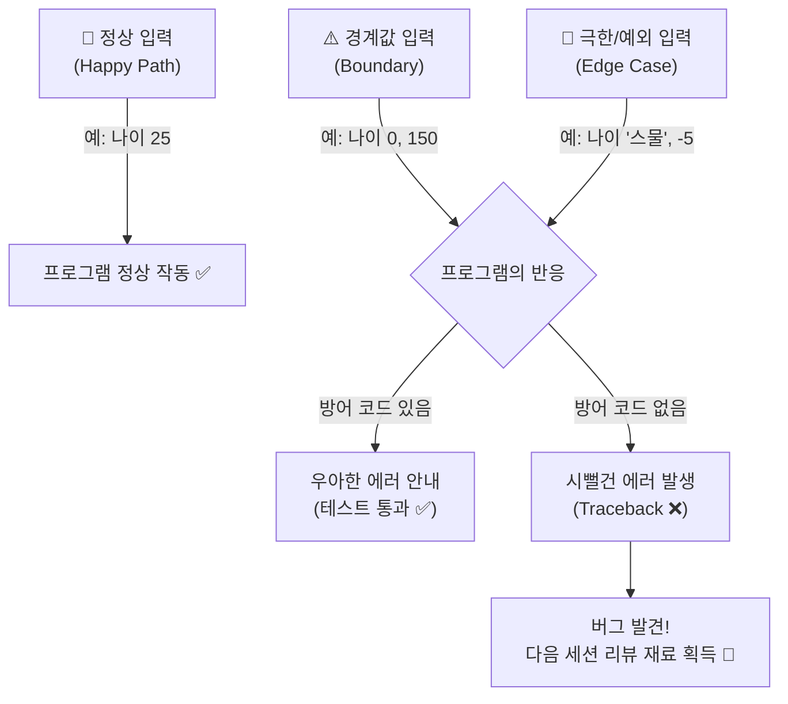

# 마이크로 세션: 084 — 미니 프로젝트: 극한의 테스트 시나리오 도출

> **세션 ID**: MS-PY101-084  
> **소요 시간**: 20분  
> **난이도**: ★★★  
> **청크 타입**: lab  
> **버전**: v2.1 (7섹션 구조)

---

## §1. 개요

> **Day 4 | PM | 세션 084/085**

### 🎯 학습 목표

이 세션이 끝나면, 수강생은 다음을 할 수 있습니다:

- 자신의 미니 프로젝트 특성에 맞는 창의적이고 극한의 '예외 케이스(Edge Case)'를 최소 3가지 도출할 수 있다.
- 도출한 엣지 케이스를 프로그램에 직접 입력하여 고의로 에러를 발생시킬 수 있다.
- 발생한 에러 메시지(Traceback)의 종류와 원인을 분석하여 시나리오 표로 작성할 수 있다.

### 선행 세션 환기

바로 직전 세션(세션-083)에서 우리는 1차로 만든 엉성했던 절차적 코드를 구조적 프로그래밍 기반으로 깔끔하게 리팩토링했습니다. 이제 각 기능이 예쁜 함수 단위로 나뉘었고, 전역 변수 대신 매개변수와 리턴값으로 데이터를 주고받게 되었죠. AI 심사위원에게 높은 점수를 받을 만큼 코드가 구조적으로 아주 잘 짜였습니다. 하지만, 실전 소프트웨어 세계에서는 코드가 예쁘다고 해서 끝나는 것이 아닙니다. 이제부터 우리는 방금까지 그토록 소중하게 다듬었던 코드를 어떻게든 박살 내고 에러 메시지를 뿜어내며 쓰러지게 만들 것입니다. 자신이 만든 창조물을 스스로 공격하는 이 역설적인 통과의례로 들어가 봅시다.

---

## §2. 핵심 개념 (+ 🗣️ 강사 대본 + Mermaid)

### 비유 — 진상 고객에 빙의하기

여러분이 방금 개업한 아주 세련된 카페의 사장님이라고 상상해봅시다. 메뉴얼대로 주문을 받는 시스템을 완벽하게 갖추었습니다. 손님이 "아메리카노 한 잔 주세요"라고 말하면 커피를 내어주면 됩니다. 이것을 개발 용어로는 모든 것이 순조롭게 흘러가는 '해피 패스(Happy Path)'라고 부릅니다. 하지만 현실의 카페에는 상상을 초월하는 이른바 '진상 고객'들이 등장합니다. "아메리카노 따뜻하게 주시는데, 얼음 듬뿍 넣어서 차갑게 해주세요"라고 주문하거나, 수량을 묻는 말에 "-5잔 주세요"라고 대답하거나, 심지어 메뉴판을 아예 찢어버리는 손님도 있습니다.

여러분이 짠 프로그램이 마주할 현실도 이와 정확히 똑같습니다. 나이를 입력하라고 했더니 "스물다섯"이라는 한글을 입력하고, 삭제할 번호를 고르라고 했더니 엔터 키만 백 번을 내리치는 사용자가 반드시 존재하죠. 이런 극단적이고 예외적인 상황을 우리는 **'엣지 케이스(Edge Case)'**라고 부릅니다. 

지금 이 순간부터 여러분은 개발자의 따뜻한 마음을 버리고, 내 프로그램을 어떻게든 고장 내고 말겠다는 악랄한 '진상 고객'의 마인드로 빙의해야 합니다.

🗣️ **강사 대본 (Instructor Script)**:

> 여러분, 앞선 세션에서 우리는 코드를 구조적으로 분리하여 아주 깔끔하고 튼튼해 보이는 집을 지었습니다. 하지만 개발자가 예상한 대로만 얌전하게 프로그램을 사용해 주는 천사 같은 사용자는 현실에 존재하지 않습니다. 
> 
> 지금부터 여러분의 프로그램을 집요하게 괴롭힐 시간입니다! 생각할 수 있는 가장 엉뚱한 값들을 마구 터미널에 입력해보세요. 정상적인 길에서 벗어나 경계선 끝자락을 아슬아슬하게 걷는 이 엣지 케이스들을 얼마나 창의적이고 다양하게 찾아내느냐가 결국 소프트웨어의 품질을 결정짓습니다. AI가 아무리 코드를 잘 짜준다고 해도, "이런 기상천외한 상황이 벌어지면 어떡하지?"라고 질문을 던지는 상상력만큼은 오직 인간의, 즉 여러분의 몫입니다. 에러가 나면서 프로그램이 뻗는다면 오히려 폭탄을 미리 제거할 아주 좋은 기회를 잡은 것입니다.

### Mermaid 다이어그램: 엣지 케이스 테스트 흐름



---

## §3. 상세 내용

### Why — 왜 극한의 테스트 시나리오가 필요한가?

AI와 협업하는 현대의 개발 환경에서 '코드 작성' 자체의 비중은 줄어들고 있지만 반대로 **'테스트 시나리오 기획'의 중요성은 폭발적으로 증가**하고 있습니다. 기계는 우리가 지시한 정상적인 로직(Happy Path)을 금방 코드로 짜주지만, 내 비즈니스 특성에 맞는 엣지 케이스는 그 도메인을 깊게 이해하는 사람만이 도출할 수 있기 때문입니다. 여러분이 직접 기상천외한 예외 케이스를 터미널에 입력하는 순간 프로그램은 처참하게 종료되겠지만, 이는 실패가 아닙니다. 고객에게 프로그램이 전달되기 전에 우리가 먼저 폭탄을 찾아내어 제거할 수 있는, 에러 메시지가 길고 복잡하게 나올수록 더 강력한 백신을 만들 수 있는 기회입니다.

### What — 극한의 엣지 케이스란 무엇인가?

코드를 작성할 때 놓치기 쉬운 경계 조건들을 의도적으로 찌르는 행위가 바로 테스트의 본질입니다. 프로그램을 검증할 때는 정상(Normal), 경계값(Boundary), 예외(Exception) 세 가지 측면의 시나리오를 고려해야 합니다.

- **경계값 분석**: 예를 들어 1권부터 5권까지만 대출할 수 있는 도서 관리 시스템이라면, 정상적인 숫자인 3을 넣어보는 것은 큰 의미가 없습니다. 대신 경계선에 있는 0권, 6권, 혹은 아예 마이너스 값인 -1권을 입력해 보아야 합니다.
- **도메인 특화 예외**: 숫자가 들어가야 할 자리에 특수문자나 띄어쓰기를 넣거나, 재고 관리 프로그램이라면 "이미 품절된 상품을 다시 삭제하려고 할 때"가 엣지 케이스가 되고, 영화 예매 프로그램이라면 "존재하지 않는 좌석 번호를 입력했을 때"가 됩니다.

### How — 어떻게 에러를 찾아내는가?

가장 훌륭한 테스터는 프로그램의 한계를 시험하기 위해 악랄해지는 사람입니다. 여러분이 만든 미니 프로젝트의 각 기능(Create, Read, Update, Delete)을 실행하며 아무 입력도 하지 않고 엔터만 치거나, 말도 안 되는 값을 넣어보세요. 그때 터미널에 발생하는 파이썬의 시뻘건 에러 메시지를 수집하여 시나리오 표로 정리하는 것이 핵심입니다.

> ✅ **체크포인트**: 여기까지 이해했는지 스스로 점검해 보세요.
> - 정상적인 입력이 아닌, 극단적이거나 비정상적인 입력으로 시스템의 한계를 테스트하는 상황을 무엇이라고 부르나요? ("엣지 케이스(Edge Case)")
> - AI 시대에 코딩보다 테스트 시나리오 기획이 더 중요해지는 이유는 무엇인가요? ("기계는 코드를 짜주지만, 비즈니스 도메인의 특수한 예외 상황은 인간만이 상상하고 정의할 수 있기 때문")

---

## §4. 실습 가이드 (+ 🎙️ 실습 대본)

### 실습 목표

수강생은 진상 고객으로 돌변하여 앞서 리팩토링한 자신의 파이썬 프로그램을 고의로 무너뜨리고, 그 과정에서 발생한 에러를 꼼꼼하게 기록하여 테스트 시나리오 문서를 완성합니다.

🎙️ **실습 가이드 대본 (Lab Guide)**:

> 자, 이제 여러분의 프로그램에 폭탄을 던질 시간입니다! 터미널을 열고 여러분이 만든 미니 프로젝트 파이썬 파일을 실행하세요. 주의할 점은, **정상적인 입력은 절대 하지 마세요.** 어떻게든 에러를 발생시켜서 프로그램이 멈추게 만드는 것이 이번 실습의 유일한 목표입니다.
>
> 방금 만든 게 도서 관리 프로그램인가요? 그럼 대출 권수에 0이나 -10을 넣어보세요. '열 권'이라고 한글로 쳐보세요. 삭제 메뉴에서 이미 지운 책을 또 지워보세요. 화면이 빨간색 텍스트(Traceback)로 도배되었다면 완벽하게 성공하신 겁니다! 에러가 날 때마다 당황하지 말고, "아싸, 버그 하나 잡았다!"라고 외치면서 메모장에 그 에러 상황을 꼼꼼히 기록해 주세요.

### 단계별 지시

| 단계 | 소요 시간 | 강사 지시사항 | 학습자 액션 | 예상 결과 |
|------|----------|--------------|------------|----------|
| 1 | 5분 | "내 프로그램에 맞는 극한 케이스 3개를 고민하세요" | 미니 프로젝트 특성을 고려한 절대 일어나선 안 될 예외 상황 3가지 도출 | (예) 숫자 대신 엔터만 치기, 없는 데이터 수정하기, 나이에 마이너스 값 넣기 |
| 2 | 5분 | "터미널에서 프로그램을 실행하고 파괴하세요" | 파이썬 프로그램 실행 후, 메모해둔 3가지 예외 상황을 실제로 똑같이 입력 | 시뻘건 에러 메시지(Traceback)를 뿜으며 프로그램 강제 종료 |
| 3 | 5분 | "에러 종류와 상황을 꼼꼼히 기록하세요" | 출력된 에러의 종류(ValueError, KeyError 등)와 당시 상황 기록 | "수량에 문자를 넣었더니 ValueError가 뜨면서 프로그램이 죽어버림" 기록 |
| 4 | 5분 | "에러 시나리오 표를 문서로 작성하세요" | 도출한 3가지 케이스를 마크다운 표 형태로 정리 | 엣지 케이스 테스트 시나리오 문서 완성 |

### 트러블슈팅 FAQ

| Q | A |
|---|---|
| 아무리 이상한 값을 넣어도 에러가 안 나고 그냥 계속 진행돼요. | 이전 세션에서 구조적 리팩토링을 할 때 AI가 이미 예외 처리(try-except)를 완벽하게 해두었을 수 있습니다! 코드를 열어서 입력 검증 로직이 있는지 확인해 보시고, 그렇다면 아주 훌륭한 AI 조수를 두신 겁니다. 이제 빈 문자열 입력 같은 논리적 오류를 유도해 보세요. |
| 에러 메시지가 너무 길어서 무슨 말인지 모르겠어요. | 에러 메시지의 가장 마지막 줄을 보세요. `ValueError: invalid literal for int()` 같은 메시지가 핵심입니다. 이 메시지를 통째로 다음 세션에서 AI에게 보여줄 것이니 잘 복사해 두세요. |
| 엣지 케이스가 도저히 안 떠오릅니다. | 입력 창에서 그냥 아무것도 안 치고 '엔터(Enter)'만 여러 번 쳐보세요. 또는 스페이스바로 '띄어쓰기'만 입력해 보세요. 십중팔구 예상치 못한 동작을 할 겁니다. |
| 프로그램이 무한 루프에 빠져서 영영 안 끝나요! | 터미널 창을 마우스로 클릭하고 키보드에서 `Ctrl + C`를 누르면 강제로 프로그램을 멈출 수 있습니다. 이 역시 프로그램의 허점을 찌른 아주 좋은 버그를 하나 찾으신 겁니다! |

> ✅ **체크포인트**: 빨간색 에러 메시지를 하나라도 보신 분 손 들어주세요! 축하합니다, 여러분은 훌륭한 테스터입니다.

---


### 🎓 강사 노트 (Instructor Support)

- ⏱️ **타이밍**: 17:45 (20분, lab)
- 🎯 **핵심 활동**: 창의적 예외 케이스 도출
- ⚠️ **강사 주의사항**: 재미 요소 극대화


### 📋 실습 설계 보강 (Lab Packet)

**세션 084 실습 설계 보강**

미니 프로젝트: 극한의 테스트 시나리오 도출
- **3-Stage Example Set**
  - 기본: 자신의 프로젝트에 맞는 정상/경계/예외 시나리오 각 3개 이상 작성
  - 변형: AI에게 "이 코드를 깨뜨릴 수 있는 입력 5가지를 알려줘" 도전 요청
  - 실수 해결: "테스트해봤는데 전부 통과해요" → AI에게 더 극단적인 케이스 요청
- **난이도 예측**: ★★★ 창의적 예외 도출 능력이 요구됨
- **타이밍 가이드**: 시나리오 작성 8분 | AI에게 극한 케이스 요청 5분 | 시나리오 테스트 5분 | 정리 2분
- **심리적 장벽**: "뭘 테스트해야 할지 떠오르지 않아요"
- **자가 점검**:
  - [ ] 극한 케이스(빈 입력, 초장문, 특수문자, SQL 인젝션 등)를 3개 이상 도출했는가?
  - [ ] 도출한 케이스 중 프로그램을 크래시시키는 것을 발견했는가?
  - [ ] 시나리오 표에 "예상 결과"와 "실제 결과"를 기록했는가?

## §5. 코드 및 명령어 모음

### 테스트 기록 예시 (학습자 작성용)

이번 실습에서 학습자가 최종적으로 작성해야 할 '테스트 시나리오 기록 표'의 예시입니다. 여러분의 미니 프로젝트에 맞게 내용을 채워주세요.

```markdown
# 🧨 나의 극한 테스트 시나리오 기록

| 테스트 대상 기능 | 내가 입력한 악랄한 값 | 예상한 결과 | 실제 발생한 에러 현상 |
|---|---|---|---|
| 1. 고객 나이 입력 | "스물다섯" (문자열) | "숫자를 입력하세요" 안내 | `ValueError` 발생하며 프로그램 튕김 |
| 2. 삭제할 도서 번호 | -1 (음수) | "없는 번호입니다" 안내 | `IndexError` 발생하며 프로그램 튕김 |
| 3. 상품명 입력 | (아무것도 안 치고 엔터) | "이름을 입력하세요" | 빈 문자열이 그대로 데이터베이스에 버그로 등록됨 |
```

### 터미널 강제 종료 명령어

```bash
# 프로그램이 무한 루프에 빠져 응답하지 않을 때 터미널에서 입력
Ctrl + C
```

---

## §6. 요약

### 핵심 학습 포인트

이번 세션에서 우리는 방금 예쁘게 완성한 프로그램을 스스로 파괴해보는 역설적인 실습을 진행했습니다. 진상 고객에 빙의하여 정상적인 경로(Happy Path)를 벗어난 극단적인 **엣지 케이스(Edge Case)**를 도출했죠. 0이나 마이너스 값 같은 경계값을 입력해 보거나, 숫자가 필요한 곳에 문자를 입력하여 에러를 집요하게 유도했습니다. 화면이 빨간 에러 메시지로 도배되었다면 실습에 완벽히 성공한 것입니다. 이 과정을 통해 우리는 사용자가 겪을 수 있는 끔찍한 버그들을 사전에 찾아내어 차단할 수 있는 아주 귀중한 단서를 얻었습니다.

### 다음 세션 예고

이제 이 산산조각이 난 프로그램을 다시 살려낼 시간입니다. 다음 세션에서는 방금 우리가 찾아낸 약점들과 에러 메시지들을 들고, 리뷰 코멘트 3요소를 장착하여 깐깐한 AI 시니어 개발자에게 마지막 수술 지시를 내려보겠습니다.

### 브릿지 노트

> "모두 프로그램 한 번씩은 시원하게 박살 내보셨나요? 화면에 시뻘건 Traceback 에러가 가득하다면 박수 한번 칩시다! 여러분은 방금 가장 훌륭한 테스터의 자질을 보여주셨습니다. 우리가 먼저 부숴봐야 실제 고객 앞에서 안 부서집니다. 자, 이제 이 폐허 속에서 찾은 훌륭한 버그 리스트를 들고, AI에게 이 코드를 방탄조끼 입은 것처럼 단단하게 만들어 달라고 마지막 리뷰를 요청하러 가봅시다."

---

## §7. 참고 자료

### 3-Source 출처

- **Source A (로컬 참고자료)**: 「9 디버깅, 테스트, 배포.pdf」(§9.3.1) — 소프트웨어 테스트의 본질, 경계값 분석 기법
- **Source B (NotebookLM)**: — (해당 없음)
- **Source C (Deep Research)**: §6.1 — AI 코딩 시대에서의 테스트 시나리오 기획의 중요성, 도메인 특화 엣지 케이스 도출

### 추가 학습 자료

- [소프트웨어 테스팅 기본 개념]: 경계값 분석(Boundary Value Analysis)과 동등 분할(Equivalence Partitioning) 기법
- [Python 예외 처리 공식 문서]: ValueError, KeyError, IndexError 등 파이썬의 내장 예외 계층 구조 이해

### 강사 노트

> 💡 **강사 노트**: 수강생들이 의도적으로 에러를 내는 행위에 익숙하지 않아 머뭇거릴 수 있습니다. "여러분이 찾아낸 에러 개수가 곧 여러분의 실력입니다!"라며 분위기를 적극적으로 북돋아 주세요. 만약 AI가 작성해 준 코드에 이미 `try-except`가 잘 되어 있어서 아무리 이상한 값을 넣어도 프로그램이 죽지 않는 수강생이 있다면, 크게 칭찬해 주시고 "AI가 이미 방어 코드를 훌륭하게 짰군요! 그렇다면 빈 문자열 입력이나 중복 데이터 등록 같은 논리적인 오류(Logical Error)를 집중적으로 찾아보세요"라고 안내해 주시면 아주 좋습니다.

---

## ✅ 세션 완료 체크리스트 (강사용)

- [ ] §1~§7 모든 섹션이 충실하게 작성되었는가?
- [ ] 진상 고객 비유가 §2에서 생생하게 구어체로 전달되었는가?
- [ ] 엣지 케이스 및 경계값 테스트의 중요성이 충분히 강조되었는가?
- [ ] 실습 가이드(§4)에 에러를 도출하고 기록하는 구체적 단계가 포함되었는가?
- [ ] 트러블슈팅 FAQ에 강제 종료 및 방어 코드 관련 내용이 포함되었는가?
- [ ] 체크포인트 질문이 §3, §4에 적절히 배치되었는가?
- [ ] 다음 세션(085 코드 리뷰 기반 최종 완성)으로의 자연스러운 브릿지 노트가 포함되었는가?

---

**🔗 선행 세션**: [세션-083] 미니 프로젝트: 구조적 리팩토링 및 퀄리티 체크 (필수)  
**🔗 후행 세션**: [세션-085] 미니 프로젝트: 코드 리뷰 기반 최종 완성 및 회고

---

*작성 일시: 2026-02-25*  
*작성 에이전트: Sisyphus-Junior*  
*교안 구조: 7섹션 (A0 팀 공통 표준)*