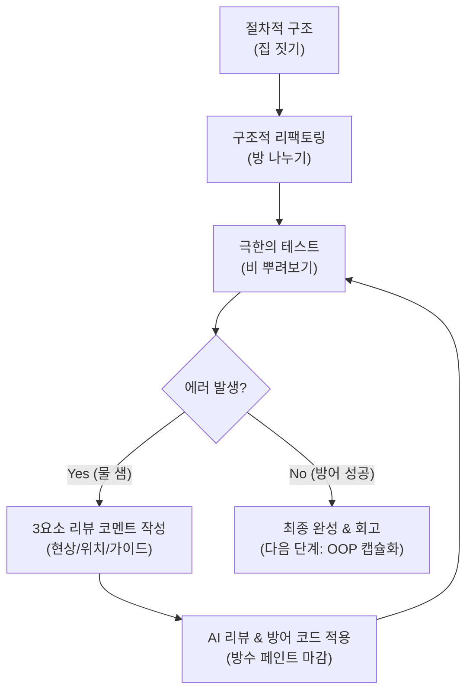

# 마이크로 세션: 085 — 미니 프로젝트: 코드 리뷰 기반 최종 완성 및 회고

> **세션 ID**: MS-PY101-085  
> **소요 시간**: 25분  
> **난이도**: medium  
> **청크 타입**: lab  
> **버전**: v2.1 (7섹션 구조)

---

## §1. 개요

> **Day 4 | PM | 세션 085/085**

### 🎯 학습 목표

이 세션이 끝나면, 수강생은 다음을 할 수 있습니다:

- 3요소 리뷰 코멘트를 활용하여 엣지 케이스를 방어하는 최종 코드를 완성할 수 있다
- 프로젝트 전체 과정을 회고하며 다음 패러다임(객체지향, OOP)의 필요성을 설명할 수 있다
- 시니어 개발자 페르소나를 활용해 AI에게 코드 리뷰를 요청하고 피드백을 수용할 수 있다

### 선행 세션 환기

바로 직전 세션(세션-084)에서 우리는 직접 만든 미니 프로젝트를 무자비하게 공격해 보았어요. 사용자가 숫자를 넣어야 할 곳에 문자를 넣고, 없는 메뉴를 선택하고, 음수 값을 입력하면서 프로그램이 시뻘건 에러를 토해내며 무너지는 것을 확인했죠. 속상해할 필요는 전혀 없어요. 개발의 세계에서 에러는 실패의 증거가 아닙니다. 우리가 건물을 더 튼튼하게 지을 수 있도록 도와주는 강력한 나침반이에요. 이제 길고 길었던 Day 4 파이썬 기초 여정의 대미를 장식할 마지막 무대입니다. 여러분이 찾아낸 그 소중한 에러들을 무기 삼아, 어떤 사용자의 공격에도 끄떡없는 강철 방어막을 완성해 볼 차례예요.

---

## §2. 핵심 개념 (+ 🗣️ 강사 대본 + Mermaid)

### 방수 페인트 마감과 궁극의 캡슐

우리가 엣지 케이스를 막아내는 코드를 추가하는 과정은 튼튼하게 지은 집에 '방수 페인트'를 꼼꼼하게 칠하는 마감 공사와 같아요. 폭우가 쏟아져 벽면 틈새로 빗물이 샌다고 해서 집 전체를 다시 부수고 지을 필요는 없습니다. 빗물이 새는 정확한 위치를 찾아서 그곳에만 강력한 방수액을 덧칠해주면 되죠. 코딩도 마찬가지예요. 사용자가 숫자를 넣어야 할 곳에 문자를 넣어서 에러가 났다면, 해당 입력 부분에만 안전망(try-except 같은 방수 페인트)을 쳐서 다시 입력하라고 안내하면 그만입니다.

하지만 여기서 아주 본질적인 한계 하나를 마주하게 됩니다. 아무리 방수 페인트를 잘 칠하고 예쁘게 인테리어를 마친 집이라도, 전원 버튼을 끄고 프로그램을 종료하는 순간 애써 입력해둔 데이터가 연기처럼 허공으로 날아가 버려요. 데이터는 허공에 떠 있고, 함수들은 그 데이터의 눈치를 보며 따로 노는 절차적 세계의 뼈아픈 한계입니다.

그래서 우리는 내일, 흩어진 데이터와 함수들을 거대한 '궁극의 캡슐' 속에 단단하게 묶어버리는 마법을 배우게 됩니다. 변수와 함수를 한 덩어리로 묶어서 안전하게 보관하고, 필요할 때마다 붕어빵을 찍어내듯 똑같은 집을 수십 채씩 1초 만에 복제하는 기술이죠. 그것이 바로 내일 배울 '객체지향(OOP)'이라는 새로운 세계입니다. 오늘 칠하는 방수 페인트는 그 위대한 세계로 넘어가기 위한 마지막 준비 작업이에요.

🗣️ **강사 대본 (Instructor Script)**:

> 여러분, 직전 실습에서 열심히 만든 프로그램이 픽픽 쓰러지는 걸 보셨죠? 기분이 어떠셨나요? 허탈할 수도 있지만, 사실 그게 정상이에요. 개발자들은 내가 짠 코드를 내가 부수는 데 희열을 느끼기도 합니다. 에러를 빨리, 많이 발견할수록 사용자가 겪을 불편을 미리 막아내는 거니까요.
>
> 방금 전까지는 부수는 연습을 했다면, 이번엔 고치는 연습을 할 겁니다. AI 의사에게 정확한 수술 지시를 내려서 완벽하게 방수 처리가 끝난 최종 버전을 만들 거예요. 그리고 한 걸음 더 나아가 깐깐한 AI 시니어 개발자에게 코드를 보여줄 겁니다. 지적받은 부분을 고치고 나면, 어디 내놔도 부끄럽지 않은 단단한 구조의 프로그램이 완성될 거예요.

### Mermaid 다이어그램



---

## §3. 상세 내용

### Why — 왜 3요소 리뷰 코멘트가 필요한가?

발견한 버그를 AI의 힘을 빌려 수정할 때, 단순히 "고쳐줘"라고 말하면 안 됩니다. "이 코드 이상해요"라고 하면 사람도 AI도 못 알아들어요. AI는 전체 문맥을 이해하기보다 우리가 주어진 정보를 바탕으로 패턴을 찾아냅니다. 명확한 정보를 주지 않으면 엉뚱한 코드를 고치거나, 오히려 멀쩡하던 로직을 망가뜨릴 수 있어요. 수술실에서 의사에게 "아프니까 고쳐주세요"라고 하는 것과 "오른쪽 무릎 연골이 찢어졌으니 봉합 수술을 해주세요"라고 말하는 것의 차이입니다.

### What — 3요소 리뷰 코멘트란?

완벽한 방어 코드를 짜기 위해 AI에게 전달해야 하는 핵심 요소 세 가지입니다.
1. **현상**: 어떤 상황에서 에러가 났는지 (예: 숫자를 입력해야 하는데 문자를 입력했더니 ValueError 발생)
2. **위치**: 어느 위치의 코드에서 문제가 발생했는지 (예: 수량을 입력하는 input() 부분)
3. **가이드 (해결책)**: 어떻게 수정하길 원하는지 명확한 지시 (예: 예외 처리를 추가해서 문자를 입력하면 '숫자만 입력하세요'라고 경고한 뒤 다시 입력받게 수정)

이렇게 구체적인 코멘트를 주면, AI는 입력값 검증과 에러 핸들링 기법을 적용해 흠잡을 데 없는 방어 코드를 즉각적으로 짜줍니다.

### How — 시니어 개발자 페르소나 활용하기

내 코드가 정말 튼튼한지 확인하려면 더 엄격한 눈이 필요합니다. AI에게 '시니어 개발자' 페르소나를 부여해 내 코드를 리뷰하게 만드세요. 코드 품질의 5대 기준인 가독성, 유지보수성, 에러 처리(입력 검증), 성능, 보안 측면에서 꼼꼼히 점검해 달라고 요청하는 겁니다. 

이러한 방어적 프로그래밍을 통해 시스템 신뢰성을 높이는 것은 실제 실리콘밸리 개발자들이 일하는 방식이에요. 여러분은 기획자, 개발자, 테스터, 코드 리뷰어라는 1인 4역을 훌륭하게 소화하고 있습니다.

### 비교표 — 모호한 요청 vs 3요소 리뷰 코멘트

| 항목 | 모호한 요청 | 3요소 리뷰 코멘트 |
|------|-----------|-----------------|
| 입력 예시 | "삭제 기능에서 에러 나. 고쳐줘." | "1) 삭제 기능에서 없는 번호를 입력하면, 2) 리스트 검색 부분에서 KeyError가 나. 3) if문으로 데이터가 있는지 먼저 검사하도록 수정해줘." |
| AI의 반응 | 전체 코드를 훑으며 짐작으로 수정 | 정확한 위치에 방어 코드(방수 페인트)만 추가 |
| 부작용 | 멀쩡한 다른 함수를 건드릴 확률 높음 | 해당 부분만 깔끔하게 수정됨 |
| 학습 효과 | 왜 고쳐졌는지 본인도 모름 | 원인과 해결 방법을 명확히 인지하게 됨 |

---

## §4. 실습 가이드 (+ 🎙️ 실습 대본)

### 실습 목표

이 실습을 통해 수강생은 앞선 세션에서 찾아낸 버그들을 3요소 리뷰 코멘트로 수정하고, 최종적으로 AI 시니어 개발자의 리뷰를 거쳐 프로그램을 완성합니다. 마지막으로 README.md에 회고를 작성합니다.

🎙️ **실습 가이드 대본 (Lab Guide)**:

> 자, 이제 AI 의사에게 정확한 수술 지시를 내리고 완벽하게 방수 처리가 끝난 최종 버전을 완성해 봅시다. 앞서 적어둔 에러 메모장 열어주세요. 그걸 3요소 코멘트로 바꿔서 AI에게 던질 겁니다. "어디서, 무엇을 하다가 에러가 났으니, 이렇게 방어해 줘"라고 말이죠.
>
> 코드가 다 고쳐졌다면 마지막 관문이 남았습니다. AI를 10년 차 깐깐한 시니어 개발자로 변신시켜서 우리 코드를 검사받을 거예요. 지적을 받으면 기분 나빠하지 마시고, "오, 이런 것까지 챙겨야 하는구나" 하고 쿨하게 수용해서 코드를 업데이트해 보세요.

### 단계별 지시

| 단계 | 소요 시간 | 강사 지시사항 | 학습자 액션 | 예상 결과 |
|------|----------|--------------|------------|----------|
| 1 | 5분 | "3요소 코멘트를 활용해 버그를 수정하세요" | 에러가 난 부분을 현상/위치/가이드로 묶어 AI에게 프롬프트 전송 | 방어 코드가 추가된 함수 완성 |
| 2 | 5분 | "수정된 방어막을 다시 뚫어보세요" | 수정한 코드를 터미널에서 실행하고 똑같은 진상 행동 반복 | 에러 없이 "잘못된 입력입니다" 안내 출력 |
| 3 | 5분 | "AI 시니어 개발자에게 코드 리뷰를 받으세요" | 전체 코드를 AI에게 주고 5대 기준으로 리뷰 요청 | AI가 개선점(예외 처리 누락 등) 지적 |
| 4 | 5분 | "리뷰 결과를 반영하고 최종 완성하세요" | AI의 지적을 수용하여 코드 마지막 업데이트 | 견고한 최종 코드(`my_project_final.py`) 완성 |
| 5 | 5분 | "결과물을 공유하고 회고록을 작성하세요" | 짝꿍과 어떤 엣지 케이스를 막았는지 공유 후, 회고 메모 작성 | 절차적 한계(데이터 날아감) 공감 |

**[단계 1] 3요소 코멘트로 버그 수정하기**

직전 시간에 찾아낸 에러를 바탕으로 프롬프트를 작성합니다. Agent Manager 채팅창에 입력하세요.

프롬프트 예시: "내 코드의 `delete_customer()` 함수(위치)에서 없는 아이디를 입력했더니 에러가 발생하며 프로그램이 뻗어버려(현상). id가 딕셔너리에 존재하는지 먼저 검사하고, 없으면 '고객이 없습니다'라고 출력하고 넘어가도록 예외 처리를 추가해줘(가이드)."

**[단계 2] 방어막 재테스트**

AI가 짜준 코드를 붙여넣고 다시 똑같은 행동을 해봅니다. 프로그램이 죽지 않고 예쁘게 경고 메시지를 보여주는지 확인하세요.

**[단계 3] AI 시니어 개발자 소환하기**

Agent Manager에 완성된 전체 코드를 복사해 넣고 다음 프롬프트를 날립니다.
"너는 10년 차 파이썬 시니어 개발자야. 내가 짠 미니 프로젝트 코드를 가독성, 유지보수성, 에러 처리 관점에서 깐깐하게 리뷰해 줘. 고쳐야 할 부분이 있다면 구체적인 코드와 함께 제안해 줘."

**[단계 4] 최종 수정**

AI 시니어 개발자의 의견 중 타당한 것을 반영해 코드를 완성합니다.

**[단계 5] 결과 공유 및 회고**

옆 사람과 완벽하게 작동하는 코드를 띄워놓고 자랑하세요. 그리고 프로그램을 종료해 봅니다. 열심히 입력한 고객 데이터가 다 날아갔죠? 이 허탈함을 꼭 기억하세요. 내일 배울 내용의 핵심입니다.

### 트러블슈팅 FAQ

| Q | A |
|---|---|
| AI가 제가 말한 함수 말고 다른 데를 고쳤어요 | 가이드(3요소 중 위치)가 불명확했을 가능성이 높습니다. 코드의 특정 줄 번호나 함수 이름을 정확히 명시해 주세요. |
| 예외 처리를 넣었더니 무한 루프에 빠져요 | `while True` 안에서 에러가 났을 때 `break`나 `continue` 처리가 잘못된 경우입니다. "무한 루프에 빠지니 에러 출력 후 다시 입력받게 수정해 줘"라고 추가 프롬프트를 날리세요. |
| AI 시니어 개발자가 너무 어려운 코드를 제안해요 | "나는 파이썬 기초반 학생이야. 내가 배운 if문, for문, while문, try-except 정도만 사용해서 다시 제안해 줘"라고 수준을 맞춰달라고 하세요. |

> ✅ **체크포인트**: 버그를 수정하기 위해 AI에게 지시할 때 반드시 포함해야 하는 3요소 코멘트는 현상, 위치, 그리고 무엇인가요? (정답: 가이드 또는 해결책)

---


### 🎓 강사 노트 (Instructor Support)

- ⏱️ **타이밍**: 18:05 (25분, lab)
- 🎯 **핵심 활동**: 리뷰 기반 코드 완성
- ⚠️ **강사 주의사항**: Day 4 마무리 + Day 5 예고


### 📋 실습 설계 보강 (Lab Packet)

**세션 085 실습 설계 보강**

미니 프로젝트: 코드 리뷰 기반 최종 완성+회고
- **3-Stage Example Set**
  - 기본: 084에서 발견한 문제 → 리뷰 코멘트 3요소 작성 → AI에게 방어 코드 요청 → v3 최종 완성
  - 변형: 동료와 코드 교환 리뷰 → 외부 시각의 피드백 수용
  - 실수 해결: "예외 처리를 넣었더니 코드가 2배로 길어졌어요" → 핵심 위험 지점만 방어
- **난이도 예측**: 전체 사이클(기획→코드→리팩토링→테스트→리뷰) 완주의 마무리
- **타이밍 가이드**: 리뷰 코멘트 작성 5분 | AI 수정 요청 7분 | 최종 테스트 5분 | 회고 8분
- **심리적 장벽**: "완벽하게 만들지 못해서 아쉬워요"
- **자가 점검**:
  - [ ] 발견한 문제 중 최소 1개에 대해 방어 코드(try/except 등)를 추가했는가?
  - [ ] v1→v2→v3 세 버전의 차이를 설명할 수 있는가?
  - [ ] Day 4 전체(절차→구조→테스트→리뷰)의 흐름을 회고했는가?
  - [ ] "OOP가 왜 필요한가?"에 대한 실마리를 느꼈는가?

## §5. 코드 및 명령어 모음

### 프롬프트 1: 3요소 리뷰 코멘트 예시

```text
[현상] 나이를 입력받는 부분에서 "스무살"이라고 문자를 쳤더니 ValueError가 나.
[위치] create_customer() 함수의 age = int(input()) 부분이야.
[가이드] try-except 문을 사용해서 정수가 들어오지 않으면 "숫자만 입력하세요"라고 안내하고, 다시 입력받도록 while 루프로 감싸줘.
```

명확한 3요소가 포함된 수술 지시서입니다.

### 프롬프트 2: AI 시니어 개발자 리뷰 요청

```text
너는 10년 차 파이썬 시니어 개발자야. 아래 내 전체 코드를 리뷰해 줘.
특히 다음 3가지를 중점적으로 봐줘.
1. 사용자가 엉뚱한 값을 넣었을 때 프로그램이 죽는 곳은 없는지 (에러 처리)
2. 함수 이름이 역할을 잘 설명하는지 (가독성)
3. 중복되는 코드가 있는지 (유지보수성)
코드: 
[내 코드 복사/붙여넣기]
```

이 프롬프트를 통해 코드의 전체적인 구조적 결함을 찾아낼 수 있습니다.

### 파이썬 코드: 전형적인 방어적 프로그래밍 패턴

```python
def get_valid_age():
    while True:
        try:
            age = int(input("나이를 입력하세요: "))
            if age < 0:
                print("나이는 음수일 수 없습니다. 다시 입력해주세요.")
                continue
            return age
        except ValueError:
            print("잘못된 입력입니다. 숫자만 입력해주세요.")
```

사용자의 예측 불가능한 행동을 막아내는 가장 흔한 '방수 페인트' 패턴입니다. 무한 루프 안에서 정상 입력을 받을 때까지 빠져나가지 못하게 합니다.

---

## §6. 요약

### 핵심 학습 포인트

이번 세션으로 Day 4의 긴 여정이 끝났습니다. 세 가지를 꼭 기억하세요. 
첫째, 에러는 실패가 아니라 시스템을 견고하게 만드는 나침반입니다. 
둘째, 버그를 고칠 때는 '현상, 위치, 가이드'라는 3요소 리뷰 코멘트를 명확히 전달해야 다른 코드를 망가뜨리지 않습니다. 
셋째, 기획부터 절차적 프로그래밍, 구조적 리팩토링, 극한의 테스트, 그리고 방어적 프로그래밍까지. 이 일련의 사이클이 바로 실제 실리콘밸리 개발자들이 일하는 방식 그 자체입니다. 스스로 하나의 완전한 소프트웨어 생명체를 잉태하고 키워낸 여러분, 정말 대단합니다.

### 다음 세션 예고

하지만 프로그램을 끄는 순간 애써 만든 데이터가 연기처럼 사라지는 아쉬움을 느끼셨을 거예요. 내일은 바로 이 흩어진 데이터와 함수들을 하나의 견고한 캡슐로 묶어 영원히 보존하고, 이 투룸을 붕어빵 틀처럼 무한대로 찍어내는 '객체지향(OOP)'이라는 새로운 마법을 배우러 오겠습니다. 

### 브릿지 노트

> "모두 완벽하게 방어막을 구축하셨나요? 프로그램을 껐다 켜보세요. 허탈하죠? 애써 만든 고객 정보가 싹 사라졌을 겁니다. 절차적, 구조적 프로그래밍으로는 이 '상태(데이터)'를 안전하게 묶어두는 데 한계가 있어요. 내일은 이 데이터를 영원히 보존하고, 함수와 데이터를 한 몸으로 묶는 마법을 배우겠습니다. Day 4 여정을 완주하신 여러분, 정말 고생 많으셨습니다! 박수로 마무리하겠습니다."

---

## §7. 참고 자료

### 3-Source 출처

- **Source A (로컬 참고자료)**: [A] 8 코딩.pdf (§8.12, 8.13), 9 디버깅, 테스트, 배포.pdf (§9.4) — 3요소 리뷰 코멘트 및 방어적 프로그래밍 가이드
- **Source B (NotebookLM)**: SRC-B04 — 시니어 개발자 페르소나를 활용한 코드 리뷰 프롬프팅
- **Source C (Deep Research)**: SRC-C06 (§6.1, 6.2) — 시스템 신뢰성을 높이는 방어적 프로그래밍과 리팩토링-테스트-리뷰 완성 사이클

### 강사 노트

> 💡 **강사 노트**: 실습 마지막 단계에서 데이터를 상실하는 허탈함을 충분히 공감해 주는 것이 중요합니다. 이 결핍이 내일(Day 5) 배우게 될 객체지향 프로그래밍(OOP)과 파일 입출력/데이터베이스의 필요성을 설명하는 가장 강력한 동기부여가 됩니다. 3요소 리뷰 코멘트가 왜 중요한지 모호한 프롬프트의 실패 사례를 들어 설명하면 효과적입니다.

---

## ✅ 세션 완료 체크리스트 (강사용)

- [x] §1~§7 모든 섹션이 충실하게 작성되었는가?
- [x] 방수 페인트 마감 및 궁극의 캡슐 비유가 §2에 충분히 표현되었는가?
- [x] 3요소 리뷰 코멘트의 구체적 방법이 §3, §4에 포함되었는가?
- [x] 시니어 개발자 페르소나 활용 프롬프트가 제공되었는가?
- [x] 단계별 실습 가이드가 구체적으로 제시되었는가?
- [x] 내일(Day 5, OOP)로 이어지는 자연스러운 브릿지 노트가 포함되었는가?
- [x] 체크포인트 질문과 트러블슈팅 FAQ가 적절히 배치되었는가?

---

**🔗 선행 세션**: [세션-084] 미니 프로젝트: 극한의 테스트 시나리오 도출 (필수)  
**🔗 후행 세션**: [세션-086] 객체지향 프로그래밍의 이해 (Day 5 시작)

---

*작성 일시: 2026-02-25*  
*작성 에이전트: Sisyphus-Junior*  
*교안 구조: 7섹션 (A0 팀 공통 표준)*
