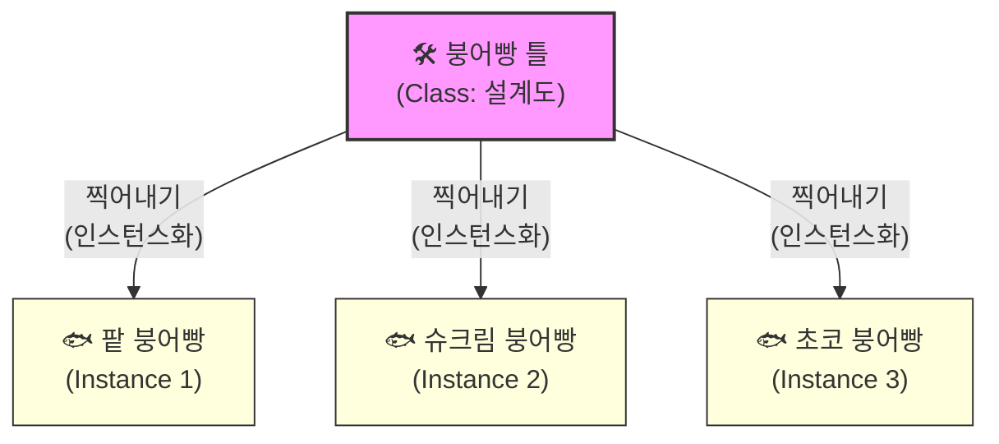

# 마이크로 세션 086: 클래스와 인스턴스의 개념

> **세션 ID**: MS-PY101-086  
> **소요 시간**: 20분  
> **난이도**: low  
> **청크 타입**: narrative  
> **버전**: v2.1 (7섹션 구조)

---

## §1. 개요

> **Day 5 | AM | 세션 086/106**

이 세션은 Day 5의 문을 여는 첫 번째 시간입니다. 어제까지 우리는 딕셔너리와 함수를 이용해 절차적 방식으로 고객 관리 프로그램을 만들었습니다. 하지만 프로그램의 규모가 커질수록 데이터와 기능이 분리된 구조는 뚜렷한 한계에 부딪히게 됩니다. 오늘부터는 이 둘을 하나의 묶음으로 합치는 '객체지향 프로그래밍(OOP)'이라는 완전히 새로운 패러다임으로 넘어갑니다. 그 위대한 첫걸음이 바로 클래스(Class)와 인스턴스(Instance)의 개념을 명확하게 이해하는 것입니다.

### 🎯 학습 목표

이 세션이 끝나면 수강생은 다음을 할 수 있어요:

- 데이터와 함수를 분리해서 관리할 때 발생하는 구조적 문제를 설명할 수 있습니다
- 클래스와 인스턴스의 차이를 '붕어빵 틀과 붕어빵' 비유로 정확하게 설명할 수 있습니다
- 파이썬에서 가장 단순한 형태의 빈 클래스를 정의하고 독립적인 인스턴스를 생성할 수 있습니다

### 선행 세션 환기

- **세션 085 (고객 관리 프로그램 v2 리뷰)**: 어제 완성한 고객 관리 프로그램 코드에서 전역 리스트 하나에 수많은 딕셔너리가 담겨 있고, 여러 함수가 이 리스트를 돌려가며 수정하던 아슬아슬한 구조를 다시 한번 떠올려야 합니다. 그 불편함이 오늘 배울 클래스의 필요성을 완벽하게 증명해 주기 때문입니다.

---


### 🌟 차별화 포인트 (Differentiation Strategy)

> 🌟 **Day 5 서사: 창조주의 시선** — 설계도로 생명 불어넣기 — 흩어진 데이터와 행동을 하나의 생명체(객체)로 묶어내는 객체지향의 마법. 나아가 부품을 자유롭게 갈아끼우는 의존성 주입(DI)을 통해 '소프트웨어 아키텍트'의 시선으로 마무리합니다.

## §2. 핵심 개념 (+ 🗣️ 강사 대본 + Mermaid)

### 데이터와 기능의 통합, 그리고 붕어빵의 법칙

클래스를 이해하는 가장 직관적인 비유는 '붕어빵 틀과 붕어빵'입니다. 프로그래밍에서 하나의 틀(설계도)만 잘 만들어두면, 내용물이 조금씩 다른 붕어빵(실체)을 무한대로 찍어낼 수 있습니다. 핵심은 단 하나의 틀로 수많은 독립적인 결과물을 만든다는 점입니다.

🗣️ **강사 대본 (Instructor Script)**:

> 여러분, 어제 하루 종일 고객 관리 프로그램을 만들면서 뿌듯하셨죠? 딕셔너리에 이름과 전화번호를 담고, 함수로 등록하고 조회하고 수정하고 삭제하는 기능까지 전부 구현했습니다. 정말 대단한 하루였어요. 그런데 잠깐, 한 가지 큰 불편한 점을 떠올려 봅시다. 고객이 10명, 100명이 아니라 1,000명으로 늘어나면 어떻게 될까요?
> 
> 딕셔너리 1,000개를 전역 리스트 하나에 전부 쓸어 담고, 여러 함수가 이 리스트를 이리저리 둘러가면서 주물럭거리는 장면을 상상해 보세요. 누가 어디에서 값을 실수로 바꿨는지 추적하기도 힘들고, 출력 형식을 하나 고치려면 함수 서너 개를 다 열어 봐야 합니다. 데이터는 데이터대로, 기능은 기능대로 따로 노는 구조입니다. 이 구조적 한계를 몸으로 느끼셨다면, 이제 다음 단계로 넘어갈 준비가 된 겁니다. 
> 
> 길거리에서 파는 붕어빵 아시죠? 붕어빵 아저씨 앞에는 두꺼운 쇠로 만든 붕어빵 틀이 딱 하나 놓여 있습니다. 반죽을 붓고 뚜껑을 닫으면 정확히 같은 모양의 붕어빵이 찍혀 나오죠. 팥을 넣으면 팥 붕어빵, 슈크림을 넣으면 슈크림 붕어빵이 됩니다.
> 
> 여기서 중요한 포인트가 세 가지 있습니다.
> 첫째, 붕어빵 틀은 딱 하나면 충분합니다. 붕어빵 100개를 굽는다고 틀을 100개 사 오는 바보는 없죠. 프로그래밍에서 이 "틀"에 해당하는 것이 바로 '클래스(Class)'입니다.
> 
> 둘째, 구워져 나온 붕어빵들은 서로 완전히 독립적입니다. 팥 붕어빵의 앙금을 퍼낸다고 옆에 있는 슈크림 붕어빵이 홀쭉해지지는 않잖아요? 이 구워져 나온 실체를 우리는 '인스턴스(Instance)' 또는 '객체(Object)'라고 부릅니다. 어제 딕셔너리를 쓸 때 실수로 다른 고객 데이터를 덮어쓴 적 있으신가요? 클래스를 쓰면 이런 실수가 원천적으로 차단됩니다. 홍길동 객체의 전화번호를 바꿔도 김철수 객체에는 아무 영향이 없으니까요.
> 
> 셋째, 순서가 아주 중요합니다. 아무리 맛있는 팥 앙금이 있어도 틀이 없으면 붕어빵을 만들 수 없죠. 프로그램에서도 항상 클래스(설계도)를 먼저 정의해야 인스턴스(실체)를 만들 수 있습니다. 

### Mermaid 다이어그램



다이어그램에서 볼 수 있듯, 클래스는 단 하나만 존재하지만 인스턴스는 필요한 만큼 무한히 생성할 수 있습니다. 이것이 바로 1 대 N의 관계입니다.

---

## §3. 상세 내용

### Why: 왜 클래스가 필요한가?

어제 작성한 코드를 보면 데이터(리스트)와 기능(함수)이 완전히 분리되어 있었습니다. 절차적 프로그래밍에서는 코드가 위에서 아래로 흐르며 데이터를 가공합니다. 작고 단순한 프로그램에서는 이 방식이 빠르고 직관적입니다. 하지만 프로그램이 커지고 데이터의 종류가 많아지면 여러 함수가 하나의 데이터를 마구잡이로 수정하는 부작용이 생깁니다. 클래스는 이 문제를 해결하기 위해 등장했습니다. "고객 데이터는 고객 객체가 스스로 책임지게 하자"는 철학을 담고 있습니다.

### What: 객체지향 프로그래밍(OOP)이란 무엇인가?

객체지향 프로그래밍(Object-Oriented Programming, OOP)은 컴퓨터 프로그램을 여러 개의 독립된 단위, 즉 "객체(Object)"들의 모임으로 파악하고자 하는 패러다임입니다. 여기서 객체란 데이터(속성)와 그 데이터를 다루는 기능(메서드)이 하나의 묶음 안에 들어있는 것을 말합니다. 클래스(Class)는 이런 객체를 만들기 위한 도면이고, 인스턴스(Instance)는 그 도면을 바탕으로 메모리상에 실제 구현된 객체입니다. 파이썬에서는 관례적으로 클래스 이름의 첫 글자를 대문자로 쓰는 파스칼 케이스(PascalCase)를 사용합니다. 소문자로 시작했던 함수 이름(snake_case)과 명확히 구분하기 위해서입니다.

### How: 어떻게 코드로 구현하는가?

파이썬에서 클래스를 만드는 방법은 아주 간단합니다. `class` 키워드 뒤에 원하는 이름을 파스칼 케이스로 적고 콜론(:)을 찍으면 됩니다. 아직 내용물이 없다면 `pass`라는 키워드를 넣어둡니다. 인스턴스를 만들 때는 선언한 클래스 이름 뒤에 소괄호 ()를 붙여서 호출합니다. 마치 함수를 실행하는 것과 비슷한 모양새입니다. 이 괄호를 붙이는 행위 자체가 "틀에 반죽을 붓고 뚜껑을 닫아 붕어빵 하나를 만들어라"라는 구체적인 명령입니다.

---


### 📊 참고 표 (Visual Specs)

**객체지향 프로그래밍(OOP) 핵심 개념 요약**

| 개념어 | 비유 / 의미 | 구현 예시 | 강사 설명 팁 |
|:---|:---|:---|:---|

## §4. 실습 가이드 (+ 🎙️ 실습 대본)

### 실습 목표

수강생들은 파이썬에서 가장 단순한 형태의 클래스를 직접 선언해 봅니다. 그리고 이 클래스를 이용해 여러 개의 인스턴스를 생성한 뒤, 이들이 메모리상에서 서로 다른 독립적인 객체임을 코드로 직접 확인합니다.

🎙️ **실습 가이드 대본 (Lab Guide)**:

> 자, 이제 Antigravity IDE를 열어주세요. 백문이 불여일타! 직접 코드로 확인해 볼 시간입니다.
> 
> 에디터에 `class Customer:` 라고 치고 다음 줄에 들여쓰기를 한 뒤 `pass`라고 적어보세요. 이게 끝입니다. 방금 여러분은 생애 첫 붕어빵 틀을 하나 만드신 거예요. `pass`는 "나중에 채울 테니 일단 에러 내지 말고 넘어가"라는 파이썬의 배려 깊은 키워드입니다.
> 
> 이제 이 틀로 붕어빵을 구워봅시다. 그 아래에 `customer1 = Customer()` 라고 적고, 이어서 `customer2 = Customer()` 라고 적어보세요. 축하합니다. 붕어빵 두 개가 방금 세상에 나왔습니다. 
> 
> 그렇다면 이 두 붕어빵은 같은 녀석일까요, 다른 녀석일까요? 둘 다 같은 틀에서 나왔으니 똑같다고 생각할 수도 있겠죠. 에디터 맨 아래에 `print(customer1 is customer2)`라고 적고 실행 버튼을 눌러보세요. 화면에 뭐라고 나오나요? `False`가 나올 겁니다. 완전히 독립적인 두 개의 붕어빵이라는 완벽한 증거입니다. 짝꿍과 화면을 비교해 보면서 왜 `False`가 나왔는지 서로 한 번씩 소리 내어 설명해 보세요.

### 단계별 지시

| 단계 | 소요 시간 | 강사 지시사항 | 학습자 액션 | 예상 결과 |
|------|----------|--------------|------------|----------|
| 1 | 2분 | "가장 단순한 Customer 클래스를 정의하세요" | `class Customer: pass` 작성 | 에러 없이 실행됨 |
| 2 | 3분 | "두 개의 인스턴스를 생성해 변수에 담으세요" | `customer1`, `customer2` 할당 | 메모리에 객체 2개 생성됨 |
| 3 | 2분 | "type() 함수로 정체를 확인해보세요" | `print(type(customer1))` 실행 | `<class '__main__.Customer'>` 출력 |
| 4 | 3분 | "is 연산자로 두 객체가 같은지 비교하세요" | `print(customer1 is customer2)` 실행 | `False` 출력 확인 |

### 트러블슈팅 FAQ

| Q | A |
|---|---|
| `TypeError: 'Customer' object is not callable` 에러가 납니다. | 클래스 이름과 인스턴스 변수 이름을 똑같이 대문자로 시작했는지 확인해 보세요. 변수명은 소문자로(`customer1`), 클래스는 대문자로(`Customer`) 쓰는 파이썬의 네이밍 규칙을 지키지 않으면 이름이 겹쳐서 발생하는 흔한 에러입니다. |
| `==` 기호와 `is` 키워드는 뭐가 다른가요? | 아주 예리한 질문입니다! `==`는 두 객체의 '값(내용물)'이 같은지 비교하고, `is`는 '메모리 주소'가 완전히 동일한 단 하나의 존재인지 비교합니다. 지금은 내용물이 텅 비어 있으니 값은 같겠지만, 서로 다른 별개의 붕어빵이므로 `is`로 비교하면 `False`가 나옵니다. |

---


### 🎓 강사 노트 (Instructor Support)

- ⏱️ **타이밍**: 09:00 (20분, narrative)
- 🎯 **핵심 활동**: "붕어빵 틀/붕어빵" 비유
- ⚠️ **강사 주의사항**: 비유에 충분한 시간 투자

## §5. 코드 및 명령어 모음

수강생들이 실습에서 작성하게 될 최종 코드입니다. AI 비서에게 기본 구조를 작성해 달라고 요청할 수도 있습니다.

```python
# 붕어빵 틀 (클래스) 만들기
class Customer:
    pass  # 아직 내용물은 비어 있어요. 빈 틀만 만듭니다.

# 붕어빵 (인스턴스) 찍어내기
customer1 = Customer()  # 팥 붕어빵 완성
customer2 = Customer()  # 슈크림 붕어빵 완성

# 생성된 인스턴스의 타입 확인하기
print("customer1의 정체:", type(customer1))  
# 출력: <class '__main__.Customer'>

# 두 인스턴스가 동일한 객체인지 확인하기 (독립성 검증)
print("두 붕어빵은 같은 객체인가?", customer1 is customer2)  
# 출력: False (서로 독립된 별개의 객체임이 증명됨)
```

> 🤖 **AI 프롬프트 예시**:
> - "파이썬으로 가장 단순한 형태의 빈 `Customer` 클래스를 작성해 줘."
> - "생성한 `Customer` 클래스의 인스턴스를 두 개 만들고, 둘이 서로 다른 독립적인 객체인지 확인하는 코드를 짜 줘."

---

## §6. 요약

### 핵심 학습 포인트

오늘 배운 내용의 핵심은 명확합니다. 클래스는 객체를 만들어내기 위한 "설계도"이며, 인스턴스는 그 설계도를 바탕으로 만들어진 "독립적인 실체"입니다. 클래스 하나로 수많은 인스턴스를 찍어낼 수 있는 1 대 N의 관계를 가집니다. 특히 각 인스턴스는 다른 인스턴스에 영향을 주지 않는 자기만의 독립적인 데이터 공간을 가진다는 사실이 가장 중요합니다.

### 다음 세션 예고

지금 우리가 만든 붕어빵은 사실 맛이 없습니다. 팥도 없고 슈크림도 없는 텅 빈 반죽 덩어리일 뿐이니까요. 다음 세션에서는 이 빈 틀 안에 이름과 전화번호 같은 "내용물(속성)"을 채워 넣고, 스스로 인사하게 만드는 "행동(메서드)"까지 부여하는 방법을 배워보겠습니다.

### 브릿지 노트

> "빈 껍데기만 만들었는데도 벌써부터 객체지향의 냄새가 나지 않나요? 이제 다음 세션에서는 이 밋밋한 붕어빵에 달콤한 팥 앙금을 가득 채워볼 겁니다. 파이썬에서 가장 유명하고 특별한 마법의 주문, `__init__`이 곧 등장할 테니 기지개 한번 켜고 바로 이어가겠습니다."

---

## §7. 참고 자료

### 3-Source 출처

- **Source A (로컬 참고자료)**: `8 코딩.pdf` §8.14 OOP 기초. 객체지향 프로그래밍의 기본 철학과 클래스 선언 방법에 대한 원천 지식을 제공합니다. 강사 대본의 붕어빵 비유가 여기서 착안되었습니다.
- **Source B (NotebookLM)**: `day5_notebooklm.md` (클래스와 인스턴스). 절차적 프로그래밍의 한계에서 왜 OOP로 넘어와야 하는지에 대한 학습 흐름의 당위성을 제공했습니다.
- **Source C (Deep Research)**: `day5_deep_research.md` (OOP for Absolute Beginners). 초보자를 위한 1 대 N 관계 설명과 `is` 연산자를 활용한 독립성 검증 아이디어를 차용했습니다.

### 추가 학습 자료

- [Python 공식 문서: 클래스 (Classes)](https://docs.python.org/ko/3/tutorial/classes.html): 파이썬 객체지향 프로그래밍의 공식 튜토리얼 문서
- [PEP 8: Style Guide for Python Code](https://peps.python.org/pep-0008/): 파스칼 케이스(PascalCase) 명명 규칙에 대한 공식 가이드라인

### 강사 노트

> 💡 **강사 노트**: AI 시대에 AI가 아무리 코드를 잘 짜줘도, "어떤 모양의 틀(클래스)을 만들 것인가"에 대한 아키텍처 설계는 결국 인간의 고유 영역입니다. 이 점을 수강생들에게 지속적으로 상기시켜 주세요. AI에게 단순히 "고객 클래스 짜줘"라고 시키는 것과 "이름, 전화번호를 가진 고객 클래스를 만들어줘"라고 구체적으로 지시하는 것은 결과물의 품질이 크게 다릅니다. 설계도를 그리는 것은 수강생의 몫이고, AI는 그 설계도대로 코드를 찍어내는 든든한 공장이라는 비유를 곁들이면 Day 1에서 배운 '네비게이션 비유'와 훌륭하게 호응합니다.

---

## ✅ 세션 완료 체크리스트 (강사용)

- [x] §1~§7 모든 섹션이 충실하게 작성되었는가?
- [x] 붕어빵 틀과 붕어빵 비유가 강사 대본에 포함되었는가?
- [x] 클래스와 인스턴스의 차이를 보여주는 Mermaid 다이어그램이 들어갔는가?
- [x] 빈 클래스를 만들고 독립성을 검증하는 실습 가이드가 있는가?
- [x] 3-Source 팩트 패킷의 핵심 내용이 빠짐없이 반영되었는가?

---

*작성 일시: 2026-02-25*  
*작성 에이전트: A4B_Session_Writer*  
*교안 구조: 7섹션 (A0 팀 공통 표준)*