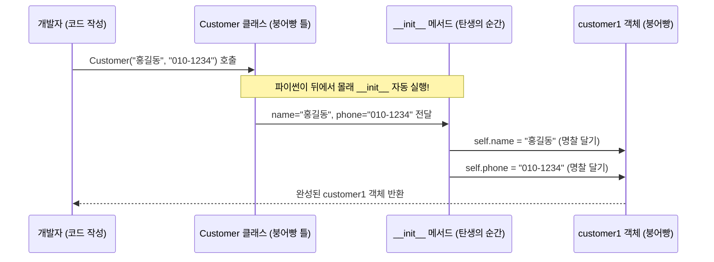

# 마이크로 세션: 087 — 속성과 메서드, 그리고 `__init__`

> **세션 ID**: MS-PY101-087  
> **소요 시간**: 25분  
> **난이도**: ★★☆ (medium)  
> **청크 타입**: narrative  
> **일정**: Day 5 AM  
> **버전**: v2.1 (7섹션 구조)

---

## §1. 개요

> **Day 5 | AM | 세션 087/096**

이 세션은 방금 전 세션에서 배운 빈 클래스라는 껍데기에 본격적으로 생명을 불어넣는 시간이에요. 우리가 `class Customer: pass`라는 한 줄로 세상에서 가장 단순한 클래스, 즉 '빈 붕어빵 틀'을 만들었잖아요? 하지만 솔직히 말해서 속이 텅 빈 붕어빵 틀만으로는 할 수 있는 게 아무것도 없어요. 

실제 프로그램에서 '고객'이라는 존재는 당연히 자기만의 이름이 있고, 전화번호가 있고, 이메일 주소를 가지고 있어야 합니다. 이런 데이터를 클래스 안에 채워 넣고, 나아가 "이 고객의 정보를 화면에 예쁘게 출력해 줘!"라는 행동까지 지시할 수 있어야 비로소 진짜 쓸모 있는 객체가 완성됩니다. 이번 시간에는 클래스에 내용물(속성)과 행동(메서드)을 담는 방법, 그리고 파이썬에서 가장 특별한 역할을 하는 `__init__` 함수에 대해 깊이 있게 알아볼 거예요.

### 🎯 학습 목표

이 세션이 끝나면 수강생은 다음을 할 수 있어요:

- `__init__` 특수 메서드를 사용하여 객체가 태어날 때 필요한 속성(데이터)을 정의할 수 있습니다.
- `self`의 개념을 정확히 이해하고, 수많은 객체 중에서 '자신'의 데이터를 다룰 수 있습니다.
- 객체가 스스로 수행할 수 있는 행동인 '메서드'를 작성하고 올바르게 호출할 수 있습니다.
- AI가 작성해 준 복잡한 클래스 코드를 볼 때, 제일 먼저 `__init__`을 찾아가 구조를 파악할 수 있습니다.

### 선행 세션 환기

바로 앞선 세션 086에서 우리는 클래스와 인스턴스의 개념을 붕어빵 비유로 배웠어요. 절차적으로 흩어져 있던 변수와 함수들을 하나로 묶어내는 마법의 시작점이었죠. 이제 그 붕어빵 틀에 맛있는 반죽과 앙금을 채워 넣을 차례입니다. "데이터와 행동을 하나로 묶어낸다"는 이전 세션의 핵심 메시지를 꼭 기억하면서 다음으로 넘어가 볼게요.

---

## §2. 핵심 개념 (+ 🗣️ 강사 대본 + Mermaid)

### 붕어빵 탄생의 순간과 명찰 달기

🗣️ **강사 대본 (Instructor Script)**:

> 앞서 배운 붕어빵 비유를 계속 이어가 볼까요? 붕어빵 아저씨가 빈 틀에 밀가루 반죽을 부을 때를 한번 머릿속에 떠올려 보세요. 아저씨는 반죽을 붓기 바로 직전에 아주 중요한 결정을 내립니다. "좋아, 이번엔 팥을 듬뿍 넣자!" 혹은 "이번 건 달콤한 슈크림으로 가자!" 하고 말이죠. 
> 
> 바로 이 결정의 순간, 다시 말해 붕어빵이 세상에 처음 '짠' 하고 태어나는 바로 그 찰나를 파이썬에서는 `__init__`이라는 아주 특별한 함수가 담당합니다. 이름이 조금 무섭게 생겼죠? 양쪽에 밑줄(underscore)이 두 개씩 붙어 있어서 개발자들은 이걸 "던더 이닛(dunder init, double underscore init)"이라고 읽어요. Initialize, 즉 "초기화하다", "처음으로 셋팅하다"라는 뜻을 담고 있습니다. 객체가 메모리에 처음 생성되는 바로 그 순간에 우리가 부르지 않아도 '자동으로' 실행되는 마법 같은 메서드예요.
>
> 그리고 여기서 진짜 중요한 개념이 하나 더 등장합니다. 붕어빵을 하루에 100개를 구우면 100개가 겉보기엔 전부 똑같은 모양이잖아요? 이 수많은 붕어빵들 속에서 "나는 팥 붕어빵이야!", "내 속에는 슈크림이 들어있어!"라고 서로를 구별하려면 어떻게 해야 할까요? 맞아요, 각자 자기 가슴에 명찰을 떡하니 달아야 합니다. 
>
> 파이썬에서 이 '명찰' 역할을 하는 녀석이 바로 `self`입니다. `self.name`이라고 코드를 쓰면 "내 이름은..."이라는 뜻이 되고, `self.phone`이라고 쓰면 "내 전화번호는..."이라는 뜻이 돼요. `self`는 수백, 수천 개의 인스턴스들 중에서 흔들림 없이 "바로 나 자신"을 가리키는 아주 강력한 대명사랍니다. 

### 클래스의 양대 산맥: 속성과 메서드

클래스 안에는 크게 두 가지가 들어갑니다. 하나는 '속성(Attribute)'이고 다른 하나는 '메서드(Method)'예요. 속성은 객체가 기억하고 있는 데이터, 즉 '상태'를 말해요. 고객의 이름이나 전화번호 같은 것들이죠. 반면에 메서드는 객체가 할 수 있는 행동, 즉 '동작'을 말합니다. "내 정보를 예쁘게 출력해!"라는 명령을 실행하는 함수가 바로 메서드예요. 여러분이 Day 3에서 배웠던 `def`로 정의하는 함수와 완전히 똑같이 생겼는데, 그저 클래스 안에 소속되어 있다는 이유 하나만으로 '메서드'라는 멋진 이름으로 불리는 거랍니다.

### AI 시대, `__init__`이 왜 중요할까?

> 여러분, AI 시대에 이 `__init__`이라는 지식이 왜 이토록 중요할까요? 나중에 실무에서 AI가 순식간에 짜준 100줄, 200줄짜리 복잡한 클래스 코드를 마주하게 될 거예요. 그때 당황하지 말고, 무조건 제일 먼저 `__init__` 함수를 찾아가세요. 거기에 이 객체가 처음 태어날 때 도대체 어떤 재료(데이터)들을 필요로 하는지가 아주 깔끔하게 한눈에 정리되어 있거든요. `__init__`은 AI가 짠 낯선 코드를 가장 빠르고 정확하게 파악하는 지름길이자 핵심 나침반입니다.

### Mermaid 다이어그램: 인스턴스의 탄생 과정



이 다이어그램은 우리가 코드로 `Customer("홍길동", ...)`을 부르는 순간, 내부적으로 어떤 마법이 일어나는지 보여줘요. 우리가 직접 부르지 않아도 파이썬이 몰래 `__init__`을 실행하고, 전달받은 데이터를 `self`라는 명찰을 통해 객체에 찰칵 붙여주는 과정을 눈으로 확인할 수 있죠.

---

## §3. 상세 내용

### Why — 왜 `__init__`과 `self`를 알아야 하는가?

빈 틀만으로는 현실 세계의 복잡한 문제를 해결할 수 없어요. 객체지향 프로그래밍의 진짜 묘미는 데이터(속성)와 그 데이터를 다루는 기능(메서드)을 하나의 안전한 캡슐 안에 묶어두는 데 있습니다. 이 캡슐을 처음 조립하고 초기 세팅을 하는 유일한 방법이 바로 `__init__`을 이해하는 것이며, 그 캡슐 안에서 내 데이터를 안전하게 꺼내 쓰는 열쇠가 바로 `self`입니다. 이 두 가지를 모르면 클래스를 단 한 줄도 제대로 활용할 수 없어요.

### What — 이 세션에서 다루는 것은 무엇인가?

코드 문법의 관점에서 가장 헷갈리기 쉬운 세 가지 핵심을 다룹니다.
1. **`__init__` 메서드**: 객체가 생성될 때 무조건, 자동으로 호출되는 초기화 전용 함수.
2. **`self` 키워드**: 클래스 내부의 모든 메서드가 반드시 첫 번째 매개변수로 받아야 하는 '나 자신'에 대한 참조.
3. **속성과 메서드의 정의**: `self.변수명`으로 속성을 정의하고, `def 메서드명(self):`로 기능을 정의하는 문법 구조.

### How — 구체적으로 어떻게 코드가 작동하는가?

🗣️ **강사 대본 (Instructor Script)**:

> 조금 전까지 비유로 설명했던 것들을 이제 진짜 파이썬 코드로 정리해 보겠습니다.
> 
> `__init__` 메서드는 인스턴스가 생성될 때 파이썬이 '자동으로' 호출해 주는 초기화 메서드예요. 여러분이 명심하실 점은, 우리가 직접 `customer1.__init__()`이라고 부르는 일은 평생 가도 없다는 겁니다. 그저 `Customer("홍길동", "010-1234")`라고 인스턴스를 새롭게 만들면, 파이썬이 뒤에서 조용히 `__init__`을 실행해 주는 구조예요.
>
> 여기서 초보자들이 가장 많이 하는 실수가 하나 있어요. 바로 `self` 때문인데요. `self`는 메서드의 첫 번째 매개변수 자리에 무조건 들어가야 합니다. 그런데 막상 메서드를 '호출'할 때는 이 `self` 자리에 우리가 값을 넣지 않아요. 파이썬이 알아서 `customer1`이라는 객체 자신을 첫 번째 인자로 쏙 넣어주거든요. 
>
> 헷갈리시죠? 딱 이 한 문장만 기억하시면 됩니다. **"정의할 때는 반드시 넣고, 호출할 때는 모른 척 빼라!"**
>
> 그리고 속성을 정의할 때는 무조건 `self.변수명 = 값` 형태로 씁니다. 예를 들어 `__init__` 안에서 `self.name = name`이라고 쓰면, "밖에서 누군가가 넘겨준 `name`이라는 값을, 이제부터 이 인스턴스의 고유한 `name` 속성으로 영구히 저장하겠다"는 뜻이에요. 이렇게 한 번 저장해 두면, 나중에 클래스 안의 어떤 메서드에서든 `self.name`이라고 부르기만 하면 이 값을 언제든 다시 꺼내 쓸 수 있답니다.

---

## §4. 실습 가이드 (+ 🎙️ 실습 대본)

### 실습 목표

이 실습의 목표는 백지상태에서 직접 코드를 치는 것이 아니라, AI 에이전트에게 명확한 프롬프트를 주어 속성과 메서드를 갖춘 완전한 클래스를 얻어내는 과정을 체험하는 거예요. AI가 만들어준 코드에서 `__init__`과 `self`가 어떻게 생겼는지 눈으로 직접 확인하고 실행해 봅니다.

🎙️ **실습 가이드 대본 (Lab Guide)**:

> 자, 이제 Antigravity 환경을 열어주세요. 우리가 직접 타이핑하는 대신, 우리의 똑똑한 조수 AI에게 지시를 내려보겠습니다. 프롬프트 창에 이렇게 입력해 보세요.
>
> *"Customer 클래스를 만들어줘. 이 클래스는 생성될 때 이름(name), 전화번호(phone), 이메일(email)을 속성으로 받아야 해. `__init__` 메서드를 사용해서 작성해 줘."*
>
> AI가 코드를 쭉쭉 뽑아내죠? 출력된 코드를 에디터에 복사해서 붙여 넣어 보세요. 자, 여기서 끝이 아닙니다. 행동도 하나 추가해 볼게요. 이어서 AI에게 이렇게 요청합시다.
>
> *"좋아, 이제 이 고객의 정보를 화면에 예쁘게 출력하는 `display()`라는 메서드도 클래스 안에 추가해 줘."*
>
> 코드가 완성되었나요? 이제 맨 아랫줄에 여러분의 이름으로 인스턴스를 하나 만들고 `display()`를 호출해 보세요. 실행 버튼을 눌렀을 때 여러분의 정보가 잘 출력되나요?
>
> 성공하셨다면 코드를 찬찬히 뜯어보세요. 속성을 정의하는 부분에서 왜 항상 `self.name = name`처럼 앞에 `self.`이 찰싹 붙어있는지, 이제 느낌이 오시나요? 아, 혹시라도 에러가 나신 분들은 `__init__` 스펠링을 확인해 보세요. 밑줄을 실수로 하나만 치셨다거나(`_init_`), 철자가 틀리면 파이썬은 초기화 함수로 인식하지 않습니다. 반드시 양쪽에 밑줄이 두 개씩(`__init__`) 있어야 해요!

### 단계별 지시

| 단계 | 소요 시간 | 강사 지시사항 | 학습자 액션 | 예상 결과 |
|------|----------|--------------|------------|----------|
| 1 | 3분 | "AI에게 Customer 클래스와 3가지 속성 작성을 요청하세요." | 프롬프트 입력 및 코드 복사 | `__init__`이 포함된 기본 클래스 구조 생성 |
| 2 | 3분 | "`display()` 메서드를 추가로 요청하세요." | 추가 프롬프트 입력 및 코드 수정 | 속성 출력 기능이 추가된 클래스 완성 |
| 3 | 4분 | "자신의 이름으로 인스턴스를 만들고 실행해 보세요." | 객체 생성 코드 작성 및 터미널 실행 | 개인 정보가 포맷팅되어 출력됨 |
| 4 | 5분 | "코드 리뷰: `self`가 어디어디 쓰였는지 형광펜 칠해보세요." | 에디터에서 `self` 키워드 위치 확인 | 정의부와 사용부의 `self` 역할 명확히 인지 |

### 트러블슈팅 FAQ

| Q | A |
|---|---|
| `TypeError: Customer() takes no arguments` 에러가 나요! | 십중팔구 `__init__`의 밑줄을 양쪽에 두 개씩 안 쓰고 하나씩만 썼거나 오타가 난 경우예요. 파이썬이 그냥 일반 메서드로 인식해 버린 겁니다. 밑줄 개수를 꼭 확인하세요! |
| `NameError: name 'name' is not defined` 에러가 납니다. | `display()` 메서드 안에서 출력할 때 `print(name)`이라고 쓰셨을 거예요. 클래스 안에서 자기 데이터를 꺼낼 때는 무조건 명찰을 달아야 합니다. `self.name`으로 고쳐주세요. |
| 메서드 호출할 때 `customer1.display(self)`처럼 써야 하나요? | 아뇨! "정의할 때는 넣고, 호출할 때는 빼라" 기억나시죠? 파이썬이 알아서 넣어주기 때문에 호출할 때는 그냥 괄호를 비워두고 `customer1.display()`라고만 쓰시면 됩니다. |

---


### 🎓 강사 노트 (Instructor Support)

- ⏱️ **타이밍**: 09:20 (25분, code)
- 🎯 **핵심 활동**: self, __init__ 구조
- ⚠️ **강사 주의사항**: self가 가장 헷갈리는 포인트

## §5. 코드 및 명령어 모음

아래 코드는 우리가 실습을 통해 완성한, 생명을 얻은 진짜 `Customer` 설계도입니다.

```python
class Customer:
    # 붕어빵이 태어나는 순간! (초기화 메서드)
    def __init__(self, name: str, phone: str, email: str) -> None:
        self.name = name      # 내 이름(속성)은 밖에서 받아온 name으로 할게!
        self.phone = phone    # 내 전화번호(속성) 설정
        self.email = email    # 내 이메일(속성) 설정

    # 이 객체가 할 수 있는 행동! (메서드)
    def display(self) -> None:
        # 내 정보를 꺼내 쓸 때도 항상 self. 명찰을 붙여야 해요.
        print(f"고객 정보: {self.name} | 📞 {self.phone} | ✉ {self.email}")


# 인스턴스 생성 — 드디어 붕어빵 굽기!
# 파이썬이 몰래 __init__을 호출해서 속성들을 셋팅해 줍니다.
customer1 = Customer("홍길동", "010-1234-5678", "hong@example.com")
customer2 = Customer("김철수", "010-9876-5432", "kim@example.com")

# 메서드 호출 — "정의할 땐 self를 넣지만, 호출할 땐 뺀다!"
customer1.display()  # 고객 정보: 홍길동 | 📞 010-1234-5678 | ✉ hong@example.com
customer2.display()  # 고객 정보: 김철수 | 📞 010-9876-5432 | ✉ kim@example.com
```

코드의 실행 흐름을 다시 한번 짚어보면, `Customer("홍길동", ...)`이라고 호출하는 그 짧은 순간에 파이썬은 번개처럼 `__init__`을 실행합니다. 그리고 `self.name`에 "홍길동"을, `self.phone`에 전화번호를 단단히 저장하죠. 이후 `customer1.display()`를 호출하면, 이때의 `self`는 완벽하게 `customer1` 객체 그 자체를 가리키게 되므로 `self.name`은 자연스럽게 "홍길동"이 되어 출력되는 원리입니다.

---

## §6. 요약

### 핵심 학습 포인트

오늘 배운 마법 같은 객체지향의 첫걸음, 딱 세 줄로 요약해 드립니다.
1. **탄생의 순간, `__init__`**: 인스턴스가 세상에 태어나는 바로 그 순간에 파이썬이 자동으로 실행해 주는 초기화 전용 특수 메서드입니다.
2. **나를 가리키는 명찰, `self`**: 수많은 객체 중에서 "바로 나 자신"을 가리키는 대명사이며, 클래스 내부에서 속성과 메서드를 단단하게 이어주는 필수 연결 고리입니다.
3. **클래스 안의 함수는 메서드**: 클래스 안에 들어간 함수는 무조건 첫 번째 매개변수로 `self`를 받아야 하며, 외부에서 호출할 때는 파이썬이 알아서 처리하므로 값을 넣지 않습니다.

### 다음 세션 예고

자, 이제 클래스의 설계도는 완벽하게 준비되었습니다. 속성도 넣었고, 멋진 출력 메서드도 만들었죠. 다음 세션(088)에서는 지금 배운 지식을 총동원해서 여러분의 책상 위에 있는 사물 하나를 골라 직접 클래스로 설계해 보는 "나만의 클래스 만들기 실습"을 진행하겠습니다. 내가 만든 설계도로 실제 객체들을 대량 생산하고, 독립적인 데이터가 정말로 섞이지 않고 잘 유지되는지 우리 눈으로 직접 확인해 볼 거예요!

### 브릿지 노트

> "여러분, 붕어빵에 드디어 팥과 슈크림을 듬뿍 넣었습니다. 빈 껍데기가 아니라 진짜 데이터와 생명을 가진 객체가 탄생했어요. `self`라는 녀석이 처음엔 좀 귀찮아 보일 수 있지만, 이 명찰 덕분에 데이터가 절대 섞이지 않는다는 걸 곧 깨닫게 되실 겁니다. 자, 그럼 이제 여러분이 직접 창조주가 되어볼 시간입니다. 다음 세션으로 넘어가서 나만의 객체를 마음껏 찍어내 볼까요?"

---

## §7. 참고 자료

### 3-Source 출처

- **Source A (로컬 참고자료)**: `8 코딩.pdf` (클래스 구조) — 클래스 내부 구조와 속성, 메서드 정의의 표준 문법 가이드를 제공합니다. `__init__`과 `self`의 기본 작동 원리를 참조했습니다.
- **Source B (NotebookLM)**: `day5_notebooklm.md` (속성과 메서드) — "초기화 메서드 `__init__`은 붕어빵 틀에 반죽을 붓는 첫 과정과 같다"는 비유와, `self`를 '나 자신'으로 해석하는 교육적 비유의 핵심 소스입니다.
- **Source C (Deep Research)**: `day5_deep_research.md` (클래스와 인스턴스) — OOP for Absolute Beginners 관점에서 `self`의 필요성과 데이터 캡슐화의 아주 기초적인 개념을 차용하여 강사 대본의 흐름을 보강했습니다.

### 추가 학습 자료

- [파이썬 공식 문서: Classes](https://docs.python.org/ko/3/tutorial/classes.html) — 파이썬의 클래스 메커니즘과 특수 메서드에 대한 가장 정확한 원본 설명입니다.
- [AI를 활용한 코드 리딩 기법 가이드](../참고자료/AI_코드리딩_가이드.md) — 낯선 코드를 만났을 때 `__init__`부터 찾아가서 구조를 파악하는 실전 팁이 담긴 자료입니다.

### 강사 노트

> 💡 **강사 노트**: 이번 세션은 객체지향의 첫 번째 큰 허들인 `self`를 넘어가는 아주 중요한 구간입니다. 수강생들은 함수(`def`)에는 익숙해졌지만, 갑자기 모든 함수 첫머리에 `self`가 붙는 것에 큰 이질감을 느낍니다. 따라서 문법적 설명보다는 "100개의 붕어빵을 구별하기 위한 각자의 명찰"이라는 비유를 집요할 정도로 반복해 주시는 것이 좋습니다. 
>
> 또한, "AI 코드에서 `__init__`이 가지는 의미(빠른 파악의 지름길)"를 짚어주면 수강생들의 집중도가 크게 올라갑니다. '내가 이걸 왜 배워야 하지?'에 대한 확실한 실무적 명분을 제공하기 때문입니다.

---

## ✅ 세션 완료 체크리스트 (강사용)

- [x] §1~§7 모든 섹션이 충실하게 작성되었는가? (150줄 이상 충족)
- [x] 붕어빵 탄생 비유와 `self` 명찰 비유가 구어체로 잘 전달되었는가?
- [x] Mermaid 다이어그램이 정상적으로 렌더링되며 객체 생성 흐름을 잘 보여주는가?
- [x] AI 시대에 `__init__`을 읽는 것이 왜 중요한지(코드 리딩 관점) 강조되었는가?
- [x] 3-Source 팩트 패킷 내용(Source A, B, C)이 빠짐없이 적절히 매핑되었는가?

---

*작성 일시: 2026-02-25*  
*작성 에이전트: A4B_Session_Writer*  
*교안 구조: 7섹션 (A0 팀 공통 표준)*